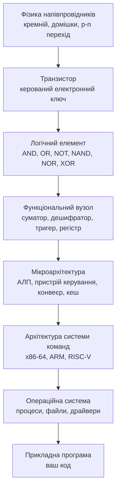
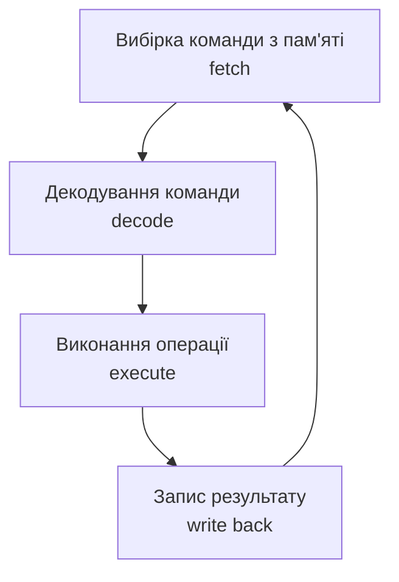

# Вступ до комп'ютерної схемотехніки та її роль в ІТ

> [!abstract] Коротко
> Ця перша лекція відповідає на питання, яке студент ставить собі чесно й одразу: навіщо мені знати, як усередині влаштоване залізо, якщо програму я пишу мовою високого рівня і вона й так працює. Ми пройдемо всю вежу абстракцій – від атома кремнію до рядка вашого коду, – з'ясуємо, чим схемотехніка відрізняється від архітектури комп'ютера, чому цифрова техніка витіснила аналогову і чому вона рахує саме у двійковій системі. Ми познайомимося з транзистором, логічним елементом і моделлю фон Неймана – трьома поняттями, навколо яких обертатиметься весь курс. А наприкінці складемо карту дисципліни, щоб ви розуміли не лише те, куди ми йдемо найближчі місяці, а й навіщо потрібен кожен крок цього шляху.

## Навчальні цілі заняття

- **Знати:** визначення комп'ютерної схемотехніки та архітектури комп'ютера і різницю між ними; різницю між архітектурою системи команд і мікроархітектурою; рівні абстракції обчислювальної системи; переваги цифрового зображення сигналу над аналоговим; поняття біта, байта, позиційної системи числення; принцип роботи транзистора як ключа; поділ цифрових схем на комбінаційні, послідовнісні та пам'ять; принцип збереженої програми та склад моделі фон Неймана.
- **Вміти:** пояснити, які саме особливості заліза проявляються в поведінці прикладної програми; переводити числа між десятковою, двійковою та шістнадцятковою системами й перевіряти себе зворотним переведенням; визначити за описом схеми, комбінаційна вона чи послідовнісна; пояснити, у чому полягає вузьке місце фон Неймана й якими архітектурними засобами з ним борються.

## План лекції

1. Абстракції течуть, і саме тому ця дисципліна існує
2. Схемотехніка й архітектура: дві половини однієї назви
3. Рівні абстракції: від кремнію до застосунку
4. Аналогове й цифрове: чому обчислення стали дискретними
5. Біт, байт і системи числення
6. Транзистор: єдина цеглина, з якої зроблено все
7. Логічні елементи: перший погляд
8. Три кити цифрової схемотехніки
9. Архітектура фон Неймана: скелет, на який усе нанизано
10. Карта курсу й де все це знадобиться

## 1. Абстракції течуть, і саме тому ця дисципліна існує

Почнімо з незручного питання, яке варто поставити вголос на самому початку, бо інакше воно все одно висітиме в аудиторії до кінця семестру. Ви пишете код мовою високого рівня. Ви оголошуєте змінну, і вона просто з'являється. Ви пишете цикл, і він просто виконується. Ви створюєте масив на мільйон елементів, і він просто існує. Жодного разу за весь час навчання програмуванню вам не довелося замислитися, у якій саме комірці пам'яті лежить ваша змінна, скільки електричних сигналів пробігло дротом, поки виконувався ваш цикл, і що взагалі фізично відбулося всередині корпусу, коли ви натиснули «Запустити». Усе це від вас старанно приховано – і приховано навмисно, бо саме в цьому й полягає сенс мов високого рівня.

Механізм, що ховає складність нижнього рівня за простим і зручним інтерфейсом верхнього, називають **абстракцією**. Абстракції – найпотужніший винахід усієї інженерії програмного забезпечення: завдяки їм одна людина може за годину написати програму, для роботи якої мусять узгоджено спрацювати десятки мільярдів транзисторів, і при цьому не знати про існування жодного з них. Без абстракцій сучасне програмування було б просто фізично неможливим.

Але в абстракцій є одна невтішна властивість, з якою рано чи пізно стикається кожен практикуючий інженер: **абстракції течуть**. Тобто в певний момент деталі нижнього рівня, які абстракція обіцяла назавжди від вас сховати, раптом протікають нагору і починають визначати поведінку вашої програми – а ви не маєте жодного пояснення, чому вона поводиться саме так. І поки ви не спуститеся на рівень нижче, ви не тільки не виправите проблему – ви навіть не зрозумієте, що саме сталося.

Розгляньмо чотири конкретні ситуації, з якими стикається кожен, хто пише реальний код. Кожна з них здається містикою – і кожна пояснюється матеріалом цього курсу.

**Ситуація перша.** Ви пишете два майже однакові цикли, які обходять двовимірний масив розміром, скажімо, 5000 на 5000 і додають усі його елементи. Перший цикл іде по рядках, другий – по стовпцях. Математично це та сама операція над тими самими даними: однакова кількість додавань, однакова кількість звертань до пам'яті. Ви вимірюєте час – і виявляється, що один варіант працює у кілька разів повільніше за інший. Ніякої помилки в коді немає, алгоритм ідентичний.

Пояснення лежить у тому, як влаштована ієрархія пам'яті. Процесор ніколи не читає з оперативної пам'яті один байт: він читає одразу цілий блок сусідніх байтів (так званий рядок кешу, зазвичай 64 байти) і кладе його в надшвидку кеш-пам'ять поруч із ядром. Обхід по рядках читає дані рівно так, як вони фізично лежать у пам'яті, і кожен завантажений блок використовується повністю – 64 байти прочитали, 64 байти й знадобилися. Обхід по стовпцях щоразу бере з блока один-єдиний потрібний елемент, а решту 60 із гаком байтів викидає – і змушений робити в десятки разів більше звертань до повільної пам'яті. Ми детально розберемо це в [[courses/computer-architecture/lectures/19-keshpamiat-ta-virtualna-pamiat|Лекція 19. Кешпам'ять та віртуальна пам'ять]].

**Ситуація друга.** Ви пишете найбанальніший рядок коду, який складає `0.1` і `0.2` і порівнює результат із `0.3`. Порівняння повертає «хибно». Ви перевіряєте ще раз, друкуєте результат – і бачите щось на кшталт `0.30000000000000004`. Це не помилка мови програмування і не баг компілятора: це прямий наслідок того, що дробові числа зберігаються у скінченній кількості двійкових розрядів, а число 0,1 у двійковій системі – нескінченний періодичний дріб, так само як 1/3 у звичній нам десятковій. Комп'ютер зберігає не саме число, а найближче до нього значення, яке взагалі можна закодувати наявними бітами. Зрозуміти це неможливо, не розібравшись спершу в тому, як узагалі число перетворюється на набір бітів, – а це вже наша сьогоднішня тема.

**Ситуація третя.** Ви розпаралелюєте обчислення на вісім потоків, запускаєте на восьмиядерному процесорі й очікуєте прискорення у вісім разів. Отримуєте – у два з половиною. Причин тут кілька, і всі вони апаратні: частина алгоритму принципово послідовна і не пришвидшується взагалі; потоки борються за спільну шину пам'яті; ядра змушені постійно узгоджувати між собою вміст своїх кешів, і ця «бухгалтерія» коштує тактів. Ми повернемося до цього у [[courses/computer-architecture/lectures/12-bahatoiaderni-protsesory-ta-paralelni|Лекція 12. Багатоядерні процесори та паралельні обчислення]].

**Ситуація четверта.** Ваш застосунок на смартфоні працює правильно, але за годину роботи з'їдає половину заряду, а конкурентний застосунок із тією ж функціональністю – п'ять відсотків. Причина знову апаратна: сучасні мобільні процесори більшу частину часу проводять у глибоких енергоощадних станах, і кожне «зайве» пробудження коштує непропорційно дорого – не стільки самою роботою, скільки виходом зі сну й поверненням у сон. Про це – [[courses/computer-architecture/lectures/16-enerhozberezhennia-ta-optymizatsiia|Лекція 16. Енергозбереження та оптимізація апаратних систем]].

Спільне в усіх чотирьох історіях одне. Це не помилки, не баги і не примхи мови програмування. Це деталі будови заліза, що протекли крізь усі шари абстракцій прямо у ваш код. І поки ви не маєте карти того, що лежить під цими шарами, ви приречені сприймати такі речі як магію – а інженер, який вірить у магію, не може ані знайти причину проблеми, ані свідомо обрати краще рішення. Цей курс і є такою картою.

> [!info] Для допитливих
> Термін «закон протікаючих абстракцій» (the law of leaky abstractions) увів програміст Джоел Спольські у 2002 році, сформулювавши його гранично коротко: всі нетривіальні абстракції певною мірою протікають. З цього випливає парадоксальний, але дуже практичний висновок: абстракції економлять нам час на **написання** коду, але не економлять час на його **вивчення** – щоб упевнено працювати на верхньому рівні, доводиться все одно розбиратися в тому, що відбувається на нижньому.

## 2. Схемотехніка й архітектура: дві половини однієї назви

Наша дисципліна називається довго – «Комп'ютерна схемотехніка та архітектура комп'ютерів», – і ця довга назва не випадкова. У ній склеєно дві споріднені, але різні інженерні дисципліни, і плутати їх не варто з самого початку.

> [!definition] Визначення
> **Комп'ютерна схемотехніка** – галузь, що вивчає принципи побудови, аналізу та синтезу цифрових електронних схем: як з елементарних перемикачів скласти вузол, що виконує потрібну логічну чи арифметичну функцію.

> [!definition] Визначення
> **Архітектура комп'ютера** – сукупність принципів організації обчислювальної системи в цілому: які функціональні блоки вона містить, як вони взаємодіють між собою і які можливості система надає програмісту.

Різницю зручно пояснити будівельною аналогією. Схемотехніка – це наука про те, як із цегли, розчину й арматури скласти надійну стіну: які матеріали за яких умов працюють, як їх з'єднувати, де виникне тріщина. Архітектура – це план будинку: скільки поверхів, де несучі стіни, як розташовані кімнати, куди веде сходова клітка. Обидві дисципліни потрібні, і жодна не замінює іншу: ідеально складена стіна не врятує будинок із безглуздим планом, а геніальний план не втілиться, якщо мурування розсиплеться.

Є ще одне розрізнення, дуже важливе практично, і про нього ми говоритимемо весь курс. Усередині самої архітектури прийнято відділяти **архітектуру системи команд** від **мікроархітектури**.

Архітектура системи команд (англійською instruction set architecture, скорочено ISA) – це те, що бачить програміст: перелік машинних команд, набір регістрів, способи адресації пам'яті, правила роботи з перериваннями. Це, по суті, контракт між залізом і програмним забезпеченням. Мікроархітектура – це те, як конкретний виробник узявся цей контракт реалізувати всередині кристала: скільки в процесора стадій конвеєра, які розміри кешів, чи вміє він передбачати переходи, скільки команд запускає одночасно.

> [!example] Приклад
> Процесори Intel Core і AMD Ryzen мають ту саму архітектуру системи команд – x86-64. Саме тому та сама скомпільована програма без жодних змін запускається і там, і там: контракт однаковий. Але мікроархітектури в них абсолютно різні – різна кількість стадій конвеєра, різна організація кешів, різні блоки передбачення переходів, різне фізичне компонування кристала. Контракт один, реалізації дві, і за швидкістю на конкретній задачі вони можуть відрізнятися помітно.

Це розрізнення пояснює й зворотну ситуацію: програма, скомпільована під x86-64, не запуститься на процесорі ARM вашого смартфона, хоча обидва процесори роблять принципово те саме – виконують команди над даними. Контракти в них різні, тобто це різні мови, а не різні акценти однієї мови. Порівнянню цих двох світів присвячена [[courses/computer-architecture/lectures/11-arkhitektury-risc-ta-cisc-porivniannia-ta|Лекція 11. Архітектури RISC та CISC, порівняння та застосування]].

> [!warning] Типова помилка
> Часто кажуть «архітектура процесора», маючи на увазі то одне, то інше, і через це виникає плутанина. Коли говорять «архітектура ARM» – мають на увазі **систему команд**. Коли говорять «архітектура Zen 4» або «архітектура Golden Cove» – мають на увазі **мікроархітектуру**, тобто внутрішню будову конкретного покоління кристалів. Звикайте розрізняти ці два вживання за контекстом: на іспиті це питання ставлять майже завжди.

## 3. Рівні абстракції: від кремнію до застосунку

Тепер зберемо всю картину в один малюнок. Комп'ютер – це вежа абстракцій, у якій кожен наступний рівень побудований з елементів попереднього і повністю ховає його від того, хто стоїть вище.

Пройдімо цією вежею знизу вгору, бо саме в такому порядку ми йтимемо весь семестр.

**Найнижчий рівень – фізика напівпровідників.** Тут працюють хіміки й фізики: надчистий кремній, керовані домішки, які роблять матеріал провідним по-різному, p-n переходи, що пропускають струм лише в один бік. Цей рівень у нашому курсі ми не вивчаємо – приймаємо його результат як даність. Але варто хоча б раз побачити, з чого фізично починається обчислювальна техніка.

![[attachments/ksak-l01-plastyna.jpg|560]]
*Кремнієва пластина діаметром 300 мм – на такій одночасно виготовляють сотні майбутніх кристалів, які потім розріжуть і запакують у корпуси. Уся вежа абстракцій, про яку йдеться в цій лекції, починається саме тут. Джерело: Peellden, CC BY-SA 3.0, [Wikimedia Commons](https://commons.wikimedia.org/wiki/File:12-inch_silicon_wafer.jpg).*

**Другий рівень – транзистор.** Це той самий p-n перехід, оформлений так, що ним можна керувати: слабкий сигнал на одному виводі вмикає або вимикає струм між двома іншими. По суті – електронний вимикач без рухомих частин, що спрацьовує мільярди разів на секунду. Це і є та єдина цеглина, з якої зроблено все інше.

**Третій рівень – логічний елемент.** Кілька транзисторів, з'єднаних певним чином, дають схему, що обчислює найпростішу логічну функцію: «і», «або», «не». Саме тут електрика вперше перетворюється на логіку, а напруга починає означати «істина» або «хиба». Цьому присвячена [[courses/computer-architecture/lectures/03-lohichni-elementy-and-or-not-nand-nor-xor|Лекція 3. Логічні елементи, AND, OR, NOT, NAND, NOR, XOR]].

**Четвертий рівень – функціональний вузол.** З десятків логічних елементів складається схема, що вміє щось осмислене: додати два двійкові числа, вибрати один сигнал із шістнадцяти, запам'ятати один біт і зберігати його, поки не скажуть змінити. Це [[courses/computer-architecture/lectures/05-kombinatsiini-skhemy-sumatory-deshyfratory|Лекція 5. Комбінаційні схеми, суматори, дешифратори, мультиплексори]] і [[courses/computer-architecture/lectures/06-poslidovnisni-skhemy-tryhery-rehistry|Лекція 6. Послідовнісні схеми, тригери, регістри, лічильники]].

**П'ятий рівень – мікроархітектура.** З функціональних вузлів збирається процесор: арифметико-логічний пристрій, регістровий файл, пристрій керування, конвеєр, кеші. Тут ми говоримо вже не про окремі біти, а про потік команд.

**Шостий рівень – архітектура системи команд.** Той самий контракт із програмістом, про який ми щойно говорили.

**Сьомий і восьмий рівні – операційна система і прикладна програма.** Вони вивчаються в інших дисциплінах – див. [[courses/operating-systems|Операційні системи]], – але саме вони спираються на все, що нижче.

Наш курс займає рівні з другого по шостий. Ми починаємо з транзистора й піднімаємося до архітектури системи в цілому – і робимо це саме знизу вгору, бо кожен наступний рівень неможливо чесно зрозуміти, не розібравшись у попередньому.

> [!warning] Типова помилка
> Найпоширеніша помилка початківця – вважати, що ці рівні існують у природі самі собою. Жодного з них немає у фізичному світі: у кристалі кремнію немає ні «логічних елементів», ні «команд», ні «процесів» – там є лише електрони й напруги. Усі рівні вежі придумали й побудували інженери, поступово, за сімдесят років. Саме тому їх можна зрозуміти повністю, без залишку: за кожним рівнем стоїть чиєсь конкретне інженерне рішення, а не таємниця природи.

## 4. Аналогове й цифрове: чому обчислення стали дискретними

Слово «цифрова» в назві предмета теж узялося не з повітря. Перша половина двадцятого століття була епохою аналогової електроніки, і в неї були всі шанси залишитися основною. Розберімося, чому цього не сталося.

**Аналоговий сигнал** – це напруга (чи струм), яка може набувати будь-якого значення в неперервному діапазоні і яка своєю величиною безпосередньо зображає фізичну величину: гучність звуку, яскравість світла, температуру. Три вольти означають одну гучність, три цілих одна десята вольта – трохи іншу, і між ними – нескінченна кількість проміжних значень. Це дуже природний спосіб зображати світ, бо світ і справді неперервний.

**Цифровий сигнал** влаштований принципово інакше: домовлено, що осмислених станів лише два, і кожному з них відповідає не одне значення напруги, а цілий діапазон.

На перший погляд це виглядає як програш: ми викинули майже всю інформацію, залишивши з нескінченної кількості можливих значень лише два. Але саме тут і криється вирішальна перевага, і називається вона **завадостійкістю**.

У реальному дроті завжди присутній шум: наведення від сусідніх провідників, теплові флуктуації, перешкоди від блока живлення, електромагнітний фон. Для аналогового сигналу будь-який шум – це безповоротне спотворення корисної інформації: якщо до трьох вольт додалося 0,1 В шуму, ви більше ніколи не дізнаєтеся, що там було саме три, а не 3,1. І найгірше – шум **накопичується**: на кожному етапі передачі, підсилення чи копіювання додається новий, і після десяти етапів від корисного сигналу залишається каша.

Для цифрового сигналу той самий шум у 0,1 В не означає нічого. Схема, що приймає такий сигнал, не намагається виміряти його точно: вона лише порівнює його з порогом і відповідає на єдине питання – вище чи нижче. А далі відбувається головне: на своєму виході вона видає **свіжий, ідеально чистий** рівень нуля або одиниці, повний розмах напруги, без жодного сліду шуму, що прийшов на вхід. Це називається **регенерацією сигналу**, і саме завдяки їй похибка в цифровій техніці не накопичується взагалі.

![[attachments/ksak-l01-analog-cyfra.svg|760]]
*Ключова відмінність двох світів. Аналоговий сигнал деградує з кожним копіюванням безповоротно; цифровий теж збирає шум, але кожен логічний елемент відновлює чисті рівні, тому після третього копіювання схема бачить ті самі нулі й одиниці, що й після першого. Схема створена для цієї лекції.*

> [!example] Приклад
> Якщо переписати аудіокасету на іншу касету, потім ту на третю і так далі, то вже після десятка перезаписів запис перетворюється на нерозбірливе шипіння: кожне копіювання додавало власний шум до вже накопиченого. Якщо ж скопіювати музичний файл на флешку, звідти на диск, звідти на інший комп'ютер і так сто разів поспіль, останній файл буде **побітово ідентичний** першому. Не «майже таким самим», не «майже без втрат» – точнісінько тим самим. Уся цифрова цивілізація – стримінг, месенджери, банківські перекази, резервні копії – стоїть саме на цій властивості.

### 4.1 Рівні напруги й заборонена зона

Тепер конкретика. Домовленість про два стани оформлюється як розбиття діапазону напруги живлення на три частини. Візьмімо класичну п'ятивольтову логіку: усе, що нижче приблизно 0,8 В, вважається логічним нулем; усе, що вище приблизно 2 В, – логічною одиницею; проміжок між ними оголошено **забороненою зоною**, у якій сигнал не має затримуватися.

![[attachments/ksak-l01-rivni-signalu.svg|720]]
*Логічний рівень – це діапазон, а не одне конкретне значення напруги. Відстань від межі діапазону до порогу і є запасом завадостійкості: доки шум не виводить сигнал у заборонену зону, схема читає той самий біт. Схема створена для цієї лекції.*

> [!warning] Типова помилка
> Не варто думати, що логічний нуль – це «рівно нуль вольт», а одиниця – «рівно п'ять вольт». Це **діапазони**, і саме факт, що це діапазони, а не точки, робить усю цифрову техніку працездатною. Реальна напруга на реальному дроті ніколи не дорівнює рівно нулю.

Варто додати, що напруги живлення з роками стрімко знижувалися: п'ять вольт у вісімдесятих, три цілих три десятих у дев'яностих, сьогодні ядро процесора живиться напругою близько одного вольта і менше. Причина суто фізична: енергія, що витрачається на перемикання, пропорційна **квадрату** напруги, тож зниження живлення вдвічі зменшує споживання приблизно вчетверо. Плата за це – вужчі діапазони й менший запас завадостійкості, тому сучасні схеми проєктувати складніше, ніж схеми сорокарічної давнини. Ми повернемося до цього в [[courses/computer-architecture/lectures/16-enerhozberezhennia-ta-optymizatsiia|Лекція 16. Енергозбереження та оптимізація апаратних систем]].

### 4.2 Чому саме два рівні

Залишається питання: чому саме два, а не десять? Адже десятковий комп'ютер здавався б людині зручнішим. Причин дві, і обидві інженерні. По-перше, чим більше рівнів ми втискаємо в той самий діапазон напруги, тим вужчими стають проміжки між ними – і тим менший шум здатний зіпсувати сигнал: завадостійкість падає різко. По-друге, транзистор природно й дуже надійно працює саме в двох крайніх режимах – повністю відкритий і повністю закритий; підтримувати проміжні стани точно й стабільно набагато складніше й дорожче.

![[attachments/ksak-l01-setun.png|560]]
*ЕОМ «Сетунь» (1959) – серійна машина, що працювала не у двійковій, а у трійковій системі числення з симетричними станами −1, 0, +1. Технічно вона працювала, але промисловість уже розвивала двійкову елементну базу, і трійкова гілка залишилася історичною цікавинкою. Джерело: Sputnik, суспільне надбання, [Wikimedia Commons](https://commons.wikimedia.org/wiki/File:Setun_computer,_from_Sputnik_in_1959.png).*

> [!info] Для допитливих
> Трійкова система мала й теоретичні переваги: зокрема, симетричні стани −1, 0, +1 дозволяють зображати від'ємні числа без окремого знакового розряду й без хитрощів на кшталт доповняльного коду, який нам ще належить вивчити. Історія «Сетуні» – хороша ілюстрація того, що перемагає не завжди технічно найкрасивіше рішення: перемагає те, під яке вже налагоджено масове виробництво.

## 5. Біт, байт і системи числення

Ми з'ясували, що комп'ютер оперує двома станами. Настав час дати цьому імена й навчитися рахувати.

> [!definition] Визначення
> **Біт** (від англійського binary digit – двійкова цифра) – мінімальна одиниця інформації, що може набувати одного з двох значень: 0 або 1. Один біт – це відповідь на одне питання «так чи ні».

Одного біта вистачає рівно на два стани, тож самотній біт мало на що придатний. Але біти легко об'єднувати, і тут працює просте правило: кожен доданий біт **подвоює** кількість станів, які можна закодувати. Два біти дають чотири комбінації, три – вісім, чотири – шістнадцять. Загалом $n$ бітів дають $2^n$ різних значень.

| Кількість бітів | Кількість значень | Що зазвичай кодують |
|---|---|---|
| 1 | 2 | так / ні, увімкнено / вимкнено |
| 4 | 16 | одна шістнадцяткова цифра |
| 8 (байт) | 256 | символ, число від 0 до 255 |
| 16 | 65 536 | символ Unicode, номер порту |
| 32 | ≈ 4,3 мільярда | IPv4-адреса, звичайне ціле число |
| 64 | ≈ 1,8 · 10¹⁹ | адреса пам'яті, велике ціле число |

Вісім бітів об'єднують у **байт** – базову одиницю, якою оперує майже вся комп'ютерна техніка. Число вісім тут не має жодного глибокого математичного обґрунтування: це історична конвенція, що остаточно закріпилася в шістдесятих роках із появою серії IBM System/360, де байт зробили восьмибітним, бо цього якраз вистачало на один символ тодішнього набору. Так вісімка й залишилася галузевим стандартом на всі наступні десятиліття.

### 5.1 Двійкова система числення

Звична нам десяткова система – **позиційна**: значення цифри залежить від її місця в записі. У числі 345 трійка означає три сотні, бо стоїть у позиції з вагою 10², четвірка – чотири десятки (вага 10¹), п'ятірка – п'ять одиниць (вага 10⁰).

Двійкова система влаштована абсолютно так само, тільки основа не десять, а два, і цифр лише дві. Ваги розрядів – степені двійки: 1, 2, 4, 8, 16, 32, 64, 128 і далі.

Візьмімо двійкове число 10101101 і переведімо його в десяткове. Розписуємо ваги, множимо кожну на відповідну цифру й додаємо:

| Вага розряду | 128 | 64 | 32 | 16 | 8 | 4 | 2 | 1 |
|---|---|---|---|---|---|---|---|---|
| Цифра | 1 | 0 | 1 | 0 | 1 | 1 | 0 | 1 |
| Внесок | 128 | 0 | 32 | 0 | 8 | 4 | 0 | 1 |

Сума: 128 + 32 + 8 + 4 + 1 = **173**.

Тепер зворотна операція – переведімо 173 у двійкову систему. Найнадійніший спосіб – послідовне ділення на два із записом остач:

| Ділене | Частка | Остача |
|---|---|---|
| 173 | 86 | 1 |
| 86 | 43 | 0 |
| 43 | 21 | 1 |
| 21 | 10 | 1 |
| 10 | 5 | 0 |
| 5 | 2 | 1 |
| 2 | 1 | 0 |
| 1 | 0 | 1 |

Тепер найважливіший момент, на якому спотикаються майже всі: остачі читаються **знизу вгору**, від останньої до першої. Отримуємо 10101101 – рівно те, з чого починали. Перевірка зійшлася.

> [!warning] Типова помилка
> Записати остачі в тому порядку, у якому вони виходили (згори вниз), і отримати 10110101 замість 10101101. Це найчастіша помилка на контрольних із цієї теми. Просте правило самоперевірки: остання остача завжди дорівнює одиниці й завжди стає **старшим** розрядом результату. Якщо ваш результат починається з нуля – ви точно щось переплутали.

Окремо зауважмо, наскільки простою стає арифметика у двійковій системі. Таблиця додавання складається з чотирьох рядків, і вивчити її можна за пів хвилини:

| A | B | Сума | Перенесення |
|---|---|---|---|
| 0 | 0 | 0 | 0 |
| 0 | 1 | 1 | 0 |
| 1 | 0 | 1 | 0 |
| 1 | 1 | 0 | 1 |

Саме через цю простоту двійкова арифметика так добре лягає на залізо: усю таблицю можна реалізувати кількома логічними елементами. Схема, що її втілює, називається півсуматором, і ми зберемо її власноруч у [[courses/computer-architecture/lectures/05-kombinatsiini-skhemy-sumatory-deshyfratory|Лекція 5. Комбінаційні схеми, суматори, дешифратори, мультиплексори]].

### 5.2 Шістнадцяткова система: навіщо вона

Двійковий запис чесний, але нестерпно довгий: адреса пам'яті в ньому займає 64 символи, у яких неможливо втримати погляд і зовсім легко загубити один розряд. Тому на практиці всюди використовують **шістнадцяткову** систему з основою 16 і цифрами 0–9 та A–F, де A означає десять, B – одинадцять і так до F, що означає п'ятнадцять.

Причина популярності суто механічна і в цьому дуже красива: шістнадцять – це два в четвертому степені, тому **одна шістнадцяткова цифра відповідає рівно чотирьом бітам**, завжди й без винятків. Це означає, що перевести число з двійкової системи в шістнадцяткову можна взагалі без обчислень: розбити двійковий запис на четвірки справа наліво й замінити кожну четвірку відповідним символом.

| Десяткове | Двійкове | Шістнадцяткове |
|---|---|---|
| 0 | 0000 | 0 |
| 1 | 0001 | 1 |
| 2 | 0010 | 2 |
| 3 | 0011 | 3 |
| 4 | 0100 | 4 |
| 5 | 0101 | 5 |
| 6 | 0110 | 6 |
| 7 | 0111 | 7 |
| 8 | 1000 | 8 |
| 9 | 1001 | 9 |
| 10 | 1010 | A |
| 11 | 1011 | B |
| 12 | 1100 | C |
| 13 | 1101 | D |
| 14 | 1110 | E |
| 15 | 1111 | F |

Повернімося до нашого 10101101. Розбиваємо на четвірки: `1010` і `1101`. За таблицею це A і D. Отже, 173 = 10101101₂ = **AD₁₆**, або, у прийнятому в програмуванні записі, `0xAD`. Перевіримо: A – це 10, тож 10 · 16 + 13 = 160 + 13 = 173. Зійшлося.

> [!example] Приклад
> Шістнадцяткові числа оточують вас щодня, навіть якщо ви цього не помічали. Колір `#FF8800` у CSS – це три байти: FF (255) червоного, 88 (136) зеленого, 00 синього. MAC-адреса мережевої карти на кшталт `00:1B:44:11:3A:B7` – шість байтів у шістнадцятковому записі. Код помилки Windows `0xC0000005` – це чотирибайтове число, у якому кожен фрагмент має свій зміст. Дамп пам'яті в налагоджувачі, контрольна сума файлу, ключ шифрування – усе це шістнадцятковий запис, обраний рівно тому, що він компактний і легко перекладається в біти.

> [!warning] Типова помилка
> Плутати кілобайт із кібібайтом. Історично склалося, що «кілобайт» у комп'ютерній техніці часто означає 1024 байти (це 2¹⁰), а не 1000, бо саме степені двійки природні для адресації пам'яті. Через це виробники накопичувачів, які рахують чесними десятковими тисячами, продають вам диск на «1 ТБ», а операційна система показує близько 931 ГБ – і жодного обману тут немає, просто дві різні одиниці з майже однаковими назвами. Щоб розрізняти їх, стандарт запровадив назви кібібайт (КіБ, 1024) і мебібайт (МіБ), але у побуті вони приживаються погано.

## 6. Транзистор: єдина цеглина, з якої зроблено все

Тепер спустімося на найнижчий рівень, який нас цікавить, і подивімося, з чого фізично складається вся вежа. Детально ми розберемо це в [[courses/computer-architecture/lectures/03-lohichni-elementy-and-or-not-nand-nor-xor|Лекція 3. Логічні елементи, AND, OR, NOT, NAND, NOR, XOR]], а зараз важливо схопити саму ідею.

**Транзистор** у цифровій схемотехніці працює не як підсилювач (хоч і вміє), а як **керований ключ**. У нього три виводи: два силові, між якими струм або тече, або ні, і один керуючий. Подали на керуючий вивід напругу – ключ замкнувся, струм пішов. Прибрали напругу – ключ розімкнувся. Жодних рухомих частин, жодного зношування, час перемикання – частки наносекунди.

У сучасних мікросхемах використовують польові транзистори двох взаємодоповнювальних типів, які прийнято називати n-канальними та p-канальними: перший відкривається високою напругою на затворі, другий – низькою, тобто вони поводяться протилежно. Якщо з'єднати їх у пару так, щоб у будь-який момент був відкритий рівно один із двох, вийде схема, яка **у стані спокою майже не споживає струму**: наскрізного ланцюга від живлення до землі просто немає, бо один із ключів завжди розімкнений. Струм тече лише в короткі моменти перемикання. Ця технологія називається КМОП (комплементарна структура метал-оксид-напівпровідник), і саме її енергетична ощадливість зробила можливими і ноутбуки, і смартфони.

![[attachments/ksak-l01-kmop.png|360]]
*Найпростіша КМОП-схема – інвертор, тобто логічне заперечення, з усього двох транзисторів. Верхній p-канальний відкривається, коли на вході нуль, і підтягує вихід до живлення; нижній n-канальний відкривається, коли на вході одиниця, і притягує вихід до землі. Відкритий завжди рівно один – тому наскрізного струму немає. Джерело: Abaddon1337, CC BY-SA 3.0, [Wikimedia Commons](https://commons.wikimedia.org/wiki/File:CMOS_inverter.svg).*

Тепер про масштаби, бо саме вони справляють найсильніше враження. Перший комерційний мікропроцесор Intel 4004, випущений 1971 року, містив приблизно 2300 транзисторів.

![[attachments/ksak-l01-intel4004.jpg|620]]
*Топологія кристала Intel 4004 (1971) – першого мікропроцесора у світі. Приблизно 2300 транзисторів, які ще можна перелічити оком на збільшеному зображенні. Джерело: Wolfgang Stief, CC0, [Wikimedia Commons](https://commons.wikimedia.org/wiki/File:Chip_layout_from_the_development_phase_of_the_Intel_4004_from_1971,_the_first_microprocessor_of_the_world_(cropped_and_edited_image).jpg).*

Сучасний процесор настільного комп'ютера чи смартфона містить **десятки мільярдів** транзисторів на кристалі площею в кілька квадратних сантиметрів. Це зростання приблизно в десять мільйонів разів за півстоліття, і воно відбувалося напрочуд рівномірно.

> [!definition] Визначення
> **Закон Мура** – емпіричне спостереження, сформульоване Гордоном Муром 1965 року й уточнене ним же 1975-го: кількість транзисторів на кристалі інтегральної схеми подвоюється приблизно кожні два роки. Це не фізичний закон, а статистична закономірність розвитку технології, яка справджувалася кілька десятиліть поспіль і фактично задавала темп усій галузі.

![[attachments/ksak-l01-zakon-mura.png|760]]
*Закон Мура на реальних даних: кількість транзисторів у процесорах з 1970 по 2020 рік. Зверніть увагу на вертикальну вісь – вона логарифмічна, тому пряма лінія на такому графіку означає експоненційне зростання. У лівому нижньому куті – той самий Intel 4004. Джерело: Max Roser, Hannah Ritchie, Our World in Data, CC BY 4.0, [Wikimedia Commons](https://commons.wikimedia.org/wiki/File:Moore%27s_Law_Transistor_Count_1970-2020.png).*

> [!info] Для допитливих
> Назви сучасних технологічних процесів – «5 нанометрів», «3 нанометри», «2 нанометри» – уже давно не позначають реального фізичного розміру жодного елемента транзистора. Це маркетингові позначення поколінь технології, які виробники зберегли за традицією. Реальні розміри окремих деталей структури більші, і порівнювати процеси різних виробників за цими цифрами напряму некоректно. Заразом варто розуміти, що закон Мура вже помітно сповільнився: подальше зменшення впирається у фундаментальні фізичні обмеження, і галузь дедалі більше шукає приросту продуктивності не в мініатюризації, а в архітектурних рішеннях – багатоядерності, спеціалізованих прискорювачах, тривимірному компонуванні кристалів.

## 7. Логічні елементи: перший погляд

Ми маємо транзистор-ключ і домовленість про два рівні напруги. З'єднавши кілька ключів, отримуємо схему, яка обчислює логічну функцію, – **логічний елемент** (його ще називають вентилем, англійською gate).

> [!definition] Визначення
> **Логічний елемент** – найпростіша цифрова схема, що реалізує одну елементарну логічну операцію над одним або кількома вхідними двійковими сигналами й видає один вихідний двійковий сигнал.

Базових операцій три, і всі вони інтуїтивно зрозумілі. **Заперечення (NOT)** перевертає значення: був нуль – стала одиниця. **Кон'юнкція (AND)** видає одиницю тільки тоді, коли одиниці на **всіх** входах – це логічне «і». **Диз'юнкція (OR)** видає одиницю, коли одиниця хоча б на одному вході – логічне «або». Поведінку елемента повністю описує **таблиця істинності**: перелік усіх можливих комбінацій входів і відповідних їм виходів. Для двовходового елемента таких комбінацій рівно чотири.

| A | B | A AND B | A OR B | A XOR B |
|---|---|---|---|---|
| 0 | 0 | 0 | 0 | 0 |
| 0 | 1 | 0 | 1 | 1 |
| 1 | 0 | 0 | 1 | 1 |
| 1 | 1 | 1 | 1 | 0 |

До трьох базових додають похідні: **NAND** (заперечення AND), **NOR** (заперечення OR) і **XOR** – «виключне або», яке видає одиницю, коли входи різні. Останній нам знадобиться вже дуже скоро: саме XOR обчислює біт суми у двійковому додаванні, у чому легко переконатися, порівнявши стовпчик A XOR B з таблицею додавання з підрозділу 5.1.

Окремо варто запам'ятати один дивовижний факт, який ми доведемо в [[courses/computer-architecture/lectures/03-lohichni-elementy-and-or-not-nand-nor-xor|Лекція 3. Логічні елементи, AND, OR, NOT, NAND, NOR, XOR]]: елемент NAND є **функціонально повним**. Це означає, що лише з елементів NAND – без жодних інших – можна скласти будь-яку цифрову схему якої завгодно складності, включно з процесором. Те саме справедливо і для NOR. На практиці це має пряме економічне значення: виробникові вигідно налагодити масовий випуск одного типу елемента, а не десяти різних.

![[attachments/ksak-l01-log-elementy.png|760]]
*Умовні позначення логічних елементів у трьох стандартах: європейському IEC (верхній ряд, прямокутники з символом операції), американському ANSI/US (середній ряд, характерні «щити» – саме він найпоширеніший у літературі й у САПР) і німецькому DIN (нижній ряд). Одна й та сама схема в різних підручниках виглядатиме по-різному – до цього треба бути готовим. Джерело: CC BY-SA 3.0, [Wikimedia Commons](https://commons.wikimedia.org/wiki/File:Logic-gate-index.png).*

Математичний апарат, який описує поведінку цих елементів і дозволяє перетворювати одні схеми на інші, називається алгеброю логіки, або булевою алгеброю, – її розробив англійський математик Джордж Буль ще в середині XIX століття, за сто років до появи першого комп'ютера. Саме з неї ми почнемо наступне заняття: [[courses/computer-architecture/lectures/02-alhebra-lohiky-bazovi-zakony-ta-operatsii|Лекція 2. Алгебра логіки, базові закони та операції]].

## 8. Три кити цифрової схемотехніки

Усі цифрові схеми, скільки б їх не було, поділяються на три великі класи. Цей поділ варто засвоїти зараз, бо він структурує весь перший розділ курсу.

**Комбінаційні схеми.** Стан виходу залежить **виключно** від того, що зараз на входах. Схема не має пам'яті й не пам'ятає, що було секунду тому: подали ту саму комбінацію входів – отримали той самий вихід, завжди. До цього класу належать суматори, дешифратори, мультиплексори, схеми порівняння. Ними займається [[courses/computer-architecture/lectures/05-kombinatsiini-skhemy-sumatory-deshyfratory|Лекція 5. Комбінаційні схеми, суматори, дешифратори, мультиплексори]].

**Послідовнісні схеми.** Стан виходу залежить не тільки від входів, а й від **внутрішнього стану**, тобто від передісторії. Така схема пам'ятає, що з нею відбувалося раніше, і саме тому здатна рахувати, зберігати й відстежувати послідовності подій. Базовий елемент тут – тригер, з тригерів будуються регістри й лічильники. Це [[courses/computer-architecture/lectures/06-poslidovnisni-skhemy-tryhery-rehistry|Лекція 6. Послідовнісні схеми, тригери, регістри, лічильники]].

**Пам'ять.** Формально це частковий випадок послідовнісних схем, але настільки масштабний і настільки важливий, що його завжди розглядають окремо: мільярди однакових комірок, організованих в адресований масив із власною логікою доступу. Цьому присвячено весь другий розділ курсу, починаючи з [[courses/computer-architecture/lectures/18-iierarkhiia-pamiati-ta-osnovni-typy-ram-rom|Лекція 18. Ієрархія пам'яті та основні типи (RAM, ROM, Flash)]].

| Клас схем | Чи є пам'ять стану | Що визначає вихід | Типові представники |
|---|---|---|---|
| Комбінаційні | немає | лише поточні входи | суматор, дешифратор, мультиплексор |
| Послідовнісні | є | входи + внутрішній стан | тригер, регістр, лічильник |
| Пам'ять | є, у великому обсязі | адреса + вміст комірки | RAM, ROM, кеш |

> [!example] Приклад
> Розгляньмо звичайний дорожній світлофор і спитаймо себе, до якого класу він належить. Спокуса відповісти «комбінаційна схема» велика: є вхід (сигнал таймера), є вихід (який ліхтар горить). Але подумайте, що станеться, якщо світлофор нічого не пам'ятає. Отримавши команду «перемкнутися», він не знатиме, який колір має ввімкнути, – бо це залежить від того, який горить **зараз**: після зеленого має йти жовтий, після жовтого – червоний, після червоного – знову зелений. Той самий вхідний сигнал дає різний результат залежно від передісторії, отже, світлофор обов'язково має зберігати свій поточний стан. Це класична **послідовнісна** схема, і саме так у схемотехніці описують будь-який автомат зі станами.

Тут доречно ввести ще одне поняття, без якого послідовнісні схеми не працюють, – **тактовий сигнал**. Це періодична послідовність імпульсів, спільний метроном, за яким усі елементи схеми одночасно оновлюють свій стан. Без нього різні частини схеми, у яких сигнали проходять різними за довжиною шляхами, змінювали б стан у різні моменти й неминуче розсинхронізувалися б. Кількість таких імпульсів за секунду – це і є тактова частота: три гігагерци означають три мільярди тактів щосекунди.

І тепер стає зрозуміло, чому тактова частота – лише один із багатьох показників продуктивності, а не єдиний: значення має ще й те, скільки корисної роботи процесор встигає зробити за один такт, а це вже питання мікроархітектури. Процесор на 3 ГГц із глибоким конвеєром і хорошим кешем може виявитися вдвічі швидшим за процесор на 3,5 ГГц із простішою внутрішньою будовою.

## 9. Архітектура фон Неймана: скелет, на який усе нанизано

Останнє поняття, яке треба ввести сьогодні, – це загальна схема, за якою побудовано практично кожен комп'ютер, від сервера до мікроконтролера в пральній машині. Детально ми розберемо її в [[courses/computer-architecture/lectures/08-arkhitektura-kompiutera-model-fon-neimana-ta|Лекція 8. Архітектура комп'ютера, модель фон Неймана та Гарвардська модель]], а зараз потрібен загальний обрис, щоб було на що нанизувати наступні теми.

Модель, викладена Джоном фон Нейманом у звіті 1945 року про проєкт машини EDVAC, складається з чотирьох частин: арифметико-логічний пристрій, що виконує обчислення; пристрій керування, що організовує виконання команд; пам'ять; пристрої введення-виведення.

![[attachments/ksak-l01-fon-neyman.png|660]]
*Класична схема фон Неймана. Українською: Input Device – пристрій введення, Central Processing Unit – центральний процесор, Control Unit – пристрій керування, Arithmetic/Logic Unit – арифметико-логічний пристрій (АЛП), Memory Unit – пам'ять, Output Device – пристрій виведення. Зверніть увагу на двосторонню стрілку між процесором і пам'яттю – це і є та єдина дорога, якою ходять і команди, і дані. Джерело: Kapooht, CC BY-SA 3.0, [Wikimedia Commons](https://commons.wikimedia.org/wiki/File:Von_Neumann_Architecture.svg).*

Але справжня революційність цієї моделі не в переліку блоків, а в одному конкретному принципі: **принципі збереженої програми**. Команди програми зберігаються в тій самій пам'яті і в тому самому вигляді, що й дані, над якими вони працюють. Для нас це настільки очевидно, що виглядає тривіальністю, – але саме звідси випливає універсальність комп'ютера. Щоб машина почала розв'язувати іншу задачу, достатньо завантажити в пам'ять інший набір байтів. Не перебудовувати, не перепаювати – просто записати інші числа.

![[attachments/ksak-l01-eniac.jpg|660]]
*Програмування ENIAC до появи принципу збереженої програми: щоб машина почала розв'язувати іншу задачу, оператори фізично перекомутовували сотні кабелів і виставляли перемикачі вручну. На перехід до нової задачі йшли дні роботи цілої бригади. Джерело: фотограф Армії США, суспільне надбання, [Wikimedia Commons](https://commons.wikimedia.org/wiki/File:Two_women_operating_ENIAC_(full_resolution).jpg).*

> [!info] Для допитливих
> Принцип збереженої програми перетворив цю багатоденну ручну працю на завантаження файлу. Приблизно вся сучасна індустрія програмного забезпечення виросла саме з цього переходу – разом із її неприємним побічним ефектом: якщо команди й дані лежать в одній пам'яті й нічим фізично не відрізняються, то дані, підсунуті зловмисником, можуть бути виконані як команди. Цілий клас атак на програмне забезпечення існує рівно тому, що модель фон Неймана не розрізняє одне й інше.

Виконання будь-якої програми зводиться до нескінченного повторення одного простого циклу:

Процесор бере з пам'яті чергову команду за адресою, що зберігається в лічильнику команд, розшифровує, що саме вона наказує зробити, виконує цю дію, записує результат – і переходить до наступної адреси. Мільярди разів на секунду, роками, без жодних відхилень від цієї схеми.

### 9.1 Вузьке місце фон Неймана

У моделі є вроджена слабкість, яка визначила розвиток усієї галузі на десятиліття вперед. Оскільки і команди, і дані лежать в одній пам'яті й ходять однією шиною, ця шина стає **вузьким місцем**: процесор змушений чекати на пам'ять, а пам'ять за швидкістю зростала значно повільніше за процесори. Розрив між ними сьогодні величезний – одне звертання до оперативної пам'яті коштує сотень тактів очікування, тобто за цей час процесор міг би виконати сотні команд, але замість цього просто стоїть.

І ось що важливо усвідомити зараз, на першій лекції: практично весь курс після восьмої лекції – це, по суті, історія боротьби з цим вузьким місцем. Кеш-пам'ять – щоб не ходити до повільної пам'яті. Конвеєр – щоб процесор не простоював, чекаючи. Багатоядерність – щоб роботи вистачало на час очікування. Спеціалізовані прискорювачі на кшталт графічних процесорів – щоб обійти обмеження зовсім іншим шляхом. Коли ви бачите цю наскрізну лінію, курс перестає бути набором розрізнених тем і стає єдиною послідовною розповіддю.

### 9.2 Гарвардська альтернатива

Існує й інший підхід – **гарвардська архітектура**, у якій пам'ять команд і пам'ять даних фізично розділені й мають окремі шини.

![[attachments/ksak-l01-harvard.png|620]]
*Гарвардська архітектура: пам'ять команд і пам'ять даних розділені, кожна зі своєю шиною. Процесор може вибирати команду й дані одночасно, що частково знімає вузьке місце фон Неймана – ціною втрати гнучкості. Джерело: Nessa los, переклад Sanya7901, CC BY-SA 3.0, [Wikimedia Commons](https://commons.wikimedia.org/wiki/File:%D0%93%D0%B0%D1%80%D0%B2%D0%B0%D1%80%D0%B4%D1%81%D1%8C%D0%BA%D0%B0_%D0%B0%D1%80%D1%85%D1%96%D1%82%D0%B5%D0%BA%D1%82%D1%83%D1%80%D0%B0.svg).*

Порівняйте цю схему з попередньою: різниця в одному – замість спільного блока пам'яті тут два окремі. Розділення дає виграш у швидкості, але позбавляє гнучкості: програму не можна так просто згенерувати чи змінити на льоту, бо вона живе в іншому адресному просторі. Тому гарвардську архітектуру широко застосовують у мікроконтролерах, де програма фіксована й записується один раз, – зокрема в тих самих AVR, на яких побудовано Arduino Uno з [[courses/computer-architecture/lectures/31-arduino-uno-arkhitektura-prohramuvannia-ta|Лекція 31. Arduino Uno, архітектура, програмування та застосування]]. У процесорах загального призначення частіше зустрічається компроміс: зовні модель фон Неймана, а всередині – розділені кеші команд і даних, тобто гарвардський принцип на рівні кешу.

| Критерій | Фон Неймана | Гарвардська |
|---|---|---|
| Пам'ять команд і даних | спільна | розділена |
| Шини | одна | дві незалежні |
| Одночасна вибірка команди й даних | неможлива | можлива |
| Гнучкість (самозмінний код, завантаження програм) | висока | обмежена |
| Типове застосування | комп'ютери загального призначення | мікроконтролери, DSP |

## 10. Карта курсу й де все це знадобиться

Тепер, коли основні поняття введено, подивімося на весь маршрут. Курс складається з п'яти розділів, і вони вибудувані строго знизу вгору – від найпростішої цеглини до системи в цілому.

**Розділ 1. Основи цифрової схемотехніки та сучасні архітектури.** Найбільший і найфундаментальніший. Ми починаємо з математичного апарату – алгебри логіки, – переходимо до логічних елементів, вчимося спрощувати схеми методами мінімізації, будуємо комбінаційні й послідовнісні вузли, а потім піднімаємося до рівня процесора: фон Нейман, АЛП, система команд, конвеєр, RISC і CISC, багатоядерність, графічні процесори, мобільні й вбудовані системи, енергоефективність.

**Розділ 2. Пам'ять та системи зберігання даних.** Ієрархія пам'яті, кеш і віртуальна пам'ять, зовнішні накопичувачі, організація доступу. Саме тут ми повернемося до історії з двома циклами по масиву й нарешті пояснимо її до кінця.

**Розділ 3. Системна логіка та взаємодія компонентів.** Системна шина, введення-виведення, контролери й таймери, переривання, робота з периферією, мультипроцесорні системи. Тут стає видно, як окремі блоки перетворюються на працюючу систему.

**Розділ 4. Архітектура та розвиток комп'ютерних систем.** Еволюція архітектур, сучасні тенденції, інтеграція засобів штучного інтелекту в апаратуру.

**Розділ 5. Одноплатні мікрокомп'ютери.** Найпрактичніший розділ: Arduino Uno та Raspberry Pi, програмування, реальні проєкти. Тут усе, що ми вивчали абстрактно, ви побачите й помацаєте на власному столі.

Паралельно з лекціями йдуть лабораторні роботи, у яких кожна теоретична тема перевіряється руками – від дослідження базових логічних елементів до аналізу роботи процесора, – і практичні заняття на Arduino.

### 10.1 Де це знадобиться в реальній роботі

Завершимо чесною відповіддю на питання, з якого починали. Ось галузі, у яких знання схемотехніки й архітектури працює безпосередньо.

**Вбудовані системи та інтернет речей.** Тут ви програмуєте пристрій, у якого кілька кілобайтів пам'яті й немає операційної системи, а кожен зайвий такт – це реальний час роботи від батареї. Без розуміння архітектури тут просто нічого не зробити.

**Системне програмування, драйвери та ядро операційної системи.** Уся робота з перериваннями, портами, прямим доступом до пам'яті й таймерами – це буквально теми третього розділу нашого курсу, викладені мовою коду. Зв'язок із дисципліною [[courses/operating-systems|Операційні системи]] тут максимально прямий.

**Мережеве обладнання й високонавантажені системи.** Обробка пакетів на швидкості лінії – це задача, у якій кеш, конвеєр і багатоядерність визначають усе. Див. [[courses/computer-networks|Комп'ютерні системи та мережі]].

**Машинне навчання й обчислення на графічних процесорах.** Уся ефективність навчання нейромереж тримається на розумінні того, як влаштована пам'ять графічного процесора й чому одні операції на ній летять, а інші повзуть. Див. [[courses/neural-networks|Основи штучних нейронних мереж]].

**Оптимізація прикладного коду.** Навіть якщо ви ніколи не підійдете до паяльника, розуміння кешу, вирівнювання даних і передбачення переходів відрізняє інженера, який може пришвидшити код удесятеро, від того, хто здатен лише переставляти рядки навмання.

І окремо: ця дисципліна є базовою для курсового проєкту – див. [[courses/coursework-architecture|Курсова робота з КСАК]], – тож усе, що ми пройдемо, доведеться застосувати практично.

> [!exam] На іспиті
> Типові питання за темою цієї лекції: а) дати визначення комп'ютерної схемотехніки й архітектури комп'ютера та пояснити різницю між ними; б) пояснити різницю між архітектурою системи команд і мікроархітектурою на конкретному прикладі; в) назвати переваги цифрового зображення сигналу над аналоговим і пояснити, чому в цифровій техніці не накопичується похибка; г) пояснити, що таке заборонена зона рівнів напруги і навіщо вона потрібна; ґ) перевести задане число з десяткової системи у двійкову та шістнадцяткову з наведенням проміжних кроків; д) сформулювати принцип збереженої програми та пояснити, чому саме він робить комп'ютер універсальною машиною; е) порівняти архітектуру фон Неймана з гарвардською за трьома критеріями.

## Завдання на занятті (20 хв)

1. Переведіть числа 45, 128 і 200 з десяткової системи у двійкову методом послідовного ділення, обов'язково записуючи проміжну таблицю остач. Потім переведіть кожен результат у шістнадцяткову систему розбиттям на четвірки й перевірте себе зворотним переведенням у десяткову.
2. Переведіть у десяткову систему двійкові числа 11001010 і 10000001, а також шістнадцяткові `0x3F` і `0xB4`.
3. Складіть таблицю істинності для виразу «(A AND B) OR (NOT A)» – усі чотири рядки. Порівняйте отриманий стовпчик результату зі стовпчиками з таблиці в розділі 7: чи збігається він із якоюсь із базових операцій?
4. У парах: наведіть два приклади пристроїв із вашого побуту, які працюють з аналоговими сигналами, і два – з цифровими. Для кожної пари поясніть одним реченням, чому саме такий тип сигналу там доречніший.
5. Визначте для кожної схеми, комбінаційна вона чи послідовнісна, і обґрунтуйте: а) схема, що додає два чотирирозрядні числа; б) лічильник відвідувачів на вході в магазин; в) схема, що вмикає лампу, якщо ввімкнено хоча б два з трьох перемикачів; г) кодовий замок, який відчиняється лише при введенні правильної послідовності з чотирьох цифр.
6. Обговоріть у групі: чому копія аудіокасети звучить гірше за оригінал, а копія музичного файлу – не гірша за оригінал ніколи? Сформулюйте відповідь через поняття завадостійкості й регенерації сигналу, спираючись на схему з розділу 4.

> [!question] Перевірте себе
> 1. Чим комп'ютерна схемотехніка відрізняється від архітектури комп'ютера? Наведіть по одному прикладі питання, на яке відповідає кожна з них.
> 2. Що таке архітектура системи команд і чим вона відрізняється від мікроархітектури? Чому програма для x86-64 не запуститься на процесорі ARM, хоча обидва виконують команди над даними?
> 3. Перелічіть рівні абстракції від транзистора до прикладної програми. Які з них вивчає наш курс?
> 4. Чому цифрова техніка витіснила аналогову? Що таке заборонена зона рівнів напруги і навіщо вона потрібна?
> 5. Чому обрали саме два логічні рівні, а не десять? Назвіть дві причини.
> 6. Що означає «регенерація сигналу» і чому саме вона робить цифрове копіювання безвтратним?
> 7. Скільки різних значень можна закодувати 8 бітами? А 16? За якою формулою це рахується?
> 8. Переведіть 173 у двійкову й шістнадцяткову системи, не підглядаючи в конспект. У якому порядку читаються остачі при діленні на два?
> 9. Чому одна шістнадцяткова цифра відповідає рівно чотирьом бітам? Де в повсякденній роботі ви вже зустрічали шістнадцятковий запис?
> 10. Чому КМОП-пара майже не споживає струму в стані спокою?
> 11. Що таке таблиця істинності? Скільки рядків вона матиме для елемента з трьома входами?
> 12. Що означає твердження «елемент NAND функціонально повний» і яке практичне значення воно має для виробництва мікросхем?
> 13. Чим комбінаційна схема принципово відрізняється від послідовнісної? До якого класу належить світлофор і чому?
> 14. Навіщо цифровій схемі тактовий сигнал? Чому тактова частота не є єдиним показником продуктивності процесора?
> 15. Сформулюйте принцип збереженої програми. Чому саме він робить комп'ютер універсальним і який неприємний побічний ефект має?
> 16. Що таке вузьке місце фон Неймана і які архітектурні рішення придумані для боротьби з ним?
> 17. Чим гарвардська архітектура відрізняється від фон-нейманівської і де її застосовують?

## Далі

→ [[courses/computer-architecture/lectures/02-alhebra-lohiky-bazovi-zakony-ta-operatsii|Лекція 2. Алгебра логіки, базові закони та операції]]

## Література

**Базова (українською):**

1. *Комп'ютерна схемотехніка і архітектура комп'ютерів. Частина 1: навчальний посібник.* – Київ: Київський електромеханічний технікум, 2020.
2. Минайленко Р. М., Конопліцька-Слободенюк О. К., Гермак В. С. *Комп'ютерна схемотехніка: навчальний посібник.* Вид. 2-ге, доповнене. – Кропивницький: Центральноукраїнський національний технічний університет, 2022.
3. *Комп'ютерна схемотехніка: конспект лекцій.* – Дніпро: Дніпровський державний технічний університет. URL: https://www.dstu.dp.ua/Portal/Data/3/19/3-19-kl42.pdf

**Допоміжна (англійською):**

4. Harris S. L., Harris D. M. *Digital Design and Computer Architecture.* RISC-V Edition. – Morgan Kaufmann, 2021. – ISBN 978-0-12-820064-3. Найкращий вибір, якщо треба одна книга на весь наш курс: починається з логічних елементів і закінчується побудовою процесора.
5. Patterson D. A., Hennessy J. L. *Computer Organization and Design: The Hardware/Software Interface.* RISC-V Edition. – Morgan Kaufmann. Класика з архітектури; розділ 1 «Computer Abstractions and Technology» прямо відповідає темі цієї лекції.
6. Tanenbaum A. S., Austin T. *Structured Computer Organization.* 6th ed. – Pearson, 2012. – ISBN 978-0-13-291652-3. Книга побудована навколо тієї самої ідеї рівнів абстракції, з якої ми починали.
7. Petzold C. *Code: The Hidden Language of Computer Hardware and Software.* 2nd ed. – Microsoft Press, 2022. – ISBN 978-0-13-790910-0. Найдоступніша книга з теми: від азбуки Морзе й ліхтарика до працюючого процесора, без формул.
8. Nisan N., Schocken S. *The Elements of Computing Systems: Building a Modern Computer from First Principles.* – MIT Press. Курс «nand2tetris»: читач власноруч будує комп'ютер, починаючи з єдиного елемента NAND.

**Інструменти та інтерактивні ресурси:**

9. **CircuitVerse** – онлайновий симулятор логічних схем просто у браузері, нічого не треба встановлювати. Знадобиться вже на лабораторній роботі 1. URL: https://circuitverse.org/
10. **Falstad Circuit Simulator** – інтерактивний симулятор електронних схем з анімацією руху заряду; корисний, щоб побачити роботу транзистора й КМОП-інвертора «на очі». URL: http://www.falstad.com/circuit/
11. **nand2tetris** – безкоштовні матеріали курсу з побудови комп'ютера з нуля, з програмним середовищем і завданнями. URL: https://nand2tetris.org/
12. **Ben Eater. Building an 8-bit breadboard computer** – відеосерія, у якій автор збирає працюючий 8-бітний комп'ютер на макетній платі, крок за кроком. Найкраща ілюстрація до всього нашого першого розділу. URL: https://eater.net/8bit
13. **Wokwi** – онлайновий симулятор Arduino й ESP32: можна зібрати схему й запустити код без фізичної плати. Знадобиться в розділі 5. URL: https://wokwi.com/
14. **Arduino Documentation.** URL: https://docs.arduino.cc/
15. **Raspberry Pi Documentation.** URL: https://www.raspberrypi.com/documentation/

> [!info] Де взяти
> Позиції 1–2 – базові підручники за робочою програмою дисципліни. Позиція 3 і всі ресурси з групи 9–15 вільно доступні онлайн за наведеними посиланнями. Позиції 4–8 захищені авторським правом і розповсюджуються через видавців; матеріали курсу nand2tetris (позиція 8) частково викладені безкоштовно на сайті проєкту.
