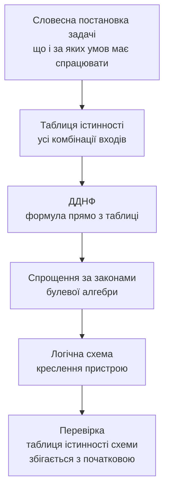

# Алгебра логіки, базові закони та операції

> [!abstract] Коротко
> Минулого разу ми домовилися, що комп'ютер оперує двома станами, і побачили транзистор — ключ, який ці два стани створює. Сьогодні ми дамо цим двом станам математику. Виявиться, що існує повноцінна алгебра, у якій усього два числа, три дії й десяток законів, — і що саме вона описує поведінку будь-якої цифрової схеми, від вимикача світла до процесора. Ми пройдемо шлях від англійського математика-самоука, який у 1854 році намагався описати формулами закони людського мислення й гадки не мав про електрику, до двадцятиоднорічного магістранта, який через вісімдесят років побачив, що ці формули ідеально описують схеми з реле, — і тим самим заклав фундамент усієї цифрової техніки. Ми навчимося записувати логічну функцію чотирма різними способами й вільно переходити між ними, вивчимо закони булевої алгебри й попрацюємо ними руками: спростимо кілька виразів, перетворимо таблицю істинності на формулу, а формулу — на схему, і побачимо, як однакова за поведінкою схема може коштувати вдвічі дешевше.

## Навчальні цілі заняття

- **Знати:** означення логічної (булевої) змінної, логічної функції та алгебри логіки; таблиці істинності базових операцій NOT, AND, OR і похідних XOR, NAND, NOR; усі поширені способи позначення цих операцій; пріоритет виконання операцій у логічному виразі; основні закони й тотожності булевої алгебри — переставний, сполучний, розподільний, ідемпотентності, поглинання, склеювання, дії з константами, подвійного заперечення, де Моргана; принцип двоїстості; поняття досконалої диз'юнктивної та кон'юнктивної нормальної форми; поняття функціонально повної системи операцій (базису).
- **Вміти:** будувати таблицю істинності для заданого виразу з двома-трьома змінними; записувати логічну функцію формулою, таблицею та схемою й переходити між цими формами; застосовувати закони булевої алгебри для спрощення виразів із покроковим обґрунтуванням кожного кроку; застосовувати закони де Моргана для розкриття заперечення над дужками та для переходу до базису NAND або NOR; будувати ДДНФ за таблицею істинності; перевіряти еквівалентність двох виразів; пояснювати логіку умов у програмному коді мовою булевої алгебри.

## План лекції

1. Навіщо схемотехніці власна математика
2. Три людини, без яких не було б цифрової техніки
3. Логічна змінна й логічна функція
4. Базові операції: NOT, AND, OR
5. Похідні операції: XOR, NAND, NOR та інші
6. Чотири способи задати ту саму функцію
7. Пріоритет операцій і дужки
8. Закони та тотожності булевої алгебри
9. Закони де Моргана — найважливіші в курсі
10. Принцип двоїстості
11. Спрощення виразів: працюємо руками
12. Від таблиці істинності до формули: ДДНФ і ДКНФ
13. Функціональна повнота: чому вистачає одного типу елемента
14. Булева алгебра у вашому коді

## 1. Навіщо схемотехніці власна математика

На минулій лекції ми зупинилися на важливому рубежі. Ми з'ясували, що в цифровій техніці є лише два осмислені стани, що їх створює транзистор-ключ і що з кількох таких ключів складається логічний елемент, який обчислює «і», «або», «не». Здавалося б, усе просто: беремо елементи, з'єднуємо їх дротами так, щоб виходило те, що нам треба, — і схема готова.

Проблема в тому, що «так, щоб виходило те, що треба» — це не інженерний метод, а спроба вгадати. Уявіть цілком реальне завдання: зробити схему керування ліфтом, яка вмикає двигун лише тоді, коли двері зачинені, кабіна не перевантажена, є виклик з поверху й не натиснуто аварійну кнопку. Чотири умови — це шістнадцять можливих комбінацій сигналів. Ви можете спробувати скласти схему інтуїтивно, з'єднуючи елементи «на око». Але як потім довести, що вона правильна в усіх шістнадцяти випадках, а не лише в тих трьох, які ви перевірили? А якщо умов не чотири, а дванадцять — це вже 4096 комбінацій, і жодна інтуїція такого не охопить.

Друга проблема ще практичніша. Одну й ту саму поведінку можна отримати різними схемами. Одна використовує вісімнадцять логічних елементів, інша — сім, і обидві поводяться абсолютно однаково: на будь-яку комбінацію входів дають той самий вихід. Різниця в тому, що перша займає більшу площу кристала, споживає більше енергії, довше рахує й коштує дорожче. Помножте цю різницю на сотні мільйонів вироблених мікросхем — і ви отримаєте зовсім різні гроші. Але щоб перетворити велику схему на маленьку, треба мати **правила**, за якими одну схему можна законно замінити іншою. Інтуїція таких правил не дає.

Ось звідси й береться потреба в математиці. Нам потрібен апарат, який уміє три речі:

По-перше, **однозначно описувати** поведінку схеми — так, щоб опис не залежав від того, хто його читає, і щоб за ним можна було відтворити схему до останнього дроту. По-друге, **доводити еквівалентність**: показувати, що дві різні на вигляд схеми поводяться однаково в усіх без винятку випадках, не перебираючи ці випадки вручну. По-третє, **перетворювати**: законно спрощувати опис, отримуючи дешевшу схему з тією самою поведінкою.

Саме такий апарат називається алгеброю логіки. І найдивовижніше в цій історії те, що його створили за сто років до появи першого комп'ютера — і зовсім не для комп'ютерів.

> [!definition] Визначення
> **Алгебра логіки** (булева алгебра) — розділ математики, що вивчає операції над висловлюваннями, які можуть набувати лише двох значень: «істина» або «хиба». У цифровій схемотехніці вона є математичною основою опису, аналізу та синтезу логічних схем.

Зверніть увагу на слово «висловлювання». Булева алгебра народилася як спроба формалізувати міркування, тобто людську думку, і лише згодом з'ясувалося, що вона з тією ж точністю описує потоки електронів у дротах. Це один із найкрасивіших випадків у історії науки, коли чиста математика, придумана «ні для чого», через десятиліття виявилася єдино потрібним інструментом для цілком практичної інженерної задачі.

## 2. Три людини, без яких не було б цифрової техніки

### 2.1 Джордж Буль і закони мислення

Джордж Буль народився 1815 року в англійському Лінкольні в родині швеця. Університетів він не закінчував — грошей у сім'ї не було, тож математику вивчав самотужки, за книжками, працюючи вчителем у школі, а згодом і утримуючи власну школу, щоб прогодувати родину. Попри цілковиту відсутність формальної освіти, він публікував статті в наукових журналах, і зрештою 1849 року його запросили професором математики в новостворений Королівський коледж у Корку, в Ірландії.

![[attachments/ksak-l02-boole.jpg|420]]
*Джордж Буль (1815–1864) — англійський математик-самоук, який створив алгебру, що згодом отримала його ім'я. Джерело: невідомий автор, суспільне надбання, [Wikimedia Commons](https://commons.wikimedia.org/wiki/File:George_Boole_color.jpg).*

Задача, яка його займала, звучала цілком по-філософськи: чи можна закони людського мислення записати формулами так само строго, як записують закони арифметики? Логіку до нього вивчали з часів Аристотеля, але вивчали словами — як мистецтво правильних міркувань, а не як обчислення. Буль запропонував радикальне: розглядати висловлювання як величини, які можуть дорівнювати лише нулю або одиниці, і ввести над ними операції, схожі на додавання й множення.

Результат він виклав у книжці 1854 року з довгою назвою «Дослідження законів мислення, на яких ґрунтуються математичні теорії логіки та ймовірностей».

![[attachments/ksak-l02-laws-of-thought.jpg|420]]
*Титульна сторінка «An Investigation of the Laws of Thought» (Лондон, 1854) — книжки, у якій Буль виклав свою алгебру. Про електрику в ній немає жодного слова: йшлося про формалізацію міркувань. Джерело: George Boole, суспільне надбання, [Wikimedia Commons](https://commons.wikimedia.org/wiki/File:An_Investigation_of_the_Laws_of_Thought_(1854,_Boole,_investigationofl00boolrich).djvu).*

Сучасники сприйняли роботу шанобливо, але як екзотику: цікава математична вигадка, застосувань не видно. Сам Буль помер 1864 року у сорок дев'ять років від запалення легень — застудився, пройшовши три кілометри під дощем, щоб не пропустити лекцію. Він не дожив ні до електричних схем, ні тим паче до комп'ютерів, і до кінця життя вважав свою алгебру внеском у філософію.

### 2.2 Огастес де Морган і два закони, які ви пам'ятатимете все життя

Сучасником і другом Буля був Огастес де Морган — математик і логік, професор Університетського коледжу Лондона. Саме він, працюючи над тією ж задачею формалізації логіки, сформулював два правила, які пов'язують заперечення з «і» та «або». Ми розберемо їх детально в розділі 9; поки що скажу лише, що з усього матеріалу сьогоднішньої лекції саме ці два закони ви застосовуватимете найчастіше — і в схемотехніці, і в програмуванні, і, чесно кажучи, навіть у побутових суперечках.

![[attachments/ksak-l02-demorgan.jpg|320]]
*Огастес де Морган (1806–1871). Крім законів, названих його іменем, він увів у вжиток термін «математична індукція». Джерело: The Open Court Publishing (1898), суспільне надбання, [Wikimedia Commons](https://commons.wikimedia.org/wiki/File:Augustus_De_Morgan,_1898.jpg).*

### 2.3 Клод Шеннон: як логіка стала електрикою

І ось тут починається найцікавіше. Минуло вісімдесят років. 1937 року двадцятиоднорічний магістрант Массачусетського технологічного інституту Клод Шеннон підробляв на обслуговуванні диференціального аналізатора — величезної механічної обчислювальної машини, керування якої було зібране на сотнях електромагнітних реле.

![[attachments/ksak-l02-shannon.jpg|380]]
*Клод Шеннон (1916–2001). Його магістерську роботу часто називають найважливішою магістерською роботою XX століття. Пізніше він створив теорію інформації — і саме він увів у науковий обіг слово «біт». Джерело: Tekniska museet, CC BY 2.0, [Wikimedia Commons](https://commons.wikimedia.org/wiki/File:C.E._Shannon._Tekniska_museet_43069_(cropped).jpg).*

Реле — це електромеханічний ключ: подаєш струм на обмотку, вона притягує якір, контакти замикаються. Той самий керований вимикач, що й транзистор, тільки повільний, гучний і завбільшки із сірникову коробку. Шеннон помітив те, чого не помічали інженери, які працювали з реле десятиліттями: **контакт може бути лише замкнений або розімкнений, а це в точності ті самі два стани, з якими працює алгебра Буля**.

Далі все склалося само собою. Якщо з'єднати два контакти **послідовно**, струм піде лише тоді, коли замкнені обидва, — це кон'юнкція, логічне «і». Якщо з'єднати їх **паралельно**, струм піде, коли замкнений хоча б один, — це диз'юнкція, логічне «або». А якщо взяти контакт, який у спокої замкнений і розмикається при спрацюванні реле, — це заперечення.

![[attachments/ksak-l02-relay-and.png|460]]
*Кон'юнкція на реле: два контакти, увімкнені послідовно. Струм від джерела дійде до виходу Y лише тоді, коли спрацювали обидва реле — і A, і B. Достатньо розімкнути будь-який один контакт, і ланцюг обривається. Джерело: Biezl, суспільне надбання, [Wikimedia Commons](https://commons.wikimedia.org/wiki/File:Relay_and.svg).*

Свої висновки Шеннон виклав у магістерській роботі «Символьний аналіз релейних і комутаційних схем».

![[attachments/ksak-l02-shannon-thesis.png|420]]
*Титульна сторінка магістерської роботи Клода Шеннона (робота датована 1937 роком, захищена 1940-го). Саме тут уперше сказано, що алгебра Буля описує електричні схеми. Джерело: Claude Shannon, суспільне надбання, [Wikimedia Commons](https://commons.wikimedia.org/wiki/File:Page_1_from_A_Symbolic_Analysis_of_Relay_and_Switching_Circuits.png).*

Наслідки були колосальні. До Шеннона проєктування релейних схем було ремеслом: досвідчений інженер складав схему за інтуїцією та аналогією з попередніми, а перевіряв її випробуванням. Після Шеннона це стало **інженерною наукою**: схему можна записати формулою, формулу — спростити за законами алгебри, а спрощену формулу — знову перетворити на схему, гарантовано простішу й гарантовано з тією самою поведінкою. Проєктування перестало залежати від таланту конкретної людини.

> [!info] Для допитливих
> Історія на цьому не закінчується. Через одинадцять років, 1948-го, той самий Шеннон опублікував статтю «Математична теорія зв'язку», якою створив теорію інформації — науку про те, скільки інформації несе повідомлення і скільки її можна передати каналом зв'язку. Саме в цій статті він увів у вжиток слово **біт**, посилаючись на свого колегу Джона Тьюкі. Тобто людина, яка пов'язала логіку з електрикою, дала ім'я й одиниці інформації, з якої ми почали минулу лекцію. А ще Шеннон усе життя лишався винахідником-диваком: він збирав жонглювальні машини, катався коридорами Bell Labs на одноколісному велосипеді й побудував «найнепотрібнішу машину в світі» — коробку з вимикачем, з якої після вмикання висувалася механічна рука й вимикала його назад.

## 3. Логічна змінна й логічна функція

Переходимо від історії до апарата. Почнімо з найпростішого поняття.

> [!definition] Визначення
> **Логічна (булева) змінна** — величина, яка може набувати лише одного з двох значень: 1 («істина», є сигнал) або 0 («хиба», немає сигналу). Позначають логічні змінні великими латинськими літерами: $A$, $B$, $C$, $X$, $Y$.

Логічна змінна — це математичне ім'я для входу схеми. Якщо у вас є датчик, що повідомляє «двері зачинені / двері відчинені», — це логічна змінна. Кнопка натиснута чи ні, температура перевищила поріг чи ні, користувач автентифікований чи ні — усе це логічні змінні. Важливо, що проміжних значень не буває: «двері зачинені на три чверті» в цій алгебрі не існує.

> [!definition] Визначення
> **Логічна функція** (функція алгебри логіки, перемикальна функція) — функція $F(A, B, \ldots)$, яка кожній комбінації значень своїх логічних аргументів ставить у відповідність одне значення — 0 або 1.

Логічна функція — це математичне ім'я для схеми в цілому. Схема має входи (аргументи) і вихід (значення функції), і поводиться вона строго за правилом: певна комбінація на входах дає певний вихід.

Тепер поставмо собі питання, яке зазвичай студентам на думку не спадає, а воно дуже прояснює масштаб предмета: **скільки взагалі існує різних логічних функцій** від заданої кількості змінних?

Міркуємо так. Якщо змінних $n$, то різних комбінацій їхніх значень рівно $2^n$ — ми це рахували минулого разу. Для кожної з цих комбінацій функція може дати або 0, або 1, причому незалежно від інших комбінацій. Отже, різних функцій буде $2$ у степені «кількість комбінацій»:

$$N = 2^{2^n}$$

Підставмо числа. Для однієї змінної: $2^{2^1} = 4$ функції. Їх легко перелічити всі: тотожна (повторює вхід), заперечення (перевертає), константа 0 і константа 1. Для двох змінних: $2^{2^2} = 16$ функцій. Це вже цікавіше — серед цих шістнадцяти є всі знайомі нам AND, OR, XOR, NAND, NOR і ще десяток екзотичніших. Для трьох змінних: $2^{2^3} = 256$. Для чотирьох: $2^{2^4} = 65\,536$. А для п'яти — понад чотири мільярди.

| Кількість змінних $n$ | Комбінацій входів $2^n$ | Різних функцій $2^{2^n}$ |
|---|---|---|
| 1 | 2 | 4 |
| 2 | 4 | 16 |
| 3 | 8 | 256 |
| 4 | 16 | 65 536 |
| 5 | 32 | ≈ 4,3 мільярда |

> [!warning] Типова помилка
> Плутати два різні числа: **скільки комбінацій входів** ($2^n$ — це кількість рядків у таблиці істинності) і **скільки існує різних функцій** ($2^{2^n}$). Для трьох змінних таблиця істинності має 8 рядків, але різних функцій від трьох змінних — 256. Перше число описує одну функцію, друге — усю множину можливих функцій.

Із цієї таблиці випливає практичний висновок, який визначає весь подальший курс. Кількість можливих функцій зростає катастрофічно швидко, тому жодного «каталогу всіх функцій» бути не може — уже для п'яти змінних його не вмістить жоден довідник. Отже, потрібен не каталог, а **метод**: спосіб узяти опис потрібної нам поведінки й механічно, за правилами, побудувати схему. Саме цим ми й займатимемося.

## 4. Базові операції: NOT, AND, OR

Уся неозора множина логічних функцій будується всього з трьох базових операцій. Розгляньмо кожну уважно.

### 4.1 Заперечення (NOT, інверсія)

Найпростіша операція: перевертає значення на протилежне. Була одиниця — стане нуль, був нуль — стане одиниця.

Позначень у літературі кілька, і до всіх варто звикнути, бо в різних підручниках і різних середовищах розробки вам траплятимуться різні: риска згори $\overline{A}$ (найпоширеніше в схемотехніці й найзручніше в рукописних записах), $\neg A$ (математична логіка), $\lnot A$, `!A` (мови програмування C, Java, JavaScript, C#), `NOT A` (Паскаль, SQL, VHDL), `~A` (побітове заперечення в C).

| $A$ | $\overline{A}$ |
|---|---|
| 0 | 1 |
| 1 | 0 |

Побутова аналогія — звичайний вимикач-перекидач у коридорі, який завжди стоїть у положенні, протилежному до сусіднього. Або, ближче до життя: твердження «двері зачинені» і «двері незачинені» завжди мають протилежні значення істинності.

### 4.2 Кон'юнкція (AND, логічне «і», логічне множення)

Кон'юнкція видає одиницю тоді й лише тоді, коли **всі** її аргументи дорівнюють одиниці. Достатньо одного нуля на будь-якому вході, щоб результат став нулем.

Позначення: $A \cdot B$, $A \land B$, $AB$ (крапку часто просто не пишуть, як у звичайній алгебрі), `A && B` (C, Java, JavaScript), `A AND B` (Паскаль, SQL), `A & B` (побітове «і»).

| $A$ | $B$ | $A \cdot B$ |
|---|---|---|
| 0 | 0 | 0 |
| 0 | 1 | 0 |
| 1 | 0 | 0 |
| 1 | 1 | 1 |

Назва «логічне множення» не випадкова: якщо підставити в таблицю нулі та одиниці як звичайні числа, то результат кон'юнкції збігається зі звичайним арифметичним добутком. $0 \cdot 0 = 0$, $0 \cdot 1 = 0$, $1 \cdot 1 = 1$ — усе сходиться. Це зручно й допомагає запам'ятати, але не варто захоплюватися аналогією: як ми скоро побачимо, з диз'юнкцією такий фокус проходить не до кінця.

Побутовий приклад — послідовне з'єднання, яке ми щойно бачили на реле в Шеннона. Двері під'їзду відчиняються, якщо у вас **і** ключ-таблетка **і** код домофона. Немає чогось одного — не відчиняться.

### 4.3 Диз'юнкція (OR, логічне «або», логічне додавання)

Диз'юнкція видає одиницю, коли **хоча б один** з аргументів дорівнює одиниці. Нуль виходить лише в єдиному випадку — коли всі входи нульові.

Позначення: $A + B$, $A \lor B$, `A || B` (C, Java, JavaScript), `A OR B` (Паскаль, SQL), `A | B` (побітове «або»).

| $A$ | $B$ | $A + B$ |
|---|---|---|
| 0 | 0 | 0 |
| 0 | 1 | 1 |
| 1 | 0 | 1 |
| 1 | 1 | 1 |

> [!warning] Типова помилка
> Останній рядок таблиці — місце, де студенти спотикаються найчастіше. У звичайній арифметиці $1 + 1 = 2$. У булевій алгебрі **$1 + 1 = 1$**, бо двійки тут просто не існує: множина значень складається з нуля й одиниці, і результат операції зобов'язаний належати цій множині. Тому аналогія «диз'юнкція — це додавання» працює для трьох рядків із чотирьох, а на четвертому ламається. Запам'ятовуйте диз'юнкцію не як додавання, а за її змістом: «хоча б один».

Побутовий приклад — паралельне з'єднання. Світло в кімнаті вмикається або вимикачем біля дверей, або пультом, або з телефона: спрацювало будь-що одне — світло горить.

### 4.4 Погляд із боку множин

Є дуже наочний спосіб побачити всі три операції одразу — через діаграми Венна, де кожна логічна змінна зображена як множина точок, для яких вона істинна.

![[attachments/ksak-l02-venn.svg|1100]]
*Логічні операції як дії над множинами. Прямокутник — це універсум, тобто всі можливі ситуації; кола — множини, де відповідна змінна істинна; жовтим позначено область, де істинним є результат операції. Схема створена для цієї лекції.*

Дивіться, як добре це читається. Заперечення — це все, що залишилося поза колом. Кон'юнкція — спільна частина двох кіл, тобто перетин: точка має належати й A, і B. Диз'юнкція — обидва кола цілком, тобто об'єднання. А виключне «або», з яким ми зараз познайомимося, — це об'єднання **без** перетину: те, що належить рівно одній із множин.

Ця відповідність між логікою й теорією множин не випадкова й не поверхова: це те саме, що й булева алгебра, лише в іншому вбранні. Тому в математичній літературі закони, які ми вивчатимемо, часто записують через $\cup$ і $\cap$, а не через $+$ і $\cdot$, — але це ті самі закони.

## 5. Похідні операції: XOR, NAND, NOR та інші

Трьох базових операцій достатньо, щоб виразити будь-яку логічну функцію. Але деякі комбінації трапляються настільки часто, що отримали власні імена, власні позначення та власні мікросхеми.

### 5.1 Виключне «або» (XOR, додавання за модулем 2)

Виключне «або» видає одиницю, коли аргументи **різні**, і нуль, коли вони однакові. Позначення: $A \oplus B$, `A ^ B` (C, Java, JavaScript), `XOR` (VHDL).

| $A$ | $B$ | $A \oplus B$ |
|---|---|---|
| 0 | 0 | 0 |
| 0 | 1 | 1 |
| 1 | 0 | 1 |
| 1 | 1 | 0 |

Ось важливий момент, який часто лишається непоміченим. У живій українській мові сполучник «або» найчастіше вживається саме у виключному значенні: «або чай, або кава» означає, що і те, й інше разом не пропонують. А логічна диз'юнкція — невиключна: вона видає істину й тоді, коли істинні обидва аргументи. Тому в задачах треба уважно читати умову: «або» побутове й «або» логічне — різні операції.

XOR має дві властивості, що роблять його незамінним у техніці. Перша: це **індикатор нерівності**, тобто $A \oplus B = 1$ тоді й лише тоді, коли $A \neq B$. Саме на цьому будуються схеми порівняння двох чисел. Друга: це **додавання за модулем 2**, тобто додавання двійкових розрядів без урахування перенесення. Порівняйте таблицю XOR із таблицею двійкового додавання з минулої лекції: $0+0=0$, $0+1=1$, $1+0=1$, $1+1=0$ і одиниця в перенесення. Стовпчик суми — це в точності XOR. Тому півсуматор, який ми зберемо в Лекція 5 - Комбінаційні схеми, складається саме з XOR (сума) і AND (перенесення).

Третя властивість випливає з першої й дуже красива: $A \oplus B \oplus B = A$. Двічі застосований XOR з тим самим значенням повертає початок. На цьому побудовано найпростіше шифрування (накладаємо ключ — зашифрували, накладаємо той самий ключ ще раз — розшифрували) і, наприклад, RAID-масиви з контролем парності.

### 5.2 NAND і NOR

NAND — це заперечення кон'юнкції ($\overline{A \cdot B}$), NOR — заперечення диз'юнкції ($\overline{A + B}$). Вони цікаві не змістом (зміст очевидний з назви), а тим, що на рівні транзисторів у технології КМОП вони виходять **простішими й дешевшими**, ніж «чисті» AND і OR. Річ у тім, що КМОП-структура за своєю природою інвертує: щоб отримати AND, доводиться робити NAND і додавати інвертор. Тому реальні мікросхеми масово будують саме на NAND і NOR, а в розділі 13 ми побачимо, що цього навіть достатньо.

| $A$ | $B$ | $A \cdot B$ | NAND $\overline{A \cdot B}$ | $A + B$ | NOR $\overline{A + B}$ | XOR $A \oplus B$ |
|---|---|---|---|---|---|---|
| 0 | 0 | 0 | 1 | 0 | 1 | 0 |
| 0 | 1 | 0 | 1 | 1 | 0 | 1 |
| 1 | 0 | 0 | 1 | 1 | 0 | 1 |
| 1 | 1 | 1 | 0 | 1 | 0 | 0 |

Цю таблицю варто вміти відтворювати з пам'яті — вона з'являється майже в кожній контрольній. Найпростіший спосіб: пам'ятати AND («усі одиниці») і OR («хоча б одна одиниця»), а NAND і NOR отримувати перевертанням відповідного стовпчика.

### 5.3 Ще дві операції, які варто знати

**Еквівалентність** ($A \equiv B$, вона ж XNOR) — протилежність до XOR: одиниця, коли аргументи однакові. Використовується в схемах порівняння: рівність двох багаторозрядних чисел перевіряється порозрядним XNOR і подальшим AND усіх результатів.

**Імплікація** ($A \to B$, «якщо A, то B») — цікава тим, що суперечить побутовому чуттю. Вона хибна лише в одному-єдиному випадку: коли $A = 1$, а $B = 0$. Тобто твердження «якщо йде дощ, то асфальт мокрий» вважається хибним лише тоді, коли дощ таки йде, а асфальт сухий. Якщо дощу немає, твердження автоматично істинне незалежно від стану асфальту. У схемотехніці імплікація трапляється рідко, а от у формальній логіці та у верифікації програм — постійно.

## 6. Чотири способи задати ту саму функцію

Тепер — ключова для практики річ. Одну й ту саму логічну функцію можна описати кількома різними способами, і інженер мусить вільно переходити між ними, бо кожен спосіб зручний для свого.

![[attachments/ksak-l02-sposoby.svg|1150]]
*Три основні форми опису однієї функції та переходи між ними. Таблиця відповідає на питання «що має бути на виході», формула дозволяє перетворювати, схема — це вже те, що можна паяти. Схема створена для цієї лекції.*

**Спосіб перший — таблиця істинності.** Перелік усіх комбінацій входів і відповідних їм виходів. Головна перевага — вичерпність: таблиця описує поведінку абсолютно повно, без недомовок, і двох різних функцій з однаковою таблицею не буває. Головний недолік — розмір: для десяти змінних це 1024 рядки. Таблицю зручно використовувати як **початкову постановку задачі**: замовник каже, за яких умов має спрацювати схема, а ви це записуєте рядками.

Важлива дрібниця, яка допоможе не робити помилок: рядки таблиці прийнято записувати в порядку зростання двійкового числа, складеного зі значень входів. Для трьох змінних це 000, 001, 010, 011, 100, 101, 110, 111. Якщо дотримуватися цього порядку завжди, ви ніколи не пропустите рядок і зможете швидко порівнювати дві таблиці між собою.

**Спосіб другий — аналітичний вираз (формула).** Компактний запис через операції. Головна перевага — з формулою можна **працювати**: спрощувати, перетворювати, підставляти в іншу формулу. Саме тому вся наступна частина лекції присвячена законам перетворення формул. Недолік — за формулою не завжди одразу видно поведінку: щоб зрозуміти, що робить вираз $\overline{A} \cdot B + A \cdot \overline{B}$, доводиться будувати таблицю.

**Спосіб третій — логічна схема.** Малюнок із логічних елементів та з'єднань між ними. Це вже практично креслення пристрою. Перевага — наочність структури й прямий шлях до виготовлення. Недолік — громіздкість і те, що перетворювати схему «на малюнку» незручно; для перетворень її переводять у формулу.

**Спосіб четвертий — часова діаграма.** Графік, на якому по горизонталі відкладено час, а по вертикалі — рівні сигналів на входах і виході. Цей спосіб ми активно використовуватимемо, починаючи з Лекція 6 - Послідовнісні схеми, бо там поведінка залежить від часу та порядку подій, і таблиця істинності стає безсилою. Для комбінаційних схем часова діаграма — це просто інший вигляд таблиці істинності, «розкладеної» вздовж осі часу. Саме таку діаграму ви побачите на екрані осцилографа або логічного аналізатора в лабораторії.

Є ще й п'ятий, службовий спосіб — **числовий**: функцію задають переліком номерів рядків, у яких вона дорівнює одиниці. Наприклад, $F(A,B,C) = \sum(3, 5, 6, 7)$ означає, що функція істинна на рядках з номерами 3, 5, 6 і 7 (нумерація з нуля). Такий запис компактний і дуже зручний для карт Карно, з якими ми працюватимемо в Лекція 4 - Мінімізація логічних функцій.

> [!example] Приклад
> Візьмімо функцію зі схеми вище й прочитаймо її всіма способами. Таблиця: одиниця в рядках 01 і 10. Формула: $F = A \cdot \overline{B} + \overline{A} \cdot B$. Схема: два інвертори, два елементи «і», один «або». Числовий запис: $F = \sum(1, 2)$. Словами: «на виході одиниця, коли входи різні». Це XOR — і всі п'ять записів описують одне й те саме.

## 7. Пріоритет операцій і дужки

Перш ніж перейти до законів, треба домовитися про порядок дій. Без цієї домовленості вираз $A + B \cdot C$ був би двозначним: чи то спершу «або», чи то спершу «і».

Порядок такий самий за духом, як у звичайній арифметиці, і його треба просто запам'ятати:

1. **Заперечення** — найвищий пріоритет, виконується першим.
2. **Кон'юнкція** (логічне множення) — другою.
3. **Диз'юнкція** (логічне додавання) — останньою.

Дужки, як завжди, змінюють порядок: те, що в них, обчислюється першим.

![[attachments/ksak-l02-pryorytet.svg|980]]
*Дерево розбору виразу $F = A \cdot \overline{B} + C$. Обчислення йде знизу вгору: спершу заперечення, потім кон'юнкція, і лише насамкінець диз'юнкція. Схема створена для цієї лекції.*

Аналогія з арифметикою тут майже точна: кон'юнкція поводиться як множення, диз'юнкція — як додавання, заперечення — як унарний мінус. Вираз $A + B \cdot C$ читається як «A або (B і C)», так само як $2 + 3 \cdot 4$ читається як «два плюс дванадцять».

> [!warning] Типова помилка
> Дуже підступна деталь пов'язана з рискою заперечення. Риска **сама є дужкою**: вона поширюється рівно на те, що під нею. Вираз $\overline{A + B}$ (риска над усім) і вираз $\overline{A} + \overline{B}$ (риска над кожною змінною окремо) — це **різні функції**, і плутати їх не можна ні в якому разі. Перевірмо на одному значенні: нехай $A = 1$, $B = 0$. Тоді $\overline{A + B} = \overline{1} = 0$, а $\overline{A} + \overline{B} = 0 + 1 = 1$. Результати протилежні. Саме звідси, до речі, ростуть закони де Моргана, які ми зараз розберемо: вони якраз і кажуть, на що насправді перетворюється риска над дужкою.

## 8. Закони та тотожності булевої алгебри

Ми дійшли до серця лекції. Закони булевої алгебри — це правила, за якими один вираз можна законно замінити іншим, гарантовано зберігши поведінку. Саме вони перетворюють схемотехніку з ремесла на інженерію.

Одразу скажу про спосіб доведення, бо він до смішного простий. Будь-яку з цих тотожностей можна довести **повним перебором**: побудувати таблицю істинності для лівої частини, побудувати для правої і переконатися, що стовпчики результатів збігаються. Оскільки змінних мало, а комбінацій скінченна кількість, такий перебір — цілком строге доведення. Це рідкісний випадок, коли в математиці «перевірити всі випадки» є законним методом.

### 8.1 Закони, що збігаються зі звичайною алгеброю

**Переставний (комутативний) закон.** Порядок операндів не має значення:
$$A \cdot B = B \cdot A \qquad A + B = B + A$$

**Сполучний (асоціативний) закон.** Порядок групування не має значення:
$$A \cdot (B \cdot C) = (A \cdot B) \cdot C \qquad A + (B + C) = (A + B) + C$$

Практичний наслідок: коли ви бачите «і» кількох сигналів, не має значення, чи подавати їх на один тривходовий елемент, чи на два двовходових послідовно. Результат ідентичний, а от затримка й ціна — ні, і це вже питання проєктування.

**Розподільний (дистрибутивний) закон** — тут починаються сюрпризи. Перша форма звична:
$$A \cdot (B + C) = A \cdot B + A \cdot C$$

Це те саме розкриття дужок, що й у школі. А от друга форма в звичайній алгебрі неможлива, і саме вона зазвичай викликає недовіру:
$$A + B \cdot C = (A + B) \cdot (A + C)$$

У числовій алгебрі $2 + 3 \cdot 4 \neq (2+3) \cdot (2+4)$, це очевидно. А в булевій — рівність виконується завжди. Перевірмо її перебором для найпоказовішого випадку $A = 1$: ліва частина $1 + B \cdot C = 1$ (бо диз'юнкція з одиницею завжди одиниця), права частина $(1 + B) \cdot (1 + C) = 1 \cdot 1 = 1$. Сходиться. Для $A = 0$: ліва $0 + B \cdot C = B \cdot C$, права $(0 + B) \cdot (0 + C) = B \cdot C$. Теж сходиться. Отже, закон справджується для всіх значень.

### 8.2 Закони, властиві лише булевій алгебрі

**Закони ідемпотентності.** Повторення нічого не змінює:
$$A \cdot A = A \qquad A + A = A$$

Змістовно це очевидно: «іде дощ і йде дощ» — це просто «іде дощ». Практично це означає, що два однакові сигнали, подані на один елемент, дають той самий сигнал, тобто елемент зайвий.

**Дії з константами.** Чотири тотожності, які найчастіше використовують при спрощенні:
$$A \cdot 1 = A \qquad A \cdot 0 = 0 \qquad A + 0 = A \qquad A + 1 = 1$$

Зверніть особливу увагу на $A + 1 = 1$: якщо на один вхід елемента «або» назавжди подати одиницю, вихід буде одиницею **незалежно** від другого входу. Схема перестає щось обчислювати. Те саме з $A \cdot 0 = 0$. У реальному проєктуванні поява такої константи в спрощеному виразі — сигнал, що частина схеми не потрібна взагалі.

**Закон подвійного заперечення:**
$$\overline{\overline{A}} = A$$

Два інвертори поспіль дають на виході те саме, що на вході. Здавалося б, безглузда конструкція — але насправді вона трапляється в реальних схемах, коли треба відновити («підсилити») сигнал, що пройшов довгим дротом і послабився.

**Закони доповнення** — суперечності й виключеного третього:
$$A \cdot \overline{A} = 0 \qquad A + \overline{A} = 1$$

Перший каже: змінна і її заперечення не можуть бути істинними одночасно (не може бути, щоб двері були одночасно зачинені й незачинені). Другий: одне з двох обов'язково істинне, третього не дано. Обидві тотожності — основний інструмент спрощення: щойно у виразі зустрілися $A$ і $\overline{A}$ в одному добутку, весь добуток обертається на нуль і викидається.

**Закони поглинання** — найкорисніші на практиці й найменш очевидні на вигляд:
$$A + A \cdot B = A \qquad A \cdot (A + B) = A$$

Розберімо перший, бо він реально економить елементи. Нехай $A = 1$: ліва частина $1 + 1 \cdot B = 1$, і це дорівнює $A$. Нехай $A = 0$: ліва частина $0 + 0 \cdot B = 0$, і це знову дорівнює $A$. Отже, значення $B$ не впливає на результат узагалі — змінну $B$ і весь елемент «і» можна викинути зі схеми. Побутово: «прийду, або прийду й принесу торт» — у будь-якому разі просто «прийду».

**Закони склеювання:**
$$A \cdot B + A \cdot \overline{B} = A \qquad (A + B) \cdot (A + \overline{B}) = A$$

Перший читається так: якщо результат однаковий і при $B$, і при $\overline{B}$, то $B$ ні на що не впливає й має бути викреслена. Це основа всієї мінімізації логічних функцій: карти Карно, які ми вивчатимемо на наступних заняттях, — по суті, графічний спосіб швидко знаходити пари, що склеюються.

### 8.3 Зведена таблиця

| Назва закону | Для кон'юнкції | Для диз'юнкції |
|---|---|---|
| Переставний | $A \cdot B = B \cdot A$ | $A + B = B + A$ |
| Сполучний | $A(BC) = (AB)C$ | $A + (B + C) = (A + B) + C$ |
| Розподільний | $A(B + C) = AB + AC$ | $A + BC = (A + B)(A + C)$ |
| Ідемпотентності | $A \cdot A = A$ | $A + A = A$ |
| З константою (нейтральний) | $A \cdot 1 = A$ | $A + 0 = A$ |
| З константою (поглинальний) | $A \cdot 0 = 0$ | $A + 1 = 1$ |
| Доповнення | $A \cdot \overline{A} = 0$ | $A + \overline{A} = 1$ |
| Поглинання | $A(A + B) = A$ | $A + AB = A$ |
| Склеювання | $(A+B)(A+\overline{B}) = A$ | $AB + A\overline{B} = A$ |
| Подвійного заперечення | $\overline{\overline{A}} = A$ | форма одна для обох |
| Де Моргана | $\overline{A \cdot B} = \overline{A} + \overline{B}$ | $\overline{A + B} = \overline{A} \cdot \overline{B}$ |

> [!exam] На іспиті
> Цю таблицю треба знати напам'ять — не «впізнавати», а вміти відтворити на чистому аркуші. Найшвидший спосіб вивчити: зверніть увагу, що закони йдуть парами, і в кожній парі другий отримується з першого заміною всіх «і» на «або», усіх «або» на «і», нулів на одиниці й одиниць на нулі. Ця закономірність не випадкова — про неї наступний розділ.

## 9. Закони де Моргана — найважливіші в курсі

Ці два закони заслуговують на окремий розділ, бо вони застосовуються частіше за всі інші разом узяті.

> [!theorem] Теорема
> **Закони де Моргана:**
> $$\overline{A \cdot B} = \overline{A} + \overline{B}$$
> $$\overline{A + B} = \overline{A} \cdot \overline{B}$$
> Словами: заперечення кон'юнкції дорівнює диз'юнкції заперечень, а заперечення диз'юнкції — кон'юнкції заперечень. Коротке правило для запам'ятовування: **риска розривається, а знак операції змінюється на протилежний**.

Спершу переконаймося, що це правда, найчеснішим способом — повним перебором. Побудуймо таблицю для першого закону.

| $A$ | $B$ | $A \cdot B$ | $\overline{A \cdot B}$ | $\overline{A}$ | $\overline{B}$ | $\overline{A} + \overline{B}$ |
|---|---|---|---|---|---|---|
| 0 | 0 | 0 | **1** | 1 | 1 | **1** |
| 0 | 1 | 0 | **1** | 1 | 0 | **1** |
| 1 | 0 | 0 | **1** | 0 | 1 | **1** |
| 1 | 1 | 1 | **0** | 0 | 0 | **0** |

Четвертий і сьомий стовпчики збігаються в усіх чотирьох рядках. Оскільки інших рядків не існує, тотожність доведено повністю. Другий закон доводиться так само — його я залишу вам як завдання на занятті.

Тепер зрозуміймо, **чому** так, бо формальне доведення не дає відчуття. Візьмімо життєве твердження: «неправда, що я взяв і парасольку, і шапку». Що це означає насправді? Що чогось із двох я не взяв — або парасольки, або шапки, або обох. Тобто заперечення «і» перетворилося на «або». А тепер інше: «неправда, що я взяв парасольку або шапку». Це означає, що я не взяв **ні того, ні того**: не взяв парасольки **і** не взяв шапки. Заперечення «або» перетворилося на «і». Саме це й кажуть обидва закони, тільки формулами.

![[attachments/ksak-l02-de-morgan-venn.png|420]]
*Закони де Моргана на діаграмах Венна. Угорі: доповнення до об'єднання множин (жовта область поза обома колами) — це перетин доповнень. Унизу: доповнення до перетину — це об'єднання доповнень. Джерело: Teknad, суспільне надбання, [Wikimedia Commons](https://commons.wikimedia.org/wiki/File:Demorganlaws.svg).*

### 9.1 Що це означає для схем

А тепер найважливіше — практичний бік, заради якого ці закони й вивчають.

![[attachments/ksak-l02-de-morgan-shemy.svg|1060]]
*Ті самі два закони мовою логічних схем. Кружечок на виводі означає інверсію. Елемент NAND можна замінити елементом OR з інвертованими входами, а NOR — елементом AND з інвертованими входами. Поведінка схем ідентична в усіх випадках. Схема створена для цієї лекції.*

Дивіться, що ми щойно отримали. Схема зліва й схема справа — це різні набори деталей, різне компонування на платі, різна вартість. А поводяться вони абсолютно однаково. Значить, у інженера з'явився вибір: якщо в нього під рукою є мікросхема з чотирма елементами NAND, а треба «або» з двома інверторами, — він може не купувати нічого нового.

Саме через цю властивість закони де Моргана — головний інструмент переходу до **однорідного базису**, тобто до схеми, побудованої на елементах одного типу. Ми повернемося до цього в розділі 13 і потім докладно в Лекція 7 - Синтез цифрових схем та інтегральні мікросхеми.

### 9.2 Що це означає для коду

Закони де Моргана — це, мабуть, єдина тема цього курсу, яку ви застосовуватимете щодня, навіть якщо ніколи не підійдете до паяльника.

```c
// Ці дві умови еквівалентні:
if (!(age >= 18 && hasPassport)) { ... }
if (age < 18 || !hasPassport)    { ... }

// І ці теж:
if (!(isEmpty || isLocked))      { ... }
if (!isEmpty && !isLocked)       { ... }
```

Друга форма в кожній парі читається набагато легше — заперечення «внесене всередину», і не треба тримати в голові дужку. Досвідчений розробник робить таке перетворення автоматично, навіть не згадуючи прізвища де Моргана. Але робить він його саме за цим законом.

> [!warning] Типова помилка
> Найчастіша помилка при внесенні заперечення — **забути змінити операцію**. Запис «$\overline{A + B} = \overline{A} + \overline{B}$» неправильний, хоча виглядає симетрично й спокусливо. У коді це та сама помилка: написати `!(a && b)` як `!a && !b` замість `!a || !b`. Наслідок у програмі — умова, яка мовчки спрацьовує не тоді, коли треба, і знайти таку помилку важко, бо код виглядає правдоподібно. Правило-запобіжник просте: **розірвали риску — переверніть знак**.

## 10. Принцип двоїстості

Ви вже помітили, що закони йдуть парами. Це не збіг і не примха укладачів підручників.

> [!definition] Визначення
> **Принцип двоїстості:** якщо в справедливій тотожності булевої алгебри поміняти місцями всі операції кон'юнкції й диз'юнкції, а також усі константи 0 і 1, то отримана тотожність теж буде справедливою.

Тобто закони булевої алгебри існують дзеркальними парами, і досить вивчити половину — друга виходить механічною заміною. Перевірмо на законі поглинання. Візьмімо $A + A \cdot B = A$. Замінюємо «+» на «·», «·» на «+»: отримуємо $A \cdot (A + B) = A$. І це справді другий закон поглинання, який ми вже записували.

Практична користь подвійна. По-перше, це вдвічі скорочує обсяг зазубрювання. По-друге, це дає безкоштовну самоперевірку: якщо ви вивели якусь тотожність і не впевнені в ній, побудуйте двоїсту й перевірте її — обидві мають бути або справедливі, або ні.

> [!info] Для допитливих
> Глибша причина двоїстості в тому, що нуль і одиниця в булевій алгебрі рівноправні: жодне з цих значень не має математичної переваги над іншим, ми просто домовилися називати одне «істиною». Це відлунює і в техніці: існують схеми з так званою від'ємною логікою, де активним рівнем вважається низька напруга, а не висока. Така схема — точне дзеркало звичайної, і перекладається вона в неї саме принципом двоїстості разом із законами де Моргана.

## 11. Спрощення виразів: працюємо руками

Теорія без практики не тримається в голові, тому розберімо три приклади повільно й до кінця. У кожному кроці я вказуватиму, який саме закон застосовано, — і від вас на контрольній вимагатиметься те саме: не просто відповідь, а ланцюжок обґрунтованих кроків.

> [!example] Приклад 1 — поглинання
> Спростити: $F = A \cdot B + A \cdot \overline{B} + \overline{A} \cdot B$
>
> **Крок 1.** У перших двох доданках спільний множник $A$. Виносимо його за дужки (розподільний закон):
> $F = A \cdot (B + \overline{B}) + \overline{A} \cdot B$
>
> **Крок 2.** У дужках — закон доповнення: $B + \overline{B} = 1$.
> $F = A \cdot 1 + \overline{A} \cdot B$
>
> **Крок 3.** Множення на одиницю нічого не змінює:
> $F = A + \overline{A} \cdot B$
>
> **Крок 4.** Тут потрібна одна відома тотожність, яку варто запам'ятати окремо: $A + \overline{A} \cdot B = A + B$. Доведімо її принагідно. Якщо $A = 1$, ліва частина дорівнює 1 і права дорівнює 1. Якщо $A = 0$, ліва частина дорівнює $0 + 1 \cdot B = B$, права — $0 + B = B$. Отже, тотожність справедлива.
> $F = A + B$
>
> **Підсумок.** Було три елементи «і», два інвертори й два елементи «або» — разом сім. Стало: один елемент «або». Схема скоротилася в сім разів, поведінка не змінилася.

> [!example] Приклад 2 — де Морган плюс склеювання
> Спростити: $F = \overline{\overline{A} + B} + A \cdot B$
>
> **Крок 1.** Застосовуємо закон де Моргана до першого доданка: риска над дужкою розривається, «+» стає «·».
> $F = \overline{\overline{A}} \cdot \overline{B} + A \cdot B$
>
> **Крок 2.** Подвійне заперечення знімається:
> $F = A \cdot \overline{B} + A \cdot B$
>
> **Крок 3.** Виносимо $A$ за дужки:
> $F = A \cdot (\overline{B} + B)$
>
> **Крок 4.** У дужках одиниця (закон доповнення), множення на одиницю нічого не змінює:
> $F = A$
>
> **Підсумок.** Вираз із п'яти операцій виявився звичайним дротом від входу $A$ до виходу. Це не рідкість: у реальних проєктах після мінімізації часом з'ясовується, що цілий вузол схеми був зайвим.

> [!example] Приклад 3 — перевірка еквівалентності
> Чи еквівалентні вирази $F_1 = \overline{A \cdot \overline{B}}$ і $F_2 = \overline{A} + B$?
>
> Застосуємо до $F_1$ закон де Моргана: $\overline{A \cdot \overline{B}} = \overline{A} + \overline{\overline{B}} = \overline{A} + B$. Отримали рівно $F_2$. Вирази еквівалентні.
>
> Перевірмо себе таблицею — це обов'язкова звичка:
>
> | $A$ | $B$ | $\overline{B}$ | $A \cdot \overline{B}$ | $F_1$ | $\overline{A}$ | $F_2$ |
> |---|---|---|---|---|---|---|
> | 0 | 0 | 1 | 0 | 1 | 1 | 1 |
> | 0 | 1 | 0 | 0 | 1 | 1 | 1 |
> | 1 | 0 | 1 | 1 | 0 | 0 | 0 |
> | 1 | 1 | 0 | 0 | 1 | 0 | 1 |
>
> Стовпчики $F_1$ і $F_2$ збігаються в усіх рядках. До речі, впізнаєте функцію? Це імплікація «якщо A, то B» з підрозділу 5.3.

> [!warning] Типова помилка
> Найпоширеніша помилка при спрощенні — «скорочувати» змінні так, як це роблять у звичайних дробах. Вираз $A \cdot B + \overline{A} \cdot C$ **не спрощується** до $B + C$, хоч і дуже хочеться. Перевірте самі: при $A = 1, B = 0, C = 1$ вихідний вираз дає $0 + 0 \cdot 1 = 0$, а «спрощений» дає $0 + 1 = 1$. Правило одне: кожен крок має спиратися на конкретний закон із таблиці, який ви можете назвати вголос. Немає закону — немає кроку.

## 12. Від таблиці істинності до формули: ДДНФ і ДКНФ

Досі ми спрощували вже готові формули. Але звідки береться сама формула? У реальному проєктуванні задача формулюється словами: «двигун вмикається, якщо…». Переклад таких слів у таблицю істинності зазвичай проблем не викликає. А от як від таблиці перейти до формули — це окремий алгоритм, і він, на щастя, механічний.

Розгляньмо конкретну задачу. Потрібна схема голосування: три члени комісії натискають свої кнопки $A$, $B$, $C$, а рішення вважається ухваленим, якщо «за» проголосували **щонайменше двоє**. Складаємо таблицю й застосовуємо алгоритм.

![[attachments/ksak-l02-sdnf.svg|1020]]
*Побудова досконалої диз'юнктивної нормальної форми. Беремо лише ті рядки, де функція дорівнює одиниці; для кожного записуємо добуток усіх змінних, причому змінна входить із запереченням, якщо в цьому рядку вона нульова; отримані добутки з'єднуємо знаком диз'юнкції. Схема створена для цієї лекції.*

> [!definition] Визначення
> **Досконала диз'юнктивна нормальна форма (ДДНФ)** — запис логічної функції як диз'юнкції кон'юнкцій, у кожній з яких кожна змінна зустрічається рівно один раз — сама або із запереченням. Кожна така кон'юнкція називається **мінтермом** і відповідає одному рядку таблиці істинності, де функція дорівнює одиниці.

Алгоритм, за яким будується ДДНФ, вміщується у три рядки:

1. Знайти в таблиці всі рядки, де функція дорівнює **одиниці**.
2. Для кожного такого рядка записати добуток усіх змінних: змінну беремо без заперечення, якщо в цьому рядку вона дорівнює 1, і з запереченням, якщо 0.
3. З'єднати всі отримані добутки знаком диз'юнкції.

Для нашої комісії одиниці стоять у рядках 011, 101, 110 і 111, тож

$$F = \overline{A} \cdot B \cdot C + A \cdot \overline{B} \cdot C + A \cdot B \cdot \overline{C} + A \cdot B \cdot C$$

Чому це працює? Подивіться на будь-який мінтерм, скажімо, $A \cdot B \cdot \overline{C}$. Він дорівнює одиниці **рівно за однієї** комбінації входів: $A=1, B=1, C=0$. За будь-якої іншої хоча б один множник обертається на нуль, і весь добуток стає нулем. Отже, кожен мінтерм — це «детектор» одного конкретного рядка. А диз'юнкція детекторів спрацьовує, коли спрацював хоча б один із них. Тобто ми буквально описали таблицю формулою: «функція істинна, якщо ми у рядку 3, або у рядку 5, або у рядку 6, або у рядку 7».

Існує й дзеркальна форма — **досконала кон'юнктивна нормальна форма (ДКНФ)**. Там усе двоїсте: беруть рядки, де функція дорівнює **нулю**, для кожного записують суму всіх змінних (змінна входить із запереченням, якщо вона в цьому рядку дорівнює **одиниці**), і з'єднують суми знаком кон'юнкції. Користуються тією формою, яка коротша: якщо в таблиці мало одиниць — беруть ДДНФ, якщо мало нулів — ДКНФ.

Тепер спростімо нашу формулу. Мінтермів чотири, і три з них склеюються з четвертим. Скористаємося тим, що в булевій алгебрі доданок можна **повторювати** скільки завгодно разів (закон ідемпотентності $X = X + X + X$), тож допишемо $A \cdot B \cdot C$ ще двічі:

$$F = (\overline{A}BC + ABC) + (A\overline{B}C + ABC) + (AB\overline{C} + ABC)$$

У кожній дужці тепер працює закон склеювання: $\overline{A}BC + ABC = BC(\overline{A} + A) = BC$. Аналогічно друга дужка дає $AC$, третя — $AB$. Разом:

$$F = A \cdot B + A \cdot C + B \cdot C$$

Із дванадцяти операцій лишилося п'ять. І головне — формула тепер читається вголос по-людськи: «спрацювало, якщо проголосували A і B, або A і C, або B і C». Тобто якщо збіглася будь-яка пара.

![[attachments/ksak-l02-golosuvannya.svg|960]]
*Схема голосування «щонайменше двоє з трьох» після мінімізації: три елементи «і» відстежують три можливі пари, елемент «або» вмикає вихід, щойно спрацював будь-який із них. Схема створена для цієї лекції.*

> [!example] Приклад
> Ця сама схема — не навчальна вигадка. Мажоритарний елемент «два з трьох» стоїть в основі **резервування** критичних систем: у літаку, супутнику чи на атомній станції обчислення дублюють на трьох незалежних каналах і порівнюють результати. Якщо один канал відмовив або збився від космічного випромінювання, два справні «переголосовують» його, і система працює далі. Такий підхід називають троїстим модульним резервуванням, і саме через нього бортова електроніка космічних апаратів витримує роки в жорсткому випромінюванні.

Ми щойно пройшли повний цикл інженерної роботи — і саме цей маршрут повторюватиметься в курсі щоразу, коли треба буде спроєктувати вузол.



Кожна стрілка на цій схемі — механічна, тобто виконується за правилами, а не за натхненням. Саме тому проєктування цифрових схем можна доручити програмі, і саме так це сьогодні й робиться. Але інженер має розуміти кожен крок, бо саме він вирішує, де зупинитися й чим пожертвувати.

Це і є метод, заради якого потрібна була вся алгебра. Робити таке спрощення вручну, як ми, зручно лише для трьох-чотирьох змінних; для більших задач існують систематичні методи — карти Карно та алгоритм Куайна–МакКласкі, яким присвячена Лекція 4 - Мінімізація логічних функцій.

## 13. Функціональна повнота: чому вистачає одного типу елемента

Минулого разу я обіцяв повернутися до дивовижного факту про елемент NAND. Час настав, і тепер у нас є апарат, щоб зрозуміти, звідки він береться.

> [!definition] Визначення
> **Функціонально повна система операцій (базис)** — такий набір логічних операцій, за допомогою якого можна виразити будь-яку логічну функцію від будь-якої кількості змінних.

Набір {NOT, AND, OR} функціонально повний — це ми фактично довели в попередньому розділі: алгоритм ДДНФ перетворює будь-яку таблицю істинності на формулу, яка містить лише заперечення, кон'юнкції та диз'юнкції. Оскільки будь-яка функція задається таблицею, а будь-яка таблиця перетворюється на таку формулу, цими трьома операціями виражається справді будь-яка функція.

Але цей базис надлишковий. За законами де Моргана диз'юнкція виражається через кон'юнкцію та заперечення: $A + B = \overline{\overline{A} \cdot \overline{B}}$. Отже, OR узагалі не потрібен — достатньо {NOT, AND}. Так само з іншого боку: $A \cdot B = \overline{\overline{A} + \overline{B}}$, тож достатньо й {NOT, OR}.

А тепер головний крок. Виявляється, достатньо **однієї-єдиної** операції — NAND. Покажімо це конструктивно, виразивши через неї всі три базові. Позначмо NAND як $A \uparrow B = \overline{A \cdot B}$.

**Заперечення.** Подамо один і той самий сигнал на обидва входи: $A \uparrow A = \overline{A \cdot A} = \overline{A}$ (за законом ідемпотентності). Один елемент NAND зі з'єднаними входами — це інвертор.

**Кон'юнкція.** NAND — це вже «і» з інверсією, тож треба лише прибрати інверсію, тобто інвертувати ще раз: $A \cdot B = \overline{(A \uparrow B)} = (A \uparrow B) \uparrow (A \uparrow B)$. Два елементи.

**Диз'юнкція.** За де Морганом $A + B = \overline{\overline{A} \cdot \overline{B}} = \overline{A} \uparrow \overline{B}$. Обидва заперечення робимо елементами NAND, як показано вище. Разом три елементи.

Оскільки {NOT, AND, OR} — повний базис, а кожну з цих трьох операцій ми щойно зібрали з самих лише NAND, то NAND сам по собі є повним базисом. Абсолютно так само доводиться повнота NOR.

![[attachments/ksak-l02-xor-nand.png|900]]
*Виключне «або», зібране з чотирьох елементів NAND, — практична ілюстрація функціональної повноти. Жодних інших типів елементів у схемі немає. Джерело: Inductiveload, суспільне надбання, [Wikimedia Commons](https://commons.wikimedia.org/wiki/File:XOR_from_NAND.svg).*

Практичне значення цього факту суто економічне, і воно величезне. Виробникові мікросхем вигідніше налагодити масовий випуск одного типу елемента, ніж десяти різних: одна технологічна лінія, одна відпрацьована топологія, один контроль якості, величезні серії й низька собівартість одиниці. Тому елемент NAND — найпоширеніший логічний елемент у світі. У програмованих логічних інтегральних схемах ідея доведена до логічного кінця: там взагалі немає фіксованих елементів, а є однакові комірки з таблицею відповідності, які налаштовуються під потрібну функцію після виготовлення. Про це — у Лекція 7 - Синтез цифрових схем та інтегральні мікросхеми.

> [!info] Для допитливих
> Функціонально повні поодинокі операції називають штрихом Шеффера (NAND) та стрілкою Пірса (NOR) — на честь Генрі Шеффера, який 1913 року довів повноту NAND, і Чарльза Пірса, який дійшов того самого висновку ще близько 1880 року, але не опублікував результат. Саме на цій ідеї побудовано відомий навчальний курс «nand2tetris», у якому студент, починаючи з єдиного елемента NAND, крок за кроком будує процесор, операційну систему й компілятор. Посилання на курс є в списку літератури.

## 14. Булева алгебра у вашому коді

Насамкінець — про те, де сьогоднішній матеріал знадобиться тим, хто збирається писати програми, а не паяти плати. Відповідь: практично скрізь, просто це не завжди помітно.

**Умови в операторах розгалуження.** Кожен `if` — це логічна функція, і всі закони, які ми вивчали, до неї застосовні. Складна умова з чотирьох-п'яти прапорців — звичайна справа в реальному коді, і саме поглинання та склеювання дозволяють скоротити її до читабельного вигляду, не змінивши поведінки. Коли досвідчений розробник каже «цю умову можна спростити», він робить рівно те, що ми робили в розділі 11.

**Обчислення за короткою схемою.** У більшості мов оператори `&&` і `||` не обчислюють другий операнд, якщо результат уже визначено першим: якщо зліва від `&&` стоїть хиба, вся кон'юнкція хибна за законом $0 \cdot A = 0$, тож правий операнд не потрібен. Це не оптимізація компілятора, а частина семантики мови, і на ній тримається поширена ідіома `if (p != NULL && p->value > 0)`: якщо вказівник порожній, друга частина просто не виконається й програма не впаде.

**Побітові операції та маски.** Оператори `&`, `|`, `^`, `~` застосовують ту саму логіку до кожного біта числа окремо. Саме так працюють прапорці прав доступу, налаштування регістрів мікроконтролера й безліч інших речей на межі заліза та коду:

```c
flags |=  MASK;   // встановити біти маски       (OR)
flags &= ~MASK;   // скинути біти маски          (AND із запереченням)
flags ^=  MASK;   // інвертувати біти маски      (XOR)
if (flags & MASK) // перевірити, чи біт піднято  (AND)
```

Зверніть увагу на другий рядок: `&= ~MASK` — це буквально застосування де Моргана й закону доповнення на практиці. А третій — та сама властивість XOR, про яку ми говорили: повторне застосування повертає початковий стан.

**Запити до баз даних.** Умова `WHERE` у SQL — це логічний вираз, і оптимізатор запитів перетворює його за тими самими законами булевої алгебри, перш ніж виконувати. Розуміння цих законів прямо впливає на те, чи скористається база даних індексом.

**Цифрові схеми, які ви описуєте кодом.** У мовах опису апаратури VHDL і Verilog схему не малюють, а **записують формулами** — по суті, тими самими, що ми сьогодні писали крейдою. Синтезатор потім перетворює цей опис на реальну схему, застосовуючи мінімізацію автоматично. Але щоб зрозуміти, що саме він зробив і чому результат саме такий, потрібна ця лекція.

> [!exam] На іспиті
> Типові питання за темою: а) дати означення логічної змінної, логічної функції та алгебри логіки; б) навести таблиці істинності базових і похідних операцій з пам'яті; в) сформулювати й довести закони де Моргана таблицею істинності; г) спростити заданий вираз із зазначенням застосованого закону на кожному кроці; ґ) побудувати ДДНФ за заданою таблицею істинності; д) пояснити, що таке функціонально повна система, і показати, як виразити NOT, AND і OR через NAND; е) сформулювати принцип двоїстості й проілюструвати його на конкретній парі законів; є) визначити, скільки існує різних логічних функцій від трьох змінних, і обґрунтувати відповідь.

## Завдання на занятті (20 хв)

1. Побудуйте таблицю істинності для виразу $F = \overline{A} \cdot B + A \cdot \overline{C}$. Скільки рядків вона матиме і чому саме стільки?
2. Доведіть повним перебором другий закон де Моргана $\overline{A + B} = \overline{A} \cdot \overline{B}$. Таблицю оформіть зі стовпчиками для всіх проміжних результатів, як у розділі 9.
3. Спростіть вирази, зазначаючи на кожному кроці застосований закон: а) $A \cdot B + A \cdot \overline{B}$; б) $(A + B) \cdot (A + \overline{B})$; в) $A + \overline{A} \cdot B$; г) $\overline{\overline{A} \cdot \overline{B}}$.
4. Перевірте, чи еквівалентні вирази $F_1 = \overline{A + \overline{B}}$ і $F_2 = \overline{A} \cdot B$. Спочатку зробіть це перетворенням за законами, а потім перевірте себе таблицею істинності.
5. Запишіть ДДНФ для функції трьох змінних, яка дорівнює одиниці лише в рядках 000, 011 і 101. Спробуйте спростити результат.
6. Схема сигналізації має спрацьовувати, якщо відчинено двері **і** увімкнено охорону, **або** якщо розбито вікно (незалежно від охорони). Позначте входи, складіть таблицю істинності, запишіть формулу й намалюйте схему.
7. Запишіть операцію $A + B$ лише через елементи NAND. Скільки елементів знадобилося? Намалюйте схему й перевірте її таблицею істинності.
8. У парах: перекладіть звичайною мовою й спростіть умову `if (!(temperature > 100 || pressure > 50))`. Яку умову вона перевіряє насправді?

> [!question] Перевірте себе
> 1. Що таке логічна змінна й логічна функція? Чим логічна функція відрізняється від звичайної числової?
> 2. Скільки рядків має таблиця істинності функції від чотирьох змінних? Скільки різних функцій від чотирьох змінних існує? Чому це різні числа?
> 3. Назвіть три базові логічні операції та наведіть їхні таблиці істинності з пам'яті.
> 4. Чому $1 + 1 = 1$ у булевій алгебрі? Де ламається аналогія з арифметичним додаванням?
> 5. Чим виключне «або» відрізняється від звичайної диз'юнкції? Наведіть побутовий приклад для кожного.
> 6. Які дві властивості XOR роблять його незамінним у схемах додавання та порівняння?
> 7. Перелічіть чотири способи задати логічну функцію. Для чого зручний кожен із них?
> 8. Який порядок виконання операцій у логічному виразі? Чому $\overline{A + B}$ і $\overline{A} + \overline{B}$ — різні функції?
> 9. Сформулюйте обидва закони де Моргана. Як звучить коротке правило їхнього застосування?
> 10. Сформулюйте закон поглинання й поясніть на прикладі, які саме елементи схеми він дозволяє викинути.
> 11. У чому полягає закон склеювання і чому він є основою мінімізації логічних функцій?
> 12. Що стверджує принцип двоїстості? Побудуйте двоїсту тотожність до $A \cdot 0 = 0$.
> 13. Що таке ДДНФ? Опишіть алгоритм її побудови за таблицею істинності в трьох кроках.
> 14. Чим ДКНФ відрізняється від ДДНФ і коли якою з них вигідніше користуватися?
> 15. Що таке функціонально повна система операцій? Чому набір {NOT, AND, OR} надлишковий?
> 16. Як отримати інвертор з одного елемента NAND? А кон'юнкцію — із двох?
> 17. Яке практичне, економічне значення має функціональна повнота NAND для виробництва мікросхем?
> 18. Наведіть приклад із програмування, де ви застосовуєте закони де Моргана, навіть не думаючи про них.

## Назад

← [[courses/computer-architecture/lectures/01-vstup-do-kompiuternoi-skhemotekhniky-ta-ii|Лекція 1. Вступ до комп'ютерної схемотехніки та її роль в ІТ]]

## Далі

→ Лекція 3 - Логічні елементи

## Література

**Базова (українською):**

1. *Комп'ютерна схемотехніка і архітектура комп'ютерів. Частина 1: навчальний посібник.* — Київ: Київський електромеханічний технікум, 2020. Розділ про алгебру логіки відповідає темі цієї лекції.
2. Минайленко Р. М., Конопліцька-Слободенюк О. К., Гермак В. С. *Комп'ютерна схемотехніка: навчальний посібник.* Вид. 2-ге, доповнене. — Кропивницький: Центральноукраїнський національний технічний університет, 2022. Містить докладну таблицю законів булевої алгебри та задачі на спрощення.
3. *Комп'ютерна схемотехніка: конспект лекцій.* — Дніпро: Дніпровський державний технічний університет. URL: https://www.dstu.dp.ua/Portal/Data/3/19/3-19-kl42.pdf
4. Бондаренко М. Ф., Качко О. Г. *Дискретна математика: навчальний посібник.* — Харків: ХНУРЕ. Формальний бік булевої алгебри: нормальні форми, повнота, двоїстість — усе те, що ми сьогодні розглядали інженерно.

**Допоміжна (англійською):**

5. Harris S. L., Harris D. M. *Digital Design and Computer Architecture.* RISC-V Edition. — Morgan Kaufmann, 2021. — ISBN 978-0-12-820064-3. Розділ 2 «Combinational Logic Design» — найкращий сучасний виклад саме цієї теми, з великою кількістю прикладів.
6. Mano M. M., Ciletti M. D. *Digital Design: With an Introduction to the Verilog HDL.* 6th ed. — Pearson, 2018. — ISBN 978-0-13-454989-7. Класичний підручник; розділ 2 повністю присвячений булевій алгебрі та логічним елементам.
7. Shannon C. E. *A Symbolic Analysis of Relay and Switching Circuits.* — MIT, 1937. Та сама магістерська робота, з якої почалася цифрова схемотехніка. Читається напрочуд легко й доступна онлайн.
8. Boole G. *An Investigation of the Laws of Thought.* — London: Walton and Maberly, 1854. Першоджерело. Читати цілком не обов'язково, але погортати варто — хоча б щоб побачити, наскільки інакше виглядала ця алгебра до інженерів.
9. Nisan N., Schocken S. *The Elements of Computing Systems: Building a Modern Computer from First Principles.* — MIT Press. Курс «nand2tetris»: комп'ютер, зібраний з єдиного елемента NAND — пряма ілюстрація розділу 13.

**Інструменти та інтерактивні ресурси:**

10. **CircuitVerse** — онлайновий симулятор логічних схем: зберіть схему з розділу 12 і перевірте її таблицею істинності за п'ять хвилин. URL: https://circuitverse.org/
11. **Logic.ly** — простий симулятор логіки з наочною анімацією проходження сигналу; зручний для першого знайомства. URL: https://logic.ly/demo/
12. **Wolfram Alpha** — уміє спрощувати булеві вирази й будувати таблиці істинності: запит виду `simplify (A and B) or (A and not B)`. Корисно для самоперевірки домашніх завдань. URL: https://www.wolframalpha.com/
13. **nand2tetris** — безкоштовні матеріали курсу з побудови комп'ютера з нуля. URL: https://nand2tetris.org/
14. **Ben Eater. Building an 8-bit breadboard computer** — відеосерія зі збиранням комп'ютера на макетній платі; перші випуски присвячені саме логічним елементам. URL: https://eater.net/8bit

> [!info] Де взяти
> Позиції 1–3 — базові матеріали за робочою програмою, позиція 3 і всі ресурси групи 10–14 вільно доступні онлайн. Роботи Шеннона (7) і Буля (8) давно в суспільному надбанні й лежать у відкритому доступі — зокрема, на Wikimedia Commons та в Internet Archive. Позиції 5–6 захищені авторським правом і розповсюджуються через видавців; матеріали nand2tetris (9) частково викладені безкоштовно на сайті проєкту.
