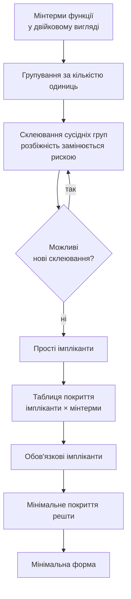

# Мінімізація логічних функцій (карти Карно, метод Куайна–МакКласкі)

> [!abstract] Коротко
> Ми вміємо перетворювати таблицю істинності на формулу, а формулу – на схему. Проблема в тому, що формула, отримана прямо з таблиці, майже завжди надлишкова: вона описує потрібну поведінку, але вимагає вдвічі-втричі більше елементів, ніж насправді потрібно. Сьогодні ми навчимося цю надлишковість прибирати. Розберемо карти Карно – графічний метод, який перетворює склеювання на просте розглядання сусідніх клітинок, – і метод Куайна–МакКласкі, який робить те саме таблично й тому годиться для машинної реалізації. Окремо поговоримо про невизначені стани, які дозволяють спростити схему ще сильніше, і про те, чому найкоротша формула не завжди є найкращою схемою.

## Навчальні цілі заняття

- **Знати:** поняття мінімальної диз'юнктивної нормальної форми; призначення й будову карти Карно для двох, трьох і чотирьох змінних; правило сусідства клітинок і код Грея; правила утворення груп; поняття невизначеного стану; етапи методу Куайна–МакКласкі; поняття імпліканти та простої імпліканти; поняття статичної гонки сигналів.
- **Вміти:** заповнювати карту Карно за таблицею істинності або за числовим записом функції; знаходити мінімальне покриття групами; записувати мінімальну форму за картою; виконувати мінімізацію методом Куайна–МакКласкі для функції чотирьох змінних; використовувати невизначені стани для спрощення; оцінювати виграш за кількістю елементів і рівнів логіки.

## План лекції

1. Навіщо мінімізувати: три причини
2. Склеювання як основа будь-якої мінімізації
3. Карта Карно: ідея та будова
4. Правила утворення груп
5. Повний приклад мінімізації
6. Невизначені стани
7. Метод Куайна–МакКласкі
8. Порівняння методів і межі застосування
9. Коли мінімальна форма гірша за надлишкову
10. Машинна мінімізація в сучасному проєктуванні

## 1. Навіщо мінімізувати: три причини

Уявімо, що ми отримали з таблиці істинності досконалу диз'юнктивну нормальну форму з вісьмома доданками по чотири змінні в кожному. У лоб це означає: вісім чотиривходових елементів AND, один восьмивходовий OR і до чотирьох інверторів. Разом близько тринадцяти корпусів логіки.

Після мінімізації та сама функція може вимагати трьох двовходових AND та одного OR – тобто двох корпусів. Різниця в шість разів, і вона має три цілком практичні наслідки.

**Площа й вартість.** Кожен елемент займає площу кристала. На одному кристалі мільярди елементів, і зменшення на третину – це буквально третина вартості.

**Швидкодія.** Як ми з'ясували в [[courses/computer-architecture/lectures/03-lohichni-elementy-and-or-not-nand-nor-xor|Лекція 3. Логічні елементи, AND, OR, NOT, NAND, NOR, XOR]], затримки складаються вздовж шляху сигналу. Менше рівнів логіки – коротший шлях – вища припустима тактова частота.

**Споживання.** Динамічна потужність КМОП пропорційна кількості перемикань. Менше елементів – менше перемикань – менший нагрів і довша робота від батареї.

> [!definition] Визначення
> **Мінімальна диз'юнктивна нормальна форма (МДНФ)** – диз'юнктивна нормальна форма даної функції, яка містить найменшу можливу кількість доданків, а за однакової їх кількості – найменшу загальну кількість літер.

Зверніть увагу на подвійний критерій: спершу мінімізуємо кількість доданків (це елементи OR і кількість гілок), потім – кількість літер (це входи елементів AND).

## 2. Склеювання як основа будь-якої мінімізації

Уся мінімізація зводиться до одного закону, з яким ми познайомилися минулого разу:

$$A \cdot B + A \cdot \overline{B} = A$$

Читається він так: якщо результат однаковий і при B, і при запереченні B, то змінна B ні на що не впливає й підлягає викресленню.

Головна складність не в самому законі, а в тому, щоб **побачити пари, які склеюються**. У формулі з десяти доданків по чотири змінні знайти всі такі пари оком практично неможливо, а пропустивши одну, ми отримаємо не мінімальну форму.

Карта Карно розв'язує саме цю задачу: вона розташовує мінтерми так, що **склеювані пари опиняються фізично поруч**.

![[attachments/ksak-l04-skleyuvannya.svg|760]]

На малюнку виділено дві сусідні клітинки. Вони відрізняються рівно однією змінною: у лівій C з запереченням, у правій – без. Отже, за законом склеювання ця змінна зникає, і два мінтерми з чотирьох літер перетворюються на один доданок із трьох.

## 3. Карта Карно: ідея та будова

> [!definition] Визначення
> **Карта Карно** – таблична форма подання логічної функції, у якій кожній комбінації вхідних змінних відповідає одна клітинка, а сусідні клітинки відрізняються значенням рівно однієї змінної.

Ключова властивість – саме остання. Щоб її забезпечити, заголовки рядків і стовпців записують не в звичайному двійковому порядку 00, 01, 10, 11, а в **коді Грея**: 00, 01, 11, 10. У цій послідовності кожне наступне число відрізняється від попереднього одним розрядом.

Розміри карти залежать від кількості змінних:

| Змінних | Розмір карти | Клітинок |
|---|---|---|
| 2 | 2 × 2 | 4 |
| 3 | 2 × 4 | 8 |
| 4 | 4 × 4 | 16 |
| 5 | дві карти 4 × 4 | 32 |
| 6 | чотири карти 4 × 4 | 64 |

> [!warning] Типова помилка
> Записати заголовки в звичайному порядку 00, 01, 10, 11. Карта при цьому зовні виглядає нормально, але **сусідство порушується**, і всі подальші групування дають неправильний результат. Перед заповненням завжди перевіряйте: сусідні заголовки мають відрізнятися одним розрядом, причому й перший з останнім теж.

Остання умова пояснює ще одну властивість, яка спершу дивує: **карта замкнена по краях**. Крайній лівий стовпець сусідній із крайнім правим, а верхній рядок – із нижнім. Подумки карту можна згорнути в тор. Тому група може «виходити» за край і продовжуватися з протилежного боку.

## 4. Правила утворення груп

Заповнивши карту, ми об'єднуємо одиниці в групи. Правила такі.

1. Група містить **лише одиниці** (для МДНФ).
2. Кількість клітинок у групі – **степінь двійки**: 1, 2, 4, 8, 16. Група з трьох клітинок неприпустима.
3. Група має форму **прямокутника** з урахуванням замкненості країв.
4. Групи **можуть перекриватися** – одна одиниця може входити до кількох груп.
5. Груп має бути **якомога менше**, а кожна – якомога **більшою**.
6. Кожна одиниця має потрапити **щонайменше в одну** групу.

Зв'язок розміру групи з результатом простий і його варто запам'ятати: **група з $2^k$ клітинок прибирає $k$ змінних**. Група з двох клітинок прибирає одну змінну, з чотирьох – дві, з восьми – три. Тому великі групи вигідніші.

Записуючи доданок за групою, дивимося, які змінні **не змінюються** в межах групи: саме вони й лишаються. Змінна, яка в групі зустрічається і прямо, і з запереченням, викреслюється.

## 5. Повний приклад мінімізації

Розгляньмо функцію чотирьох змінних, задану картою.

![[attachments/ksak-l04-karno.svg|1100]]

Пройдімо весь шлях.

**Крок 1. Заповнення.** Одиниці розставлено за таблицею істинності. Їх вісім – отже, досконала диз'юнктивна нормальна форма мала б вісім доданків по чотири літери, тобто 32 літери загалом.

**Крок 2. Пошук груп.** Шукаємо найбільші прямокутники. Знаходимо три групи по чотири клітинки:

- верхній лівий квадрат 2 × 2 – рядки 00 і 01, стовпці 00 і 01. Тут A завжди 0, C завжди 0, а B і D змінюються. Отже, доданок $\overline{A} \cdot \overline{C}$;
- увесь рядок 01 – тут A = 0, B = 1, а C і D пробігають усі значення. Доданок $\overline{A} \cdot B$;
- квадрат у центрі – рядки 01 і 11, стовпці 01 і 11. Тут B = 1, D = 1. Доданок $B \cdot D$.

**Крок 3. Перевірка покриття.** Кожна одиниця входить щонайменше в одну групу. Зайвих груп немає: прибрати будь-яку не можна, бо частина одиниць лишиться непокритою.

**Крок 4. Запис результату.**

$$F = \overline{A} \cdot \overline{C} + \overline{A} \cdot B + B \cdot D$$

Три доданки по дві літери – шість літер замість тридцяти двох. За елементами це три двовходові AND, один тривходовий OR і два інвертори замість восьми чотиривходових AND та восьмивходового OR.

> [!example] Приклад
> Порахуймо виграш у затримці. Початкова схема: інвертори (1 рівень) → чотиривходові AND (1 рівень) → восьмивходовий OR (1 рівень), причому багатовходові елементи зазвичай будують із каскадів, тож восьмивходовий OR – це ще два рівні. Разом близько п'яти рівнів. Мінімізована схема: інвертори → двовходові AND → тривходовий OR, тобто три рівні. За затримки 3 нс на рівень це 15 нс проти 9 нс – майже вдвічі швидше, і це лише завдяки алгебрі, без жодної зміни технології.

## 6. Невизначені стани

У реальних задачах трапляється, що частина комбінацій входів **неможлива або байдужа**. Класичний приклад – двійково-десятковий код: чотири біти дають шістнадцять комбінацій, але цифри лише десять, тож комбінації від 1010 до 1111 не виникають ніколи.

> [!definition] Визначення
> **Невизначений стан** (don't care) – комбінація входів, для якої значення функції не має значення, бо вона або не виникає фізично, або її результат нікого не цікавить. У карті Карно позначається символом X.

Невизначені стани – подарунок для мінімізації: кожен із них ми **вільні вважати одиницею або нулем** залежно від того, що вигідніше. Правило просте: включаємо X у групу, якщо це дозволяє зробити групу більшою; лишаємо поза групами, якщо він нічого не додає.

> [!warning] Типова помилка
> Створити групу, що складається **лише** з невизначених станів. Така група нічого не покриває й тільки додає зайвий доданок до формули. Невизначений стан має право потрапити в групу лише «за компанію» з реальними одиницями.

## 7. Метод Куайна–МакКласкі

Карти Карно наочні, але після чотирьох змінних стають незручними, а після шести – непридатними. Для більшої кількості змінних і для машинної реалізації застосовують табличний метод.

> [!definition] Визначення
> **Імпліканта** – кон'юнкція, з якої випливає функція: якщо імпліканта дорівнює одиниці, то й функція дорівнює одиниці. **Проста імпліканта** – така, з якої не можна викреслити жодної літери, не порушивши цю властивість.

Метод складається з двох етапів.

**Етап 1. Пошук простих імплікант.** Усі мінтерми записують у двійковому вигляді й групують за кількістю одиниць. Потім порівнюють мінтерми із сусідніх груп: якщо вони відрізняються рівно одним розрядом, їх склеюють, а на місці розбіжності ставлять риску. Обидва вихідні мінтерми позначають як використані. Процедуру повторюють з отриманими термами, доки склеювання стають неможливими. Усе, що лишилося непозначеним, і є простими імплікантами.

**Етап 2. Вибір мінімального покриття.** Будують таблицю: рядки – прості імпліканти, стовпці – мінтерми функції. Позначають, яка імпліканта який мінтерм покриває. Якщо мінтерм покривається **лише однією** імплікантою, ця імпліканта обов'язкова й входить до відповіді. Решту мінтермів покривають найменшою кількістю імплікант, що лишилися.

Головна перевага методу – він **формалізований до кінця**: кожен крок однозначний, місця для інтуїції немає. Саме тому його можна запрограмувати, тоді як карти Карно спираються на зорове сприйняття.

Головний недолік – **обчислювальна складність**. Кількість порівнянь зростає експоненційно, а другий етап у загальному випадку є задачею про мінімальне покриття, яка належить до класу складних. Для функцій із багатьма змінними застосовують наближені алгоритми, що дають не обов'язково мінімальний, але дуже добрий результат за прийнятний час.

## 8. Порівняння методів і межі застосування

| Критерій | Карти Карно | Куайна–МакКласкі |
|---|---|---|
| Наочність | висока | низька |
| Кількість змінних | до 4–6 | практично без обмежень |
| Формалізованість | спирається на зір | повна |
| Придатність для програми | ні | так |
| Швидкість вручну | висока для малих задач | низька |
| Ризик пропустити групу | є | відсутній |

Практичне правило: **до чотирьох змінних – карти Карно**, бо це швидше й наочніше; більше – табличний метод або машинна мінімізація. У навчальних задачах і на іспиті майже завжди фігурують карти для трьох-чотирьох змінних.

## 9. Коли мінімальна форма гірша за надлишкову

Цей розділ студенти зазвичай пропускають, а він важливий, бо показує межі методу.

Мінімальна форма гарантує найменшу кількість елементів, але не гарантує **коректної поведінки в перехідних процесах**. Розгляньмо ситуацію: сигнал змінюється, і схема на короткий час проходить через проміжний стан, у якому вихід «провалюється» в нуль, хоча за таблицею істинності мав би лишатися одиницею. Такий короткий помилковий імпульс називають **статичною гонкою** (static hazard).

Причина в тому, що дві сусідні групи на карті Карно можуть не перекриватися: перехід між ними відбувається через момент, коли одна група вже «відпустила», а друга «ще не взяла». Лікування парадоксальне – **додати зайвий доданок**, що перекриває стик двох груп. Схема стає надлишковою, але позбавляється короткого імпульсу.

> [!info] Для допитливих
> Для синхронних схем, де результат зчитується лише за фронтом тактового сигналу, короткі гонки зазвичай нешкідливі: до моменту зчитування перехідний процес уже завершився. Саме тому в сучасному синхронному проєктуванні з гонками борються рідше, ніж у класичних підручниках. А от в асинхронних схемах і там, де вихід безпосередньо керує виконавчим пристроєм, гонка може спричинити хибне спрацювання – і тоді надлишковий доданок обов'язковий.

Друга ситуація, коли мінімальна форма не є найкращою: якщо доступні елементи мають обмежену кількість входів. Формула з одним семивходовим AND красива на папері, але якщо в наявності лише двовходові елементи, її доведеться розкласти в каскад, і кількість рівнів зросте.

## 10. Машинна мінімізація в сучасному проєктуванні

Чесно скажемо: у реальному проєктуванні цифрових схем інженер сьогодні майже ніколи не малює карти Карно вручну. Схему описують мовою опису апаратури, а мінімізацію виконує синтезатор – причому набагато краще за людину, бо враховує ще й бібліотеку доступних елементів, їхні затримки та площу.

Навіщо тоді вивчати ці методи? З трьох причин.

**Розуміння результату.** Синтезатор видає звіт про використані ресурси й критичний шлях. Без розуміння мінімізації цей звіт – набір чисел.

**Налагодження.** Коли синтезована схема поводиться не так, як очікувалося, розбиратися доведеться саме на рівні логічних виразів.

**Малі задачі.** Для окремого вузла на кілька елементів ручна мінімізація швидша за запуск усього маршруту проєктування.

Ми повернемося до машинної мінімізації в [[courses/computer-architecture/lectures/07-syntez-tsyfrovykh-skhem-ta-intehralni|Лекція 7. Синтез цифрових схем та інтегральні мікросхеми]], коли розглядатимемо синтез схем та інтегральні мікросхеми.

> [!exam] На іспиті
> Типові завдання: а) заповнити карту Карно за заданою таблицею істинності або числовим записом; б) знайти мінімальну форму й записати її; в) пояснити, чому заголовки записують кодом Грея; г) сказати, скільки змінних прибирає група з восьми клітинок; ґ) використати невизначені стани для спрощення; д) виконати перший етап методу Куайна–МакКласкі для чотирьох мінтермів; е) пояснити, що таке статична гонка та як її усувають.

> [!question] Перевірте себе
> 1. Назвіть три причини мінімізувати логічну функцію.
> 2. Що таке мінімальна диз'юнктивна нормальна форма та за якими двома критеріями її визначають?
> 3. На якому законі булевої алгебри тримається вся мінімізація?
> 4. Чому заголовки карти Карно записують кодом Грея, а не у звичайному двійковому порядку?
> 5. Чому карта Карно вважається замкненою по краях?
> 6. Скільки клітинок може містити група і чому група з трьох клітинок неприпустима?
> 7. Скільки змінних прибирає група з двох, чотирьох, восьми клітинок?
> 8. Чи можуть групи перекриватися? Чи має кожна одиниця потрапити до групи?
> 9. Що таке невизначений стан і як його використовують для спрощення?
> 10. Чому не можна утворювати групу лише з невизначених станів?
> 11. Що таке імпліканта та проста імпліканта?
> 12. З яких двох етапів складається метод Куайна–МакКласкі?
> 13. Чому цей метод придатний для програмної реалізації, а карти Карно – ні?
> 14. Що таке статична гонка сигналів і чому її усувають додаванням зайвого доданка?
> 15. Навіщо вивчати ручну мінімізацію, якщо її виконує синтезатор?

## Назад

← [[courses/computer-architecture/lectures/03-lohichni-elementy-and-or-not-nand-nor-xor|Лекція 3. Логічні елементи, AND, OR, NOT, NAND, NOR, XOR]]

## Далі

→ [[courses/computer-architecture/lectures/05-kombinatsiini-skhemy-sumatory-deshyfratory|Лекція 5. Комбінаційні схеми, суматори, дешифратори, мультиплексори]]

## Література

**Базова (українською):**

1. Комп'ютерна схемотехніка і архітектура комп'ютерів. Частина 1: навчальний посібник. – Київ: Київський електромеханічний технікум, 2020. – розділ про мінімізацію логічних функцій.
2. Минайленко Р. М., Конопліцька-Слободенюк О. К., Гермак В. С. Комп'ютерна схемотехніка: навчальний посібник. Вид. 2-ге. – Кропивницький: ЦНТУ, 2022.

**Допоміжна (англійською):**

3. Harris S. L., Harris D. M. Digital Design and Computer Architecture. RISC-V Edition. – Morgan Kaufmann, 2021. – розділ 2.7 «Karnaugh Maps».
4. Mano M. M., Ciletti M. D. Digital Design. 6th ed. – Pearson, 2018. – розділи 3.1–3.5: карти Карно та табличний метод з прикладами.
5. McCluskey E. J. Minimization of Boolean Functions. – Bell System Technical Journal, 1956. – першоджерело табличного методу.

**Інструменти та ресурси:**

6. CircuitVerse – перевірка мінімізованої схеми моделюванням. URL: https://circuitverse.org/
7. Wolfram Alpha – автоматична мінімізація булевих виразів для самоперевірки. URL: https://www.wolframalpha.com/
8. Онлайнові калькулятори карт Карно – зручні для звірки відповіді після самостійного розв'язання.

> [!info] Де взяти
> Позиції 1–2 лежать у теці `Матеріали/`. Розділ 2.7 у Гаррісів містить найкращий набір прикладів із поступовим ускладненням. Стаття МакКласкі 1956 року коротка й цілком читабельна – корисно побачити, як метод формулював сам автор. Онлайновими калькуляторами варто користуватися **після** самостійного розв'язання, а не замість нього: на іспиті оцінюється хід розв'язання, а не лише відповідь.
