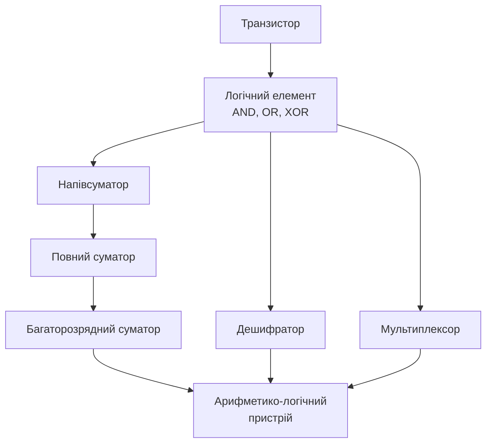

# Комбінаційні схеми: суматори, дешифратори, мультиплексори

> [!abstract] Коротко
> Ми навчилися будувати й мінімізувати довільну логічну функцію. Сьогодні подивимося на кілька функцій, які трапляються настільки часто, що для них існують готові, відпрацьовані десятиліттями схемні рішення – типові функціональні вузли. Розберемо суматор, який лежить в основі будь-якого арифметико-логічного пристрою, дешифратор, що перетворює код на вибір одного з багатьох, мультиплексор і демультиплексор – пару «зібрати – розібрати», а також компаратор і перетворювач кодів. Побачимо, як складні вузли будуються з простіших, і чому ця ієрархія – наскрізний принцип усієї схемотехніки.

## Навчальні цілі заняття

- **Знати:** означення комбінаційної схеми; будову й таблицю істинності напівсуматора та повного суматора; принцип каскадного та паралельного (з прискореним перенесенням) суматорів; будову дешифратора та шифратора, пріоритетного шифратора; будову мультиплексора та демультиплексора; принцип роботи компаратора; поняття перетворювача кодів.
- **Вміти:** будувати повний суматор із двох напівсуматорів; об'єднувати одно-розрядні суматори в багаторозрядний; реалізовувати довільну логічну функцію на мультиплексорі; складати дешифратор потрібної розмірності з менших; пояснювати компроміс між швидкодією та складністю схеми перенесення.

## План лекції

1. Що таке комбінаційна схема і чому це важливо повторити
2. Напівсуматор: перша арифметична схема
3. Повний суматор: враховуємо перенесення
4. Багаторозрядні суматори: послідовне й прискорене перенесення
5. Дешифратор: код стає вибором
6. Шифратор і пріоритетний шифратор
7. Мультиплексор: багато входів, один вихід
8. Демультиплексор і реалізація функцій на мультиплексорі
9. Компаратор і перетворювачі кодів
10. Ієрархія: як типові вузли складаються в систему

## 1. Що таке комбінаційна схема і чому це важливо повторити

Нагадаємо визначення з [[courses/computer-architecture/lectures/01-vstup-do-kompiuternoi-skhemotekhniky-ta-ii|Лекція 1. Вступ до комп'ютерної схемотехніки та її роль в ІТ]], бо на ньому тримається вся сьогоднішня лекція.

> [!definition] Визначення
> **Комбінаційна схема** – цифрова схема, значення виходів якої залежить **виключно** від поточної комбінації входів і не залежить від того, які значення були на входах раніше.

Це означає, що комбінаційна схема не має пам'яті: подали ту саму комбінацію входів двічі – отримали той самий вихід двічі, незалежно від того, що відбувалося між цими двома моментами. Усі вузли, які ми розглянемо сьогодні, – суматор, дешифратор, мультиплексор – саме такі. Наступного разу, у [[courses/computer-architecture/lectures/06-poslidovnisni-skhemy-tryhery-rehistry|Лекція 6. Послідовнісні схеми, тригери, регістри, лічильники]], ми побачимо протилежний клас, де пам'ять про минуле є визначальною.

Чому важливі саме **типові** вузли, а не довільні функції? Тому що арифметика, вибір і кодування – це задачі, які повторюються в будь-якій обчислювальній системі тисячі разів. Замість того щоб щоразу синтезувати їх заново методами з [[courses/computer-architecture/lectures/04-minimizatsiia-lohichnykh-funktsii-karty-karno|Лекція 4. Мінімізація логічних функцій (карти Карно, методи Куайна–МакКласкі)]], інженери відпрацювали для них оптимальні схемні рішення один раз – і тепер просто беруть готовий вузол із бібліотеки.

## 2. Напівсуматор: перша арифметична схема

Найпростіша арифметична задача – додати два однорозрядні двійкові числа.

> [!definition] Визначення
> **Напівсуматор** (half adder) – комбінаційна схема з двома входами (доданки A і B) та двома виходами: сума S і перенесення C, яка виконує додавання двох однорозрядних двійкових чисел без урахування вхідного перенесення.

| A | B | S | C |
|---|---|---|---|
| 0 | 0 | 0 | 0 |
| 0 | 1 | 1 | 0 |
| 1 | 0 | 1 | 0 |
| 1 | 1 | 0 | 1 |

Придивімося до стовпчика S: він точно збігається з таблицею істинності XOR, яку ми вивчали в [[courses/computer-architecture/lectures/03-lohichni-elementy-and-or-not-nand-nor-xor|Лекція 3. Логічні елементи, AND, OR, NOT, NAND, NOR, XOR]]. А стовпчик C – це точна таблиця AND. Тобто напівсуматор синтезувати навіть не потрібно: рішення випливає прямо із зіставлення з відомими функціями.

$$S = A \oplus B \qquad C = A \cdot B$$

![[attachments/ksak-l05-sumatory.svg|1150]]

Ліва частина малюнка – саме ця схема: один елемент XOR для суми, один AND для перенесення. Два елементи, два рівні логіки – простіше вже нікуди.

## 3. Повний суматор: враховуємо перенесення

Напівсуматор має суттєве обмеження: він не приймає вхідне перенесення, тому непридатний для розрядів, старших за нульовий, – адже туди прийде перенесення з попереднього розряду.

> [!definition] Визначення
> **Повний суматор** (full adder) – комбінаційна схема з трьома входами (A, B, вхідне перенесення Cin) та двома виходами (сума S, вихідне перенесення Cout).

| A | B | Cin | S | Cout |
|---|---|---|---|---|
| 0 | 0 | 0 | 0 | 0 |
| 0 | 0 | 1 | 1 | 0 |
| 0 | 1 | 0 | 1 | 0 |
| 0 | 1 | 1 | 0 | 1 |
| 1 | 0 | 0 | 1 | 0 |
| 1 | 0 | 1 | 0 | 1 |
| 1 | 1 | 0 | 0 | 1 |
| 1 | 1 | 1 | 1 | 1 |

Найелегантніший спосіб отримати цю схему – не мінімізувати її з нуля, а **зібрати з двох напівсуматорів**, як показано на правій частині малюнка вище.

Перший напівсуматор складає A і B, отримуючи проміжну суму S1 і проміжне перенесення C1. Другий напівсуматор додає до S1 вхідне перенесення Cin, отримуючи остаточну суму S і ще одне перенесення C2. Оскільки одночасно перенесення могло виникнути щонайбільше з одного з цих двох додавань, вихідне перенесення Cout отримуємо диз'юнкцією C1 і C2:

$$S = (A \oplus B) \oplus C_{in} \qquad C_{out} = A \cdot B + (A \oplus B) \cdot C_{in}$$

> [!example] Приклад
> Це класичний приклад **ієрархічного проєктування**: складний вузол зібрано з двох простіших без жодної повторної мінімізації. Той самий принцип ми побачимо в розділі 10 на рівні всієї системи: процесор складається з блоків, блоки – з вузлів, вузли – з елементів, і кожен рівень користується готовими рішеннями нижчого, не заглиблюючись у його внутрішню будову.

## 4. Багаторозрядні суматори: послідовне й прискорене перенесення

Реальні числа мають не один розряд, а вісім, шістнадцять, тридцять два. Найпростіший спосіб скласти багаторозрядний суматор – з'єднати однорозрядні повні суматори так, щоб вихідне перенесення кожного ставало вхідним для наступного.

> [!definition] Визначення
> **Суматор із послідовним перенесенням** (ripple carry adder) – багаторозрядний суматор, у якому перенесення поширюється послідовно від молодшого розряду до старшого через ланцюжок повних суматорів.

Схема гранично проста, але має суттєвий недолік. Розряд номер $k$ не може обчислити свою суму, доки не отримає перенесення з розряду $k-1$, а той – доки не отримає його з розряду $k-2$, і так до самого початку. Тому **затримка всього суматора зростає лінійно з розрядністю**: для 32-розрядного суматора сигнал перенесення мусить пройти крізь усі тридцять два вузли послідовно.

Для сучасних процесорів, де кожна наносекунда на рахунку, це неприйнятно. Розв'язок – **прискорене перенесення** (carry lookahead): окрема схема заздалегідь обчислює перенесення для кожного розряду одразу за вхідними даними, а не чекає, поки воно «дотече» природним шляхом. Це коштує додаткових елементів, зате затримка зростає значно повільніше за розрядність – практично логарифмічно замість лінійної.

| Критерій | Послідовне перенесення | Прискорене перенесення |
|---|---|---|
| Затримка від розрядності | лінійна | близько логарифмічної |
| Кількість елементів | мінімальна | більша |
| Складність схеми | найпростіша | значно складніша |
| Застосування | прості мікроконтролери, навчальні приклади | арифметико-логічні пристрої сучасних процесорів |

> [!warning] Типова помилка
> Вважати, що прискорене перенесення «скасовує» затримку суматора взагалі. Це не так: воно лише **істотно зменшує зростання** затримки з розрядністю. Затримка суматора завжди більша за затримку одного логічного елемента, і в реальних розрахунках критичного шляху процесора (див. [[courses/computer-architecture/lectures/10-systemy-komand-ta-konveierna-obrobka|Лекція 10. Системи команд та конвеєрна обробка]]) арифметико-логічний пристрій традиційно один із найдовших ланцюжків логіки в усій схемі.

## 5. Дешифратор: код стає вибором

Перейдімо від арифметики до другого типового завдання – вибору одного з багатьох.

> [!definition] Визначення
> **Дешифратор** (декодер) – комбінаційна схема з $n$ входами та $2^n$ виходами, яка активує рівно один вихід, номер якого відповідає двійковому коду на входах, а решту виходів утримує в неактивному стані.

![[attachments/ksak-l05-deshyfrator.svg|900]]

На малюнку – дешифратор 2 у 4: два входи дають чотири можливі коди, і кожному з них відповідає рівно один активний вихід. Загальна закономірність, яку варто запам'ятати: **дешифратор $n$ у $2^n$** будується з $2^n$ елементів AND (по одному на кожен вихід), кожен з яких перевіряє свою унікальну комбінацію входів, узятих прямо або з інверсією.

Дешифратори застосовують усюди, де потрібно вибрати один об'єкт за номером: вибір мікросхеми пам'яті за адресою (детальніше – в [[courses/computer-architecture/lectures/18-iierarkhiia-pamiati-ta-osnovni-typy-ram-rom|Лекція 18. Ієрархія пам'яті та основні типи (RAM, ROM, Flash)]]), вибір регістру для запису, керування семисегментним індикатором. Останній випадок – окремий різновид, який називають **дешифратором з перетворенням коду**: він не просто активує один із $2^n$ виходів, а формує спеціальний набір сигналів для запалювання потрібних сегментів індикатора.

## 6. Шифратор і пріоритетний шифратор

Задача, обернена до дешифрування: маємо $2^n$ ліній, на одній з яких є активний сигнал, і треба отримати її номер у вигляді $n$-розрядного коду.

> [!definition] Визначення
> **Шифратор** (кодер) – комбінаційна схема з $2^n$ входами та $n$ виходами, що формує двійковий код номера того входу, на якому присутній активний сигнал.

Простий шифратор має неприємне обмеження: якщо активними виявляться одразу два або більше входів, результат буде некоректним – коди накладуться, і на виході з'явиться щось безглузде. У реальному житті ситуація «активні одразу кілька входів» трапляється регулярно: наприклад, кілька пристроїв одночасно просять увагу процесора через переривання (це ми детально розберемо в [[courses/computer-architecture/lectures/25-pereryvannia-ta-obrobka-podii|Лекція 25. Переривання та обробка подій]]).

> [!definition] Визначення
> **Пріоритетний шифратор** – шифратор, який за одночасної активності кількох входів формує код **найстаршого** з них, ігноруючи молодші, а також додатково видає сигнал, що підтверджує наявність хоча б одного активного входу.

Саме пріоритетний, а не простий шифратор лежить в основі контролерів переривань і клавіатурних матриць, де кілька подій цілком можуть настати практично одночасно.

## 7. Мультиплексор: багато входів, один вихід

Третій типовий вузол – керований перемикач.

> [!definition] Визначення
> **Мультиплексор** (MUX) – комбінаційна схема з $2^n$ інформаційними входами, $n$ адресними входами та одним виходом, яка передає на вихід сигнал саме з того інформаційного входу, номер якого заданий адресними входами.

![[attachments/ksak-l05-multiplexor.svg|900]]

Мультиплексор можна уявити як обертовий перемикач із багатьма контактами: адресні входи вказують, на який контакт зараз «дивиться» стрілка, а вихід повторює те, що на цьому контакті. Різниця в тому, що в цифровій схемі перемикання відбувається не механічно, а електрично, за наносекунди.

Внутрішньо мультиплексор $4$ в $1$ будується так: чотири елементи AND, кожен з яких пропускає свій інформаційний вхід лише за «правильної» комбінації адресних сигналів (для цього частину адресних входів беруть з інверсією), і один елемент OR, що об'єднує їхні виходи. Це та сама схема, яку ми фактично будували в [[courses/computer-architecture/lectures/04-minimizatsiia-lohichnykh-funktsii-karty-karno|Лекція 4. Мінімізація логічних функцій (карти Карно, методи Куайна–МакКласкі)]], розглядаючи, як діють мінтерми.

Мультиплексори застосовують для вибору одного з кількох джерел даних – наприклад, який регістр процесора подати на вхід арифметико-логічного пристрою – і, як побачимо в наступному розділі, як універсальний інструмент реалізації довільних логічних функцій.

## 8. Демультиплексор і реалізація функцій на мультиплексорі

Обернена до мультиплексора операція – розподілити один сигнал по багатьох напрямках.

> [!definition] Визначення
> **Демультиплексор** (DEMUX) – комбінаційна схема з одним інформаційним входом, $n$ адресними входами та $2^n$ виходами, яка передає вхідний сигнал на той вихід, номер якого заданий адресними входами, а решту виходів утримує в неактивному стані.

Помітьте: демультиплексор структурно збігається з дешифратором, у якого додали ще один вхід – інформаційний сигнал, що модулює активний вихід. Фактично дешифратор – це окремий випадок демультиплексора, у якого інформаційний вхід постійно активний.

А ось цікавіша й практичніша властивість мультиплексора: **на ньому можна реалізувати будь-яку логічну функцію**, не використовуючи жодного окремого логічного елемента, крім самого мультиплексора.

> [!example] Приклад
> Розгляньмо функцію трьох змінних $F(A, B, C)$, задану довільною таблицею істинності. Візьмімо мультиплексор $4$ в $1$, подамо A і B на адресні входи, а на кожен інформаційний вхід $D_0$–$D_3$ подамо те значення (0, 1, C або $\overline{C}$), яке функція набуває за відповідної пари $A, B$ у таблиці істинності. Отримана схема обчислює F точно, без жодного додаткового елемента AND чи OR – уся логіка «захована» у самому мультиплексорі. Цей прийом активно застосовують у програмованих логічних інтегральних схемах, з якими ми познайомимося в [[courses/computer-architecture/lectures/07-syntez-tsyfrovykh-skhem-ta-intehralni|Лекція 7. Синтез цифрових схем та інтегральні мікросхеми]].

## 9. Компаратор і перетворювачі кодів

Ще два типові вузли, які варто знати назви й призначення.

> [!definition] Визначення
> **Компаратор** – комбінаційна схема, що порівнює два багаторозрядні двійкові числа й видає результат порівняння: «більше», «менше» або «дорівнює».

Найпростіший однорозрядний компаратор будується буквально на кількох елементах: рівність двох бітів перевіряється елементом XNOR (запереченням XOR), а порівняння «більше – менше» – комбінацією AND з інверсіями. Багаторозрядний компаратор порівнює числа розряд за розрядом, починаючи зі старшого, і за принципом дії нагадує послідовний суматор: результат старшого розряду, якщо він однозначний, «перекриває» результати молодших.

> [!definition] Визначення
> **Перетворювач кодів** – комбінаційна схема, що переводить число з одного способу двійкового кодування в інший, наприклад із звичайного двійкового коду в код Грея або в двійково-десятковий код.

З кодом Грея ми вже мали справу на минулій лекції: саме в ньому сусідні числа відрізняються одним розрядом, що й забезпечує сусідство клітинок на карті Карно. Перетворювач із двійкового коду в код Грея – одна з найпростіших схем такого типу: кожен розряд коду Грея дорівнює результату XOR двох сусідніх розрядів звичайного двійкового числа.

## 10. Ієрархія: як типові вузли складаються в систему

Озирнімося на пройдений матеріал і побачимо спільну нитку. Ми йшли строго знизу вгору: транзистор → логічний елемент → напівсуматор → повний суматор → багаторозрядний суматор. Кожен наступний рівень **не переосмислює** попередній, а користується ним як готовим блоком – так само, як ми не думаємо про транзистори, коли говоримо про XOR.

Цей самий принцип ієрархічної абстракції ми вже бачили на найпершій лекції курсу, коли говорили про вежу абстракцій від кремнію до прикладної програми. Тепер видно, що вежа не двоступенева й не триступенева – вона має багато проміжних щаблів, і кожен із типових вузлів сьогоднішньої лекції є одним із таких щаблів. Наступного разу ми додамо ще один щабель – послідовнісні схеми, які, на відміну від усього розглянутого сьогодні, пам'ятають свою історію.

> [!exam] На іспиті
> Типові завдання: а) побудувати таблицю істинності напівсуматора та повного суматора з обґрунтуванням; б) намалювати схему повного суматора з двох напівсуматорів; в) пояснити, чому суматор із послідовним перенесенням повільніший за прискорений, і що саме обмежує його швидкодію; г) побудувати дешифратор 3 у 8 або пояснити принцип його побудови; ґ) пояснити різницю між шифратором і пріоритетним шифратором на прикладі; д) реалізувати задану логічну функцію трьох змінних на мультиплексорі 4 в 1; е) пояснити, чим дешифратор є окремим випадком демультиплексора.

> [!question] Перевірте себе
> 1. Дайте означення комбінаційної схеми. Чим суматор відрізняється від тригера за цим означенням?
> 2. Побудуйте таблицю істинності напівсуматора. З яких відомих логічних функцій він складається?
> 3. Чому напівсуматор не можна використати для розрядів, старших за нульовий?
> 4. З яких двох напівсуматорів і як саме будується повний суматор?
> 5. Чому затримка суматора з послідовним перенесенням зростає лінійно з розрядністю?
> 6. У чому ідея прискореного перенесення і якою ціною воно досягається?
> 7. Скільки виходів має дешифратор із чотирма входами? Скільки з них активні одночасно?
> 8. Чим шифратор відрізняється від дешифратора?
> 9. Чому звичайний шифратор непридатний для клавіатур і контролерів переривань? Що застосовують натомість?
> 10. Скільки адресних входів потрібно мультиплексору з шістнадцятьма інформаційними входами?
> 11. Поясніть, як реалізувати довільну функцію трьох змінних на мультиплексорі 4 в 1.
> 12. Чим демультиплексор відрізняється від дешифратора структурно?
> 13. Яку функцію виконує компаратор і на якому елементі перевіряють рівність одного розряду?
> 14. Наведіть приклад перетворювача кодів і поясніть принцип переведення в код Грея.

## Назад

← [[courses/computer-architecture/lectures/04-minimizatsiia-lohichnykh-funktsii-karty-karno|Лекція 4. Мінімізація логічних функцій (карти Карно, методи Куайна–МакКласкі)]]

## Далі

→ [[courses/computer-architecture/lectures/06-poslidovnisni-skhemy-tryhery-rehistry|Лекція 6. Послідовнісні схеми, тригери, регістри, лічильники]]

## Література

**Базова (українською):**

1. Комп'ютерна схемотехніка і архітектура комп'ютерів. Частина 1: навчальний посібник. – Київ: Київський електромеханічний технікум, 2020. – розділ про комбінаційні схеми.
2. Минайленко Р. М., Конопліцька-Слободенюк О. К., Гермак В. С. Комп'ютерна схемотехніка: навчальний посібник. Вид. 2-ге. – Кропивницький: ЦНТУ, 2022.

**Допоміжна (англійською):**

3. Harris S. L., Harris D. M. Digital Design and Computer Architecture. RISC-V Edition. – Morgan Kaufmann, 2021. – розділ 2.8 «Combinational Building Blocks».
4. Mano M. M., Ciletti M. D. Digital Design. 6th ed. – Pearson, 2018. – розділ 4: комбінаційна логіка та типові функціональні вузли.

**Інструменти та ресурси:**

5. CircuitVerse – готові бібліотечні елементи суматорів, дешифраторів і мультиплексорів для складання й перевірки схем. URL: https://circuitverse.org/
6. Ben Eater. Building an 8-bit breadboard computer – відеосерія зі збиранням реального суматора на макетній платі. URL: https://eater.net/8bit

> [!info] Де взяти
> Позиції 1–2 лежать у теці `Матеріали/`. Розділ 2.8 у Гаррісів – найкраще джерело для повторення перед лабораторною роботою: там кожен вузол супроводжено і схемою, і кодом мовою опису апаратури, що знадобиться в [[courses/computer-architecture/lectures/07-syntez-tsyfrovykh-skhem-ta-intehralni|Лекція 7. Синтез цифрових схем та інтегральні мікросхеми]].
