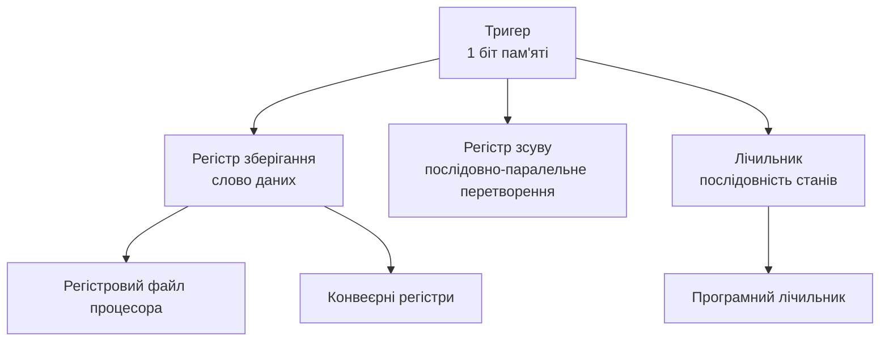

# Послідовнісні схеми: тригери, регістри, лічильники

> [!abstract] Коротко
> Усі схеми, які ми розглядали досі, миттєво забували все, щойно змінювалися входи. Сьогодні ми додаємо цифровій техніці найважливішу властивість – пам'ять. Розберемо тригер, найпростіший елемент, що зберігає один біт, простежимо еволюцію від найпримітивнішого RS-тригера до практичного D-тригера, який спрацьовує строго за фронтом тактового сигналу. З тригерів зберемо регістр – комірку пам'яті на кілька бітів – і лічильник, який рахує імпульси. Ці три вузли – тригер, регістр, лічильник – буквально є будівельним матеріалом для всього, що ми вивчатимемо в другій половині курсу: пам'яті, процесора, системної логіки.

## Навчальні цілі заняття

- **Знати:** означення послідовнісної схеми та її принципову відмінність від комбінаційної; будову RS-тригера на елементах NOR, його таблицю станів і заборонену комбінацію; поняття синхронного тригера, тактового сигналу, спрацьовування за рівнем і за фронтом; будову й поведінку D-тригера, JK-тригера, T-тригера; будову регістра зберігання та регістра зсуву; принцип роботи підсумовуючого та віднімального лічильників; поняття асинхронного та синхронного лічильника.
- **Вміти:** будувати таблицю переходів для RS-, D-, JK- та T-тригерів; пояснювати, чому потрібна синхронізація за фронтом, а не за рівнем; складати регістр зсуву та лічильник із заданих тригерів; читати часову діаграму послідовнісної схеми; пояснювати різницю в швидкодії асинхронного й синхронного лічильника.

## План лекції

1. Чому потрібна пам'ять: межа можливостей комбінаційних схем
2. RS-тригер: перша схема з пам'яттю
3. Заборонена комбінація і синхронізація
4. Спрацьовування за рівнем і за фронтом
5. D-тригер: практичний елемент пам'яті
6. JK-тригер і T-тригер
7. Регістри: зберігання й зсув
8. Лічильники: підсумовуючі й асинхронні
9. Синхронні лічильники: платимо схемою за швидкість
10. Від тригера до системи

## 1. Чому потрібна пам'ять: межа можливостей комбінаційних схем

Повернімося до прикладу зі світлофора, який ми розглядали в [[courses/computer-architecture/lectures/01-vstup-do-kompiuternoi-skhemotekhniky-ta-ii|Лекція 1. Вступ до комп'ютерної схемотехніки та її роль в ІТ]]. Команда «перемкнути сигнал» сама по собі не визначає, який колір увімкнути наступним – це залежить від того, який колір горить **зараз**. Комбінаційна схема, вихід якої залежить лише від поточних входів, у принципі не здатна відтворити таку поведінку: однакова команда мала б завжди давати однаковий результат, а тут результат залежить від передісторії.

Такий самий бар'єр виникає в лічильнику відвідувачів, у регістрі процесора, у самій оперативній пам'яті – усюди, де система має **пам'ятати** щось довше, ніж триває один набір вхідних сигналів. Розв'язок – ввести до схеми зворотний зв'язок: подати вихід назад на вхід.

> [!definition] Визначення
> **Послідовнісна схема** – цифрова схема, вихід якої залежить не лише від поточних значень входів, а й від **внутрішнього стану**, тобто від передісторії роботи схеми.

## 2. RS-тригер: перша схема з пам'яттю

Найпростіший спосіб отримати пам'ять – з'єднати два логічних елементи навхрест, подавши вихід кожного на вхід іншого.

> [!definition] Визначення
> **RS-тригер** (від set – встановити, reset – скинути) – найпростіша послідовнісна схема з двома входами S і R та двома взаємно інверсними виходами Q і $\overline{Q}$, побудована на двох елементах NOR із перехресним зворотним зв'язком.

![[attachments/ksak-l06-rs-tryger.svg|900]]

Простежмо роботу схеми крок за кроком. Нехай спочатку $S=1$, $R=0$. Верхній елемент NOR отримує одиницю на вході S, тож незалежно від іншого свого входу видає нуль: $\overline{Q}=0$. Цей нуль надходить на вхід нижнього елемента NOR разом із $R=0$ – обидва входи нижнього елемента нульові, тож $Q=1$. Тепер приберімо S, повернувши його в нуль: верхній елемент NOR має на входах S=0 і $Q=1$ (той самий, що ми щойно отримали) – через одиницю на другому вході він і далі видає нуль. Отже, $\overline{Q}=0$ і $Q=1$ **зберігаються** навіть після того, як сигнал S зняли. Це і є пам'ять: інформація про минулу подію «встановлення» лишилася закодованою в самому стані схеми.

| S | R | Режим | Стан |
|---|---|---|---|
| 0 | 0 | зберігання | попередній стан незмінний |
| 0 | 1 | скидання | $Q=0$ |
| 1 | 0 | встановлення | $Q=1$ |
| 1 | 1 | заборонено | $Q=\overline{Q}=0$ |

## 3. Заборонена комбінація і синхронізація

Останній рядок таблиці заслуговує окремої уваги.

> [!warning] Типова помилка
> Комбінація $S=1$, $R=1$ для RS-тригера на NOR є **забороненою**: вона змушує обидва виходи набути значення 0, порушуючи саму умову, що Q і $\overline{Q}$ мають бути взаємно інверсними. Гірше того: якщо після цього одночасно зняти S і R, тригер потрапляє в **непередбачуваний** стан – переможе той елемент, що трохи швидше відреагував на зміну, а це залежить від мікроскопічних розбіжностей у виготовленні конкретного примірника мікросхеми. На практиці це означає, що дві однакові на вигляд мікросхеми можуть повестися по-різному.

Другий недолік найпростішого RS-тригера – він реагує на входи в будь-який момент часу, щойно вони змінилися. У складній схемі з тисячами тригерів, де сигнали доходять різними за довжиною провідниками, це призводить до хаосу: різні тригери змінюють стан у різні мікроскопічні моменти, і схема втрачає узгодженість. Розв'язок ми вже згадували в [[courses/computer-architecture/lectures/01-vstup-do-kompiuternoi-skhemotekhniky-ta-ii|Лекція 1. Вступ до комп'ютерної схемотехніки та її роль в ІТ]] – спільний тактовий сигнал, метроном, за яким усі елементи схеми оновлюються одночасно.

## 4. Спрацьовування за рівнем і за фронтом

Додавання тактового сигналу до тригера можливе двома принципово різними способами.

**Тригер, керований рівнем** (защіпка, latch), стежить за входами весь час, доки тактовий сигнал утримує певний рівень (наприклад, високий), і «застигає» в момент, коли рівень змінюється на протилежний. Проблема такого підходу: доки тактовий сигнал високий, тригер прозорий для будь-яких змін на інформаційному вході, а це небезпечно в ланцюжку з кількох тригерів – сигнал може «прослизнути» крізь кілька з них за один такт.

**Тригер, керований фронтом**, реагує на вхід лише в момент **переходу** тактового сигналу з одного рівня на інший – передній фронт (з 0 в 1) або задній (з 1 в 0) – і повністю ігнорує зміни входу в будь-який інший момент.

> [!definition] Визначення
> **Тригер** (у вузькому, практичному сенсі) – послідовнісна схема, побудована на защіпках так, щоб реагувати на інформаційні входи лише в момент фронту тактового сигналу, і зберігати отримане значення незмінним до наступного фронту.

Саме тригери, керовані фронтом, а не защіпки, застосовують для побудови регістрів і лічильників у сучасних синхронних схемах, бо вони дають однозначний, передбачуваний момент фіксації даних.

## 5. D-тригер: практичний елемент пам'яті

Найпоширеніший тригер у реальних схемах розв'язує одразу обидві проблеми RS-тригера – заборонену комбінацію і відсутність чіткого моменту фіксації.

> [!definition] Визначення
> **D-тригер** (delay, затримка) – тригер з одним інформаційним входом D і тактовим входом C, який у момент фронту тактового сигналу копіює значення D на вихід Q і зберігає його до наступного фронту.

![[attachments/ksak-l06-d-tryger.svg|1050]]

Забороненої комбінації тут просто не існує за визначенням: вхід один, тож суперечливих вимог виникнути не може. Часова діаграма праворуч показує це наочно: сигнал D може змінюватися будь-коли, але **вихід Q змінюється лише в момент переднього фронту C**, копіюючи те значення D, яке було саме в цю мить. У всі інші моменти, навіть якщо D продовжує коливатися, Q лишається незмінним.

> [!example] Приклад
> Аналогія, яка добре запам'ятовується: D-тригер – це фотоапарат, а вхід D – краєвид перед об'єктивом. Краєвид може безперервно змінюватися: пролітають птахи, рухаються хмари. Але на знімку (виході Q) зафіксується лише те, що було в об'єктиві точно в момент натискання затвора (фронту тактового сигналу), – і цей знімок не зміниться, доки не буде зроблено наступний.

## 6. JK-тригер і T-тригер

Два інші тригери, які варто знати, бо кожен зручний для своєї задачі.

> [!definition] Визначення
> **JK-тригер** – тригер із двома інформаційними входами J і K, поведінка якого повторює RS-тригер (J відповідає встановленню, K – скиданню), за винятком комбінації $J=K=1$: замість забороненого стану тригер **перемикається в протилежний**.

JK-тригер фактично усуває недолік RS-тригера, зберігаючи його гнучкість: тепер жодна комбінація входів не є забороненою.

> [!definition] Визначення
> **T-тригер** (toggle, перемикання) – тригер з одним входом T, який за $T=1$ на кожному такті **змінює стан на протилежний**, а за $T=0$ зберігає попередній стан.

T-тригер легко отримати з JK-тригера, з'єднавши входи J і K разом: коли обидва дорівнюють одиниці, спрацьовує саме режим перемикання. T-тригер – ключовий елемент для побудови лічильників, до яких ми переходимо в розділі 8.

| Тригер | Входи | Особливість |
|---|---|---|
| RS | S, R | найпростіший, має заборонену комбінацію |
| D | D | без заборонених станів, копіює вхід за фронтом |
| JK | J, K | без заборонених станів, за J=K=1 перемикається |
| T | T | перемикається за одиниці, основа лічильників |

## 7. Регістри: зберігання й зсув

Один тригер зберігає один біт. Об'єднавши кілька тригерів, отримуємо схему для зберігання цілого слова даних.

> [!definition] Визначення
> **Регістр** – послідовнісна схема з кількох тригерів, керованих спільним тактовим сигналом, призначена для зберігання багаторозрядного двійкового числа.

Найпростіший **регістр зберігання** – це просто набір D-тригерів із незалежними інформаційними входами й спільним тактовим входом: за кожним фронтом усі тригери одночасно записують нове значення зі своїх входів.

![[attachments/ksak-l06-registr-lichylnyk.svg|1150]]

Верхня частина малюнка показує інший, не менш важливий різновид.

> [!definition] Визначення
> **Регістр зсуву** – регістр, у якому вихід кожного тригера з'єднаний із входом наступного, тому за кожним тактовим імпульсом уміст усього регістра «зсувається» на одну позицію, а на звільнене місце заходить новий біт із входу.

Регістри зсуву розв'язують задачу, з якою ми ще зіткнемося в [[courses/computer-architecture/lectures/22-systemna-shyna-struktura-ta-funktsii|Лекція 22. Системна шина, структура та функції]] і в [[courses/computer-architecture/lectures/23-vvedennia-vyvedennia-danykh-pryntsypy-ta|Лекція 23. Введення-виведення даних, принципи та інтерфейси]]: **перетворення між послідовним і паралельним поданням даних**. Дані надходять по одному дроту побітово (послідовно), заповнюють регістр зсуву за кілька тактів, а потім зчитуються одразу всі розряди (паралельно) – або навпаки, паралельні дані завантажуються в регістр за один такт, а потім видаються назовні побітово. Саме так, наприклад, влаштовані інтерфейси на кшталт послідовного порту.

## 8. Лічильники: підсумовуючі й асинхронні

Третій базовий вузол – схема, що рахує імпульси.

> [!definition] Визначення
> **Лічильник** – послідовнісна схема з $n$ тригерів, яка проходить послідовність із $2^n$ станів у визначеному порядку, змінюючи стан на кожен тактовий (або інший обумовлений) імпульс.

Найпростіший спосіб побудувати лічильник – узяти T-тригери й з'єднати їх так, щоб **вихід кожного попереднього тригера слугував тактовим сигналом для наступного**, як показано в нижній частині малюнка вище.

Ідея тримається на простій властивості T-тригера: за одиниці на вході T він перемикається щоразу, коли на його тактовому вході з'являється фронт, тобто **ділить частоту навпіл**. Перший тригер перемикається з кожним тактовим імпульсом – ділить частоту на 2. Другий тригер отримує на свій тактовий вхід сигнал із виходу першого і теж ділить його навпіл – відносно початкової частоти це вже ділення на 4. Третій дає ділення на 8, і так далі. У результаті на виходах тригерів формується послідовність двійкових чисел, що зростає на одиницю з кожним тактовим імпульсом, – саме тому такий лічильник називають **підсумовуючим**.

> [!definition] Визначення
> **Асинхронний лічильник** – лічильник, у якому тригери перемикаються послідовно один за одним, а не одночасно від спільного тактового сигналу.

Слово «асинхронний» тут означає саме це: другий тригер не отримує той самий тактовий імпульс, що й перший, – він реагує на **вихід** першого, з певною затримкою відносно початкового імпульсу. Ця затримка накопичується так само, як накопичувалося перенесення в суматорі з розділу 4 попередньої лекції: щоб отримати правильний результат в останньому, старшому розряді, треба зачекати, поки сигнал пройде через усі попередні тригери послідовно.

## 9. Синхронні лічильники: платимо схемою за швидкість

Той самий компроміс «швидкість проти складності», який ми бачили для суматорів, повторюється й тут.

> [!definition] Визначення
> **Синхронний лічильник** – лічильник, у якому тактовий сигнал подається **одночасно** на всі тригери, а потрібна логіка перемикання кожного розряду обчислюється окремою комбінаційною схемою прямо з поточного стану лічильника.

У синхронному лічильнику всі розряди змінюються практично одночасно, за один тактовий інтервал, незалежно від розрядності. Ціна – додаткова комбінаційна логіка перед кожним тригером (крім першого), яка має «наперед» визначити, чи має цей розряд перемкнутися саме зараз, з огляду на стан усіх молодших розрядів.

| Критерій | Асинхронний лічильник | Синхронний лічильник |
|---|---|---|
| Момент перемикання розрядів | послідовно, з накопиченням затримки | одночасно |
| Максимальна швидкодія | обмежена сумарною затримкою | обмежена затримкою одного розряду |
| Складність схеми | мінімальна | більша, потрібна додаткова логіка |
| Типове застосування | прості дільники частоти | лічильники в процесорах і швидкісних вузлах |

> [!info] Для допитливих
> Той самий принцип «послідовно проти одночасно, простіше проти швидше» ми вже бачили тричі за два заняття: послідовне перенесення проти прискореного в суматорі, асинхронний проти синхронного лічильника, а раніше – грубий перебір проти карт Карно в мінімізації. Це не збіг: практично вся інженерія цифрових схем – це вибір точки на осі «простота – швидкодія» під конкретну задачу, і жодна з крайніх точок не є універсально правильною.

## 10. Від тригера до системи

Три вузли сьогоднішньої лекції – тригер, регістр, лічильник – не є абстрактною теорією: вони буквально складають внутрішній устрій кожного процесора.

**Регістровий файл** процесора, з яким ми познайомимося в [[courses/computer-architecture/lectures/09-tsentralnyi-protsesor-ta-aryfmetyko-lohichnyi|Лекція 9. Центральний процесор та арифметико‑логічний пристрій (АЛП)]], – це набір регістрів зберігання, кожен з яких тримає одне з небагатьох чисел, з якими процесор працює прямо зараз. **Програмний лічильник**, що визначає адресу наступної команди, – це в буквальному сенсі лічильник, який щотакту (чи щокоманду) збільшується на одиницю, з можливістю примусово завантажити нове значення під час переходу. **Конвеєрні регістри**, про які піде мова в [[courses/computer-architecture/lectures/10-systemy-komand-ta-konveierna-obrobka|Лекція 10. Системи команд та конвеєрна обробка]], – це регістри зберігання, розставлені між стадіями обробки команди.

Наступного разу ми подивимося, як усі ці вузли – і комбінаційні з попередньої лекції, і послідовнісні з сьогоднішньої – реально втілюються у вигляді інтегральних мікросхем, і які етапи проходить схема від задуму до готового кристала.

> [!exam] На іспиті
> Типові завдання: а) побудувати RS-тригер на NOR і скласти для нього таблицю станів, включно з поясненням забороненої комбінації; б) пояснити різницю між тригером, керованим рівнем, і тригером, керованим фронтом; в) намалювати часову діаграму D-тригера для заданої послідовності D і C; г) вивести таблицю переходів JK- або T-тригера; ґ) пояснити принцип побудови регістра зсуву та навести приклад його застосування; д) пояснити, чому асинхронний лічильник повільніший за синхронний, спираючись на поняття затримки поширення.

> [!question] Перевірте себе
> 1. Чим послідовнісна схема принципово відрізняється від комбінаційної?
> 2. Побудуйте RS-тригер на елементах NOR і поясніть, чому він зберігає стан за $S=R=0$.
> 3. Чому комбінація $S=R=1$ вважається забороненою?
> 4. Чим тригер, керований фронтом, відрізняється від тригера, керованого рівнем?
> 5. Що робить D-тригер у момент переднього фронту тактового сигналу, а що – в усі інші моменти?
> 6. Чим JK-тригер розв'язує проблему забороненої комбінації RS-тригера?
> 7. Як з JK-тригера отримати T-тригер?
> 8. Що таке регістр зберігання і чим він відрізняється від регістра зсуву?
> 9. Для якої задачі застосовують регістр зсуву? Наведіть приклад.
> 10. Як T-тригери з'єднують, щоб отримати підсумовуючий лічильник?
> 11. Чому асинхронний лічильник називають асинхронним, хоча тактовий сигнал у нього є?
> 12. Чому синхронний лічильник швидший за асинхронний і якою ціною це досягається?
> 13. Наведіть три приклади того, де регістри й лічильники застосовуються всередині процесора.

## Назад

← [[courses/computer-architecture/lectures/05-kombinatsiini-skhemy-sumatory-deshyfratory|Лекція 5. Комбінаційні схеми, суматори, дешифратори, мультиплексори]]

## Далі

→ [[courses/computer-architecture/lectures/07-syntez-tsyfrovykh-skhem-ta-intehralni|Лекція 7. Синтез цифрових схем та інтегральні мікросхеми]]

## Література

**Базова (українською):**

1. Комп'ютерна схемотехніка і архітектура комп'ютерів. Частина 1: навчальний посібник. – Київ: Київський електромеханічний технікум, 2020. – розділ про послідовнісні схеми.
2. Минайленко Р. М., Конопліцька-Слободенюк О. К., Гермак В. С. Комп'ютерна схемотехніка: навчальний посібник. Вид. 2-ге. – Кропивницький: ЦНТУ, 2022.

**Допоміжна (англійською):**

3. Harris S. L., Harris D. M. Digital Design and Computer Architecture. RISC-V Edition. – Morgan Kaufmann, 2021. – розділ 3: «Sequential Logic Design».
4. Mano M. M., Ciletti M. D. Digital Design. 6th ed. – Pearson, 2018. – розділи 5–6: тригери, регістри, лічильники.

**Інструменти та ресурси:**

5. CircuitVerse – бібліотечні тригери, регістри й лічильники для складання і перевірки схем моделюванням. URL: https://circuitverse.org/
6. Ben Eater. Building an 8-bit breadboard computer – наочна побудова регістрів і лічильника на реальних мікросхемах. URL: https://eater.net/8bit

> [!info] Де взяти
> Позиції 1–2 лежать у теці `Матеріали/`. Розділ 3 у Гаррісів дає найповніший і найсучасніший виклад теми, з поясненням, чому індустрія практично повністю перейшла на тригери, керовані фронтом.
