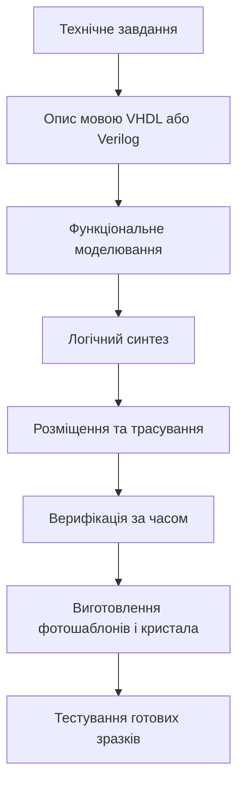
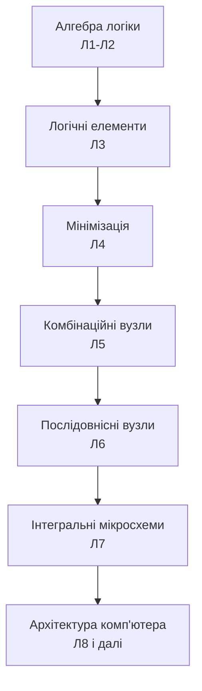

# Синтез цифрових схем та інтегральні мікросхеми

> [!abstract] Коротко
> Ми пройшли повний шлях від логічного елемента до регістрів і лічильників, малюючи схеми на папері й перевіряючи їх у симуляторі. Сьогодні – підсумкова лекція першого змістового блоку курсу: як усе це втілюється у фізичну мікросхему. Розберемо рівні інтеграції – від кількох елементів в одному корпусі до мільярдів транзисторів на кристалі, познайомимося з програмованою логікою, яка дозволяє «перепаяти» схему без паяльника, і пройдемо весь маршрут сучасного проєктування: від технічного завдання до готового кристала. Це той матеріал, що пов'язує все, вивчене в перших шести лекціях, з реальною промисловістю мікроелектроніки.

## Навчальні цілі заняття

- **Знати:** класифікацію інтегральних мікросхем за рівнем інтеграції (SSI, MSI, LSI, VLSI, ULSI); поняття мікросхем жорсткої логіки та програмованої логіки; будову й принцип роботи програмованої логічної матриці (PLA) та програмованої матричної логіки (PAL); поняття програмованої логічної інтегральної схеми (ПЛІС, FPGA) та її внутрішньої будови; етапи сучасного маршруту проєктування цифрової мікросхеми; призначення мов опису апаратури VHDL і Verilog.
- **Вміти:** визначати рівень інтеграції мікросхеми за кількістю елементів; пояснювати переваги й обмеження програмованої логіки порівняно з жорсткою; описувати простий комбінаційний вузол мовою опису апаратури на рівні розуміння коду; пояснювати послідовність етапів маршруту проєктування та роль моделювання на кожному з них.

## План лекції

1. Від макетної плати до кристала: навіщо інтеграція
2. Рівні інтеграції: SSI, MSI, LSI, VLSI, ULSI
3. Жорстка логіка: мікросхеми з фіксованою функцією
4. Програмована логіка: PLA та PAL
5. ПЛІС: програмована логіка на новому рівні
6. Мови опису апаратури: VHDL та Verilog
7. Маршрут проєктування: від задуму до кристала
8. Моделювання та верифікація
9. Виготовлення й тестування
10. Підсумок розділу: що ми вміємо після семи лекцій

## 1. Від макетної плати до кристала: навіщо інтеграція

На попередніх заняттях ми малювали схеми з окремих елементів – AND, OR, тригер, суматор – так, ніби кожен із них є окремою деталлю, яку треба з'єднати дротом із сусідньою. У навчальній лабораторії так і є: логічні елементи в конкретних корпусах, з'єднані провідниками на макетній платі.

Але реальний процесор має не десятки, а мільярди елементів. З'єднати їх дротами фізично неможливо: провідники займають місце, вносять затримку та завади, а кожне паяне з'єднання – потенційне джерело відмови. Розв'язок – **інтеграція**: виготовлення багатьох транзисторів і з'єднань між ними одразу на одній пластині кремнію, як єдиного виробу.

> [!definition] Визначення
> **Інтегральна мікросхема** – електронний виріб, у якому всі елементи схеми (транзистори, з'єднання, іноді резистори й конденсатори) виготовлені на єдиній напівпровідниковій підкладці за допомогою єдиного технологічного процесу.

## 2. Рівні інтеграції: SSI, MSI, LSI, VLSI, ULSI

Історія мікроелектроніки – це історія стрімкого зростання кількості елементів на одному кристалі. Заведено виділяти кілька рівнів інтеграції за орієнтовною кількістю транзисторів або логічних елементів.

![[attachments/ksak-l07-integraciya.svg|1080]]

- **SSI** (Small Scale Integration, мала інтеграція) – одиниці-десятки елементів. Приклад – мікросхема з чотирма незалежними елементами NAND, яку ми згадували в [[courses/computer-architecture/lectures/03-lohichni-elementy-and-or-not-nand-nor-xor|Лекція 3. Логічні елементи, AND, OR, NOT, NAND, NOR, XOR]].
- **MSI** (Medium Scale Integration, середня інтеграція) – десятки-сотні елементів. Сюди належать усі типові вузли з [[courses/computer-architecture/lectures/05-kombinatsiini-skhemy-sumatory-deshyfratory|Лекція 5. Комбінаційні схеми, суматори, дешифратори, мультиплексори]] та [[courses/computer-architecture/lectures/06-poslidovnisni-skhemy-tryhery-rehistry|Лекція 6. Послідовнісні схеми, тригери, регістри, лічильники]]: суматори, дешифратори, регістри, лічильники в готовому корпусі.
- **LSI** (Large Scale Integration, велика інтеграція) – сотні-десятки тисяч елементів. Перші мікропроцесори, найпростіші мікросхеми пам'яті.
- **VLSI** (Very Large Scale Integration, надвелика інтеграція) – десятки тисяч до десятків мільйонів елементів. Сучасні мікроконтролери, більшість спеціалізованих мікросхем.
- **ULSI / система на кристалі** – понад десятки мільйонів, аж до десятків мільярдів елементів. Сучасні процесори настільних комп'ютерів і смартфонів, де на одному кристалі об'єднано процесорні ядра, графічний прискорювач, контролери пам'яті й периферії.

> [!info] Для допитливих
> Межі між рівнями умовні й змістилися за півстоліття на кілька порядків: те, що в сімдесятих роках вважалося LSI, сьогодні поміщається в куточку одного ядра сучасного процесора. Показовіше не запам'ятовувати точні межі, а розуміти напрям і темп зростання – саме про це йшлося в законі Мура з [[courses/computer-architecture/lectures/01-vstup-do-kompiuternoi-skhemotekhniky-ta-ii|Лекція 1. Вступ до комп'ютерної схемотехніки та її роль в ІТ]].

## 3. Жорстка логіка: мікросхеми з фіксованою функцією

Усі мікросхеми, які ми розглядали дотепер – окремі логічні елементи, конкретний суматор, конкретний регістр, – належать до одного типу.

> [!definition] Визначення
> **Мікросхема жорсткої логіки** – інтегральна мікросхема, функція якої визначена остаточно на етапі виготовлення й не може бути змінена користувачем.

Перевага жорсткої логіки – максимальна швидкодія й мінімальна ціна за штуку у великій серії: усі транзистори працюють на одну конкретну задачу, жодних зайвих елементів. Недолік – цілковита негнучкість: якщо потрібна хоч трохи інша функція, доведеться проєктувати й виготовляти нову мікросхему, а це місяці розробки та величезні витрати на підготовку виробництва.

Це підводить до природного питання: чи можна отримати мікросхему, яку користувач сам «налаштує» на потрібну функцію вже після виготовлення?

## 4. Програмована логіка: PLA та PAL

Перші відповіді на це питання з'явилися задовго до сучасних ПЛІС.

> [!definition] Визначення
> **Програмована логічна матриця** (Programmable Logic Array, PLA) – мікросхема, що містить матрицю елементів AND і матрицю елементів OR, обидві з яких можна програмувати, тобто задавати, які саме входи з'єднані з якими елементами.

PLA дозволяє реалізувати будь-який набір логічних функцій у формі суми добутків, обмежений лише розміром матриць. Це майже пряме апаратне втілення ідеї з розділу 12 [[courses/computer-architecture/lectures/02-alhebra-lohiky-bazovi-zakony-ta-operatsii|Лекція 2. Алгебра логіки, базові закони та операції]] – мінімізованої диз'юнктивної нормальної форми, яку ми навчилися отримувати картами Карно.

> [!definition] Визначення
> **Програмована матрична логіка** (Programmable Array Logic, PAL) – спрощений варіант PLA, у якому програмованою є лише матриця AND, а матриця OR має фіксовані з'єднання.

PAL простіша й дешевша за PLA, хоч і менш гнучка. На практиці саме PAL і подібні їй мікросхеми набули значно ширшого поширення у вісімдесятих роках завдяки простоті виробництва.

| Критерій | PLA | PAL |
|---|---|---|
| Матриця AND | програмована | програмована |
| Матриця OR | програмована | фіксована |
| Гнучкість | вища | нижча |
| Складність і ціна | вищі | нижчі |

## 5. ПЛІС: програмована логіка на новому рівні

PLA й PAL реалізують лише комбінаційну логіку у вигляді суми добутків. Сучасна відповідь на потребу в гнучкому апаратному забезпеченні пішла значно далі.

> [!definition] Визначення
> **Програмована логічна інтегральна схема** (ПЛІС, англійською FPGA – Field-Programmable Gate Array) – інтегральна мікросхема, що складається з великої кількості однакових настроюваних логічних комірок і настроюваної мережі з'єднань між ними, конфігурація яких визначається користувачем **після** виготовлення мікросхеми.

Ключова відмінність від PLA й PAL – універсальність. Кожна логічна комірка ПЛІС зазвичай містить невелику таблицю відповідності (look-up table): пам'ять, яка на будь-яку комбінацію входів (скажімо, чотирьох) видає заздалегідь записане значення виходу. Оскільки будь-яку логічну функцію можна задати таблицею істинності, а таблиця істинності – це і є вміст такої пам'яті, одна комірка може реалізувати **довільну** функцію обмеженої кількості входів, а не лише суму добутків. Комірки з'єднуються між собою через настроювану мережу провідників, тому з них можна зібрати не лише комбінаційну, а й послідовнісну схему – кожна комірка зазвичай має вбудований тригер.

> [!example] Приклад
> ПЛІС часто застосовують для швидкого прототипування: перш ніж замовляти виготовлення дорогої спеціалізованої мікросхеми (це коштує сотні тисяч доларів і триває місяці), розробники «заливають» свій проєкт у ПЛІС і перевіряють його на реальному апаратному забезпеченні за лічені хвилини. Якщо знайдено помилку – переконфігуровують ту саму мікросхему й пробують знову, без жодних витрат на нове виробництво.

Плата за таку гнучкість – ПЛІС значно повільніша, більша за розміром і споживає більше енергії, ніж жорстка мікросхема з тією самою функцією, бо велика частка кристала витрачається на настроювані елементи, а не на власне корисну логіку.

## 6. Мови опису апаратури: VHDL та Verilog

Малювати схему з мільйона елементів вручну неможливо фізично. Тому сучасне проєктування описує бажану поведінку схеми **текстом**, а не кресленням.

> [!definition] Визначення
> **Мова опису апаратури** (Hardware Description Language, HDL) – мова програмування, призначена для формального опису структури та поведінки цифрових електронних схем.

Дві найпоширеніші мови – **VHDL**, розроблена спершу за замовленням міністерства оборони США, і **Verilog**, ближча синтаксично до мови C. Обидві дозволяють описувати схему на двох рівнях: **структурному** (яка схема з яких компонентів складається і як вони з'єднані – практично текстовий запис креслення) і **поведінковому** (що схема має робити, без деталізації внутрішньої будови).

> [!example] Приклад
> Порівняймо два описи того самого мультиплексора з [[courses/computer-architecture/lectures/05-kombinatsiini-skhemy-sumatory-deshyfratory|Лекція 5. Комбінаційні схеми, суматори, дешифратори, мультиплексори]]. Структурний опис перелічив би конкретні елементи AND і OR та їхні з'єднання – так, як ми малювали схему на папері. Поведінковий опис звівся б до одного рядка на кшталт «якщо вибір дорівнює нулю, вихід дорівнює першому входу, інакше – другому». Синтезатор сам перетворить такий опис на конкретну схему з елементів, дібраних під обрану технологію виготовлення, – так само, як компілятор перетворює текст програми на машинний код, не змушуючи програміста писати цей код вручну.

Опис мовою HDL – це той самий текстовий опис, який синтезатор перетворює на конфігурацію ПЛІС або на схему для виготовлення спеціалізованої мікросхеми. Саме тому знання HDL є практичним продовженням усього, що ми вивчили: досконала диз'юнктивна нормальна форма, мінімізація, типові вузли – усе це відбувається «під капотом» синтезатора, а інженер описує лише **що** потрібно отримати.

## 7. Маршрут проєктування: від задуму до кристала

Тепер зберемо все в єдину послідовність – реальний маршрут, яким проходить проєкт цифрової мікросхеми в промисловості.

**Технічне завдання** визначає, яку функцію має виконувати майбутня схема, які має бути обмеження за швидкодією, споживанням, розміром. **Опис мовою HDL** перетворює це завдання на формальний, машинозчитуваний текст. **Функціональне моделювання** перевіряє, чи описана поведінка відповідає задуму, – і саме на цьому етапі найдешевше виправляти помилки: тут вони коштують лише часу симуляції, а не переробки кристала.

**Логічний синтез** – та сама автоматизована мінімізація й перетворення на набір реальних логічних елементів обраної бібліотеки, про яку ми говорили в попередньому розділі. **Розміщення та трасування** визначає фізичне положення кожного елемента на кристалі та прокладає між ними реальні провідники – це вже не логічна, а геометрична задача, і від її якості залежить площа й швидкодія готового кристала.

## 8. Моделювання та верифікація

Розгляньмо докладніше два останні перед виробництвом етапи, бо саме тут відсіюється переважна більшість помилок.

**Верифікація за часом** (timing verification) перевіряє, що за реальних, фізичних затримок кожного елемента й кожного провідника схема все ще встигає обчислити правильний результат до наступного тактового імпульсу. Пригадаймо розділ про прискорене перенесення з [[courses/computer-architecture/lectures/05-kombinatsiini-skhemy-sumatory-deshyfratory|Лекція 5. Комбінаційні схеми, суматори, дешифратори, мультиплексори]]: якщо найдовший шлях сигналу (критичний шлях) виявиться довшим за період такту, схема на реальній частоті працюватиме неправильно, хоча логічно спроєктована бездоганно.

> [!warning] Типова помилка
> Вважати, що коли схема правильно пройшла функціональне моделювання, вона гарантовано запрацює на кристалі. Функціональне моделювання зазвичай не враховує реальних затримок і перевіряє лише **логічну** правильність – яку саме функцію обчислює схема. Часова верифікація перевіряє зовсім інше питання: чи встигає ця правильна логіка обчислитися вчасно. Обидві перевірки обов'язкові й доповнюють одна одну, а не замінюють.

## 9. Виготовлення й тестування

Після успішної верифікації дані про розташування кожного елемента й кожного провідника передають на завод-виробник, де виготовляють **фотошаблони** – прецизійні трафарети для кожного шару майбутнього кристала. Виробництво відбувається на кремнієвій пластині, яку ми вже бачили на першій лекції: сотні майбутніх кристалів одночасно формуються шар за шаром через процеси, що нагадують фотографічний друк у мікроскопічному масштабі.

Готові кристали проходять **тестування**: кожен перевіряють на відповідність специфікації, шукають виробничі дефекти. Через статистичну природу процесу частина кристалів на пластині виявляється несправною або здатною працювати лише на нижчій частоті – саме тому в продажу трапляються моделі процесорів з однієї родини, що відрізняються лише тактовою частотою: це часто ті самі кристали, розсортовані за результатами тестування.

## 10. Підсумок розділу: що ми вміємо після семи лекцій

Озирнімося на пройдений шлях перших семи занять, бо він утворює завершену, самодостатню історію.

Ми почали з питання, навіщо взагалі потрібна ця дисципліна, і побудували вежу абстракцій від кремнію до прикладної програми. Отримали математичний апарат – алгебру логіки – і навчилися нею перетворювати й доводити еквівалентність схем. Побачили, з чого фізично складається логічний елемент і чому промисловість обрала саме NAND і NOR як базові. Навчилися прибирати надлишковість за допомогою карт Карно й методу Куайна–МакКласкі. Зібрали з елементарних цеглинок типові комбінаційні вузли – суматор, дешифратор, мультиплексор – і побачили ту саму ідею ієрархічного складання, що працює на всіх рівнях. Додали до схем пам'ять через тригери й отримали регістри та лічильники. І нарешті сьогодні побачили, як усе це втілюється у фізичний кристал, і яким шляхом проходить сучасний проєкт мікросхеми.

Це не завершення курсу, а завершення **фундаменту**. Починаючи з наступної лекції, ми піднімаємося на рівень вище – від окремих цифрових вузлів до архітектури комп'ютера в цілому: моделі фон Неймана, процесора, системи команд. Але кожна тема звідти буде спиратися на щось із перших семи занять – суматор стане частиною арифметико-логічного пристрою, регістри – регістровим файлом, а розуміння затримок і синтезу пояснить, чому одні архітектурні рішення працюють швидше за інші.

> [!exam] На іспиті
> Типові завдання: а) визначити рівень інтеграції мікросхеми за orієнтовною кількістю елементів; б) пояснити різницю між жорсткою й програмованою логікою; в) порівняти PLA та PAL за програмованими матрицями; г) пояснити принцип роботи логічної комірки ПЛІС на основі таблиці відповідності; ґ) назвати етапи маршруту проєктування цифрової мікросхеми в правильному порядку; д) пояснити різницю між функціональним моделюванням і верифікацією за часом.

> [!question] Перевірте себе
> 1. Що таке інтегральна мікросхема і чим вона відрізняється від з'єднання окремих транзисторів дротами?
> 2. Перелічіть рівні інтеграції від SSI до ULSI із орієнтовною кількістю елементів кожного.
> 3. Що таке мікросхема жорсткої логіки та які в неї переваги й недоліки?
> 4. Чим PLA відрізняється від PAL за будовою?
> 5. Що таке ПЛІС і чим вона принципово гнучкіша за PLA та PAL?
> 6. Що таке таблиця відповідності в логічній комірці ПЛІС і чому вона дозволяє реалізувати будь-яку функцію обмеженої кількості входів?
> 7. Яку ціну платить розробник за гнучкість ПЛІС порівняно з жорсткою мікросхемою?
> 8. Що таке мова опису апаратури і чим структурний опис відрізняється від поведінкового?
> 9. Перелічіть етапи маршруту проєктування цифрової мікросхеми в правильному порядку.
> 10. Чому виправляти помилку на етапі функціонального моделювання дешевше, ніж після виготовлення кристала?
> 11. Чим верифікація за часом відрізняється від функціонального моделювання? Чому обидві потрібні?
> 12. Чому в продажу трапляються процесори однієї родини з різною тактовою частотою?

## Назад

← [[courses/computer-architecture/lectures/06-poslidovnisni-skhemy-tryhery-rehistry|Лекція 6. Послідовнісні схеми, тригери, регістри, лічильники]]

## Далі

→ [[courses/computer-architecture/lectures/08-arkhitektura-kompiutera-model-fon-neimana-ta|Лекція 8. Архітектура комп'ютера, модель фон Неймана та Гарвардська модель]]

## Література

**Базова (українською):**

1. Комп'ютерна схемотехніка і архітектура комп'ютерів. Частина 1: навчальний посібник. – Київ: Київський електромеханічний технікум, 2020. – розділ про інтегральні мікросхеми.
2. Минайленко Р. М., Конопліцька-Слободенюк О. К., Гермак В. С. Комп'ютерна схемотехніка: навчальний посібник. Вид. 2-ге. – Кропивницький: ЦНТУ, 2022.

**Допоміжна (англійською):**

3. Harris S. L., Harris D. M. Digital Design and Computer Architecture. RISC-V Edition. – Morgan Kaufmann, 2021. – розділ 4: «Hardware Description Languages».
4. Nisan N., Schocken S. The Elements of Computing Systems. – MIT Press, 2021. – практична побудова схем від елемента до комп'ютера.

**Інструменти та ресурси:**

5. CircuitVerse – онлайновий симулятор, придатний і для перевірки простих HDL-подібних описів. URL: https://circuitverse.org/
6. EDA Playground – онлайнове середовище для написання й моделювання коду VHDL та Verilog просто в браузері. URL: https://www.edaplayground.com/
7. nand2tetris – практичний курс побудови комп'ютера з нуля, включно з власною мовою опису апаратури. URL: https://nand2tetris.org/

> [!info] Де взяти
> Позиції 1–2 лежать у теці `Матеріали/`. Розділ 4 у Гаррісів варто прочитати уважно: він містить паралельні приклади того самого коду мовами VHDL і Verilog, що дуже зручно для першого знайомства. EDA Playground дозволяє спробувати написати й запустити перший опис схеми без встановлення жодного програмного забезпечення.
