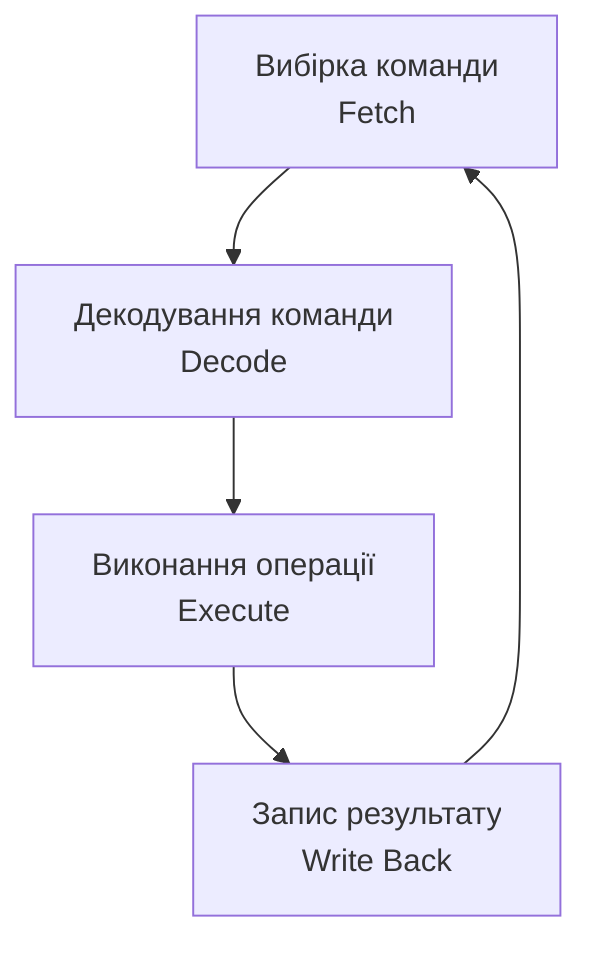

# Архітектура комп'ютера: модель фон Неймана та Гарвардська модель

> [!abstract] Коротко
> Сім попередніх лекцій ми будували цеглинки: логічні елементи, комбінаційні й послідовнісні вузли, мікросхеми. Сьогодні починається другий блок курсу – ми піднімаємося на рівень системи в цілому й дивимося, як із цих цеглинок збирають комп'ютер. Розберемо докладно модель, закладену Джоном фон Нейманом ще у звіті про проєкт EDVAC 1945 року: чотири функціональні блоки, шини між ними та принцип збереженої програми. Порівняємо цю модель із гарвардською альтернативою й побачимо, де кожна з них перемагає на практиці. І пройдемо весь цикл виконання команди – fetch-decode-execute – рух за рухом, бо саме цей цикл ми деталізуватимемо всі наступні заняття цього блоку.

## Навчальні цілі заняття

- **Знати:** склад моделі фон Неймана та призначення кожного з чотирьох блоків; призначення шин адреси, даних і керування; принцип збереженої програми та його наслідки; будову й переваги гарвардської архітектури; поняття модифікованої гарвардської архітектури; етапи циклу вибірки-декодування-виконання команди; поняття лічильника команд і регістра команд.
- **Вміти:** пояснювати призначення кожної шини та напрям передавання по ній сигналів; порівнювати фон-нейманівську й гарвардську архітектури за конкретними критеріями; трасувати виконання найпростішої команди по кроках циклу fetch-decode-execute; наводити приклади сучасних систем, що використовують кожну з архітектур.

## План лекції

1. Від окремих вузлів до системи: що таке архітектура комп'ютера
2. Чотири блоки моделі фон Неймана
3. Шини: як блоки спілкуються між собою
4. Принцип збереженої програми
5. Цикл вибірки-декодування-виконання
6. Лічильник команд і регістр команд
7. Вузьке місце фон Неймана: повторення й уточнення
8. Гарвардська архітектура: розділення заради швидкості
9. Модифікована гарвардська архітектура: компроміс на практиці
10. Де яку архітектуру застосовують сьогодні

## 1. Від окремих вузлів до системи: що таке архітектура комп'ютера

Пригадаймо розрізнення, яке ми зробили в самій першій лекції курсу: **схемотехніка** – це наука про те, як з елементарних перемикачів скласти вузол, що виконує потрібну функцію; **архітектура** – це план того, як зі скінченного набору таких вузлів зібрати систему, що виконує довільну програму.

Усі сім попередніх занять були про схемотехніку в цьому розумінні: ми будували суматор, регістр, лічильник – окремі, самодостатні вузли. Сьогодні ми переходимо до архітектури: як розташувати ці вузли один відносно одного, як з'єднати їх шинами, і головне – як зробити так, щоб система, зібрана з фіксованого набору вузлів, могла виконувати **будь-яку** задачу, яку тільки можна описати послідовністю команд.

## 2. Чотири блоки моделі фон Неймана

У 1945 році математик Джон фон Нейман у звіті про проєкт обчислювальної машини EDVAC виклав модель, яка з дрібними уточненнями лежить в основі практично кожного сучасного комп'ютера.

> [!definition] Визначення
> **Архітектура фон Неймана** – модель обчислювальної системи, що складається з чотирьох функціональних блоків: арифметико-логічного пристрою, пристрою керування, пам'яті та пристроїв уведення-виведення, – об'єднаних спільними шинами, причому команди й дані зберігаються в тій самій пам'яті.

![[attachments/ksak-l08-fon-neyman-shyny.svg|1100]]

Розберемо призначення кожного блока.

**Арифметико-логічний пристрій (АЛП)** виконує обчислення: додавання, віднімання, логічні операції, порівняння. Це той самий суматор і споріднені йому вузли з [[courses/computer-architecture/lectures/05-kombinatsiini-skhemy-sumatory-deshyfratory|Лекція 5. Комбінаційні схеми, суматори, дешифратори, мультиплексори]], тільки об'єднані в один універсальний блок, здатний за командою виконати одну з кількох операцій.

**Пристрій керування** – «диригент» усієї системи: він читає чергову команду, з'ясовує, що саме вона наказує зробити, і подає відповідні керуючі сигнали всім іншим блокам. Саме пристрій керування реалізує цикл fetch-decode-execute, який ми детально розберемо в розділі 5.

**Пам'ять** зберігає і команди програми, і дані, з якими ці команди працюють, – причому, як ми зараз побачимо, це не просто технічна деталь, а сутнісна властивість усієї моделі.

**Пристрої введення-виведення** забезпечують обмін інформацією із зовнішнім світом – клавіатурою, монітором, диском, мережею. Детально цю тему ми розглянемо в [[courses/computer-architecture/lectures/23-vvedennia-vyvedennia-danykh-pryntsypy-ta|Лекція 23. Введення-виведення даних, принципи та інтерфейси]].

Разом арифметико-логічний пристрій і пристрій керування утворюють те, що сьогодні називають **центральним процесором**, – саме йому присвячена наступна лекція.

## 3. Шини: як блоки спілкуються між собою

Блоки моделі фон Неймана обмінюються інформацією не довільними проводами, а трьома чітко визначеними групами ліній.

> [!definition] Визначення
> **Шина** – набір ліній, що з'єднують кілька пристроїв і слугують для передавання сигналів одного призначення.

**Шина адреси** передає від процесора до пам'яті (або пристрою вводу-виводу) номер комірки, до якої відбувається звертання. Напрям передавання завжди один – від процесора до пам'яті: саме процесор вирішує, куди звертатися.

**Шина даних** передає власне інформацію – вміст комірки за вказаною адресою. На відміну від шини адреси, ця шина **двонаправлена**: під час читання дані йдуть від пам'яті до процесора, під час запису – навпаки.

**Шина керування** передає службові сигнали, що узгоджують роботу пристроїв у часі: чи це операція читання чи запису, чи готові дані, сигнали переривань (детальніше – в [[courses/computer-architecture/lectures/25-pereryvannia-ta-obrobka-podii|Лекція 25. Переривання та обробка подій]]).

> [!example] Приклад
> Розгляньмо на прикладі, як три шини працюють разом під час звичайного читання з пам'яті. Процесор виставляє на шину адреси номер потрібної комірки. Одночасно на шину керування він подає сигнал «читання». Пам'ять, побачивши цей сигнал і розпізнавши свою адресу, виставляє вміст відповідної комірки на шину даних. Процесор зчитує це значення. Усі три шини працюють синхронно, за одним тактовим сигналом, який ми обговорювали в [[courses/computer-architecture/lectures/01-vstup-do-kompiuternoi-skhemotekhniky-ta-ii|Лекція 1. Вступ до комп'ютерної схемотехніки та її роль в ІТ]].

## 4. Принцип збереженої програми

Тепер – найглибша ідея всієї моделі, та, що робить комп'ютер справді універсальною машиною, а не спеціалізованим калькулятором під одну задачу.

> [!definition] Визначення
> **Принцип збереженої програми** – команди програми зберігаються в тій самій пам'яті і в тому самому вигляді (як послідовність бітів), що й дані, над якими ці команди виконуються.

Наслідок звучить майже тривіально сьогодні, коли ми до нього звикли, але у сорокових роках це була революція: **щоб змусити машину розв'язувати іншу задачу, достатньо завантажити в пам'ять інший набір байтів**, а не перебудовувати чи перекомутовувати обладнання фізично. До появи цього принципу програмування виглядало буквально так, як показано на фотографії ENIAC, яку ми розглядали на першій лекції: оператори годинами перемикали сотні фізичних перемикачів і перекомутовували кабелі, щоб задати нову задачу.

Оскільки команди й дані фізично невідрізнені одні від одних у пам'яті – це просто числа, – процесор дізнається, з чим має справу, лише за контекстом: числа, на які вказує лічильник команд, він трактує як команди; числа, на адресу яких звертається виконувана команда, – як дані.

> [!warning] Типова помилка
> Вважати, що принцип збереженої програми – це лише зручність для програміста. Насправді з нього напряму випливає ціла категорія загроз безпеці: якщо дані, підсунуті ззовні (наприклад, зі шкідливого файлу чи з мережі), опиняться там, звідки лічильник команд почне їх вибирати, процесор виконає їх як команди, не маючи жодного апаратного способу відрізнити «законну» команду від підступно підкладеної. Саме тому сучасні процесори мають окремі апаратні механізми (біт заборони виконання) для позначення ділянок пам'яті, з яких виконання команд заборонене за визначенням, – ми повернемося до цього в [[courses/computer-architecture/lectures/21-orhanizatsiia-dostupu-do-pamiati-ta|Лекція 21. Організація доступу до пам'яті та управління пам'яттю]].

## 5. Цикл вибірки-декодування-виконання

Тепер подивімося, як саме пристрій керування реалізує виконання програми крок за кроком.

**Вибірка (Fetch).** Пристрій керування бере значення лічильника команд, виставляє його на шину адреси й зчитує з пам'яті команду за цією адресою в спеціальний регістр команди. Одразу після цього лічильник команд збільшується, щоб указувати на наступну команду в пам'яті.

**Декодування (Decode).** Пристрій керування розбирає отриманий двійковий код команди: з'ясовує, яку саме операцію треба виконати і які регістри чи комірки пам'яті є операндами. Саме тут стає у пригоді формат команди, який ми розглянемо в [[courses/computer-architecture/lectures/10-systemy-komand-ta-konveierna-obrobka|Лекція 10. Системи команд та конвеєрна обробка]].

**Виконання (Execute).** Арифметико-логічний пристрій виконує потрібну операцію над операндами.

**Запис результату (Write Back).** Результат операції записується назад у регістр або в пам'ять.

Після завершення цього циклу процесор одразу переходить до нового циклу для наступної команди – і так мільярди разів на секунду, без жодних відхилень від цієї послідовності, поки система працює.

## 6. Лічильник команд і регістр команд

Два регістри заслуговують на окрему увагу, бо саме вони роблять цикл fetch-decode-execute можливим.

> [!definition] Визначення
> **Лічильник команд** (program counter) – регістр процесора, що зберігає адресу наступної команди, яку належить вибрати з пам'яті.

Це в буквальному сенсі той самий лічильник, який ми будували з T-тригерів у [[courses/computer-architecture/lectures/06-poslidovnisni-skhemy-tryhery-rehistry|Лекція 6. Послідовнісні схеми, тригери, регістри, лічильники]], тільки з можливістю примусово завантажити довільне значення – така потреба виникає під час переходів і викликів підпрограм, коли наступна команда розташована не одразу за поточною.

> [!definition] Визначення
> **Регістр команд** (instruction register) – регістр процесора, що тимчасово зберігає двійковий код команди, вибраної з пам'яті, на час її декодування та виконання.

Разом ці два регістри й реалізують перші два кроки циклу: лічильник команд указує, звідки брати наступну команду, регістр команд тримає її, доки пристрій керування розбирається, що саме вона наказує зробити.

## 7. Вузьке місце фон Неймана: повторення й уточнення

Ми вже згадували цю проблему на першій лекції, але тепер, маючи повну картину шин і циклу команди, можемо сформулювати її точніше.

> [!definition] Визначення
> **Вузьке місце фон Неймана** – обмеження продуктивності системи, зумовлене тим, що команди й дані передаються тією самою шиною до тієї самої пам'яті, тому процесор не може одночасно вибирати наступну команду й читати чи записувати дані поточної.

Придивімося до циклу з розділу 5: крок вибірки команди й крок виконання (який часто включає звертання до пам'яті за даними) **конкурують за одну й ту саму шину**. Поки триває одне звертання, друге змушене чекати. А оскільки швидкість процесорів зростала історично значно швидше за швидкість пам'яті, це очікування стає дедалі відчутнішим гальмом.

Саме подолання цього вузького місця – наскрізна тема практично всього, що ми вивчатимемо далі в цьому блоці й у наступному розділі курсу: конвеєрна обробка ([[courses/computer-architecture/lectures/10-systemy-komand-ta-konveierna-obrobka|Лекція 10. Системи команд та конвеєрна обробка]]) частково приховує затримку, кеш-пам'ять ([[courses/computer-architecture/lectures/19-kesh-pamiat-ta-virtualna-pamiat|Лекція 19. Кеш-пам'ять та віртуальна пам'ять]]) зменшує кількість реальних звертань до повільної пам'яті, а гарвардська архітектура, до якої ми переходимо зараз, атакує проблему найпрямішим способом.

## 8. Гарвардська архітектура: розділення заради швидкості

> [!definition] Визначення
> **Гарвардська архітектура** – архітектура обчислювальної системи, у якій пам'ять команд і пам'ять даних фізично розділені й мають окремі, незалежні шини.

Ідея гранично проста: якщо вузьке місце виникає через конкуренцію за спільну шину, розділімо шини – і конкуренція зникне. За гарвардської архітектури процесор може **одночасно** вибирати наступну команду з пам'яті команд і читати чи записувати дані в пам'яті даних, бо це фізично різні шляхи.

| Критерій | Фон Неймана | Гарвардська |
|---|---|---|
| Пам'ять команд і даних | спільна | розділена |
| Кількість незалежних шин | одна | дві |
| Одночасна вибірка команди й даних | неможлива | можлива |
| Гнучкість (самозмінний код, завантаження нових програм) | висока | обмежена |
| Типове застосування | комп'ютери загального призначення | мікроконтролери, сигнальні процесори |

Плата за швидкість – втрата гнучкості. Оскільки пам'ять команд і пам'ять даних – це фізично різні простори, програму не можна так само легко трактувати як дані: наприклад, завантажити нову програму «на льоту» звичайним записом у пам'ять значно складніше, ніж у фон-нейманівській системі. Саме тому чисту гарвардську архітектуру застосовують переважно там, де програма фіксована й записується один раз під час виготовлення пристрою.

## 9. Модифікована гарвардська архітектура: компроміс на практиці

Сучасні процесори загального призначення насправді не є ані чистою фон-нейманівською моделлю, ані чистою гарвардською.

> [!definition] Визначення
> **Модифікована гарвардська архітектура** – архітектура, у якій зовні (для програміста й для основної оперативної пам'яті) система виглядає фон-нейманівською – єдиний адресний простір, – але на рівні кешу першого рівня команди й дані розділені на окремі кеші зі своїми шинами.

Це елегантне рішення поєднує переваги обох підходів. Уся гнучкість фон-нейманівської моделі зберігається: програму все ще можна завантажити звичайним записом у пам'ять, самозмінний код (хоч і небажаний з міркувань безпеки, про які ми говорили в розділі 4) технічно можливий. Але оскільки переважна більшість звертань процесора відбувається саме до кешу, а не до основної пам'яті, розділені кеш команд і кеш даних дають практично весь виграш гарвардської архітектури в швидкодії, не жертвуючи гнучкістю там, де вона потрібна.

> [!info] Для допитливих
> Саме тому, коли говорять про «архітектуру пам'яті» сучасного процесора, часто уточнюють окремо для кожного рівня ієрархії: на рівні кешу першого рівня – гарвардська (окремі кеші L1i для команд і L1d для даних), а починаючи з кешу другого рівня і глибше, аж до оперативної пам'яті, – фон-нейманівська, з об'єднаним простором. Це показовий приклад того, як архітектурне рішення не обов'язково приймається «на всю систему одразу» – різні рівні можуть використовувати різні принципи, якщо це вигідно.

## 10. Де яку архітектуру застосовують сьогодні

Підсумуємо практичне правило вибору між двома підходами.

**Фон-нейманівська модель (з модифікацією на рівні кешу)** домінує в процесорах загального призначення: настільних комп'ютерах, серверах, смартфонах. Тут визначальна вимога – гнучкість: система має вміти завантажувати й виконувати будь-яку програму, встановлену користувачем, а операційна система (див. [[courses/operating-systems|Операційні системи]]) активно користується можливістю трактувати програмний код як дані під час завантаження й компонування.

**Чиста гарвардська архітектура** застосовується в мікроконтролерах, де програма записується один раз (часто ще на етапі виробництва) і не змінюється протягом усього життя пристрою, а також у спеціалізованих сигнальних процесорах, де критична саме швидкість, а не гнучкість. Приклад, до якого ми ще повернемося в [[courses/computer-architecture/lectures/31-arduino-uno-arkhitektura-prohramuvannia-ta|Лекція 31. Arduino Uno, архітектура, програмування та застосування]], – мікроконтролери сімейства AVR, на яких побудовано плати Arduino: вони мають окрему флеш-пам'ять для програми й окрему оперативну пам'ять для даних.

> [!exam] На іспиті
> Типові завдання: а) перелічити чотири блоки моделі фон Неймана та пояснити призначення кожного; б) пояснити призначення трьох шин і напрям передавання сигналів по кожній; в) сформулювати принцип збереженої програми і його наслідок для гнучкості комп'ютера; г) описати цикл вибірки-декодування-виконання по кроках; ґ) порівняти фон-нейманівську й гарвардську архітектури за трьома критеріями; д) пояснити, у чому суть модифікованої гарвардської архітектури і навіщо вона потрібна сучасним процесорам.

> [!question] Перевірте себе
> 1. З яких чотирьох блоків складається модель фон Неймана? Яку функцію виконує кожен?
> 2. Що передає шина адреси і в якому напрямку?
> 3. Чому шина даних двонаправлена, а шина адреси – ні?
> 4. Сформулюйте принцип збереженої програми. Чому саме він робить комп'ютер універсальним?
> 5. Який неприємний побічний ефект має принцип збереженої програми з погляду безпеки?
> 6. Перелічіть чотири кроки циклу fetch-decode-execute.
> 7. Що зберігає лічильник команд і коли він оновлюється?
> 8. Чим регістр команд відрізняється від лічильника команд за призначенням?
> 9. У чому суть вузького місця фон Неймана?
> 10. Що саме розділяє гарвардська архітектура порівняно з фон-нейманівською?
> 11. Якою ціною гарвардська архітектура досягає вищої швидкодії?
> 12. У чому суть модифікованої гарвардської архітектури і де саме вона застосовується в сучасному процесорі?
> 13. Наведіть по одному прикладу системи, що використовує чисту гарвардську архітектуру, і системи з модифікованою.

## Назад

← [[courses/computer-architecture/lectures/07-syntez-tsyfrovykh-skhem-ta-intehralni|Лекція 7. Синтез цифрових схем та інтегральні мікросхеми]]

## Далі

→ [[courses/computer-architecture/lectures/09-tsentralnyi-protsesor-ta-aryfmetyko-lohichnyi|Лекція 9. Центральний процесор та арифметико‑логічний пристрій (АЛП)]]

## Література

**Базова (українською):**

1. Комп'ютерна схемотехніка і архітектура комп'ютерів. Частина 1: навчальний посібник. – Київ: Київський електромеханічний технікум, 2020. – розділ про архітектуру комп'ютера.
2. Минайленко Р. М., Конопліцька-Слободенюк О. К., Гермак В. С. Комп'ютерна схемотехніка: навчальний посібник. Вид. 2-ге. – Кропивницький: ЦНТУ, 2022.

**Допоміжна (англійською):**

3. Patterson D. A., Hennessy J. L. Computer Organization and Design: The Hardware/Software Interface. RISC-V Edition. – Morgan Kaufmann. – розділ 1: «Computer Abstractions and Technology».
4. Tanenbaum A. S., Austin T. Structured Computer Organization. 6th ed. – Pearson, 2012. – розділ 1: рівні організації комп'ютера.
5. von Neumann J. First Draft of a Report on the EDVAC. – 1945. – першоджерело моделі, коротке й цілком читабельне.

**Інструменти та ресурси:**

6. Ben Eater. Building an 8-bit breadboard computer – наочна побудова циклу вибірки-виконання на реальних мікросхемах. URL: https://eater.net/8bit
7. nand2tetris – практична побудова процесора з нуля. URL: https://nand2tetris.org/

> [!info] Де взяти
> Позиції 1–2 лежать у теці `Матеріали/`. Звіт фон Неймана (позиція 5) короткий, історично важливий і вільно доступний онлайн – варто прочитати хоча б перші кілька сторінок, щоб побачити, як формулювалася модель у своєму первісному вигляді.
