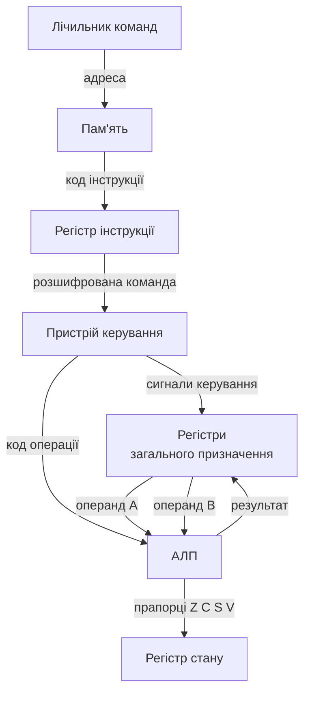

# Центральний процесор та арифметико-логічний пристрій (АЛП)

> [!abstract]
> Минулого разу ми розібрали архітектуру комп'ютера в цілому – чотири блоки моделі фон Неймана, шини між ними, цикл вибірки-декодування-виконання. Сьогодні заходимо всередину одного з цих блоків – процесора – і дивимось, з чого він фактично складається: що таке АЛП, навіщо процесору купа регістрів і як команда, яку ми на попередній лекції описали абстрактно, насправді проходить через конкретні апаратні вузли.

## Навчальні цілі заняття

- **Знати:** будову центрального процесора та арифметико-логічного пристрою; призначення регістрів різних типів; принцип роботи АЛП на прикладі суматора й прапорців результату; як цикл виконання інструкції з минулої лекції реалізується конкретними вузлами.
- **Вміти:** пояснити шлях даних усередині процесора під час виконання простої арифметичної інструкції; розрізняти типи регістрів за їхнім призначенням; читати найпростішу структурну схему АЛП.

## План лекції

1. Чому процесор – це не "чорна скринька"
2. АЛП: вузол, що рахує
3. Прапорці результату: те, що АЛП повідомляє окрім самого числа
4. Регістри: швидка пам'ять просто біля АЛП
5. Шлях даних: як усе це з'єднано разом
6. Один такт з життя процесора: повний приклад

## 1. Чому процесор – це не "чорна скринька"

На минулій лекції ми намалювали процесор одним прямокутником усередині моделі фон Неймана і сказали: він виконує інструкції. Для розуміння архітектури комп'ютера в цілому цього було достатньо – так само, як для розуміння того, що автомобіль їде, не обов'язково знати будову двигуна. Але якщо ми хочемо зрозуміти, чому одні процесори швидші за інші, чому існують 32-бітові й 64-бітові системи, чому додавання двох чисел і множення виконуються за різний час – прямокутник доведеться розкрити.

Усередині процесора живуть два типи вузлів, і корисно розділяти їх одразу, щоб не плутати "де рахують" і "де командують". **Арифметико-логічний пристрій (АЛП, англ. ALU – Arithmetic Logic Unit)** – це вузол, який фактично виконує обчислення: додає, віднімає, порівнює, виконує логічні операції над бітами. **Пристрій керування (CU – Control Unit)**, про який детальніше йтиметься за дві лекції, коли ми розбиратимемо конвеєр, – це вузол, який не рахує сам, а диригує: читає інструкцію, розпізнає, що вона означає, і в потрібний момент "вмикає" потрібні дроти, щоб АЛП, регістри й пам'ять спрацювали в правильній послідовності. У сьогоднішній лекції в центрі уваги – саме АЛП і регістри, тобто те, де дані фактично лежать і над ними фактично рахують.

> [!definition] Визначення
> **Арифметико-логічний пристрій (АЛП)** – комбінаційна схема процесора, що виконує арифметичні (додавання, віднімання) та логічні (AND, OR, XOR, NOT) операції над двійковими числами, поданими на її входи, і формує результат разом із набором службових прапорців.

Слово "комбінаційна" тут не випадкове – ми детально розбирали комбінаційні схеми ще в п'ятій лекції, коли будували суматори й мультиплексори. АЛП – це, по суті, велика комбінаційна схема, зібрана саме з тих цеглинок: суматорів для арифметики, логічних елементів для побітових операцій і мультиплексора, який обирає, яку саме з цих операцій показати на виході в конкретний момент.

## 2. АЛП: вузол, що рахує

Розглянемо спрощену структуру АЛП, яка передає суть, хоча реальні процесори мають значно складніші версії того самого принципу. АЛП має два входи для операндів – назвемо їх А і В, – одну керуючу шину, яка визначає, яку операцію виконати, і один вихід із результатом.

Усередині паралельно стоять кілька готових блоків: суматор (той самий, що ми конструювали з повних однорозрядних суматорів у лекції про комбінаційні схеми), схема віднімання (яка, як ви пам'ятаєте, майже завжди реалізується через той самий суматор і додатковий код, а не окремим вузлом), і набір логічних елементів AND, OR, XOR, NOT, застосованих порозрядно до обох операндів одночасно. Усі ці блоки рахують **одночасно**, незалежно від того, яка операція насправді потрібна цього такту, – а на виході стоїть мультиплексор, керований кодом операції, який просто обирає, чий саме результат пропустити далі.

> [!example] Приклад
> Нехай А = 0101 (п'ять), В = 0011 (три), а код операції каже "додати". Суматор паралельно з усіма іншими блоками порахує 0101 + 0011 = 1000 (вісім); та ж сама пара чисел одночасно пройде крізь AND-елементи (даючи 0001) і крізь OR-елементи (даючи 0111). Мультиплексор, отримавши код "додавання", просто вибере вихід саме суматора – 1000 – і передасть його далі, а результати AND і OR будуть підраховані даремно й відкинуті цього такту.

Такий підхід – рахувати все паралельно й обирати потрібне мультиплексором – здається марнотратним, і на перший погляд справді ним є: навіщо витрачати логічні елементи на обчислення, які тут-таки викидаються. Але саме так у комбінаційній схемі досягається швидкість: мультиплексор перемикається практично миттєво, тоді як побудова окремого шляху для кожної операції з подальшим динамічним "перепідключенням" дротів усередині мікросхеми взагалі неможлива – з'єднання в мікросхемі не можуть змінюватися на льоту. Тому АЛП завжди рахує "все й одразу", а керує лиш тим, що показати назовні.

## 3. Прапорці результату: те, що АЛП повідомляє окрім самого числа

Якби АЛП лише повертав число-результат, процесор не міг би приймати жодних рішень – а без рішень немає умовних переходів, циклів, порівнянь "більше/менше". Тому поряд із самим результатом АЛП виставляє кілька однобітових **прапорців (flags)**, які фіксують додаткові властивості щойно виконаної операції.

- **Прапорець нуля (Zero, Z)** – встановлюється в 1, якщо результат операції дорівнює нулю. Саме на цьому прапорці ґрунтується інструкція "перейти, якщо дорівнює" – по суті, це і є порівняння двох чисел через їхнє віднімання: якщо різниця нульова, числа рівні.
- **Прапорець переносу (Carry, C)** – встановлюється, якщо під час додавання виникло перенесення за межі розрядної сітки (те саме перенесення, з яким ми детально розбиралися в лекції про суматори). Він критичний для арифметики над числами, довшими за один регістр: два 32-бітові регістри, з'єднані через прапорець переносу, разом утворюють коректну 64-бітову арифметику.
- **Прапорець знаку (Sign, S)** – просто копіює старший біт результату, який у додатковому коді позначає знак числа.
- **Прапорець переповнення (Overflow, V)** – спрацьовує, коли результат арифметичної операції над числами зі знаком вийшов за межі того діапазону, який можна коректно подати в цій розрядній сітці (наприклад, додавання двох великих додатних чисел дало від'ємний результат через переповнення).

> [!warning] Типова помилка
> Студенти часто плутають прапорець переносу (Carry) з прапорцем переповнення (Overflow). Перенос стосується беззнакової арифметики й фактично каже "результат не влазить у розрядну сітку як невід'ємне число". Переповнення стосується арифметики зі знаком і каже "результат не влазить у діапазон чисел зі знаком, хоча формально розрядів вистачило". Одна й та сама операція може одночасно встановити один прапорець і не встановити інший – це не помилка апаратури, а особливість того, як інтерпретувати той самий бітовий шаблон.

Прапорці зберігаються в окремому службовому регістрі, який часто називають регістром стану чи регістром прапорців, і саме пристрій керування читає їх значення, коли виконує умовний перехід.

## 4. Регістри: швидка пам'ять просто біля АЛП

АЛП сам по собі нічого не запам'ятовує – це комбінаційна схема, і щойно вхідні сигнали зникають, зникає й результат. Щоб з результатом можна було працювати далі – передати в наступну операцію, записати в пам'ять, порівняти з іншим числом, – його потрібно десь тримати. Для цього в процесорі є невеликий набір **регістрів** – комірок пам'яті, які будуються з тригерів (тих самих D-тригерів, що ми розбирали в лекції про послідовнісні схеми) і зберігають одне слово даних, доки їх не перезапишуть.

Регістри – найшвидша пам'ять у всій системі, значно швидша навіть за кеш-пам'ять, про яку йтиметься за десять лекцій, коли ми дійдемо до ієрархії пам'яті. Ціна цієї швидкості – крихітний обсяг: сучасний процесор має лише кілька десятків регістрів загального призначення, тоді як оперативна пам'ять налічує гігабайти. Розрізняють кілька типів регістрів за їхнім призначенням.

**Регістри загального призначення** – місце, куди програміст чи компілятор явно кладе операнди перед обчисленням і звідки забирає результат. Саме вони видно в мові асемблера як іменовані регістри (наприклад, у архітектурі x86 – EAX, EBX і подібні).

**Лічильник команд (Program Counter, PC)** – регістр, що завжди містить адресу наступної інструкції, яку слід вибрати з пам'яті. Після вибірки кожної інструкції він автоматично збільшується, щоб указувати на наступну по порядку команду – саме тому програма виконується послідовно, доки команда переходу не запише в PC зовсім іншу адресу.

**Регістр інструкції (Instruction Register, IR)** – тимчасово тримає код щойно вибраної з пам'яті інструкції, поки пристрій керування її розшифровує.

**Регістр стану (Status/Flags Register)** – той самий регістр із прапорцями Z, C, S, V із попереднього розділу.

**Акумулятор** – у найпростіших навчальних архітектурах (і в багатьох ранніх реальних процесорах) один спеціально виділений регістр, куди АЛП завжди кладе результат і звідки завжди бере один з операндів. Сучасні процесори здебільшого відійшли від жорсткого акумулятора на користь кількох рівноправних регістрів загального призначення, але сама ідея – "результат має десь осісти одразу після обчислення" – лишається тією самою.

> [!info] Для допитливих
> Кількість регістрів загального призначення – один із параметрів, за яким архітектури процесорів історично сильно відрізнялися. Що більше регістрів, то рідше процесору доводиться звертатися до повільнішої оперативної пам'яті за проміжними значеннями – саме тому в лекції про RISC і CISC ви побачите, що архітектури RISC зазвичай мають значно більше регістрів загального призначення, ніж класичні CISC-процесори того самого покоління.

## 5. Шлях даних: як усе це з'єднано разом

Регістри й АЛП, узяті окремо, ще не процесор – потрібна ще й розводка, яка дозволяє передати вміст будь-якого регістра на вхід АЛП, а результат АЛП – назад у будь-який регістр. Цю розводку разом з усіма її проміжними мультиплексорами прийнято називати **шляхом даних (datapath)**.

Ця схема – саме та деталізація, якої нам бракувало на минулій лекції: пристрій керування (CU), прочитавши код операції з регістра інструкції, надсилає на АЛП сигнал "яку операцію виконати" і водночас "керує" регістровим файлом – каже, які саме два регістри підключити на входи А й В та в який регістр записати результат. Усе це відбувається за один або кілька тактів синхронізації, залежно від складності інструкції та конкретної реалізації процесора.

Важливо зрозуміти: АЛП не "знає", яку інструкцію виконує програма загалом, і регістри не "знають", навіщо їхній вміст щойно змінили. Кожен вузол виконує лише свою вузьку функцію за сигналом ззовні; уся "розумність" виконання програми зосереджена в пристрої керування, який ми детальніше розберемо за дві лекції, коли дійдемо до конвеєрної обробки.

## 6. Один такт з життя процесора: повний приклад

Зберемо все докупи на наскрізному прикладі: нехай інструкція каже "додати вміст регістра R1 до вмісту регістра R2 і покласти результат у R3" (у реальному асемблері це виглядало б приблизно як `ADD R3, R1, R2`).

1. Пристрій керування, розшифрувавши цю інструкцію в регістрі інструкції, підключає регістровий файл так, щоб вміст R1 потрапив на вхід А АЛП, а вміст R2 – на вхід В.
2. Одночасно CU виставляє на керуючій шині АЛП код операції "додавання".
3. АЛП, отримавши обидва операнди й код операції, комбінаційно (тобто миттєво, без додаткового такту очікування) обчислює суму й формує прапорці – наприклад, якщо сума виявилась нульовою, встановлюється прапорець Z.
4. Пристрій керування в потрібний момент такту дає сигнал запису, і результат з виходу АЛП фіксується в регістрі R3, а прапорці – в регістрі стану.
5. Тим часом лічильник команд уже збільшився на розмір інструкції й указує на адресу наступної команди в пам'яті – цикл вибірки-декодування-виконання, який ми розглядали минулого разу, готовий розпочатися знову.

> [!exam] На іспиті
> Часте формулювання питання: "поясніть, чому АЛП вважають комбінаційною, а не послідовнісною схемою, і як тоді процесор узагалі щось запам'ятовує між тактами". Правильна відповідь спирається саме на розділення ролей із цієї лекції: сам АЛП дійсно комбінаційний і нічого не зберігає, а пам'ять між тактами забезпечують окремі послідовнісні вузли – регістри, зібрані з тригерів.

## Контрольні питання

> [!question] Перевірте себе
> 1. Чим арифметико-логічний пристрій відрізняється від пристрою керування за роллю в процесорі?
> 2. Чому АЛП обчислює результати всіх можливих операцій одночасно, а не лише потрібної цього такту?
> 3. У чому принципова різниця між прапорцем переносу (Carry) і прапорцем переповнення (Overflow)?
> 4. Назвіть призначення лічильника команд і регістра інструкції – чим ці два регістри відрізняються один від одного?
> 5. Чому сам АЛП називають комбінаційною схемою, якщо процесор загалом здатен запам'ятовувати проміжні результати між тактами?

## Назад

← [[courses/computer-architecture/lectures/08-arkhitektura-kompiutera-model-fon-neimana-ta|Лекція 8. Архітектура комп'ютера, модель фон Неймана та Гарвардська модель]]

## Далі

→ [[courses/computer-architecture/lectures/10-systemy-komand-ta-konveierna-obrobka|Лекція 10. Системи команд та конвеєрна обробка]]

## Література

1. Комп'ютерна схемотехніка і архітектура комп'ютерів. Частина 1 : навчальний посібник. – Київ : Київський електромеханічний технікум, 2020.
2. Минайленко Р. М., Конопліцька Слободенюк О. К., Гермак В. С. Комп'ютерна схемотехніка : навчальний посібник (видання друге, доповнене). – Кропивницький : Центральноукраїнський національний технічний університет, 2022.
3. [[courses/computer-architecture/lectures/05-kombinatsiini-skhemy-sumatory-deshyfratory|Лекція 5. Комбінаційні схеми, суматори, дешифратори, мультиплексори]] – будова суматора, з якого складається АЛП.
4. [[courses/computer-architecture/lectures/08-arkhitektura-kompiutera-model-fon-neimana-ta|Лекція 8. Архітектура комп'ютера, модель фон Неймана та Гарвардська модель]] – цикл вибірки-декодування-виконання, який деталізує ця лекція.
