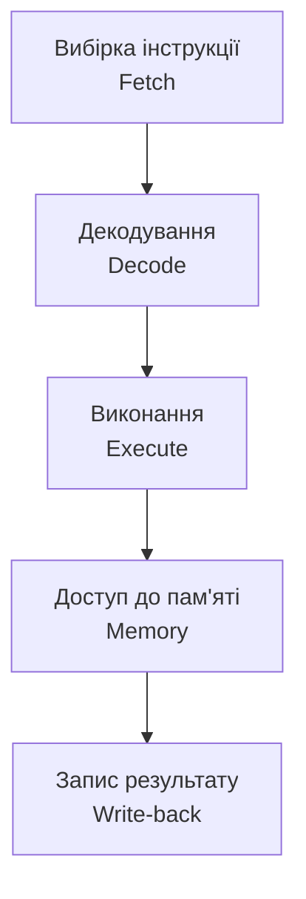

# Системи команд та конвеєрна обробка

> [!abstract]
> Минулого разу ми розібрали, з чого складається процесор усередині – АЛП, регістри, шлях даних. Сьогодні дивимось на це з іншого боку: якою "мовою" процесор розуміє інструкції і чому виконання цих інструкцій можна організувати не по черзі одну за одною, а внахлест, наче конвеєр на заводі.

## Навчальні цілі заняття

- **Знати:** що таке система команд процесора та з чого складається окрема інструкція; принципову різницю підходів CISC і RISC; що таке конвеєрна обробка і з яких етапів вона складається; природу конфліктів (hazard) у конвеєрі.
- **Вміти:** пояснити шлях однієї інструкції крізь етапи конвеєра; визначити, чому конвеєр підвищує пропускну здатність, а не швидкість окремої команди; розпізнавати ситуації, коли конвеєр "спотикається".

## План лекції

1. Що таке система команд і з чого складається інструкція
2. CISC проти RISC: два шляхи побудови набору команд
3. Ідея конвеєра: чому не варто чекати кінця однієї команди, щоб почати іншу
4. П'ять класичних етапів конвеєра
5. Коли конвеєр спотикається: конфлікти (hazards)

## 1. Що таке система команд і з чого складається інструкція

Кожен процесор розуміє обмежений, наперед визначений набір команд – і саме цей набір, разом із правилами, як ці команди закодовані в біти, називають **системою команд (instruction set)**. Це щось на кшталт алфавіту й граматики, якими користується процесор: якою б мовою високого рівня не був написаний код, компілятор врешті-решт перетворює його на послідовність саме цих елементарних команд.

> [!definition] Визначення
> **Інструкція** – елементарна команда процесора, закодована в бітах, яка складається з **коду операції (opcode)** – що саме робити – та **операндів** – над чим це робити (номери регістрів, адреси пам'яті чи безпосередні значення).

Інструкції прийнято ділити за призначенням на кілька груп: арифметичні й логічні (те, що ми розбирали в лекції про АЛП), звернення до пам'яті (завантажити значення з пам'яті в регістр чи навпаки), керуючі (умовні й безумовні переходи, які змінюють вміст лічильника команд) і команди введення-виведення. Саме перелік цих команд і спосіб їхнього кодування визначає, наскільки зручно й компактно можна записати ту чи іншу програму – а отже, впливає на продуктивність усієї системи.

## 2. CISC проти RISC: два шляхи побудови набору команд

Історично склалися два протилежні підходи до того, яким має бути набір команд, і зіткнення цих підходів – одна з найважливіших тем архітектури процесорів (детальніше ми повернемось до неї вже наступної лекції).

**CISC (Complex Instruction Set Computer)** – підхід, за якого набір команд навмисно роблять багатим і складним: одна інструкція може виконувати кілька дій одразу (наприклад, одразу прочитати з пам'яті, додати й записати результат назад). Вигода – компактніший код програми, адже одна складна команда замінює кілька простих.

**RISC (Reduced Instruction Set Computer)** – протилежний підхід: набір команд навмисно спрощують, лишаючи лише елементарні операції, кожна з яких виконується за один такт. Вигода тут інша: прості, однакові за формою команди значно легше конвеєризувати – а саме конвеєризація й буде темою решти сьогоднішньої лекції.

> [!example] Приклад
> CISC-інструкція могла б одним рядком асемблера сказати "додай число з комірки пам'яті X до регістра R1". RISC-підхід розбив би це на дві окремі прості команди: спочатку "завантаж число з комірки X у регістр R2", потім "додай R2 до R1". Другий варіант довший записом, зате кожен його крок однаковий за складністю й легко лягає в конвеєр.

## 3. Ідея конвеєра: чому не варто чекати кінця однієї команди, щоб почати іншу

Найпростіший спосіб виконувати програму – повністю завершити одну інструкцію (вибрати з пам'яті, декодувати, виконати, записати результат) і лише тоді братися за наступну. Це працює, але процесор весь цей час простоює: поки виконується арифметика однієї команди, блок вибірки наступної інструкції з пам'яті просто нічого не робить.

**Конвеєрна обробка (pipelining)** розв'язує цю проблему тим самим прийомом, яким організовано заводський конвеєр: поки одна деталь фарбується, іншу вже збирають, а третю тільки-но кладуть на стрічку. Так само й тут – поки одна інструкція виконує арифметичну операцію, наступна вже декодується, а ще одна – вибирається з пам'яті. У кожен окремий такт кожен етап зайнятий своєю інструкцією, і хоча кожна окрема команда все одно проходить усі етапи послідовно й не пришвидшується, **пропускна здатність** процесора в цілому – кількість інструкцій, завершених за одиницю часу – суттєво зростає.

> [!warning] Типова помилка
> Студенти часто думають, що конвеєр прискорює виконання окремої інструкції. Це не так: кожна окрема команда проходить ті самі п'ять етапів і витрачає той самий час від початку до кінця. Виграш конвеєра – не в швидкості однієї команди, а в тому, що кілька команд одночасно перебувають на різних етапах, тому в середньому за такт завершується більше однієї інструкції.

## 4. П'ять класичних етапів конвеєра

Класичний навчальний конвеєр RISC-процесора ділить обробку інструкції на п'ять етапів.

**Вибірка (Fetch)** – процесор за адресою з лічильника команд читає з пам'яті код чергової інструкції. **Декодування (Decode)** – пристрій керування розшифровує, яка це команда, і одночасно читає потрібні регістри з регістрового файлу. **Виконання (Execute)** – власне АЛП виконує обчислення (те, що ми детально розглядали минулої лекції). **Доступ до пам'яті (Memory)** – якщо команда працює з оперативною пам'яттю (наприклад, завантажує чи зберігає значення), саме на цьому етапі відбувається звернення до неї; для команд, що працюють лише з регістрами, цей етап просто нічого не робить. **Запис результату (Write-back)** – підсумок операції фіксується назад у регістр.

У конвеєрному режимі, поки перша інструкція перебуває на етапі "Виконання", друга вже на етапі "Декодування", а третя щойно потрапила на "Вибірку" – усі п'ять апаратних блоків завантажені одночасно, кожен своєю інструкцією.

## 5. Коли конвеєр спотикається: конфлікти (hazards)

Ідеальна картина з попереднього розділу ламається, щойно інструкції в конвеєрі виявляються залежними одна від одної, – такі ситуації називають **конфліктами конвеєра (hazards)**.

- **Структурний конфлікт** виникає, коли двом інструкціям одночасно потрібен той самий апаратний вузол (наприклад, обидві хочуть звернутися до пам'яті на одному й тому ж такті).
- **Конфлікт даних** – найпоширеніший: наступна інструкція потребує результату попередньої, який ще не встиг дійти до етапу запису. Наприклад, якщо друга команда одразу хоче використати число, яке перша щойно порахувала, доводиться або призупиняти конвеєр, або "перекидати" результат напряму з виходу АЛП, минаючи запис у регістр, – цей прийом називають forwarding.
- **Конфлікт керування** виникає на умовних переходах: поки процесор не дізнається результат порівняння, він не знає точно, яку інструкцію вибирати наступною, і змушений або чекати, або ризиковано вгадувати (це вже територія спекулятивного виконання, про яку варто пам'ятати як про напрямок подальшого розвитку конвеєрів).

> [!exam] На іспиті
> Класичне запитання – назвати три типи конфліктів конвеєра (структурний, даних, керування) і навести по одному прикладу на кожен. Другий типовий варіант – пояснити, чому конвеєризація підвищує пропускну здатність, а не швидкість виконання окремої команди.

## Контрольні питання

> [!question] Перевірте себе
> 1. З яких двох частин складається інструкція процесора?
> 2. У чому принципова відмінність підходів CISC і RISC до побудови набору команд?
> 3. Назвіть п'ять класичних етапів конвеєра в порядку їх проходження.
> 4. Чому конфлікт даних – найпоширеніший тип конфлікту конвеєра, і як його можна пом'якшити прийомом forwarding?
> 5. Чому конвеєризація простих RISC-інструкцій дається легше, ніж конвеєризація складних CISC-інструкцій?

## Назад

← [[courses/computer-architecture/lectures/09-tsentralnyi-protsesor-ta-aryfmetyko-lohichnyi|Лекція 9. Центральний процесор та арифметико‑логічний пристрій (АЛП)]]

## Далі

→ [[courses/computer-architecture/lectures/11-arkhitektury-risc-ta-cisc-porivniannia-ta|Лекція 11. Архітектури RISC та CISC, порівняння та застосування]]

## Література

1. Комп'ютерна схемотехніка і архітектура комп'ютерів. Частина 1 : навчальний посібник. – Київ : Київський електромеханічний технікум, 2020.
2. Минайленко Р. М., Конопліцька Слободенюк О. К., Гермак В. С. Комп'ютерна схемотехніка : навчальний посібник (видання друге, доповнене). – Кропивницький : Центральноукраїнський національний технічний університет, 2022.
