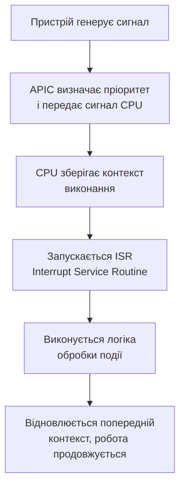

# Переривання та обробка подій

> [!abstract]
> Минулого разу переривання з'явилися побіжно, як спосіб контролерів "достукатись" до процесора. Сьогодні розбираємо цей механізм детально – він виявляється фундаментом не лише для периферії, а й для всього, що ми називаємо "реактивністю" сучасної операційної системи.

## Навчальні цілі заняття

- **Знати:** визначення переривання й класифікацію (апаратні, програмні, внутрішні); структуру APIC (IOAPIC, LAPIC); повний цикл обробки переривання.
- **Вміти:** описати процес від сигналу пристрою до повернення в перервану програму; пояснити небезпеку "шторму переривань".

## План лекції

1. Навіщо взагалі потрібні переривання
2. Класифікація переривань
3. APIC: хто розподіляє й пріоритезує сигнали
4. Повний цикл обробки переривання
5. Коли переривань стає забагато

## 1. Навіщо взагалі потрібні переривання

Без переривань процесору довелося б постійно опитувати кожен пристрій у системі за принципом polling із двадцять третьої лекції – марнуючи ресурси на нескінченні перевірки "чи готово?". **Переривання** розв'язують це елегантно: це сигнал, який змушує процесор тимчасово зупинити поточну роботу й перейти до обробки події саме тоді, коли вона справді відбулась, а не перевіряти це раз у раз про всяк випадок.

> [!definition] Визначення
> **Переривання (interrupt)** – сигнал, що змушує процесор тимчасово призупинити виконання поточної програми, зберегти її стан і перейти до спеціального обробника події; після завершення обробки виконання попередньої програми відновлюється так, наче переривання й не було.

## 2. Класифікація переривань

Переривання поділяють за походженням на три групи. **Апаратні переривання** генерують фізичні пристрої – клавіатура при натисканні клавіші, мережева карта при отриманні пакета, таймер при спрацюванні. **Програмні переривання** свідомо генерують самі інструкції програми – класичний приклад: системний виклик, яким звичайна програма просить операційну систему виконати привілейовану дію. **Внутрішні переривання (виключення)** виникають як побічний наслідок помилки під час виконання – ділення на нуль, звернення до забороненої ділянки пам'яті. Усі три типи, попри різне походження, обробляються через єдину таблицю опису – **IDT (Interrupt Descriptor Table)**, яка вказує, який саме обробник викликати для кожного типу події.

## 3. APIC: хто розподіляє й пріоритезує сигнали

Коли переривань у системі багато й надходять вони з різних джерел, потрібен окремий апаратний "диспетчер" – **APIC (Advanced Programmable Interrupt Controller)**, згаданий у минулій лекції. Він складається з двох частин: **IOAPIC** контролює зовнішні переривання, що надходять від периферійних пристроїв, а **LAPIC** – локальний контролер, вбудований у кожне окреме ядро процесора. Такий поділ дозволяє розподіляти навантаження від переривань між різними ядрами багатоядерного процесора (лекція 12), замість того щоб усі переривання завжди обробляло тільки одне ядро.

## 4. Повний цикл обробки переривання

Весь процес від фізичної події до повернення до нормальної роботи складається з чіткої послідовності кроків.



Псевдокод типового обробника (**ISR**, Interrupt Service Routine) виглядає приблизно так:

```
ISR():
    save_context()
    handle_event()
    send_EOI()   # end of interrupt
    restore_context()
    return
```

Сигнал `EOI` (end of interrupt) повідомляє контролеру переривань, що обробку завершено й він може передавати наступні сигнали, – без цього кроку система ризикує "загубити" подальші переривання від того самого джерела.

## 5. Коли переривань стає забагато

Якщо пристрій генерує переривання надто часто – наприклад, мережева карта під час пікового навантаження чи несправний драйвер, який помилково "спамить" сигналами, – процесор може опинитися в ситуації, коли левову частку часу він витрачає лише на постійне перемикання контексту заради обробки переривань, а не на корисну роботу. Таку ситуацію називають **"штормом переривань"**.

> [!warning] Типова помилка
> Наївне рішення "просто обробляти кожне переривання одразу й повністю" стає проблемою саме при шторм-навантаженні. Сучасні системи натомість використовують механізми **MSI/MSI-X** та пакетну обробку – групування кількох подій в один сигнал переривання замість генерування окремого переривання на кожен елементарний пакет даних, що суттєво знижує навантаження на CPU за високої інтенсивності подій.

> [!info] Для допитливих
> Переривання лежать в основі **подієво-орієнтованого підходу**, що виходить далеко за межі самої апаратури – ті самі принципи ви зустрінете і в операційних системах, і в програмуванні інтерфейсів користувача. У світі IoT (лекція 15) мікроконтролери часто працюють переважно на перериваннях замість постійного опитування сенсорів саме тому, що це дозволяє економити заряд батареї: більшість часу процесор мікроконтролера просто "спить", прокидаючись лише на реальну подію.

## Контрольні питання

> [!question] Перевірте себе
> 1. Чим апаратне переривання відрізняється від програмного та від внутрішнього (виключення)?
> 2. Яку роль виконує IDT (Interrupt Descriptor Table)?
> 3. Чим відрізняються ролі IOAPIC і LAPIC у структурі APIC?
> 4. Опишіть повний цикл обробки переривання від сигналу пристрою до відновлення роботи програми.
> 5. Що таке "шторм переривань" і які механізми допомагають з ним боротися?

## Назад

← [[courses/computer-architecture/lectures/24-kontrolery-ta-taimery-rol-u-systemi|Лекція 24. Контролери та таймери, роль у системі]]

## Далі

→ [[courses/computer-architecture/lectures/26-vzaiemodiia-protsesora-z-peryferiinymy|Лекція 26. Взаємодія процесора з периферійними пристроями]]

## Література

1. Комп'ютерна схемотехніка і архітектура комп'ютерів. Частина 1 : навчальний посібник. – Київ : Київський електромеханічний технікум, 2020.
2. Минайленко Р. М., Конопліцька Слободенюк О. К., Гермак В. С. Комп'ютерна схемотехніка : навчальний посібник (видання друге, доповнене). – Кропивницький : Центральноукраїнський національний технічний університет, 2022.
