# Arduino Uno: архітектура, програмування та застосування

> [!abstract]
> Останні три лекції курсу – практичне завершення всього теоретичного матеріалу: замість абстрактної схеми процесора чи пам'яті ми беремо в руки конкретну, доступну плату й дивимось, як усі поняття курсу – мікроконтролер, регістри, порти введення-виведення – виглядають насправді. Сьогодні – Arduino Uno, найпопулярніша навчальна платформа для перших кроків у вбудованих системах.

## Навчальні цілі заняття

- **Знати:** апаратну будову плати Arduino Uno на основі мікроконтролера ATmega328P; структуру програми Arduino (setup/loop); основні функції для роботи з портами.
- **Вміти:** описати цикл роботи простої програми Arduino; пояснити відмінність цифрового й аналогового вводу-виводу; навести приклад практичного застосування.

## План лекції

1. Чому саме Arduino стало навчальним стандартом
2. Апаратна будова: що всередині плати
3. Структура програми: setup() і loop()
4. Основні функції керування портами
5. Де Arduino застосовують по-справжньому

## 1. Чому саме Arduino стало навчальним стандартом

Ще в лекції про вбудовані системи (лекція 15) ми казали, що такі системи будують навколо мікроконтролера, а не повноцінного процесора. **Arduino Uno** – найвідоміша й найдоступніша плата саме такого типу: недорога, добре задокументована, з простим середовищем програмування, розрахованим на новачків, і водночас достатньо потужна для реальних навчальних і навіть комерційних прототипів.

## 2. Апаратна будова: що всередині плати

В основі Arduino Uno лежить мікроконтролер **ATmega328P** – 8-бітовий процесор з RISC-архітектурою (пригадаймо лекцію 11: прості, однакові за формою інструкції, що виконуються швидко), який працює на скромній частоті 16 МГц. Це у сотні разів повільніше за сучасний настільний процесор – але для типових задач вбудованої системи (читання сенсора, керування світлодіодом чи моторчиком) цього більш ніж достатньо, а низька частота прямо означає й низьке енергоспоживання.

Плата має 14 цифрових входів/виходів і 6 аналогових входів, а також інтерфейси UART, SPI та I2C для комунікації з іншими пристроями. Пам'ять, за тією самою логікою ієрархії, що ми розбирали в лекціях 18-19, тут представлена трьома окремими типами: 32 КБ флеш-пам'яті для самої програми, 2 КБ SRAM для змінних під час виконання й 1 КБ EEPROM для даних, які мають зберігатися навіть після вимкнення живлення.

> [!example] Приклад
> Порівняйте ці числа з ієрархією пам'яті сучасного смартфона: там оперативної пам'яті – гігабайти, тут – лічені кілобайти. Саме тому програми для Arduino пишуть інакше, ніж звичайні застосунки: кожен байт пам'яті доводиться враховувати свідомо, а не покладатися на щедрий запас ресурсів.

## 3. Структура програми: setup() і loop()

Програмування Arduino відбувається через власне середовище **IDE Arduino**, мовою C/C++ з набором зручних додаткових бібліотек. Кожна програма для Arduino має чітко визначену структуру з двох функцій.

```mermaid
graph TD
    S[setup&#40;&#41;<br/>виконується один раз] --> L[loop&#40;&#41;<br/>виконується безкінечно]
    L --> L
```

**setup()** виконується рівно один раз одразу після подачі живлення – саме тут налаштовують режими портів і початкові параметри. **loop()** виконується безкінечно, знову й знову, доки плата живиться, – саме тут описують основну логіку поведінки пристрою. Ця структура – практичний, спрощений приклад того самого циклу "вибірка-виконання", який ми детально розбирали для повноцінних процесорів у дев'ятій лекції, лише вже на рівні прикладного програміста, а не апаратури.

## 4. Основні функції керування портами

Робота з портами Arduino зводиться до кількох базових функцій. `pinMode(pin, MODE)` визначає, чи буде конкретний контакт входом чи виходом. `digitalWrite(pin, VALUE)` записує логічний рівень (високий чи низький) на цифровий вихід, а `digitalRead(pin)` зчитує поточний стан цифрового входу. Для аналогових сигналів є свої пари функцій: `analogRead(pin)` зчитує значення з аналогового входу (наприклад, показник температурного датчика), а `analogWrite(pin, VALUE)` формує **широтно-імпульсну модуляцію (PWM)** – спосіб імітувати аналоговий вихідний сигнал за допомогою швидкого цифрового перемикання, яким, наприклад, керують яскравістю світлодіода чи швидкістю обертання моторчика.

## 5. Де Arduino застосовують по-справжньому

Попри навчальне походження, Arduino давно вийшло за межі аудиторії. У **робототехніці** плати керують двигунами, сенсорами й сервоприводами. В **IoT-проєктах** Arduino збирає дані з сенсорів і передає їх далі, часто в хмару. У побутовій **автоматизації** – контролює освітлення, температуру, найпростіші системи сигналізації. І, нарешті, багато комерційних електронних прототипів починають своє життя саме як експеримент на Arduino, перш ніж перейти до індивідуально спроєктованої плати.

> [!question] Практичний приклад для самостійного відпрацювання
> Мерехтливий світлодіод: підключіть світлодіод до цифрового виходу, у `setup()` викличте `pinMode()`, а в `loop()` чергуйте `digitalWrite(pin, HIGH)` і `digitalWrite(pin, LOW)` із затримкою `delay()` між ними. Це найпростіша навчальна програма Arduino – і водночас повний, працюючий приклад усього, про що йшлося в цій лекції.

## Контрольні питання

> [!question] Перевірте себе
> 1. Який мікроконтролер лежить в основі Arduino Uno і які його ключові характеристики?
> 2. Чим відрізняються за призначенням функції setup() і loop()?
> 3. Яка різниця між digitalWrite() і analogWrite()? Що таке широтно-імпульсна модуляція?
> 4. Навіщо на платі одночасно є три різні типи пам'яті – флеш, SRAM, EEPROM?
> 5. Наведіть приклад реального застосування Arduino поза навчальною аудиторією.

## Назад

← [[courses/computer-architecture/lectures/30-perspektyvy-intehratsii-shtuchnoho-intelektu|Лекція 30. Перспективи інтеграції штучного інтелекту в архітектуру комп'ютерів]]

## Далі

→ [[courses/computer-architecture/lectures/32-raspberry-pi-arkhitektura-operatsiini-systemy|Лекція 32. Raspberry Pi, архітектура, операційні системи та застосування]]

## Література

1. Комп'ютерна схемотехніка і архітектура комп'ютерів. Частина 1 : навчальний посібник. – Київ : Київський електромеханічний технікум, 2020.
2. Минайленко Р. М., Конопліцька Слободенюк О. К., Гермак В. С. Комп'ютерна схемотехніка : навчальний посібник (видання друге, доповнене). – Кропивницький : Центральноукраїнський національний технічний університет, 2022.
