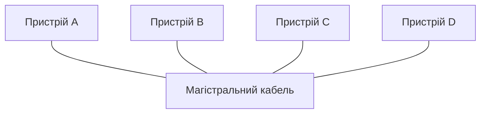
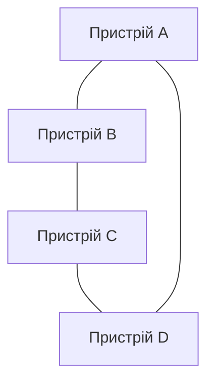
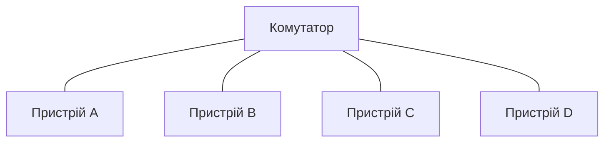
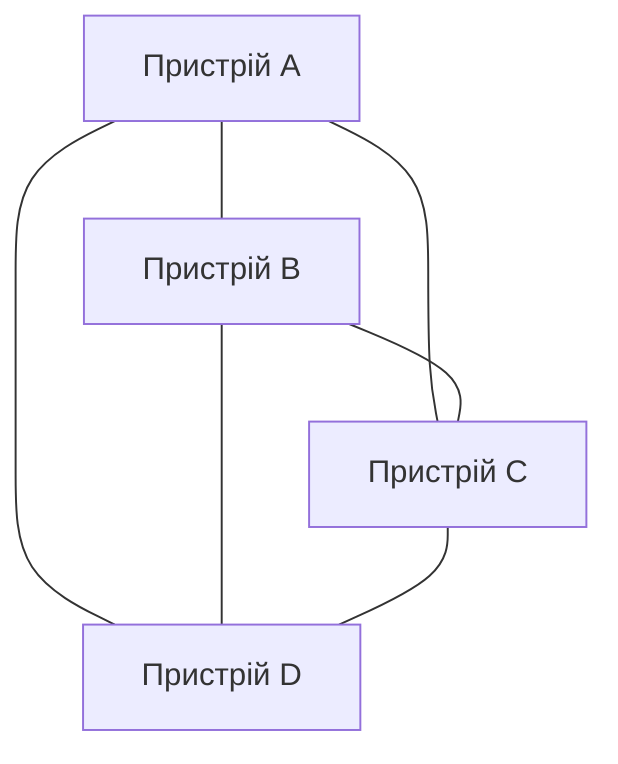
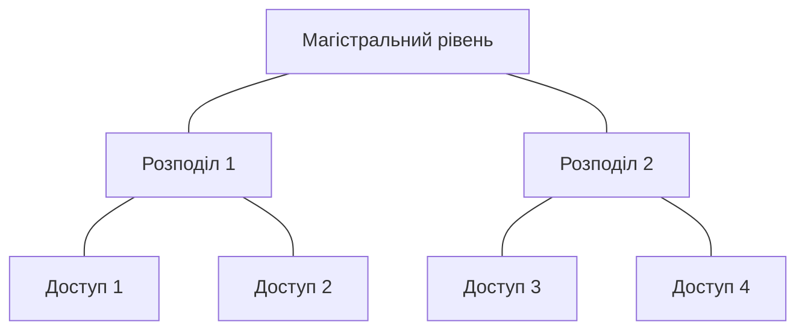

# Вступ до комп'ютерних мереж

> [!abstract]
> Перша лекція курсу відповідає на базове запитання: що таке комп'ютерна мережа і навіщо інженеру-початківцю взагалі про неї думати. Розглянемо коротку історію того, як мережі взагалі з'явилися, базову термінологію, якою будемо користуватись увесь семестр, ознаки класифікації мереж — за масштабом, за архітектурою, за топологією — і подивимось, куди рухається галузь: хмара, інтернет речей, автоматизація мереж за допомогою штучного інтелекту.

## Навіщо взагалі потрібна мережа

Уявіть комп'ютер, який ніколи ні з чим не з'єднувався. Він може порахувати, зберегти файл, показати картинку — але як тільки вам потрібно щось із ним зробити спільно з іншою людиною чи іншим пристроєм, він безпорадний. Немає можливості надіслати документ колезі, немає доступу до сайту, немає можливості синхронізувати телефон із хмарою. Саме тому комп'ютерні мережі — це не окрема "тема для мережевих інженерів", а фундамент, на якому стоїть буквально вся сучасна інформаційна інфраструктура: від банківського переказу на телефоні до відеодзвінка через океан.

Варто на хвилину замислитись, наскільки це насправді нещодавнє досягнення людства. Перші комп'ютери середини XX століття взагалі не проєктувались для з'єднання один з одним — це були окремі, самодостатні машини, кожна зі своїми даними і своїми користувачами. Ідея з'єднати комп'ютери між собою виникла з дуже прагматичної потреби: дороге обчислювальне обладнання (а комп'ютер у 1960-х коштував як будівля) хотілося використовувати ефективніше, ділячи його між кількома дослідницькими центрами. Так у 1969 році з'явилась мережа ARPANET — проєкт американського міністерства оборони, що спершу об'єднав усього чотири університети. Саме в ARPANET вперше практично реалізували ідею **комутації пакетів** (packet switching) — розбиття даних на невеликі порції, кожна з яких самостійно "мандрує" мережею і може піти різними шляхами, а потім збирається докупи на іншому кінці. Ця ідея виявилась настільки вдалою, що досі лежить в основі того, як влаштований сучасний інтернет, і ми детально розберемо її механіку, коли дійдемо до мережевого рівня в лекції 9.

**Комп'ютерна мережа** — це сукупність пристроїв (комп'ютерів, серверів, смартфонів, принтерів, камер, промислових контролерів), з'єднаних каналами зв'язку, що дозволяють цим пристроям обмінюватися даними за узгодженими правилами. Останні три слова — "за узгодженими правилами" — ключові. Два пристрої можна фізично з'єднати кабелем, але якщо вони "розмовляють різними мовами", обміну даними не відбудеться. Ці узгоджені правила називаються протоколами, і саме протоколам буде присвячена значна частина курсу — почнемо з них докладно вже в лекції 4, коли розглянемо еталонні моделі OSI та TCP/IP.

Поки що важливо зрозуміти інше: коли ми говоримо "мережа", ми насправді говоримо про три речі одразу, і плутати їх не варто.

По-перше, це **фізична інфраструктура** — кабелі, оптичні лінії, радіохвилі Wi-Fi, комутатори, маршрутизатори. Про середовища передачі даних поговоримо в наступній лекції, про обладнання — у лекції 3.

По-друге, це **логічна структура** — те, як пристрої адресуються, як дані розбиваються на порції, як знаходиться маршрут від відправника до одержувача. Цьому присвячена більшість модуля 2.

По-третє, це **служби й застосунки**, що працюють поверх мережі — вебсайти, електронна пошта, відеодзвінки, файлові сховища. Саме заради них уся інфраструктура і будується: нікому не потрібна мережа сама по собі, потрібні сервіси, які вона надає.

> [!info] Для допитливих
> Коли кажуть "інтернет упав", майже завжди мають на увазі не фізичне пошкодження кабелів у себе вдома чи в офісі, а збій на рівні служб (наприклад, DNS не може перетворити ім'я сайту на адресу) або на рівні маршрутизації в мережі провайдера. Фізична інфраструктура ламається рідко — набагато частіше "падають" саме логічні та сервісні рівні. Тримайте цю різницю в голові — вона неодноразово знадобиться, коли в модулі 6 дійдемо до діагностики несправностей.

## Базова термінологія: чим ми будемо оперувати весь семестр

Перш ніж рухатись далі, домовимось про кілька слів, які будуть звучати практично на кожній наступній парі. Це не formalні визначення для запам'ятовування, а робочий словник — свого роду інструменти в кишені, якими зручно користуватись, коли обговорюємо будь-яку мережу.

**Вузол (node)** — будь-який пристрій у мережі: комп'ютер, сервер, комутатор, маршрутизатор, навіть розумна лампочка. Якщо пристрій має мережеву адресу і може обмінюватись даними — це вузол.

**Канал зв'язку (link)** — фізичне чи логічне з'єднання між двома вузлами, яким рухаються дані. Це може бути мідний кабель, оптичне волокно або радіоканал Wi-Fi.

**Пропускна здатність (bandwidth)** — максимальна кількість даних, яку канал теоретично здатен передати за одиницю часу, зазвичай вимірюється в мегабітах або гігабітах за секунду (Мбіт/с, Гбіт/с). Тут варто одразу зняти поширену плутанину: пропускна здатність канала і реальна швидкість, яку ви бачите під час завантаження файлу, — не одне й те саме. Пропускна здатність — це "ширина труби", теоретичний максимум; реальна швидкість завжди трохи нижча через накладні витрати протоколів, завантаженість каналу іншими користувачами, якість сигналу.

**Затримка (latency)** — час, який потрібен одному біту даних, щоб дістатися від відправника до одержувача. Вимірюється в мілісекундах. Простий побутовий приклад: пропускна здатність — це скільки машин на годину проїде через шестисмугову трасу, а затримка — скільки часу одна конкретна машина витратить, щоб проїхати цю трасу від початку до кінця. Можна мати трасу з величезною пропускною здатністю (багато смуг), але великою затримкою (траса дуже довга) — саме так влаштоване, наприклад, супутникове інтернет-з'єднання: канал може бути доволі широким, але сигналу фізично потрібен час, щоб злітати до супутника на орбіті й назад, тому затримка відчутна навіть у відеодзвінку.

**Джитер (jitter)** — коливання затримки в часі: одні пакети приходять швидше, інші повільніше. Для звичайного завантаження файлу джитер майже не має значення, а от для відеодзвінка чи онлайн-гри він критичний — саме тому джитер стане окремою темою, коли говоритимемо про QoS у лекції 7.

**Пакет (packet)** — та сама "порція" даних, про яку йшлося вище стосовно ARPANET: дані, розбиті на менші частини для передачі мережею, кожна з яких супроводжується службовою інформацією (заголовком) про те, звідки й куди вона прямує.

Ці кілька термінів — не окрема тема, а мова, якою ми користуватимемось інтуїтивно вже з наступної лекції. Раджу не запам'ятовувати їх як список для іспиту, а просто відзначити для себе: коли в майбутньому промайне слово "затримка" чи "пропускна здатність", ви вже маєте розуміти, про що йдеться, не перериваючи пояснення новою темою.

## Класифікація за масштабом

Найпростіший спосіб описати мережу — сказати, наскільки велику територію вона охоплює. Ця ознака називається масштабом (англ. *scope*) і дає нам звичну ієрархію абревіатур, які ви точно вже чули, навіть не замислюючись про їхнє точне значення.

**PAN (Personal Area Network)** — особиста мережа в радіусі кількох метрів навколо однієї людини. Класичний приклад — бездротові навушники, підключені до телефону через Bluetooth, або розумний годинник, що синхронізується зі смартфоном. Масштаб тут — буквально відстань витягнутої руки.

**LAN (Local Area Network)** — локальна мережа в межах одного будинку, поверху, офісу, домашньої квартири, лабораторії коледжу. Це саме той масштаб, на якому ми будемо працювати найінтенсивніше протягом усього курсу: комутатори, VLAN, Wi-Fi точки доступу — все це переважно LAN-технології. Домашня мережа з роутером, до якого підключені ноутбук, телефон і телевізор, — це LAN.

**MAN (Metropolitan Area Network)** — мережа масштабу міста, що з'єднує кілька LAN-мереж у різних будівлях одного населеного пункту. Приклад — мережа, що об'єднує кілька відділень банку в різних районах Києва, або оптоволоконна мережа кабельного оператора, що обслуговує ціле місто. Сьогодні межа між MAN і WAN дедалі більше розмивається, бо провайдери будують дуже великі оптичні кільця, але сам термін продовжує вживатися.

**WAN (Wide Area Network)** — глобальна мережа, що охоплює країни й континенти. Найвідоміший приклад WAN — сам інтернет, який фактично є мережею мереж (звідси й назва "internet" — "між мережами"). Про WAN-технології — окремий, третій модуль курсу, включно з тим, як провайдери зв'язку будують магістральні канали між містами й країнами.

Іноді до цієї ієрархії додають ще **CAN (Campus Area Network)** — мережу кампусу, що об'єднує кілька будівель одного підприємства чи навчального закладу через власні канали зв'язку (на відміну від MAN, де канали переважно орендовані у провайдера), і **GAN (Global Area Network)** — мережу, що охоплює всю планету, включно з супутниковими та підводними каналами.

> [!example] Приклад
> Уявіть студента коледжу. Його бездротові навушники, з'єднані з телефоном, — це PAN. Мережа Wi-Fi у самому коледжі, до якої підключені комп'ютери в лабораторії, — це LAN. Якщо коледж має кілька корпусів у різних районах міста, з'єднаних власними оптичними лініями, — це вже CAN або MAN. А коли той самий студент відкриває сайт закордонного університету — його запит іде через WAN, тобто через інтернет.

Масштаб — не єдина і навіть не найважливіша ознака класифікації, але саме з неї зазвичай починають, бо вона найінтуїтивніша: досить подивитись на карту й прикинути відстані. Втім, за цією простотою ховається важлива практична різниця: із зростанням масштабу зростає і кількість людей та організацій, що беруть участь у побудові й підтримці мережі. LAN-мережу офісу ви можете спроєктувати й обслуговувати самостійно, повністю контролюючи кожен кабель. WAN-мережу між містами ви вже не можете побудувати "з нуля" власними силами — доводиться орендувати канали в провайдерів зв'язку, які володіють магістральною інфраструктурою. Це розмежування відповідальності — хто володіє й керує якою ділянкою мережі — стане особливо важливим у модулі про глобальні мережі, коли будемо говорити про типи підключень і про те, чому підприємству вигідніше орендувати канал, ніж прокладати власний оптичний кабель між містами.

## Архітектура: хто кому служить

Друга важлива ознака — це те, як пристрої в мережі взаємодіють один з одним з погляду ролей. Тут є дві принципово різні моделі.

У моделі **клієнт-сервер** одні пристрої (сервери) надають послугу, а інші (клієнти) нею користуються. Коли ви відкриваєте сайт у браузері, ваш ноутбук — клієнт, а віддалений комп'ютер, що зберігає сторінки сайту й обробляє запити, — сервер. Сервер зазвичай постійно ввімкнений, потужніший за типовий клієнтський пристрій і обслуговує одночасно багатьох клієнтів. Практично всі сервіси, з якими ви щодня працюєте — пошта, месенджери, банкінг, стрімінг відео — побудовані саме за цією моделлю.

У моделі **однорангової мережі** (peer-to-peer, P2P) такого чіткого розподілу ролей немає: кожен пристрій одночасно може бути і клієнтом, і сервером для інших. Класичний приклад — торент-мережі, де ваш комп'ютер одночасно завантажує частини файлу від одних учасників і роздає вже завантажені частини іншим. Ще один приклад — деякі протоколи блокчейну, де кожен вузол мережі зберігає копію даних і бере участь у їх поширенні.

> [!definition] Визначення
> **Клієнт-сервер** — архітектура, за якої функції розділені: сервер надає ресурс або послугу, клієнт її споживає, ініціюючи запит.
> **Peer-to-peer (P2P)** — архітектура, за якої всі вузли мережі рівноправні й можуть одночасно виконувати роль і клієнта, і сервера.

На практиці "чистого" P2P без жодного центрального елемента зустріти важко: навіть у торент-мережах є трекер-сервер, що допомагає учасникам знайти одне одного. Тому правильніше говорити не про два взаємовиключні табори, а про спектр, де більшість реальних систем — гібридні, з переважанням клієнт-серверних або peer-to-peer рис. Наприклад, сучасні відеоконференції часто починаються як клієнт-серверна модель (усі підключаються до сервера конференції), але деякі системи для передачі відео між учасниками в одній локальній мережі динамічно переходять на пряме P2P-з'єднання, щоб зменшити затримку — тобто одна й та сама система в різні моменти поводиться то як клієнт-сервер, то як P2P.

Чому це важливо для мережевого інженера? Тому що архітектура диктує вимоги до інфраструктури. Мережа, яка обслуговує сотні клієнтів одного потужного сервера (наприклад, файловий сервер компанії), проєктується інакше, ніж мережа, де трафік симетрично тече в усіх напрямках між рівноправними вузлами. У першому випадку критично важливий канал саме до сервера — його часто підключають кількома кабелями одразу для надійності й пропускної здатності (це називається агрегацією каналів, і ми детально розберемо цю техніку в лекції 7). У другому — важлива рівномірна пропускна здатність між усіма вузлами, бо неможливо заздалегідь передбачити, хто саме з ким обмінюватиметься даними в конкретний момент.

## Топології: як пристрої з'єднані фізично і логічно

Топологія — це схема з'єднань у мережі: хто з ким безпосередньо з'єднаний кабелем чи радіоканалом. Розрізняють **фізичну топологію** (реальне розташування кабелів) і **логічну топологію** (шлях, яким насправді рухаються дані, що може не збігатися з фізичною схемою — про це детальніше в лекції про Ethernet і комутацію). Поки що розглянемо базові типи фізичних топологій — це те, з чим ви зустрінетесь, коли фізично прокладатимете мережу в лабораторній роботі з монтажу СКС.

**Шина (bus).** Усі пристрої підключені до одного спільного кабелю-магістралі. Це найдешевший варіант з погляду кабелю — його потрібно найменше, — але і найненадійніший: пошкодження в будь-якій точці магістралі обриває зв'язок для всіх пристроїв одразу. Сьогодні шинна топологія практично не використовується для побудови нових мереж, але важливо її розуміти, бо на її основі колись будувався класичний Ethernet на коаксіальному кабелі, і сама логіка "спільного середовища, за яке пристрої змагаються" залишила слід у сучасних протоколах.

**Кільце (ring).** Кожен пристрій з'єднаний рівно з двома сусідами, утворюючи замкнене кільце, дані рухаються від вузла до вузла в одному напрямку (або в обох, якщо кільце подвійне). Перевага — передбачуваність: кожен вузол ретранслює сигнал, тож затухання менш критичне на великих відстанях. Недолік — вихід з ладу одного вузла чи розрив кабелю розриває все кільце (якщо немає резервного другого кільця, як у технології Token Ring або FDDI, що будувалися саме на цьому принципі).

**Зірка (star).** Кожен пристрій з'єднаний окремим кабелем із центральним вузлом — комутатором. Це домінантна топологія сучасних локальних мереж, і саме за нею побудована практично кожна офісна чи домашня мережа, яку ви бачили. Головна перевага — відмовостійкість на рівні окремих зв'язків: обрив кабелю одного пристрою не впливає на решту мережі. Головний недолік — залежність від центрального вузла: якщо комутатор вийде з ладу, вся "зірка" навколо нього перестає працювати. Саме тому в мережах з підвищеними вимогами до надійності комутатори резервують або з'єднують у більш складні схеми.

**Повна сітка (mesh).** Кожен пристрій з'єднаний з кожним. Це найнадійніша топологія — вихід з ладу будь-якого одного зв'язку чи навіть кількох не позбавляє мережу зв'язності, — але і найдорожча: кількість кабелів росте квадратично з кількістю вузлів. Для n вузлів повна сітка вимагає n(n−1)/2 з'єднань: для 4 вузлів це 6 кабелів, для 10 вузлів — уже 45, а для 20 — уже 190. Саме ця квадратична залежність і є головною причиною, чому повну сітку в чистому вигляді використовують рідко і лише там, де відмовостійкість критична — наприклад, у з'єднаннях між магістральними маршрутизаторами дата-центру, де ціна простою вимірюється мільйонами. Значно частіше зустрічається **часткова сітка** — коли з'єднані не всі вузли з усіма, а лише найважливіші, за принципом "де це виправдано": наприклад, кожен маршрутизатор з'єднаний із двома-трьома сусідами, а не з усіма іншими.

**Ієрархічна, або деревоподібна (tree/hierarchical).** Це, по суті, кілька рівнів зірок: центральні комутатори з'єднують групи менших комутаторів, ті — ще менші, і так до кінцевих пристроїв. Саме так побудована переважна більшість мереж середнього й великого підприємства: рівень доступу (access layer, куди підключаються кінцеві пристрої), рівень розподілу (distribution layer, що об'єднує кілька комутаторів доступу) і магістральний рівень (core layer, що з'єднує все підприємство і виходить у зовнішній світ). Цю трирівневу ієрархічну модель Cisco ви побачите ще не раз протягом курсу — вона є практичним стандартом проєктування корпоративних мереж, і саме на її вивчення частково спрямована остання лекція курсу про проєктування мережі підприємства.

Щоб звести всі п'ять топологій докупи й одразу мати під рукою порівняння для повторення перед іспитом, зведемо їх у таблицю:

| Топологія | Кількість кабелів | Відмовостійкість | Типове застосування |
|---|---|---|---|
| Шина | Мінімальна | Дуже низька | Історична, сьогодні не використовується |
| Кільце | Дорівнює кількості вузлів | Низька без резервного кільця | Token Ring, FDDI (історичні) |
| Зірка | Дорівнює кількості вузлів | Середня (залежить від центру) | Стандарт сучасних LAN |
| Повна сітка | Квадратично росте з n | Найвища | З'єднання магістральних маршрутизаторів |
| Ієрархічна | Помірна, росте по рівнях | Висока (з резервуванням) | Мережі підприємства |

> [!warning] Типова помилка
> Студенти часто плутають топологію "зірка" з архітектурою "клієнт-сервер" — мовляв, у центрі зірки стоїть "головний" пристрій, як сервер. Це не так: комутатор у центрі зірки — це елемент фізичної інфраструктури, що просто пересилає кадри між пристроями, а не сервер, що надає їм якийсь сервіс. Топологія описує *форму з'єднань*, архітектура описує *розподіл ролей у передачі даних*. Одне з одним не пов'язане напряму: у мережі топології "зірка" сервер може бути одним зі звичайних кінцевих пристроїв, підключених до того самого комутатора, що й клієнти.

Варто також згадати, що бездротові мережі мають свою специфіку топології. Класична домашня Wi-Fi мережа з однією точкою доступу — це, по суті, та сама "зірка", просто без кабелів: точка доступу відіграє роль центрального вузла, а пристрої "підключені" до неї радіоканалом. А от сучасні mesh-системи Wi-Fi (кілька точок доступу, що покривають великий будинок і автоматично передають клієнта одна одній) — це вже приклад часткової сітки в бездротовому виконанні. Про особливості бездротових мереж, зокрема Wi-Fi 6/6E/7, поговоримо окремо в лекції 8.

## Куди рухається галузь

Класифікації, які ми щойно розглянули, склалися десятиліттями і залишаються актуальними, але сама галузь комп'ютерних мереж останні років десять змінюється помітно швидше, ніж раніше. Три тренди варто тримати в полі зору протягом усього курсу, бо до кожного з них ми ще повернемось окремими лекціями.

**Хмарні мережі.** Дедалі більше інфраструктури, яку раніше будували фізично — сервери, сховища, навіть цілі мережеві сегменти, — сьогодні орендують у хмарних провайдерів (Amazon Web Services, Microsoft Azure, Google Cloud і українські аналоги). Мережевий інженер тепер повинен уміти не лише обтиснути патч-корд і налаштувати комутатор, а й спроєктувати віртуальну приватну хмару (VPC), налаштувати підмережі в хмарі та з'єднати локальну інфраструктуру підприємства з хмарною через захищений канал. Причина цього зсуву доволі приземлена: власний сервер потрібно купити, розмістити, охолоджувати, обслуговувати й у якийсь момент замінити, а хмарний ресурс можна орендувати на годину й відмовитись від нього, коли він більше не потрібен. Ця відмінність між капітальними й операційними витратами — наскрізна тема, яку ми детально розберемо в передостанній лекції курсу про економіку мережі. Цій темі присвячено окрему лекцію в модулі про глобальні мережі та хмару.

**Інтернет речей (IoT).** Кількість пристроїв, підключених до мереж, зростає не за рахунок нових комп'ютерів, а за рахунок камер спостереження, розумних лампочок, датчиків температури, промислових контролерів. Кожен такий пристрій — це вузол мережі зі своїми, часто заниженими вимогами до безпеки (виробники дешевих IoT-пристроїв рідко вкладаються у своєчасні оновлення прошивки), і водночас потенційна точка входу для атаки. Тренд IoT напряму впливає на те, як сьогодні проєктують сегментацію мережі: пристрої IoT майже завжди виносять в окремий VLAN, ізольований від сегменту, де працюють робочі станції зі критично важливими даними, — так, щоб навіть у разі компрометації розумної камери зловмисник не отримав прямого доступу до бухгалтерського сервера в тій самій будівлі.

**Автоматизація мереж та штучний інтелект.** Ще п'ять-сім років тому налаштування мережевого обладнання майже завжди означало ручний ввід команд у консоль кожного пристрою окремо. Сьогодні цей підхід не масштабується: у компанії з тисячею комутаторів ручна конфігурація фізично неможлива без помилок. На заміну приходять інструменти автоматизації (Ansible, Python-скрипти) та системи моніторингу, що самостійно виявляють аномалії в поведінці мережі. Останнім часом до цього додається використання великих мовних моделей — для генерації типових конфігурацій, аналізу журналів подій, першої діагностики інцидентів. Про це детально поговоримо в модулі про службу каталогів та керування (лекція про мережеву автоматизацію з ШІ) і в модулі про надійність та безпеку (лекція про діагностику з ШІ-асистентами). Важливо одразу засвоїти головний принцип, до якого ми будемо повертатися: ШІ-інструмент прискорює рутинну роботу, але відповідальність за коректність конфігурації, яку він згенерував, завжди залишається на інженері, який її застосував. Мережевий інженер майбутнього — це не той, хто відмовляється від таких інструментів з принципу, і не той, хто сліпо довіряє будь-якій згенерованій команді, а той, хто вміє швидко перевірити, чи згенерована конфігурація насправді робить те, що потрібно.

Ці три тренди не існують окремо один від одного — вони підсилюють один одного. Що більше IoT-пристроїв у мережі, то складніша сегментація, то більше правил міжмережевого екрана потрібно підтримувати — а отже, зростає потреба в автоматизації цієї підтримки. Що більше інфраструктури переходить у хмару, то більше конфігурації описується не командами в консолі, а кодом (підхід, який називають "інфраструктура як код"), а код, у свою чергу, зручно генерувати й перевіряти за допомогою тих самих інструментів автоматизації. Тримайте цей зв'язок у голові — ми будемо повертатись до нього щоразу, коли модуль курсу торкатиметься одного з трьох трендів.

> [!exam] На іспиті
> На іспиті можуть попросити: а) назвати й коротко охарактеризувати типи мереж за масштабом (PAN/LAN/MAN/WAN); б) розрізнити архітектури клієнт-сервер і P2P на конкретному прикладі; в) намалювати і пояснити переваги/недоліки однієї з топологій (найчастіше — зірка та повна сітка, бо саме на них найкраще видно компроміс "надійність проти вартості"); г) пояснити різницю між пропускною здатністю й затримкою на прикладі. Формулювання на кшталт "чому топологія зірка витіснила шину в сучасних мережах" — типове питання, що перевіряє розуміння причин, а не просто запам'ятовування визначень.

## Завдання на занятті (20 хв)

1. Розбийтесь на пари. Кожна пара отримує сценарій невеликого офісу: 12 робочих місць, 1 сервер друку, Wi-Fi для гостей, 2 IP-камери на вході. Визначте, яку топологію ви оберете для проводової частини мережі, і обґрунтуйте вибір одним-двома реченнями.
2. Для того самого сценарію визначте масштаб мережі (PAN/LAN/MAN/WAN) і поясніть, чому.
3. Намалюйте від руки або в будь-якому редакторі (можна текстом у форматі списку "хто з ким з'єднаний") схему мережі офісу з завдання 1, зваживши на те, що IP-камери варто ізолювати від робочих місць.
4. Обговоріть у парі: якщо в цьому офісі планують за рік відкрити другу філію в іншому районі міста і з'єднати обидва офіси в єдину мережу, який масштаб матиме об'єднана мережа — і чи зміниться відповідь, якщо філія відкриється в іншій країні?
5. Порахуйте: скільки кабелів знадобиться, щоб з'єднати всі 12 робочих місць з завдання 1 топологією "повна сітка" замість "зірка"? Чи виправданий такий вибір для звичайного офісу?

> [!question] Перевірте себе
> 1. Чим LAN принципово відрізняється від WAN — не за розміром, а за тим, хто зазвичай володіє й керує інфраструктурою?
> 2. Наведіть приклад сервісу, який ви використовуєте щодня, побудованого за архітектурою P2P (не торенти).
> 3. Чому топологія "повна сітка" рідко використовується для з'єднання кінцевих робочих станцій, але часто — для з'єднання магістральних маршрутизаторів дата-центру?
> 4. Що станеться з мережею топології "зірка", якщо вийде з ладу центральний комутатор? А з мережею топології "кільце", якщо обірветься один кабель без резервного другого кільця?
> 5. Поясніть різницю між пропускною здатністю й затримкою на прикладі супутникового інтернету.
> 6. Наведіть один конкретний приклад того, як тренд IoT змінює підхід до сегментації мережі порівняно з мережею без розумних пристроїв.

## Далі
→ [[courses/computer-networks/lectures/02-seredovyshche-peredachi-danykh|Лекція 2. Середовище передачі даних]]

## Література
- Cisco Networking Academy. *Introduction to Networks* (курс CCNA v7/v7.1) — розділи про типи мереж і топології.
- Tanenbaum A., Wetherall D. *Computer Networks*, 5th edition — розділ 1, "Introduction".
- Одом У. *Officially Licensed Cert Guide CCNA 200-301* — вступний розділ про класифікацію мереж.
