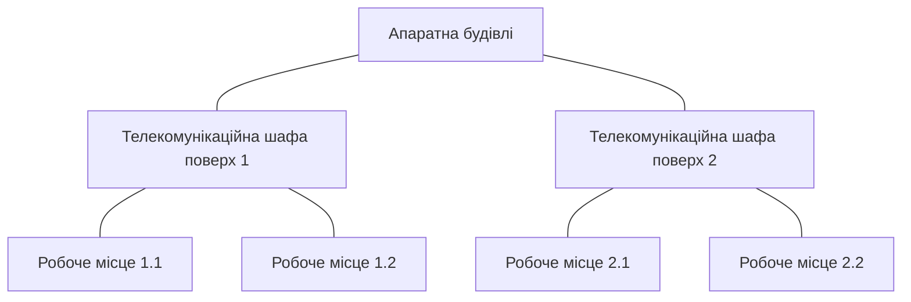

# Середовище передачі даних

> [!abstract]
> Будь-яка мережа зрештою впирається у фізику: дані повинні якимось чином рухатися від одного пристрою до іншого. Розглянемо три середовища передачі – мідний кабель, оптичне волокно та бездротовий радіозв'язок, – їхні характеристики, переваги й обмеження, а також те, як усе це організовують у будівлі за допомогою структурованої кабельної системи (СКС).

## Чому середовище передачі – це не дрібниця

На минулій лекції ми домовились, що канал зв'язку – це з'єднання, яким рухаються дані. Але яким саме способом дані фізично "рухаються"? Відповідь залежить від того, яке середовище передачі використовується, і ця відповідь визначає буквально все: яку максимальну відстань можна покрити без підсилення сигналу, яку пропускну здатність можна отримати, наскільки середовище чутливе до перешкод, скільки коштує прокладання й обслуговування, і навіть наскільки складно фізично перехопити чи прослухати дані, що передаються.

Важливо одразу розділити два принципово різні способи передачі. У **дротових** (guided) середовищах сигнал рухається вздовж фізичного провідника – мідного дроту чи оптичного волокна, – і провідник фізично спрямовує сигнал від відправника до одержувача. У **бездротових** (unguided) середовищах сигнал випромінюється в простір у вигляді електромагнітних хвиль і поширюється на всі боки, а приймач просто "вихоплює" потрібну частину цього випромінювання зі свого оточення. Ця відмінність – "сигнал спрямований провідником" проти "сигнал випромінюється в простір" – пояснює майже всі практичні відмінності між дротовими й бездротовими мережами, з якими ви зіткнетесь протягом курсу: чому Wi-Fi легше "підслухати", чому дротове з'єднання зазвичай стабільніше, чому бездротовий сигнал слабшає з відстанню набагато швидше, ніж сигнал у кабелі.

## Мідний кабель: вита пара

Найпоширеніше середовище передачі в локальних мережах сьогодні – це кабель **вита пара** (twisted pair), що складається з восьми мідних жил, скручених попарно в чотири пари. Скручування – не естетичне рішення, а інженерне: коли два дроти скручені разом, електромагнітні наведення (перехресні завади від сусідніх пар усередині того самого кабелю, а також зовнішні джерела перешкод) частково взаємно компенсуються завдяки симетрії скручування. Що щільніше скручування, то краще кабель протистоїть завадам – і саме це, разом з якістю мідного провідника й ізоляції, визначає **категорію** кабелю.

> [!definition] Визначення
> **Вита пара (twisted pair)** – тип мідного кабелю, у якому провідники скручені попарно для зменшення електромагнітних наведень між парами.

Розрізняють два основні варіанти конструкції. **UTP (Unshielded Twisted Pair)** – неекранована вита пара, найпоширеніший і найдешевший варіант для офісних і домашніх мереж; захист від завад забезпечується виключно скручуванням пар. **STP (Shielded Twisted Pair)** – екранована вита пара, де кожна пара або весь кабель додатково обгорнутий металевою фольгою чи оплiткою; такий кабель дорожчий, товщий і вимагає правильного заземлення екрана, зате значно краще протистоїть сильним електромагнітним завадам – наприклад, поруч з потужним промисловим обладнанням чи силовими кабелями.

Кабелі вита пара поділяють на категорії, кожна з яких гарантує певну смугу пропускання й, відповідно, підтримувані швидкості Ethernet. Ці категорії ви побачите на позначках самого кабелю і в специфікаціях обладнання ще не раз протягом курсу, тому варто зорієнтуватися в них уже зараз:

| Категорія | Смуга пропускання | Практична швидкість | Типове застосування |
|---|---|---|---|
| Cat5e | 100 МГц | до 1 Гбіт/с | застаріла, ще зустрічається в старих будівлях |
| Cat6 | 250 МГц | 1 Гбіт/с, 10 Гбіт/с на коротких відстанях (до ~55 м) | поширений сучасний стандарт |
| Cat6a | 500 МГц | 10 Гбіт/с на повні 100 м | рекомендований стандарт для нових інсталяцій |
| Cat7/Cat8 | 600 МГц / 2000 МГц | 10-40 Гбіт/с | дата-центри, короткі з'єднання між стійками |

Незалежно від категорії, вита пара має жорстке фізичне обмеження: максимальна довжина сегмента кабелю – **100 метрів**. Це не маркетингове число, а наслідок фізики: із зростанням довжини сигнал загасає (втрачає амплітуду) і накопичує спотворення, і на певній відстані приймач уже не може надійно відрізнити сигнал від шуму. Якщо потрібно з'єднати пристрої на більшій відстані, використовують проміжне обладнання, що приймає й ретранслює сигнал заново (наприклад, додатковий комутатор), або переходять на інше середовище передачі – оптику, яка не має такого суворого обмеження.

Кабель вита пара термінується (обтискається) роз'ємом **RJ-45** – саме тим восьмиконтактним пластиковим конектором, який ви бачите на кінці будь-якого мережевого патч-корда. Порядок розташування дротів у роз'ємі стандартизований (найпоширеніша схема – T568B), і саме навичку правильного обтискання кабелю за цим стандартом ви відпрацюєте практично на першій лабораторній роботі курсу.

> [!example] Приклад
> Коли в лабораторії ви обтискаєте патч-корд і перевіряєте його тестером, а тестер показує "розрив" на певній жилі – це майже завжди означає, що один із восьми провідників або не досяг контакту в роз'ємі, або переплутаний порядок жил не відповідає стандарту T568B з обох кінців кабелю. Обидва кінці мають бути обтиснуті за однаковою схемою для прямого кабелю (straight-through), що використовується для з'єднання комп'ютера з комутатором.

## Оптичне волокно

Якщо вита пара передає сигнал у вигляді електричних імпульсів, то **оптичне волокно** передає сигнал у вигляді імпульсів світла, що рухаються тонкою скляною (рідше – пластиковою) ниткою завтовшки з людську волосину. Принцип, що утримує світло всередині волокна, а не дає йому "просочитися" крізь стінки, називається повним внутрішнім відбиттям: серцевина волокна має вищий коефіцієнт заломлення, ніж оболонка навколо неї, тому промінь світла, що падає на межу під певним кутом, повністю відбивається назад усередину, а не виходить назовні – і так, багаторазово відбиваючись, рухається вздовж усього волокна.

Оптика принципово відрізняється від міді за трьома ключовими параметрами, і саме ці три відмінності пояснюють, чому оптичне волокно домінує там, де важливі відстань і швидкість. По-перше, **відстань**: оптичний сигнал загасає значно повільніше за електричний, тому одномодове волокно здатне передавати дані на десятки кілометрів без підсилення – там, де мідь обмежена сотнею метрів. По-друге, **завадостійкість**: оскільки сигнал – це світло, а не електричний струм, оптичне волокно абсолютно нечутливе до електромагнітних завад – його можна прокладати поруч із потужними силовими кабелями чи промисловим обладнанням без жодного ризику для якості сигналу. По-третє, **пропускна здатність**: оптика підтримує набагато вищі швидкості передачі на набагато більші відстані, ніж мідь, що робить її обов'язковим вибором для магістральних з'єднань дата-центрів і провайдерів зв'язку.

Розрізняють два основних типи оптичного волокна. **Багатомодове волокно (multimode, MMF)** має відносно широку серцевину (зазвичай 50 або 62,5 мікрометра), крізь яку світло може поширюватися кількома різними шляхами ("модами") одночасно. Це трохи здешевлює обладнання (можна використовувати дешевші світлодіодні або VCSEL-передавачі), але через розсіювання різних мод волокно обмежене відстанями до кількох сотень метрів – типове застосування: з'єднання всередині дата-центру чи будівлі. **Одномодове волокно (single-mode, SMF)** має дуже вузьку серцевину (близько 9 мікрометрів), крізь яку світло може поширюватись лише одним шляхом, тому сигнал майже не спотворюється й може передаватися на десятки й навіть сотні кілометрів – саме таке волокно використовують магістральні провайдери й підводні міжконтинентальні кабелі. Плата за цю дальність – дорожче обладнання, зокрема лазерні передавачі замість дешевших світлодіодних.

> [!warning] Типова помилка
> Студенти часто думають, що "оптика краще за мідь у всьому, тому завжди варто її обирати". Насправді оптичне обладнання й монтаж коштують суттєво дорожче за мідне, оптичний кабель значно крихкіший і легше пошкоджується при різкому згинанні, а термінація волокна (встановлення роз'ємів) вимагає спеціального обладнання й навичок, яких не потрібно для звичайного обтискання RJ-45. Тому на практиці вибір "мідь чи оптика" – це завжди компроміс між відстанню/швидкістю з одного боку і вартістю/простотою обслуговування з іншого, а не питання "яка технологія об'єктивно краща".

Термінують оптичне волокно спеціальними роз'ємами – найпоширеніші сьогодні **LC** (компактний, часто здвоєний роз'єм для сучасного активного обладнання) та **SC** (трохи більший роз'єм, який ще зустрічається у старішій інфраструктурі). На відміну від обтискання мідного кабелю, підготовка оптичного волокна – це окремий, точний процес (зварювання волокон або механічне з'єднання, полірування торця), тому в реальних інсталяціях частіше купують готові патч-корди потрібної довжини, ніж термінують волокно на місці.

## Бездротове середовище передачі

На відміну від мідного кабелю й оптичного волокна, бездротова передача не має фізичного провідника взагалі – дані кодуються в радіохвилі, що випромінюються в простір передавачем і вловлюються приймачем. Найпоширеніший різновид, з яким ви працюватимете практично щодня, – **Wi-Fi**, що використовує діапазони радіочастот **2,4 ГГц**, **5 ГГц** і, у найновіших пристроях, **6 ГГц**.

Ці три діапазони мають різні практичні характеристики, і розуміння різниці між ними знадобиться вже в лекції 8, коли говоритимемо про налаштування точок доступу. Діапазон 2,4 ГГц має нижчу частоту, тому радіохвилі цього діапазону краще проникають крізь стіни й перешкоди та поширюються на більшу відстань, але сама смуга частот вузька і в ній працює багато інших пристроїв (мікрохвильові печі, Bluetooth-гарнітури, старіші роутери сусідів) – тому діапазон часто "тісний" і завантажений завадами. Діапазони 5 ГГц і 6 ГГц, навпаки, забезпечують значно ширшу смугу (а отже – вищу пропускну здатність) і менше завад від сторонніх пристроїв, але гірше проникають крізь стіни й перекриття, тому покриття на цих частотах менше за площею при тій самій потужності передавача.

> [!info] Для допитливих
> Той самий компроміс "нижча частота – краще проникнення, менша пропускна здатність" проти "вища частота – гірше проникнення, вища пропускна здатність" – не специфіка Wi-Fi, а фундаментальна властивість електромагнітних хвиль, яка так само проявляється в мобільному зв'язку (порівняйте покриття базової станції 4G у діапазоні 800 МГц і 5G у діапазоні 3,5 ГГц чи міліметрових хвиль) і навіть у радіомовленні (AM-хвилі поширюються на сотні кілометрів і огинають перешкоди, FM – набагато локальніше, зате з кращою якістю звуку).

Головна практична відмінність бездротового середовища від дротового – це **спільність простору**. Мідний кабель чи оптичне волокно фізично ізолюють сигнал одного з'єднання від іншого; радіохвилі ж поширюються в одному й тому самому повітряному просторі, який одночасно "чують" усі пристрої в зоні досяжності. Це означає, що, на відміну від виділеного кабелю до кожного пристрою в топології "зірка" з попередньої лекції, усі бездротові клієнти однієї точки доступу фактично конкурують за одне спільне середовище – трохи схоже на давню топологію "шина", тільки в повітрі, а не в кабелі. Саме тому реальна пропускна здатність, доступна кожному конкретному пристрою у Wi-Fi мережі, суттєво падає, коли до тієї самої точки доступу одночасно підключено багато активних клієнтів, – на відміну від дротової мережі топології "зірка", де кожен порт комутатора має власну виділену пропускну здатність незалежно від того, що роблять інші пристрої.

Спільність радіосередовища має й інший бік – безпековий: перехопити бездротовий сигнал технічно значно простіше, ніж підключитись до чужого дротового кабелю (для якого потрібен фізичний доступ до інфраструктури). Саме тому шифрування бездротового трафіку – не опціональна, а обов'язкова практика, і саме тому в лекції 8 ми детально розберемо сучасний протокол захисту WPA3.

## Порівняння середовищ передачі

Зведемо три розглянуті середовища в одну таблицю – вона знадобиться, коли доведеться обґрунтовувати вибір середовища передачі для конкретного сценарію в лабораторній роботі чи на іспиті:

| Характеристика | Вита пара (мідь) | Оптичне волокно | Бездротове (Wi-Fi) |
|---|---|---|---|
| Максимальна відстань | 100 м | до десятків/сотень км (SMF) | десятки метрів у приміщенні |
| Стійкість до завад | помірна (краще для STP) | дуже висока | низька, спільне середовище |
| Вартість монтажу | низька | висока | найнижча (без кабелю) |
| Складність обслуговування | низька | висока (спеціальні навички) | помірна |
| Типове застосування | робочі місця, короткі з'єднання | магістралі, дата-центри, WAN | мобільні пристрої, гостьовий доступ |

## Структурована кабельна система

Коли йдеться не про один кабель між двома пристроями, а про кабельну інфраструктуру цілої будівлі чи кампусу, стихійний підхід "тягнемо кабель, де зручно" швидко перетворюється на хаос, який неможливо ані розширити, ані діагностувати. Тому для будівель застосовують стандартизований підхід, який називається **структурованою кабельною системою (СКС)** – набір правил і стандартів (найвідоміший – TIA/EIA-568) щодо того, як проєктувати, прокладати й документувати кабельну інфраструктуру.

СКС організована ієрархічно, і ця ієрархія прямо перегукується з тим, що ви вже бачили в лекції 1, коли ми говорили про деревоподібну топологію мережі підприємства – не випадково, бо фізична кабельна інфраструктура й логічна мережева топологія зазвичай будуються за одним і тим самим принципом "від центру до периферії".

**Робоче місце (work area)** – кінцева точка, де кабель виходить у розетку на робочому столі чи стіні, до якої користувач підключає свій пристрій патч-кордом.

**Горизонтальна підсистема (horizontal cabling)** – кабелі, що йдуть від розеток робочих місць до телекомунікаційної шафи на тому самому поверсі. Саме тут діє обмеження в 100 метрів для мідного кабелю, про яке йшлося вище, – і саме тому телекомунікаційну шафу зазвичай розташовують по центру поверху, а не в кутку будівлі, щоб жодне робоче місце не опинилось за межею допустимої довжини.

**Телекомунікаційна шафа (telecommunications room)** – приміщення чи шафа на поверсі, де встановлені **патч-панелі** (панелі з роз'ємами, до яких термінуються всі горизонтальні кабелі з робочих місць) і комутатори поверху. Патч-панель – це, по суті, організаційний прошарок: постійний горизонтальний кабель від розетки термінується на задній стороні панелі раз і назавжди при монтажі, а з'єднання з конкретним портом комутатора роблять коротким патч-кордом на передній стороні, який легко переставити, не чіпаючи основну проводку.

**Магістральна підсистема (backbone cabling)** – кабелі (як правило, оптичні, з огляду на потрібну відстань і пропускну здатність), що з'єднують телекомунікаційні шафи різних поверхів між собою та з центральною апаратною будівлі.

**Апаратна (equipment room)** – центральне приміщення будівлі, куди сходяться всі магістральні лінії і де розташоване основне мережеве обладнання: магістральні комутатори, маршрутизатори, сервери, обладнання провайдера.

> [!exam] На іспиті
> Типові питання: а) порівняти вита пара / оптику / Wi-Fi за конкретним критерієм (відстань, завадостійкість, вартість) і обґрунтувати вибір середовища для заданого сценарію; б) пояснити, чому максимальна довжина сегмента вита пари – 100 метрів, і що відбувається із сигналом на більшій відстані; в) назвати рівні ієрархії СКС і пояснити роль патч-панелі; г) пояснити компроміс між діапазонами 2,4 ГГц і 5 ГГц у Wi-Fi.

## Завдання на занятті (20 хв)

1. Триповерхова будівля коледжу, на кожному поверсі – 20 робочих місць. Визначте, яке середовище передачі використати для горизонтальної підсистеми кожного поверху, а яке – для магістральної підсистеми між поверхами, і обґрунтуйте вибір.
2. Одне робоче місце на поверсі опиняється за 130 метрів кабельної траси від телекомунікаційної шафи через незручне планування коридорів. Запропонуйте два різні технічні рішення цієї проблеми.
3. Порівняйте в парі: чому в дата-центрі між стійками серверів частіше прокладають оптику навіть на коротких відстанях, де мідь Cat6a теж технічно впоралась би?
4. Обговоріть: чому для гостьового Wi-Fi у коледжі важливіше подбати про шифрування, ніж для дротового підключення в тій самій аудиторії?

> [!question] Перевірте себе
> 1. Чому кабель вита пара скручують попарно, а не прокладають прямими паралельними провідниками?
> 2. Назвіть три ключові переваги оптичного волокна над мідним кабелем і поясніть, чому оптика попри це не витіснила мідь повністю.
> 3. У чому принципова відмінність одномодового волокна від багатомодового?
> 4. Чому реальна пропускна здатність на одного клієнта Wi-Fi падає, коли до точки доступу підключається більше пристроїв, а на дротовому комутаторі – ні?
> 5. Опишіть шлях кабелю від робочого місця студента до апаратної будівлі коледжу, назвавши всі рівні ієрархії СКС, через які він проходить.

## Назад
← [[courses/computer-networks/lectures/01-vstup-do-kompiuternykh-merezh|Лекція 1. Вступ до комп'ютерних мереж]]

## Далі
→ [[courses/computer-networks/lectures/03-merezheve-obladnannia|Лекція 3. Мережеве обладнання]]

## Література
- Cisco Networking Academy. *Introduction to Networks* (курс CCNA v7/v7.1) – розділ про фізичний рівень і середовища передачі.
- TIA/EIA-568 – стандарт структурованої кабельної системи.
- Tanenbaum A., Wetherall D. *Computer Networks*, 5th edition – розділ 2, "The Physical Layer".
