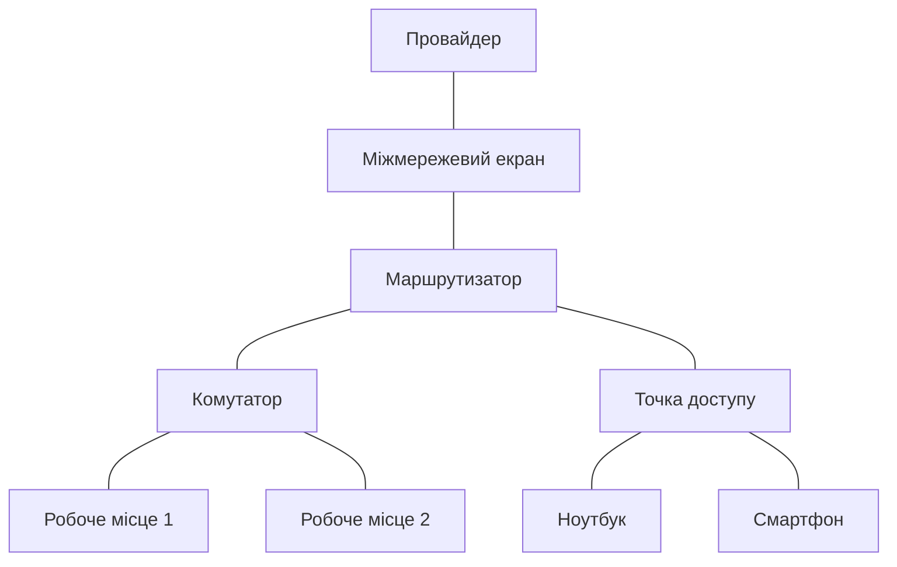

# Мережеве обладнання

> [!abstract]
> Кабель сам собою нічого не передає — потрібні пристрої, що приймають сигнал, приймають рішення і надсилають його далі. Розглянемо чотири базові класи активного мережевого обладнання — концентратори (як історичне тло), комутатори, маршрутизатори, точки доступу та міжмережеві екрани, — і подивимось, як вони разом утворюють мережу типового офісу.

## Активне й пасивне обладнання

У минулій лекції ми розглянули середовища передачі — мідний кабель, оптичне волокно, радіохвилі. Усе це — **пасивне обладнання**: кабель сам собою не приймає жодних рішень, він лише фізично проводить сигнал (або, у випадку Wi-Fi, взагалі не є "обладнанням" у звичному сенсі — це просто повітря). Патч-панель, розетка, конектор — теж пасивні елементи: вони з'єднують, але не обробляють.

Сьогоднішня лекція — про **активне обладнання**: пристрої, які отримують електричний, оптичний чи радіосигнал, приймають щодо нього якесь рішення (куди його переслати, чи пропустити взагалі) і генерують сигнал далі. Саме активне обладнання перетворює купу проводів і розеток на мережу, здатну доставляти дані від конкретного відправника до конкретного одержувача, а не просто на суцільний спільний простір, де кожен сигнал чують усі.

Це розмежування — пасивне проти активного — здається дрібницею, але воно принципове для розуміння вартості й складності мережі. Пасивна інфраструктура (кабелі, розетки, патч-панелі) — це, по суті, одноразова інвестиція: прокладену СКС не потрібно "оновлювати" щороку. Активне обладнання, навпаки, — це те, що застаріває, ламається, вимагає конфігурації, оновлення прошивки й заміни раз на кілька років. Саме тому, коли в останній лекції курсу ми говоритимемо про економіку мережі, левова частка операційних витрат припадатиме саме на активне обладнання, а не на кабельну систему.

## Концентратор: історія, яка все ще пояснює багато

Почнемо з пристрою, якого ви, найімовірніше, ніколи не побачите наживо в сучасній мережі, — **концентратора (hub)**. Розглядаємо його не заради практичної цінності (концентратори практично повністю витіснені комутаторами ще на початку 2000-х), а тому, що розуміння того, чому концентратор програв комутатору, — найкращий спосіб зрозуміти, чим саме гарний сучасний комутатор.

Концентратор — це найпростіший можливий активний пристрій: він отримує сигнал на одному порту й буквально ретранслює його на всі інші порти одночасно, не аналізуючи, кому цей сигнал насправді адресований. Фізично мережа з концентратором у центрі виглядає як топологія "зірка" з лекції 1 — кожен пристрій підключений окремим кабелем до центрального вузла, — але **логічно** вона поводиться точно як топологія "шина": усі підключені пристрої фактично перебувають в одному спільному середовищі, де в кожен момент часу може "говорити" лише один пристрій, інакше сигнали накладаються один на одного і псуються — це називається **колізією**. Сукупність портів, що поділяють одне спільне середовище і можуть спричинити колізію одне з одним, називається **доменом колізій (collision domain)** — і в мережі з концентраторами весь концентратор (і все, що до нього приєднане через інші концентратори) є одним великим доменом колізій.

> [!definition] Визначення
> **Домен колізій** — сегмент мережі, у межах якого одночасна передача даних двома пристроями призводить до накладання (колізії) сигналів і потребує повторної передачі.

Наслідок такого підходу очевидний: чим більше пристроїв підключено до концентратора, тим частіше трапляються колізії, тим більше часу витрачається на повторні передачі, і тим повільніше працює мережа в цілому — незалежно від того, чи справді два конкретні пристрої обмінюються даними між собою прямо зараз. Концентратор не вміє "думати" — він не знає й не хоче знати, кому адресований кадр, тому просто розсилає все всім. Саме ця обмеженість і привела до появи комутатора.

## Комутатор: розумніший сусід концентратора

**Комутатор (switch)** зовні виглядає майже так само, як концентратор, — коробка з портами RJ-45 чи SFP для оптики, — але поводиться принципово інакше. Замість того, щоб сліпо розсилати кожен вхідний сигнал на всі порти, комутатор аналізує заголовок кожного вхідного кадру, дізнається звідти фізичну адресу (**MAC-адресу**) одержувача і надсилає кадр лише на той конкретний порт, за яким цей одержувач насправді підключений. Механізм, за допомогою якого комутатор дізнається, який пристрій підключений до якого порту, — побудова й використання **таблиці MAC-адрес** — стане окремою темою вже наступного модуля, у лекції 6, тож поки що досить зрозуміти сам принцип: комутатор пересилає дані адресно, а не розсилає всім поспіль.

Це на перший погляд невелике покращення насправді радикально змінює характеристики мережі. Оскільки комутатор пересилає кадр лише на потрібний порт, два пристрої, підключені до різних портів того самого комутатора, можуть одночасно обмінюватися даними з двома іншими пристроями без жодної колізії між собою — кожна пара "розмовляє" ніби у власному приватному каналі. У термінах, введених вище: кожен порт комутатора є окремим доменом колізій (а в сучасних повнодуплексних з'єднаннях колізії на порту комутатора взагалі неможливі фізично, бо прийом і передача йдуть різними парами дротів одночасно). Саме тому перехід від концентраторів до комутаторів на межі 1990-х і 2000-х став одним із найбільших стрибків продуктивності в історії локальних мереж — не через зміну кабелю чи швидкості сигналу, а виключно через зміну логіки пересилання.

> [!example] Приклад
> Уявіть офіс на 24 робочих місця, підключені до одного 24-портового пристрою. Якщо це концентратор, то в будь-який момент часу реально "говорити" може лише одна пара пристроїв — усі інші чекають на свою чергу, і зі зростанням кількості активних користувачів мережа відчутно сповільнюється. Якщо це комутатор, то теоретично можуть одночасно й незалежно одна від одної відбуватися аж 12 пар розмов (по одній для кожних двох портів) — і жодна з них не заважає іншій.

Комутатори бувають різного рівня "розумності". **Некеровані комутатори (unmanaged)** — найпростіші, працюють одразу після підключення живлення, без будь-якого налаштування, і саме такі часто стоять вдома чи в маленькому офісі. **Керовані комутатори (managed)** дозволяють адміністратору підключитися до пристрою (через веб-інтерфейс або консоль) і налаштувати його поведінку — створювати VLAN, обмежувати швидкість окремих портів, вмикати протоколи резервування каналів. Саме керовані комутатори Cisco стануть основним обладнанням для практичних і лабораторних робіт цього курсу, починаючи з модуля 2.

## Маршрутизатор: пристрій, що з'єднує різні мережі

Комутатор чудово справляється з пересиланням даних усередині однієї мережі — але що робити, коли потрібно передати дані з однієї мережі в зовсім іншу, наприклад із домашньої мережі у велику мережу провайдера, а звідти — до сервера десь на іншому континенті? Для цього потрібен пристрій іншого класу — **маршрутизатор (router)**.

Якщо комутатор ухвалює рішення на основі MAC-адреси (фізичної адреси конкретного пристрою в межах однієї локальної мережі), то маршрутизатор ухвалює рішення на основі **IP-адреси** — логічної адреси, яка вказує не лише на конкретний пристрій, а й на те, у якій саме мережі цей пристрій перебуває. Маршрутизатор тримає в пам'яті **таблицю маршрутизації** — по суті, довідник "яку мережу через який інтерфейс і кому далі передати" — і на основі цієї таблиці приймає рішення для кожного вхідного пакета. Детально механіку побудови й читання таблиці маршрутизації, а також практичне налаштування маршрутизатора Cisco, ми розберемо в модулі 2, починаючи з лекції 13; тут важливо зафіксувати саму роль пристрою.

> [!definition] Визначення
> **Маршрутизатор** — пристрій, що пересилає дані між різними мережами на основі IP-адреси одержувача, використовуючи таблицю маршрутизації.

Практична межа між комутатором і маршрутизатором добре видно на прикладі домашнього роутера: усередині вашої квартири всі пристрої — ноутбук, телефон, телевізор — перебувають в одній локальній мережі й обмінюються даними один з одним через "комутаторну" частину пристрою (навіть якщо вона фізично поєднана в одному корпусі з іншими функціями). А от коли будь-який із цих пристроїв хоче зв'язатися із сервером в інтернеті — це вже вихід за межі локальної мережі, і саме "маршрутизаторна" частина того самого пристрою приймає рішення передати пакет далі, у мережу провайдера. Слово "роутер", яким побутово називають домашній пристрій, насправді описує лише одну з кількох функцій, які цей пристрій виконує одночасно, — про це трохи нижче.

## Точка доступу: міст між дротовим і бездротовим світом

**Точка доступу (access point, AP)** виконує вузьку, але важливу роль: вона приймає дані з дротової мережі (зазвичай через кабель вита пара від комутатора) і транслює їх у радіоефір за протоколом Wi-Fi, а також приймає радіосигнал від бездротових клієнтів і передає його назад у дротову мережу. По суті, точка доступу — це міст (bridge) між двома фізично різними середовищами передачі, які ми розглядали в лекції 2.

Важливо не плутати точку доступу з домашнім Wi-Fi-роутером, хоча в побуті ці терміни часто змішують. Домашній роутер — це комбінований пристрій, що поєднує в одному корпусі функції маршрутизатора, комутатора на кілька портів і точки доступу одночасно. У корпоративній мережі ці функції зазвичай розносять на окремі спеціалізовані пристрої: один потужний маршрутизатор на весь офіс, керовані комутатори на кожному поверсі і кілька точок доступу, розставлених по будівлі так, щоб забезпечити рівномірне покриття. Детально про налаштування точок доступу, стандарти Wi-Fi 6/6E/7 і захист WPA3 поговоримо в лекції 8.

## Міжмережевий екран: пристрій, що вирішує, кого пускати

Останній клас обладнання в сьогоднішньому огляді — **міжмережевий екран (firewall)**. Якщо комутатор і маршрутизатор відповідають на запитання "куди переслати ці дані", то міжмережевий екран відповідає на зовсім інше запитання — "чи можна взагалі пропустити ці дані". Це пристрій (або програмна служба на маршрутизаторі чи сервері), що аналізує трафік за набором правил і або пропускає його далі, або відкидає.

> [!definition] Визначення
> **Міжмережевий екран (firewall)** — пристрій або програмний засіб, що контролює мережевий трафік між сегментами мережі на основі заданих правил безпеки.

Найпростіші правила міжмережевого екрана оперують знайомими нам поняттями: IP-адресою відправника й одержувача, номером порту (про порти дізнаємось детальніше в лекції про транспортний рівень), напрямком з'єднання. Наприклад, типове домашнє правило звучить приблизно так: "дозволити будь-яке з'єднання, ініційоване зсередини локальної мережі назовні, але заборонити будь-яке з'єднання, ініційоване ззовні всередину, якщо воно не є відповіддю на вже дозволений запит". Саме це правило — причина, чому ви можете спокійно відкрити будь-який сайт з домашнього комп'ютера, але хтось із інтернету не може просто так підключитися до вашого комп'ютера без спеціального налаштування. Детальніше про побудову правил (списки доступу ACL) і про сучасніші, значно розумніші системи виявлення й запобігання вторгненням (IDS/IPS) поговоримо в модулі 2 та в лекції про мережеву безпеку модуля 6.

Міжмережеві екрани бувають окремими фізичними пристроями (типово на межі мережі підприємства й інтернету) або вбудованою функцією маршрутизатора чи навіть операційної системи кожного окремого комп'ютера (як брандмауер Windows чи nftables у Linux, до якого ми дійдемо в лекції 26).

> [!warning] Типова помилка
> Студенти іноді думають, що міжмережевий екран — це те саме, що антивірус. Це не так: антивірус аналізує вміст файлів на конкретному пристрої в пошуках відомих шкідливих програм, а міжмережевий екран взагалі не заглядає у вміст даних (принаймні в базовому варіанті) — він приймає рішення на основі метаданих з'єднання: звідки, куди, яким портом. Це різні рівні захисту, і в надійній мережі використовують обидва одночасно, а не один замість іншого.

## Як усе це працює разом

Зведемо чотири класи обладнання в одну таблицю — за яке запитання відповідає кожен пристрій:

| Пристрій | Ключове запитання | Приймає рішення на основі | Типове місце в мережі |
|---|---|---|---|
| Концентратор (історичний) | немає рішення, розсилає всім | нічого не аналізує | витіснений комутаторами |
| Комутатор | куди переслати в межах мережі | MAC-адреса | всередині локальної мережі |
| Маршрутизатор | куди переслати між мережами | IP-адреса, таблиця маршрутизації | межа між мережами |
| Точка доступу | як передати в ефір і назад | середовище передачі (дріт/радіо) | межа дротової й бездротової частини |
| Міжмережевий екран | чи можна взагалі пропустити | правила безпеки | межа мережі, критичні сегменти |

Подивимось, як ці ролі виглядають разом на прикладі мережі невеликого офісу: маршрутизатор на межі з провайдером, за ним — комутатор, що обслуговує дротові робочі місця, і точка доступу для бездротових пристроїв, а міжмережевий екран контролює, що взагалі дозволено проходити з інтернету всередину.

Варто одразу зазначити: у реальних невеликих мережах ці чотири ролі рідко втілені в чотирьох окремих коробках. Домашній і найдешевший офісний "роутер" — це, по суті, всі чотири функції в одному корпусі: маршрутизатор + комутатор на кілька портів + точка доступу + базовий міжмережевий екран. Що більша й вимогливіша мережа, то частіше ці функції розносять на окремі спеціалізовані пристрої — не тому, що це модно, а тому, що спеціалізований комутатор на 48 портів чи спеціалізований міжмережевий екран з апаратним прискоренням шифрування принципово продуктивніший і надійніший за ту саму функцію, "втиснуту" в бюджетний домашній пристрій поряд із трьома іншими.

> [!exam] На іспиті
> Типові питання: а) пояснити, чому перехід від концентраторів до комутаторів підвищив продуктивність мережі, оперуючи поняттям домену колізій; б) розрізнити, на основі якої адреси приймає рішення комутатор, а на основі якої — маршрутизатор; в) для заданого сценарію мережі визначити, яке обладнання і в якій ролі потрібне; г) пояснити різницю між міжмережевим екраном і антивірусом.

## Завдання на занятті (20 хв)

1. Намалюйте (текстом або схемою) мережу коледжу з трьома аудиторіями дротових комп'ютерів, однією зоною Wi-Fi для студентів і виходом в інтернет через провайдера, вказавши, яке обладнання потрібне в кожній точці схеми.
2. Обговоріть у парі: чому у великій компанії невигідно (і навіть небезпечно) використовувати один дешевий домашній роутер замість окремих спеціалізованих маршрутизатора, комутаторів і міжмережевого екрана?
3. Дано мережу з концентратором на 8 портів, до якого підключено 8 комп'ютерів. Поясніть словами, що станеться з продуктивністю мережі, якщо всі 8 комп'ютерів одночасно почнуть завантажувати великі файли, і чому заміна концентратора на комутатор вирішить цю проблему.
4. Придумайте одне просте правило міжмережевого екрана (у вигляді фрази "дозволити/заборонити... звідки... куди") для мережі коледжу, що забороняє студентській Wi-Fi-мережі підключатися напряму до сервера з оцінками, залишеного в дротовій адміністративній мережі.

> [!question] Перевірте себе
> 1. Чим логічно відрізняється мережа з концентратором від мережі з комутатором, якщо фізично обидві виглядають як топологія "зірка"?
> 2. На основі якої адреси комутатор вирішує, куди переслати кадр? А маршрутизатор — куди переслати пакет?
> 3. Що таке домен колізій і чому в сучасній мережі з комутаторами (на відміну від мережі з концентраторами) колізії практично не трапляються?
> 4. Яку роль виконує точка доступу і чим вона відрізняється від побутового поняття "Wi-Fi роутер"?
> 5. Наведіть приклад одного правила міжмережевого екрана і поясніть, на основі яких даних воно ухвалює рішення.

## Назад
← [[courses/computer-networks/lectures/02-seredovyshche-peredachi-danykh|Лекція 2. Середовище передачі даних]]

## Далі
→ [[courses/computer-networks/lectures/04-etalonni-modeli-osi-ta-tcp-ip|Лекція 4. Еталонні моделі OSI та TCP-IP]]

## Література
- Cisco Networking Academy. *Introduction to Networks* (курс CCNA v7/v7.1) — розділи про комутацію та маршрутизацію.
- Одом У. *Officially Licensed Cert Guide CCNA 200-301* — розділи про мережеве обладнання.
- Tanenbaum A., Wetherall D. *Computer Networks*, 5th edition — розділ 4, "The Medium Access Control Sublayer".
