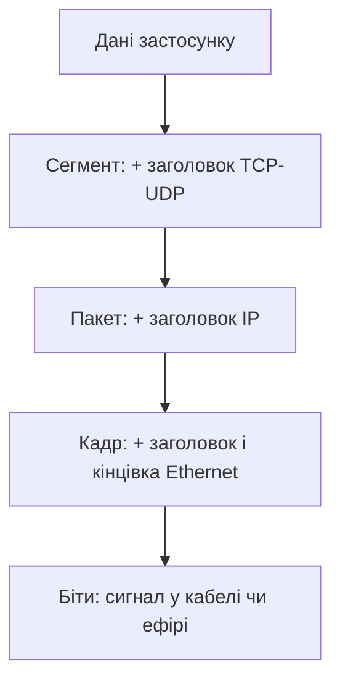

# Еталонні моделі OSI та TCP/IP

> [!abstract]
> Остання лекція вступного модуля дає нам мову, якою ми говоритимемо про мережі весь семестр, – еталонну модель OSI із семи рівнів і практичну модель TCP/IP. Розберемо, навіщо взагалі ділити мережу на рівні, що таке інкапсуляція даних, і як зіставляються між собою два цих підходи.

## Навіщо ділити мережу на рівні

За три попередні лекції ми вже говорили про безліч різних речей: кабелі й радіохвилі, MAC-адреси й IP-адреси, комутатори й маршрутизатори, домашні мережі й глобальний інтернет. Якщо спробувати утримати все це в голові як одну суцільну картину – вона вийде переобтяженою й заплутаною. Саме для цього і придумали **еталонні моделі**: спосіб розкласти складну задачу передачі даних мережею на окремі, незалежні один від одного **рівні (layers)**, кожен з яких відповідає за вузьке, чітко окреслене коло завдань.

Ідея розкладати складну систему на рівні – не винахід мережевих інженерів, а загальний інженерний прийом. Подумайте про поштову систему: ви пишете лист (зміст листа вас цікавить), кладете його в конверт із адресою (про конверт і доставку думає пошта, а не ви), пошта передає конверт кур'єрам, кур'єри – транспорту, транспорт їде дорогами. Ви ніколи не думаєте про те, яким саме маршрутом машина повезе ваш лист, а водій вантажівки ніколи не читає вміст листа. Кожен рівень цієї системи виконує свою вузьку роль і довіряє сусіднім рівням зробити свою частину роботи правильно.

Саме цей принцип – **розділення відповідальності** – лежить в основі мережевих моделей і дає нам три конкретні практичні переваги, кожна з яких напряму стосується того, чим ви займатиметесь як майбутній мережевий інженер.

По-перше, **незалежна розробка**. Виробник мережевої карти може вдосконалювати спосіб кодування бітів у кабелі, зовсім не переймаючись тим, як браузер формує HTTP-запит, – доки обидва дотримуються узгоджених "меж" між рівнями. По-друге, **сумісність обладнання різних виробників**. Саме завдяки чіткому розділенню на рівні комутатор Cisco, маршрутизатор Mikrotik і сервер під Linux можуть працювати в одній мережі, хоча їх виробляли різні компанії, що ніколи одна з одною не узгоджували внутрішній устрій своїх продуктів, – вони узгоджують лише те, що відбувається на межі рівнів. По-третє, і чи не найважливіше практично, – **структурована діагностика несправностей**. Коли щось не працює, мережевий інженер послідовно перевіряє рівень за рівнем: чи є фізичний зв'язок (рівень 1), чи бачить пристрій сусіда в мережі (рівень 2), чи доходить пінг (рівень 3), і так далі. Саме такий системний підхід до усунення несправностей ми детально розберемо в модулі 6, і саме розуміння рівнів моделі OSI зробить ваш пошук причини проблеми не хаотичним перебором навмання, а методичним процесом виключення.

## Модель OSI: сім рівнів

**Модель OSI (Open Systems Interconnection)** – еталонна модель, розроблена Міжнародною організацією зі стандартизації (ISO) у кінці 1970-х – на початку 1980-х як спроба створити універсальний, незалежний від конкретного виробника стандарт мережевої взаємодії. Історично цікаво, що модель OSI як повноцінний стек протоколів практично не прижилась (переміг конкурент – TCP/IP, про який поговоримо нижче), але сама сімирівнева схема виявилась настільки вдалим навчальним і концептуальним інструментом, що досі є базовою мовою опису мереж – саме нею користуються виробники обладнання, документація протоколів і, звісно, викладачі мережевих курсів.

Розглянемо всі сім рівнів послідовно – знизу вгору, від фізичного проводу до прикладної програми, бо саме в цьому напрямку рухаються дані, коли ви щось *надсилаєте* мережею.

**Рівень 1 – фізичний (Physical).** Найнижчий рівень, що відповідає буквально за електричні сигнали, світлові імпульси чи радіохвилі в середовищі передачі – усе те, про що йшлося в лекції 2. Фізичний рівень не знає, що таке "адреса" чи "дані" у змістовному сенсі – він оперує виключно бітами: 0 і 1, закодованими як напруга, світло чи частота. Обладнання цього рівня – кабелі, роз'єми, концентратори (той-таки історичний пристрій із лекції 3, що працював виключно на фізичному рівні, не аналізуючи вміст сигналу).

**Рівень 2 – канальний (Data Link).** Відповідає за передачу даних у межах однієї локальної мережі між сусідніми вузлами, використовуючи фізичні (MAC) адреси. Саме на цьому рівні працює комутатор, про який ми говорили в попередній лекції, – він читає MAC-адресу призначення й вирішує, на який порт переслати кадр. Канальний рівень також відповідає за виявлення помилок передачі (за допомогою контрольної суми) і, в деяких технологіях, за контроль доступу до спільного середовища – саме тут "живе" концепція домену колізій.

**Рівень 3 – мережевий (Network).** Відповідає за доставку даних між різними мережами, використовуючи логічні (IP) адреси. Це рівень маршрутизатора: саме тут ухвалюється рішення "через який інтерфейс і кому далі передати цей пакет", про яке ми говорили в лекції 3. Мережевий рівень – це також рівень, на якому працює протокол IP і його "напарник" ICMP, до яких ми детально повернемось у лекції 9.

**Рівень 4 – транспортний (Transport).** Відповідає за наскрізну доставку даних між конкретними застосунками на відправнику й одержувачі (а не просто між пристроями), а також, залежно від протоколу, за надійність цієї доставки – підтвердження отримання, повторну відправку втрачених фрагментів, контроль швидкості передачі. Саме на цьому рівні працюють два протоколи, яким присвячена окрема лекція 10, – TCP (надійний, з підтвердженням доставки) і UDP (швидкий, без гарантій).

**Рівень 5 – сеансовий (Session).** Відповідає за встановлення, підтримку і завершення сеансу зв'язку між двома застосунками – по суті, за те, щоб довготривала розмова (наприклад, файловий обмін чи відеодзвінок) залишалась одним логічним "сеансом", а не розпадалась на незв'язані шматки. На практиці функції цього рівня в сучасних протоколах здебільшого вбудовані просто в застосунок або в транспортний рівень, тому чистого, окремо виділеного "сеансового протоколу" ви зустрічаєте рідко – це один з рівнів, які модель TCP/IP, про яку піде мова нижче, свідомо не виділяє окремо.

**Рівень 6 – представлення (Presentation).** Відповідає за формат представлення даних – кодування символів (наприклад, UTF-8), стиснення, шифрування. Коли браузер і сервер узгоджують шифроване TLS-з'єднання (детально розберемо в лекції 17), це функціонально – робота рівня представлення, хоча на практиці TLS реалізований як окремий протокол над транспортним рівнем, а не як "чистий" рівень 6 в архітектурному сенсі.

**Рівень 7 – прикладний (Application).** Найвищий рівень, найближчий до користувача, – це не самі застосунки (браузер, поштовий клієнт), а протоколи, якими ці застосунки спілкуються мережею: HTTP для вебсторінок, SMTP для електронної пошти, DNS для перетворення доменних імен на адреси. Прикладному рівню й конкретним протоколам, що на ньому працюють, присвячена лекція 17.

> [!definition] Визначення
> **Рівень (layer)** мережевої моделі – логічний прошарок, що відповідає за чітко окреслене коло функцій і взаємодіє лише із сусідніми рівнями через стандартизований інтерфейс, не втручаючись у внутрішню реалізацію інших рівнів.

Щоб не тримати всі сім назв і номерів виключно в голові, зведемо їх в одну таблицю разом із коротким прикладом того, що на кожному рівні "живе":

| № | Рівень OSI | Приклад | Хто працює на цьому рівні |
|---|---|---|---|
| 7 | Прикладний | HTTP, DNS, SMTP | застосунок і його протокол |
| 6 | Представлення | кодування, стиснення, TLS | застосунок |
| 5 | Сеансовий | керування сеансом з'єднання | застосунок |
| 4 | Транспортний | TCP, UDP | операційна система |
| 3 | Мережевий | IP, ICMP | маршрутизатор |
| 2 | Канальний | Ethernet, MAC-адреси | комутатор |
| 1 | Фізичний | кабель, радіохвилі, біти | концентратор, кабель |

> [!info] Для допитливих
> Класичний мнемонічний прийом для запам'ятовування порядку рівнів OSI знизу вгору – англійська фраза "Please Do Not Throw Sausage Pizza Away" (Physical, Data Link, Network, Transport, Session, Presentation, Application). Зверху вниз популярна інша: "All People Seem To Need Data Processing". Можете придумати власну українську фразу з перших літер "Фізичний, Канальний, Мережевий, Транспортний, Сеансовий, Представлення, Прикладний" – сам процес придумування мнемоніки допомагає запам'ятати порядок краще, ніж просто завчений чужий вірш.

## Інкапсуляція: як дані "загортаються" на кожному рівні

Знання назв рівнів саме собою мало корисне без розуміння того, що́ насправді відбувається з даними, коли вони проходять крізь ці рівні. Відповідь – **інкапсуляція**: на кожному рівні, спускаючись від прикладного до фізичного, до даних додається службовий заголовок (а іноді й "кінцівка") цього рівня, і те, що прийшло згори, стає просто "вмістом" для поточного рівня, без будь-якого аналізу цього вмісту.

Найкраща побутова аналогія – матрьошка, або, точніше, лист, який кладуть у конверт, а той конверт – у посилку, а посилку – у контейнер вантажівки. Зміст листа (дані застосунку) не змінюється на жодному етапі – його просто послідовно обгортають додатковою службовою інформацією, потрібною для доставки саме на цьому етапі шляху. Коли посилка приїжджає до одержувача, процес відбувається у зворотному порядку – **декапсуляція**: кожен рівень знімає "свій" заголовок і передає те, що залишилось, рівнем вище, аж доки застосунок-одержувач не отримає вихідний, незмінний зміст листа.

На кожному рівні модель OSI дає своєму "пакету з заголовком" окрему назву – це називається **PDU (Protocol Data Unit)**, і саме ці назви ви часто зустрічатимете в документації та в консолі мережевого обладнання:

| Рівень | Назва PDU | Що додається |
|---|---|---|
| Прикладний / представлення / сеансовий | Дані (Data) | вміст застосунку без службової інформації |
| Транспортний | Сегмент (Segment) – для TCP, Дейтаграма (Datagram) – для UDP | номери портів, у TCP – номер послідовності й підтвердження |
| Мережевий | Пакет (Packet) | IP-адреси відправника й одержувача |
| Канальний | Кадр (Frame) | MAC-адреси відправника й одержувача, контрольна сума |
| Фізичний | Біти (Bits) | кодування у фізичний сигнал |

> [!example] Приклад
> Коли ви відкриваєте сайт у браузері, HTTP-запит (прикладний рівень) спускається на транспортний рівень, де до нього додається заголовок TCP з номером порту 443 (стандартний порт для захищеного HTTP) – виходить сегмент. Сегмент спускається на мережевий рівень, де додається заголовок IP з адресою вашого комп'ютера й адресою сервера – виходить пакет. Пакет спускається на канальний рівень, де додається заголовок Ethernet із MAC-адресою вашого комп'ютера й MAC-адресою найближчого маршрутизатора (не самого сервера – чому саме так, детально розберемо в лекції про IP та ICMP) – виходить кадр. І нарешті кадр перетворюється на послідовність електричних чи оптичних імпульсів і фізично рухається кабелем.

Розуміння інкапсуляції – не абстрактна вправа для іспиту, а щоденний інструмент діагностики. Коли ви в лекції 43 вивчатимете аналіз трафіку програмою Wireshark, ви буквально побачите на екрані ці вкладені один в одного заголовки для кожного захопленого пакета – і саме розуміння того, який заголовок належить якому рівню, дозволить швидко зрозуміти, на якому саме етапі щось пішло не так.

## Модель TCP/IP: практична альтернатива

Якщо OSI – переважно навчальна й концептуальна модель, то **модель TCP/IP** – це модель, за якою реально влаштований інтернет і переважна більшість сучасних мереж. Вона виникла раніше за формальну модель OSI, розвинулась із практичних протоколів проєкту ARPANET, про який ми згадували в лекції 1, і саме тому не намагається бути настільки ж теоретично охайною – вона описує те, що вже реально працювало на практиці.

Класична модель TCP/IP налічує **чотири рівні** замість семи: **прикладний**, **транспортний**, **мережевий (або міжмережевий, internet)** і **рівень мережевого доступу (network access)**, що об'єднує в собі функції канального й фізичного рівнів OSI. На практиці, особливо в навчальних матеріалах Cisco, часто використовують гібридний варіант із **п'яти рівнів**, що розділяє останній рівень TCP/IP назад на канальний і фізичний, – це зручний компроміс, що зберігає практичність TCP/IP, але дає трохи більшу деталізацію на найнижчому рівні. Саме такою п'ятирівневою версією ми й будемо користуватися надалі в цьому курсі, бо вона зручніше зіставляється з тим обладнанням, яке ви вивчали в лекції 3.

Зіставимо обидві моделі поруч, щоб було видно точну відповідність:

| Рівень OSI (7) | Рівень TCP/IP (5) |
|---|---|
| 7 Прикладний | Прикладний |
| 6 Представлення | Прикладний |
| 5 Сеансовий | Прикладний |
| 4 Транспортний | Транспортний |
| 3 Мережевий | Мережевий (Internet) |
| 2 Канальний | Канальний |
| 1 Фізичний | Фізичний |

Звідси видно головну практичну відмінність: три верхні рівні моделі OSI (прикладний, представлення, сеансовий) в моделі TCP/IP злиті в один рівень. Це не помилка й не спрощення заради спрощення – це відображення реальності: на практиці жоден поширений протокол не ділить свою роботу рівно за межами "представлення" й "сеансу" так, як пропонує теоретична модель OSI. Функції кодування, стиснення, шифрування й керування сеансом просто вбудовані безпосередньо в конкретні прикладні протоколи чи бібліотеки (той-таки TLS, про який ми ще будемо говорити в лекції 17), а не існують як окремий універсальний "рівень 6" чи "рівень 5" з власним протоколом.

> [!warning] Типова помилка
> Найпоширеніша плутанина серед студентів – думати, що OSI й TCP/IP є "конкурентами", де потрібно обрати правильну і забути про іншу. Насправді в цьому курсі (і в реальній роботі мережевого інженера) обидві моделі використовуються одночасно, просто для різних цілей: коли говоримо про реальні протоколи й реальну конфігурацію обладнання, зазвичай зручніше мислити в термінах TCP/IP (саме так буде побудована більшість практичних і лабораторних робіт цього курсу); коли пояснюємо концепцію, порівнюємо технології чи діагностуємо проблему за принципом "від низу до верху", часто зручніше мислити в термінах семи рівнів OSI, бо детальніший поділ верхніх рівнів іноді допомагає точніше локалізувати проблему.

## Чому все це важливо саме зараз

Ви щойно отримали словник, яким користуватиметесь до кінця семестру. Коли в наступній лекції ми говоритимемо про Ethernet, це буде розмова про канальний і фізичний рівні. Коли дійдемо до IP-адресації у модулі 2 – це мережевий рівень. Коли говоритимемо про TCP і UDP – транспортний. Коли дійдемо до DNS, HTTP, TLS – прикладний. Тримайте цю карту в голові: щоразу, коли зустрічаєте нову тему курсу, перше корисне запитання – "на якому рівні моделі це відбувається?" – і відповідь одразу підказує, з чим ця тема пов'язана, а з чим – ні.

> [!exam] На іспиті
> Типові питання: а) перелічити сім рівнів OSI в правильному порядку й навести приклад протоколу чи пристрою для кожного; б) пояснити, що таке інкапсуляція, і назвати PDU кожного рівня; в) зіставити рівні OSI з рівнями TCP/IP і пояснити, чому три верхні рівні OSI об'єднані в моделі TCP/IP в один; г) для заданого сценарію (наприклад, "комутатор аналізує MAC-адресу") визначити, на якому рівні відбувається дія.

## Завдання на занятті (20 хв)

1. Візьміть будь-яку дію в мережі з попередніх трьох лекцій (наприклад, "маршрутизатор дивиться в таблицю маршрутизації" чи "Wi-Fi точка доступу передає сигнал у радіоефір") і визначте, на якому рівні OSI ця дія відбувається.
2. У парі намалюйте процес інкапсуляції для одного HTTP-запиту від браузера до сервера – від даних застосунку до бітів у кабелі, – підписавши, що додається на кожному кроці.
3. Обговоріть: якою була б проблема, якби виробник мережевої карти вирішив "оптимізувати" протокол, порушивши межу між канальним і мережевим рівнем (наприклад, зашивши логіку маршрутизації прямо у формат MAC-адреси)? Чому розділення на рівні захищає від таких проблем?
4. Складіть власну українську мнемонічну фразу для запам'ятовування семи рівнів OSI (у будь-якому напрямку) і поділіться нею з сусідньою парою.

> [!question] Перевірте себе
> 1. Перелічіть сім рівнів моделі OSI від фізичного до прикладного.
> 2. Що таке інкапсуляція і чим кадр (frame) відрізняється від пакета (packet)?
> 3. Скільки рівнів у практичній (п'ятирівневій) моделі TCP/IP і які три рівні OSI об'єднані в один прикладний рівень TCP/IP?
> 4. На якому рівні працює комутатор, а на якому – маршрутизатор? Обґрунтуйте відповідь через тип адреси, яку кожен з них аналізує.
> 5. Чому модель OSI, попри те що жоден стек протоколів не реалізує її повністю на практиці, досі активно використовується в навчанні й документації?

## Назад
← [[courses/computer-networks/lectures/03-merezheve-obladnannia|Лекція 3. Мережеве обладнання]]

## Далі
→ [[courses/computer-networks/lectures/05-ethernet-i-shvydkosti-lokalnykh-merezh|Лекція 5. Ethernet і швидкості локальних мереж]]

## Література
- Cisco Networking Academy. *Introduction to Networks* (курс CCNA v7/v7.1) – розділи про моделі OSI та TCP/IP, інкапсуляцію.
- Tanenbaum A., Wetherall D. *Computer Networks*, 5th edition – розділ 1.4, "Reference Models".
- Одом У. *Officially Licensed Cert Guide CCNA 200-301* – розділ про еталонні моделі.
