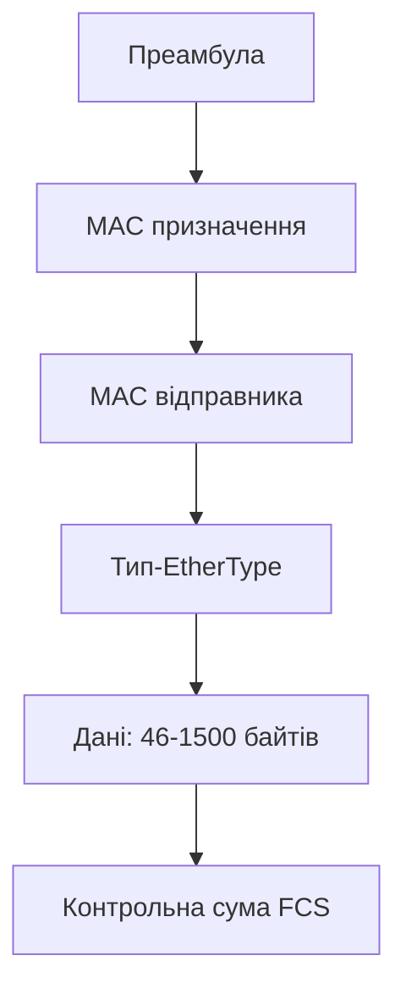

# Ethernet і швидкості локальних мереж

> [!abstract]
> Ethernet – технологія канального й фізичного рівнів, що фактично монополізувала проводові локальні мережі. Розберемо, як влаштований кадр Ethernet, чому колись існував механізм CSMA/CD і чому сьогодні він практично не потрібен, як розшифровуються назви на кшталт 1000BASE-T, і як швидкості зросли від перших 10 Мбіт/с до 100 Гбіт/с у сучасних дата-центрах.

## Що таке Ethernet і чому саме він переміг

У попередній лекції ми домовились, що канальний і фізичний рівні моделі OSI відповідають за передачу даних у межах однієї локальної мережі – фізичне кодування сигналу і пересилання кадрів між сусідніми вузлами на основі MAC-адрес. **Ethernet** – це найпоширеніший набір стандартів, що визначає, як саме ці два рівні реалізовані в проводових локальних мережах. Формально Ethernet описаний у сімействі стандартів **IEEE 802.3**, і саме за цим номером ви знайдете офіційну технічну документацію, хоча в побуті й документації Cisco практично завжди вживають просто "Ethernet".

Ethernet виник у середині 1970-х у дослідницькій лабораторії Xerox PARC, а комерційно поширився з 1980-х. За майже півстоліття існування він пережив конкуренцію з десятком інших технологій локальних мереж – Token Ring (побудований на кільцевій топології, яку ми згадували в лекції 1), FDDI, ARCNET – і всі вони практично зникли з ринку, тоді як Ethernet не просто вижив, а й став де-факто єдиним стандартом проводових локальних мереж. Причина цього успіху повчальна сама собою: Ethernet виявився не найелегантнішим технічно рішенням (кільцеві технології на кшталт Token Ring за деякими характеристиками були навіть передбачуванішими), а найпростішим, найдешевшим у виробництві й, що важливо, здатним поступово нарощувати швидкість, зберігаючи сумісність зі старим обладнанням і форматом кадру. Мережевий інженер, що навчився працювати з Ethernet 20 років тому, і сьогодні впізнає структуру кадру практично без змін – попри те, що швидкість зросла в тисячі разів.

## Як влаштований кадр Ethernet

У лекції 4 ми ввели поняття кадру (frame) – PDU канального рівня, що виникає, коли до пакета мережевого рівня додається заголовок і кінцівка канального рівня. Настав час подивитися, з чого конкретно складається кадр Ethernet, – розуміння цієї структури знадобиться вже в наступній лекції, коли говоритимемо про VLAN, і ще раз – коли в модулі 6 аналізуватимемо трафік у Wireshark.

**Преамбула (Preamble)** – службова послідовність біт на самому початку кадру, що не несе жодних даних, а лише дає приймачу час синхронізуватися з тактовою частотою переданого сигналу – щось на кшталт короткого "прокашлювання" перед початком розмови, щоб слухач встиг налаштуватись.

**MAC-адреса призначення** і **MAC-адреса відправника** – по шість байтів кожна, вказують фізичну адресу одержувача й відправника кадру в межах локальної мережі. Саме ці два поля читає комутатор, коли вирішує, на який порт переслати кадр, – механізм, який ми детально розберемо вже в наступній лекції.

**Тип/Довжина (EtherType/Length)** – поле, що або вказує довжину поля даних, або (у сучасніших кадрах) вказує, який протокол верхнього рівня міститься у полі даних – наприклад, значення 0x0800 означає, що всередині – пакет IPv4.

**Дані (Payload)** – власне корисне навантаження кадру, тобто пакет мережевого рівня (та інкапсульовані в ньому сегмент, а в сегменті – дані застосунку). Розмір цього поля обмежений: мінімум 46 байтів (якщо реальних даних менше, кадр доповнюється порожніми байтами-заповнювачами, бо надто короткий кадр важче надійно розпізнати на фізичному рівні), максимум – **1500 байтів** для стандартного кадру. Це число, 1500 байтів, називається **MTU (Maximum Transmission Unit)** канального рівня і виявиться дуже важливим практичним параметром, коли будемо говорити про фрагментацію пакетів на мережевому рівні в лекції 9.

**Контрольна сума кадру (Frame Check Sequence, FCS)** – чотири байти в кінці кадру, обчислені за спеціальним алгоритмом (циклічний надлишковий код, CRC) на основі всього вмісту кадру. Отримавши кадр, приймач самостійно перераховує цю контрольну суму й порівнює з тією, що прийшла в кадрі: якщо значення не збігаються, кадр був пошкоджений під час передачі (наприклад, через електромагнітну завваду) і просто відкидається без повідомлення відправнику – на канальному рівні немає механізму запиту повторної передачі, це завдання вищих рівнів, зокрема транспортного TCP, до якого дійдемо в лекції 10.

> [!info] Для допитливих
> Той-таки MTU у 1500 байтів – рішення, прийняте ще на зорі Ethernet і збережене дотепер заради сумісності, хоча технічно сучасне обладнання здатне на значно більше. У дата-центрах і високошвидкісних мережах поширена практика вмикати **jumbo-кадри (jumbo frames)** – кадри з MTU до 9000 байтів, – що зменшують накладні витрати на службові заголовки при передачі великих обсягів даних. Про це ще згадаємо, коли дійдемо до мереж дата-центрів на швидкостях 10/40/100 Гбіт/с.

## CSMA/CD: механізм, який більше майже не потрібен

У лекції 3 ми говорили про домен колізій – сегмент мережі, де одночасна передача двома пристроями призводить до накладання сигналів. Класичний Ethernet, побудований на топології "шина" або на концентраторах (тобто на спільному середовищі, яке "чують" усі пристрої одночасно), потребував механізму, що дозволяв би пристроям домовлятися, хто і коли може передавати, не заважаючи одне одному. Цим механізмом був **CSMA/CD (Carrier Sense Multiple Access with Collision Detection)**.

Розберемо назву протоколу по частинах, бо вона доволі точно описує сам алгоритм. **Carrier Sense** ("прослуховування несучої") – перед тим як почати передачу, пристрій спочатку "слухає" середовище: якщо хтось інший вже передає, пристрій чекає. **Multiple Access** ("множинний доступ") – усі пристрої мають рівний доступ до спільного середовища, без централізованого арбітра, який би видавав дозвіл на передачу. **Collision Detection** ("виявлення колізій") – якщо два пристрої, обидва вважаючи середовище вільним, все ж почали передавати одночасно (наприклад, через затримку поширення сигналу – сигнал ще не встиг дійти до другого пристрою, коли той теж вирішив почати передавати), обидва пристрої виявляють накладання сигналів, негайно припиняють передачу, надсилають коротку "сигнальну перешкоду" (jam signal), щоб гарантовано попередити всіх учасників про колізію, а потім кожен чекає випадковий проміжок часу (щоб знову не почати передавати одночасно) і повторює спробу.

> [!definition] Визначення
> **CSMA/CD** – метод контролю доступу до спільного середовища передачі, за якого пристрої прослуховують середовище перед передачею і виявляють та обробляють колізії, якщо вони все ж трапляються.

Тут варто повернутись до висновку, до якого ми вже прийшли в лекції 3: із переходом від концентраторів до комутаторів кожен порт комутатора став окремим доменом колізій, а з появою **повнодуплексного (full-duplex)** режиму зв'язку – коли прийом і передача даних відбуваються одночасно різними парами дротів усередині того самого кабелю вита пара – колізії на такому з'єднанні стали фізично неможливими: пристрій може одночасно й слухати, і говорити, тож йому просто нема з ким "накладатись". Це протилежність **напівдуплексного (half-duplex)** режиму, де в кожен момент часу можна або передавати, або приймати, але не обидва одночасно, – саме такий режим був вимушеним в епоху концентраторів і спільного середовища.

Практичний висновок такий: у переважній більшості сучасних мереж, побудованих на комутаторах з повнодуплексними з'єднаннями, CSMA/CD фактично не працює – не тому, що його вимкнули, а тому, що умови, за яких він взагалі міг би спрацювати (колізія в спільному середовищі), просто не виникають. Ви й досі побачите згадку CSMA/CD у стандарті IEEE 802.3 і в підручниках – і саме тому важливо розуміти його історичну роль, – але на практиці в сучасній офісній мережі цей механізм – швидше застережний артефакт, ніж активно працююча частина протоколу. Виняток – старе обладнання чи Wi-Fi, де через специфіку радіосередовища використовується споріднений, але дещо інший механізм (CSMA/CA, про який згадаємо в лекції 8).

## Еволюція швидкостей: від 10 Мбіт/с до 100 Гбіт/с і далі

Історія Ethernet – це історія майже безперервного зростання швидкості за збереження зворотної сумісності формату кадру. Прослідкуємо основні віхи цієї еволюції, бо саме розуміння цієї шкали допоможе орієнтуватися, коли в реальній роботі доведеться вибирати обладнання під конкретне завдання.

**10 Мбіт/с – класичний Ethernet.** Перший комерційно успішний стандарт, 10BASE-T, що працював на кабелі вита пара категорій нижче Cat5 (детально категорії кабелю розглядали в лекції 2). Сьогодні цю швидкість ви не зустрінете в жодній сучасній інсталяції – вона згадується здебільшого як історична точка відліку.

**100 Мбіт/с – Fast Ethernet.** Стандарт 100BASE-TX, що став масовим стандартом локальних мереж на межі 1990-х і 2000-х. Саме на цій швидкості (а часто ще й на 10 Мбіт/с для сумісності зі старішими пристроями) ви все ще іноді зустрінете застаріле обладнання в реальних інсталяціях.

**1 Гбіт/с – Gigabit Ethernet.** Стандарт 1000BASE-T, що вимагає щонайменше кабелю категорії Cat5e (пригадайте таблицю категорій із лекції 2) і сьогодні є практичним мінімумом для будь-якого нового робочого місця – саме цю швидкість ви отримаєте від сучасного порту звичайного офісного чи домашнього комутатора.

**10 Гбіт/с – 10 Gigabit Ethernet (10GbE).** Стандарт 10GBASE-T вимагає кабелю Cat6a для повних 100 метрів (Cat6 підтримує цю швидкість лише на скорочену відстань, приблизно до 55 метрів, як ми вже зазначали в таблиці категорій). Ця швидкість сьогодні типова для магістральних з'єднань усередині будівлі – наприклад, між телекомунікаційними шафами поверхів і центральною апаратною, про яку йшлося в структурованій кабельній системі в лекції 2.

**40 і 100 Гбіт/с – швидкості дата-центрів.** На цих швидкостях мідний кабель вита пара вже практично не використовується – переходять на оптичне волокно (згадайте переваги оптики з лекції 2: менше загасання, вища пропускна здатність на великих відстанях) або на спеціалізовані короткі мідні кабелі прямого підключення (DAC) усередині однієї стійки дата-центру. Ці швидкості типові для з'єднань між магістральними комутаторами й серверами у великих дата-центрах, де одночасно обслуговуються тисячі користувачів.

**За межами 100 Гбіт/с.** Індустрія вже впровадила стандарти 200, 400 і навіть 800 Гбіт/с для найбільших дата-центрів і магістральних провайдерів – попит на такі швидкості підживлюється саме тими трендами, про які ми говорили в лекції 1: хмарні сервіси, потокове відео високої роздільності й, дедалі більше, тренування великих моделей штучного інтелекту, що вимагає передачі величезних обсягів даних між серверами всередині одного дата-центру за мінімальний час.

Зведемо ключові швидкості й вимоги до середовища в одну таблицю:

| Швидкість | Назва стандарту | Мінімальна категорія кабелю | Типове застосування сьогодні |
|---|---|---|---|
| 10 Мбіт/с | 10BASE-T | Cat3 | історична |
| 100 Мбіт/с | 100BASE-TX | Cat5 | застаріле обладнання |
| 1 Гбіт/с | 1000BASE-T | Cat5e | стандартне робоче місце |
| 10 Гбіт/с | 10GBASE-T | Cat6a (Cat6 – скорочена відстань) | магістраль усередині будівлі |
| 40/100 Гбіт/с | переважно оптика | – | дата-центри |

> [!example] Приклад
> Розшифруємо назву **1000BASE-T** за загальним правилом іменування стандартів Ethernet: перше число – швидкість у мегабітах за секунду (1000 = 1 Гбіт/с), слово **BASE** означає "baseband" – сигнал передається на базовій частоті без модуляції на несучу (на відміну від технологій кабельного телебачення, де використовується broadband), а остання літера чи літери вказують тип середовища – **T** означає "twisted pair" (вита пара), тоді як, наприклад, **10GBASE-SR** означає оптичне волокно (S – short range, тобто коротка дистанція, типова для багатомодового волокна з лекції 2). Уміння читати ці позначення – не формальність, а практичний навик: коли ви бачите на специфікації обладнання "1000BASE-LX", ви вже за самою назвою розумієте, що йдеться про гігабітну швидкість на оптичному волокні для великих відстаней (L – long range), ще не відкриваючи повну документацію.

## Автоузгодження: як пристрої домовляються про швидкість

Сучасні порти Ethernet підтримують кілька швидкостей одночасно (наприклад, порт може працювати і на 100 Мбіт/с, і на 1 Гбіт/с, залежно від того, з чим з'єднаний), тому потрібен механізм, за яким два з'єднані пристрої автоматично визначають найкращу спільну швидкість і режим дуплексу. Цей механізм називається **автоузгодженням (auto-negotiation)**: під час встановлення фізичного з'єднання обидва пристрої обмінюються короткими службовими сигналами про свої можливості (список підтримуваних швидкостей, підтримка повнодуплексного режиму) і автоматично обирають найвищу швидкість, яку підтримують обидва.

> [!warning] Типова помилка
> Іноді автоузгодження працює некоректно – наприклад, через несправний кабель, застаріле обладнання чи навмисне ручне налаштування фіксованої швидкості на одному з двох пристроїв без такого самого налаштування на іншому. Результат – так званий **дуплексний конфлікт (duplex mismatch)**: один пристрій вважає з'єднання повнодуплексним, інший – напівдуплексним, і мережа при цьому не "падає" повністю, а починає працювати помітно повільніше й нестабільніше, з дивними, важко пояснюваними втратами пакетів. Це один з класичних прикладів несправності, яку важко діагностувати "на око", і саме тому в модулі 6, коли будемо детально розбирати методику усунення несправностей, ми ще раз згадаємо саме цей сценарій як показовий приклад того, чому системний підхід рівень-за-рівнем важливіший за здогадки.

## Ethernet у контексті всього курсу

Зверніть увагу, як природно ця лекція спирається на все, що ми вже розглянули: структура кадру продовжує розмову про інкапсуляцію з лекції 4, домен колізій і повнодуплексний режим – розмову про комутатори з лекції 3, вимоги до кабелю за категоріями – таблицю з лекції 2. Це не випадковість: Ethernet – це технологія, що буквально "прошиває" канальний і фізичний рівні наскрізь, і саме тому розуміння того, як влаштований кадр і як обираються швидкість і дуплекс, стане фундаментом для наступної теми – комутації, таблиць MAC-адрес і VLAN, до якої переходимо вже в лекції 6.

> [!exam] На іспиті
> Типові питання: а) перелічити й коротко описати поля кадру Ethernet; б) пояснити принцип роботи CSMA/CD і чому він практично не активний у сучасних повнодуплексних мережах на комутаторах; в) розшифрувати назву стандарту на кшталт "10GBASE-T" чи "1000BASE-LX"; г) пояснити, що таке дуплексний конфлікт і чим він небезпечний для продуктивності мережі.

## Завдання на занятті (20 хв)

1. Розшифруйте самостійно назви стандартів **100BASE-FX** та **10GBASE-SR**, спираючись на правило іменування з прикладу вище, і скажіть, яке середовище передачі кожен з них використовує.
2. У парі поясніть одне одному словами (без підглядання в конспект), що відбувається крок за кроком, коли два пристрої в мережі з концентратором одночасно намагаються передати кадр – від прослуховування середовища до повторної спроби після колізії.
3. Дано мережу, де новий сервер із портом на 10 Гбіт/с підключений до старого комутатора з портами лише на 1 Гбіт/с через кабель Cat6a. На якій швидкості реально запрацює це з'єднання після автоузгодження і чому?
4. Обговоріть: чому дата-центри, що обробляють навантаження штучного інтелекту, особливо зацікавлені в переході на швидкості 400 Гбіт/с і вище, тоді як звичайному офісу цілком достатньо гігабітних портів на робочих місцях?

> [!question] Перевірте себе
> 1. З яких полів складається кадр Ethernet і яке з них використовує комутатор для пересилання кадру?
> 2. Що означають три літери в абревіатурі CSMA/CD і що конкретно робить кожна частина механізму?
> 3. Чому CSMA/CD практично не спрацьовує в сучасній мережі на комутаторах з повнодуплексними з'єднаннями?
> 4. Яка мінімальна категорія кабелю потрібна для стабільної роботи 10 Гбіт/с Ethernet на повні 100 метрів?
> 5. Що таке дуплексний конфлікт і які симптоми він викликає в мережі?

## Назад
← [[courses/computer-networks/lectures/04-etalonni-modeli-osi-ta-tcp-ip|Лекція 4. Еталонні моделі OSI та TCP-IP]]

## Далі
→ [[courses/computer-networks/lectures/06-komutatsiia-vlan-ta-tranky|Лекція 6. Комутація, VLAN та транки]]

## Література
- IEEE 802.3 Standard for Ethernet.
- Cisco Networking Academy. *Introduction to Networks* (курс CCNA v7/v7.1) – розділ про Ethernet.
- Одом У. *Officially Licensed Cert Guide CCNA 200-301* – розділ про канальний рівень і Ethernet.
