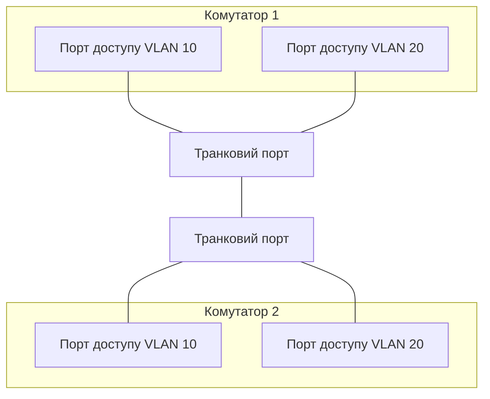

# Комутація, VLAN та транки

> [!abstract]
> У лекції 3 ми домовились, що комутатор пересилає кадри на основі MAC-адрес, не заглиблюючись у деталі. Настав час розібрати цей механізм повністю: як будується таблиця MAC-адрес, чому "плоска" локальна мережа стає проблемою з ростом кількості пристроїв, і як VLAN дозволяє логічно розділити одну фізичну мережу на кілька незалежних, використовуючи транкові порти для передачі кількох VLAN одним кабелем.

## Як комутатор будує таблицю MAC-адрес

Комутатор, коли його щойно ввімкнули, нічого не знає про мережу, до якої підключений, – жодного запису про те, який пристрій підключений до якого порту. Проте вже за кілька секунд роботи він самостійно вибудовує повну картину, і робить це на диво простим алгоритмом, що складається з трьох дій, які виконуються для кожного вхідного кадру.

**Навчання (learning).** Коли на будь-який порт комутатора приходить кадр, комутатор дивиться на MAC-адресу *відправника* в заголовку кадру і запам'ятовує пару "ця MAC-адреса перебуває за цим портом" у своїй **таблиці MAC-адрес** (яку також називають таблицею комутації, CAM-таблицею – від Content Addressable Memory, спеціального типу пам'яті, оптимізованого саме для такого пошуку). Важливо: комутатор навчається на основі адреси *відправника*, а не одержувача, – логіка проста: якщо кадр прийшов із порту 3, то пристрій з такою MAC-адресою відправника фізично точно перебуває десь за портом 3, і надалі можна сміливо пересилати туди будь-який кадр, адресований саме йому.

**Пересилання чи заповнення (forwarding / flooding).** Тепер комутатор дивиться на MAC-адресу *одержувача*. Якщо ця адреса вже є в таблиці MAC-адрес (тобто комутатор раніше вже "бачив" кадр від цього пристрою і запам'ятав, за яким портом він перебуває), кадр пересилається точково – лише на цей один конкретний порт. Але якщо адреси одержувача в таблиці ще немає (наприклад, комутатор щойно ввімкнули й ще нічого не встиг вивчити, або пристрій-одержувач сам ще ніколи нічого не надсилав), комутатор не знає, куди саме пересилати кадр, – і в цьому випадку він поводиться точно як старий концентратор з лекції 3: розсилає кадр на всі порти, крім того, звідки кадр прийшов. Це і називається **заповненням (flooding)**, і саме тому комутатор – це не "завжди розумний" пристрій, а пристрій, що навчається на льоту: перші кадри в новій мережі можуть розсилатись усім, але вже за лічені секунди більшість трафіку пересилається точково.

**Фільтрація (filtering).** Якщо кадр прийшов на порт 3, і MAC-адреса одержувача в таблиці теж записана саме за портом 3 (тобто відправник і одержувач фізично підключені до одного й того самого порту чи опинилися в одному сегменті за цим портом), комутатор просто відкидає такий кадр – пересилати його нікуди не потрібно, одержувач і так уже почув сигнал безпосередньо.

> [!definition] Визначення
> **Таблиця MAC-адрес** – таблиця відповідності "MAC-адреса → порт комутатора", яку комутатор будує автоматично, аналізуючи адреси відправників вхідних кадрів, і використовує для точкового пересилання замість розсилання всім.

Записи в таблиці MAC-адрес не зберігаються вічно: якщо за певний період (типове стандартне значення – 300 секунд, тобто 5 хвилин) комутатор жодного разу не отримав кадру від конкретної MAC-адреси, запис про неї видаляється – це називається **старінням (aging)**. Це не помилка, а розумна економія пам'яті: якщо пристрій відключили від мережі чи перенесли на інший порт, стара інформація про нього рано чи пізно має бути забута, інакше таблиця поступово заповнилась би застарілими, неправильними записами.

> [!example] Приклад
> Уявіть щойно ввімкнений комутатор із чотирма підключеними комп'ютерами – A, B, C, D. Комп'ютер A надсилає кадр комп'ютеру B. Комутатор бачить кадр на своєму порту A, запам'ятовує "MAC A → порт A", але не знає, де B, тому розсилає кадр на порти B, C і D (заповнення). Комп'ютери C і D просто відкидають кадр, побачивши, що він адресований не їм, а B – отримує й обробляє. Тепер, коли B відповідає A, комутатор бачить кадр на порту B, запам'ятовує "MAC B → порт B", і оскільки MAC-адреса A вже є в таблиці, пересилає відповідь точково лише на порт A – жодного зайвого трафіку на C і D цього разу.

## Домен трансляції: нова проблема, яку не вирішує комутатор

У лекції 3 і 5 ми вже познайомились із доменом колізій і з'ясували, що комутатори (на відміну від концентраторів) роблять кожен свій порт окремим доменом колізій. Але є ще одне поняття, на яке комутатор впливає зовсім по-іншому, – **домен трансляції (broadcast domain)**.

Іноді пристрою потрібно надіслати кадр буквально всім у мережі одразу – наприклад, коли комп'ютер щойно підключився й хоче дізнатись, хто в мережі відповідає за певну IP-адресу (такий службовий запит, ARP, ми детально розберемо в лекції 9). Для цього існує спеціальна широкомовна MAC-адреса призначення (усі одиниці – FF:FF:FF:FF:FF:FF), побачивши яку, кожен пристрій у мережі зобов'язаний обробити кадр, ніби він адресований саме йому. Такий кадр називається **широкомовним (broadcast)**.

І ось тут криється ключова відмінність від домену колізій: комутатор, на відміну від того, як він точково пересилає звичайні кадри, зобов'язаний переслати широкомовний кадр буквально на всі свої порти, крім того, звідки кадр прийшов, – незалежно від того, наскільки "розумно навчений" він уже встиг стати. Причина проста: комутатор не може знати заздалегідь, чи потрібен цей широкомовний запит комусь конкретному, – за визначенням, він адресований усім. Сукупність усіх портів і пристроїв, куди дійде такий широкомовний кадр, називається **доменом трансляції**, і на відміну від домену колізій, комутатор його не зменшує – усі порти одного комутатора (і всіх з'єднаних з ним комутаторів) за замовчуванням перебувають в одному спільному домені трансляції.

> [!warning] Типова помилка
> Студенти часто плутають домен колізій і домен трансляції, бо обидва пов'язані зі "спільним простором" у мережі. Запам'ятайте чітке розмежування: **комутатор зменшує домен колізій** (кожен порт – окремий домен колізій, колізії практично неможливі в повнодуплексному режимі), але **комутатор сам собою не зменшує домен трансляції** (усі порти одного комутатора – один спільний домен трансляції). Єдиний пристрій, що розділяє домени трансляції, – маршрутизатор (або, як побачимо нижче, VLAN у поєднанні з маршрутизацією між VLAN).

Чому це проблема на практиці? Уявіть мережу підприємства на 500 пристроїв, усі підключені через кілька з'єднаних комутаторів в одну "плоску" мережу без жодного поділу. Кожен широкомовний запит від будь-якого з 500 пристроїв дійде до всіх інших 499 – і чим більше пристроїв, тим більше широкомовного "фонового шуму" в мережі, тим менше реальної пропускної здатності залишається для корисного трафіку, і тим складніше локалізувати проблему, коли щось починає працювати повільно. Крім продуктивності, є ще й безпекове міркування: у плоскій мережі бухгалтерія, відділ розробки й гостьовий Wi-Fi (пригадайте тренд IoT і сегментації з лекції 1) технічно перебувають в одному й тому самому просторі, і фізичне підключення до будь-якого порту потенційно дає доступ до трафіку всіх інших.

## VLAN: логічний поділ без нового обладнання

Найпростіше рішення описаної проблеми, яке спадає на думку, – фізично розділити мережу на кілька окремих комутаторів, по одному на кожен відділ. Але це дорого, негнучко (переставити людину з одного відділу в інший означає перетягнути кабель на інший комутатор) і погано масштабується. Набагато елегантніше рішення – **VLAN (Virtual Local Area Network)**: логічний поділ одного фізичного комутатора (чи навіть кількох з'єднаних комутаторів) на кілька незалежних доменів трансляції, які поводяться так, ніби вони – окремі фізичні мережі, хоча насправді використовують ту саму фізичну інфраструктуру.

> [!definition] Визначення
> **VLAN** – логічний сегмент мережі, що створює окремий домен трансляції в межах одного чи кількох фізичних комутаторів, незалежно від фізичного розташування підключених пристроїв.

Механізм простий у своїй основі: кожному порту комутатора адміністратор призначає номер VLAN (наприклад, VLAN 10 для бухгалтерії, VLAN 20 для розробки, VLAN 30 для гостьового Wi-Fi). Комутатор пересилає широкомовні кадри лише в межах того самого VLAN, з якого вони прийшли, – тобто широкомовний запит з порту, призначеного VLAN 10, ніколи не потрапить на порт, призначений VLAN 20, навіть якщо обидва порти фізично на тому самому комутаторі й підключені до тієї самої розетки на стіні за той самий кабель СКС. З погляду пристроїв, підключених до різних VLAN, вони перебувають у зовсім різних мережах – так само, як якби між ними стояли фізично окремі комутатори.

> [!example] Приклад
> Уявіть офіс на два поверхи, де на кожному поверсі перемішані робочі місця бухгалтерії й відділу розробки – фізично поруч, в одному кабінеті. Без VLAN довелося б або тягнути окремий комплект кабелів і окремий комутатор для кожного відділу на кожному поверсі, або змиритись з тим, що обидва відділи перебувають в одному спільному, незахищеному сегменті. З VLAN достатньо на кожному комутаторі призначити конкретні порти конкретному VLAN – бухгалтерія скрізь потрапляє у VLAN 10, розробка скрізь у VLAN 20, – і логічно вони опиняються у двох повністю ізольованих мережах, попри те що фізично використовують ту саму кабельну систему й ті самі комутатори.

Порт комутатора, призначений одному конкретному VLAN і підключений до кінцевого пристрою (комп'ютера, принтера, точки доступу), називається **порт доступу (access port)**. Такий пристрій навіть не підозрює про існування VLAN – він просто надсилає й отримує звичайні кадри Ethernet, а вся логіка розподілу за VLAN відбувається виключно всередині комутатора.

## Транки: як передати кілька VLAN одним кабелем

Логічний поділ на VLAN усередині одного комутатора – це вже корисно, але справжня практична цінність VLAN розкривається, коли потрібно з'єднати між собою кілька комутаторів у різних кімнатах чи на різних поверхах, зберігаючи той самий поділ. Найнеефективніший підхід – прокласти окремий кабель для кожного VLAN між кожною парою комутаторів: якщо у вас 5 VLAN і 10 комутаторів, така схема швидко стає неможливою фізично.

Рішення – **транковий порт (trunk port)**: спеціально налаштований порт, що передає кадри одразу кількох VLAN одним фізичним кабелем, розрізняючи їх за допомогою **тегування** – додавання до кожного кадру короткої службової позначки з номером VLAN, якому цей кадр належить. Стандарт, що визначає формат такого тегу, називається **IEEE 802.1Q**, і саме тому транкові порти часто називають "802.1Q trunk" у документації.

Тег 802.1Q вставляється прямо в заголовок кадру Ethernet, між полем MAC-адреси відправника і полем типу/довжини, про які ми говорили в лекції 5, – і додає до кадру 4 байти, з яких 12 бітів відведено безпосередньо під номер VLAN (VLAN ID), що дає теоретичний діапазон від 0 до 4095, тобто до 4094 практично використовуваних VLAN на одному транку (номери 0 і 4095 зарезервовані). Отримавши позначений тегом кадр на іншому кінці транкового кабелю, сусідній комутатор читає номер VLAN із тега, знімає тег і пересилає кадр далі вже у відповідний VLAN – так, ніби кадр весь час "знав", у якому логічному сегменті йому належить перебувати.

Окремо варто згадати поняття **нативного VLAN (native VLAN)** – це VLAN, кадри якого транковий порт передає *без* тега 802.1Q, на відміну від усіх інших VLAN на цьому самому транку. Історично нативний VLAN існує заради сумісності зі старим обладнанням, що взагалі не розуміє тегів 802.1Q, – такий пристрій просто отримає кадр нативного VLAN, як звичайний, непозначений кадр. На практиці нативний VLAN – доволі відоме джерело помилок конфігурації: якщо на двох кінцях одного транку налаштовано різний номер нативного VLAN, кадри без тега можуть потрапити не в той сегмент, куди очікувалось, – тому хорошою практикою вважається явно узгоджувати нативний VLAN на обох кінцях кожного транкового з'єднання і за можливості взагалі не використовувати цей VLAN для реального користувацького трафіку.

> [!warning] Типова помилка
> Часто плутають порт доступу і транковий порт за призначенням, а не за конфігурацією: "порт доступу – це для комп'ютерів, транк – для комутаторів" – це правильна практична евристика, але не визначення. Насправді відмінність суто технічна: порт доступу передає кадри одного VLAN без тегів, транковий порт передає кадри кількох VLAN із тегами 802.1Q (крім нативного). Теоретично можна підключити окремий комп'ютер і до транкового порту (якщо його мережева карта підтримує розуміння тегів 802.1Q), хоча на практиці такий сценарій рідкісний і використовується хіба що у спеціалізованих задачах, наприклад коли один сервер має одночасно обслуговувати кілька VLAN.

## А що з комунікацією між VLAN?

Логічний наслідок усього сказаного вище – раз VLAN створює окремий домен трансляції, то пристрої з різних VLAN за замовчуванням *не можуть* обмінюватися даними одне з одним, навіть якщо фізично підключені до того самого комутатора. Це не побічний ефект, а свідома мета VLAN: саме ізоляція забезпечує і продуктивність (менше широкомовного шуму), і безпеку (розробники не бачать трафік бухгалтерії).

Але часом обмін даними між VLAN усе-таки потрібен – наприклад, комп'ютеру з VLAN розробки потрібно звернутись до сервера друку у VLAN офісної інфраструктури. Тут повертається головний висновок цієї лекції: **лише маршрутизатор (пристрій третього, мережевого рівня) здатен пересилати трафік між різними доменами трансляції**, а отже, і між різними VLAN. Такий процес називається **маршрутизацією між VLAN (inter-VLAN routing)**, і саме йому присвячена одна з лабораторних робіт цього курсу – там ви на практиці налаштуєте і VLAN на комутаторі, і маршрутизацію між ними на маршрутизаторі, з'єднавши теорію цієї лекції з практичною конфігурацією.

## Навіщо все це мережевому інженеру

VLAN – одна з найпрактичніших тем усього курсу: майже кожна корпоративна мережа, яку ви зустрінете в реальній роботі, побудована на VLAN, а не на плоскій мережі без поділу. Розуміння того, як будується таблиця MAC-адрес, чим домен трансляції відрізняється від домену колізій, і як транкові порти передають кілька VLAN одним кабелем, – це фундамент, без якого неможливо ні спроєктувати мережу середнього офісу, ні прочитати типову схему мережі підприємства, яку ви побачите в наступних модулях курсу.

> [!exam] На іспиті
> Типові питання: а) описати три дії, які виконує комутатор для кожного вхідного кадру (навчання, пересилання/заповнення, фільтрація); б) пояснити різницю між доменом колізій і доменом трансляції та роль комутатора щодо кожного з них; в) пояснити, навіщо потрібен VLAN і як він розв'язує проблему широкомовного шуму й безпеки в плоскій мережі; г) описати роль тега 802.1Q і принцип роботи транкового порту, включно з поняттям нативного VLAN.

## Завдання на занятті (20 хв)

1. Крок за кроком, як у прикладі вище, простежте, що відбувається з таблицею MAC-адрес щойно ввімкненого комутатора на п'ять портів, коли послідовно надсилаються три кадри: A→B, B→A, C→A. Яких записів стане в таблиці після третього кадру і за якими портами?
2. Офіс на 40 людей: 15 у бухгалтерії, 15 у розробці, 10 гостьових пристроїв Wi-Fi. Запропонуйте схему VLAN (номери й призначення) для цього офісу і поясніть, чому гостьовий Wi-Fi варто виносити в окремий VLAN, навіть якщо технічно всі пристрої можуть підключатись до тієї самої точки доступу.
3. У парі намалюйте схему з двох комутаторів, з'єднаних транком, кожен з портами доступу для VLAN 10 і VLAN 20, і позначте, які кадри йдуть з тегом, а які – без (нативний VLAN).
4. Обговоріть: чому саме маршрутизатор, а не сам VLAN чи транк, потрібен, щоб пристрої з різних VLAN могли обмінюватися даними?

> [!question] Перевірте себе
> 1. Опишіть по кроках, що робить комутатор, отримавши кадр: за якою адресою він навчається і за якою вирішує, куди переслати.
> 2. Чим домен трансляції відрізняється від домену колізій, і чому комутатор зменшує один, але не інший?
> 3. Що таке VLAN і яку конкретну проблему плоскої мережі він вирішує?
> 4. Що таке транковий порт, і що конкретно додається до кадру за стандартом 802.1Q, щоб розрізняти VLAN на одному кабелі?
> 5. Чому пристрої з різних VLAN не можуть обмінюватися даними без додаткового пристрою, і який саме пристрій для цього потрібен?

## Назад
← [[courses/computer-networks/lectures/05-ethernet-i-shvydkosti-lokalnykh-merezh|Лекція 5. Ethernet і швидкості локальних мереж]]

## Далі
→ [[courses/computer-networks/lectures/07-stp-ahrehatsiia-kanaliv-ta-qos|Лекція 7. STP, агрегація каналів та QoS]]

## Література
- Cisco Networking Academy. *Introduction to Networks* та *Switching, Routing, and Wireless Essentials* (курс CCNA v7/v7.1) – розділи про комутацію та VLAN.
- IEEE 802.1Q Standard for VLAN Tagging.
- Одом У. *Officially Licensed Cert Guide CCNA 200-301* – розділи про VLAN і транкові порти.
