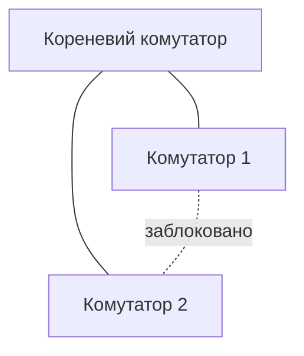

# STP, агрегація каналів та QoS

> [!abstract]
> Резервні канали між комутаторами підвищують надійність мережі, але без спеціального механізму вони спричиняють руйнівні петлі комутації. Розберемо, як протокол STP (і його швидша версія RSTP) блокує зайві шляхи, зберігаючи їх у резерві, як агрегація каналів дозволяє об'єднати кілька фізичних кабелів в один логічний без цього блокування, і як QoS визначає, який трафік у локальній мережі важливіший за інший.

## Чому резервні канали — це і благо, і небезпека

У лекції 1, коли ми розглядали топології, ми з'ясували: топологія "зірка" відмовостійка на рівні окремих кабелів, але має єдину точку відмови — центральний комутатор. Природне рішення — додати резервний зв'язок між комутаторами, щоб у разі виходу з ладу одного кабелю чи навіть одного комутатора мережа могла продовжувати працювати іншим шляхом. Логічно, це наближає нас до часткової сітки, про яку теж говорилось у лекції 1.

Але тут виникає проблема, яка на перший погляд непомітна, а на практиці здатна повністю "покласти" мережу за лічені секунди. Пригадаємо з лекції 6: якщо комутатор не знає, куди переслати кадр (адреси одержувача немає в таблиці MAC-адрес), він розсилає кадр на всі порти, крім вхідного, — заповнення. А широкомовні кадри розсилаються на всі порти *завжди*, незалежно від того, чи є адреса в таблиці. Тепер уявіть два комутатори, з'єднані одразу двома кабелями замість одного, для резервування. Широкомовний кадр, потрапивши в мережу, розсилається обома шляхами одночасно; на іншому кінці другий комутатор отримує дві копії того самого кадру і, оскільки в нього теж кілька шляхів назад, знову розсилає обидві копії — і так до нескінченності, подвоюючись з кожним колом. Це називається **петлею комутації (switching loop)**, а результат — **широкомовний шторм (broadcast storm)**: кількість копій того самого кадру росте геометрично, доступна пропускна здатність каналів заповнюється паразитним трафіком за секунди, а корисні дані фізично не можуть протиснутись крізь цей потік.

Є й друга, менш очевидна проблема: коли той самий кадр приходить на комутатор одночасно кількома шляхами, комутатор бачить одну й ту саму MAC-адресу відправника то на одному порту, то на іншому, і безперервно перезаписує запис у таблиці MAC-адрес — це називається **нестабільністю таблиці MAC-адрес**, і вона робить точкове пересилання кадрів практично неможливим, бо комутатор постійно "плутається", де насправді перебуває той чи інший пристрій.

> [!warning] Типова помилка
> Студенти-початківці, спроєктувавши "надійну" мережу з кількома резервними кабелями між комутаторами без жодного захисного механізму, найчастіше отримують не підвищену надійність, а повністю непрацездатну мережу вже за секунди після підключення другого кабелю. Резервування каналів канального рівня — на відміну від, скажімо, просто дублювання джерела живлення — вимагає спеціального протоколу, що не дає резервному шляху працювати одночасно з основним.

## STP: як уникнути петлі, зберігши резерв

**STP (Spanning Tree Protocol, IEEE 802.1D)** розв'язує саме цю проблему: він дозволяє мати фізичні петлі в кабельній топології (для надійності), але логічно блокує достатню кількість з'єднань, щоб активна, "робоча" частина мережі в кожен момент часу залишалась деревом — тобто топологією без жодної петлі, у якій між будь-якими двома вузлами існує рівно один активний шлях. Слово "spanning tree" ("дерево, що охоплює") із назви протоколу описує саме це: STP будує логічне дерево поверх фізично надлишкової мережі.

Принцип роботи STP спирається на три послідовні кроки, і саме в такому порядку варто його запам'ятовувати.

**Крок 1 — вибір кореневого комутатора (root bridge).** Усі комутатори в мережі, де працює STP, обмінюються службовими повідомленнями (BPDU, Bridge Protocol Data Unit) і на основі цього обміну домовляються, який із них стане "коренем" логічного дерева — тобто точкою відліку, від якої вимірюється відстань до всіх інших комутаторів. Кореневий комутатор обирається за найменшим значенням **ідентифікатора моста (Bridge ID)** — числа, що складається із заданого адміністратором пріоритету та MAC-адреси комутатора (MAC-адреса використовується як гарантований спосіб розв'язати нічию, якщо у двох комутаторів однаковий пріоритет). Усі порти кореневого комутатора автоматично стають активними — адже, за визначенням, від кореня до самого себе відстань нульова, і блокувати тут нічого.

**Крок 2 — визначення кореневого порту (root port) на кожному з інших комутаторів.** Кожен некореневий комутатор визначає, який з його власних портів веде найкоротшим шляхом до кореневого комутатора (за сумарною "вартістю шляху", що залежить переважно від швидкості каналів — чим швидший канал, тим нижча вартість), і саме цей порт залишає активним для передачі даних до кореня.

**Крок 3 — визначення призначеного порту (designated port) для кожного сегмента мережі й блокування решти.** Для кожного окремого сегмента мережі (ділянки між двома комутаторами) STP визначає один "призначений" порт, що відповідатиме за пересилання трафіку в цьому сегменті, а всі інші порти, що ведуть до того самого сегмента через альтернативні, довші шляхи, переводяться у **заблокований стан (blocking)**: вони фізично залишаються підключеними й повністю готовими запрацювати будь-якої миті, але не пересилають жодного користувацького трафіку — окрім службових повідомлень STP, якими комутатори продовжують стежити за станом мережі.

> [!definition] Визначення
> **STP (Spanning Tree Protocol)** — протокол канального рівня, що запобігає петлям комутації, логічно блокуючи надлишкові шляхи в мережі, зберігаючи фізичну надлишковість як резерв на випадок відмови активного шляху.

Саме в цьому блокуванні — вся суть протоколу: коли активний (призначений) шлях виходить з ладу — обривається кабель або вимикається комутатор, — STP виявляє відсутність очікуваних службових повідомлень від сусіда, перераховує дерево заново і переводить раніше заблокований порт в активний стан, відновлюючи зв'язність мережі вже іншим, резервним шляхом.

> [!example] Приклад
> На схемі вище кореневий комутатор з'єднаний із комутатором 1 і комутатором 2 напряму, а між собою комутатори 1 і 2 з'єднані додатковим резервним кабелем. Без STP цей трикутник — класична петля. З увімкненим STP один із трьох зв'язків (типово — найдовший чи найповільніший шлях, у цьому випадку прямий зв'язок між комутаторами 1 і 2) переводиться в заблокований стан. Мережа продовжує працювати деревом без петель, а якщо, наприклад, зв'язок комутатора 1 з коренем обірветься, STP перерахує дерево і активує раніше заблокований зв'язок між комутаторами 1 і 2, відновивши зв'язність через комутатор 2.

Головний практичний недолік класичного STP — **повільна збіжність (convergence)**: перехід порту зі стану "заблоковано" у стан "пересилає дані" в оригінальному STP займає до 30-50 секунд, оскільки протокол проходить кілька проміжних станів (blocking → listening → learning → forwarding), кожен з яких триває певний фіксований час заради обережності — щоб гарантовано уникнути тимчасової петлі під час самого процесу перерахунку дерева. Для мережі 1990-х, коли STP розробляли, це вважалося прийнятним компромісом; для сучасної мережі, де навіть кількасекундний простій відчутний користувачам, 30-50 секунд — це вже серйозна практична проблема.

## RSTP: та сама ідея, значно швидше

**RSTP (Rapid Spanning Tree Protocol, IEEE 802.1w)** — вдосконалена версія того самого протоколу, що вирішує саме проблему повільної збіжності, зберігаючи ту саму базову логіку "вибір кореня → вибір кореневих і призначених портів → блокування решти". RSTP досягає збіжності за секунди замість десятків секунд завдяки кільком ключовим змінам.

По-перше, RSTP скорочує кількість станів порту до трьох замість чотирьох-п'яти в класичному STP: **discarding** (об'єднує колишні "blocking" і "listening" — порт не пересилає користувацький трафік і ще не вивчає MAC-адреси), **learning** (порт вивчає MAC-адреси, але ще не пересилає трафік) і **forwarding** (порт повністю активний). По-друге, RSTP вводить нові ролі портів понад ті, що вже були в STP: **альтернативний порт (alternate port)** — заздалегідь відомий резервний шлях до кореня, готовий миттєво стати новим кореневим портом, якщо поточний кореневий порт відмовить, і **резервний порт (backup port)** — резервний шлях до того самого сегмента мережі, яким уже керує інший призначений порт того самого комутатора. Ключова відмінність від класичного STP — RSTP заздалегідь *обчислює* ці резервні ролі, а не вичікує після відмови, тому активація резерву відбувається практично миттєво, без потреби заново "з нуля" перераховувати все дерево і безпечно очікувати проміжні стани.

На практиці сьогодні майже все нове обладнання за замовчуванням використовує саме RSTP (або ще новіші розширення на кшталт багатоекземплярного MSTP, що дозволяє мати різні дерева для різних VLAN, — це виходить за межі базового курсу, але варто знати, що таке розширення існує). Класичний STP згадують здебільшого як історичне тло, так само як CSMA/CD у лекції 5, — важливе для розуміння самої ідеї, але рідко активно працююче в чистому вигляді на сучасному обладнанні.

> [!info] Для допитливих
> Термін "spanning tree" походить із теорії графів: у математиці остовне дерево (spanning tree) графа — це підмножина ребер графа, що з'єднує всі його вершини без жодного циклу. STP, по суті, розв'язує в реальному часі саме таку класичну задачу з теорії графів, застосовану до топології мережевих комутаторів, — вдалий приклад того, як абстрактна математика напряму застосовується в повсякденній інженерній практиці.

## Агрегація каналів: обхідний шлях повз обмеження STP

STP чудово розв'язує проблему петель, але має побічний ефект, який іноді небажаний: якщо між двома комутаторами прокладено кілька паралельних кабелів для збільшення пропускної здатності (а не лише для резервування через окремий, довший шлях, як у прикладі вище), STP все одно розпізнає це як потенційну петлю й заблокує всі кабелі, крім одного, — адже з погляду протоколу кілька паралельних зв'язків між тими самими двома комутаторами так само створюють цикл, як і зв'язок через третій комутатор. У результаті витрачені гроші на додаткові кабелі й порти не дають жодного приросту пропускної здатності — просто резервний "запасний варіант" на випадок відмови основного.

**Агрегація каналів (link aggregation)**, яку в обладнанні Cisco називають **EtherChannel**, а в загальному стандарті — **LACP (Link Aggregation Control Protocol, IEEE 802.3ad)**, вирішує саме цю задачу: вона об'єднує кілька фізичних кабелів між тими самими двома пристроями в один **логічний канал**, який з погляду STP (і взагалі з погляду решти мережі) виглядає як єдине з'єднання — а отже, ніякої петлі тут STP не бачить, і всі фізичні кабелі в складі агрегованого каналу залишаються одночасно активними.

> [!definition] Визначення
> **Агрегація каналів** — об'єднання кількох фізичних з'єднань між двома мережевими пристроями в один логічний канал, що одночасно підвищує сумарну пропускну здатність і забезпечує резервування без втручання STP.

Тут криється подвійна вигода, і варто чітко розрізняти обидва аспекти. По-перше, **пропускна здатність**: якщо об'єднати чотири кабелі по 1 Гбіт/с кожен, логічний канал теоретично здатен передавати сумарно до 4 Гбіт/с трафіку одночасно (хоча важливо розуміти: одне окреме з'єднання між двома конкретними пристроями зазвичай усе одно "прив'язується" до одного фізичного кабелю за спеціальним алгоритмом розподілу навантаження, а не буквально "розрізається" на частини між усіма чотирма кабелями одночасно, — тому реальний виграш найкраще відчувається, коли одночасно активно багато різних розмов, а не одна дуже важка). По-друге, **надійність**: якщо один із чотирьох фізичних кабелів у складі агрегованого каналу обривається, логічний канал просто продовжує працювати на решті трьох, автоматично й миттєво, без будь-якого перерахунку дерева STP і без 30-50-секундного очікування збіжності, характерного для класичного STP.

LACP — це протокол, за допомогою якого два пристрої на кінцях агрегованого каналу узгоджують, які саме порти входять до складу об'єднання, і безперервно перевіряють, що канал з іншого боку теж налаштований і працює правильно, — це запобігає ситуації, коли один пристрій вважає кілька портів одним логічним каналом, а інший — досі окремими незалежними портами, що призвело б до непередбачуваної, помилкової поведінки мережі.

## QoS: не всі дані однаково важливі

Останнє поняття сьогоднішньої лекції стосується вже не резервування чи петель, а якості обслуговування різних видів трафіку. У лекції 1 ми ввели термін "джитер" — коливання затримки в часі, — і зауважили, що для завантаження файлу він майже не має значення, а для відеодзвінка чи онлайн-гри критичний. **QoS (Quality of Service)** — це набір механізмів, що дозволяють мережі свідомо надавати пріоритет одним видам трафіку над іншими, коли пропускної здатності каналу тимчасово не вистачає на все одразу.

Уявіть офісний канал, яким одночасно йде відеодзвінок, звичайне завантаження оновлення операційної системи розміром кілька гігабайтів, і електронний лист із невеликим вкладенням. Без QoS усі три потоки конкурують за пропускну здатність каналу на рівних умовах, і якщо канал перевантажений, пакети відеодзвінка можуть застрягати в черзі поряд із пакетами завантаження оновлення — а для відеодзвінка навіть невелика додаткова затримка чи джитер вже помітні як "заїкання" голосу й зображення, тоді як для завантаження оновлення операційної системи додаткова затримка в кілька секунд взагалі непомітна користувачу. QoS дозволяє явно сказати мережевому обладнанню: "трафік відеодзвінків важливіший за трафік завантаження файлів — обробляй його першим, коли є конкуренція за пропускну здатність".

Практично QoS складається з кількох послідовних кроків. **Класифікація (classification)** — визначення, до якого типу належить конкретний пакет чи кадр (голос, відео, звичайні дані, фонове резервне копіювання). **Маркування (marking)** — проставляння спеціальної позначки прямо в заголовку кадру чи пакета, щоб наступні пристрої на шляху не мусили заново аналізувати трафік, а могли одразу побачити готову позначку пріоритету; на канальному рівні для цього використовується поле **CoS (Class of Service)** у тегу 802.1Q, який ми вже розглядали в лекції 6 стосовно VLAN, — виявляється, той самий тег виконує одразу дві функції: номер VLAN і рівень пріоритету. На мережевому рівні для тієї самої мети використовується поле **DSCP** у заголовку IP, до якого повернемось, коли дійдемо до пакета в лекції 9. **Черги й планування (queuing and scheduling)** — коли на виході з порту комутатора чи маршрутизатора накопичується більше трафіку, ніж канал здатен пропустити миттєво, обладнання розподіляє пакети за кількома чергами відповідно до маркування і обробляє їх у порядку пріоритету, а не строго "хто прийшов раніше".

> [!example] Приклад
> Типова практична пріоритизація в офісній мережі: голосовий трафік (IP-телефонія) отримує найвищий пріоритет, бо він найчутливіший і до затримки, і до джитера; відео (наприклад, відеодзвінки) — високий пріоритет, трохи менш критичний за голос; звичайний трафік застосунків (пошта, вебсторінки) — стандартний пріоритет; масові фонові операції (резервне копіювання, оновлення операційних систем уночі) — найнижчий пріоритет, який можна затримати без жодних наслідків для користувача.

QoS не створює додаткову пропускну здатність нізвідки — це важливо розуміти чітко: якщо каналу постійно, а не тимчасово, не вистачає пропускної здатності на весь трафік, жодне налаштування пріоритетів не компенсує фізичну нестачу "ширини труби". QoS ефективний саме в моменти *тимчасової* перевантаженості, коли потрібно розумно розподілити обмежений ресурс між конкуруючими потоками, а не як заміна фізичного розширення каналу там, де воно справді необхідне.

> [!exam] На іспиті
> Типові питання: а) пояснити, чому резервні кабелі між комутаторами без STP спричиняють широкомовний шторм; б) описати три кроки роботи STP (вибір кореня, кореневі порти, призначені й заблоковані порти); в) пояснити, чим RSTP швидший за класичний STP; г) пояснити, чому агрегація каналів не блокується STP, на відміну від звичайних паралельних кабелів; д) описати мету QoS і навести приклад пріоритизації трафіку.

## Завдання на занятті (20 хв)

1. Намалюйте трикутник із трьох комутаторів, усі попарно з'єднані (як у прикладі вище), позначте, який комутатор став би кореневим, якби всі мали однаковий пріоритет (підказка: розв'язання нічиї відбувається за MAC-адресою), і покажіть, який зв'язок STP заблокує.
2. У парі обговоріть: чому в дата-центрі, де між двома магістральними комутаторами прокладено вісім паралельних кабелів для максимальної пропускної здатності, критично важливо налаштувати саме агрегацію каналів, а не покластися на звичайний STP?
3. Складіть для невеликого офісу (відеодзвінки, звичайний перегляд вебсторінок, нічне резервне копіювання файлового сервера) просту схему пріоритетів QoS із трьох-чотирьох рівнів і обґрунтуйте порядок.
4. Обговоріть: чому 30-50-секундна збіжність класичного STP була прийнятною в мережах 1990-х, але вважається серйозною проблемою для сучасного офісу, де працюють відеодзвінки й хмарні застосунки?

> [!question] Перевірте себе
> 1. Що таке широкомовний шторм і чому резервні канали без STP до нього призводять?
> 2. Опишіть три кроки, якими STP будує дерево без петель.
> 3. Назвіть дві причини, чому RSTP переходить у робочий стан значно швидше за класичний STP.
> 4. Чому агрегація кількох кабелів між тими самими двома комутаторами не блокується STP, хоча технічно це теж кілька паралельних зв'язків?
> 5. Наведіть приклад двох видів трафіку в офісній мережі з різним пріоритетом QoS і поясніть, чому саме такий порядок пріоритету логічний.

## Назад
← [[courses/computer-networks/lectures/06-komutatsiia-vlan-ta-tranky|Лекція 6. Комутація, VLAN та транки]]

## Далі
→ [[courses/computer-networks/lectures/08-bezdrotovi-merezhi-wi-fi|Лекція 8. Бездротові мережі Wi-Fi]]

## Література
- Cisco Networking Academy. *Switching, Routing, and Wireless Essentials* (курс CCNA v7/v7.1) — розділи про STP, EtherChannel і QoS.
- IEEE 802.1D (STP) та IEEE 802.1w (RSTP) Standards.
- Одом У. *Officially Licensed Cert Guide CCNA 200-301* — розділи про STP, агрегацію каналів і QoS.
