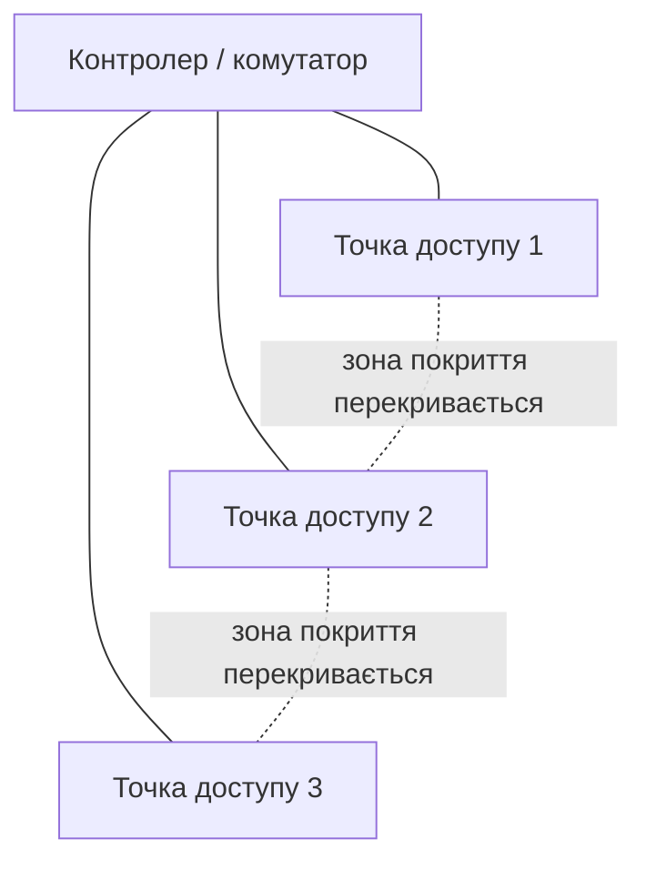

# Бездротові мережі Wi-Fi

> [!abstract]
> Wi-Fi – єдина технологія в курсі, де середовище передачі (радіоефір, лекція 2) є спільним для всіх пристроїв одразу, а не ізольованим кабелем. Розберемо еволюцію стандартів до Wi-Fi 6/6E/7, ключові технології, що дозволяють ефективно ділити спільний ефір між багатьма пристроями, практичні принципи розміщення точок доступу і, окремо, еволюцію захисту бездротових мереж від WEP до сучасного WPA3.

## Від алфавітного супу до зрозумілих назв

У лекції 2 ми домовились, що Wi-Fi використовує діапазони 2,4 ГГц, 5 ГГц і 6 ГГц, а в лекції 3 – що точка доступу є мостом між дротовою мережею й радіоефіром. Формально Wi-Fi описаний сімейством стандартів **IEEE 802.11**, і саме тут криється джерело плутанини, яка переслідувала галузь роками: кожна нова версія стандарту отримувала технічну літеру-суфікс – 802.11b, 802.11g, 802.11n, 802.11ac, 802.11ax, – і жодна з цих літер нічого не говорила пересічній людині про те, новіша це версія чи старіша, швидша чи повільніша.

Саме тому з 2018 року Wi-Fi Alliance (організація, що сертифікує обладнання на сумісність зі стандартом) почала використовувати прості порядкові номери для споживчого маркування: **Wi-Fi 4** відповідає стандарту 802.11n, **Wi-Fi 5** – 802.11ac, **Wi-Fi 6** – 802.11ax. Це не нові технології "замість" старих назв – це просто зрозуміліші ярлики для тих самих технічних стандартів, які ви й далі зустрічатимете в офіційній документації обладнання.

**Wi-Fi 6E** – не окремий новий стандарт 802.11, а розширення Wi-Fi 6 (той самий 802.11ax), яке додає роботу в новому діапазоні **6 ГГц** – літера "E" саме тут і означає "Extended". Про цей діапазон уже йшлося в лекції 2: він значно ширший за 5 ГГц, майже повністю вільний від застарілих пристроїв і сторонніх завад (адже жодне старе обладнання фізично не вміє в ньому працювати), але з іще гіршим проникненням крізь стіни через ще вищу частоту.

**Wi-Fi 7**, відповідний стандарту **802.11be**, – найновіше покоління, що додає кілька суттєвих технічних новинок понад Wi-Fi 6/6E: значно ширші канали (до 320 МГц замість максимальних 160 МГц у Wi-Fi 6), щільніше кодування сигналу (модуляція 4096-QAM замість 1024-QAM), і, мабуть, найпомітнішу практичну новинку – **багатоканальну роботу (Multi-Link Operation, MLO)**, коли один пристрій одночасно використовує кілька діапазонів (наприклад, 5 ГГц і 6 ГГц одночасно) для одного й того самого з'єднання, підвищуючи і пропускну здатність, і стійкість до тимчасових завад в одному з діапазонів.

| Назва | Стандарт IEEE | Діапазони | Ключова новинка |
|---|---|---|---|
| Wi-Fi 4 | 802.11n | 2,4 / 5 ГГц | MIMO (кілька антен) |
| Wi-Fi 5 | 802.11ac | 5 ГГц | ширші канали, MU-MIMO для завантаження |
| Wi-Fi 6 | 802.11ax | 2,4 / 5 ГГц | OFDMA, MU-MIMO в обидва боки |
| Wi-Fi 6E | 802.11ax + 6 ГГц | 2,4 / 5 / 6 ГГц | доступ до вільного діапазону 6 ГГц |
| Wi-Fi 7 | 802.11be | 2,4 / 5 / 6 ГГц | MLO, канали до 320 МГц |

## Як ефір ділять між багатьма пристроями

У лекції 2 ми відзначили ключову практичну відмінність Wi-Fi від дротової мережі: радіоефір – спільне середовище, схоже на давню топологію "шина", і чим більше активних клієнтів підключено до однієї точки доступу, тим менше реальної пропускної здатності припадає на кожного з них. Wi-Fi 6 і новіші стандарти вводять кілька технологій, спрямованих саме на пом'якшення цієї проблеми, – і розуміння їхньої логіки допоможе усвідомлено обирати обладнання й режими роботи на практиці.

**OFDMA (Orthogonal Frequency-Division Multiple Access)** – технологія, що дозволяє точці доступу ділити один канал на дрібніші частотні підресурси й обслуговувати кількох клієнтів *одночасно* в межах одного й того самого часового проміжку, замість того щоб (як у попередніх поколіннях Wi-Fi) по черзі виділяти клієнтам увесь канал цілком, по одному за раз. Практична аналогія: уявіть, що раніше точка доступу була касиром, що обслуговує покупців строго по черзі, кожного повністю, – навіть якщо покупцю потрібно купити лише жувальну гумку, він займає весь час каси, доки не завершить покупку. OFDMA перетворює цю чергу на кілька паралельних маленьких кас у межах того самого каналу, кожна з яких обслуговує невеликий запит одночасно з іншими, – це особливо помітно вигідно, коли багато пристроїв надсилають короткі, нечасті запити (типовий сценарій для IoT-датчиків чи смартфонів у режимі очікування), а не рідкісні, але великі потоки даних.

**MU-MIMO (Multi-User Multiple Input, Multiple Output)** – технологія, що використовує кілька фізичних антен точки доступу для одночасного просторового розділення сигналів кількох клієнтів – по суті, точка доступу веде кілька незалежних "радіорозмов" одночасно, спрямовуючи сигнал у різні боки за допомогою формування променя (beamforming). Важлива відмінність від OFDMA: MU-MIMO ефективний саме для великих, "важких" потоків даних (наприклад, кілька клієнтів одночасно дивляться відео високої роздільності), тоді як OFDMA ефективніший для великої кількості дрібних, коротких запитів. У Wi-Fi 5 MU-MIMO працював лише в напрямку від точки доступу до клієнтів (завантаження), у Wi-Fi 6 – в обидва боки, включно з передачею даних від клієнтів до точки доступу.

**TWT (Target Wake Time)** – механізм, за яким точка доступу й клієнтський пристрій заздалегідь домовляються про конкретні часові проміжки, коли пристрій має "прокидатись" для обміну даними, а решту часу може повністю вимикати радіомодуль і економити заряд батареї. Це особливо цінно для IoT-пристроїв на батарейках (пригадайте тренд IoT з лекції 1) – датчик температури, якому потрібно передавати показання раз на кілька хвилин, може роками працювати від однієї батарейки саме завдяки TWT, замість того щоб постійно "слухати" ефір в очікуванні можливих даних.

**BSS Coloring** – механізм, що дозволяє точкам доступу, які фізично перебувають достатньо далеко одна від одної, але випадково працюють на тому самому каналі, "помічати" свої передачі унікальним кольором (числовим ідентифікатором), щоб сусідні пристрої могли відрізнити "чужу" передачу на тому самому каналі від "своєї" і не витрачали час на очікування, коли насправді можна було б передавати одночасно, – це зменшує так звані **співканальні завади (co-channel interference)**, актуальні в щільно забудованих будівлях із багатьма точками доступу поруч.

> [!info] Для допитливих
> Усі перелічені технології Wi-Fi 6 об'єднує одна спільна ідея: замість того щоб просто "говорити швидше" (як робили попередні покоління, переважно збільшуючи ширину каналу й щільність модуляції), Wi-Fi 6 зосереджується на **ефективності спільного використання** обмеженого спектра багатьма пристроями одночасно. Це прямий наслідок реальності сучасних мереж: у типовій квартирі чи офісі сьогодні одночасно активні десятки пристроїв – смартфони, ноутбуки, розумні колонки, камери, – і проблема давно вже не "як передати один потік якнайшвидше", а "як розумно розділити обмежений спільний ресурс між багатьма одночасними учасниками".

## Канали й ширина каналу: практичний компроміс

У кожному діапазоні (2,4, 5, 6 ГГц) спектр поділений на пронумеровані **канали** – вузькі смуги частот, у межах яких відбувається передача конкретного з'єднання. У діапазоні 2,4 ГГц канали настільки близько розташовані одне до одного за частотою, що фактично не перекриваються (тобто можуть безпечно працювати одночасно поруч, не заважаючи одне одному) лише три з них – зазвичай канали 1, 6 і 11. У діапазонах 5 і особливо 6 ГГц доступно значно більше неперекривних каналів завдяки набагато ширшій смузі частот, виділеній під ці діапазони.

**Ширина каналу (channel width)** – ще один практичний параметр, що напряму впливає на компроміс "швидкість проти стійкості". Ширший канал (наприклад, 80 МГц замість стандартних 20 МГц) дозволяє передавати більше даних за одиницю часу для одного конкретного з'єднання, але водночас "з'їдає" простір, який могли б зайняти сусідні незалежні канали, – тобто в щільно заселеній мережами будівлі (багатоквартирний будинок, офісний центр із десятками окремих Wi-Fi мереж по сусідству) широкі канали радше збільшують взаємні завади між різними мережами, ніж дають реальний практичний виграш у швидкості. Саме тому в щільних міських умовах часто свідомо звужують канали на 2,4 і 5 ГГц, залишаючи максимальну ширину лише для відносно "вільного" діапазону 6 ГГц.

> [!warning] Типова помилка
> Поширена помилка при налаштуванні домашньої точки доступу – вручну вибрати найширший можливий канал "для максимальної швидкості", не враховуючи сусідні мережі багатоквартирного будинку. Результат часто протилежний очікуваному: широкий канал перекривається з кількома сусідськими мережами одразу, завади зростають, і реальна швидкість падає, попри теоретично вищу пропускну здатність каналу. У щільній міській забудові вужчий, але "чистіший" від завад канал часто дає кращу реальну продуктивність, ніж найширший теоретично можливий.

## Ідентифікація мереж і роумінг

**SSID (Service Set Identifier)** – назва бездротової мережі, яку бачить користувач у списку доступних Wi-Fi мереж (наприклад, "Office-WiFi" чи "Office-Guest"). **BSSID (Basic Service Set Identifier)** – фактично MAC-адреса конкретної точки доступу, що технічно ідентифікує кожну окрему точку доступу в мережі, навіть якщо в кількох точок доступу однаковий SSID.

Коли кілька точок доступу в одній будівлі налаштовані з однаковим SSID (щоб користувач бачив і підключався до єдиної мережі, а не перемикав Wi-Fi вручну, переходячи з кімнати в кімнату), таку сукупність називають **ESS (Extended Service Set)**. Саме завдяки ESS клієнтський пристрій може непомітно "переходити" від однієї точки доступу до сусідньої, коли сигнал першої слабшає, а другої – посилюється, – процес, що називається **роумінгом**. Якісний роумінг вимагає ретельного планування розташування точок доступу (щоб зони покриття сусідніх точок доступу трохи перекривались, без розривів) і, в ідеалі, підтримки протоколів швидкого роумінгу (802.11r та подібних), що скорочують час на повторну автентифікацію при переході між точками – інакше користувач відчує коротке "підвисання" з'єднання щоразу, коли пристрій перемикається між точками доступу.

## Практика розміщення точок доступу

Проєктування бездротового покриття будівлі – це завжди балансування двох різних, часто суперечливих цілей. **Покриття (coverage)** – забезпечити, щоб сигнал сягав кожного кутка приміщення з достатньою потужністю. **Ємність (capacity)** – забезпечити, щоб у зонах із великою кількістю одночасних користувачів (велика аудиторія, конференц-зал, читальна зала бібліотеки) кожен пристрій отримував достатню частку пропускної здатності, навіть коли активні десятки клієнтів одночасно.

Проєкт, орієнтований виключно на покриття, часто ставить мінімальну кількість потужних точок доступу, розрахованих на максимальну дальність сигналу, – і в результаті в переповненій аудиторії всі 100 студентів "борються" за один і той самий спільний ефір однієї точки доступу, попри формально "хороший" сигнал у кожного. Проєкт, орієнтований на ємність, ставить більше точок доступу з навмисно зниженою потужністю передавача кожної – так, щоб кожна точка доступу обслуговувала менше клієнтів одночасно, а зони покриття сусідніх точок доступу акуратно межували одна з одною, не створюючи надмірного перекриття (яке саме собою теж стає джерелом співканальних завад, про які йшлося вище стосовно BSS Coloring). У сучасному проєктуванні мереж коледжів, офісів і будь-яких просторів із високою щільністю користувачів саме підхід, орієнтований на ємність, зазвичай практичніший.

> [!example] Приклад
> Дві однаково великі аудиторії коледжу: у першій встановлено одну потужну точку доступу в центрі стелі, у другій – три точки доступу зі зниженою потужністю, розставлені по периметру. У першій аудиторії під час лекції, коли 60 студентів одночасно підключені й активно користуються мережею, кожен студент реально отримує лише невелику частку від і без того обмеженого ефіру однієї точки доступу. У другій аудиторії ті самі 60 студентів розподіляються по трьох точках доступу, приблизно по 20 на кожну, і кожна група з 20 має значно більше реальної пропускної здатності, ніж уся сотня в першому сценарії.

## Безпека бездротових мереж: від WEP до WPA3

Оскільки радіосигнал, на відміну від сигналу в кабелі, фізично доступний будь-кому в зоні досяжності (пригадайте цю тезу з лекції 2 про принципову різницю дротового й бездротового середовища), шифрування бездротового трафіку – не опціональна функція, а обов'язкова умова безпечної роботи мережі. Історія протоколів захисту Wi-Fi – це історія послідовного виправлення все серйозніших вразливостей попередніх версій.

**WEP (Wired Equivalent Privacy)** – найперший протокол захисту Wi-Fi, розроблений ще в 1990-х. Сьогодні WEP становить виключно історичний інтерес: у ньому виявили настільки фундаментальні криптографічні недоліки, що ключ шифрування можна відновити буквально за кілька хвилин перехопленого трафіку за допомогою загальнодоступних інструментів. Жодна сучасна мережа не повинна використовувати WEP – якщо ви побачите обладнання, що досі його підтримує (а деяке дуже старе обладнання досі так і робить, для сумісності), правильна практична дія – переконатися, що WEP явно вимкнений і не використовується.

**WPA (Wi-Fi Protected Access)** – перехідний протокол, введений як швидке тимчасове виправлення найгостріших вразливостей WEP, використовуючи протокол шифрування TKIP. WPA теж давно вважається застарілим і не рекомендованим до використання.

**WPA2** – довгий час галузевий стандарт, що використовує значно надійніший алгоритм шифрування **AES** у режимі **CCMP**. WPA2 у персональному режимі (**WPA2-PSK**, Pre-Shared Key) використовує єдиний спільний пароль для всієї мережі, який вводить кожен новий клієнт, – саме такий режим ви бачите вдома чи в невеликому офісі. Проте WPA2-PSK має відому практичну вразливість: під час підключення нового клієнта відбувається обмін службовими повідомленнями, так званий **чотиристоронній рукостискання (4-way handshake)**, який зловмисник може перехопити пасивно, навіть не намагаючись підключитись самостійно, а потім спробувати **офлайн-атаку методом підбору (offline dictionary attack)** – перебираючи можливі паролі на власному обладнанні, не взаємодіючи більше з мережею взагалі і, відповідно, залишаючись непоміченим. Якщо пароль мережі недостатньо складний, така атака рано чи пізно успішна.

**WPA3** – сучасний стандарт, що вирішує саме цю проблему офлайн-перебору завдяки новому механізму встановлення з'єднання – **SAE (Simultaneous Authentication of Equals)**, також відомому як "рукостискання Dragonfly". На відміну від WPA2, де перехопленого рукостискання достатньо для офлайн-перебору пароля, SAE побудований так, що кожна спроба підбору пароля вимагає *активної* інтерактивної взаємодії з реальною точкою доступу – зловмисник фізично не може просто "забрати перехоплені дані додому" й перебирати варіанти на потужному обладнанні в комфортному темпі; кожна спроба обов'язково лишає слід активної взаємодії з мережею, яку легше виявити й заблокувати. Додатково WPA3 забезпечує **прямy секретність (forward secrecy)**: навіть якщо пароль мережі згодом якимось чином стане відомий зловмиснику, раніше перехоплений і збережений трафік усе одно неможливо розшифрувати заднім числом, бо ключі шифрування для кожного сеансу генеруються унікально й не виводяться напряму із самого пароля так, як у WPA2.

Окрім персонального режиму, WPA3 (як і WPA2 раніше) має **корпоративний режим (WPA3-Enterprise)**, що замість єдиного спільного пароля для всіх використовує індивідуальну автентифікацію кожного користувача через централізований сервер – з опцією посиленого 192-бітного режиму безпеки для особливо вимогливих середовищ. Технічна основа корпоративного режиму – протокол **802.1X** і сервер **RADIUS**, механіку яких ми детально розберемо, коли дійдемо до автентифікації в мережі підприємства в лекції 34; поки що достатньо запам'ятати сам факт існування цього режиму й розуміти, чим він принципово відрізняється від "домашнього" підходу з єдиним паролем на всіх.

Ще одне нововведення сучасного Wi-Fi – **Wi-Fi Enhanced Open**, що використовує технологію **OWE (Opportunistic Wireless Encryption)** для відкритих мереж без пароля (наприклад, у кафе чи в аеропорту): на відміну від традиційної повністю незашифрованої відкритої мережі, де будь-який сторонній спостерігач у зоні досяжності може перехопити чужий трафік буквально без жодних зусиль, OWE шифрує з'єднання кожного клієнта окремим унікальним ключем, навіть попри те що жодного пароля користувач не вводить, – це не робить мережу настільки ж захищеною, як мережа з паролем WPA3, але значно ускладнює пасивне прослуховування чужого трафіку сторонніми спостерігачами в тій самій відкритій мережі.

> [!warning] Типова помилка
> Поширена хибна думка – "у відкритій гостьовій мережі без пароля безпека взагалі неможлива, тож і думати про це не варто". По-перше, це вже не зовсім так завдяки Wi-Fi Enhanced Open, описаному вище. По-друге, і що важливіше практично: правильний захист гостьової мережі забезпечується не так шифруванням самого радіоканалу, як **сегментацією** – виносом гостьового Wi-Fi в окремий VLAN, ізольований від внутрішньої мережі підприємства, про що йшлося ще в лекції 1 стосовно тренду IoT і в лекції 6 стосовно VLAN загалом. Навіть ідеально захищений відкритий Wi-Fi не повинен мати прямого мережевого доступу до внутрішніх серверів компанії – це питання архітектури мережі, а не лише криптографії самого радіоканалу.

## Зведемо разом

Ця лекція завершує наш огляд основних технологій локальної мережі – Ethernet (лекція 5), комутація й VLAN (лекція 6), надійність і QoS (лекція 7), і тепер бездротовий доступ. Зверніть увагу, наскільки вони переплетені: точка доступу з лекції 3 підключається до мережі саме через Ethernet-порт, часто через транковий порт з окремим VLAN для гостьового доступу (лекція 6), і саме до бездротового трафіку особливо часто застосовують пріоритизацію QoS (лекція 7), бо голосовий і відеотрафік через Wi-Fi найчутливіші до затримки й джитера серед усього, з чим ви працюватимете в мережі підприємства.

> [!exam] На іспиті
> Типові питання: а) назвати відповідність між назвами Wi-Fi 4/5/6/6E/7 і стандартами IEEE 802.11; б) пояснити різницю між OFDMA і MU-MIMO та для яких сценаріїв ефективніший кожен; в) пояснити компроміс ширини каналу між швидкістю й завадостійкістю в щільній забудові; г) описати еволюцію протоколів захисту від WEP до WPA3 і пояснити, чому WPA3-SAE стійкіший до офлайн-перебору пароля, ніж WPA2-PSK.

## Завдання на занятті (20 хв)

1. Аудиторія коледжу на 50 місць, заплановано практичне заняття з ноутбуками, де кожен студент активно завантажує великі файли одночасно. Обґрунтуйте: одна потужна точка доступу чи кілька точок зі зниженою потужністю – і чому саме такий вибір відповідає вимозі "ємність" радше, ніж "покриття"?
2. У парі поясніть одне одному словами, чому перехоплення 4-way handshake у WPA2-PSK дозволяє офлайн-перебір пароля, а SAE у WPA3 – ні.
3. Запропонуйте архітектуру бездротової мережі коледжу з трьома SSID: для студентів, для викладачів, для гостей, – вказавши для кожної, чи потрібен окремий VLAN і чому.
4. Обговоріть: чому в багатоквартирному будинку з десятками сусідніх Wi-Fi мереж власноруч вибраний "найширший можливий канал" на 5 ГГц часто дає гіршу реальну швидкість, ніж стандартна автоматична ширина каналу?

> [!question] Перевірте себе
> 1. Чим Wi-Fi 6E відрізняється від звичайного Wi-Fi 6 – це новий стандарт IEEE чи розширення наявного?
> 2. Поясніть різницю між OFDMA і MU-MIMO своїми словами, навівши приклад сценарію для кожної технології.
> 3. Що таке BSSID і чим він відрізняється від SSID?
> 4. Чому WPA3-SAE вважається стійкішим до офлайн-атак підбору пароля, ніж WPA2-PSK?
> 5. Чому захист гостьової мережі не зводиться лише до вибору протоколу шифрування Wi-Fi, а обов'язково включає сегментацію VLAN?

## Назад
← [[courses/computer-networks/lectures/07-stp-ahrehatsiia-kanaliv-ta-qos|Лекція 7. STP, агрегація каналів та QoS]]

## Далі
→ [[courses/computer-networks/lectures/09-stek-tcp-ip-protokoly-ip-ta-icmp|Лекція 9. Стек TCP-IP, протоколи IP та ICMP]]

## Література
- Cisco Networking Academy. *Switching, Routing, and Wireless Essentials* (курс CCNA v7/v7.1) – розділ про бездротові мережі.
- Wi-Fi Alliance. Офіційна документація Wi-Fi 6, Wi-Fi 6E, Wi-Fi 7 та WPA3.
- IEEE 802.11ax, 802.11be Standards.
