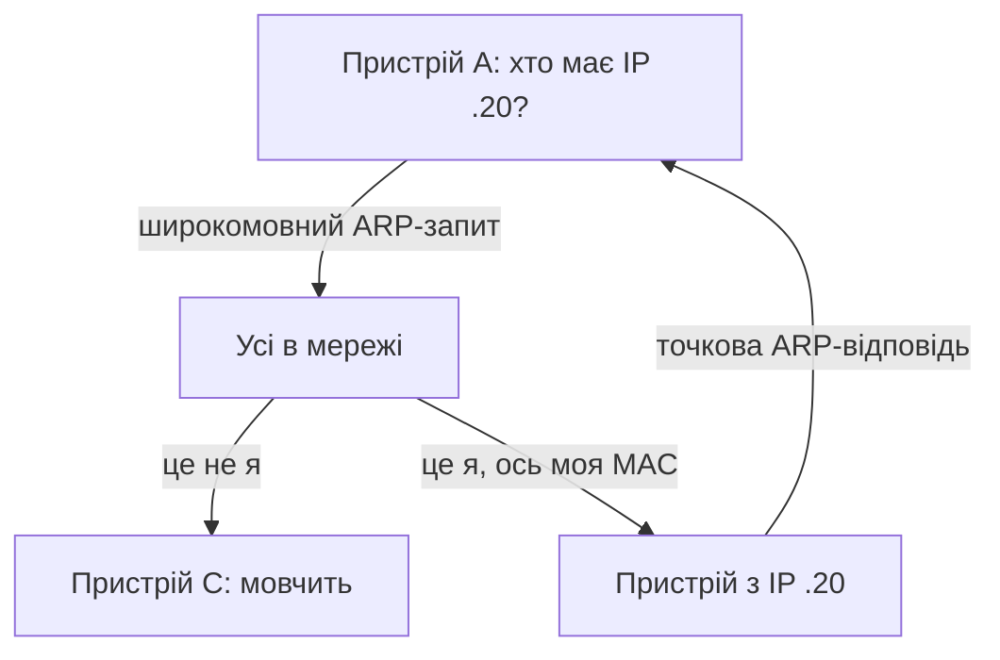

# Стек TCP/IP: протоколи IP та ICMP

> [!abstract]
> Переходимо з канального рівня на мережевий – рівень, на якому працює маршрутизатор, ухвалюючи рішення на основі IP-адреси. Розберемо структуру заголовка IP-пакета, протокол ARP, що зв'язує мережевий і канальний рівні, механізм фрагментації, і протокол ICMP, на якому побудовані звичні всім утиліти ping і traceroute.

## Заголовок IP-пакета: службова інформація, що супроводжує кожен пакет

У лекціях 3 і 4 ми домовились: маршрутизатор ухвалює рішення про пересилання на основі IP-адреси одержувача, а пакет – це PDU мережевого рівня, що виникає, коли до сегмента транспортного рівня додається заголовок IP. Настав час розглянути цей заголовок детально – не заради запам'ятовування кожного біта, а тому, що кілька конкретних полів у ньому напряму пояснюють поведінку мережі, яку ви спостерігатимете на практиці протягом усього курсу.

**Версія (Version)** – вказує, IPv4 це чи IPv6 (детально другий варіант розглянемо в лекції 12; ця лекція зосереджена на IPv4, наразі й досі домінантній версії протоколу в переважній більшості мереж).

**IP-адреса відправника** і **IP-адреса одержувача** – по 32 біти кожна в IPv4, записуються у звичному вигляді чотирьох чисел через крапку (наприклад, 192.168.1.10). Детальний розгляд того, як ці 32 біти діляться на частину мережі й частину вузла, і як із них будуються підмережі, – тема наступної лекції; тут важливо зафіксувати сам факт: саме ці два поля читає маршрутизатор, коли звіряється зі своєю таблицею маршрутизації.

**TTL (Time To Live)** – одне з найважливіших полів для практичного розуміння того, як мандрує пакет мережею. Це число, яке відправник встановлює на старті (типове початкове значення – 64 чи 128, залежно від операційної системи), і кожен маршрутизатор, через який проходить пакет, зменшує це число рівно на одиницю. Якщо TTL досягає нуля, маршрутизатор, замість того щоб переслати пакет далі, відкидає його – і, як побачимо нижче в розділі про ICMP, надсилає відправнику повідомлення про це. Мета цього поля – суто захисна: якщо в мережі раптом виникла петля маршрутизації (помилка конфігурації, за якої два маршрутизатори по колу пересилають той самий пакет один одному), TTL гарантує, що такий "заблукалий" пакет рано чи пізно зникне з мережі, а не циркулюватиме нескінченно, поглинаючи пропускну здатність, – своєрідний захисний аналог того, чим STP є для канального рівня (лекція 7), тільки для мережевого.

**Протокол (Protocol)** – числове поле, що вказує, який протокол транспортного рівня "вкладений" усередину цього пакета: значення 6 означає TCP, 17 – UDP, 1 – сам ICMP, про який іде мова нижче. Це поле – практичне продовження того самого принципу інкапсуляції з лекції 4: щойно приймач отримує пакет, саме за цим полем він розуміє, кому з вищих рівнів передати вміст далі.

**Контрольна сума заголовка (Header Checksum)** – перевіряє цілісність саме заголовка IP (не всього пакета – за цілісність даних відповідають окремі механізми на інших рівнях), і, оскільки значення TTL змінюється на кожному маршрутизаторі, контрольну суму доводиться перераховувати заново на кожному стрибку – невелика, але постійна обчислювальна робота, яку виконує кожен маршрутизатор для кожного пакета.

**Прапорці й зміщення фрагмента (Flags, Fragment Offset)** – поля, що стосуються фрагментації, детально розглянутої нижче.

> [!definition] Визначення
> **TTL (Time To Live)** – поле заголовка IP, що обмежує максимальну кількість маршрутизаторів (стрибків), через які може пройти пакет, перш ніж буде відкинутий, – захист від нескінченного циркулювання пакета в разі петлі маршрутизації.

## ARP: місток між IP-адресою і MAC-адресою

У лекції 6 ми навели приклад широкомовного запиту, яким пристрій "запитує мережу", хто відповідає за певну IP-адресу, і пообіцяли розглянути цей механізм детально саме тут. Настав час виконати цю обіцянку.

Проблема, яку розв'язує **ARP (Address Resolution Protocol)**, виникає з фундаментальної відмінності двох рівнів, які ми вже добре знаємо. Мережевий рівень оперує IP-адресами – саме за ними маршрутизатор і кінцевий пристрій вирішують, куди логічно спрямувати дані. Але щоб фізично надіслати кадр, канальному рівню потрібна **MAC-адреса** одержувача (пригадайте структуру кадру Ethernet із лекції 5) – а звідки взяти MAC-адресу, якщо ви знаєте лише IP-адресу сусіда в тій самій локальній мережі?

Саме на це запитання відповідає ARP: коли пристрою потрібно надіслати дані іншому пристрою в тій самій локальній мережі, а MAC-адреса цього пристрою ще невідома, він надсилає широкомовний **ARP-запит (ARP Request)** – по суті, повідомлення на кшталт "хто в цій мережі має IP-адресу 192.168.1.20? Повідом мені свою MAC-адресу", – і саме цей широкомовний кадр отримають усі пристрої в межах домену трансляції (лекція 6), хоча відповість лише той один, чия IP-адреса справді збігається із запитуваною, надіславши вже не широкомовну, а точкову **ARP-відповідь (ARP Reply)** зі своєю MAC-адресою.

Щоб не робити такий запит для кожного окремого пакета (це було б марнотратно – надсилати широкомовний запит перед буквально кожним переданим байтом), кожен пристрій зберігає отримані відповіді в локальному кеші, який називається **ARP-таблицею**, з обмеженим часом життя запису – за принципом, дуже схожим на старіння записів у таблиці MAC-адрес комутатора з лекції 6. Наступного разу, коли потрібно звернутись до того самого IP-сусіда, пристрій спочатку перевіряє ARP-таблицю і, якщо запис ще актуальний, використовує вже відому MAC-адресу без нового запиту.

> [!example] Приклад
> Коли ваш комп'ютер хоче звернутись до сервера в інтернеті, він насправді не робить ARP-запит для IP-адреси самого віддаленого сервера – той перебуває в зовсім іншій мережі, і, як ми з'ясуємо в наступному розділі, дані до нього прямують не напряму, а через маршрутизатор. Натомість комп'ютер робить ARP-запит для IP-адреси *свого локального маршрутизатора* (шлюзу за замовчуванням), дізнається його MAC-адресу і надсилає кадр саме на цю MAC-адресу – а вже IP-адреса всередині пакета вказує на справжнього, віддаленого одержувача. Саме тому в структурі кадру, коли ми говорили про приклад інкапсуляції в лекції 4, MAC-адреса призначення – це адреса найближчого маршрутизатора, а не кінцевого сервера, тоді як IP-адреса призначення в тому самому пакеті – це вже адреса самого сервера.

## Фрагментація: коли пакет не влазить у кадр

У лекції 5 ми ввели поняття MTU (Maximum Transmission Unit) канального рівня – стандартні 1500 байтів для Ethernet. Що станеться, якщо IP-пакет, який потрібно передати цією ділянкою мережі, більший за MTU цієї ділянки? Саме для цього сценарію і призначена **фрагментація (fragmentation)**: маршрутизатор ділить завеликий пакет на кілька менших фрагментів, кожен зі своїм власним заголовком IP, які потім самостійно мандрують мережею і повторно збираються в єдиний пакет лише на кінцевому пристрої-одержувачі.

Саме для цього процесу й потрібні поля **Flags** і **Fragment Offset** у заголовку IP, згадані вище: прапорець **DF (Don't Fragment)** дозволяє відправнику явно заборонити фрагментацію цього конкретного пакета (якщо пакет із таким прапорцем усе одно не влазить у MTU наступної ділянки шляху, маршрутизатор не фрагментує його, а просто відкидає й повідомляє про це відправника – знову ж таки через ICMP, про яке нижче), а зміщення фрагмента (Fragment Offset) вказує, якому саме місцю у вихідному пакеті відповідає даний конкретний фрагмент, щоб одержувач міг правильно зібрати їх усі назад у початковому порядку.

Фрагментація технічно розв'язує проблему, але на практиці вважається небажаною й у сучасних мережах її намагаються уникати: вона додає накладні витрати (кожен фрагмент несе власний повний заголовок IP), а якщо хоча б один фрагмент загубиться дорогою, доводиться повторно передавати весь вихідний пакет цілком, а не лише загублений фрагмент. Тому сучасні операційні системи здебільшого користуються технікою **Path MTU Discovery**: відправник спочатку надсилає пакети з прапорцем DF і, якщо якийсь маршрутизатор на шляху не може передати пакет через замалий MTU своєї ділянки, отримує від нього повідомлення ICMP про це, дізнається реальний максимальний розмір, який можна передати без фрагментації на цьому шляху, і надалі формує пакети саме такого розміру від самого початку, уникаючи фрагментації взагалі.

> [!warning] Типова помилка
> Часто плутають фрагментацію IP-пакетів мережевого рівня із сегментацією даних на транспортному рівні (яку розглянемо в наступній лекції для TCP). Це різні механізми на різних рівнях: сегментація TCP – це свідомий, керований процес розбиття потоку даних застосунку на порції ще до того, як вони взагалі стали пакетами, тоді як фрагментація IP – це вимушена, реактивна дія, що відбувається вже "по дорозі", коли конкретна ділянка мережі фізично не може пропустити пакет такого розміру, яким його сформували вище.

## ICMP: протокол діагностики й повідомлень про помилки

**ICMP (Internet Control Message Protocol)** – принципово інший за своєю природою протокол порівняно з IP: він не призначений для передачі корисних даних застосунків (жоден вебсайт чи відео не передається через ICMP), а існує виключно для діагностики мережі й повідомлення про помилки на мережевому рівні. Пригадайте: у полі "Протокол" заголовка IP значення 1 позначає саме ICMP – тобто повідомлення ICMP самі "їдуть" усередині звичайних IP-пакетів, просто з особливим типом вмісту.

> [!definition] Визначення
> **ICMP** – допоміжний протокол мережевого рівня, що використовується для діагностики мережі та повідомлення про помилки доставки IP-пакетів, а не для передачі даних застосунків.

Розглянемо кілька найважливіших типів повідомлень ICMP, з якими ви працюватимете практично щотижня протягом усього курсу.

**Echo Request / Echo Reply** – саме на цій парі повідомлень побудована знайома всім утиліта **ping**. Відправник надсилає ICMP Echo Request на цільову IP-адресу; якщо пристрій з такою адресою існує й доступний, він відповідає ICMP Echo Reply. Вимірюючи час між відправленням запиту й отриманням відповіді, ping дає найпростішу, але надзвичайно практичну оцінку двох речей одразу: чи взагалі є зв'язність між двома вузлами мережі, і яка приблизна затримка (пригадайте це поняття з лекції 1) між ними.

**Destination Unreachable** – повідомлення, яке маршрутизатор (або кінцевий вузол) надсилає у відповідь, коли не може доставити пакет за призначенням із тієї чи іншої причини – наприклад, коли в таблиці маршрутизації просто немає жодного маршруту до потрібної мережі.

**Time Exceeded** – те саме повідомлення, про яке йшлося вище стосовно TTL: коли значення TTL пакета досягає нуля, маршрутизатор, що це виявив, відкидає пакет і надсилає відправнику саме таке повідомлення ICMP.

Саме на комбінації TTL і повідомлення Time Exceeded побудована ще одна знайома утиліта – **traceroute** (у Windows – `tracert`). Ідея елегантна: відправник свідомо надсилає серію пакетів із заздалегідь навмисно заниженим TTL, починаючи з 1. Перший пакет із TTL=1 гарантовано "помре" вже на найпершому маршрутизаторі по дорозі (той зменшить TTL до нуля й надішле Time Exceeded) – так відправник дізнається адресу першого стрибка. Другий пакет надсилається з TTL=2 – він переживе перший маршрутизатор, але "помре" на другому, розкриваючи адресу вже другого стрибка. І так далі, поступово збільшуючи TTL на одиницю, доки пакет нарешті не досягне справжнього кінцевого одержувача. У результаті traceroute поступово "вимальовує" повний список усіх маршрутизаторів на шляху від вас до цільового сервера – потужний діагностичний інструмент, до якого ми ще не раз повернемось у модулі 6, коли говоритимемо про методику усунення несправностей.

> [!example] Приклад
> Уявіть, що ви запускаєте traceroute до сервера й бачите на екрані послідовний список IP-адрес з часом відповіді для кожної: перший рядок – ваш домашній роутер, другий – обладнання вашого провайдера, третій – уже магістральний маршрутизатор, і так далі, доки не з'явиться сам сервер. Якщо на певному кроці час відповіді різко зростає або рядки взагалі перестають з'являтись (позначаються зірочками), це точно вказує, на якій саме ділянці шляху виникає проблема, – набагато точніша діагностика, ніж один голий "не працює" від звичайного ping.

> [!info] Для допитливих
> Деякі мережеві адміністратори свідомо блокують ICMP на своїх межових пристроях (міжмережевих екранах) із безпекових міркувань – щоб ускладнити зовнішнім атакуючим "промацування" структури внутрішньої мережі через traceroute чи навіть просто перевірку, які IP-адреси в мережі "живі", через ping. Це має і зворотний бік: якщо ICMP заблокований посередині шляху, звичайний ping чи traceroute показуватиме хибну картину "недоступності", хоча реальний застосунок (наприклад, вебсайт через HTTP) при цьому працює абсолютно нормально, – ще одна причина, чому досвідчений мережевий інженер ніколи не покладається лише на результат ping як на остаточний доказ "мережа не працює".

## Як усе це складається докупи в дорозі одного пакета

Простежимо повний шлях, спираючись на все, що ми розглянули дотепер у цій і попередніх лекціях. Ваш комп'ютер хоче звернутись до сервера в іншій мережі. Спочатку він визначає (за допомогою механізму, детальніше розглянутого в наступній лекції про адресацію), що сервер перебуває поза межами локальної мережі, а отже, пакет потрібно надіслати через шлюз за замовчуванням – локальний маршрутизатор. Якщо MAC-адреса цього маршрутизатора ще невідома, спочатку відбувається ARP-запит, описаний вище. Отримавши MAC-адресу маршрутизатора, комп'ютер формує кадр Ethernet (лекція 5) із MAC-адресою маршрутизатора як призначенням, усередині якого – IP-пакет (сьогоднішня лекція) з реальною IP-адресою сервера як призначенням. Кожен маршрутизатор на шляху зменшує TTL на одиницю, перевіряє MTU наступної ділянки (за потреби фрагментуючи пакет чи повідомляючи про потребу зменшити розмір), і, якщо щось іде не так – TTL вичерпався, маршруту немає, – генерує відповідне повідомлення ICMP і надсилає його назад відправнику.

> [!exam] На іспиті
> Типові питання: а) пояснити призначення поля TTL і механізм його дії; б) описати повний процес роботи ARP, включно з тим, чому запит широкомовний, а відповідь – ні; в) пояснити, чим фрагментація IP-пакета відрізняється від сегментації на транспортному рівні; г) пояснити принцип роботи traceroute на основі TTL і повідомлення ICMP Time Exceeded.

## Завдання на занятті (20 хв)

1. Намалюйте (текстом або схемою) послідовність дій, які відбуваються, коли комп'ютер А в локальній мережі вперше хоче надіслати дані комп'ютеру Б у тій самій мережі, MAC-адреса якого ще невідома, – від ARP-запиту до фактичної відправки кадру.
2. У парі поясніть одне одному, чому TTL – це захист саме від петлі маршрутизації, а не, наприклад, від втрати пакета через пошкодження сигналу.
3. Змоделюйте вручну (на папері) роботу traceroute для маршруту з чотирьох маршрутизаторів: розпишіть, яке значення TTL має кожен послідовно надісланий пакет і які саме маршрутизатори "відповідатимуть" на кожному кроці.
4. Обговоріть: чому мережевий адміністратор може свідомо заблокувати ICMP на межі своєї мережі, і які практичні незручності це створює для легітимної діагностики?

> [!question] Перевірте себе
> 1. Що таке TTL і яку конкретну проблему мережі це поле запобігає?
> 2. Опишіть покроково, як працює ARP, і поясніть, чому запит широкомовний.
> 3. Чим фрагментація IP-пакета відрізняється від сегментації на транспортному рівні?
> 4. На яких двох повідомленнях ICMP побудована утиліта ping, і на якому механізмі (полі заголовка IP і типі повідомлення ICMP) побудована утиліта traceroute?
> 5. Чому MAC-адреса призначення в кадрі, що прямує до віддаленого сервера в іншій мережі, – це адреса локального маршрутизатора, а не самого сервера?

## Назад
← [[courses/computer-networks/lectures/08-bezdrotovi-merezhi-wi-fi|Лекція 8. Бездротові мережі Wi-Fi]]

## Далі
→ [[courses/computer-networks/lectures/10-transportnyi-riven-tcp-i-udp|Лекція 10. Транспортний рівень TCP і UDP]]

## Література
- Cisco Networking Academy. *Introduction to Networks* (курс CCNA v7/v7.1) – розділи про мережевий рівень, ARP та ICMP.
- RFC 791 (Internet Protocol), RFC 792 (Internet Control Message Protocol), RFC 826 (Address Resolution Protocol).
- Tanenbaum A., Wetherall D. *Computer Networks*, 5th edition – розділ 5, "The Network Layer".
