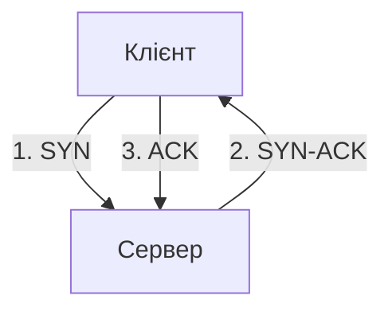

# Транспортний рівень: TCP і UDP

> [!abstract]
> IP-адреса доставляє дані до потрібного пристрою, але на пристрої одночасно працює десятки застосунків – браузер, поштовий клієнт, відеодзвінок. Транспортний рівень вирішує, який саме застосунок повинен отримати дані, за допомогою номерів портів, і пропонує два принципово різні підходи до самої доставки – надійний TCP і швидкий, без гарантій UDP.

## Порти: як кілька застосунків ділять одну IP-адресу

У лекції 9 ми простежили, як IP-пакет доставляється від одного пристрою до іншого. Але доставка до пристрою – це ще не кінець шляху: на вашому комп'ютері одночасно можуть бути відкриті браузер із кількома вкладками, поштовий клієнт, месенджер і застосунок для відеодзвінків – і кожен із них одночасно обмінюється даними мережею, використовуючи ту саму єдину IP-адресу комп'ютера. Як операційна система розуміє, які саме вхідні дані призначені браузеру, а які – поштовому клієнту?

Відповідь – **номер порту**: 16-бітне число (у діапазоні від 0 до 65535), що вказує, якому конкретно застосунку чи службі на пристрої призначені дані. Комбінація IP-адреси й номера порту називається **сокетом (socket)** і однозначно ідентифікує конкретне з'єднання конкретного застосунку – саме тому одна IP-адреса дозволяє одночасно вести сотні незалежних розмов, кожна зі своєю унікальною комбінацією портів.

Порти прийнято ділити на три діапазони. **Добре відомі порти (well-known ports)**, від 0 до 1023, зарезервовані за стандартними, всюдисущими службами: порт 80 – незашифрований HTTP, порт 443 – захищений HTTPS (той самий порт, що вже згадувався в прикладі лекції 9), порт 53 – DNS, порт 22 – SSH. **Зареєстровані порти (registered ports)**, від 1024 до 49151, офіційно закріплені за конкретними застосунками через процедуру реєстрації, хоча й менш "залізобетонно" стандартизовані, ніж добре відомі. **Динамічні, або ефемерні, порти (dynamic/ephemeral ports)**, від 49152 до 65535, операційна система тимчасово виділяє автоматично для клієнтської сторони кожного нового з'єднання – саме такий випадковий порт ваш браузер використовує як "порт відправника", коли звертається до вебсервера на його стандартному 443-му порту.

> [!example] Приклад
> Коли ви одночасно відкриваєте два різні сайти в двох вкладках браузера, обидва з'єднання йдуть з тієї самої IP-адреси вашого комп'ютера й до того самого порту 443 на серверах (хоча самі сервери, звісно, різні, з різними IP-адресами) – але операційна система виділяє кожній вкладці власний унікальний ефемерний порт відправника (наприклад, 51234 для першої вкладки й 51235 для другої), тож коли відповідь повертається, комп'ютер точно знає, якій саме вкладці її передати, навіть попри те що обидва з'єднання формально йдуть "з того самого браузера".

## UDP: простота й швидкість без гарантій

**UDP (User Datagram Protocol)** – найпростіший можливий транспортний протокол: він додає до даних лише мінімальний заголовок (порт відправника, порт одержувача, довжина, контрольна сума) і одразу передає результат на мережевий рівень, не встановлюючи жодного попереднього з'єднання і не гарантуючи, що дані взагалі дійдуть до одержувача.

> [!definition] Визначення
> **UDP** – транспортний протокол без встановлення з'єднання, що не гарантує доставку, порядок чи відсутність дублювання даних, натомість забезпечує мінімальні накладні витрати й затримку.

Це може здатись недоліком – і в певному сенсі так і є, – але саме ця "необтяженість" гарантіями робить UDP ідеальним вибором для сценаріїв, де швидкість і низька затримка важливіші за абсолютну надійність кожного окремого біта даних. Пригадайте з лекції 1 поняття джитера – коливання затримки, критичного для голосу й відео: якщо один пакет голосового потоку загубився дорогою, набагато краще просто пропустити цю крихітну частку секунди звуку (людське вухо цього майже не помітить) і продовжити відтворення наступних пакетів у реальному часі, ніж чекати, поки загублений пакет буде виявлено, запитано повторно й доставлено, – а саме такою була б поведінка TCP, розглянутого нижче. Саме тому голосові дзвінки, потокове відео в реальному часі, онлайн-ігри і DNS-запити (короткі, часті, де простіше повторити весь запит заново, ніж керувати складним станом з'єднання) традиційно будуються на UDP.

## TCP: надійність ціною складності

**TCP (Transmission Control Protocol)** підходить до тієї самої задачі транспортування даних із протилежної філософії: він гарантує, що дані дійдуть до одержувача повністю, у правильному порядку і без дублювання, – а якщо якась частина даних загубилась дорогою, TCP автоматично визначить це і повторно передасть саме загублену частину. Ця надійність не дається безкоштовно – вона вимагає попереднього встановлення з'єднання, постійного відстеження стану цього з'єднання й додаткового обміну службовими підтвердженнями, що й пояснює, чому заголовок TCP значно складніший і важчий за заголовок UDP.

> [!definition] Визначення
> **TCP** – транспортний протокол, орієнтований на з'єднання, що гарантує надійну, впорядковану доставку даних за допомогою нумерації байтів, підтверджень отримання і повторної передачі втрачених сегментів.

### Встановлення з'єднання: потрійне рукостискання

Перш ніж TCP передасть хоч один байт корисних даних, дві сторони повинні узгодити параметри майбутнього з'єднання – цей процес називається **потрійним рукостисканням (three-way handshake)** і складається з трьох послідовних кроків.

**Крок 1 – SYN.** Клієнт, що ініціює з'єднання, надсилає серверу спеціальний сегмент із встановленим прапорцем **SYN (synchronize)**, у якому вказує початковий номер послідовності – випадкове число, з якого клієнт розпочинатиме нумерацію байтів даних, які надсилатиме в цьому з'єднанні.

**Крок 2 – SYN-ACK.** Сервер, отримавши запит, відповідає сегментом одразу з двома прапорцями: **SYN** (сервер, у свою чергу, повідомляє *свій власний* початковий номер послідовності для даних, які надсилатиме він) і **ACK (acknowledge)**, що підтверджує отримання клієнтського SYN.

**Крок 3 – ACK.** Клієнт підтверджує отримання серверного SYN, надсилаючи сегмент із прапорцем ACK. Після цього кроку з'єднання вважається повністю встановленим, і обидві сторони можуть починати обмін реальними даними застосунку.

> [!info] Для допитливих
> Саме потрійне рукостискання – причина, чому TCP-з'єднання завжди має додаткову затримку перед першим переданим байтом корисних даних порівняно з UDP, де дані можна надсилати негайно, без жодних попередніх кроків. Для одиничного короткого запиту (наприклад, простого DNS-запиту) ця різниця відчутна, і саме тому DNS історично будувався на UDP; але для тривалого з'єднання, яким передаються мегабайти чи гігабайти даних, витрати одного рукостискання на самому початку стають зовсім незначними порівняно із загальним часом передачі.

### Надійність: нумерація байтів і підтвердження

Ключова ідея, на якій тримається вся надійність TCP, – **нумерація послідовності (sequence numbers)**: кожен байт даних, які передає TCP-з'єднання, отримує свій унікальний порядковий номер. Коли одержувач успішно отримує сегмент даних, він надсилає у відповідь підтвердження (ACK) із номером, що вказує наступний байт, якого він очікує отримати, – по суті, повідомляючи відправника: "я отримав усе аж до цього номера включно, продовжуй звідси".

Якщо відправник не отримує підтвердження очікуваного сегмента протягом певного часу (що зазвичай означає: або сам сегмент даних загубився дорогою, або загубилось підтвердження на зворотному шляху), він автоматично повторно надсилає ці дані – це називається **повторною передачею (retransmission)**. Саме завдяки такому механізму TCP може гарантувати повну доставку даних навіть мережею, у якій окремі пакети регулярно губляться, – на відміну від UDP, де загублені дані просто зникають без жодної спроби їх відновити.

Другий важливий елемент надійності – це впорядкованість: оскільки IP-пакети (лекція 9) можуть у принципі прибувати до одержувача не в тому порядку, у якому їх надіслали (наприклад, якщо різні пакети того самого з'єднання пройшли мережею різними фізичними шляхами з різною затримкою), номери послідовності дозволяють одержувачу правильно "розсортувати" сегменти, що прийшли не за порядком, перед тим як передати зібрані дані застосунку, – застосунок ніколи не побачить дані в неправильному порядку, навіть якщо мережа доставила їх саме так.

### Управління потоком і перевантаженням

TCP також вирішує ще одну практичну проблему: що робити, якщо відправник здатен передавати дані швидше, ніж одержувач здатен їх обробляти (наприклад, повільний мобільний телефон отримує дані від потужного сервера), або швидше, ніж сама мережа здатна пропустити без перевантаження? Для першої проблеми існує **керування потоком (flow control)**: одержувач постійно повідомляє відправнику розмір свого **вікна прийому (receive window)** – скільки байтів він готовий прийняти прямо зараз, не перевантажуючи власний буфер, – і відправник ніколи не надсилає більше даних, ніж дозволяє це вікно, доки одержувач не підтвердить обробку вже надісланого й не "звільнить" більше місця у вікні.

Для другої проблеми – перевантаження вже не одержувача, а самої мережі між відправником і одержувачем – існує **керування перевантаженням (congestion control)**: TCP-з'єднання починає передачу обережно, з невеликого обсягу даних, поступово нарощуючи швидкість, доки не почне помічати ознаки перевантаження мережі (зростання затримки, втрата пакетів), після чого різко знижує швидкість передачі і знову обережно її нарощує. Цей механізм – причина, чому TCP-з'єднання зазвичай "саморегулюється" й ділить наявну пропускну здатність каналу відносно справедливо з іншими одночасними TCP-з'єднаннями, навіть без жодного явного втручання QoS, про який ми говорили в лекції 7.

### Завершення з'єднання

На відміну від початку з'єднання (три кроки), завершення TCP-з'єднання традиційно описують як **чотиристоронній процес**: кожна сторона незалежно повідомляє про завершення передачі даних сегментом із прапорцем **FIN (finish)**, і кожна сторона окремо підтверджує отримання чужого FIN сегментом ACK – це дозволяє обом сторонам завершити передачу даних незалежно одна від одної й у власному темпі (наприклад, одна сторона вже сказала "більше нічого не надсилатиму", а інша ще продовжує довершувати передачу власних даних, перш ніж теж надіслати FIN).

## TCP чи UDP: практичний вибір

Зведемо ключові відмінності двох протоколів в одну таблицю, яка знадобиться, коли доведеться свідомо обирати транспортний протокол для конкретного сценарію:

| Характеристика | TCP | UDP |
|---|---|---|
| Встановлення з'єднання | так (потрійне рукостискання) | ні |
| Гарантія доставки | так (повторна передача) | ні |
| Збереження порядку | так (нумерація послідовності) | ні |
| Керування потоком і перевантаженням | так | ні |
| Накладні витрати заголовка | вищі | мінімальні |
| Затримка перед першими даними | вища (через рукостискання) | мінімальна |
| Типове застосування | вебсторінки, файли, пошта | голос, відео в реальному часі, DNS |

> [!warning] Типова помилка
> Студенти часто узагальнюють "TCP завжди краще, бо надійніший" – але надійність не є універсально бажаною властивістю: для голосового дзвінка гарантована доставка *застарілого* пакета (того, що прийшов із запізненням через повторну передачу) практично марна – момент, до якого він належав, уже минув, і застосунку потрібніший наступний, свіжий пакет, а не запізніла копія попереднього. TCP-механізми надійності в такому сценарії лише додають затримку без реальної користі, тому свідомий вибір UDP для чутливого до затримки трафіку в реальному часі – не компроміс через "гіршу" технологію, а правильне архітектурне рішення під конкретну задачу.

> [!info] Для допитливих
> Ще донедавна майже весь вебтрафік (HTTP/HTTPS) беззастережно вважався "територією TCP" – саме там надійна, впорядкована доставка вебсторінки очевидно потрібна. Однак у лекції 17, коли розглядатимемо сучасний протокол HTTP/3 і його транспорт QUIC, ви побачите цікавий поворот: QUIC свідомо будується *поверх UDP*, а не TCP, – розробники вирішили самостійно реалізувати потрібну надійність та впорядкованість на вищому рівні, у самому протоколі QUIC, замість того щоб покладатись на вбудовані механізми TCP, – саме тому, що це дало їм більше гнучкості й швидкості в конкретних сценаріях сучасного вебу. Тримайте цей приклад у голові: коли дійдемо до лекції 17, він покаже, що межа "TCP для надійності, UDP для швидкості" не настільки жорстка й незмінна, як може здатися на першому знайомстві із транспортним рівнем.

## Транспортний рівень у контексті всього курсу

Ця лекція завершує наш системний огляд усіх нижніх рівнів моделі TCP/IP: фізичний і канальний (лекції 2, 3, 5-8), мережевий (лекція 9), і тепер транспортний. Наступна лекція повертається на мережевий рівень, щоб детально розглянути саму структуру IP-адрес і те, як з них будуються підмережі, – а вже після цього ми матимемо повний, узгоджений набір знань, щоб перейти до практичної конфігурації реального обладнання Cisco в лекції 13.

> [!exam] На іспиті
> Типові питання: а) пояснити, що таке сокет і навіщо потрібні номери портів; б) описати три кроки потрійного рукостискання TCP; в) пояснити механізм нумерації послідовності й підтверджень, що забезпечує надійність TCP; г) порівняти TCP і UDP за конкретним критерієм і обґрунтувати вибір протоколу для заданого сценарію застосунку.

## Завдання на занятті (20 хв)

1. Для кожного з переліку застосунків – відеодзвінок, завантаження файлу з хмарного сховища, DNS-запит, онлайн-гра в реальному часі, електронний лист – визначте, TCP чи UDP підійде краще, і обґрунтуйте одним реченням.
2. У парі промалюйте (текстом чи схемою) потрійне рукостискання TCP між браузером і вебсервером, вказавши, який прапорець і яку службову інформацію несе кожен із трьох сегментів.
3. Уявіть TCP-з'єднання, де сегмент із номером послідовності 500 загубився дорогою, а сегмент 1000 (наступний за ним) успішно дійшов до одержувача. Що, на вашу думку, зробить одержувач із сегментом 1000 – одразу передасть його застосунку чи почекає? Обґрунтуйте, спираючись на вимогу впорядкованості TCP.
4. Обговоріть: чому DNS, попри свою критичну важливість (без нього не працює практично ніякий сайт), історично побудований на "ненадійному" UDP, а не на TCP?

> [!question] Перевірте себе
> 1. Що таке сокет і з яких двох компонентів він складається?
> 2. Опишіть три кроки потрійного рукостискання TCP і що підтверджує кожен крок.
> 3. Як TCP гарантує, що дані дійдуть до застосунку в правильному порядку, навіть якщо мережа доставила пакети не за порядком?
> 4. Чим керування потоком відрізняється від керування перевантаженням у TCP?
> 5. Наведіть один приклад застосунку, для якого UDP – свідомо правильний вибір, і поясніть чому, спираючись на поняття джитера з лекції 1.

## Назад
← [[courses/computer-networks/lectures/09-stek-tcp-ip-protokoly-ip-ta-icmp|Лекція 9. Стек TCP-IP, протоколи IP та ICMP]]

## Далі
→ [[courses/computer-networks/lectures/11-ipv4-adresatsiia-ta-pidmerezhi|Лекція 11. IPv4-адресація та підмережі]]

## Література
- Cisco Networking Academy. *Introduction to Networks* (курс CCNA v7/v7.1) – розділ про транспортний рівень.
- RFC 793 (Transmission Control Protocol), RFC 768 (User Datagram Protocol).
- Tanenbaum A., Wetherall D. *Computer Networks*, 5th edition – розділ 6, "The Transport Layer".
