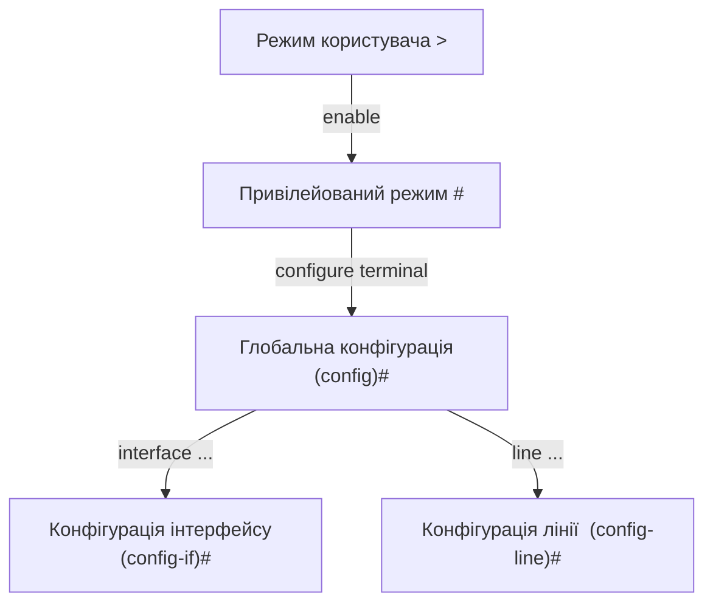

# Базове налаштування маршрутизатора: Cisco IOS

> [!abstract]
> Дванадцять лекцій ми говорили про мережі концептуально – тепер настав час фізично увійти в консоль реального обладнання. Розберемо операційну систему Cisco IOS, ієрархію режимів командного рядка, базові команди навігації й налаштування, і, що особливо важливо практично, різницю між робочою і стартовою конфігурацією – розуміння якої рятує від найпоширенішої й найприкрішої помилки початківця.

## Що таке Cisco IOS

**Cisco IOS (Internetwork Operating System)** – операційна система, що працює на переважній більшості маршрутизаторів і комутаторів Cisco, найпоширенішого виробника корпоративного мережевого обладнання. Це не універсальна операційна система на кшталт Windows чи Linux – IOS вузькоспеціалізована саме під задачі мережевого обладнання: вона не запускає офісні застосунки чи браузери, зате надає повний, детальний контроль над кожним аспектом роботи маршрутизатора чи комутатора через текстовий інтерфейс командного рядка (CLI, command-line interface).

Чому саме текстовий командний рядок, а не графічний інтерфейс, як у більшості звичних вам програм? Причина суто практична: графічний інтерфейс важко автоматизувати, важко відтворити ідентично на сотнях пристроїв одночасно, і зазвичай приховує частину можливостей заради простоти. Командний рядок, навпаки, ідеально піддається автоматизації (саме до цього ми повернемось у лекції 36 про Ansible й скрипти) і дає доступ до буквально кожного параметра пристрою. Більшість сучасного обладнання Cisco також має веб-інтерфейс для базового налаштування, але професійна практика в корпоративних мережах – саме CLI, і саме тому весь цей курс, включно з практичними й лабораторними роботами, побудований на командному рядку.

Доступ до CLI можна отримати кількома способами. **Консольний кабель** – фізичне пряме підключення до спеціального консольного порту пристрою; це єдиний спосіб дістатись до CLI *до* того, як пристрою взагалі призначено якусь IP-адресу, – саме так ви вперше "заходите" на щойно розпакований, ще не налаштований маршрутизатор. **Telnet** і **SSH** – дистанційний доступ мережею, що вимагає, щоб пристрій уже мав робочу IP-адресу; про різницю між незашифрованим Telnet і захищеним SSH та про те, чому сучасна практика однозначно віддає перевагу SSH, детальніше поговоримо, коли дійдемо до теми віддаленого доступу в лекції 40, а поки що зауважимо: у навчальних лабораторних роботах цього курсу, як і в реальному первинному налаштуванні обладнання, ви користуватиметесь саме консольним доступом.

## Ієрархія режимів командного рядка

Ключова концептуальна ідея, яку варто засвоїти перш ніж вводити хоч одну команду, – CLI Cisco IOS організований у чітку **ієрархію режимів (modes)**, і в кожному режимі доступний свій, чітко обмежений набір команд. Це не довільне ускладнення, а свідомий захисний механізм: критично важливі команди, здатні змінити роботу всього пристрою, недоступні випадково, "на льоту" – до них потрібно свідомо "піднятись" через кілька рівнів, кожен наступний з яких дає ширші повноваження.

**Режим користувача (User EXEC mode)** – перший режим, у якому ви опиняєтесь одразу після підключення до пристрою. У цьому режимі дозволені лише найбезпечніші, спостережні команди – переглянути базовий статус, перевірити зв'язність, – але жодна команда, здатна щось змінити в конфігурації, тут недоступна взагалі. Командний рядок у цьому режимі позначається символом `>` після імені пристрою.

**Привілейований режим (Privileged EXEC mode)** – режим із набагато ширшими правами перегляду (детальний стан кожного компонента пристрою, повна конфігурація), куди потрапляють командою `enable` з режиму користувача. Тут усе ще не можна безпосередньо *змінювати* конфігурацію, зате доступний повний перегляд, а звідси вже можна перейти до режимів редагування. Позначається символом `#`.

**Глобальний режим конфігурації (Global Configuration mode)**, куди потрапляють командою `configure terminal` з привілейованого режиму, – тут уже дозволено безпосередньо змінювати загальні параметри пристрою: ім'я, паролі, глобальні налаштування. Позначається як `(config)#`.

**Підрежими конфігурації** – з глобального режиму можна "спуститись" ще глибше, у режим, специфічний для конкретного об'єкта: **режим конфігурації інтерфейсу** (`(config-if)#`), куди потрапляють командою на кшталт `interface gigabitEthernet 0/0`, дозволяє налаштовувати параметри саме цього конкретного порту (IP-адресу, стан увімкнення); **режим конфігурації лінії** (`(config-line)#`) дозволяє налаштувати параметри доступу через конкретну "лінію" – наприклад, ту саму консоль чи віддалені термінали (vty).



Рух угору ієрархією завжди явний і свідомий (`enable`, `configure terminal`, `interface ...`), а рух назад – командою `exit` (піднятись на один рівень вище) або `end` (чи комбінацією клавіш Ctrl+Z) для миттєвого повернення одразу в привілейований режим із будь-якого підрежиму конфігурації. Ця передбачувана, послідовна структура – одна з причин, чому CLI Cisco IOS, попри перший враження "суворого й незрозумілого тексту", насправді дуже логічний і швидко засвоюваний: у будь-якому режимі ви завжди точно знаєте, які саме команди тут доступні і як з нього вийти.

> [!warning] Типова помилка
> Найпоширеніша розгубленість новачків – спробувати виконати команду налаштування інтерфейсу (наприклад, призначити IP-адресу) прямо в глобальному режимі конфігурації, не увійшовши спочатку в підрежим конкретного інтерфейсу командою `interface ...`. IOS однозначно повідомить про синтаксичну помилку, бо кожна команда прив'язана до свого конкретного режиму – і саме тому перше, що варто перевірити, побачивши повідомлення про помилку команди, – чи перебуваєте ви взагалі в правильному режимі для цієї команди.

## Навігація й допомога в CLI

Cisco IOS надає кілька практичних інструментів, що суттєво полегшують роботу з командним рядком, особливо на етапі, коли ви ще не запам'ятали всі команди напам'ять.

Знак питання `?`, введений у будь-який момент, показує список усіх команд, доступних у поточному режимі, – а введений одразу після часткового набору команди, показує можливі варіанти її продовження. **Автодоповнення клавішею Tab** дозволяє ввести лише унікальний початок команди й натиснути Tab, щоб IOS сам дописав її повністю, – це не лише зручність, а й практична необхідність, коли доводиться регулярно вводити довгі назви команд чи інтерфейсів.

```text
Router> ?
Router> en?
enable
Router> ena<Tab>
Router> enable
```

Для перегляду поточного стану пристрою існує ціле сімейство команд `show`, з яких кілька варто запам'ятати одразу як базовий, щоденний інструментарій. `show running-config` показує поточну, активну конфігурацію пристрою – саме ту, за якою пристрій реально працює прямо зараз. `show ip interface brief` – одна з найчастіше використовуваних діагностичних команд, що коротко показує кожен інтерфейс пристрою, його IP-адресу (якщо призначена) і стан. `show version` показує версію IOS, тип обладнання й час роботи з моменту останнього перезавантаження.

## Базове налаштування пристрою

Розглянемо типову послідовність команд для первинного налаштування щойно розпакованого маршрутизатора – саме таку послідовність (з незначними варіаціями) ви виконуватимете в першій лабораторній роботі курсу.

```text
Router> enable
Router# configure terminal
Router(config)# hostname R1
R1(config)# enable secret CiscoPass123
R1(config)# service password-encryption
R1(config)# banner motd # Authorized access only #
R1(config)# line console 0
R1(config-line)# password ConsolePass456
R1(config-line)# login
R1(config-line)# exit
R1(config)# line vty 0 4
R1(config-line)# password RemotePass789
R1(config-line)# login
R1(config-line)# exit
```

Розберемо кожен рядок по суті, а не лише як формулу для запам'ятовування. `hostname R1` задає ім'я пристрою, яке після цього відображається в самому запрошенні командного рядка (`Router#` перетворюється на `R1#`) – критично важлива практика для реальної мережі з десятками пристроїв, де без чіткого, зрозумілого імені легко переплутати, на якому саме пристрої ви щойно ввели команду. `enable secret` задає зашифрований пароль, необхідний для входу в привілейований режим, – це один із базових захисних рубежів проти неавторизованого доступу. `service password-encryption` вмикає шифрування *всіх* паролів, збережених у конфігурації (не лише `enable secret`, який шифрується завжди й так, а й інших паролів, що інакше зберігались би простим текстом, – суттєва практична деталь, бо конфігурацію пристрою часто переглядають чи передають колегам, і незашифровані паролі просто "у відкритому вигляді" в тексті конфігурації – типовий і небезпечний недогляд). Команди `line console 0` і `line vty 0 4` входять у режим налаштування, відповідно, консольного порту й віддалених термінальних ліній (0-4 означає до п'яти одночасних віддалених сесій), де командою `password` задається пароль доступу саме цим шляхом, а `login` явно каже пристрою вимагати цей пароль при вході.

## Налаштування інтерфейсів

Щойно налаштований маршрутизатор поки що не має жодної працюючої IP-адреси на жодному зі своїх портів – це потрібно зробити явно, для кожного інтерфейсу окремо, за допомогою вже знайомої нам структури адресації з лекції 11.

```text
R1(config)# interface gigabitEthernet 0/0
R1(config-if)# description LAN до відділу продажів
R1(config-if)# ip address 192.168.10.1 255.255.255.0
R1(config-if)# no shutdown
R1(config-if)# exit
```

Тут криється одна з найпоширеніших пасток для новачків, тому підкреслимо її окремо: **інтерфейси Cisco-обладнання за замовчуванням адміністративно вимкнені (shutdown)**, навіть якщо кабель фізично підключений і з іншого боку все налаштовано правильно. Команда `no shutdown` (буквально "не вимкнено" – подвійне заперечення, типовий стиль синтаксису IOS, де `no` перед командою скасовує чи вимикає відповідну функцію) обов'язкова, щоб інтерфейс узагалі почав пропускати трафік. Команда `description` не впливає на роботу мережі жодним чином – це суто текстова нотатка для людей, що читатимуть конфігурацію пізніше (у тому числі майбутнього вас через півроку), і хорошою практикою вважається завжди залишати короткий, змістовний опис призначення кожного інтерфейсу.

> [!warning] Типова помилка
> Забутий `no shutdown` – мабуть, найчастіша окрема причина "чому мій щойно налаштований інтерфейс не працює" серед студентів, що вперше конфігурують Cisco-обладнання. Симптом підступний саме тим, що всі інші команди (IP-адреса, маска) вводяться абсолютно правильно, і саме тому цю причину неполадки часто шукають довго й не в тому місці – перевірка команди `show ip interface brief`, яка одразу покаже статус кожного інтерфейсу як `administratively down`, якщо `no shutdown` забуто, має стати першим рефлекторним кроком діагностики.

## Робоча й стартова конфігурація: найважливіша практична відмінність

Останнє й, можливо, найважливіше практичне поняття цієї лекції стосується того, де саме зберігається конфігурація пристрою і що станеться з нею, якщо пристрій вимкнути.

**Робоча конфігурація (running-config)** – це та конфігурація, з якою пристрій реально працює прямо зараз, у поточний момент. Кожна команда, яку ви вводите в режимах конфігурації, негайно й миттєво застосовується до running-config і одразу впливає на роботу пристрою. Але running-config зберігається в **оперативній пам'яті (RAM)** – а RAM, за своєю фізичною природою, енергозалежна: вона повністю очищується щоразу, коли пристрій втрачає живлення чи перезавантажується.

**Стартова конфігурація (startup-config)** зберігається в іншому типі пам'яті – **NVRAM (Non-Volatile RAM)**, енергонезалежній пам'яті, вміст якої зберігається навіть після повного вимкнення живлення. Саме startup-config пристрій завантажує і застосовує щоразу під час свого запуску чи перезавантаження.

Ключовий практичний висновок, який неможливо переоцінити: **зміни, внесені в running-config, не потрапляють у startup-config автоматично**. Якщо ви провели годину, ретельно налаштовуючи маршрутизатор, і жодного разу не зберегли конфігурацію явно, а потім пристрій перезавантажився (через збій живлення, помилкову команду перезавантаження чи будь-яку іншу причину) – уся ваша годинна робота зникає безслідно, і пристрій завантажується з тією конфігурацією, яка була збережена в startup-config *до* початку вашої роботи (можливо, взагалі порожньою, якщо це щойно розпакований пристрій).

Щоб зберегти поточну робочу конфігурацію в стартову, використовують команду:

```text
R1# copy running-config startup-config
Destination filename [startup-config]?
Building configuration...
[OK]
```

Ту саму дію в старішій, коротшій формі виконує команда `write memory` (або ще коротше – просто `write`), яку ви часто зустрінете в старішій документації й у звичках досвідчених інженерів, – обидві команди роблять по суті одне й те саме.

> [!example] Приклад
> Уявіть, що під час лабораторної роботи ви налаштували VLAN, інтерфейси й паролі на комутаторі, усе перевірили командою `show running-config` і побачили, що конфігурація саме така, яку ви й планували. Якщо в цей момент раптово зникне живлення (а в навчальній лабораторії з фізичним обладнанням таке трапляється частіше, ніж хотілося б), і ви не встигли виконати `copy running-config startup-config`, – після відновлення живлення комутатор завантажиться з попередньою, старою startup-config, і вся щойно виконана робота виявиться втраченою так, ніби її ніколи й не було. Саме тому досвідчені інженери виробляють звичку зберігати конфігурацію регулярно, після кожного логічно завершеного блоку налаштувань, а не лише один раз наприкінці всієї роботи.

> [!info] Для допитливих
> Той самий поділ на "активну робочу пам'ять, що втрачається при вимкненні" і "стійку пам'ять для довгострокового збереження" – далеко не унікальна особливість Cisco IOS: та сама логіка лежить в основі архітектури практично будь-якого сучасного комп'ютера (оперативна пам'ять RAM проти жорсткого диска чи SSD) і навіть у роботі звичайних текстових редакторів (незбережені зміни у відкритому документі проти вже записаного на диск файлу). Розуміння цього принципу – не вузькоспецифічна деталь Cisco, а загальний патерн, який ви зустрічатимете знову й знову в найрізноманітніших технічних контекстах.

## Перевірка результату

Завершивши базове налаштування, варто перевірити результат практичними командами, до яких ви повертатиметесь щоразу після будь-якої зміни конфігурації протягом усього курсу: `show ip interface brief` покаже, які інтерфейси налаштовані, з якими IP-адресами і в якому стані (адміністративно й фізично увімкнені чи ні); `show running-config` дозволить переглянути повний, актуальний текст конфігурації; а найпростіша перевірка реальної зв'язності – команда `ping`, що використовує знайомий нам із лекції 9 механізм ICMP Echo Request/Reply, застосована прямо з CLI пристрою до сусіднього вузла мережі.

> [!exam] На іспиті
> Типові питання: а) перелічити режими CLI Cisco IOS у порядку зростання привілеїв і команди переходу між ними; б) пояснити відмінність між running-config і startup-config та наслідки, якщо забути зберегти конфігурацію; в) пояснити призначення команди `no shutdown` і чому забутий `no shutdown` – типова причина непрацюючого щойно налаштованого інтерфейсу; г) розписати послідовність команд для базового налаштування імені пристрою, паролів і одного інтерфейсу з IP-адресою.

## Завдання на занятті (20 хв)

1. Розпишіть, у якому режимі CLI (`>`, `#`, `(config)#`, `(config-if)#`) потрібно перебувати для кожної з таких дій: перегляд `show running-config`; призначення IP-адреси інтерфейсу; зміна імені пристрою; вхід у привілейований режим.
2. Складіть повну послідовність команд для налаштування нового маршрутизатора з іменем `R2`, паролем на привілейований режим, паролем на консоль і одним інтерфейсом `gigabitEthernet 0/1` з адресою 10.0.0.1/24, обов'язково увімкненим.
3. У парі поясніть одне одному, чому команда `copy running-config startup-config` необхідна, навіть якщо `show running-config` уже показує саме ту конфігурацію, яку ви хотіли отримати.
4. Обговоріть: чому в командному синтаксисі IOS, побудованому на принципі "команда `X` вмикає функцію, `no X` вимикає", саме `no shutdown` (а не просто `up` чи подібне) вмикає інтерфейс, – як ця логіка узгоджується з тим, що інтерфейси за замовчуванням "вимкнені" (shutdown)?

> [!question] Перевірте себе
> 1. Перелічіть чотири основні режими CLI Cisco IOS і команди переходу з одного в інший.
> 2. Чим running-config відрізняється від startup-config за типом пам'яті, де вони зберігаються, і за наслідками перезавантаження пристрою?
> 3. Яка команда потрібна, щоб щойно налаштований інтерфейс почав фактично пропускати трафік, і чому вона взагалі необхідна?
> 4. Яку команду ви використаєте, щоб переконатись, що зміни в конфігурації переживуть перезавантаження пристрою?
> 5. Яка команда покаже коротку зведену інформацію про всі інтерфейси пристрою одразу – їхні IP-адреси й стан?

## Назад
← [[courses/computer-networks/lectures/12-ipv6-adresatsiia|Лекція 12. IPv6-адресація]]

## Далі
→ [[courses/computer-networks/lectures/14-dhcp-nat-pat-ta-spysky-dostupu-acl|Лекція 14. DHCP, NAT-PAT та списки доступу ACL]]

## Література
- Cisco Networking Academy. *Introduction to Networks* (курс CCNA v7/v7.1) – розділ про базову конфігурацію Cisco IOS.
- Cisco. *Cisco IOS Configuration Fundamentals Command Reference* – офіційна документація команд.
- Одом У. *Officially Licensed Cert Guide CCNA 200-301* – розділ про CLI Cisco IOS.
