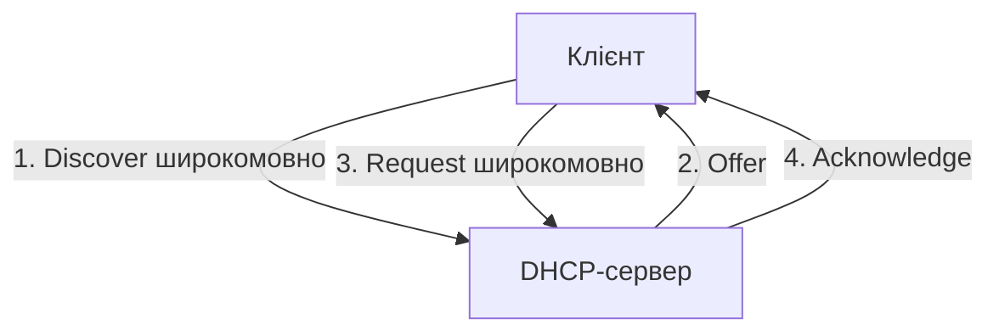

# Налаштування DHCP, NAT/PAT та списків доступу ACL

> [!abstract]
> Три служби, без яких не обходиться жоден реальний маршрутизатор малого офісу: DHCP автоматично видає IP-адреси, NAT/PAT дозволяє десяткам приватних адрес виходити в інтернет через одну публічну, а ACL фільтрує трафік за заданими правилами. Розберемо механіку кожної служби і практично налаштуємо всі три на Cisco IOS.

## DHCP: чому адреси не призначають вручну

У лекції 11 ми детально розібрали, як розраховується адресний простір підмережі, – але жодного разу не говорили, як саме конкретна IP-адреса потрапляє на конкретний комп'ютер. У малих лабораторних сценаріях (як-от у попередній лекції) цілком реально призначити адресу вручну, командами на кожному пристрої окремо. Але уявіть офіс на 300 співробітників: вручну прописувати адресу, маску, шлюз і DNS-сервер на кожному з 300 комп'ютерів – не просто трудомістко, а й гарантовано призведе рано чи пізно до конфлікту адрес (два пристрої з однаковою адресою) через людську помилку.

**DHCP (Dynamic Host Configuration Protocol)** розв'язує цю проблему, автоматично видаючи мережеві параметри кожному новому пристрою, щойно він підключається до мережі. Процес, за яким це відбувається, класично описують чотирма кроками, що утворюють акронім **DORA**.

**Discover.** Щойно підключений пристрій, який ще не має жодної IP-адреси, надсилає широкомовний запит "чи є в цій мережі DHCP-сервер?" – широкомовний, тому що в пристрою немає ще навіть адреси, щоб надіслати запит комусь конкретному напряму, а сервер може перебувати за будь-якою адресою, ще невідомою клієнту.

**Offer.** DHCP-сервер, отримавши Discover, пропонує пристрою конкретну вільну адресу зі свого пулу разом з іншими параметрами (маска, шлюз, DNS) – теж, як правило, у формі широкомовної відповіді, оскільки в клієнта ще немає остаточно призначеної адреси для точкового звернення.

**Request.** Клієнт, отримавши одну чи кілька пропозицій (якщо в мережі раптом кілька DHCP-серверів одночасно), явно підтверджує, яку саме із запропонованих адрес він приймає, – знову широкомовним повідомленням, щоб усі потенційні DHCP-сервери в мережі побачили цей вибір і ті, чия пропозиція не була обрана, могли повернути свою адресу назад у вільний пул.

**Acknowledge.** Обраний сервер остаточно підтверджує видачу адреси й позначає її як зайняту у своєму внутрішньому обліку на певний період – **термін оренди (lease)**, після завершення якого клієнт має або поновити оренду цієї самої адреси, або отримати нову.



Оскільки перші три з чотирьох кроків DORA спираються на широкомовні повідомлення, а широкомовний трафік, як ми з'ясували в лекції 6, за замовчуванням не виходить за межі одного домену трансляції (одного VLAN, однієї підмережі), виникає практична проблема: що робити, якщо DHCP-сервер фізично перебуває в іншій підмережі, ніж клієнт (типовий сценарій – один централізований DHCP-сервер на всю організацію, що обслуговує десятки VLAN одночасно)? Розв'язання – **DHCP relay**: маршрутизатор, що з'єднує підмережу клієнта з рештою мережі, налаштовується перетворювати широкомовні DHCP-запити клієнтів на звичайні, точково адресовані пакети до відомої адреси реального DHCP-сервера, і навпаки – пересилати відповідь сервера назад клієнту. Саме тому маршрутизатор – не лише пристрій, що з'єднує мережі, а й активний учасник процесу DHCP там, де сервер і клієнт розділені межею підмереж.

Розглянемо базове налаштування маршрутизатора Cisco як DHCP-сервера для локальної підмережі:

```text
R1(config)# ip dhcp excluded-address 192.168.10.1 192.168.10.10
R1(config)# ip dhcp pool LAN-POOL
R1(dhcp-config)# network 192.168.10.0 255.255.255.0
R1(dhcp-config)# default-router 192.168.10.1
R1(dhcp-config)# dns-server 8.8.8.8
R1(dhcp-config)# lease 7
R1(dhcp-config)# exit
```

Команда `ip dhcp excluded-address` виконана *перед* створенням пулу і критично важлива: вона виключає діапазон адрес (типово – адреси, вручну зарезервовані для статичного обладнання, як-от сам маршрутизатор, сервери, принтери) з автоматичної видачі, щоб DHCP-сервер випадково не запропонував динамічному клієнту ту саму адресу, яку хтось уже вручну призначив шлюзу чи серверу. Команда `network` у режимі пулу задає діапазон адрес, з якого сервер видаватиме адреси клієнтам, `default-router` – адресу шлюзу за замовчуванням, яку отримає кожен клієнт разом зі своєю IP-адресою, `dns-server` – адресу DNS-сервера (детальніше про DNS – у лекції 17), а `lease` – термін оренди адреси в днях.

> [!warning] Типова помилка
> Забути команду `ip dhcp excluded-address` перед налаштуванням пулу – поширена практична помилка, наслідок якої проявляється не одразу: DHCP-сервер рано чи пізно може запропонувати динамічному клієнту саме ту адресу, яку адміністратор вручну призначив маршрутизатору, серверу друку чи іншому статично налаштованому пристрою, спричиняючи конфлікт адрес у мережі – ситуацію, коли два різні пристрої одночасно намагаються використовувати ту саму IP-адресу, що призводить до непередбачуваних, важко діагностованих збоїв зв'язку для обох пристроїв.

## NAT і PAT: як багато пристроїв ділять одну публічну адресу

У лекції 11 ми познайомились із приватними діапазонами адрес RFC 1918, а в лекції 12 – з тим, чому вичерпання адресного простору IPv4 змусило шукати компромісні рішення. **NAT (Network Address Translation)** – саме таке компромісне рішення: технологія, що дозволяє пристроям із приватними, немаршрутизованими глобально адресами обмінюватися даними з інтернетом, транслюючи (перетворюючи) їхні приватні адреси на одну чи кілька публічних адрес на межі мережі – типово прямо на маршрутизаторі, що з'єднує локальну мережу з провайдером.

> [!definition] Визначення
> **NAT** – технологія, що перетворює приватні IP-адреси внутрішньої мережі на публічні адреси при виході трафіку назовні (і назад – при поверненні відповіді), дозволяючи пристроям із немаршрутизованими глобально адресами обмінюватися даними із зовнішніми мережами.

Існує кілька варіантів NAT, і розрізняти їх варто чітко, бо кожен розв'язує дещо іншу практичну задачу. **Статичний NAT** – жорстке, постійне співвідношення "одна конкретна приватна адреса завжди перетворюється на одну конкретну публічну адресу", типово застосовується для внутрішніх серверів, до яких потрібен постійний, передбачуваний доступ ззовні (наприклад, вебсервер компанії). **Динамічний NAT** – приватні адреси перетворюються на публічні з визначеного пулу публічних адрес, але відповідність не жорстко закріплена, а призначається динамічно з наявного пулу в міру потреби; це рідше застосовується на практиці, бо все одно вимагає стільки ж публічних адрес у пулі, скільки пристроїв може одночасно виходити назовні, – тобто не розв'язує саму проблему нестачі публічних адрес, а лише трохи гнучкіше її перерозподіляє.

Найпоширеніший на практиці варіант – **PAT (Port Address Translation)**, який в документації Cisco також часто називають **NAT overload**. Ідея PAT прямо спирається на знання про порти й сокети з лекції 10: якщо статичний і динамічний NAT перетворюють приватну адресу на публічну "адреса на адресу", то PAT дозволяє *багатьом* приватним адресам одночасно ділити *одну єдину* публічну адресу, розрізняючи окремі з'єднання за унікальними номерами портів. Маршрутизатор веде внутрішню **таблицю трансляції**, у якій кожному вихідному з'єднанню (комбінації приватна адреса + приватний порт відправника) відповідає унікальна комбінація публічна адреса + новий, теж унікальний ефемерний порт, – і коли з інтернету повертається відповідь на цей публічний порт, маршрутизатор за таблицею трансляції точно знає, якому саме внутрішньому пристрою й порту цю відповідь слід переслати назад.

> [!example] Приклад
> Уявіть офіс, де 50 комп'ютерів із приватними адресами діапазону 192.168.1.0/24 одночасно виходять в інтернет через єдину публічну адресу маршрутизатора, скажімо, 203.0.113.5. Коли комп'ютер 192.168.1.10 звертається до сайту з локального ефемерного порту 51000, маршрутизатор транслює це з'єднання на 203.0.113.5 з новим, власним ефемерним портом, наприклад 40001, і саме цю комбінацію публічної адреси й порту 40001 бачить зовнішній сервер. Коли той самий комп'ютер водночас звертається до *іншого* сайту з локального порту 51001, маршрутизатор транслює це на той самий публічний 203.0.113.5, але вже з іншим публічним портом, наприклад 40002. Обидва з'єднання зовні виглядають так, ніби йдуть з однієї й тієї самої публічної адреси, – і саме різні порти дозволяють маршрутизатору не плутати відповіді, призначені для різних внутрішніх з'єднань, і навіть для різних внутрішніх пристроїв одночасно.

Базове налаштування PAT на Cisco IOS виглядає так:

```text
R1(config)# access-list 1 permit 192.168.10.0 0.0.0.255
R1(config)# interface gigabitEthernet 0/0
R1(config-if)# ip nat inside
R1(config-if)# exit
R1(config)# interface gigabitEthernet 0/1
R1(config-if)# ip nat outside
R1(config-if)# exit
R1(config)# ip nat inside source list 1 interface gigabitEthernet 0/1 overload
```

Тут одразу знадобляється список доступу (`access-list 1`), який ми детально розберемо в наступному розділі, – він визначає, який саме внутрішній трафік (з якої підмережі) підлягає трансляції NAT. Команди `ip nat inside` і `ip nat outside`, застосовані на відповідних інтерфейсах, явно вказують маршрутизатору, який інтерфейс дивиться "всередину" приватної мережі, а який – "назовні" в бік провайдера; саме цей поділ дозволяє маршрутизатору правильно визначити напрямок трансляції для кожного пакета. Ключове слово `overload` в останній команді якраз і вмикає саме режим PAT (багато приватних адрес на одну публічну через порти) замість простішого варіанта "один до одного".

## ACL: списки доступу, що фільтрують трафік

У лекції 3 ми ввели поняття міжмережевого екрана – пристрою, що вирішує, чи можна пропустити конкретний трафік, на основі заданих правил. **ACL (Access Control List)** – саме такий набір правил, що можна безпосередньо налаштувати на маршрутизаторі Cisco, і одна з найпрактичніших, найчастіше застосовуваних тем усього курсу маршрутизації.

Розрізняють два основних типи ACL, і розуміння цієї різниці – перше, що варто засвоїти. **Стандартний ACL (standard ACL)**, що традиційно нумерується в діапазоні 1-99, фільтрує трафік *виключно* за адресою джерела (звідки прийшов пакет) – і більше ні за чим: жодного аналізу адреси призначення, протоколу чи порту. **Розширений ACL (extended ACL)**, нумерований у діапазоні 100-199, значно гнучкіший – дозволяє фільтрувати за адресою джерела *і* адресою призначення одночасно, за конкретним протоколом (TCP, UDP, ICMP), і навіть за конкретним номером порту (пригадайте порти з лекції 10 – саме тут ця деталь стає практично застосовною безпосередньо на маршрутизаторі).

> [!definition] Визначення
> **ACL** – упорядкований список правил "дозволити (permit) / заборонити (deny)", що маршрутизатор перевіряє послідовно для кожного пакета й застосовує перше правило, умові якого пакет відповідає.

Ключова практична деталь роботи ACL, яку неможливо переоцінити, – **порядок правил має значення**, і маршрутизатор перевіряє їх строго послідовно, зверху вниз, зупиняючись на *першому* правилі, що відповідає пакету, – усі наступні правила після нього для цього конкретного пакета вже не розглядаються взагалі. Це означає, що дуже загальне правило, розміщене на початку списку, може "перехопити" пакет раніше, ніж маршрутизатор дійде до конкретнішого, точнішого правила нижче, – тому послідовність, у якій ви записуєте правила, часто важливіша навіть за самі умови кожного окремого правила.

Друга критично важлива деталь – **неявна заборона в кінці кожного ACL (implicit deny)**: якщо жодне з явно записаних правил списку не підійшло до конкретного пакета, він автоматично, неявно, без жодного видимого запису в конфігурації, буде відкинутий. Це правило не видно в жодному `show running-config` – воно просто завжди присутнє, за замовчуванням, наприкінці *будь-якого* ACL.

> [!warning] Типова помилка
> Найнебезпечніша практична помилка з ACL – забути про неявну заборону в кінці й ненавмисно заблокувати *весь* трафік, який не потрапив під жодне з явно написаних правил дозволу. Класичний сценарій: адміністратор пише список із єдиним правилом "дозволити трафік від конкретної підмережі до конкретного сервера" і застосовує цей список до інтерфейсу, забуваючи, що весь *інший* трафік через цей інтерфейс тепер автоматично заблокований неявною забороною, – включно, наприклад, із власним віддаленим SSH-з'єднанням адміністратора до самого маршрутizatora, якщо воно йшло через той самий інтерфейс. Тому хорошою практикою вважається завжди явно дописувати в кінці списку правило `permit any` (чи вужчий еквівалент), якщо реальний намір – заборонити лише щось конкретне, а не все, що явно не дозволено.

Розглянемо приклад розширеного ACL, що забороняє гостьовій підмережі (пригадайте тренд IoT-сегментації з лекції 1) звертатися до внутрішнього сервера з оцінками студентів, але дозволяє їй виходити в інтернет:

```text
R1(config)# access-list 101 deny tcp 192.168.30.0 0.0.0.255 host 192.168.10.50 eq 443
R1(config)# access-list 101 permit ip any any
R1(config)# interface gigabitEthernet 0/2
R1(config-if)# ip access-group 101 in
```

Перше правило явно забороняє TCP-трафік із підмережі гостьового Wi-Fi (192.168.30.0/24) до конкретного хоста-сервера (192.168.10.50) на порту 443 (HTTPS, пригадайте з лекції 10). Друге правило – той самий явний `permit any` "про всяк випадок", про який щойно йшлося, – дозволяє геть увесь інший трафік, що не підпав під перше, вужче правило заборони. Останній рядок, `ip access-group 101 in`, застосовує цей список саме на конкретному інтерфейсі й у конкретному напрямку – `in` означає перевірку трафіку, що *входить* на цей інтерфейс з боку гостьової мережі, на відміну від `out`, що перевіряв би трафік, який *виходить* через цей інтерфейс.

Загальноприйнята практична рекомендація щодо розміщення двох типів ACL безпосередньо випливає з їхніх можливостей: **стандартний ACL**, оскільки він фільтрує лише за джерелом і не бачить призначення, варто розміщувати *якомога ближче до пункту призначення* – інакше, застосований надто рано, він міг би заблокувати трафік від того самого джерела до інших, легітимних напрямків, до яких насправді не було наміру перекривати доступ. **Розширений ACL**, навпаки, оскільки бачить одразу і джерело, і призначення, і конкретний сервіс, можна (і зазвичай варто) розміщувати *якомога ближче до джерела* – це дозволяє відсіювати небажаний трафік максимально рано, ще до того, як він встигне пройти зайву відстань мережею й спожити її пропускну здатність даремно.

## Як три служби пов'язані між собою

Зверніть увагу, наскільки природно ці три служби, розглянуті сьогодні, спираються на все попереднє: DHCP видає адреси з підмережі, розрахованої за методикою лекції 11; NAT/PAT транслює саме ці приватні адреси в публічні, використовуючи механіку портів з лекції 10; а ACL, застосований для визначення "цікавого" для NAT трафіку чи для прямої фільтрації гостьової мережі, спирається на ту саму структуру адрес і портів. Саме такий типовий набір – DHCP, NAT/PAT, ACL – ви й налаштуєте практично в лабораторних роботах курсу, і саме ці три служби разом становлять фактичний мінімальний набір функцій, які виконує буквально кожен маршрутизатор малого офісу чи домашньої мережі, включно з тим самим побутовим "роутером" із лекції 3.

> [!exam] На іспиті
> Типові питання: а) описати чотири кроки процесу DORA і пояснити, чому перші три спираються на широкомовні повідомлення; б) пояснити відмінність між статичним NAT, динамічним NAT і PAT/NAT overload; в) пояснити, як PAT розрізняє кілька одночасних з'єднань від різних внутрішніх пристроїв через один публічний IP; г) пояснити відмінність між стандартним і розширеним ACL; д) пояснити концепцію неявної заборони в кінці ACL і чому вона небезпечна, якщо про неї забути.

## Завдання на занятті (20 хв)

1. Складіть послідовність команд для налаштування DHCP-пулу на підмережу 172.16.5.0/24, зі шлюзом 172.16.5.1, DNS-сервером 1.1.1.1 і винятком для адрес .1-.5, зарезервованих під статичне обладнання.
2. У парі поясніть одне одному, чому саме порти (а не, наприклад, випадкові номери) дозволяють PAT правильно розрізняти відповіді, призначені різним внутрішнім пристроям, що ділять одну публічну адресу.
3. Напишіть розширений ACL, що дозволяє лише SSH-трафік (порт 22) з підмережі адміністраторів 192.168.99.0/24 до всіх пристроїв мережі, забороняючи SSH з будь-яких інших джерел, але не чіпаючи інший трафік.
4. Обговоріть: чому неявна заборона наприкінці кожного ACL – корисна властивість "безпечно за замовчуванням" (safe by default), а не небажаний технічний недолік, попри те що вона й є джерелом типової помилки, розглянутої вище?

> [!question] Перевірте себе
> 1. Розпишіть чотири кроки DORA і поясніть, навіщо потрібен окремий крок Request після вже отриманої пропозиції Offer.
> 2. Чим PAT (NAT overload) відрізняється від звичайного динамічного NAT з погляду кількості потрібних публічних адрес?
> 3. Що конкретно записує маршрутизатор у таблицю трансляції NAT для кожного вихідного з'єднання?
> 4. Чим стандартний ACL відрізняється від розширеного за критеріями фільтрації?
> 5. Що станеться з пакетом, який не відповідає жодному явному правилу в ACL, і як називається цей механізм?

## Назад
← [[courses/computer-networks/lectures/13-bazove-nalashtuvannia-marshrutyzatora-cisco|Лекція 13. Базове налаштування маршрутизатора Cisco IOS]]

## Далі
→ [[courses/computer-networks/lectures/15-statychna-marshrutyzatsiia|Лекція 15. Статична маршрутизація]]

## Література
- Cisco Networking Academy. *Introduction to Networks* та *Enterprise Networking* (курс CCNA v7/v7.1) – розділи про DHCP, NAT та ACL.
- RFC 2131 (Dynamic Host Configuration Protocol), RFC 3022 (Traditional NAT).
- Одом У. *Officially Licensed Cert Guide CCNA 200-301* – розділи про DHCP, NAT/PAT та списки доступу.
