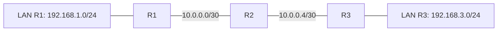

# Статична маршрутизація та маршрути за замовчуванням

> [!abstract]
> Ми вже знаємо, що маршрутизатор пересилає пакети на основі таблиці маршрутизації, — настав час навчитися будувати цю таблицю вручну. Розберемо, з чого складається кожен запис таблиці маршрутизації, як вручну прописати статичний маршрут, що таке маршрут за замовчуванням, і за яким принципом маршрутизатор обирає, який саме запис застосувати, коли підходить кілька.

## Що насправді міститься в таблиці маршрутизації

У лекції 3 ми домовились: маршрутизатор ухвалює рішення про пересилання на основі таблиці маршрутизації — довідника "яку мережу через який інтерфейс і кому далі передати". Настав час розглянути структуру цього довідника детально. Кожен запис таблиці маршрутизації містить щонайменше чотири логічні компоненти.

**Мережа призначення й маска** — та сама пара, розрахована за методикою лекції 11, що визначає, для якого діапазону адрес діє цей конкретний запис.

**Наступний перехід (next hop)** — IP-адреса сусіднього маршрутизатора, якому слід передати пакет далі на шляху до кінцевої мережі, *або* вихідний інтерфейс самого маршрутизатора, якщо мережа призначення підключена безпосередньо чи досяжна через певний локальний порт.

**Адміністративна відстань (administrative distance, AD)** — число, що визначає *довіру* до джерела, з якого маршрутизатор дізнався про цей маршрут, коли кілька різних джерел (пряме підключення, статичний запис, різні протоколи динамічної маршрутизації) пропонують маршрут до тієї самої мережі. Що менше число адміністративної відстані, то вищий пріоритет має маршрут із цього джерела. Безпосередньо підключені мережі мають адміністративну відстань 0 (найвищу можливу довіру — маршрутизатор фізично й безпосередньо бачить цю мережу, сумніватися нема в чому), статичні маршрути, які ми розглядаємо сьогодні, — типово 1, а протоколи динамічної маршрутизації, з якими познайомимось у наступній лекції, мають вищі числові значення (наприклад, OSPF — 110), тобто нижчий пріоритет порівняно зі статичним записом до тієї самої мережі.

**Метрика (metric)** — число, що визначає "вартість" чи "довжину" конкретного шляху й використовується для порівняння кількох маршрутів *від того самого джерела* до тієї самої мережі (наприклад, кількох статичних маршрутів чи кількох маршрутів OSPF) — на відміну від адміністративної відстані, яка порівнює маршрути *різних* джерел одне з одним.

Коли маршрутизатор щойно ввімкнули й налаштували інтерфейси (як у лекції 13), таблиця маршрутизації вже не порожня — у ній автоматично з'являються записи для кожної мережі, підключеної безпосередньо до активного (`no shutdown`) інтерфейса з призначеною IP-адресою. У виводі команди `show ip route` такі записи позначаються літерою `C` (Connected — безпосередньо підключена мережа) і супровідним записом `L` (Local — точна адреса самого інтерфейса маршрутизатора в цій мережі). Ці записи — фундамент, на якому будується решта таблиці: без них маршрутизатор не знав би навіть, куди передавати пакети в межах власних безпосередньо підключених мереж, не кажучи вже про віддаленіші.

## Статичний маршрут: ручний запис у довіднику

**Статичний маршрут** — запис у таблиці маршрутизації, доданий адміністратором вручну, командою, а не отриманий автоматично від безпосереднього підключення чи від протоколу динамічної маршрутизації. Синтаксис базової команди:

```text
R1(config)# ip route <мережа_призначення> <маска> <наступний_перехід>
```

Розглянемо конкретний сценарій із трьох маршрутизаторів, з'єднаних послідовно — R1 і R2, R2 і R3, — кожне з'єднань через окрему підмережу точка-точка /30 (пригадайте саме такий тип підмережі з прикладу VLSM у лекції 11), при цьому за кожним маршрутизатором ще й своя локальна мережа користувачів.



Щоб R1 знав, як досягти локальної мережі за R3 (192.168.3.0/24), а R3 — як досягти локальної мережі за R1 (192.168.1.0/24), потрібно прописати статичні маршрути на кожному з крайніх маршрутизаторів (проміжний R2, у цьому найпростішому прикладі з трьома вузлами, уже безпосередньо підключений до обох ланок і тому не потребує додаткових статичних маршрутів для самих цих двох конкретних мереж — хоча в реальнішій, більшій топології проміжні маршрутизатори теж, звісно, потребують власних записів для мереж, яких вони безпосередньо не бачать).

```text
R1(config)# ip route 192.168.3.0 255.255.255.0 10.0.0.2
R3(config)# ip route 192.168.1.0 255.255.255.0 10.0.0.5
```

Перша команда, виконана на R1, каже: "щоб дістатись мережі 192.168.3.0/24, передавай пакети наступному пристрою за адресою 10.0.0.2" (це адреса інтерфейсу R2, зверненого до R1, у підмережі точка-точка між ними). Аналогічно друга команда на R3 вказує наступний перехід у бік R2 з іншого боку.

Замість IP-адреси наступного переходу статичний маршрут можна прописати, вказавши **вихідний інтерфейс** маршрутизатора замість адреси сусіда:

```text
R1(config)# ip route 192.168.3.0 255.255.255.0 gigabitEthernet 0/1
```

Обидва варіанти на перший погляд роблять одне й те саме, але між ними є практична технічна відмінність, яку варто розуміти, а не просто запам'ятовувати як довільний вибір синтаксису. Якщо вказано IP-адресу наступного переходу, маршрутизатору для кожного пакета потрібно додатково виконати так званий **рекурсивний пошук (recursive lookup)** — спочатку визначити, через який саме інтерфейс досяжна ця вказана адреса наступного переходу, і лише після цього фактично переслати пакет; це невеликі, але реальні додаткові обчислення для кожного пересилання. Якщо ж одразу вказано вихідний інтерфейс, такий додатковий пошук не потрібен — але цей варіант коректно застосовний лише для з'єднань типу точка-точка (де на іншому кінці інтерфейсу гарантовано лише один можливий сусід, тому додатково вказувати саме його адресу не критично), і його не рекомендується використовувати для мереж із кількома можливими сусідами на спільному сегменті (наприклад, мереж Ethernet із кількома пристроями), де без явно вказаної адреси наступного переходу могла б виникнути двозначність.

## Маршрут за замовчуванням: коли конкретного запису немає

Розглянутий вище приклад передбачає, що для кожної потрібної мережі призначення прописано окремий, конкретний статичний маршрут. Але уявіть маршрутизатор на межі невеликого офісу з провайдером: усередині офісу — кілька відомих, конкретних локальних підмереж, а зовні, у бік провайдера, — буквально весь інтернет, мільйони можливих мереж призначення, кожна з яких теоретично могла б знадобитись. Прописувати окремий статичний маршрут для кожної з мільйонів можливих мереж інтернету — очевидно неможливо й не потрібно.

**Маршрут за замовчуванням (default route)** розв'язує саме цю задачу: це особливий запис, що відповідає *буквально будь-якій* мережі призначення, для якої в таблиці маршрутизації немає жодного конкретнішого, точнішого запису. Записується він мережею 0.0.0.0 з маскою 0.0.0.0 — маскою, у якій узагалі немає жодного одиничного біта, а отже (пригадайте побітове AND із лекції 11), результат порівняння з такою маскою завжди дає 0.0.0.0 незалежно від реальної адреси призначення пакета, тобто формально "збігається" з будь-якою можливою адресою.

```text
R1(config)# ip route 0.0.0.0 0.0.0.0 203.0.113.1
```

Такий запис часто називають **маршрутом останньої надії (route of last resort)**: маршрутизатор спочатку завжди намагається знайти найточніший, найконкретніший відповідний запис у таблиці (детально про це — в наступному розділі про принцип найдовшого збігу), і лише якщо жодного конкретнішого запису для цієї адреси призначення немає, застосовує саме маршрут за замовчуванням як "запасний варіант на крайній випадок" — типово спрямовуючи такий трафік у бік провайдера інтернету, який уже сам знає (чи, точніше, дізнається через складнішу маршрутизацію, зокрема протокол BGP, детально розглянутий у лекції 19), як далі доставити пакет до фактично будь-якої точки глобального інтернету.

> [!definition] Визначення
> **Маршрут за замовчуванням** — запис таблиці маршрутизації з мережею 0.0.0.0/0, що застосовується до будь-якого пакета, для якого немає точнішого, конкретнішого відповідного запису в таблиці.

## Принцип найдовшого збігу: як обирається найкращий маршрут

Що робить маршрутизатор, якщо в таблиці одночасно є *кілька* записів, кожен з яких теоретично "підходить" адресі призначення конкретного пакета, — наприклад, і маршрут за замовчуванням (0.0.0.0/0, що підходить буквально всьому), і конкретніший маршрут до 192.168.3.0/24, і ще конкретніший запис до однієї-єдиної адреси 192.168.3.100/32? Відповідь визначається **принципом найдовшого збігу (longest prefix match)**: маршрутизатор завжди обирає той запис таблиці маршрутизації, у якого маска підмережі *найдовша* — тобто найточніша, найконкретніша з-поміж усіх записів, що формально підходять цій конкретній адресі призначення.

> [!example] Приклад
> Уявіть, що в таблиці маршрутизації R1 одночасно присутні три записи: маршрут за замовчуванням 0.0.0.0/0 (найзагальніший, підходить будь-чому), маршрут 192.168.3.0/24 (конкретніший — стосується лише однієї підмережі) і маршрут 192.168.3.128/25 (ще конкретніший — стосується лише половини тієї самої підмережі, скажімо, окремого VLAN для серверів усередині неї). Пакет із адресою призначення 192.168.3.200 формально підпадає під усі три записи одночасно (адреса дійсно належить і до всієї підмережі /24, і до її половини /25, і, звісно, до "будь-чого" за маршрутом за замовчуванням). Маршрутизатор обере третій, найдовший, найконкретніший запис (/25), бо саме він дає найточнішу відповідність адресі призначення, — і саме тому окрема, спеціально виділена підмережа для серверів усередині більшої мережі отримає інший, спеціально прописаний для неї шлях, навіть якщо решта тієї самої великої мережі йде іншим маршрутом.

Цей принцип пояснює, чому маршрут за замовчуванням завжди безпечно можна залишити в таблиці навіть тоді, коли для більшості реального трафіку вже прописані конкретніші статичні маршрути, — маршрут за замовчуванням просто ніколи не "переможе" жодного конкретнішого запису за наявності такого, і спрацьовує виключно як справжня "остання надія", коли більше справді нічого точнішого не знайдено.

## Плаваючі статичні маршрути: резерв на випадок відмови

Статична маршрутизація, розглянута дотепер, — повністю ручна: якщо основний канал між двома маршрутизаторами вийде з ладу, статичний маршрут через нього просто перестане працювати, і жодного автоматичного перемикання на резервний шлях не станеться, доки адміністратор не втрутиться вручну. Утім, існує практичний прийом, що дозволяє частково автоматизувати резервування навіть у межах суто статичної маршрутизації, — **плаваючий статичний маршрут (floating static route)**.

Ідея спирається на вже знайому нам адміністративну відстань: якщо прописати для тієї самої мережі призначення *другий* статичний маршрут через альтернативний, резервний шлях, але зі свідомо підвищеним (гіршим) значенням адміністративної відстані порівняно зі значенням за замовчуванням (1), цей другий маршрут залишатиметься неактивним, "у резерві", доки основний маршрут із кращою (нижчою) адміністративною відстанню присутній у таблиці й робочий. Але щойно основний маршрут з якоїсь причини зникає з таблиці (наприклад, відповідний інтерфейс фізично "падає"), маршрутизатор автоматично активує резервний, плаваючий маршрут — без жодного ручного втручання адміністратора в момент самої відмови.

```text
R1(config)# ip route 192.168.3.0 255.255.255.0 10.0.0.2
R1(config)# ip route 192.168.3.0 255.255.255.0 10.0.0.10 5
```

Число `5` наприкінці другої команди — явно задана, підвищена адміністративна відстань для цього конкретного резервного маршруту (замість типового значення 1 для звичайного статичного маршруту), яка й забезпечує потрібну "плаваючу" поведінку: цей запис активується автоматично лише за відсутності кращого, основного маршруту.

## Переваги й межі статичної маршрутизації

Статична маршрутизація приваблива своєю **простотою й передбачуваністю**: адміністратор точно знає, яким саме шляхом піде трафік, бо сам його явно прописав, немає жодного протокольного "фонового шуму" (службового обміну між маршрутизаторами, властивого протоколам динамічної маршрутизації, детально розглянутим у наступній лекції), і сама поведінка маршрутизатора абсолютно детермінована й легко відтворювана для перевірки чи діагностики.

Але ця сама простота стає й головним практичним обмеженням у міру росту мережі: статичні маршрути потрібно прописувати вручну на *кожному* маршрутизаторі для *кожної* мережі призначення, і, що особливо критично, статична маршрутизація сама собою (без прийому з плаваючими маршрутами, розглянутого вище) *не адаптується автоматично* до змін у топології мережі — вихід з ладу каналу чи маршрутизатора вимагає ручного втручання адміністратора, а не автоматичного перерахунку шляхів, як це вміють робити протоколи динамічної маршрутизації. Саме тому статична маршрутизація на практиці залишається доречною для невеликих, стабільних мереж чи для окремих спеціальних сценаріїв (наприклад, того самого маршруту за замовчуванням на межі з провайдером), тоді як для великих, складних мереж підприємства застосовують динамічну маршрутизацію — саме до неї ми переходимо в наступній лекції, розглядаючи протокол OSPF.

> [!exam] На іспиті
> Типові питання: а) перелічити компоненти запису таблиці маршрутизації й пояснити відмінність адміністративної відстані від метрики; б) написати команду статичного маршруту для заданого сценарію мереж; в) пояснити маршрут за замовчуванням і принцип найдовшого збігу на конкретному числовому прикладі; г) пояснити механіку плаваючого статичного маршруту й роль адміністративної відстані в ній; д) назвати переваги й обмеження статичної маршрутизації порівняно з динамічною.

## Завдання на занятті (20 хв)

1. Для топології з прикладу (R1 — R2 — R3, підмережі точка-точка 10.0.0.0/30 і 10.0.0.4/30, локальні мережі 192.168.1.0/24 та 192.168.3.0/24) допишіть статичні маршрути на R2, які потрібні, щоб R2 знав локальні мережі *обох* сусідів (хоча в найпростішому прикладі лекції R2 і без того безпосередньо бачив обидві точка-точка підмережі — обговоріть, чи потрібні тут узагалі додаткові статичні маршрути, і чому).
2. У парі поясніть одне одному принцип найдовшого збігу на прикладі з трьома записами (0.0.0.0/0, 192.168.3.0/24, 192.168.3.128/25) для адреси призначення 192.168.3.50 — який запис переможе і чому.
3. Напишіть команди для основного і плаваючого резервного статичного маршруту до мережі 172.16.0.0/16 — основного через 10.1.1.2, резервного через 10.1.1.6 з адміністративною відстанню 10.
4. Обговоріть: чому маршрут за замовчуванням доречний саме на межі мережі з провайдером, але був би поганим рішенням, якби адміністратор спробував замінити ним *усі* конкретні внутрішні маршрути мережі підприємства?

> [!question] Перевірте себе
> 1. Чим адміністративна відстань відрізняється від метрики? У якому випадку маршрутизатор порівнює саме адміністративні відстані, а в якому — саме метрики?
> 2. Що позначають літери `C` і `L` у виводі команди `show ip route`, і звідки беруться відповідні записи?
> 3. У чому практична різниця між прописуванням статичного маршруту через IP-адресу наступного переходу і через вихідний інтерфейс?
> 4. Сформулюйте принцип найдовшого збігу власними словами й наведіть приклад двох записів таблиці маршрутизації, що обидва формально підходять одній і тій самій адресі призначення.
> 5. Як плаваючий статичний маршрут "дізнається", коли саме потрібно активуватись, і яке поле команди `ip route` для цього використовується?

## Назад
← [[courses/computer-networks/lectures/14-dhcp-nat-pat-ta-spysky-dostupu-acl|Лекція 14. DHCP, NAT-PAT та списки доступу ACL]]

## Далі
→ [[courses/computer-networks/lectures/16-dynamichna-marshrutyzatsiia-ospf|Лекція 16. Динамічна маршрутизація OSPF]]

## Література
- Cisco Networking Academy. *Introduction to Networks* (курс CCNA v7/v7.1) — розділ про статичну маршрутизацію.
- Одом У. *Officially Licensed Cert Guide CCNA 200-301* — розділи про статичні маршрути й таблицю маршрутизації.
- Cisco. *IP Routing: Protocol-Independent Configuration Guide* — офіційна документація.
