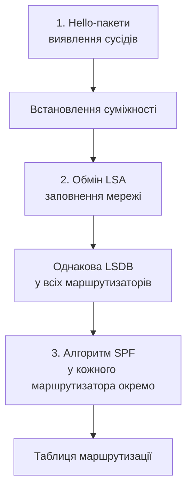

# Динамічна маршрутизація: OSPF — принципи та налаштування

> [!abstract]
> Статична маршрутизація вимагає ручного втручання щоразу, коли змінюється топологія мережі. Розберемо OSPF — найпоширеніший протокол динамічної маршрутизації відкритого стандарту: як маршрутизатори автоматично знаходять сусідів, обмінюються інформацією про мережу й самостійно обчислюють найкращі шляхи, та налаштуємо його на практиці для тієї самої топології, яку в попередній лекції ми конфігурували вручну.

## Навіщо потрібна динамічна маршрутизація

Наприкінці попередньої лекції ми зафіксували головне практичне обмеження статичної маршрутизації: вона не адаптується автоматично до змін топології. Якщо канал між двома маршрутизаторами обривається, статичний маршрут через нього просто перестає працювати, доки хтось вручну не втрутиться і не пропише альтернативний шлях (чи не покладеться заздалегідь на плаваючий резервний маршрут, як ми розглядали). У мережі з трьома маршрутизаторами це терпимо; у мережі з тридцятьма чи трьомастами — ручне підтримання актуальності статичних маршрутів стає практично неможливим.

**Протокол динамічної маршрутизації** розв'язує цю проблему принципово: маршрутизатори самі обмінюються службовою інформацією про доступні мережі одне з одним, автоматично будують і постійно оновлюють свої таблиці маршрутизації, і, що найважливіше, самостійно виявляють зміни в топології (відмову каналу, появу нового маршрутизатора) і перераховують шляхи без жодного ручного втручання адміністратора — концептуально дуже схоже на те, що ми вже бачили на канальному рівні, коли розглядали RSTP і його здатність автоматично активувати резервний шлях у лекції 7, тільки тут ідеться про мережевий рівень і про повноцінний вибір шляху, а не лише про блокування петель.

Протоколи динамічної маршрутизації прийнято класифікувати за принципом роботи на дві великі категорії: **дистанційно-векторні (distance-vector)**, де маршрутизатори діляться одне з одним готовими висновками ("я знаю мережу X, вона від мене на відстані Y стрибків"), не бачачи повної картини мережі цілком, і **протоколи стану каналу (link-state)**, де кожен маршрутизатор натомість ділиться сирими фактами про власні безпосередні з'єднання, а повну карту мережі й найкращі шляхи кожен маршрутизатор обчислює *самостійно* на основі зібраних фактів від усіх інших. **OSPF (Open Shortest Path First)** — саме протокол другого типу, і саме йому присвячена решта цієї лекції.

## Три ключові механізми OSPF

Розберемо, як саме OSPF перетворює розрізнену інформацію окремих маршрутизаторів на узгоджену, спільну картину мережі й, зрештою, на конкретні записи в таблиці маршрутизації кожного пристрою. Процес складається з трьох послідовних, логічно пов'язаних кроків.

**Крок 1 — виявлення сусідів через Hello-пакети.** Кожен маршрутизатор, на якому увімкнено OSPF, періодично надсилає багатоадресні (multicast, пригадайте це поняття з лекції 12) службові повідомлення **Hello** на спеціальну адресу 224.0.0.5, яку слухають усі OSPF-маршрутизатори в тому самому сегменті мережі. Отримавши Hello-пакет від сусіда, маршрутизатор перевіряє, чи узгоджені між ними кілька ключових параметрів (зокрема — інтервали Hello й Dead, про які нижче, і, у базовому налаштуванні, приналежність до тієї самої області OSPF), і якщо все узгоджено — встановлює з цим сусідом **суміжність (adjacency)**, тобто фактично формалізовані "робочі стосунки", у межах яких надалі й відбуватиметься весь подальший обмін маршрутною інформацією.

Постійний обмін Hello-пакетами виконує ще одну важливу функцію — це **виявлення відмов**: якщо маршрутизатор перестає отримувати Hello-пакети від сусіда протягом заданого **Dead-інтервалу** (типово вчетверо довшого за інтервал самих Hello-пакетів), він робить висновок, що сусід чи канал до нього вийшов з ладу, і негайно запускає перерахунок шляхів без цього сусіда — саме такий механізм і забезпечує ту саму автоматичну адаптацію до змін топології, заради якої динамічну маршрутизацію взагалі впроваджують.

**Крок 2 — обмін оголошеннями про стан каналів (Link-State Advertisement, LSA) і побудова бази даних стану каналів.** Щойно суміжність із сусідом встановлена, маршрутизатор ділиться з ним (а через нього — зрештою, і з рештою мережі) власними LSA — короткими, формалізованими "фактами" на кшталт "я, маршрутизатор X, безпосередньо підключений до мережі Y через інтерфейс із такою-то вартістю (cost)". Кожен маршрутизатор пересилає отримані LSA далі своїм іншим сусідам (процес, який називають **заповненням (flooding)**, — знайомий термін, який ми вже зустрічали стосовно поведінки комутатора в лекції 6, хоча тут він застосований до зовсім іншого типу службової інформації на іншому рівні), доки кожен маршрутизатор у межах однієї області OSPF не накопичить *абсолютно однакову* копію всіх LSA від усіх інших маршрутизаторів тієї самої області. Ця повна, ідентична для всіх колекція LSA називається **базою даних стану каналів (Link-State Database, LSDB)** — по суті, повна карта топології мережі, яку кожен маршрутизатор тепер має самостійно, не покладаючись на чужі проміжні висновки.

**Крок 3 — обчислення найкоротших шляхів алгоритмом SPF.** Маючи повну, ідентичну карту мережі у вигляді LSDB, кожен маршрутизатор *самостійно й незалежно* від решти застосовує до неї класичний алгоритм пошуку найкоротшого шляху в графі — **алгоритм Дейкстри (SPF, Shortest Path First)**, — щоб побудувати дерево найкоротших шляхів від себе самого до кожної іншої відомої мережі. Результат цього обчислення і стає остаточними записами в таблиці маршрутизації, позначеними літерою `O` у виводі команди `show ip route`.



> [!info] Для допитливих
> Назва "Open Shortest Path First" містить слово "Open" не випадково: на відміну від деяких інших протоколів динамічної маршрутизації, розроблених і захищених правами конкретного виробника обладнання (найвідоміший приклад — EIGRP, історично власна розробка Cisco), OSPF — відкритий стандарт, описаний у публічних документах RFC, і тому підтримується обладнанням практично будь-якого виробника мережевого обладнання, а не лише Cisco. Саме ця відкритість — одна з головних причин, чому OSPF залишається одним із найпоширеніших протоколів маршрутизації для внутрішніх мереж підприємств по всьому світу, незалежно від того, чиє конкретно обладнання ця мережа використовує.

## Метрика OSPF: вартість (cost)

Пригадаємо з попередньої лекції: метрика — це число, що визначає "довжину" чи "вартість" шляху, коли є кілька альтернативних маршрутів від того самого джерела до тієї самої мережі. У OSPF метрика називається **вартістю (cost)** і обчислюється для кожного окремого каналу за формулою: контрольне значення пропускної здатності (**reference bandwidth**, за замовчуванням 100 Мбіт/с, хоча на сучасному високошвидкісному обладнанні цей параметр часто свідомо збільшують вручну), поділене на реальну пропускну здатність конкретного інтерфейса. Що вища пропускна здатність каналу, то нижча його вартість, — а нижча вартість, за логікою алгоритму SPF, робить шлях через цей канал привабливішим для вибору.

> [!example] Приклад
> Гігабітний канал (1000 Мбіт/с) при типовому контрольному значенні 100 Мбіт/с отримає вартість 100 / 1000 = 0,1, що округлюється до мінімального цілого значення 1. Стомегабітний канал (100 Мбіт/с) отримає вартість 100 / 100 = 1. Якщо шлях складається з кількох послідовних каналів, загальна вартість усього шляху — це просто сума вартостей кожного окремого каналу на цьому шляху, і саме шлях із найменшою сумарною вартістю OSPF обере як найкращий.

## Області OSPF: масштабування великих мереж

У прикладах вище ми неявно припускали, що всі маршрутизатори обмінюються LSA й будують спільну LSDB в межах єдиної групи. Насправді OSPF передбачає ієрархічну структуру **областей (areas)**: мережу можна розділити на кілька логічних областей, кожна зі своїм ідентифікатором, при цьому LSA конкретної області заповнюються (flooding) лише всередині неї, а не по всій мережі підприємства цілком, — це суттєво зменшує розмір LSDB, яку доводиться зберігати й обробляти кожному окремому маршрутизатору, і відповідно зменшує навантаження на обчислення SPF, особливо помітне у великих мережах із сотнями маршрутизаторів.

Обов'язкова вимога архітектури OSPF — наявність **магістральної області (backbone area, Area 0)**, з якою мають бути безпосередньо з'єднані (чи з'єднані через спеціальні механізми, що виходять за межі базового курсу) усі інші, "звичайні" області мережі, — це гарантує, що будь-які дві немагістральні області завжди мають узгоджений, передбачуваний шлях одна до одної саме через магістраль, а не безпосередньо між собою в довільному порядку. У межах базового курсу і в лабораторних роботах ми переважно працюватимемо з найпростішим випадком — **однообласним OSPF (single-area OSPF)**, де вся мережа є однією-єдиною Area 0, — цього цілком достатньо для розуміння базового принципу роботи протоколу й для мереж скромного масштабу малого чи середнього офісу.

## Ідентифікатор маршрутизатора (Router ID)

Кожен маршрутизатор, що бере участь в OSPF, повинен мати унікальний **ідентифікатор (Router ID)** — 32-бітне число, за форматом схоже на звичайну IP-адресу, яким цей маршрутизатор ідентифікує себе перед іншими учасниками обміну LSA. Якщо адміністратор не задає Router ID явно, IOS обирає його автоматично за визначеним правилом: спочатку перевіряє, чи налаштовано на пристрої хоча б один **loopback-інтерфейс** (віртуальний, програмний інтерфейс, який ніколи фізично не "падає", на відміну від реальних портів, — і саме тому такий інтерфейс, коли він налаштований, зазвичай стає надійним, стабільним джерелом Router ID), і, якщо є кілька loopback-інтерфейсів, обирає той із них, чия IP-адреса числово найбільша; якщо жодного loopback-інтерфейса немає взагалі, обирається найбільша IP-адреса серед звичайних активних фізичних інтерфейсів. У реальних промислових мережах адміністратори майже завжди задають Router ID явно, а не покладаються на автоматичний вибір, — це робить поведінку мережі більш передбачуваною й незалежною від того, який конкретно фізичний інтерфейс у певний момент випадково має найбільшу адресу.

## Практичне налаштування: та сама топологія, тепер через OSPF

Повернімось до топології з попередньої лекції — R1, з'єднаний з R2 через підмережу 10.0.0.0/30, R2 з'єднаний з R3 через 10.0.0.4/30, з локальними мережами 192.168.1.0/24 за R1 і 192.168.3.0/24 за R3 — і подивимось, як та сама задача (щоб кожен маршрутизатор знав про мережі, безпосередньо йому не підключені) розв'язується не ручним прописуванням статичних маршрутів, а увімкненням OSPF.

```text
R1(config)# router ospf 1
R1(config-router)# network 192.168.1.0 0.0.0.255 area 0
R1(config-router)# network 10.0.0.0 0.0.0.3 area 0
R1(config-router)# exit
```

Команда `router ospf 1` вмикає процес OSPF з локальним ідентифікатором процесу `1` (це число значуще лише локально, на самому цьому маршрутизаторі, і не обов'язково має збігатися з номером процесу на сусідніх маршрутизаторах, щоб OSPF між ними запрацював). Команди `network`, виконані в підрежимі конфігурації маршрутизації, вказують, на яких саме інтерфейсах (точніше — які мережі, до яких прив'язані ці інтерфейси) слід увімкнути OSPF і до якої області (`area 0`) вони належать.

Зверніть увагу на другий параметр команди `network` — це не звичайна маска підмережі, з якою ми працювали в лекції 11, а **інверсна маска (wildcard mask)**, синтаксис, який ви вже частково бачили в командах ACL у лекції 14 (пригадайте `0.0.0.255` у прикладі команди `access-list`). Логіка інверсної маски протилежна звичайній масці підмережі: нуль у певному розряді означає "цей біт адреси має точно збігатися", а одиниця — "цей біт адреси не має значення, може бути будь-яким". Це буквально побітове доповнення (інверсія) звичайної маски підмережі: якщо звичайна маска підмережі /24 — це 255.255.255.0, то відповідна їй інверсна маска — 0.0.0.255 (кожен біт перевернутий: одиниці стали нулями, нулі стали одиницями). Саме тому `network 192.168.1.0 0.0.0.255 area 0` фактично означає "усі інтерфейси, чия адреса підпадає під мережу 192.168.1.0/24" — те саме поняття, яке ми записували б звичайною маскою 255.255.255.0, просто в інверсному, "перевернутому" синтаксисі, який історично закріпився саме за командами OSPF і ACL у Cisco IOS.

Аналогічні команди виконуємо на R2 і R3:

```text
R2(config)# router ospf 1
R2(config-router)# network 10.0.0.0 0.0.0.3 area 0
R2(config-router)# network 10.0.0.4 0.0.0.3 area 0
R2(config-router)# exit

R3(config)# router ospf 1
R3(config-router)# network 192.168.3.0 0.0.0.255 area 0
R3(config-router)# network 10.0.0.4 0.0.0.3 area 0
R3(config-router)# exit
```

Після виконання цих команд на всіх трьох маршрутизаторах, за лічені секунди (а не після ручного втручання адміністратора, як довелося б із суто статичними маршрутами) кожен з трьох маршрутизаторів автоматично дізнається про обидві "чужі" локальні мережі, включно з тим, що жоден з адміністраторів жодного разу явно не прописав команду `ip route` для жодної з них.

Перевірити результат можна двома командами, які варто запам'ятати як базовий діагностичний набір для роботи з OSPF: `show ip ospf neighbor` показує список успішно встановлених суміжностей із сусідніми маршрутизаторами (і, що важливо практично, її порожній чи неповний результат — перший сигнал, що варто перевірити узгодженість параметрів Hello/Dead чи приналежність до тієї самої області на обох кінцях підозрілого зв'язку); `show ip route` покаже остаточну таблицю маршрутизації, де записи, отримані через OSPF, позначені літерою `O`, з адміністративною відстанню 110, яку ми вже згадували в попередній лекції.

> [!warning] Типова помилка
> Найпоширеніша практична помилка новачків при налаштуванні OSPF — неузгоджений `area` на двох кінцях того самого фізичного з'єднання (наприклад, один маршрутизатор налаштований на `area 0`, а сусідній помилково — на `area 1` для того самого сегмента мережі): суміжність між такими двома маршрутизаторами просто ніколи не встановиться, і команда `show ip ospf neighbor` покаже порожній чи неповний список, без жодного явного повідомлення про помилку в конфігурації, — тому саме цю команду варто перевіряти першою щоразу, коли OSPF, здається, "не працює".

## Динамічна маршрутизація в контексті всього курсу

OSPF завершує наш огляд маршрутизації в межах однієї організації (internal, чи interior, gateway protocol). Коли організації потрібно обмінюватись маршрутною інформацією вже не всередині власної мережі, а з зовнішніми, чужими мережами — з іншими організаціями й провайдерами через весь глобальний інтернет, — застосовується вже зовсім інший протокол іншого класу, **BGP**, до якого ми детально повернемось у лекції 19, коли перейдемо від локальних і корпоративних мереж до глобальних.

> [!exam] На іспиті
> Типові питання: а) описати три кроки роботи OSPF (Hello й суміжність, LSA й LSDB, алгоритм SPF) і роль кожного; б) пояснити, чим link-state протокол принципово відрізняється від distance-vector; в) обчислити вартість (cost) каналу за заданою пропускною здатністю й контрольним значенням; г) пояснити призначення областей OSPF і обов'язковість Area 0; д) написати базові команди `router ospf` і `network` для заданої топології, включно з правильною інверсною маскою.

## Завдання на занятті (20 хв)

1. Перерахуйте звичайну маску підмережі 255.255.255.192 (/26) у відповідну їй інверсну маску (wildcard mask), яку потрібно було б використати в команді OSPF `network`.
2. Для мережі з чотирма маршрутизаторами, з'єднаними по колу (кожен з двома сусідами), розпишіть, скільки суміжностей OSPF (adjacencies) сформується в такій топології, і намалюйте схему.
3. У парі поясніть одне одному словами, чому команда `show ip ospf neighbor` — перше, що варто перевірити, коли два маршрутизатори, які мають бути OSPF-сусідами, не бачать мереж одне одного.
4. Обговоріть: чому вартість (cost) OSPF обчислюється саме на основі пропускної здатності, а не, наприклад, на основі простої кількості проміжних маршрутизаторів (стрибків) на шляху, — яку практичну відмінність це дає порівняно з підходом на основі стрибків?

> [!question] Перевірте себе
> 1. Опишіть три кроки, якими OSPF будує таблицю маршрутизації, від Hello-пакетів до записів `show ip route`.
> 2. Чим link-state підхід OSPF принципово відрізняється від distance-vector підходу за тим, яку саме інформацію маршрутизатори передають одне одному?
> 3. Як обчислюється вартість (cost) інтерфейса OSPF і чому швидший канал отримує нижчу вартість?
> 4. Що таке інверсна маска і чим логіка нуля й одиниці в ній відрізняється від логіки звичайної маски підмережі?
> 5. Яка команда OSPF на Cisco IOS покаже список успішно встановлених суміжностей, і чому саме її варто перевіряти першою при діагностиці проблем OSPF?

## Назад
← [[courses/computer-networks/lectures/15-statychna-marshrutyzatsiia|Лекція 15. Статична маршрутизація]]

## Далі
→ [[courses/computer-networks/lectures/17-dns-ta-prykladni-protokoly|Лекція 17. DNS та прикладні протоколи]]

## Література
- Cisco Networking Academy. *Enterprise Networking, Security, and Automation* (курс CCNA v7/v7.1) — розділи про OSPF.
- RFC 2328 (OSPF Version 2).
- Одом У. *Officially Licensed Cert Guide CCNA 200-301* — розділи про принципи й налаштування OSPF.
