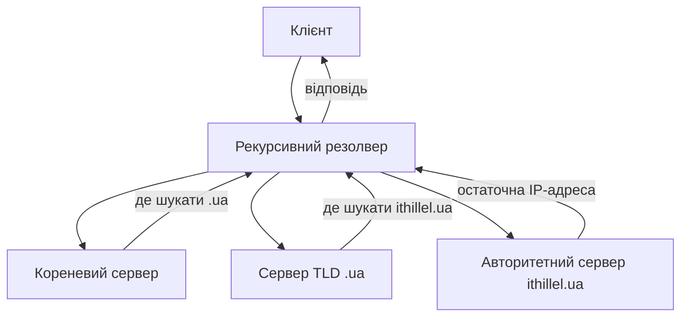

# DNS та прикладні протоколи: HTTP/3, TLS, QUIC, електронна пошта

> [!abstract]
> Ми будували знання знизу вгору – від кабелю до транспортного рівня – і нарешті дісталися прикладного рівня, того самого місця, де людина безпосередньо відчуває результат роботи всієї інфраструктури нижче. Розберемо DNS – службу, що перетворює зручні людині імена на IP-адреси, TLS – шифрування, без якого сьогодні неможливий жоден серйозний сайт, новий протокол QUIC, що лежить в основі HTTP/3, і протоколи електронної пошти.

## DNS: від імені до адреси

У лекції 1 ми зауважили: коли кажуть "інтернет упав", найчастіше мають на увазі саме збій DNS. Настав час зрозуміти, чому ця служба настільки критична. Комп'ютери маршрутизують трафік за IP-адресами (лекція 9, 11), а не за іменами, – але людині незручно й нереалістично пам'ятати послідовності цифр на кшталт 142.250.186.78 для кожного сайту, яким вона користується. **DNS (Domain Name System)** – розподілена служба, що перетворює зручні людині доменні імена (google.com, ithillel.ua) на IP-адреси, з якими вже може працювати мережевий рівень.

DNS організований **ієрархічно**, подібно до файлової системи з папками й підпапками, і саме ця ієрархія дозволяє системі масштабуватись до мільярдів доменних імен без єдиної центральної точки, що знала б абсолютно про все. На вершині ієрархії – **кореневі сервери (root servers)**, що знають, куди звернутись за інформацією про кожен домен верхнього рівня (**TLD, Top-Level Domain**) – `.com`, `.org`, `.ua` й подібні. Кожен TLD, у свою чергу, керується власними серверами, що знають, до яких **авторитетних серверів (authoritative servers)** конкретного домену (наприклад, google.com чи ithillel.ua) слід звернутись за фінальною, точною відповіддю саме для цього конкретного домену.

Коли ваш браузер хоче дізнатись IP-адресу якогось сайту, він звертається не напряму до всієї цієї ієрархії самостійно, а до **рекурсивного DNS-резолвера (recursive resolver)** – зазвичай це сервер вашого провайдера чи публічна служба на кшталт 8.8.8.8, яку ми вже кілька разів згадували в прикладах попередніх лекцій. Саме резолвер бере на себе всю "чорнову роботу" походу ієрархією: спершу запитує кореневий сервер, той підказує адресу сервера відповідного TLD, той – адресу авторитетного сервера конкретного домену, і лише авторитетний сервер дає остаточну, конкретну відповідь, яку резолвер повертає вашому браузеру.

Щоб не повторювати цей багатоступеневий процес для кожного окремого запиту (уявіть, наскільки повільним був би веб, якби кожне відкриття сторінки вимагало заново проходити всю ієрархію), результати активно **кешуються** на кожному етапі – і резолвером, і навіть самим браузером чи операційною системою, – на термін, визначений полем **TTL** у самому DNS-записі (той самий термін TTL, що й у лекції 9 для IP-пакетів, тут застосований до зовсім іншої речі – часу життя кешованого запису, а не кількості стрибків маршрутизації, – але спільна ідея "обмеженого часу дії, після якого потрібно перевірити заново" та сама).

DNS оперує кількома типами записів, з яких варто твердо запам'ятати чотири найпоширеніші. **A-запис** зіставляє доменне ім'я з IPv4-адресою. **AAAA-запис** (пригадайте IPv6 із лекції 12) зіставляє те саме ім'я з IPv6-адресою – сучасний сайт із подвійним стеком (dual stack, лекція 12) зазвичай має обидва типи записів одночасно. **CNAME-запис** – псевдонім, що вказує на інше доменне ім'я, а не безпосередньо на адресу (зручно, коли кілька імен мають вести до того самого фактичного сервера). **MX-запис** вказує, який поштовий сервер відповідає за прийом електронної пошти для цього домену, – до цього запису ми ще повернемось у розділі про електронну пошту нижче.

> [!info] Для допитливих
> DNS – ще один приклад практичного компромісу TCP проти UDP із лекції 10: типовий короткий запит-відповідь DNS історично й досі переважно йде через **UDP на порту 53** – швидко, без зайвих накладних витрат потрійного рукостискання, саме те, чого вимагає короткий, частий службовий запит. Але для більших відповідей (наприклад, коли відповідь не влазить у стандартний розмір UDP-дейтаграми, чи для спеціальних адміністративних операцій на кшталт передачі всієї зони між DNS-серверами) DNS автоматично переключається на **TCP**, де надійність і можливість передати більший обсяг даних важливіші за швидкість одиничного запиту, – наочна ілюстрація тези з лекції 10, що вибір транспортного протоколу залежить від конкретного сценарію, а не є жорстко зафіксованим раз і назавжди для всього протоколу.

## TLS: шифрування, без якого сьогодні немає вебу

Коли в лекції 4 ми говорили про рівень представлення моделі OSI, ми зазначили, що шифрування функціонально належить саме туди, хоча на практиці реалізується не окремим "чистим" рівнем 6, а конкретним протоколом – **TLS (Transport Layer Security)**. TLS вирішує три пов'язані задачі одночасно: **конфіденційність** (сторонній спостерігач у мережі не може прочитати вміст трафіку), **цілісність** (жоден зловмисник не може непомітно змінити дані в дорозі) і **автентифікацію сервера** (клієнт може бути впевнений, що спілкується справді з тим сервером, за який той себе видає, а не з підставним посередником).

Механіка TLS спирається на комбінацію двох різних типів криптографії. Спочатку сторони використовують **асиметричну криптографію** (пара математично пов'язаних відкритого й закритого ключів) для безпечного узгодження одного спільного секретного ключа, навіть попри те що весь цей початковий обмін відбувається відкритою, потенційно прослуховуваною мережею. Далі, коли спільний секретний ключ уже узгоджено, сторони переходять на значно швидшу **симетричну криптографію** (той самий ключ використовується і для шифрування, і для розшифрування) для фактичного шифрування всього подальшого обсягу даних сеансу, – асиметрична криптографія набагато повільніша обчислювально, тому її свідомо застосовують лише для короткого початкового узгодження, а не для шифрування всього трафіку сеансу цілком.

Автентифікація сервера забезпечується **цифровими сертифікатами**: сервер пред'являє клієнту сертифікат, підписаний довіреним **центром сертифікації (Certificate Authority, CA)** – організацією, чиї власні кореневі сертифікати вже заздалегідь вбудовані в кожен браузер і кожну операційну систему як апріорі довірені. Браузер перевіряє, що сертифікат сервера дійсно підписаний одним із цих довірених центрів, і саме на цій перевірці тримається вся модель довіри веб-шифрування – той самий значок замка́ в адресному рядку браузера, який ви бачите щодня.

**HTTPS** – це, по суті, звичайний протокол HTTP, обгорнутий у захищене TLS-з'єднання, і саме тому працює на іншому, окремому порту – **443** (той самий порт, який уже неодноразово фігурував у прикладах попередніх лекцій), на відміну від незашифрованого HTTP на порту 80.

## HTTP/3 і QUIC: коли транспортний рівень переосмислюють заново

У лекції 10 ми пообіцяли повернутись до цікавого повороту сюжету: сучасний протокол **HTTP/3** будується не поверх звичного TCP, а поверх нового транспортного протоколу **QUIC**, побудованого, у свою чергу, поверх UDP. Настав час розібратись, чому розробники пішли саме цим шляхом.

Проблема, яку розв'язує QUIC, називається **блокуванням початку черги (head-of-line blocking)**. Попередня версія протоколу, HTTP/2, уміла передавати кілька незалежних потоків даних (наприклад, кілька різних файлів однієї вебсторінки – стилі, скрипти, зображення) одночасно, мультиплексуючи їх в одному-єдиному TCP-з'єднанні. Але тут і криється проблема: TCP, як ми детально розглядали в лекції 10, гарантує *строго впорядковану* доставку даних усього з'єднання цілком, – а це означає, що якщо загубився хоча б один сегмент, що належить лише одному з багатьох мультиплексованих потоків, TCP змушений призупинити доставку *всіх* потоків одночасно, доки загублений сегмент не буде повторно переданий і отриманий, – навіть якщо дані решти, зовсім не постраждалих потоків давно вже прибули і чекають своєї черги на стороні одержувача.

QUIC вирішує цю проблему, будуючи власну надійність (аналог TCP-механізмів нумерації й підтвердження з лекції 10, тільки реалізованих самим протоколом QUIC, а не запозичених із TCP) окремо для *кожного окремого потоку* всередині одного з'єднання, а не для з'єднання загалом. Загублений сегмент одного потоку блокує лише цей конкретний потік, а решта потоків того самого з'єднання продовжують безперешкодно доставлятися й оброблятися, – саме тому побудова поверх UDP (де немає жодної вбудованої, нав'язаної впорядкованості з коробки, на відміну від TCP) виявилась не недоліком, а свідомою архітектурною перевагою: QUIC отримав змогу самостійно реалізувати саме ту гранулярність надійності, яка йому реально потрібна, замість того щоб миритись із грубішою, наскрізною гранулярністю, нав'язаною TCP.

Друга практична перевага QUIC – **швидше встановлення захищеного з'єднання**. У традиційній схемі TCP + окремий TLS потрібно спочатку виконати потрійне рукостискання TCP (лекція 10), а вже *після* нього – окремий, додатковий обмін повідомленнями TLS-рукостискання (розглянутий вище), тобто щонайменше два послідовні цикли обміну "туди-сюди" (round-trip), перш ніж узагалі можна почати передавати корисні дані. QUIC інтегрує встановлення захищеного з'єднання (на основі сучасної версії TLS 1.3) безпосередньо у власне рукостискання транспортного рівня, суттєво скорочуючи кількість цих обов'язкових обмінів "туди-сюди" перед першим переданим байтом корисних даних, – практично відчутна різниця в затримці, особливо помітна на мобільних з'єднаннях зі спочатку високою затримкою самого каналу.

> [!example] Приклад
> Ще одна практична перевага QUIC, яку варто знати як показовий приклад: QUIC-з'єднання ідентифікується унікальним **ідентифікатором з'єднання (Connection ID)**, а не комбінацією IP-адреси й порту, як традиційне TCP-з'єднання. Це означає, що коли ваш смартфон, тримаючи відкритим потоковий відеодзвінок, переходить з домашнього Wi-Fi на мобільну мережу (а отже, отримує зовсім нову IP-адресу), QUIC-з'єднання може *продовжити* працювати безперервно, використовуючи той самий Connection ID, – тоді як традиційне TCP-з'єднання в такому сценарії неминуче обірветься й потребуватиме повного повторного встановлення з нуля, з новим потрійним рукостисканням і новим TLS-рукостисканням.

> [!warning] Типова помилка
> Не варто робити висновок, що "QUIC/UDP тепер завжди краще за TCP" – коректніше сказати, що QUIC переосмислив, *які саме* гарантії надійності потрібні саме для сценарію сучасного вебу з багатьма паралельними потоками одного з'єднання, і реалізував саме ці, точніше підібрані гарантії самостійно, поверх мінімалістичного UDP, а не запозичив готові, грубіші гарантії TCP. Для багатьох інших сценаріїв (наприклад, простого файлового перенесення без мультиплексування кількох незалежних потоків) традиційний TCP залишається абсолютно доречним, простим і ефективним вибором – QUIC розв'язує конкретну проблему конкретного класу застосунків, а не є універсальною заміною TCP в усіх без винятку випадках.

## Протоколи електронної пошти

Завершимо огляд прикладного рівня протоколами електронної пошти – ще одним сервісом, яким ви користуєтесь щодня, здебільшого не замислюючись, скільки різних протоколів насправді бере участь у доставці одного листа.

**SMTP (Simple Mail Transfer Protocol)** відповідає за *відправлення* й *пересилання* пошти між поштовими серверами – саме SMTP-сервер вашого домену приймає лист від вашого поштового клієнта і, звертаючись до DNS (пригадайте **MX-запис**, згаданий на початку лекції, – саме він вказує, який сервер приймає пошту для домену одержувача), передає лист далі, серверу, відповідальному за домен одержувача.

Для *отримання* й *читання* пошти клієнтом застосовують інші протоколи, і тут варто чітко розрізняти два історично різні підходи. **POP3 (Post Office Protocol version 3)** – простіший, старіший підхід: поштовий клієнт завантажує листи із сервера на локальний пристрій і, типово (хоча це налаштовується), видаляє їх із сервера після завантаження, – зручно, коли пошту читають з одного-єдиного пристрою, але незручно, якщо потрібен доступ до тієї самої поштової скриньки з кількох пристроїв одночасно (телефон, ноутбук, робочий комп'ютер), бо лист, уже завантажений і видалений одним пристроєм, більше не буде доступний на інших. **IMAP (Internet Message Access Protocol)**, навпаки, тримає пошту централізовано на сервері й лише синхронізує стан (прочитано/не прочитано, папки, видалені листи) з кожним пристроєм клієнта, – саме тому сьогодні IMAP значно поширеніший за POP3, адже сучасний користувач майже завжди читає пошту з кількох різних пристроїв, очікуючи побачити той самий, узгоджений стан на кожному з них.

| Протокол | Роль | Типовий порт |
|---|---|---|
| SMTP | відправлення й пересилання пошти між серверами | 25 (між серверами), 587 (від клієнта) |
| POP3 | завантаження пошти на один пристрій, часто з видаленням із сервера | 110 (995 із TLS) |
| IMAP | синхронізація пошти між кількома пристроями | 143 (993 із TLS) |

## Прикладний рівень завершує картину

Ця лекція завершує модуль курсу, присвячений технологіям і протоколам: ми пройшли весь шлях від фізичного середовища передачі (лекція 2) до прикладних служб, якими користується безпосередньо людина. Зверніть увагу, наскільки прикладний рівень спирається буквально на кожен попередній рівень одночасно: DNS використовує UDP чи TCP (лекція 10) поверх IP (лекція 9); HTTPS використовує TCP і шифрування TLS; HTTP/3 переосмислює саму транспортну основу через QUIC поверх UDP; а електронна пошта спирається на той самий DNS через MX-записи для власної маршрутизації повідомлень. Наступний модуль курсу виходить за межі однієї організації в глобальний масштаб – глобальні мережі, провайдерів і сам інтернет як мережу мереж.

> [!exam] На іспиті
> Типові питання: а) описати ієрархію DNS і процес рекурсивного розв'язання імені в адресу; б) назвати призначення записів A, AAAA, CNAME, MX; в) пояснити роль асиметричної й симетричної криптографії в TLS-рукостисканні; г) пояснити проблему блокування початку черги в HTTP/2 над TCP і як саме QUIC її вирішує; д) порівняти POP3 та IMAP за принципом зберігання пошти.

## Завдання на занятті (20 хв)

1. Намалюйте (текстом чи схемою) повний шлях DNS-запиту для вигаданого домену `example.ua` – від клієнта через рекурсивний резолвер, кореневий сервер, сервер TLD `.ua`, до авторитетного сервера й назад.
2. У парі поясніть одне одному, чому асиметрична криптографія використовується в TLS лише для початкового узгодження ключа, а не для шифрування всього подальшого трафіку сеансу.
3. Змалюйте сценарій із трьома одночасними потоками даних HTTP/2 над TCP, де загублений сегмент одного потоку затримує решту, і поясніть, як той самий сценарій виглядав би над QUIC.
4. Обговоріть: чому IMAP став де-факто стандартом для більшості сучасних поштових сервісів, а POP3 сьогодні використовують значно рідше, спираючись на те, як люди фактично користуються поштою на кількох пристроях.

> [!question] Перевірте себе
> 1. Що робить рекурсивний DNS-резолвер, і чим його роль відрізняється від ролі авторитетного сервера?
> 2. Чим A-запис відрізняється від AAAA-запису, і який запис вказує сервер, відповідальний за прийом пошти домену?
> 3. Які три задачі одночасно розв'язує TLS?
> 4. Що таке блокування початку черги (head-of-line blocking) і чому воно виникає саме через гарантію строгого порядку доставки TCP?
> 5. Чим принципово відрізняється робота POP3 від роботи IMAP з погляду того, де фізично зберігається пошта?

## Назад
← [[courses/computer-networks/lectures/16-dynamichna-marshrutyzatsiia-ospf|Лекція 16. Динамічна маршрутизація OSPF]]

## Далі
→ [[courses/computer-networks/lectures/18-hlobalni-merezhi-wan|Лекція 18. Глобальні мережі WAN]]

## Література
- Cisco Networking Academy. *Introduction to Networks* (курс CCNA v7/v7.1) – розділ про DNS та прикладні протоколи.
- RFC 1035 (DNS), RFC 8446 (TLS 1.3), RFC 9000 (QUIC), RFC 9114 (HTTP/3).
- Tanenbaum A., Wetherall D. *Computer Networks*, 5th edition – розділ 7, "The Application Layer".
