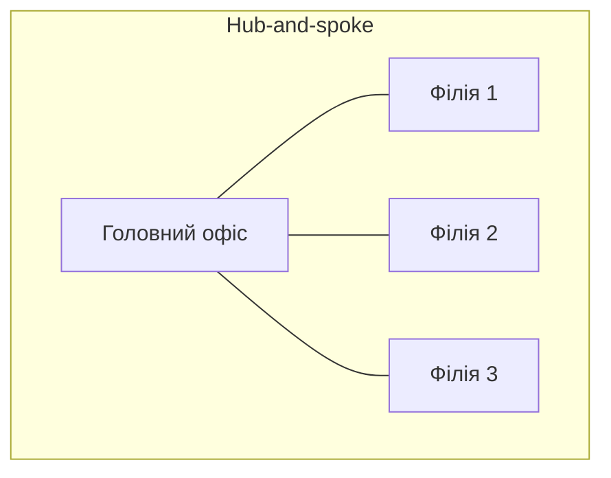
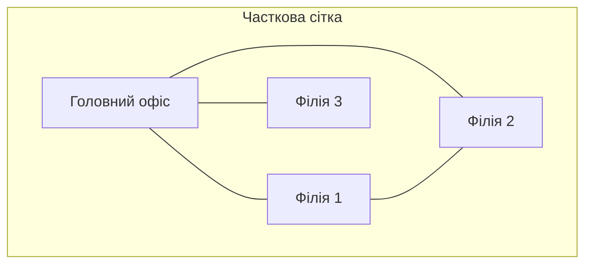

# Глобальні мережі: типи, провайдери, види підключення

> [!abstract]
> Досі ми будували мережу в межах однієї будівлі чи одного підприємства — там, де кожен кабель і кожен пристрій належить вам самим. Модуль про глобальні мережі виходить за цю межу: розберемо, чому WAN — це вже не питання прокладання кабелю, а питання оренди й контракту з провайдером, які типи підключень провайдери пропонують, як улаштована топологія глобальної мережі та якими каналами користувач і офіс сьогодні реально виходять в інтернет.

## Де закінчується LAN і починається WAN

У лекції 1 ми визначили WAN як мережу масштабу країн і континентів — і одразу зробили важливе застереження: LAN-мережу офісу ви можете спроєктувати й обслуговувати самостійно, повністю контролюючи кожен кабель, а WAN-мережу між містами вже не можете побудувати "з нуля" власними силами. Настав час розібратись, чому це так і що з цього практично випливає.

Прокласти власний оптичний кабель між двома офісами в межах одного міста теоретично можливо (хоча й дорого — потрібні дозволи на роботи в землі, прокладання траси через чужі ділянки, обслуговування). Прокласти власний кабель між Києвом і Львовом, а тим паче між Україною й дата-центром у Франкфурті, — для звичайного підприємства економічно й практично нереально: це вимагає прав на землю чи морське дно на всьому шляху, величезних капітальних витрат і десятиліть окупності. Тому на практиці підприємства не будують власну WAN-інфраструктуру, а **орендують** канали в спеціалізованих компаній — **провайдерів зв'язку (carriers, service providers)**, — які вже інвестували в магістральні оптичні лінії, супутники й міжнародні підводні кабелі та здають їхню пропускну здатність в оренду багатьом клієнтам одночасно, розподіляючи величезні капітальні витрати на весь ринок.

> [!definition] Визначення
> **WAN (Wide Area Network)** — мережа, що з'єднує географічно віддалені локальні мережі (LAN) через інфраструктуру, яка типово належить не самому підприємству, а провайдеру зв'язку та здається в оренду.

Це розмежування власності — хто фактично володіє кабелем і обладнанням на шляху сигналу — головна практична відмінність LAN від WAN, важливіша навіть за саму відстань. Саме тому в лекції 15, розглядаючи статичну маршрутизацію, ми вже мимохідь торкнулись цієї теми: маршрут за замовчуванням на межі мережі з провайдером — це, по суті, і є та точка, де закінчується інфраструктура, яку контролює підприємство, і починається інфраструктура провайдера.

## Хто такий провайдер і що таке "остання миля"

Щоб зрозуміти, як фізично влаштоване підключення офісу до глобальної мережі, варто розкласти шлях сигналу на три ділянки.

**Обладнання клієнта (CPE, Customer Premises Equipment)** — це те, що фізично стоїть в офісі клієнта: маршрутизатор, модем, іноді додатковий комутатор. Частина цього обладнання належить клієнту, частина (модем чи термінал провайдера) часто надається провайдером в оренду разом із послугою підключення.

**Точка демаркації (demarcation point, demarc)** — фізична межа відповідальності: усе, що до цієї точки, обслуговує провайдер, усе, що після неї, — клієнт. У побутовому прикладі домашнього інтернету демарк — це зазвичай розетка чи оптичний термінал на вводі в квартиру: якщо немає сигналу до цієї точки, викликають майстра провайдера, якщо немає сигналу після неї (наприклад, зламався домашній роутер), це вже турбота власника квартири.

**Остання миля (last mile)** — ділянка від найближчого вузла мережі провайдера до самого клієнта. Це історично найдорожча й найповільніша частина всього шляху сигналу, бо саме тут неможливо уникнути дублювання інфраструктури до кожного окремого будинку чи офісу, тоді як магістральні лінії між містами провайдер прокладає один раз і ділить між тисячами клієнтів одночасно. Саме варіативність технології "останньої милі" — те, чим переважно й відрізняються один від одного типи підключення, які ми розглянемо нижче.

Вузол, до якого підключається остання миля, зазвичай називають **точкою присутності провайдера (Point of Presence, PoP)** — це фізична локація (будівля, шафа з обладнанням), де провайдер приймає підключення клієнтів свого регіону й агрегує їхній трафік у власну магістральну мережу.

> [!info] Для допитливих
> Історично, коли WAN-з'єднання будувалися на послідовних (serial) синхронних лініях, а не на Ethernet, в цій схемі фігурували ще два терміни, які й досі трапляються в документації Cisco: **DTE (Data Terminal Equipment)** — кінцевий пристрій клієнта, типово маршрутизатор, і **DCE (Data Circuit-terminating Equipment)** — пристрій, що фактично генерує тактовий сигнал (clocking) на лінії, зазвичай обладнання провайдера (наприклад, CSU/DSU). Хто саме генерує тактування, було критично важливим для синхронізації сторін синхронного каналу зв'язку. Сьогодні абсолютна більшість нових WAN-підключень будується поверх Ethernet-сумісних технологій, де тактування вирішується інакше, тож терміни DTE/DCE трапляються здебільшого в підручниках і на старішому обладнанні — але якщо ви побачите команду на кшталт `clock rate` у налаштуванні послідовного інтерфейса Cisco, це саме звідси: команда явно призначає, яка сторона лінії відповідає за тактовий сигнал.

## Комутація каналів проти комутації пакетів: коротка історія вибору

У лекції 1 ми вже згадали комутацію пакетів як ідею, що лягла в основу ARPANET і всього сучасного інтернету. У контексті WAN варто явно протиставити її історичній альтернативі, яка домінувала до появи пакетних мереж, — **комутації каналів (circuit switching)**.

Класична телефонна мережа (PSTN, Public Switched Telephone Network) — приклад комутації каналів: коли ви телефонуєте, мережа встановлює **виділений, ексклюзивний канал** між вами й співрозмовником на весь час розмови, і цей канал повністю зарезервований лише для вас, навіть у ті секунди, коли обидва мовчите. Перевага такого підходу — гарантована, стабільна пропускна здатність і затримка на весь час з'єднання. Недолік — крайня неефективність використання каналу: якщо розмова триває з паузами (а будь-яка людська розмова саме така), зарезервована пропускна здатність під час пауз просто простоює, її не може позичити ніхто інший.

**Комутація пакетів (packet switching)**, навпаки, не резервує ексклюзивний канал — дані розбиваються на пакети (лекція 1, лекція 9), і кожен пакет мандрує спільною інфраструктурою, поділеною одночасно між багатьма користувачами, конкуруючи за пропускну здатність лише в момент фактичної передачі. Це набагато ефективніше використовує наявну інфраструктуру (простій одного користувача автоматично дає більше пропускної здатності іншим), але ціною втрати гарантії — саме тому в лекції 7 ми говорили про QoS як про механізм, що частково компенсує цю відсутність гарантій для чутливого до затримки трафіку (голос, відео) у пакетній мережі.

> [!example] Приклад
> Історично підприємства орендували в провайдерів так звані **виділені лінії (leased lines)** — фізичні або логічні канали типу "точка-точка" з гарантованою, незмінною пропускною здатністю, доступні клієнту цілодобово й виключно для нього (класичні приклади — лінії T1/E1 чи пізніші оптичні канали SDH/SONET). Це, по суті, комутація каналів у застосуванні до постійного корпоративного з'єднання: дорого, але передбачувано. Технології на кшталт **Frame Relay**, популярні в 1990-х, стали проміжним кроком — пакетна комутація, що при цьому емулювала для клієнта відчуття виділених віртуальних каналів між кількома офісами дешевше за справжні фізичні виділені лінії до кожного з них. Сьогодні Frame Relay практично повністю витіснений сучаснішою технологією — **MPLS (Multiprotocol Label Switching)**, яку більшість провайдерів використовує як основу для корпоративних WAN-послуг: MPLS дозволяє провайдеру гарантувати клієнту передбачувані затримки й пріоритезацію трафіку (той самий QoS) поверх спільної пакетної інфраструктури, поєднуючи ефективність комутації пакетів із частиною передбачуваності, властивої колишнім виділеним лініям.

## Топологія WAN: як з'єднати кілька офісів

У лекції 1 ми розглянули базові топології — зірку, повну й часткову сітку, ієрархію — стосовно локальної мережі. Ті самі принципи застосовні й до WAN, тільки тепер вузлами схеми виступають цілі офіси чи філії, а не окремі комп'ютери, і кожен зв'язок між вузлами — це вже не безкоштовний метр кабелю в межах будівлі, а платний, орендований у провайдера канал.

**Точка-точка (point-to-point)** — найпростіший варіант: прямий канал між рівно двома точками, наприклад головним офісом і однією філією. Дешево й просто для двох локацій, але не масштабується: якщо офісів багато, кожна нова пара потребує окремого каналу.

**Зірка / hub-and-spoke** — усі філії ("spokes") з'єднані окремими каналами з одним центральним офісом ("hub"), зазвичай головним офісом чи центральним дата-центром компанії. Це домінантна топологія корпоративних WAN, бо витрати на канали ростуть лінійно з кількістю філій (по одному каналу на кожну), а не квадратично, як у повній сітці. Плата за цю економію — якщо двом філіям потрібно обмінюватись даними безпосередньо між собою, трафік усе одно змушений проходити транзитом через центральний hub, що додає зайву затримку й навантажує канал і сам hub.

**Повна чи часткова сітка (mesh)** — філії з'єднані безпосередньо одна з одною, без обов'язкового транзиту через центральний вузол. Дорожче (більше каналів = більше орендної плати), але усуває проблему транзиту через hub і підвищує відмовостійкість: вихід з ладу одного каналу чи навіть цілого hub-офісу не ізолює решту філій одну від одної. На практиці частіше зустрічається саме часткова сітка — з'єднують безпосередньо лише ті філії, між якими справді регулярно й у великому обсязі йде трафік, а решту залишають за hub-and-spoke.

> [!warning] Типова помилка
> Не варто думати, що вибір топології WAN — це виключно питання "скільки коштує". Топологія hub-and-spoke створює **єдину точку відмови** не лише для доступу центрального офісу до кожної окремої філії, а й для зв'язку філій між собою: якщо канал до головного офісу впаде, дві сусідні філії втратять зв'язок одна з одною, навіть якщо фізично вони перебувають за кілька кілометрів. Обираючи топологію, потрібно зважати не лише на бюджет, а й на те, наскільки критичним є прямий зв'язок між конкретними парами локацій, — саме такий компроміс "вартість проти надійності" ми вже розглядали для локальних топологій в лекції 1, і тут він застосовується в набагато дорожчому масштабі.

## Види підключення до провайдера сьогодні

Історичні технології (виділені лінії T1/E1, Frame Relay, комутовані модемні з'єднання через PSTN) сьогодні здебільшого поступилися сучаснішим варіантам "останньої милі". Розглянемо ті, з якими реально стикається сучасний мережевий інженер.

**DSL (Digital Subscriber Line).** Використовує вже наявну мідну телефонну лінію (той самий кабель, що колись обслуговував PSTN-телефонію), передаючи дані в частотному діапазоні, не зайнятому голосовим сигналом. Дешево, бо не вимагає нової прокладки кабелю, — але швидкість сильно залежить від відстані до найближчої станції провайдера й якості старої мідної лінії, тому сьогодні DSL здебільшого застосовується там, де ще немає альтернативи.

**Кабельне підключення (cable, DOCSIS)** — через ту саму інфраструктуру, якою традиційно постачали кабельне телебачення (коаксіальний кабель). Швидше за типовий DSL, але пропускна здатність між абонентами одного кабельного сегмента історично поділяється, тож у години пікового навантаження району реальна швидкість може падати.

**Оптоволокно до будинку (FTTH, Fiber to the Home, часто на технології GPON)** — сьогодні технологія вибору там, де вона доступна: висока пропускна здатність в обидва боки, низька затримка, стійкість до електромагнітних завад (пригадайте переваги оптики з лекції 2). Основне практичне обмеження — вартість і час прокладання самого оптичного кабелю до кожної конкретної будівлі, тобто знову та сама проблема "останньої милі".

**Бездротові WAN-технології** — мобільний зв'язок (4G LTE, 5G) і супутниковий інтернет. Мобільний зв'язок дедалі частіше використовують не лише для телефонів, а і як основний чи резервний канал для невеликого офісу чи навіть як WAN-канал для IoT-пристроїв (лекція 1) там, де прокладання кабелю економічно невиправдане. Супутниковий інтернет історично мав репутацію повільного й з великою затримкою (пригадайте приклад із лекції 1: широкий канал, але велика затримка через фізичну відстань до орбіти) — але сучасні низькоорбітальні супутникові системи (LEO, Low Earth Orbit, найвідоміший приклад — Starlink) суттєво знизили затримку порівняно з класичними геостаціонарними супутниками саме завдяки значно нижчій орбіті, і сьогодні реально конкурують із наземними технологіями там, де прокладати кабель узагалі неможливо чи невиправдано дорого.

**Metro Ethernet і MPLS L3VPN** — послуги рівня підприємства, а не побутового користувача: провайдер надає з'єднання, що на клієнтському обладнанні виглядає як звичайний Ethernet-порт (простий, знайомий інтерфейс, ніякого спеціального обладнання на кшталт колишніх CSU/DSU), але фактично працює поверх магістральної MPLS-мережі провайдера, часто з гарантованим SLA (Service Level Agreement — контрактні зобов'язання щодо пропускної здатності, затримки й часу відновлення після збою). Саме такі послуги типово орендують для з'єднання офісів між собою чи для підключення до хмарного провайдера, про що детальніше поговоримо в лекції 22 про хмарні мережі VPC.

| Тип підключення | Середовище | Типова швидкість | Затримка | Типове застосування |
|---|---|---|---|---|
| DSL | мідна телефонна пара | низька-середня | середня | там, де немає альтернативи |
| Кабельне (DOCSIS) | коаксіальний кабель | середня-висока | низька-середня | побутове й малий офіс |
| FTTH / GPON | оптичне волокно | висока | низька | побутове й офіс, де доступне |
| Мобільний 4G/5G | радіо | середня-висока | низька-середня | резерв, віддалені локації, IoT |
| Супутник LEO | радіо/космос | середня | низька (LEO) / висока (геостаціонарні) | немає наземної альтернативи |
| Metro Ethernet / MPLS L3VPN | оптика провайдера | висока, гарантована SLA | низька, гарантована SLA | з'єднання офісів підприємства |

## Куди це веде далі

Ця лекція описала *фізичний і комерційний* рівень глобальних мереж — хто володіє інфраструктурою, якими каналами й на яких умовах підприємство виходить за межі власної LAN. Але сам факт наявності фізичного каналу до провайдера ще не пояснює одну ключову річ: як саме пакет, надісланий вашим офісом, фізично знаходить шлях через мережі *десятків різних провайдерів*, щоб дістатись сервера десь на іншому континенті. Внутрішньою маршрутизацією всередині мережі одного провайдера чи одного підприємства займаються протоколи на кшталт OSPF, розглянутого в лекції 16, — але між *різними*, незалежними одна від одної організаціями (кожна такий незалежний домен маршрутизації називають **автономною системою**) потрібен зовсім інший протокол, здатний узгоджувати маршрути на масштабі всього інтернету. Саме цьому — протоколу **BGP** — присвячена наступна лекція. А після BGP ми розглянемо, як підприємство захищає трафік, що йде через оренду чужу, потенційно недовірену інфраструктуру провайдера, — за допомогою VPN (лекція 20), і як сучасні підходи SD-WAN (лекція 21) переосмислюють саме той компроміс "hub-and-spoke проти повної сітки", який ми щойно розглянули, керуючи вибором шляху програмно й динамічно, а не фіксованою топологією каналів.

> [!exam] На іспиті
> Типові питання: а) пояснити, чому підприємства орендують WAN-канали в провайдерів, а не будують власну інфраструктуру; б) дати визначення "останньої милі" та точки демаркації; в) порівняти комутацію каналів і комутацію пакетів на конкретному прикладі; г) порівняти топології hub-and-spoke й (частково) повної сітки для WAN за критеріями вартості й відмовостійкості; д) перелічити сучасні типи підключення "останньої милі" та коротко охарактеризувати кожен.

## Завдання на занятті (20 хв)

1. Компанія має головний офіс у Києві та три філії — у Львові, Одесі й Харкові. Намалюйте (текстом чи схемою) WAN-топологію hub-and-spoke для цієї компанії й порахуйте, скільки каналів знадобиться. Потім порахуйте, скільки каналів знадобилося б для повної сітки між тими самими чотирма локаціями.
2. У парі обговоріть: філії у Львові й Одесі активно обмінюються даними між собою (спільний склад товарів), а з Харковом — рідко. Як це має вплинути на вибір WAN-топології з попереднього завдання?
3. Для сценарію невеликого офісу в новобудові, куди ще не дотягнули оптику, а мідна телефонна лінія вже є, обґрунтуйте вибір типу підключення "останньої милі" з-поміж розглянутих у таблиці, з урахуванням і резервного каналу на випадок аварії основного.
4. Поясніть словами, чому Frame Relay історично називають "проміжним кроком" між виділеними лініями й сучасним MPLS, спираючись на різницю між комутацією каналів і комутацією пакетів.

> [!question] Перевірте себе
> 1. Чим принципово відрізняється володіння інфраструктурою в LAN від володіння інфраструктурою в WAN?
> 2. Що таке точка демаркації і чому вона важлива для розмежування відповідальності між клієнтом і провайдером?
> 3. У чому головна відмінність комутації каналів від комутації пакетів з погляду використання пропускної здатності?
> 4. Яка головна перевага топології hub-and-spoke над повною сіткою для WAN, і яка ціна цієї переваги?
> 5. Назвіть щонайменше три сучасні типи підключення "останньої милі" та по одній ситуації, де кожен із них був би доречним вибором.

## Назад
← [[courses/computer-networks/lectures/17-dns-ta-prykladni-protokoly|Лекція 17. DNS та прикладні протоколи]]

## Далі
→ [[courses/computer-networks/lectures/19-bgp-ta-marshrutyzatsiia-v-interneti|Лекція 19. BGP та маршрутизація в інтернеті]]

## Література
- Cisco Networking Academy. *Introduction to Networks* / *Connecting Networks* (курс CCNA v7/v7.1) — розділи про WAN-концепції та підключення.
- Одом У. *Officially Licensed Cert Guide CCNA 200-301* — розділ про WAN-технології.
- Tanenbaum A., Wetherall D. *Computer Networks*, 5th edition — розділ 2, "The Physical Layer" (частина про WAN та провайдерів).
