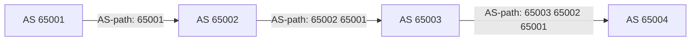

# BGP та маршрутизація в інтернеті

> [!abstract]
> У попередній лекції ми зупинились на кордоні однієї організації: OSPF (лекція 16) чудово будує таблицю маршрутизації всередині мережі підприємства, але зовсім не призначений для узгодження маршрутів між тисячами незалежних, часто конкуруючих одна з одною організацій, з яких фактично й складається інтернет. Розберемо протокол **BGP** – те, що дозволяє пакету знайти шлях через мережі десятків різних провайдерів, і зрозуміємо, чому цей протокол побудований на принципово інших засадах, ніж усе, що ми розглядали дотепер.

## Автономна система: одиниця, якою оперує BGP

У фіналі лекції 18 ми ввели поняття, яке зараз стане центральним, – **автономну систему (Autonomous System, AS)**: незалежний домен маршрутизації, що перебуває під єдиним адміністративним керуванням і має власну, узгоджену політику маршрутизації. Автономною системою може бути мережа великого провайдера, мережа університету, мережа банку – будь-яка організація, що самостійно керує власним внутрішнім маршрутизаційним рішенням (типово за допомогою якогось IGP на кшталт OSPF, лекція 16) і при цьому підключена до інтернету достатньо незалежно, щоб мати сенс обмінюватись маршрутною інформацією з іншими такими самими організаціями напряму.

Кожна автономна система має унікальний, глобально зареєстрований числовий ідентифікатор – **номер автономної системи (ASN)**. Історично ASN був 16-бітним числом (діапазон 1–65535), але оскільки кількість автономних систем в інтернеті давно перевищила цей запас, сьогодні стандартом є 32-бітний ASN, що дозволяє мільярди унікальних значень. Видачею ASN та блоків публічних IP-адрес організаціям у своєму регіоні опікуються **регіональні інтернет-реєстратори (RIR, Regional Internet Registry)** – для України та решти Європи це **RIPE NCC**; аналогічні організації існують для Північної Америки (ARIN), Азійсько-Тихоокеанського регіону (APNIC) та інших регіонів світу.

> [!definition] Визначення
> **Автономна система (AS)** – сукупність мереж під єдиним адміністративним керуванням і з єдиною політикою маршрутизації, що має власний, глобально унікальний номер (ASN) і обмінюється маршрутною інформацією з іншими автономними системами через BGP.

## IGP проти EGP: два принципово різні завдання

Наприкінці лекції 16 ми навмисно залишили відкритим запитання: як домовляються між собою маршрутизатори *різних* організацій? Настав час дати повну відповідь, розділивши протоколи маршрутизації на дві категорії за масштабом їхньої дії.

**IGP (Interior Gateway Protocol)** – протоколи, призначені для маршрутизації *всередині* однієї автономної системи. Саме до цієї категорії належить OSPF, розглянутий у попередній лекції, – його завдання: якнайшвидше й найточніше обчислити оптимальний шлях у межах мережі, якою повністю керує одна організація.

**EGP (Exterior Gateway Protocol)** – протоколи для маршрутизації *між* автономними системами. Сьогодні практично єдиним реально вживаним протоколом цієї категорії у всьому інтернеті є **BGP (Border Gateway Protocol)** – настільки домінантним, що термін EGP на практиці майже завжди означає саме BGP.

| | IGP (OSPF) | EGP (BGP) |
|---|---|---|
| Масштаб дії | всередині однієї AS | між автономними системами |
| Мета вибору шляху | найкоротший, найшвидший шлях | шлях, що відповідає бізнес-політиці |
| Виявлення сусідів | автоматичне (multicast Hello) | ручне налаштування |
| Основа рішення | вартість (cost), пропускна здатність | атрибути шляху й адміністративна політика |
| Типовий масштаб таблиці | десятки-сотні записів | понад 900 000 префіксів (повна таблиця інтернету) |

Останній рядок цієї таблиці варто підкреслити окремо: OSPF у лекції 16 ми запускали для мережі з трьох маршрутизаторів і кількох підмереж – цілком посильне завдання для алгоритму SPF. BGP-маршрутизатор, що тримає **повну таблицю маршрутизації інтернету (full internet routing table)**, повинен утримувати й обробляти понад 900 тисяч окремих записів про мережі з усього світу, – цей масштаб сам собою пояснює, чому BGP не міг би працювати за тими самими принципами, що й OSPF, навіть якби хтось спробував це зробити.

## Чому BGP – це третій, окремий тип протоколу

У лекції 16 ми розділили протоколи динамічної маршрутизації на дистанційно-векторні й link-state. BGP не належить жодній із цих двох категорій – це протокол третього типу, **path-vector (векторно-шляховий)**.

Ідея path-vector близька до дистанційно-векторної (маршрутизатор ділиться із сусідом готовим висновком, а не повною картою мережі, як у link-state), але з ключовою відмінністю: замість простого числа-відстані (кількості стрибків) BGP-маршрутизатор передає сусіду весь **список автономних систем**, через які вже пройшло оголошення про конкретну мережу, – атрибут, який називають **AS-шляхом (AS-path)**. Отримавши оголошення про мережу з певним AS-шляхом, маршрутизатор, перш ніж поширити це оголошення далі, додає до AS-шляху номер власної автономної системи.

Цей на перший погляд дрібний нюанс розв'язує одразу дві задачі. По-перше, довжина AS-шляху (кількість автономних систем у списку) – природний, хоч і грубий орієнтир "наскільки далекий" цей маршрут, аналогічний метриці в інших протоколах. По-друге, і найважливіше – AS-шлях автоматично запобігає маршрутизаційним петлям у масштабі, де жоден маршрутизатор фізично не в змозі побудувати повну карту мережі, як це робить OSPF через SPF: якщо маршрутизатор автономної системи X отримує BGP-оголошення, в AS-шляху якого вже фігурує номер його власної AS X, він одразу відкидає це оголошення – очевидна ознака, що воно вже якимось чином пройшло через його власну мережу раніше й повернулося назад по колу.



> [!example] Приклад
> На схемі вище AS 65001 оголошує власну мережу сусідній AS 65002. AS 65002 поширює це оголошення далі, до AS 65003, попередньо додавши власний номер до AS-шляху – тепер шлях виглядає як "65002 65001", тобто "щоб дістатись цієї мережі, пакет пройде через AS 65002, а потім через AS 65001". Якби AS 65003 з якоїсь причини передала це саме оголошення назад до AS 65001 (наприклад, через якусь нетипову, кільцеву топологію зв'язків між провайдерами), AS 65001 побачила б власний номер уже присутнім в AS-шляху отриманого оголошення й одразу відкинула б його, – так само надійно запобігаючи петлі, як link-state підхід OSPF, тільки зовсім іншим, набагато простішим механізмом, доречним саме для масштабу, де побудова повної карти мережі нереалістична.

## eBGP і iBGP: два різновиди однієї суміжності

BGP-сусідство, на відміну від автоматичного виявлення сусідів через multicast Hello в OSPF, завжди налаштовується **вручну**: адміністратор явно вказує IP-адресу конкретного сусіда (**peer**), з яким має встановитись BGP-з'єднання, – сам протокол не намагається "розвідати" потенційних сусідів самостійно. Таке ручне налаштування – свідоме архітектурне рішення: BGP-сусідство часто перетинає межу між організаціями з різними, іноді комерційно конкурентними інтересами, тому автоматичне, без явної згоди обох сторін встановлення такого зв'язку було б і небезпечним, і практично безглуздим.

Саме BGP-з'єднання встановлюється поверх звичайного TCP-з'єднання на порту **179** (пригадайте TCP з лекції 10 – тут він застосований не для передачі файлу чи сторінки, а для надійного, впорядкованого обміну маршрутними оголошеннями між двома BGP-маршрутизаторами).

Залежно від того, чи належать два BGP-сусіди тій самій автономній системі, розрізняють два режими роботи.

**eBGP (External BGP)** – сусідство між маршрутизаторами *різних* автономних систем, типовий сценарій підключення мережі підприємства до провайдера чи двох провайдерів одне до одного. Саме eBGP і виконує ту функцію, заради якої протокол взагалі існує, – обмін маршрутами між незалежними організаціями.

**iBGP (Internal BGP)** – сусідство між маршрутизаторами *в межах тієї самої* автономної системи. Навіщо взагалі потрібен BGP усередині однієї організації, якщо для цього вже є OSPF? Річ у тім, що у великій AS (наприклад, мережі провайдера) BGP-маршрути, отримані через eBGP на одному прикордонному маршрутизаторі, часто потрібно донести до інших прикордонних маршрутизаторів тієї самої компанії, розташованих в інших точках присутності (лекція 18), – а самі ці маршрути, з їхніми BGP-специфічними атрибутами (AS-шлях і рештою, розглянутою нижче), OSPF передавати не вміє й не повинен: OSPF відповідає за внутрішню топологію мережі, а не за перенесення інформації про сотні тисяч зовнішніх мереж усього інтернету. iBGP і OSPF в такій організації працюють одночасно, кожен вирішуючи свою частину задачі: OSPF забезпечує внутрішню зв'язність (як дістатись від одного прикордонного маршрутизатора до іншого фізично), а iBGP переносить самі BGP-маршрути між цими прикордонними маршрутизаторами.

## Як BGP обирає найкращий шлях: політика, а не тільки відстань

Тут BGP розходиться з OSPF найпринциповіше. OSPF обирає шлях виключно за об'єктивним критерієм – найменшою сумарною вартістю (cost), пов'язаною з пропускною здатністю каналів (лекція 16). BGP, натомість, ухвалює рішення на основі складнішого, багатоступеневого **процесу вибору найкращого шляху (BGP best path selection)**, що враховує десяток різних атрибутів по черзі, – і принципово важливо розуміти: більшість цих атрибутів відображають не фізичну "довжину" шляху, а **бізнес-політику** організації, що ухвалює рішення.

Причина такого підходу – пряме продовження теми провайдерів і комерційних відносин між ними з лекції 18: два провайдери, що з'єднані одне з одним, можуть перебувати в різних комерційних стосунках – один платить іншому за **транзит (transit)** – тобто за доступ до решти інтернету через мережу партнера, – або обидва домовились про безкоштовний **пірінг (peering)**, обмінюючись лише трафіком між власними клієнтами без оплати одне одному. Провайдер зазвичай зацікавлений спрямовувати трафік шляхом, який комерційно вигідніший для нього самого (наприклад, безкоштовним пірінговим зв'язком, а не платним транзитним), навіть якщо технічно існує коротший за кількістю стрибків альтернативний шлях через іншого партнера, – і саме для вираження таких бізнес-переваг у BGP існують спеціальні, налаштовувані вручну атрибути.

Не заглиблюючись у повний список атрибутів (це вже предмет вужчих сертифікацій на кшталт CCNP), варто твердо запам'ятати три найважливіші, у порядку пріоритету, який застосовує сам процес вибору:

**Weight** – атрибут, значущий лише локально на самому маршрутизаторі Cisco (не передається сусідам), найвищий пріоритет у процесі вибору; типово використовується, щоб проста локальна політика одного пристрою переважила все інше.

**Local Preference** – атрибут, що поширюється на всі маршрутизатори *в межах однієї AS* (тобто через iBGP), дозволяючи всій організації одноголосно "проголосувати" за перевагу одного зовнішнього шляху над іншим – типовий сценарій: організація з двома підключеннями до різних провайдерів встановлює вищий Local Preference для дешевшого чи надійнішого з двох підключень.

**AS-path length** – довжина AS-шляху, розглянута вище; застосовується лише тоді, коли жоден з атрибутів вищого пріоритету (Weight, Local Preference та кілька інших, що виходять за межі цієї лекції) не дав однозначної відповіді, – і саме цей факт варто зафіксувати як головний практичний висновок розділу: BGP не є "протоколом найкоротшого шляху" у тому сенсі, у якому ним є OSPF, – це передусім **протокол політики**, де довжина шляху – лише один із критеріїв, і далеко не завжди вирішальний.

> [!warning] Типова помилка
> Найпоширеніша помилкова інтуїція студентів, які щойно розібрались з OSPF, – очікувати, що BGP так само "просто обирає найкоротший шлях". Це працює лише тоді, коли жодна зі сторін не налаштувала явну політику (Weight, Local Preference та інші атрибути) – у реальному інтернеті провайдери майже завжди налаштовують таку політику свідомо, тому BGP-трафік нерідко реально йде довшим за кількістю AS-стрибків, але комерційно вигіднішим чи надійнішим шляхом, а не найкоротшим формально можливим.

## Базове налаштування eBGP

Розглянемо мінімальний приклад: маршрутизатор R1 клієнта (AS 65001) підключений до маршрутизатора ISP провайдера (AS 65010) і оголошує провайдеру власну мережу 192.168.1.0/24.

```text
R1(config)# router bgp 65001
R1(config-router)# neighbor 203.0.113.1 remote-as 65010
R1(config-router)# network 192.168.1.0 mask 255.255.255.0
R1(config-router)# exit
```

Команда `router bgp 65001` вмикає процес BGP і одразу задає номер *власної* автономної системи маршрутизатора – на відміну від `router ospf 1` з лекції 16, де число після `ospf` було лише локальним ідентифікатором процесу без глобального значення, тут число 65001 – це справжній, значущий ASN. Команда `neighbor 203.0.113.1 remote-as 65010` вручну (як і зазначалося вище – без жодного автоматичного виявлення) вказує адресу сусіда й номер *його* автономної системи; саме різні номери AS у власній команді `router bgp` та в команді `neighbor` й визначають, що це буде eBGP-сусідство, а не iBGP. Команда `network` вказує, яку саме локальну мережу слід оголосити BGP-сусідам, – синтаксично схожа на однойменну команду OSPF, але змістовно означає геть інше: тут це не "увімкнути протокол на цьому інтерфейсі", а буквально "додати цей конкретний префікс до списку мереж, які ми самі оголошуємо назовні".

Перевірити стан сусідства можна командою `show ip bgp summary` (аналог `show ip ospf neighbor` з попередньої лекції – перше, що варто перевірити, якщо очікуваний BGP-маршрут не з'являється), а повну BGP-таблицю з усіма отриманими маршрутами й атрибутами – командою `show ip bgp`.

## Крихкість довіри: чому BGP уразливий

Варто явно проговорити практичний наслідок того, що BGP оперує довірою між незалежними організаціями, а не технічною перевіркою. Коли автономна система оголошує сусідам "я знаю шлях до мережі X", протокол за замовчуванням **не перевіряє**, чи ця автономна система дійсно має право оголошувати саме цю мережу. Помилкове (через людську помилку) чи зловмисне оголошення чужого IP-префікса називають **захопленням маршруту (BGP hijacking)** – і оскільки процес вибору найкращого шляху, розглянутий вище, часто віддає перевагу коротшому AS-шляху за інших рівних умов, зловмисне оголошення, що виглядає "ближчим", може реально перетягнути на себе частину світового трафіку до атакованої мережі, поки помилку не виявлять і не виправлять вручну. Сучасний захист від цієї проблеми – інфраструктура **RPKI (Resource Public Key Infrastructure)**, що криптографічно підтверджує, якій саме автономній системі дозволено оголошувати конкретний IP-префікс, – тему мережевої безпеки в ширшому контексті, включно з подібними атаками, ми розглянемо детальніше в лекції 42.

## BGP завершує картину глобальної маршрутизації

Разом лекції 16 і 19 дають повну відповідь на запитання, як пакет знаходить шлях від будь-якого відправника до будь-якого одержувача в інтернеті: OSPF (чи інший IGP) веде пакет усередині кожної окремої автономної системи, а BGP з'єднує ці автономні системи між собою в єдину, глобально узгоджену систему – саме тому інтернет і визначають як "мережу мереж", а не як одну велику мережу. Наступна лекція звертається до питання, яке природно випливає з усього щойно розглянутого: якщо трафік іде через інфраструктуру десятків чужих, недовірених автономних систем, як гарантувати, що ніхто з посередників не прочитає й не підмінить дані в дорозі, – саме для цього й існує **VPN**, до якого ми переходимо в лекції 20.

> [!exam] На іспиті
> Типові питання: а) дати визначення автономної системи й пояснити роль ASN; б) розрізнити IGP та EGP і навести приклад кожного; в) пояснити, чому BGP класифікують як path-vector протокол, і як AS-шлях запобігає петлям; г) розрізнити eBGP та iBGP; д) пояснити, чому вибір найкращого шляху в BGP керується передусім політикою, а не найкоротшою відстанню, навести роль атрибутів Weight, Local Preference, AS-path length; е) коротко описати проблему BGP hijacking.

## Завдання на занятті (20 хв)

1. Намалюйте схему з чотирма автономними системами AS 100 – AS 200 – AS 300 – AS 400, з'єднаними послідовно, і розпишіть, який AS-шлях бачитиме AS 400 для мережі, що належить AS 100, після проходження оголошення через усі проміжні автономні системи.
2. У парі поясніть одне одному, чому в наведеній вище схемі AS 100 автоматично відкине оголошення, якщо воно якимось чином повернеться до неї з AS-шляхом, що вже містить номер 100.
3. Компанія має два підключення до інтернету – до провайдера А (дешевший, але менш надійний канал) і провайдера Б (дорожчий, стабільніший). Обговоріть, яким атрибутом BGP (Weight чи Local Preference) і чому варто скористатись, щоб уся мережа компанії віддавала перевагу провайдеру Б для вихідного трафіку.
4. Порівняйте усно вивід команди `show ip ospf neighbor` (лекція 16) і `show ip bgp summary` – що спільного в призначенні цих двох команд, попри те що вони належать до зовсім різних протоколів?

> [!question] Перевірте себе
> 1. Що таке автономна система і хто в Європі відповідає за видачу номерів ASN?
> 2. Чим IGP принципово відрізняється від EGP за масштабом дії, і до якої категорії належить OSPF, а до якої – BGP?
> 3. Що таке AS-шлях (AS-path) і як саме він запобігає маршрутизаційним петлям без побудови повної карти мережі?
> 4. Чим iBGP відрізняється від eBGP, і навіщо великій автономній системі взагалі потрібен iBGP, якщо в неї вже є OSPF?
> 5. Назвіть три атрибути, що впливають на вибір найкращого шляху в BGP, у порядку пріоритету, і поясніть, чому цей вибір частіше визначається політикою, а не найкоротшою відстанню.

## Назад
← [[courses/computer-networks/lectures/18-hlobalni-merezhi-wan|Лекція 18. Глобальні мережі WAN]]

## Далі
→ [[courses/computer-networks/lectures/20-vpn-ipsec-ta-wireguard|Лекція 20. VPN IPsec та WireGuard]]

## Література
- Cisco Networking Academy. *Connecting Networks* (курс CCNA v7/v7.1) – вступний розділ про BGP.
- RFC 4271 (A Border Gateway Protocol 4, BGP-4).
- Одом У. *Officially Licensed Cert Guide CCNA 200-301* – розділ про основи BGP.
- RIPE NCC – офіційна документація про видачу ASN та політику маршрутизації в європейському регіоні.
