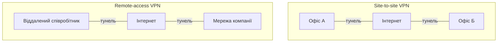
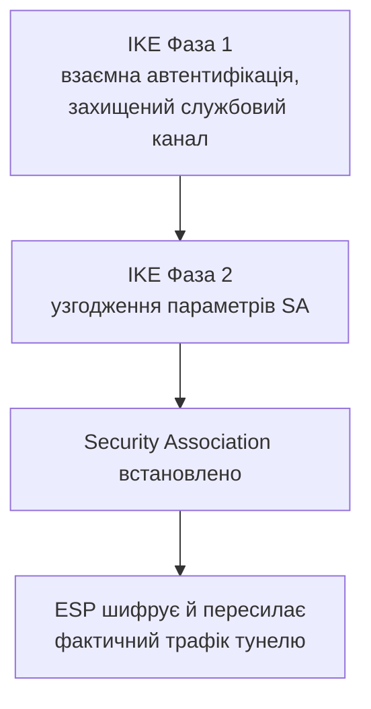

# VPN: IPsec та WireGuard – побудова й налаштування тунелів

> [!abstract]
> У попередній лекції ми з'ясували незручну істину: трафік між офісами компанії, з'єднаними через інтернет, проходить крізь інфраструктуру десятків чужих, незалежних і формально недовірених автономних систем, кожна з яких теоретично могла б підслухати чи підмінити дані в дорозі. Розберемо VPN – технологію, що розв'язує саме цю проблему, будуючи захищений тунель поверх недовіреної мережі, і порівняємо два підходи до її реалізації: усталений, багатофункціональний IPsec і сучасний, свідомо мінімалістичний WireGuard.

## Навіщо потрібен VPN: два різні сценарії, одна ідея

**VPN (Virtual Private Network)** розв'язує задачу, сформульовану в підсумку попередньої лекції: як гарантувати конфіденційність і цілісність трафіку, що змушений проходити через мережу, якою ви не керуєте й не довіряєте автоматично, – типово через публічний інтернет. Ідея VPN – створити поверх цієї недовіреної мережі **тунель**: логічне з'єднання, усередині якого трафік зашифрований і захищений від стороннього втручання, попри те що фізично він усе одно проходить через ту саму, нічим не змінену чужу інфраструктуру.

> [!definition] Визначення
> **VPN (Virtual Private Network)** – технологія, що створює захищене логічне з'єднання (тунель) поверх недовіреної мережі, забезпечуючи конфіденційність і цілісність даних, які цим тунелем передаються.

На практиці VPN застосовують у двох принципово різних сценаріях, і варто чітко їх розрізняти з самого початку.

**Site-to-site VPN** з'єднує дві мережі цілих офісів через інтернет, замінюючи собою дорогу виділену лінію чи Metro Ethernet від провайдера з лекції 18 значно дешевшим варіантом: обидва офіси вже й так підключені до звичайного, недорогого інтернету, а VPN лише додає шар шифрування поверх цього наявного, спільного з усіма іншими користувачами каналу. Такий тунель зазвичай будується між двома маршрутизаторами (по одному на кожен офіс) і працює прозоро для звичайних користувачів усередині обох мереж – вони просто бачать ресурси "іншого офісу" так, ніби той підключений напряму.

**Remote-access VPN** з'єднує окремого віддаленого користувача (наприклад, співробітника, що працює з дому чи в відрядженні) з корпоративною мережею. На відміну від site-to-site, де тунель постійний і з'єднує два маршрутизатори, тут тунель встановлюється й розривається клієнтським застосунком на конкретному ноутбуці чи телефоні співробітника щоразу, коли той потребує доступу до внутрішніх ресурсів компанії.



## Тунелювання: пакет усередині пакета

Технічно і site-to-site, і remote-access VPN спираються на той самий базовий механізм – **тунелювання (tunneling)**, форму інкапсуляції, з якою ми вже детально знайомились у лекції 4 стосовно моделі OSI, тільки тепер застосовану дещо незвичним способом: не як звичне "загортання" даних верхнього рівня в заголовок рівня нижче в межах одного стека, а як загортання *цілого готового IP-пакета* (з власною адресою відправника й одержувача) усередину *ще одного* IP-пакета, призначеного вже для проходження через публічну мережу.

Внутрішній, "загорнутий" пакет зберігає оригінальні приватні адреси кінцевих пристроїв (наприклад, комп'ютера в офісі А та сервера в офісі Б, з приватних діапазонів RFC 1918 із лекції 11), а зовнішній пакет, у який його загорнуто, має адреси відправника й одержувача самих маршрутизаторів на межі тунелю – тих самих публічних адрес, за якими офіси видно ззовні в інтернеті. Проміжні маршрутизатори й автономні системи (лекція 19), через які фізично проходить зовнішній пакет, бачать лише його зовнішній заголовок і не мають доступу до того, що зашифровано всередині, – саме в цьому й полягає суть захисту.

## IPsec: багатофункціональний, зрілий стандарт

**IPsec (IP Security)** – це не один-єдиний протокол, а ціла **набір взаємопов'язаних протоколів**, стандартизованих у серії RFC ще з 1990-х років, що працює безпосередньо на мережевому рівні моделі OSI (лекція 4) – тобто прозоро для будь-якого застосунку та протоколу вищих рівнів, який навіть не підозрює про існування шифрування нижче за нього. Це принципова відмінність від TLS, розглянутого в лекції 17: TLS захищає конкретне з'єднання конкретного застосунку (наприклад, браузера з вебсервером), тоді як IPsec захищає *весь* IP-трафік між двома точками незалежно від того, які застосунки й протоколи цим трафіком користуються.

IPsec складається з кількох ключових компонентів, і варто розібрати роль кожного.

**AH (Authentication Header)** забезпечує **автентифікацію джерела й цілісність** даних – гарантує, що пакет справді надійшов від заявленого відправника і не був змінений у дорозі, – але **не шифрує** сам вміст пакета. На практиці AH сьогодні застосовують рідко саме через відсутність шифрування – там, де потрібна конфіденційність (а вона потрібна майже завжди), обирають інший компонент.

**ESP (Encapsulating Security Payload)** – компонент, що фактично й забезпечує **шифрування** вмісту пакета, а опційно (і типово) – ще й автентифікацію та цілісність так само, як AH. Саме ESP на практиці є основним, домінантним компонентом сучасних розгортань IPsec, оскільки покриває одразу обидві потреби – і конфіденційність, і цілісність – в одному механізмі.

**IKE (Internet Key Exchange)** вирішує задачу, знайому нам ще з TLS-рукостискання в лекції 17: перш ніж AH чи ESP зможуть щось зашифрувати, дві сторони мають безпечно узгодити спільний секретний ключ через відкриту, потенційно прослуховувану мережу. IKE виконує цю роботу у два послідовні етапи (**фази**). У **Фазі 1** сторони автентифікують одна одну (типово через спільний секретний пароль, **pre-shared key**, або цифрові сертифікати) і встановлюють захищений службовий канал, у межах якого вже безпечно можна вести подальші перемовини, – концептуально дуже схоже на асиметричну частину TLS-рукостискання, що встановлює початкову довіру. У **Фазі 2**, уже всередині захищеного каналу з Фази 1, сторони узгоджують конкретні параметри самого IPsec-тунелю (які саме алгоритми шифрування й цілісності використовувати, як часто оновлювати ключі) і встановлюють остаточну **асоціацію безпеки (Security Association, SA)** – набір узгоджених параметрів, що й визначає, як саме шифруватиметься трафік цього конкретного тунелю.



> [!info] Для допитливих
> Два режими роботи ESP варто розрізняти окремо. У **транспортному режимі (transport mode)** шифрується лише корисне навантаження оригінального пакета, а оригінальний IP-заголовок залишається відкритим, – застосовується здебільшого для захисту з'єднання між двома конкретними кінцевими хостами в межах тієї самої мережі. У **тунельному режимі (tunnel mode)**, який і застосовується для site-to-site VPN, шифрується *весь* оригінальний пакет цілком, включно з його заголовком, і загортається в новий зовнішній IP-заголовок, – саме той механізм інкапсуляції "пакет усередині пакета", розглянутий вище.

## Складність IPsec як практична ціна за гнучкість

Головна практична проблема IPsec, яку варто чітко усвідомити ще до того, як побачити його конфігурацію, – величезна кількість **узгоджуваних параметрів**: алгоритм шифрування (кілька варіантів на вибір), алгоритм цілісності (ще кілька варіантів), метод автентифікації, тривалість життя ключів, і так далі. Ця гнучкість історично була свідомою перевагою (стандарт, розроблений у 1990-х, не міг заздалегідь знати, які саме алгоритми шифрування залишаться надійними через двадцять-тридцять років, тож дав змогу вибирати й замінювати їх), але на практиці вона ж стала джерелом головного болю адміністраторів: якщо параметри Фази 1 чи Фази 2 на двох кінцях тунелю узгоджені не абсолютно точно, тунель просто не піднімається, часто без зрозумілого діагностичного повідомлення про те, який саме з десятка параметрів не збігся.

> [!warning] Типова помилка
> Так само, як ми попереджали в лекції 17 щодо QUIC ("не варто робити висновок, що новіше завжди краще"), тут варто зробити симетричне застереження іншим боком: не варто вважати, що велика кількість налаштовуваних параметрів IPsec – це недолік дизайну. Гнучкість вибору алгоритмів дозволяє й досі використовувати IPsec навіть тоді, коли якийсь конкретний алгоритм шифрування, надійний двадцять років тому, сьогодні вважається застарілим і небезпечним, – просто замінивши один параметр без заміни всього протоколу. Плата за цю довговічність – саме та складність конфігурації й типові проблеми узгодження, які щойно розглянули.

## Базове налаштування site-to-site IPsec на Cisco IOS

Розглянемо мінімальний, спрощений приклад настройки IPsec-тунелю в тунельному режимі між двома маршрутизаторами R1 (офіс А, публічна адреса 203.0.113.1) і R2 (офіс Б, публічна адреса 198.51.100.1).

```text
R1(config)# crypto isakmp policy 10
R1(config-isakmp)# encryption aes 256
R1(config-isakmp)# authentication pre-share
R1(config-isakmp)# group 14
R1(config-isakmp)# exit
R1(config)# crypto isakmp key MySharedSecret address 198.51.100.1

R1(config)# crypto ipsec transform-set MY-SET esp-aes 256 esp-sha-hmac
R1(config)# crypto map MY-MAP 10 ipsec-isakmp
R1(config-crypto-map)# set peer 198.51.100.1
R1(config-crypto-map)# set transform-set MY-SET
R1(config-crypto-map)# match address 101
R1(config-crypto-map)# exit

R1(config)# access-list 101 permit ip 192.168.1.0 0.0.0.255 192.168.2.0 0.0.0.255
R1(config)# interface gigabitEthernet 0/1
R1(config-if)# crypto map MY-MAP
```

Блок `crypto isakmp policy` відповідає за параметри саме **Фази 1** IKE – тут ми обираємо алгоритм шифрування службового каналу (`aes 256`), метод автентифікації (`pre-share`, тобто спільний секретний пароль, заданий далі командою `crypto isakmp key`) і групу Діффі – Хелмана (`group 14`) – параметр, що визначає стійкість початкового узгодження асиметричного ключа (пригадайте асиметричну криптографію з лекції 17 – саме вона й лежить в основі узгодження ключа тут). Блок `crypto ipsec transform-set` задає параметри вже **Фази 2** – конкретні алгоритми, якими фактично шифруватиметься (`esp-aes 256`) і перевірятиметься на цілісність (`esp-sha-hmac`) сам трафік тунелю. `Access-list 101`, знайомий з лекції 14, тут виконує нову роль – визначає не що дозволити чи заборонити, а **який саме трафік вважати "цікавим" для шифрування** (у цьому прикладі – трафік між локальними підмережами двох офісів): усе, що підпадає під це правило, потрапляє в тунель, усе інше йде звичайним, незашифрованим шляхом. Нарешті, `crypto map`, застосована на зовнішньому інтерфейсі командою `crypto map MY-MAP`, зв'язує все налаштоване разом і активує тунель саме на цьому конкретному фізичному з'єднанні з провайдером.

## WireGuard: сучасна альтернатива через мінімалізм

**WireGuard** – значно новіший (публічно представлений 2016 року) протокол VPN, спроєктований з прямо протилежною філософією порівняно з IPsec. Замість гнучкого вибору з великого набору алгоритмів WireGuard свідомо фіксує **єдиний, наперед визначений і сучасний набір криптографічних примітивів**, без жодних перемовин про те, який алгоритм використати, – розробники прийняли рішення за адміністратора заздалегідь, спираючись на найкращі практики сучасної криптографії на момент створення протоколу.

Це рішення напряму продовжує застереження з лекції 17 про QUIC – там ми зазначали, що новий підхід не завжди "просто кращий", а розв'язує конкретну проблему конкретного класу застосунків. Тут маємо дзеркальний випадок: WireGuard свідомо *відмовляється* від гнучкості заради **простоти й перевірюваності**. Практичний наслідок цього рішення вражаючий: реалізація WireGuard складається з кількох тисяч рядків коду, тоді як типова реалізація IPsec – з десятків, а то й сотень тисяч рядків через саму необхідність підтримувати весь той широкий асортимент параметрів, узгоджень і історичних, застарілих, але все ще формально підтримуваних варіантів налаштування. Менший обсяг коду означає значно менший **поверхню для атаки** (attack surface) і значно простіший, реалістичний аудит коду фахівцями з безпеки, – саме тому WireGuard за кілька років здобув репутацію не "простішої іграшки", а серйозного, надійного інструмента, і сьогодні включений безпосередньо в ядро Linux.

Друга практична перевага WireGuard – модель автентифікації, побудована на парах публічний/приватний ключ, дуже схожа на те, з чим студенти вже могли стикатись у SSH: кожен учасник тунелю (і сервер, і клієнт) має власну пару ключів, і налаштування зводиться до обміну публічними ключами між сторонами один раз, – жодного окремого, багатоетапного узгодження параметрів на кшталт IKE Фази 1 і Фази 2 не потрібно.

```text
[Interface]
PrivateKey = <приватний ключ цього вузла>
Address = 10.10.0.1/24
ListenPort = 51820

[Peer]
PublicKey = <публічний ключ сусіднього вузла>
AllowedIPs = 192.168.2.0/24
Endpoint = 198.51.100.1:51820
```

Наведений вище фрагмент – типовий конфігураційний файл WireGuard (не команди Cisco IOS, а простий текстовий формат, характерний для налаштування безпосередньо на Linux-сервері чи маршрутизаторі із сумісною прошивкою, – саме такий підхід ми детальніше побачимо в лекції 26 про Linux-мережі). Секція `[Interface]` описує сам локальний вузол – його приватний ключ, віртуальну адресу тунелю та порт прослуховування; секція `[Peer]` описує сусіда, з яким установлюється тунель, – його публічний ключ, публічну адресу (`Endpoint`) і те, які мережі (`AllowedIPs`) дозволено маршрутизувати через цей конкретний тунель. Порівняйте лаконічність цього фрагмента з багатоблоковою конфігурацією IPsec вище – саме ця різниця в обсязі й складності і є найпомітнішим практичним наслідком філософії мінімалізму WireGuard.

WireGuard також свідомо працює виключно поверх **UDP** (пригадайте компроміс UDP проти TCP з лекції 10: для тунелю, що сам зсередини переносить уже інший, довільний трафік – включно, можливо, з власним TCP-трафіком застосунків усередині тунелю, – небажано, щоб зовнішній транспортний рівень самого тунелю додавав ще один шар гарантій надійності поверх внутрішнього, це створювало б зайві затримки при повторних передачах на двох рівнях одночасно), що робить його концептуально ближчим до QUIC із лекції 17, ніж до класичного IPsec, який теж технічно може працювати над UDP, але історично успадкував значно важчий протокол узгодження.

| | IPsec | WireGuard |
|---|---|---|
| Вибір алгоритмів | гнучкий, узгоджуваний | фіксований, сучасний набір |
| Обсяг реалізації | десятки-сотні тисяч рядків коду | кілька тисяч рядків коду |
| Автентифікація | pre-shared key чи сертифікати, окремий IKE-обмін | пари публічний/приватний ключ, як SSH |
| Складність налаштування | висока, багато параметрів | низька, короткий конфігураційний файл |
| Транспорт | ESP/AH напряму над IP чи інкапсульовано в UDP | завжди UDP |
| Зрілість і поширеність | industry-стандарт із 1990-х, майже всюди | новіший, стрімко зростає, вже в ядрі Linux |

## VPN у ширшому контексті курсу

VPN, розглянутий сьогодні, розв'язує задачу конфіденційності трафіку між довіреними точками (двома офісами чи офісом і віддаленим співробітником) поверх недовіреної мережевої інфраструктури – але сам по собі не вирішує питання *гнучкого й програмного* керування тим, які саме шляхи й тунелі активні в конкретний момент часу для конкретного типу трафіку. Саме до цього питання ми звертаємось у наступній лекції, розглядаючи SDN і SD-WAN, – SD-WAN, зокрема, часто будується поверх тих самих VPN-тунелів (IPsec чи, дедалі частіше, і WireGuard), просто керуючи ними динамічно й централізовано, а не статично, вручну налаштованими маршрутизаторами, як у прикладі цієї лекції. Ще один напрямок, до якого ми повернемось значно пізніше, у лекції 40, – сучасна концепція **Zero Trust**, що переосмислює саму ідею remote-access VPN: замість того щоб довіряти всьому трафіку, що потрапив усередину периметра корпоративної мережі через VPN, Zero Trust вимагає окремої перевірки довіри для кожного окремого запиту незалежно від того, звідки він прийшов.

> [!exam] На іспиті
> Типові питання: а) розрізнити site-to-site та remote-access VPN за сценарієм застосування; б) пояснити механізм тунелювання й тунельний режим ESP; в) назвати компоненти IPsec (AH, ESP, IKE) і роль кожного, включно з двома фазами IKE; г) пояснити філософську й практичну відмінність WireGuard від IPsec щодо вибору криптографічних алгоритмів; д) порівняти обидва протоколи за складністю налаштування, обсягом коду й моделлю автентифікації.

## Завдання на занятті (20 хв)

1. Для сценарію з прикладу конфігурації Cisco IOS (офіс А 192.168.1.0/24, офіс Б 192.168.2.0/24) допишіть відповідну симетричну конфігурацію на R2 – усі команди, включно з правильною адресою peer і access-list.
2. У парі поясніть одне одному різницю між транспортним і тунельним режимом ESP, навівши приклад ситуації, доречної для кожного з них.
3. Порівняйте усно фрагмент конфігурації WireGuard і фрагмент конфігурації IPsec з лекції – порахуйте приблизну кількість рядків, потрібних для базового налаштування одного вузла в кожному з двох підходів, і обговоріть, звідки береться ця різниця.
4. Обговоріть: чому для сучасного стартапу, що розгортає VPN для невеликої команди розробників, WireGuard часто буде практичнішим вибором, ніж IPsec, а для великого банку з десятиліттями наявної інфраструктури – навпаки, зміна усталеного IPsec на щось нове може бути невиправдано ризикованою, попри технічні переваги WireGuard?

> [!question] Перевірте себе
> 1. Чим site-to-site VPN відрізняється від remote-access VPN за типовим сценарієм застосування?
> 2. Що саме відбувається в Фазі 1 IKE, а що – у Фазі 2, і навіщо цей процес узагалі розділений на дві послідовні фази?
> 3. Чим ESP відрізняється від AH, і чому ESP сьогодні застосовують значно частіше?
> 4. Назвіть головну філософську відмінність WireGuard від IPsec щодо вибору криптографічних алгоритмів і поясніть, який практичний наслідок ця відмінність має для обсягу коду й поверхні атаки.
> 5. Яку модель автентифікації використовує WireGuard, і на що вона схожа з практики, з якою студенти могли вже стикатись раніше?

## Назад
← [[courses/computer-networks/lectures/19-bgp-ta-marshrutyzatsiia-v-interneti|Лекція 19. BGP та маршрутизація в інтернеті]]

## Далі
→ [[courses/computer-networks/lectures/21-sdn-ta-sd-wan|Лекція 21. SDN та SD-WAN]]

## Література
- Cisco Networking Academy. *Connecting Networks* (курс CCNA v7/v7.1) – розділ про VPN та IPsec.
- RFC 4301 (Security Architecture for IP), RFC 6071 (IPsec/IKE Roadmap).
- Donenfeld J. *WireGuard: Next Generation Kryptographic Tunnels* – оригінальна доповідь і документація на wireguard.com.
- Одом У. *Officially Licensed Cert Guide CCNA 200-301* – розділ про основи VPN.
