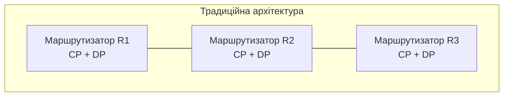
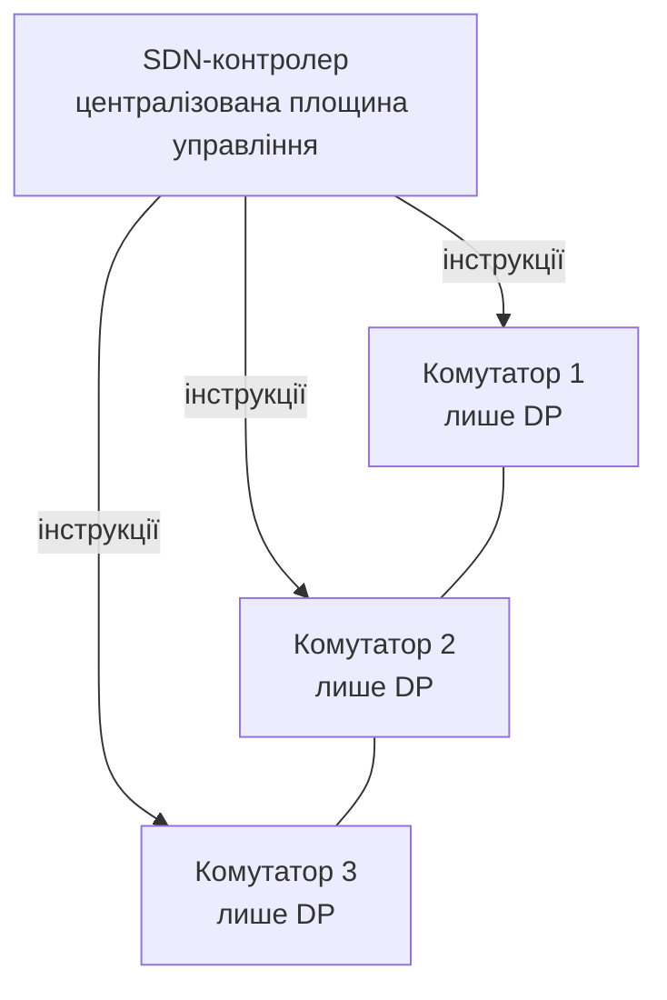
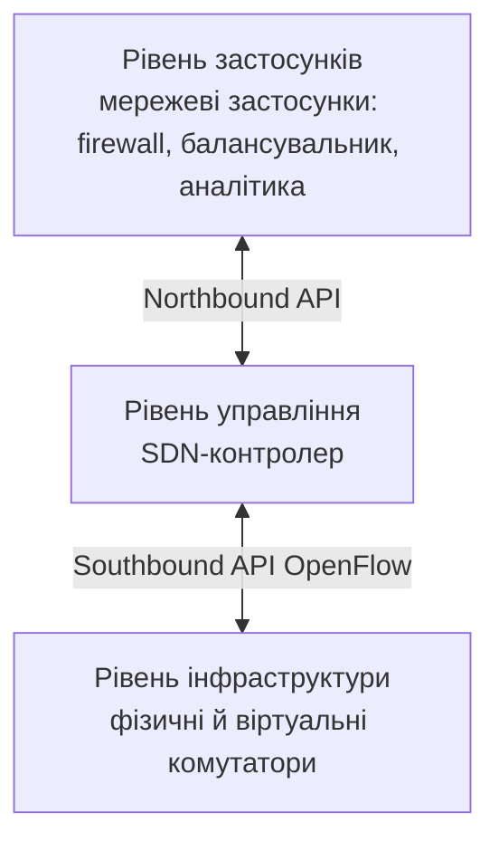

# SDN та SD-WAN: програмно-визначені мережі

> [!abstract]
> Кожну команду цього курсу, від `router ospf` у лекції 16 до `crypto map` у лекції 20, ми вводили окремо на кожному конкретному пристрої, вручну, через консоль. Розберемо ідею, що переосмислює цей підхід повністю, – програмно-визначені мережі (SDN), де рішення про маршрутизацію більше не приймає кожен пристрій самостійно, а централізований контролер, – і подивимось, як та сама ідея, застосована саме до глобальних мереж, породжує SD-WAN, що прямо розв'язує проблеми складності, з якими ми зіткнулись у трьох попередніх лекціях.

## Дві функції, які традиційно живуть в одному пристрої

Щоб зрозуміти, що саме переосмислює SDN, потрібно спершу явно розділити дві функції, які кожен маршрутизатор і комутатор виконує одночасно, хоча ми досі не називали їх окремими термінами.

**Площина управління (control plane)** – це той шар, що *ухвалює рішення*: OSPF (лекція 16) обчислює найкоротші шляхи алгоритмом SPF, BGP (лекція 19) веде перемовини про найкращий шлях на основі політики, STP (лекція 7) обчислює, які порти комутатора заблокувати, щоб уникнути петель. Усе це – обчислення, службовий обмін повідомленнями між пристроями, побудова таблиць.

**Площина пересилання (data plane, forwarding plane)** – це той шар, що *фактично виконує* рішення, ухвалене площиною управління: щойно таблиця маршрутизації чи таблиця MAC-адрес (лекція 6) побудована, кожен наступний пакет чи кадр пересилається швидко, механічно, за вже готовим записом у таблиці, без жодних нових роздумів.

У традиційній архітектурі, яку ми вивчали протягом усього курсу, обидві площини живуть **разом, усередині кожного окремого пристрою**: кожен маршрутизатор самостійно запускає власний процес OSPF, самостійно обмінюється Hello-пакетами з сусідами, самостійно обчислює SPF і самостійно ж пересилає пакети за результатом цього обчислення. Це називають **розподіленою площиною управління**: жодного єдиного центру прийняття рішень немає – кожен пристрій вирішує сам за себе, узгоджуючись із сусідами через протокол.

## SDN: відокремлення управління від пересилання

**SDN (Software-Defined Networking)** пропонує прямо протилежний принцип: **відокремити площину управління від площини пересилання** й централізувати її в одному програмному компоненті – **SDN-контролері**, – тоді як самі мережеві пристрої (комутатори, маршрутизатори) перетворюються на відносно прості, "тупі" елементи пересилання, що просто виконують інструкції, отримані від контролера, більше не ухвалюючи власних рішень самостійно.

> [!definition] Визначення
> **SDN (Software-Defined Networking)** – архітектурний підхід, за якого площина управління мережею централізована в окремому програмному контролері, відокремленому від фізичних пристроїв, що виконують лише площину пересилання.

Практична перевага такого відокремлення пряма: контролер бачить **всю мережу цілком, з єдиної точки**, тоді як у розподіленій моделі OSPF навіть link-state підхід (лекція 16), попри всю свою "повноту карти" всередині однієї області, обмежений саме тією областю й тим, що кожен пристрій обчислює шляхи самостійно, без жодного зовнішнього, вищого рівня координації. SDN-контролер, навпаки, може приймати рішення, що враховують стан *усієї* мережі одночасно, і, що найважливіше практично, – змінювати поведінку мережі програмно, одним централізованим викликом, а не заходячи по черзі на кожен окремий пристрій консольними командами, як ми робили протягом усього курсу.

Комунікація між контролером і пристроями пересилання відбувається через стандартизований протокол – найвідоміший приклад називається **OpenFlow**: контролер програмує в кожному комутаторі таблиці потоків (**flow tables**) – правила виду "пакети з такими ознаками пересилати на такий порт", – а комутатор просто застосовує ці правила механічно до трафіку, що проходить, не замислюючись, чому саме так, а не інакше.

Прийнято описувати архітектуру SDN трьома рівнями й двома типами інтерфейсів між ними.

**Рівень інфраструктури (infrastructure layer)** – фізичні чи віртуальні комутатори й маршрутизатори, що виконують лише площину пересилання. **Рівень управління (control layer)** – сам контролер, що будує централізовану картину мережі й програмує пристрої нижче через **Southbound API** (інтерфейс "вниз", до інфраструктури, типово OpenFlow). **Рівень застосунків (application layer)** – програми, що використовують контролер як платформу для реалізації мережевої логіки вищого рівня (наприклад, застосунок автоматичного балансування навантаження чи застосунок динамічної мережевої безпеки), спілкуючись із контролером через **Northbound API** (інтерфейс "вгору", до застосунків). Саме ця багаторівнева, програмована архітектура і перетворює мережу з набору окремо налаштованих коробок на єдину програмовану систему – пряме продовження тренду "інфраструктура як код", який ми вже згадували в лекції 1 стосовно автоматизації мереж.

> [!info] Для допитливих
> SDN виник не як суто академічна ідея, а як практична відповідь на реальну проблему великих дата-центрів і хмарних провайдерів (пригадайте хмарний тренд із лекції 1): коли мережа складається з тисяч комутаторів, ручна конфігурація кожного окремо через консоль (той підхід, яким ми користувались протягом усього цього курсу) стає фізично неможливою без масових помилок, а сама швидкість, з якою хмарний провайдер має реагувати на зміни (новий клієнт, нове навантаження, відмова обладнання), вимірюється секундами, а не годинами, потрібними людині-адміністратору, щоб зайти по черзі на кожен пристрій. Саме дата-центри Google, Amazon та подібних компаній стали першими масштабними, практичними впровадженнями SDN, задовго до того, як підхід почали адаптувати для корпоративних мереж середнього розміру.

## SD-WAN: та сама ідея, застосована до WAN

Тепер повернімося до проблем, з якими ми явно зіткнулись у трьох попередніх лекціях, і подивимось, як SDN, застосований саме до глобальних мереж – **SD-WAN (Software-Defined WAN)** – їх розв'язує.

У лекції 18 ми розглянули компроміс топології WAN: hub-and-spoke дешевший, але створює єдину точку транзиту й затримки для зв'язку філій між собою; повна сітка усуває цю проблему, але коштує значно дорожче через кількість окремих каналів, які потрібно орендувати й підтримувати. У лекції 19 ми побачили, що BGP ухвалює рішення про шлях на основі статично налаштованих адміністратором атрибутів політики (Weight, Local Preference), а не динамічно, залежно від фактичного, поточного стану кожного конкретного каналу. У лекції 20 ми детально розібрали, наскільки складне (і схильне до помилок неузгодження параметрів) ручне налаштування кожного окремого IPsec-тунелю командами `crypto isakmp`, `crypto ipsec`, `crypto map` – і уявіть, що цю саму послідовність команд потрібно повторити для *кожної* пари офісів у частковій сітці, кожного разу вручну узгоджуючи параметри на обох кінцях.

**SD-WAN** – це, по суті, SDN-контролер, застосований саме до керування WAN-з'єднаннями підприємства: замість того щоб адміністратор вручну налаштовував маршрутизацію, VPN-тунелі й політику на кожному прикордонному маршрутизаторі кожного офісу окремо, централізований SD-WAN-контролер визначає й програмно застосовує узгоджену політику одразу для *всієї* мережі підприємства, автоматично розгортаючи потрібні тунелі (IPsec чи, дедалі частіше, WireGuard, розглянуті в лекції 20) між усіма потрібними парами офісів, без ручного повторення конфігурації для кожної пари.

> [!definition] Визначення
> **SD-WAN** – архітектура, за якої централізований контролер керує маршрутизацією й політикою трафіку між локаціями підприємства поверх кількох незалежних WAN-каналів (**underlay**), автоматично формуючи й підтримуючи логічну мережу тунелів (**overlay**) відповідно до заданої, централізованої політики.

Ключове практичне нововведення SD-WAN – розмежування **underlay** (фактичні фізичні канали зв'язку – той самий MPLS чи Metro Ethernet від провайдера з лекції 18, звичайний широкосмуговий інтернет, мобільний 4G/5G) і **overlay** (логічна мережа зашифрованих тунелів, побудована поверх underlay і не залежна від конкретної технології конкретного каналу). Один і той самий офіс може одночасно мати кілька underlay-каналів різної якості й вартості – наприклад, дорогий, надійний MPLS від провайдера та дешевший звичайний інтернет як другий, резервний канал, – а SD-WAN-контролер динамічно вирішує, *яким саме underlay-каналом* спрямувати *конкретний тип трафіку* в конкретний момент, керуючись політикою, заданою один раз централізовано, а не окремою статичною конфігурацією маршрутизації на кожному пристрої.

> [!example] Приклад
> Уявіть компанію з філією, що має два WAN-канали: дорогий MPLS (низька, гарантована затримка, обмежена пропускна здатність) і звичайний широкосмуговий інтернет (дешевший, вища й менш передбачувана затримка, більша пропускна здатність). Голосовий трафік відеоконференцій (чутливий до затримки й джитеру, пригадайте QoS із лекції 7) SD-WAN-контролер спрямує через MPLS, тоді як об'ємне, нечутливе до затримки резервне копіювання файлів на сервер головного офісу вночі спрямує через дешевший інтернет-канал, – і що особливо важливо, якщо MPLS-канал раптово деградує чи повністю відмовляє, SD-WAN здатен *автоматично й миттєво*, без втручання адміністратора, переключити навіть чутливий голосовий трафік на резервний інтернет-канал, оцінюючи фактичний, поточний стан обох каналів у реальному часі, – а не покладаючись на статичну адміністративну відстань чи наперед задану метрику, як це робили статичні (лекція 15) чи навіть динамічні (лекція 16) протоколи маршрутизації, розглянуті раніше в курсі.

Друга практична перевага SD-WAN, що прямо продовжує тему автоматизації з лекції 1, – **централізоване, декларативне керування політикою**: адміністратор один раз описує намір ("голосовий трафік – пріоритет через найнадійніший канал", "трафік до хмарного застосунку X – напряму в інтернет, минаючи головний офіс") на рівні контролера, а сам контролер уже транслює цей намір у конкретну конфігурацію й розгортає її на всіх прикордонних пристроях мережі одночасно. Це прямий, практичний аналог того самого підходу "інфраструктура як код", про який ми говорили в лекції 1 й повторно згадали вище стосовно SDN загалом, – тільки застосований конкретно до WAN.

| | Традиційний WAN (лекції 15-20) | SD-WAN |
|---|---|---|
| Конфігурація | вручну, окремо на кожному пристрої | централізовано, через контролер |
| Вибір шляху | статична адміністративна відстань / метрика | динамічний, на основі поточного стану каналів |
| Тунелі між офісами | вручну налаштовані попарно | автоматично розгортаються контролером |
| Реакція на відмову каналу | залежить від протоколу (плаваючий маршрут, перерахунок OSPF) | миттєве, політико-кероване перемикання |
| Типи underlay-каналів | зазвичай один основний тип | кілька одночасно (MPLS + інтернет + LTE), керовані як єдине ціле |

> [!warning] Типова помилка
> Не варто робити висновок, що SD-WAN "скасовує" все, що ми вивчили в лекціях 15-20, – SD-WAN не замінює маршрутизацію, VPN чи навіть провайдерські WAN-канали, а **керує ними програмно й централізовано** замість ручної, порозкиданої по окремих пристроях конфігурації. Під капотом SD-WAN-рішення все одно фактично встановлюють IPsec- чи WireGuard-тунелі (лекція 20), усе одно приймають рішення, дуже схожі на ті, що приймає BGP-політика (лекція 19), – просто автоматизовано й централізовано, а не вручну, командами на кожному окремому маршрутизаторі. Розуміння лекцій 15-20 залишається фундаментом, без якого неможливо усвідомлено налаштовувати чи діагностувати навіть SD-WAN-рішення, – SD-WAN абстрагує складність, а не усуває саму задачу, яку ця складність розв'язувала.

## SDN та SD-WAN у контексті курсу

Ідея централізованого, програмного управління мережею, розглянута сьогодні, – не окремий, ізольований прийом лише для великих дата-центрів чи глобальних мереж підприємства. У наступній лекції ми побачимо, що сама концепція **VPC (Virtual Private Cloud)** у хмарних провайдерів – це, по суті, SDN, застосований до мережі всередині самого дата-центру хмарного провайдера: коли ви "створюєте підмережу" в хмарній консолі кількома кліками, під капотом відбувається саме те програмування таблиць пересилання через централізований контролер, яке ми щойно розглянули концептуально. А значно пізніше, у модулі про службу каталогів та керування, лекція про мережеву автоматизацію з використанням ШІ розширить цю саму тему автоматизації ще на один рівень – від "централізованого програмного управління за заданими правилами" до "автоматизованого управління, що саме пропонує чи навіть застосовує зміни конфігурації", повертаючи нас до застереження з лекції 1: відповідальність за коректність будь-якої автоматично згенерованої чи застосованої зміни завжди залишається на інженері.

> [!exam] На іспиті
> Типові питання: а) розрізнити площину управління й площину пересилання та пояснити, як вони поєднані в традиційній архітектурі; б) дати визначення SDN і пояснити, що саме він відокремлює й централізує; в) описати три рівні архітектури SDN і роль Northbound/Southbound API; г) дати визначення SD-WAN і пояснити різницю між underlay та overlay; д) навести приклад того, як SD-WAN динамічно обирає шлях для різних типів трафіку залежно від їхніх вимог.

## Завдання на занятті (20 хв)

1. Для трьох механізмів, розглянутих раніше в курсі (STP з лекції 7, OSPF з лекції 16, статична маршрутизація з лекції 15), визначте усно: де в кожному з них "живе" площина управління – розподілено по кожному пристрою чи централізовано?
2. У парі поясніть одне одному різницю між underlay та overlay в SD-WAN на прикладі компанії з двома WAN-каналами (MPLS та звичайний інтернет).
3. Компанія має п'ять філій і хоче забезпечити прямий, без транзиту через головний офіс, зв'язок між усіма парами філій (повна сітка тунелів). Обговоріть, чому SD-WAN-контролер робить це завдання практично реалістичним порівняно з ручним налаштуванням IPsec-тунелів командами з лекції 20 для кожної з можливих пар філій.
4. Придумайте одне просте правило централізованої політики SD-WAN (у форматі "трафік типу X → канал Y, за пріоритетом Z") для мережі коледжу з відеоконференціями, доступом до хмарного навчального застосунку й резервним копіюванням даних уночі.

> [!question] Перевірте себе
> 1. Чим площина управління відрізняється від площини пересилання, і де кожна з них "живе" у традиційній, розподіленій архітектурі маршрутизації?
> 2. Що саме централізує SDN, і які пристрої залишаються після цього на рівні інфраструктури?
> 3. Чим Northbound API відрізняється від Southbound API за напрямком і призначенням?
> 4. Що таке underlay та overlay в контексті SD-WAN, і як вони співвідносяться одне з одним?
> 5. Наведіть приклад, як SD-WAN може по-різному спрямовувати два різні типи трафіку тієї самої філії залежно від їхніх вимог до затримки.

## Назад
← [[courses/computer-networks/lectures/20-vpn-ipsec-ta-wireguard|Лекція 20. VPN IPsec та WireGuard]]

## Далі
→ [[courses/computer-networks/lectures/22-khmarni-merezhi-vpc|Лекція 22. Хмарні мережі VPC]]

## Література
- Cisco Networking Academy. *Connecting Networks* (курс CCNA v7/v7.1) – вступний розділ про SDN та SD-WAN.
- Kreutz D. et al. *Software-Defined Networking: A Comprehensive Survey*, IEEE Communications Surveys & Tutorials, 2015.
- Open Networking Foundation – офіційна документація стандарту OpenFlow.
- Одом У. *Officially Licensed Cert Guide CCNA 200-301* – розділ про основи SDN.
