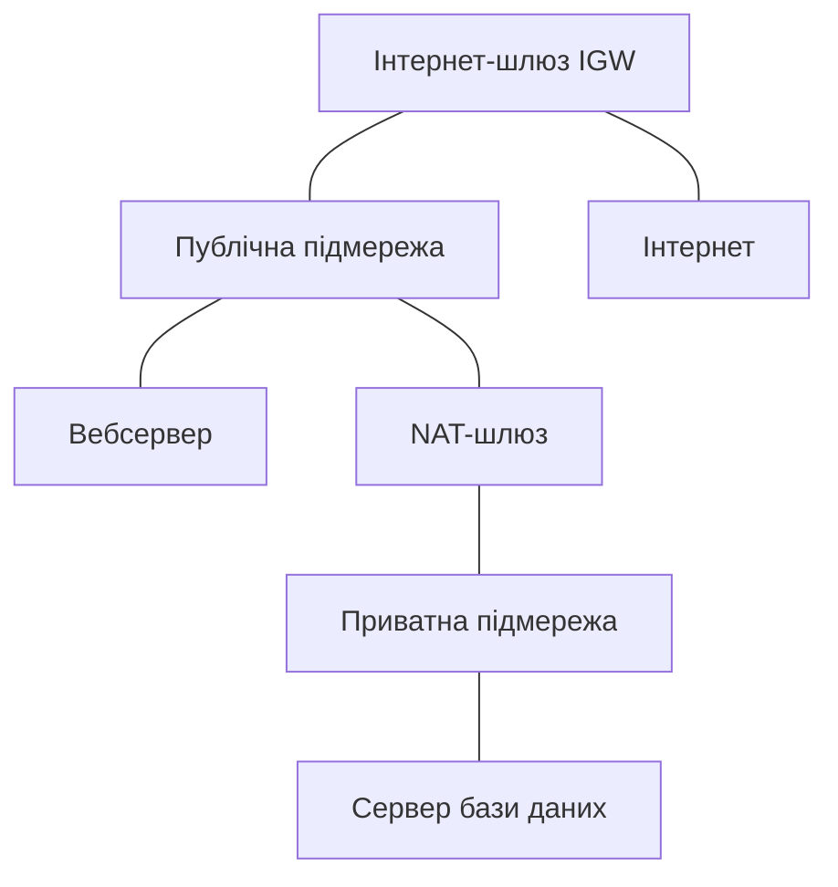

# Хмарні мережі: VPC, підмережі, гібридні підключення

> [!abstract]
> У попередній лекції ми пообіцяли повернутись до конкретного, практичного втілення SDN – тепер, коли ви розумієте ідею централізованого, програмного управління мережею, подивимось, як вона матеріалізується щоразу, коли хтось у хмарній консолі кількома кліками "створює мережу". Розберемо VPC – віртуальну приватну хмару: як вона ізолює клієнтів один від одного на спільному фізичному обладнанні, з чого складається її внутрішня структура (публічні й приватні підмережі, таблиці маршрутів, шлюзи) і як побудувати гібридне з'єднання між локальною інфраструктурою підприємства й хмарою.

## VPC як SDN, яку ви ніколи не бачите зсередини

У фіналі лекції 21 ми зробили пряме твердження, яке зараз розкриємо детально: коли ви в консолі хмарного провайдера (Amazon Web Services, Microsoft Azure, Google Cloud чи будь-якого іншого) створюєте нову "мережу", під капотом відбувається саме те, що ми щойно розглянули концептуально, – централізований SDN-контролер провайдера програмує таблиці пересилання на своєму, здебільшого віртуалізованому, обладнанні, реалізуючи запитану вами топологію без жодного фізичного кабелю, прокладеного персонально для вас. Різниця лише в тому, що клієнт хмарного провайдера ніколи не бачить сам контролер чи Southbound API з лекції 21 – уся ця складність захована за зручним, високорівневим інтерфейсом хмарної консолі чи API.

**VPC (Virtual Private Cloud)** – логічно ізольований сегмент мережі всередині інфраструктури хмарного провайдера, виділений конкретному клієнту, попри те що фізично цей клієнт ділить те саме обладнання (сервери, комутатори, канали) із тисячами інших клієнтів одночасно. Це називають **багатоорендністю (multi-tenancy)**: багато незалежних, часто навіть конкуруючих організацій ("орендарів", tenants) користуються тим самим фізичним ЦОД хмарного провайдера, і саме мережева ізоляція – те, що не дозволяє одному орендарю бачити чи впливати на трафік іншого, попри спільне фізичне обладнання.

> [!definition] Визначення
> **VPC (Virtual Private Cloud)** – логічно ізольована віртуальна мережа всередині інфраструктури хмарного провайдера, виділена конкретному клієнту й відокремлена від мереж інших клієнтів, що фізично користуються тим самим обладнанням.

> [!info] Для допитливих
> Принцип, що лежить в основі VPC, концептуально не новий для вас – ми вже бачили ту саму ідею логічної ізоляції на спільній фізичній інфраструктурі в лекції 6, коли розглядали VLAN: різні відділи офісу, фізично підключені до тих самих комутаторів, логічно перебувають у повністю ізольованих сегментах. VPC масштабує ту саму ідею з рівня "один офіс, один комутатор" до рівня "весь дата-центр хмарного провайдера, тисячі клієнтів" – і саме тому, що такий масштаб і динамічність (нові VPC створюються й видаляються сотні разів на день різними клієнтами) неможливо обслуговувати ручним налаштуванням VLAN на кожному фізичному комутаторі, хмарні провайдери й побудували свою внутрішню мережу на принципах SDN.

## З чого складається VPC

Створення VPC починається з вибору **CIDR-блоку** (лекція 11) – діапазону приватних IP-адрес (типово з діапазонів RFC 1918, тих самих 10.0.0.0/8, 172.16.0.0/12 чи 192.168.0.0/16, з якими ви вже вправлялись у розрахунках VLSM), який належатиме винятково цій VPC. Це саме той момент, де навички розрахунку підмереж, відпрацьовані в лекції 11, застосовуються практично: у межах виділеного CIDR-блоку VPC ви так само ділите простір на менші підмережі під конкретні потреби – і, як побачимо нижче, поділ цей далеко не довільний, а відображає конкретну мережеву роль кожної підмережі.

**Публічна підмережа (public subnet)** – підмережа, ресурси якої мають (чи можуть отримати) прямий шлях до інтернету. **Приватна підмережа (private subnet)** – підмережа, ресурси якої зсередини недосяжні напряму з інтернету і не мають прямого вихідного шляху назовні без додаткового посередника. Принципово важливо зрозуміти: ця відмінність визначається не якимось особливим прапорцем на самій підмережі, а виключно вмістом її **таблиці маршрутів (route table)** – тим самим поняттям таблиці маршрутизації з лекції 15, тепер застосованим не до фізичного маршрутизатора Cisco, а до віртуального, програмно керованого маршрутизатора хмарного провайдера.

**Інтернет-шлюз (Internet Gateway, IGW)** – компонент VPC, що надає шлях між підмережею та інтернетом; підмережа стає "публічною" саме тому, що в її таблиці маршрутів прописаний маршрут за замовчуванням (0.0.0.0/0, той самий запис, який ми детально розглядали в лекції 15) саме через IGW. Приватна підмережа такого запису не має – а отже, жоден пристрій ззовні не може ініціювати з'єднання напряму до ресурсу в ній, і сам ресурс так само не має прямого шляху назовні.

**NAT-шлюз (NAT Gateway)** розв'язує практичну проблему: ресурс у приватній підмережі (наприклад, сервер бази даних, якому потрібно завантажити оновлення пакетів з інтернету, але який зовсім не повинен бути напряму досяжний ззовні) усе одно іноді потребує *вихідного* доступу в інтернет. NAT-шлюз – це, по суті, керована хмарним провайдером, повністю готова реалізація PAT (Port Address Translation), яку ми вручну налаштовували командами `ip nat inside`/`ip nat outside`/`overload` на Cisco IOS у лекції 14: NAT-шлюз розміщують у публічній підмережі, а таблицю маршрутів приватної підмережі налаштовують так, щоб її маршрут за замовчуванням вів саме через NAT-шлюз, а не напряму через IGW, – вихідні з'єднання транслюються на публічну адресу NAT-шлюзу тим самим механізмом портів, розглянутим у лекції 14, тоді як жодне вхідне з'єднання ззовні досягти ресурсу приватної підмережі так і не може.

## Групи безпеки проти мережевих ACL: два рівні фільтрації

Хмарні провайдери надають два різні механізми фільтрації трафіку всередині VPC, і розрізняти їх варто чітко, спираючись на те, що ми вже знаємо про ACL з лекції 14.

**Група безпеки (security group)** прив'язується безпосередньо до конкретного ресурсу (віртуальної машини, бази даних) і є **stateful** – тобто *станозалежною*: якщо вхідне з'єднання дозволено правилом, відповідь на нього автоматично дозволяється у зворотному напрямку, без потреби прописувати для неї окреме, симетричне правило. Це принципово відрізняється від ACL з лекції 14, який перевіряє кожен пакет незалежно, без пам'яті про попередній трафік того самого з'єднання (**stateless**, *станонезалежний*), – саме тому в лекції 14 нам доводилось явно дописувати `permit ip any any` для зворотного трафіку, тоді як з групою безпеки цього робити не потрібно.

**Мережевий ACL (Network ACL, NACL)** прив'язується не до окремого ресурсу, а до цілої підмережі, і, на відміну від групи безпеки, є **stateless**, поводячись значно ближче до класичного розширеного ACL з лекції 14: правила перевіряються послідовно, і відповідь на дозволений вхідний трафік потребує окремого, явного дозволу у зворотному напрямку.

| | Група безпеки (security group) | Мережевий ACL (NACL) |
|---|---|---|
| Рівень застосування | конкретний ресурс | ціла підмережа |
| Стан з'єднання | stateful (пам'ятає з'єднання) | stateless (перевіряє кожен пакет) |
| Зворотний трафік | дозволяється автоматично | потребує окремого правила |
| Порядок правил | не має значення | має значення (як в ACL лекції 14) |

Практична рекомендація хмарних провайдерів – використовувати групи безпеки як основний, деталізований механізм захисту (по одній групі на кожен тип ресурсу, з мінімально необхідними дозволами), а мережеві ACL – як додатковий, грубіший рівень захисту на межі всієї підмережі, для явної, широкої заборони (наприклад, конкретної шкідливої IP-адреси для всієї підмережі одразу) – саме той принцип "кількох незалежних рівнів захисту", який ми вже зустрічали в лекції 3 стосовно різниці між міжмережевим екраном і антивірусом.

## Зони доступності: відмовостійкість на рівні дата-центру

Хмарні провайдери фізично розподіляють свою інфраструктуру на **зони доступності (Availability Zones, AZ)** – фізично окремі дата-центри (чи групи дата-центрів) в межах одного регіону, з незалежним живленням, охолодженням і мережевим підключенням, але зі швидким, низькозатримувальним з'єднанням між собою. Одна VPC типово охоплює **весь регіон**, а її підмережі прив'язуються до конкретних зон доступності – і хорошою практикою вважається розгортати критичні ресурси в кількох зонах одночасно, щоб відмова однієї конкретної зони (пожежа, тривале відключення живлення, локальна аварія) не позбавила застосунок працездатності повністю. Це той самий принцип відмовостійкості через резервування, який ми вже бачили в цьому курсі неодноразово – у плаваючих статичних маршрутах лекції 15, у резервному шляху STP лекції 7, – тільки застосований тепер на масштабі цілих фізичних дата-центрів, а не окремих каналів чи портів.

## Гібридне підключення: з'єднання локальної мережі з VPC

Компанія, що вже має власну локальну інфраструктуру (лекції 1-17 усього цього курсу) і водночас розгортає частину ресурсів у хмарі, потребує способу з'єднати обидва світи в єдину, узгоджену мережу – задача, дуже схожа на з'єднання двох офісів через WAN із лекції 18, тільки одним "офісом" тепер виступає сама VPC хмарного провайдера.

**VPN-підключення** – найпростіший і найдешевший варіант: той самий site-to-site IPsec-тунель, детально розглянутий у лекції 20, тільки одним із двох кінців тунелю тепер є не фізичний маршрутизатор Cisco іншого офісу, а віртуальний шлюз VPN хмарного провайдера. Трафік між локальною мережею й VPC іде звичайним публічним інтернетом, зашифрованим тим самим ESP-тунелем, який ми конфігурували командами `crypto map` в лекції 20, – швидко розгорнути, недорого, але з тими самими обмеженнями звичайного інтернет-каналу щодо пропускної здатності й затримки, які ми обговорювали в лекції 18.

**Виділене пряме підключення** (у різних провайдерів має різні комерційні назви – AWS Direct Connect, Azure ExpressRoute, Google Cloud Interconnect) – фізичний чи логічний канал від офісу підприємства безпосередньо до мережі хмарного провайдера, минаючи публічний інтернет узагалі. Концептуально це саме той Metro Ethernet чи MPLS L3VPN, розглянутий у лекції 18 як послуга рівня підприємства з гарантованим SLA, – тільки замість з'єднання двох офісів компанії він з'єднує офіс компанії з точкою присутності хмарного провайдера. Перевага – передбачувана, гарантована пропускна здатність і затримка (критично для великих обсягів даних чи чутливих до затримки застосунків), без конкуренції за спільний, непередбачуваний публічний інтернет-канал; недолік – суттєво вища вартість і довший час розгортання (потрібне фізичне підключення до конкретної точки присутності провайдера, а не просто налаштування програмного тунелю за лічені хвилини, як у випадку VPN).

> [!example] Приклад
> Велика компанія з чутливими до затримки внутрішніми застосунками (наприклад, торговою платформою, де кожна мілісекунда затримки має фінансову вартість) типово обирає виділене пряме підключення як основний канал до хмари, і водночас налаштовує VPN-тунель як дешевший резервний канал на випадок відмови основного, – той самий принцип резервування різнотипними каналами, який ми детально розглядали як практику SD-WAN у лекції 21, застосований тепер конкретно до гібридного з'єднання з хмарою.

## Пірінг VPC: з'єднання кількох хмарних мереж між собою

Окремо варто згадати **пірінг VPC (VPC peering)** – пряме, приватне з'єднання між двома окремими VPC (тієї самої чи навіть різних організацій), що дозволяє ресурсам обох VPC обмінюватися трафіком напряму, приватними адресами, минаючи публічний інтернет, – концептуально це той самий вибір топології "точка-точка", розглянутий стосовно фізичного WAN у лекції 18, тепер застосований до логічних, віртуальних мереж хмари. Коли VPC потрібно з'єднати з багатьма іншими VPC одночасно (наприклад, окрема VPC для кожного відділу чи кожного середовища розробки – тестового, робочого), пірінг попарно швидко перетворюється на ту саму задачу масштабування, яку ми обговорювали для WAN-топологій: **повна сітка** пірінгових з'єднань росте квадратично з кількістю VPC, тому хмарні провайдери пропонують централізовані сервіси транзитного шлюзу (**transit gateway**) – по суті, той самий принцип hub-and-spoke із лекції 18, тепер реалізований як керований хмарний сервіс, що виконує роль центрального "hub" для десятків VPC одночасно.

> [!warning] Типова помилка
> Поширена помилка проєктування – обрати для VPC той самий CIDR-блок (наприклад, звичний 192.168.1.0/24), що вже використовується в локальній мережі підприємства. Якщо адресні простори локальної мережі й VPC перетинаються, гібридне підключення (VPN чи пряме) просто не зможе однозначно визначити, до якої саме мережі – локальної чи хмарної – належить конкретна адреса, і маршрутизація зламається непередбачувано. Саме тому перше практичне рішення під час проєктування гібридної інфраструктури – свідомо підібрати для VPC CIDR-блок, що *гарантовано не перетинається* з жодним наявним локальним діапазоном, застосовуючи ті самі навички розрахунку підмереж і VLSM з лекції 11, тільки тепер у масштабі планування *всієї* мережевої архітектури компанії одразу, а не однієї окремої мережі.

## Хмарна мережа в контексті курсу

VPC – це не окрема, ізольована тема, а пряме продовження майже всього, що ми вивчили дотепер: CIDR і VLSM з лекції 11 визначають структуру адресного простору VPC, таблиці маршрутів працюють за тими самими принципами, що й у лекції 15, NAT-шлюз – це готова реалізація PAT з лекції 14, VPN-підключення спирається на IPsec з лекції 20, а сама архітектура VPC – практичне втілення SDN з лекції 21. У наступній лекції ми підемо на рівень глибше всередину самої VPC – до мережевої взаємодії контейнерів і оркестрації Kubernetes, де ресурсами, що отримують власні IP-адреси й потребують власних правил маршрутизації та фільтрації, стають вже не цілі віртуальні машини в підмережі, а десятки й сотні тимчасових, ефемерних контейнерів усередині однієї-єдиної віртуальної машини.

> [!exam] На іспиті
> Типові питання: а) дати визначення VPC й пояснити принцип багатоорендності; б) пояснити, чим публічна підмережа технічно відрізняється від приватної (через таблицю маршрутів, а не якийсь особливий прапорець); в) пояснити роль NAT-шлюзу і провести паралель із PAT з лекції 14; г) розрізнити групу безпеки й мережевий ACL за критеріями stateful/stateless і рівнем застосування; д) порівняти VPN-підключення й виділене пряме підключення до хмари за вартістю, швидкістю розгортання й характеристиками каналу.

## Завдання на занятті (20 хв)

1. Компанії виділено CIDR-блок 10.20.0.0/16 під VPC. Розподіліть цей простір на публічну підмережу для вебсерверів (потрібно 100 адрес), приватну підмережу для баз даних (потрібно 50 адрес) і приватну підмережу для внутрішніх сервісів (потрібно 20 адрес), застосовуючи методику VLSM з лекції 11.
2. У парі поясніть одне одному, чому ресурс у приватній підмережі все одно потребує NAT-шлюзу для вихідного трафіку, попри те що жодного вхідного з'єднання ззовні до нього дійти не може.
3. Обговоріть: чому група безпеки (stateful) практичніша за замовчуванням для окремого ресурсу, ніж мережевий ACL (stateless), спираючись на приклад типової помилки з ACL, розглянутої в лекції 14 (забутий `permit ip any any` для зворотного трафіку)?
4. Компанія планує гібридну інфраструктуру: локальний офіс і VPC в хмарі. Запропонуйте, який CIDR-блок для VPC був би безпечним вибором, якщо локальна мережа офісу вже використовує 192.168.0.0/16, і поясніть, чому саме такий вибір усуває ризик конфлікту адресних просторів.

> [!question] Перевірте себе
> 1. Що таке багатоорендність (multi-tenancy) і яку роль відіграє мережева ізоляція VPC у цьому контексті?
> 2. Що саме визначає, чи є підмережа публічною, а не якась окрема властивість самої підмережі?
> 3. Чим NAT-шлюз хмарного провайдера концептуально є тим самим, що ми налаштовували вручну в лекції 14?
> 4. Чим stateful фільтрація групи безпеки відрізняється від stateless фільтрації мережевого ACL з погляду обробки зворотного трафіку?
> 5. Чому пряме виділене підключення до хмари коштує дорожче за VPN, і яку конкретну технічну перевагу воно дає натомість?

## Назад
← [[courses/computer-networks/lectures/21-sdn-ta-sd-wan|Лекція 21. SDN та SD-WAN]]

## Далі
→ [[courses/computer-networks/lectures/23-merezhi-konteineriv-i-kubernetes|Лекція 23. Мережі контейнерів і Kubernetes]]

## Література
- AWS Documentation. *Amazon VPC User Guide* – офіційна документація з архітектури VPC.
- Microsoft Learn. *Azure Virtual Network documentation*.
- Google Cloud Documentation. *Virtual Private Cloud (VPC) network overview*.
- Одом У. *Officially Licensed Cert Guide CCNA 200-301* – вступний розділ про хмарні мережеві концепції.
