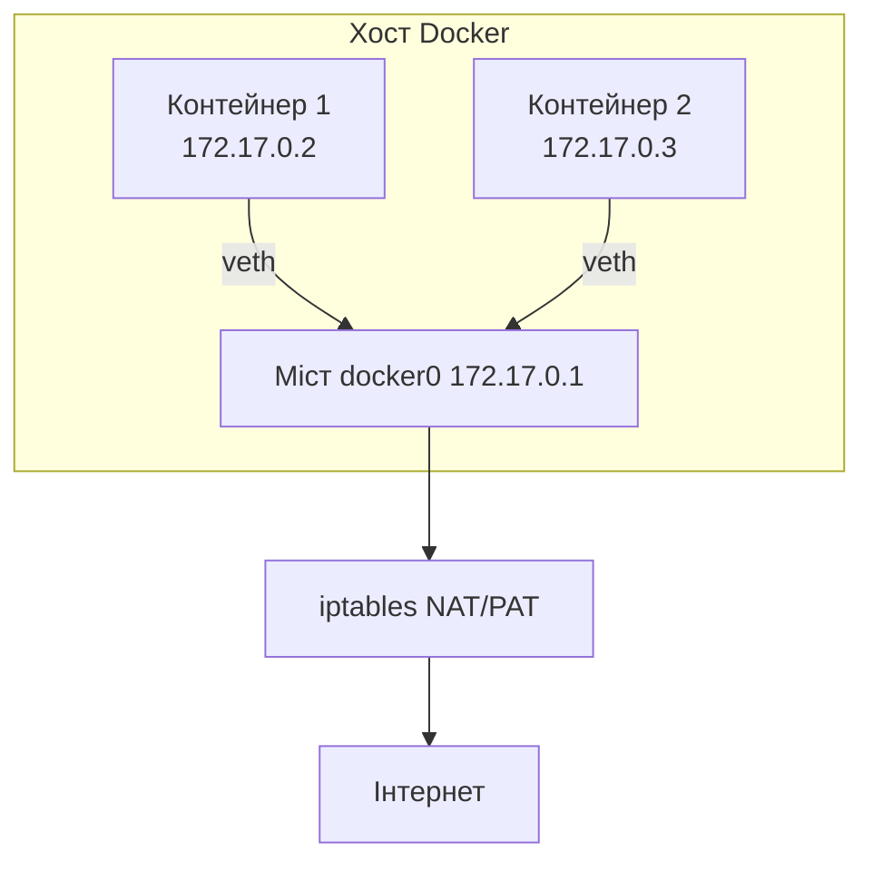
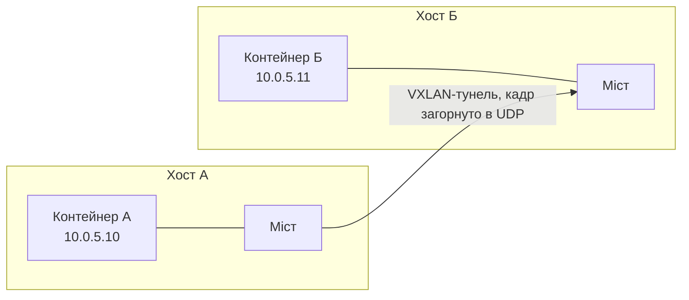
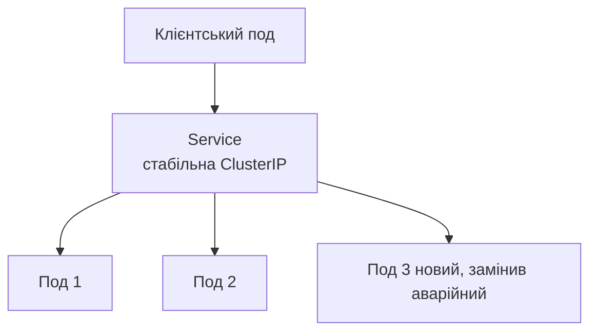

# Мережі контейнерів і Kubernetes

> [!abstract]
> Наприкінці попередньої лекції ми пообіцяли спуститись на рівень глибше всередину VPC – туди, де ресурсами, що потребують власних адрес і правил маршрутизації, стають вже не цілі віртуальні машини, а десятки ефемерних контейнерів усередині однієї машини. Розберемо, як Docker будує мережу на одному хості, чому цей підхід перестає працювати, щойно контейнери розкидані по кількох фізичних серверах, і як Kubernetes та технологія VXLAN розв'язують цю проблему, створюючи єдину, плоску мережу поверх кластера з десятків чи сотень окремих машин.

## Контейнер: легша одиниця, ніж віртуальна машина

Перш ніж перейти до мережі, варто зафіксувати одну відмінність, важливу для розуміння всього подальшого. **Контейнер** – це не повноцінна віртуальна машина зі своєю власною операційною системою: контейнери на одному фізичному чи віртуальному хості поділяють одне й те саме ядро операційної системи хоста, а ізолюються одне від одного не апаратною віртуалізацією, а механізмами самого ядра (простори імен, namespaces). Практичний наслідок для нас: контейнер, попри свою легкість і швидкість запуску (секунди, а не хвилини, як для повноцінної віртуальної машини), усе одно потребує **власного мережевого простору імен** – власної віртуальної мережевої карти, власної IP-адреси, власної таблиці маршрутів, – щоб коректно брати участь у мережевій взаємодії окремо від інших контейнерів на тому самому хості.

## Мережа Docker на одному хості: віртуальний комутатор у мініатюрі

Розгляньмо, що відбувається, коли на одному сервері запускають Docker і в ньому – кілька контейнерів, без жодного оркестратора на кшталт Kubernetes. За замовчуванням Docker створює на хості віртуальний **міст (bridge)**, що називається `docker0`, – концептуально це буквально те саме, чим був концентратор чи, точніше, комутатор у лекції 3 і 6: центральний вузол, до якого підключаються всі контейнери цього хоста.

Кожен контейнер отримує власний **veth-пару (virtual Ethernet pair)** – два віртуальні мережеві інтерфейси, з'єднані між собою так, ніби це один короткий патч-корд: один кінець залишається в мережевому просторі імен контейнера (виглядає для контейнера як звичайна мережева карта `eth0`), а другий кінець підключається до мосту `docker0` на хості – точнісінько так, як фізичний кабель від комп'ютера підключається до порту комутатора. Docker призначає контейнеру приватну IP-адресу з окремої підмережі (типово з діапазону 172.17.0.0/16 за замовчуванням), і контейнери, підключені до того самого мосту, можуть вільно спілкуватися одне з одним напряму – так само, як пристрої, підключені до того самого VLAN у лекції 6.

Для вихідного трафіку – коли контейнер звертається назовні, до інтернету, – хост виконує рівно ту саму операцію, яку ми детально розбирали в лекції 14 та знову зустрічали як керований сервіс у лекції 22: **PAT (NAT overload)**, реалізований на Linux-хості правилами `iptables` (детальніше про Linux-мережі та `iptables`-подібні механізми – у лекції 26). Приватна адреса контейнера транслюється на публічну (чи внутрішню мережеву) адресу самого хоста, з розрізненням окремих з'єднань за портами, – той самий механізм, той самий принцип, лише застосований автоматично, без ручного налаштування адміністратором.

А для *вхідного* доступу – коли зовнішньому клієнту потрібно звернутись до сервісу, що працює всередині контейнера, – Docker використовує **проброс портів (port mapping)**: адміністратор явно вказує відповідність "порт хоста → порт контейнера" (наприклад, команда `docker run -p 8080:80` означає "порт 8080 хоста веде до порту 80 всередині контейнера"). Концептуально це той самий **статичний NAT** "один до одного", розглянутий у лекції 14, тільки застосований до пари портів на одній адресі, а не до пари цілих IP-адрес.

## Проблема, яку одиночний хост не розв'язує: контейнери на різних машинах

Схема з мостом `docker0`, щойно розглянута, чудово працює, доки всі контейнери фізично перебувають на *тому самому* хості. Але жоден реальний production-застосунок не обмежується одним сервером: типовий сценарій – десятки чи сотні контейнерів, розподілені по кількох фізичних (чи віртуальних, у VPC з лекції 22) серверах одночасно, – і контейнеру на одному хості часто потрібно напряму, без зайвих ускладнень NAT, звернутися до контейнера на зовсім іншому фізичному хості, можливо навіть в іншій зоні доступності (лекція 22).

Проблема в тому, що приватні підмережі мостів `docker0` на різних хостах – окремі, ізольовані одна від одної підмережі, кожна прив'язана до конкретного фізичного хоста (як окремий VLAN у лекції 6, обмежений одним комутатором): пряма маршрутизація між ними без додаткової інфраструктури неможлива, і кожне міжхостове з'єднання довелося б знову загортати в NAT і проброс портів, – рішення, яке швидко стає неконтрольованим за складністю зі зростанням кількості хостів і контейнерів, точнісінько та сама проблема масштабування ручної конфігурації, що спонукала до появи SDN у лекції 21.

## VXLAN: розширення логічної мережі через кілька фізичних хостів

Рішення цієї проблеми – технологія тунелювання, вже знайома вам концептуально з лекції 20, тільки застосована тут не для захисту трафіку між офісами, а для **розширення однієї логічної мережі поверх кількох фізичних хостів**, – **VXLAN (Virtual Extensible LAN)**.

Ідея VXLAN пряма: цілий кадр Ethernet (разом з його оригінальними MAC-адресами відправника й одержувача, тими самими, з якими ми працювали в лекції 5-6) загортається (інкапсулюється – та сама операція, що й у тунелюванні VPN з лекції 20, тільки тут на канальному, а не мережевому рівні) усередину UDP-пакета й пересилається мережею, що з'єднує фізичні хости, – на приймаючому хості пакет розпаковують, і оригінальний кадр Ethernet потрапляє у внутрішній міст цього хоста, ніби він прийшов звичайним локальним шляхом. Практичний наслідок: два контейнери на двох різних, географічно чи логічно віддалених фізичних хостах можуть перебувати в тій самій логічній L2-мережі (тому самому "віртуальному VLAN"), попри те що фізично між ними – звичайна, маршрутизована IP-мережа дата-центру.

> [!info] Для допитливих
> Один із конкретних практичних мотивів появи VXLAN – пряме подолання обмеження, яке ми зафіксували ще в лекції 6: звичайний тег 802.1Q дає лише 12 бітів під номер VLAN, тобто щонайбільше 4094 практично використовуваних VLAN на всю мережу. Для одного офісу середнього розміру цього більш ніж достатньо, але для великого хмарного дата-центру, де кожен клієнт (пригадайте багатоорендність, multi-tenancy, з лекції 22) чи кожен окремий застосунок потенційно потребує власного ізольованого логічного сегмента, 4094 сегментів може забракнути. Ідентифікатор VXLAN (**VNI, VXLAN Network Identifier**) – уже 24-бітне число, тобто понад 16 мільйонів можливих окремих логічних сегментів, – саме той запас масштабованості, якого практично завжди достатньо навіть найбільшому хмарному провайдеру чи оператору кластера Kubernetes.

## Мережева модель Kubernetes: "плоска" мережа подів

**Kubernetes** – оркестратор контейнерів, що керує запуском, масштабуванням і мережевою взаємодією контейнерів на цілому кластері фізичних чи віртуальних серверів (**вузлів, nodes**) одночасно. Базова одиниця розгортання в Kubernetes – не окремий контейнер, а **под (pod)**: один або кілька тісно пов'язаних контейнерів, що завжди запускаються й переміщуються між вузлами разом і поділяють між собою один спільний мережевий простір імен (тобто одну спільну IP-адресу на всі контейнери всередині одного пода).

Мережева модель Kubernetes формулює жорстку, обов'язкову для будь-якої реалізації вимогу, яка прямо контрастує з тим, що ми щойно бачили в базовому Docker: **кожен под отримує власну, унікальну IP-адресу в межах усього кластера, і будь-які два поди можуть спілкуватися одне з одним напряму цими адресами, без NAT**, незалежно від того, на якому саме фізичному вузлі кожен з них фактично запущений. Це і називають "плоскою" мережевою моделлю (flat network model) – з погляду будь-якого пода, весь кластер виглядає як одна велика спільна мережа, у якій кожен інший под безпосередньо досяжний за своєю адресою, так само, як два пристрої в одному VLAN лекції 6, попри те що под фізично може перебувати на зовсім іншому фізичному сервері десь в іншому кінці дата-центру.

> [!definition] Визначення
> **Плоска мережева модель Kubernetes** – вимога, за якою кожен под кластера отримує унікальну IP-адресу й може напряму, без трансляції адрес, обмінюватися даними з будь-яким іншим подом кластера незалежно від того, на якому фізичному вузлі кожен з них розміщений.

Саме тут VXLAN, розглянутий вище, і стає практичним інструментом реалізації цієї вимоги: **CNI (Container Network Interface)** – стандартизований плагінний інтерфейс, через який Kubernetes делегує фактичну побудову мережі одному з кількох сумісних мережевих плагінів (Calico, Flannel, Cilium та інші), і значна частина цих плагінів під капотом якраз і будує VXLAN-тунелі (чи схожі механізми оверлейної мережі, концептуально ту саму ідею overlay з лекції 21) між усіма вузлами кластера, щоб забезпечити ту саму плоску, наскрізну L2- чи L3-зв'язність подів незалежно від фізичного розташування.

## Service: стабільна адреса для мінливого набору подів

Поди в Kubernetes – принципово **ефемерні**: коли под аварійно завершується чи оновлюється до нової версії застосунку, Kubernetes не "воскрешає" той самий под, а створює зовсім новий, із новою IP-адресою, тоді як старий назавжди зникає. Це створює практичну проблему: якщо клієнтський застосунок пам'ятає конкретну IP-адресу конкретного пода бази даних чи вебсервера, ця адреса рано чи пізно неминуче застаріє.

**Service** розв'язує цю проблему, надаючи стабільну, незмінну віртуальну IP-адресу (ClusterIP) і DNS-ім'я (пригадайте DNS з лекції 17 – Kubernetes має власний внутрішній DNS-сервер саме для таких імен), що завжди веде до *актуального на цей момент* набору здорових подів, які відповідають заданому критерію (типово – набору міток, labels). Компонент кластера **kube-proxy**, що працює на кожному вузлі, підтримує правила (типово знову ж таки на основі `iptables` чи сучаснішого IPVS) трансляції цієї стабільної віртуальної адреси на реальну, поточну адресу одного з подів, – концептуально Service вже виконує роль **балансувальника навантаження**, детально розглянутого в наступній лекції: він розподіляє вхідні запити між кількома однаковими подами, а не веде трафік завжди до одного й того самого конкретного пода.

Для доступу *ззовні* кластера (а не лише між подами всередині нього) Kubernetes надає **Ingress** – компонент, що приймає зовнішній HTTP/HTTPS-трафік (пригадайте порт 443 і TLS з лекції 17) і, на основі імені хоста чи шляху URL-адреси запиту, спрямовує його до потрібного внутрішнього Service, – практично те саме, що ми в наступній лекції розглянемо як **балансувальник навантаження прикладного рівня**, тільки вже спеціалізований конкретно під архітектуру Kubernetes.

## NetworkPolicy: фільтрація трафіку між подами

За замовчуванням у плоскій мережевій моделі Kubernetes будь-який под може напряму звернутися до будь-якого іншого пода кластера – зручно для розробки, але небезпечно для production, де, наприклад, под фронтенду не повинен мати прямого доступу до пода бази даних іншого, непов'язаного застосунку в тому самому кластері. **NetworkPolicy** – механізм явної фільтрації трафіку між подами, концептуально дуже близький до групи безпеки з лекції 22 (правила прив'язуються до подів за мітками, а не до фізичних портів чи адрес) і до ACL з лекції 14 за самим принципом дозволу/заборони конкретного трафіку за джерелом, призначенням, портом і протоколом.

> [!warning] Типова помилка
> Так само, як забутий `ip dhcp excluded-address` у лекції 14 чи неявна заборона наприкінці ACL, NetworkPolicy має свою типову пастку: за замовчуванням, доки жодної NetworkPolicy не застосовано до простору імен (namespace) кластера, дозволений *увесь* трафік між усіма подами без винятку, – на відміну від класичного ACL Cisco з неявною забороною наприкінці, тут логіка протилежна: "усе дозволено, доки не заборонено явно". Це означає, що для реального захисту в production-кластері недостатньо просто "не написати заборонних правил" – потрібно свідомо застосувати NetworkPolicy, що замикає весь простір імен типовим правилом "заборонити все за замовчуванням", а вже потім явно дозволяти лише необхідні, конкретні напрямки трафіку.

## Контейнерні мережі в контексті курсу

Сьогоднішня лекція завершує спуск на найглибший рівень мережевої деталізації, з яким ми стикались у цьому курсі: від фізичного кабелю в лекції 2 через комутатори й VLAN лекції 6, підмережі лекції 11, VPC лекції 22 – і аж до окремого контейнера всередині пода всередині вузла всередині кластера, розгорнутого, найімовірніше, у приватній підмережі VPC хмарного провайдера. Кожен рівень цієї ієрархії використовує ту саму, уже знайому вам сукупність базових ідей – адресація, ізоляція, тунелювання, трансляція адрес, балансування, – просто застосовану до дедалі меншого, дедалі динамічнішого масштабу одиниць. Наступна лекція завершує модуль про глобальні мережі, розглядаючи, як CDN і балансувальники навантаження – та сама ідея Service і Ingress, щойно розглянута всередині одного кластера, – масштабуються вже до рівня обслуговування мільйонів користувачів по всьому світу одночасно.

> [!exam] На іспиті
> Типові питання: а) пояснити, чому контейнер потребує власного мережевого простору імен, попри спільне ядро ОС з хостом; б) описати мережу Docker на одному хості: роль мосту `docker0`, veth-пар, PAT для вихідного й проброс портів для вхідного трафіку; в) пояснити принцип роботи VXLAN та яку конкретну проблему він розв'язує порівняно з мостом на одному хості; г) сформулювати вимогу плоскої мережевої моделі Kubernetes; д) пояснити роль Service і чому вона потрібна саме через ефемерність подів; е) пояснити принцип "усе дозволено за замовчуванням" NetworkPolicy й типову небезпеку, яку це створює.

## Завдання на занятті (20 хв)

1. У парі поясніть одне одному покроково, що відбувається з пакетом від контейнера А (172.17.0.2) на хості 1 до контейнера Б (172.17.0.3) на тому самому хості, а потім – що змінюється, якщо контейнер Б насправді перебуває на іншому фізичному хості 2, з'єднаному VXLAN-тунелем.
2. Порівняйте усно проброс портів Docker (`-p 8080:80`) з командою `ip nat inside source static` (статичний NAT один-до-одного, лекція 14) – у чому технічна подібність цих двох механізмів?
3. Обговоріть: чому вимога "кожен под отримує власну IP-адресу без NAT" настільки принципова для Kubernetes, що сформульована як обов'язкова вимога мережевої моделі, а не просто зручна практика?
4. Придумайте просте правило NetworkPolicy (у форматі "под з міткою X → дозволити трафік до пода з міткою Y, порт Z") для кластера з окремими подами фронтенду, бекенду й бази даних, де фронтенд не повинен мати прямого доступу до бази даних.

> [!question] Перевірте себе
> 1. Чим контейнер відрізняється від віртуальної машини з погляду того, що саме забезпечує ізоляцію?
> 2. Яку роль виконує міст `docker0`, і чим ця роль концептуально схожа на роль комутатора з лекції 6?
> 3. Що конкретно робить VXLAN із кадром Ethernet і яку саме проблему масштабування VLAN (лекція 6) він розв'язує завдяки 24-бітному ідентифікатору?
> 4. Що таке Service в Kubernetes і чому под сам собою не може бути стабільною точкою доступу для клієнтів?
> 5. Яка типова, небезпечна поведінка Kubernetes за замовчуванням щодо трафіку між подами, доки NetworkPolicy не застосована явно?

## Назад
← [[courses/computer-networks/lectures/22-khmarni-merezhi-vpc|Лекція 22. Хмарні мережі VPC]]

## Далі
→ [[courses/computer-networks/lectures/24-cdn-ta-balansuvannia-navantazhennia|Лекція 24. CDN та балансування навантаження]]

## Література
- Kubernetes Documentation. *Cluster Networking* та *Services, Load Balancing, and Networking*.
- Docker Documentation. *Networking overview*.
- RFC 7348 (Virtual eXtensible Local Area Network, VXLAN).
- Cloud Native Computing Foundation. *Container Network Interface (CNI) Specification*.
