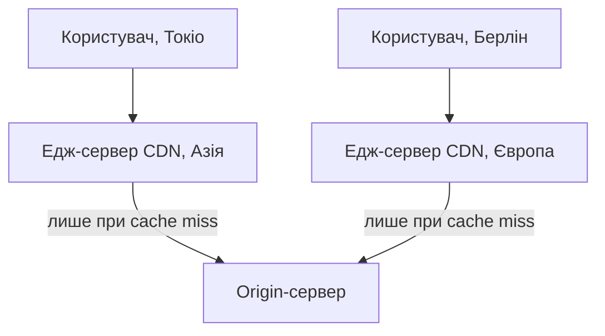

# CDN, балансування навантаження, відмовостійкий доступ до сервісів

> [!abstract]
> Наприкінці попередньої лекції ми пообіцяли: та сама ідея, яку виконує Service в межах одного кластера Kubernetes, масштабується до обслуговування мільйонів користувачів по всьому світу одночасно. Ця лекція завершує модуль про глобальні мережі, поєднуючи практично все, що ми вивчили в модулі, — DNS, BGP, WAN, latency — в одну узгоджену картину: як балансувальники навантаження розподіляють трафік між серверами, і як CDN фізично наближає контент до користувача, а не навпаки.

## Балансування навантаження: та сама ідея, вищий масштаб

У лекції 23 Service і kube-proxy вже виконували, по суті, роль балансувальника навантаження — стабільна адреса, за якою ховається мінливий набір реальних подів, між якими розподіляються запити. **Балансувальник навантаження (load balancer)** — узагальнення тієї самої ідеї, застосоване вже не лише всередині одного кластера, а на межі будь-якого сервісу, розрахованого на навантаження, яке жоден окремий сервер не витримав би самостійно.

> [!definition] Визначення
> **Балансувальник навантаження** — компонент мережі, що розподіляє вхідні запити між кількома серверами, які надають той самий сервіс, забезпечуючи одночасно і продуктивність (жоден сервер не перевантажений), і відмовостійкість (вихід з ладу одного сервера не робить сервіс недоступним повністю).

Балансувальники прийнято класифікувати за тим, на якому рівні моделі OSI (лекція 4) вони ухвалюють рішення про розподіл.

**Балансувальник рівня 4 (L4)** працює на транспортному рівні (лекція 10) — ухвалює рішення виключно на основі IP-адрес і портів (TCP/UDP), не заглядаючи у вміст самого з'єднання. Це швидко (менше обчислювальної роботи на пакет) і застосовне до будь-якого протоколу поверх TCP чи UDP, але без розуміння змісту трафіку — L4-балансувальник не вміє, наприклад, направити запит до конкретного бекенду залежно від того, яку саме сторінку сайту запитує клієнт.

**Балансувальник рівня 7 (L7)** працює на прикладному рівні, розуміючи сам протокол застосунку — типово HTTP/HTTPS (лекція 17): він читає заголовки запиту, шлях URL-адреси, ім'я хоста і на основі цього вмісту ухвалює значно детальніші рішення про маршрутизацію — концептуально це той самий **Ingress** з лекції 23, тільки розглянутий тепер у загальнішому, не прив'язаному до Kubernetes контексті. Оскільки L7-балансувальник має розуміти сам HTTPS-трафік, а не лише пересилати непрозорі зашифровані байти, він типово виконує **розшифрування TLS (TLS termination)**: приймає на себе роль сервера в TLS-рукостисканні з лекції 17 (з відповідним сертифікатом), розшифровує трафік, ухвалює рішення про маршрутизацію на основі відкритого вмісту запиту, і вже потім пересилає (часто — звичайним, незашифрованим HTTP) до конкретного внутрішнього сервера, знімаючи з кожного окремого бекенд-сервера обчислювальний тягар шифрування.

| | L4-балансувальник | L7-балансувальник |
|---|---|---|
| Рівень OSI | транспортний | прикладний |
| Рішення на основі | IP-адреса, порт | URL, заголовки HTTP, ім'я хоста |
| Розуміння вмісту | немає | так, включно з TLS termination |
| Швидкість обробки | вища | нижча (більше обчислень на запит) |
| Приклад із курсу | базовий NAT-баланс за портами (лекція 14, 22) | Ingress (лекція 23) |

## Алгоритми розподілу і проблема стану з'єднання

Сам розподіл запитів між доступними серверами можна виконувати за кількома алгоритмами. **Round robin** — найпростіший: кожен наступний запит іде до наступного сервера у списку по черзі, незалежно від поточного навантаження кожного. **Least connections** — врахування реального, поточного стану: новий запит спрямовується до сервера з найменшою кількістю активних з'єднань саме зараз, що краще враховує ситуацію, коли запити мають дуже різну тривалість обробки. **Зважений розподіл (weighted)** — адміністратор явно призначає кожному серверу вагу відповідно до його реальної обчислювальної потужності (потужніший сервер отримує пропорційно більше запитів) — той самий принцип явного пріоритету, який ми вже бачили як атрибут Weight у BGP (лекція 19), тільки застосований тут до розподілу навантаження, а не вибору шляху маршрутизації.

Окрема практична проблема, яку варто зафіксувати явно, — **збереження сесії (session persistence, sticky sessions)**. HTTP сам собою — протокол без стану (пригадайте це з лекції 17): кожен окремий запит формально не пов'язаний з попередніми. Але реальний застосунок (наприклад, кошик покупок в інтернет-магазині) часто зберігає стан сесії конкретного користувача в пам'яті конкретного сервера, до якого той користувач звернувся першим, — і якщо балансувальник наступного разу спрямує того самого користувача на *інший* сервер (за алгоритмом round robin, наприклад), той інший сервер нічого не знатиме про вже накопичений стан сесії. Розв'язання — налаштувати балансувальник запам'ятовувати, який саме сервер обслуговував конкретного клієнта раніше (типово через **IP hash**, коли вибір сервера обчислюється як функція від IP-адреси клієнта, або через спеціальну cookie, яку балансувальник додає до відповіді), і надалі свідомо спрямовувати того самого клієнта до того самого сервера.

## Перевірки стану: як балансувальник дізнається, що сервер "живий"

Балансувальник, що продовжує спрямовувати трафік до сервера, який насправді вже вийшов з ладу, — не просто марно, а шкідливо: частина користувачів гарантовано отримає помилку. **Перевірка стану (health check)** — механізм, яким балансувальник активно й регулярно перевіряє, чи справді кожен зареєстрований бекенд-сервер здатний обробляти запити, автоматично й тимчасово виключаючи з ротації ті, що не відповідають.

Найпростіша перевірка — на кшталт ICMP Echo Request з лекції 9 (просто перевірити, чи сервер узагалі відповідає в мережі), але значно практичніша й поширеніша — **прикладна перевірка**: балансувальник періодично надсилає HTTP-запит до спеціального, легкого діагностичного шляху (типово `/health` чи `/healthz`), і сервер, отримавши цей запит, відповідає кодом стану 200 лише тоді, коли справді готовий обробляти реальний трафік, — така перевірка виявляє значно ширший клас проблем, ніж проста мережева доступність: наприклад, сервер може бути мережево доступний (відповідає на ping), але його застосунок усередині "завис" чи втратив з'єднання з базою даних, — прикладна перевірка це виявить, а проста мережева — ні.

> [!example] Приклад
> Уявіть балансувальник із трьома бекенд-серверами. Раптово другий сервер перестає відповідати на перевірки стану (застосунок на ньому впав через помилку пам'яті). Балансувальник, помітивши кілька послідовних невдалих перевірок поспіль (типово перевірку повторюють кілька разів, а не виключають сервер після одного-єдиного пропущеного відгуку — щоб уникнути хибного спрацювання через одиничну, тимчасову затримку мережі), автоматично виключає другий сервер зі списку активних і надалі розподіляє весь трафік лише між першим і третім, — жоден користувач узагалі не помітить проблеми, і вже коли адміністратор перезапустить застосунок на другому сервері й той знову почне успішно відповідати на перевірки, балансувальник автоматично поверне його в ротацію. Це той самий принцип автоматичної адаптації до відмови без ручного втручання, який ми вже бачили в OSPF (лекція 16) через Dead-інтервал, і в SD-WAN (лекція 21) через миттєве перемикання каналів.

## Від одного дата-центру до всієї планети: проблема, яку не розв'язує самий лише баланс

Балансувальник навантаження, розглянутий дотепер, розподіляє трафік між кількома серверами *в межах одного дата-центру чи однієї VPC* (лекція 22) — і чудово розв'язує проблему навантаження на обчислення. Але навіть ідеально збалансований дата-центр не розв'язує іншу проблему, з якою ми вже стикались концептуально ще в лекції 1: **затримку**, зумовлену фізичною відстанню. Користувач у Токіо, що звертається до єдиного дата-центру десь у Європі, витрачає значний час просто на те, щоб сигнал фізично подолав тисячі кілометрів у обидва боки, — і жодне, навіть найдосконаліше балансування навантаження всередині цього європейського дата-центру цю проблему не зменшить ні на мілісекунду.

## CDN: наблизити контент до користувача, а не навпаки

**CDN (Content Delivery Network)** розв'язує саме цю задачу, перевертаючи логіку з ніг на голову: замість того щоб кожен запит користувача долав весь шлях до єдиного, центрального сервера (**origin server**, оригінальний, "справжній" сервер, де контент реально створюється й зберігається), CDN розгортає мережу географічно розподілених **едж-серверів (edge servers)** по всьому світу, кожен із яких зберігає **кешовану копію** контенту фізично близько до певної групи користувачів.

> [!definition] Визначення
> **CDN (Content Delivery Network)** — географічно розподілена мережа серверів, що кешують копії контенту фізично близько до кінцевих користувачів, зменшуючи затримку доступу й навантаження на оригінальний сервер.

Коли користувач у Токіо звертається до сайту, що користується CDN, його запит спрямовується не до далекого європейського origin-сервера, а до найближчого едж-сервера CDN, який, найімовірніше, фізично розташований десь у тому самому регіоні. Якщо потрібний контент уже є в кеші цього едж-сервера (**cache hit**), відповідь повертається користувачу практично миттєво, без жодної подорожі через океан. Якщо контенту в кеші ще немає (**cache miss** — типово при першому запиті цього конкретного ресурсу в цьому регіоні), едж-сервер сам звертається до origin-сервера (можливо, через ту саму приватну WAN-інфраструктуру провайдера з лекції 18, оптимізовану саме для такого зв'язку між точками CDN і origin), отримує контент, зберігає копію в себе на певний термін (той самий принцип **TTL**, що й для кешування DNS-записів у лекції 17, тільки застосований тепер до самого вмісту, а не до відповідності імені й адреси) і лише потім віддає його користувачу — усі *наступні* користувачі того самого регіону, що звернуться до того самого ресурсу, отримають його вже з кеша, без повторного походу до origin.

## Як запит фізично знаходить "найближчий" едж-сервер

Залишається практичне запитання: звідки клієнт узагалі дізнається IP-адресу *саме найближчого до нього* едж-сервера, якщо один і той самий домен сайту повинен вести до різних серверів для користувачів у різних частинах світу? Існує два основні підходи, і варто розуміти обидва, спираючись на матеріал попередніх лекцій модуля.

**Геолокаційний DNS (geo-DNS)** — DNS-резолвер CDN (пригадайте ієрархію DNS-розв'язання з лекції 17) свідомо повертає *різну* IP-адресу залежно від того, звідки геолокаційно (типово — за IP-адресою самого резолвера, що надіслав запит) прийшов конкретний DNS-запит: користувачу з Японії резолвер поверне адресу азійського едж-сервера, користувачу з Німеччини — адресу європейського, попри те що обидва запитували те саме доменне ім'я.

**Anycast** — значно елегантніший, "мережевий" підхід, що прямо спирається на BGP із лекції 19: та сама, буквально ідентична IP-адреса едж-сервера **одночасно оголошується через BGP із багатьох географічно розподілених точок присутності CDN**. Автономні системи інтернету (лекція 19), обчислюючи найкращий шлях до цієї адреси кожна для себе на основі власної, локальної BGP-таблиці (найкоротшого AS-шляху чи налаштованої політики), природним чином спрямовують трафік до **топологічно найближчої** з-поміж усіх точок присутності, що оголошують цю саму адресу, — без жодного спеціального геолокаційного рішення на рівні DNS: сама структура маршрутизації інтернету автоматично "притягує" запит до найближчої точки.

> [!info] Для допитливих
> Anycast може здаватись парадоксом, якщо пригадати, що ми говорили в лекції 19 про унікальність IP-адрес і про AS-шлях як механізм запобігання петлям, — але жодного протиріччя тут немає: кожна автономна система бачить не "одну адресу, оголошену звідусіль одночасно як плутанину", а просто кілька різних BGP-оголошень тієї самої мережі з різними AS-шляхами (кожен веде до іншої фізичної точки присутності), і застосовує до них той самий, уже знайомий вам процес вибору найкращого шляху — просто результат цього вибору для різних автономних систем у різних частинах світу природно виявляється різним, оскільки й топологічно найближчий AS-шлях для кожної з них — різний.

## CDN та економіка WAN-трафіку

Варто явно пов'язати CDN з темою, яку ми піднімали в лекції 18 і 19, — комерційними стосунками провайдерів. Без CDN весь трафік до origin-сервера змушений був би проходити через дорогий **транзит** (лекція 19) — оплачувані канали між автономними системами провайдерів на всьому шляху від origin до кожного окремого користувача по всьому світу. CDN, розмістивши едж-сервери фізично всередині чи безпосередньо поруч із мережами регіональних провайдерів (часто — через безкоштовний чи значно дешевший **пірінг**, той самий термін з лекції 19), суттєво скорочує обсяг трафіку, що взагалі повинен долати дорогі, довгі транзитні шляхи, — практична, комерційно вимірювана вигода, а не лише покращення користувацького досвіду через нижчу затримку.

## Повна картина: шлях одного запиту

Зведімо докупи все, що модуль про глобальні мережі розглянув за сім лекцій, простеживши єдиний, наскрізний шлях одного запиту користувача до великого сучасного сайту. Браузер користувача спершу розв'язує доменне ім'я через DNS (лекція 17) — і, якщо сайт користується anycast-CDN, це розв'язання веде до IP-адреси, яка через BGP (лекція 19) природно приведе з'єднання до топологічно найближчого едж-сервера. З'єднання встановлюється через послідовність WAN-каналів (лекція 18) кількох провайдерів. На самому едж-сервері CDN L7-балансувальник (сьогоднішня лекція) приймає TLS-з'єднання (лекція 17), перевіряє, чи є контент у кеші, і за потреби звертається до origin-сервера — можливо, через захищений VPN-канал (лекція 20) чи виділене підключення, якщо origin розміщений у приватній хмарній VPC (лекція 22). Усередині самого origin-дата-центру запит потрапляє до внутрішнього балансувальника (як Service та Ingress у Kubernetes, лекція 23), що розподіляє його між десятками фактичних подів застосунку. Кожен окремий елемент цього ланцюга — тема, яку ми детально розглянули своєю окремою лекцією, і саме зараз, наприкінці модуля, ви маєте змогу побачити, як усі сім лекцій складаються в одну узгоджену, наскрізну картину роботи сучасного інтернету — від фізичного WAN-каналу до кешу контенту на іншому кінці планети.

> [!exam] На іспиті
> Типові питання: а) розрізнити L4 та L7 балансувальники за рівнем ухвалення рішень і навести приклад задачі, яку розв'яже лише L7; б) пояснити проблему збереження сесії (sticky sessions) і чому вона взагалі виникає з протоколом без стану; в) пояснити роль перевірок стану (health checks) і чому прикладна перевірка практичніша за просту мережеву; г) дати визначення CDN і пояснити, яку саме проблему (не розв'язувану самим лише балансуванням навантаження) він розв'язує; д) порівняти geo-DNS та anycast як два способи спрямувати клієнта до найближчого едж-сервера.

## Завдання на занятті (20 хв)

1. У парі поясніть одне одному, чому L4-балансувальник не зможе виконати завдання "направляти запити на `/api` до одних серверів, а запити на `/images` — до інших", тоді як L7 зможе.
2. Обговоріть: інтернет-магазин з кошиком покупок, що зберігається в пам'яті конкретного сервера, вирішує перейти на балансування навантаження round robin без sticky sessions. Що конкретно піде не так для користувача, і як це виправити?
3. Розпишіть послідовність дій балансувальника з трьома бекендами, коли health check другого сервера тричі поспіль не відповідає, а потім знову починає відповідати успішно.
4. Порівняйте усно geo-DNS і anycast для сценарію CDN із трьома едж-серверами (Європа, Азія, Америка): який із двох підходів спирається на BGP, а який — виключно на DNS-резолвер, і чим відрізняється швидкість реакції кожного підходу на відмову одного з едж-серверів.

> [!question] Перевірте себе
> 1. Чим L4-балансувальник відрізняється від L7 за тим, на основі чого кожен із них ухвалює рішення?
> 2. Що таке TLS termination і чому саме L7-балансувальник (а не L4) типово її виконує?
> 3. Чому HTTP як протокол без стану створює практичну проблему для балансування навантаження застосунків, що зберігають сесію користувача, і як sticky sessions цю проблему розв'язують?
> 4. Яку конкретну проблему CDN розв'язує, яку саме балансування навантаження всередині одного дата-центру розв'язати не може?
> 5. Поясніть своїми словами, як anycast спирається на механізм вибору найкращого BGP-шляху (лекція 19), щоб автоматично спрямувати користувача до найближчого едж-сервера.

## Назад
← [[courses/computer-networks/lectures/23-merezhi-konteineriv-i-kubernetes|Лекція 23. Мережі контейнерів і Kubernetes]]

## Далі
→ [[courses/computer-networks/lectures/25-merezhevi-operatsiini-systemy|Лекція 25. Мережеві операційні системи]]

## Література
- Cisco Networking Academy. *Connecting Networks* (курс CCNA v7/v7.1) — розділ про балансування навантаження та CDN.
- RFC 1546 (Host Anycasting Service).
- Cloudflare Learning Center. *What Is a CDN?* та *Load Balancing*.
- Одом У. *Officially Licensed Cert Guide CCNA 200-301* — розділ про сучасні мережеві сервіси.
