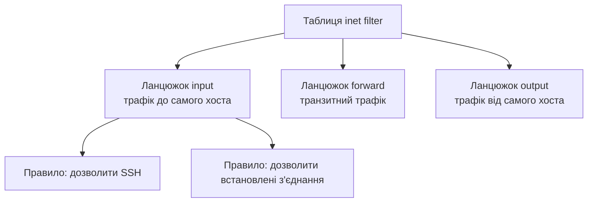

# Linux-мережі: налаштування інтерфейсів, маршрутизація, nftables

> [!abstract]
> У лекції 13 ви вперше увійшли в консоль Cisco IOS і навчились призначати адреси інтерфейсам, будувати таблицю маршрутизації й фільтрувати трафік ACL. Сьогодні ми виконаємо буквально ті самі три задачі – але на Linux-сервері, командним рядком Bash, і побачимо, наскільки схожа сама логіка, попри цілковито іншу конкретну реалізацію. Розберемо сучасний інструментарій `ip`, механізм увімкнення IP-форвардингу, що перетворює звичайний сервер на маршрутизатор, і nftables – сучасний, наступного покоління механізм фільтрації трафіку в ядрі Linux.

## Сучасний інструментарій: пакет iproute2

Історично Linux керував мережею командами `ifconfig` (інтерфейси) і `route` (таблиця маршрутизації) – обидві сьогодні вважаються застарілими (deprecated) і в сучасних дистрибутивах часто навіть не встановлені за замовчуванням. Ця ситуація дуже нагадує те, що ми вже бачили в лекції 11 стосовно класової адресації, витісненої CIDR, чи в лекції 20 стосовно WireGuard як свідомо простішої заміни IPsec: старий інструмент технічно ще працює десь у застарілих системах, але сучасна практика однозначно рекомендує новий. Сучасний, рекомендований стандарт – пакет **iproute2** і його центральна команда **`ip`**, яка об'єднує керування інтерфейсами, адресацією й маршрутизацією в один узгоджений, послідовний синтаксис.

## Перегляд і налаштування інтерфейсів

Перегляд стану всіх мережевих інтерфейсів виконується командою `ip addr show` (часто скорочують до `ip a`) – прямий функціональний аналог команди `show ip interface brief`, з якою ви вже практикувались у лекції 13.

```text
$ ip addr show
1: lo: <LOOPBACK,UP,LOWER_UP> mtu 65536
    inet 127.0.0.1/8 scope host lo
2: eth0: <BROADCAST,MULTICAST,UP,LOWER_UP> mtu 1500
    inet 192.168.1.10/24 brd 192.168.1.255 scope global eth0
```

Зверніть увагу на кілька практичних деталей цього виводу. По-перше, IP-адреса записана прямо в **CIDR-нотації** (`192.168.1.10/24`) – тому самому короткому запису з лекції 11, без потреби окремо вказувати повну маску 255.255.255.0. По-друге, перший інтерфейс у списку, `lo`, – це той самий **loopback**-інтерфейс (127.0.0.1), про який ми згадували в лекції 11 стосовно спеціальних адрес: у Linux, на відміну від Cisco IOS, loopback завжди присутній автоматично на кожному хості, навіть найпростішому.

Призначення нової IP-адреси інтерфейсу й увімкнення самого інтерфейса виконуються двома окремими командами:

```text
$ sudo ip addr add 192.168.1.10/24 dev eth0
$ sudo ip link set eth0 up
```

Друга команда – `ip link set eth0 up` – концептуально виконує ту саму роль, що й `no shutdown` у Cisco IOS з лекції 13: явно переводить інтерфейс у робочий, активний стан. Логіка тут навіть прозоріша за подвійне заперечення IOS (`no shutdown` буквально означає "не вимкнено") – Linux просто явно каже `up` чи `down`, без синтаксичної гри слів.

> [!warning] Типова помилка
> Команди `ip addr add` і `ip link set` вносять зміни **негайно й миттєво**, точно так само, як команди Cisco IOS одразу застосовуються до running-config, – але, і це критично важливо, **ці зміни не переживають перезавантаження сервера**, якщо їх не закріпити окремо в постійному конфігураційному файлі мережі (спосіб залежить від дистрибутива – Netplan в Ubuntu, NetworkManager у більшості дистрибутивів родини Red Hat) чи через `systemd-networkd`. Це буквально та сама пастка, яку ми детально розглядали в лекції 13 стосовно різниці running-config проти startup-config: команда, введена прямо в термінал, – це "жива", тимчасова конфігурація, аналог running-config у пам'яті, а постійний конфігураційний файл на диску – це аналог startup-config, який справді переживає перезавантаження. Забути зберегти зміни постійно – так само прикро втратити годину роботи на Linux-сервері, як і забути `copy running-config startup-config` на Cisco-маршрутизаторі.

## Таблиця маршрутизації в Linux

Перегляд таблиці маршрутизації – команда `ip route show` (скорочено `ip r`), функціонально те саме, що `show ip route` з лекцій 15-16.

```text
$ ip route show
default via 192.168.1.1 dev eth0
192.168.1.0/24 dev eth0 proto kernel scope link src 192.168.1.10
10.0.0.0/24 via 192.168.1.254 dev eth0
```

Перший рядок – саме той **маршрут за замовчуванням**, детально розглянутий у лекції 15, тільки записаний тут ключовим словом `default` замість явного 0.0.0.0/0. Другий рядок – автоматичний запис для мережі, до якої інтерфейс підключений безпосередньо (аналог літери `C`, Connected, у виводі Cisco `show ip route`). Третій рядок – приклад статичного маршруту, доданого вручну.

Додавання статичного маршруту й маршруту за замовчуванням:

```text
$ sudo ip route add 10.0.0.0/24 via 192.168.1.254
$ sudo ip route add default via 192.168.1.1
```

Синтаксично й концептуально це те саме, що команда `ip route <мережа> <маска> <наступний_перехід>` з лекції 15, – просто CIDR-нотація замість окремої маски, і слово `via` замість простого переліку параметрів поспіль. Та сама увага до постійності конфігурації, розглянута вище для адрес інтерфейсів, стосується й маршрутів: команда `ip route add` теж діє лише до перезавантаження, якщо не закріплена в постійному конфігураційному файлі мережі.

## IP-форвардинг: коли звичайний сервер стає маршрутизатором

Тут криється практична відмінність, вартий окремого пояснення: Cisco-маршрутизатор із лекції 13 за замовчуванням *призначений* пересилати трафік між своїми інтерфейсами – саме це і є його основне призначення. Звичайний Linux-сервер, навіть із кількома мережевими інтерфейсами й повністю коректно налаштованою таблицею маршрутизації, **за замовчуванням пакети між своїми інтерфейсами не пересилає** – ядро Linux зі своїх безпекових міркувань вважає, що сервер із кількома мережевими картками – це, найімовірніше, сервер, під'єднаний одночасно до кількох сегментів для власних потреб, а не маршрутизатор, і не буде мимоволі пересилати чужий транзитний трафік, доки адміністратор явно цього не дозволить.

Явний дозвіл – параметр ядра **`net.ipv4.ip_forward`**, який потрібно встановити в значення `1`:

```text
$ sudo sysctl -w net.ipv4.ip_forward=1
```

Щойно цей параметр увімкнено, звичайний Linux-сервер із двома чи більше мережевими інтерфейсами фактично перетворюється на повноцінний маршрутизатор – той самий принцип, який ми вперше зустріли в лекції 3, коли говорили про те, що функції маршрутизатора, комутатора й міжмережевого екрана не обов'язково потребують окремих спеціалізованих коробок, а можуть бути реалізовані програмно на звичайному, універсальному обладнанні. Саме тому, попри весь курс, побудований навколо спеціалізованого обладнання Cisco, реальна інфраструктура сучасного дата-центру чи хмарного провайдера (лекції 21-23) часто фактично будується саме на Linux-серверах, що виконують роль маршрутизаторів і навіть комутаторів програмно.

## nftables: сучасна фільтрація трафіку в ядрі Linux

**nftables** – сучасна, наступного покоління заміна старішого `iptables` (той самий інструмент, який ми побіжно згадували в лекції 23 стосовно того, як Docker реалізує NAT на хості) – уніфікований, ефективніший механізм фільтрації пакетів, вбудований безпосередньо в ядро Linux. Структура правил nftables організована ієрархічно, і варто засвоїти цю ієрархію перед тим, як писати перше правило.

**Таблиця (table)** – верхній контейнер, що групує набір ланцюжків, типово за протоколом (`ip` для IPv4, `ip6` для IPv6, `inet` для обох одразу). **Ланцюжок (chain)** – упорядкований список правил, прив'язаний до конкретної точки обробки пакета в ядрі: `input` (пакети, призначені самому хосту), `output` (пакети, що хост сам генерує й надсилає), `forward` (пакети, що *транзитом* проходять через хост, – саме той трафік, що з'являється, щойно ввімкнено IP-форвардинг вище). **Правило (rule)** – конкретна умова й дія (`accept`, `drop`), що застосовується до пакетів, які підпадають під ланцюжок.



Розглянемо базовий, практичний набір правил для сервера, що дозволяє SSH (пригадайте порт 22 і саму технологію з лекції 20, детальніше – у лекції 40) і HTTP/HTTPS, а решту вхідного трафіку відкидає:

```text
$ sudo nft add table inet filter
$ sudo nft add chain inet filter input { type filter hook input priority 0 \; policy drop \; }
$ sudo nft add rule inet filter input ct state established,related accept
$ sudo nft add rule inet filter input iif lo accept
$ sudo nft add rule inet filter input tcp dport 22 accept
$ sudo nft add rule inet filter input tcp dport { 80, 443 } accept
```

Розберемо ключові деталі. `policy drop` в означенні ланцюжка – це та сама **неявна заборона**, яку ми детально розглядали для ACL Cisco в лекції 14, тільки тут вона не неявна, а явно, свідомо задана як типова політика ланцюжка. Другий рядок – `ct state established,related accept` – заслуговує особливої уваги: `ct` означає **connection tracking (conntrack)**, механізм ядра Linux, що відстежує стан кожного з'єднання, – і саме завдяки цьому рядку nftables поводиться як **stateful**-фільтр, той самий термін, який ми вводили в лекції 22 стосовно груп безпеки хмарних провайдерів: якщо вихідне з'єднання дозволене (наприклад, сервер сам звертається кудись назовні), відповідь на нього повертається автоматично, без потреби писати для неї окреме, симетричне правило, – на відміну від класичного ACL Cisco з лекції 14, що є stateless і вимагав явного `permit ip any any` для зворотного трафіку.

> [!definition] Визначення
> **Conntrack (connection tracking)** – механізм ядра Linux, що відстежує стан кожного мережевого з'єднання (нове, встановлене, пов'язане), дозволяючи nftables (і iptables до нього) ухвалювати рішення про фільтрацію на основі стану з'єднання, а не лише вмісту окремого пакета, – те саме, що робить фільтрацію **stateful**.

## NAT засобами nftables

Той самий сервер, налаштований для IP-форвардингу, часто одночасно виконує роль NAT-шлюзу для внутрішньої мережі – прямий аналог того, що ми вручну конфігурували командами `ip nat inside`/`overload` на Cisco IOS у лекції 14, і того, що робить керований NAT-шлюз VPC в лекції 22.

```text
$ sudo nft add table ip nat
$ sudo nft add chain ip nat postrouting { type nat hook postrouting priority 100 \; }
$ sudo nft add rule ip nat postrouting oif "eth0" masquerade
```

Ключове слово **`masquerade`** – це, по суті, готова реалізація PAT (Port Address Translation): усі вихідні пакети, що покидають хост через інтерфейс `eth0`, транслюються на публічну (чи зовнішню) адресу цього інтерфейсу, з розрізненням окремих з'єднань за портами, – той самий принцип, розглянутий детально в лекції 14, застосований тепер у синтаксисі nftables замість `overload` Cisco IOS.

## Постійність правил nftables

Той самий принцип, який ми вже двічі підкреслили для адрес інтерфейсів і маршрутів вище, стосується й правил nftables: команди `nft add`, введені прямо в термінал, діють негайно, але зникають після перезавантаження. Постійне збереження правил відбувається через конфігураційний файл (типово `/etc/nftables.conf`), що системний сервіс `nftables` автоматично завантажує командою `nft -f /etc/nftables.conf` під час запуску системи, – концептуально те саме `copy running-config startup-config` з лекції 13, тільки реалізоване не окремою командою "збережи поточний стан", а окремим текстовим файлом, який потрібно свідомо підтримувати в актуальному стані.

> [!exam] На іспиті
> Типові питання: а) назвати сучасну команду `ip` та її основні підкоманди (`addr`, `link`, `route`) і провести паралель із відповідними командами Cisco IOS з лекції 13; б) пояснити, чому конфігурація через `ip`, введена в термінал, не переживає перезавантаження, і як це концептуально пов'язано з running-config/startup-config; в) пояснити, чому Linux-сервер за замовчуванням не пересилає трафік між інтерфейсами і який параметр ядра це вмикає; г) описати структуру nftables (таблиця, ланцюжок, правило) і роль `policy drop`; д) пояснити, чому nftables – stateful-фільтр, спираючись на роль conntrack, і провести паралель зі stateful групами безпеки з лекції 22.

## Завдання на занятті (20 хв)

1. Складіть послідовність команд `ip`, що призначає інтерфейсу `eth1` адресу 10.5.5.1/24, вмикає його й додає статичний маршрут до мережі 172.16.0.0/16 через шлюз 10.5.5.254.
2. У парі поясніть одне одному, чому команда `ip link set eth0 up` концептуально виконує ту саму роль, що й `no shutdown` у Cisco IOS, попри цілковито інший синтаксис.
3. Розпишіть, які саме два кроки (параметр ядра й правило nftables) потрібні, щоб перетворити звичайний Linux-сервер із двома мережевими картками на NAT-шлюз для внутрішньої мережі за ним.
4. Обговоріть: чому правило `ct state established,related accept` настільки практично важливе в базовому наборі правил nftables – що конкретно станеться з відповідями на власні вихідні з'єднання сервера, якщо це правило прибрати?

> [!question] Перевірте себе
> 1. Якою командою `ip` переглянути список усіх мережевих інтерфейсів та їхні адреси, і яка команда Cisco IOS виконує аналогічну роль?
> 2. Чому зміни, внесені командами `ip addr add` і `ip route add`, зникають після перезавантаження сервера, якщо не вжити додаткових кроків?
> 3. Який параметр ядра Linux потрібно ввімкнути, щоб сервер почав пересилати транзитний трафік між своїми інтерфейсами?
> 4. З яких трьох елементів складається структура правил nftables, і яку роль виконує `policy drop`?
> 5. Що таке conntrack і чому саме він робить nftables stateful-фільтром?

## Назад
← [[courses/computer-networks/lectures/25-merezhevi-operatsiini-systemy|Лекція 25. Мережеві операційні системи]]

## Далі
→ [[courses/computer-networks/lectures/27-windows-server-roli-ta-sluzhby|Лекція 27. Windows Server ролі та служби]]

## Література
- Kernel.org / iproute2 Documentation – офіційна документація команди `ip`.
- Netfilter Project. *nftables Wiki* – офіційна документація nftables.
- Nemeth E. et al. *UNIX and Linux System Administration Handbook*, 5th edition – розділ про мережеву конфігурацію Linux.
- Red Hat. *Configuring and Managing Networking* – офіційна документація RHEL.
