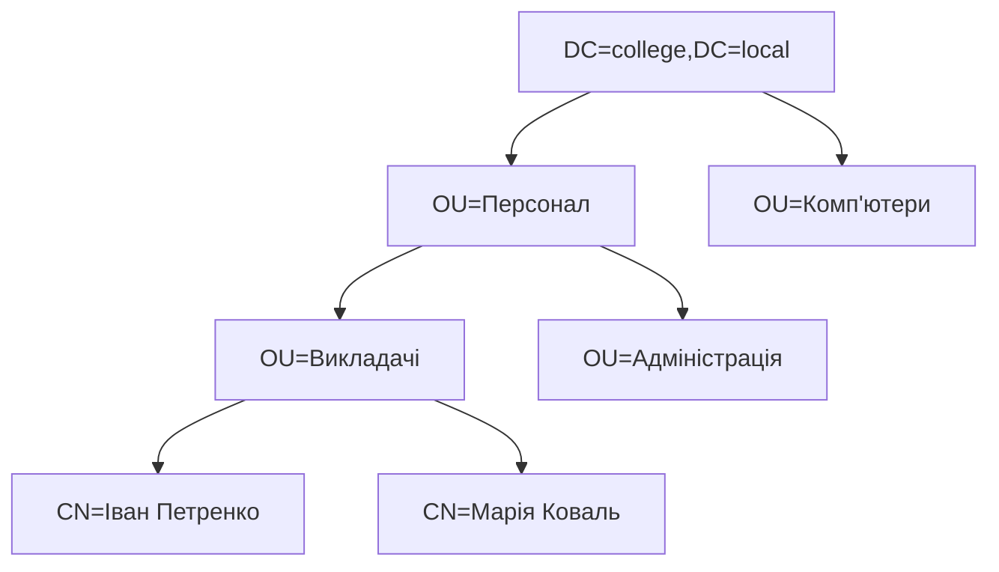

# Служба каталогів: Active Directory та LDAP

> [!abstract]
> Попередній модуль дав нам сервери, здатні надавати служби, – файлові, вебслужби, DNS, DHCP. Але кожна з них досі відповідала на запитання "що робити", жодного разу не відповівши на не менш важливе – "кому це дозволено". Розберемо службу каталогів: чому підприємству з десятками серверів і сотнями співробітників потрібен єдиний, централізований реєстр користувачів і ресурсів, як влаштований протокол LDAP, що описує доступ до такого реєстру, і чим саме Active Directory є більшим, ніж просто реалізацією LDAP.

## Проблема, яку розв'язує служба каталогів

Уявіть підприємство на двісті співробітників, у якому працює десяток серверів – файловий, поштовий, вебсервер внутрішнього порталу, сервер бухгалтерської системи, кілька Linux-машин із базами даних. Без служби каталогів кожен із цих серверів веде **власний, окремий, ні з ким не узгоджений список облікових записів**: своє ім'я користувача й свій пароль для кожного співробітника на кожному сервері окремо.

Наслідки такого підходу навіть перелічувати неприємно. Новий співробітник вимагає створення десяти окремих облікових записів вручну. Зміна пароля означає зміну в десяти місцях (а насправді – не означає, бо жоден користувач цього робити не буде, і паролі поступово стають однаковими й вічними). Найнебезпечніше: коли співробітник звільняється, адміністратор має пам'ятати й вимкнути всі десять облікових записів, – і саме той один забутий обліковий запис на маловживаному сервері й стає згодом дірою в безпеці, через яку колишній працівник (чи той, хто отримав його пароль) заходить у мережу через півроку після звільнення.

**Служба каталогів (directory service)** розв'язує саме цю проблему, виносячи інформацію про користувачів, комп'ютери, групи й ресурси в **єдине, централізоване, доступне мережею сховище**, до якого всі служби підприємства звертаються з тим самим питанням – "хто цей користувач і що йому дозволено?" – замість того щоб кожна вела власну відповідь окремо.

> [!definition] Визначення
> **Служба каталогів** – централізована мережева база даних про об'єкти підприємства (користувачів, комп'ютери, групи, принтери, спільні ресурси) з єдиною автентифікацією та керуванням доступом, до якої звертаються всі служби мережі замість ведення власних окремих списків облікових записів.

Практичний наслідок, який варто зафіксувати одразу: служба каталогів робить можливим **єдиний вхід (single sign-on, SSO)** – користувач вводить пароль один раз, входячи у свій комп'ютер уранці, і після цього прозоро отримує доступ до файлового сервера, внутрішнього порталу й принтера без жодного повторного введення пароля. Механізм, який робить це технічно можливим, – протокол Kerberos, якому присвячена окрема лекція 34.

## Каталог – це не звичайна база даних

Природне запитання: якщо потрібне централізоване сховище даних, чому б не використати звичайну реляційну базу даних, як для бухгалтерської системи? Відповідь у характері навантаження, і саме вона пояснює всі архітектурні особливості, які ми розглянемо далі.

Каталог **читають набагато частіше, ніж змінюють**: кожен вхід користувача, кожне звернення до файлової папки, кожна перевірка членства в групі – це операція читання, і таких операцій тисячі на хвилину, тоді як запис (створення нового працівника, зміна посади) відбувається кілька разів на день. Тому служба каталогів оптимізована саме під швидке читання й **реплікацію** – тримання кількох синхронізованих копій каталогу на різних серверах, щоб кожен запит обслуговувався найближчою копією, а відмова однієї не зупиняла роботу підприємства.

Друга принципова відмінність – **ієрархічна структура** замість таблиць із рядками. Каталог організований як дерево, дуже схоже на дерево папок файлової системи – чи, що ближче до нашого курсу, на ієрархію DNS із лекції 17, де кожен рівень уточнює попередній.

## LDAP: протокол доступу до каталогу

**LDAP (Lightweight Directory Access Protocol)** – стандартизований протокол, що описує, як клієнт звертається до служби каталогів: як шукає об'єкти, як читає їхні властивості, як автентифікується. Слово "lightweight" у назві історичне – LDAP був спрощеною заміною значно важчого попередника (протоколу X.500 DAP), і саме ця спрощеність зробила його фактичним стандартом для всієї галузі.

Критично важливо чітко розуміти: **LDAP – це протокол, а не продукт**. Так само, як HTTP (лекція 17) – це протокол, що його реалізують різні вебсервери (Nginx, Apache, IIS із лекції 29), LDAP – протокол, який реалізують різні служби каталогів: Active Directory від Microsoft, OpenLDAP у світі Linux, FreeIPA, каталоги мережевого обладнання.

LDAP працює поверх TCP (лекція 10) на **порту 389**, а захищений варіант – **LDAPS** – на **порту 636**, використовуючи те саме шифрування TLS, яке ми детально розбирали в лекції 17. Ця деталь не формальна: незашифрований LDAP передає паролі мережею у вигляді, доступному для перехоплення, тому будь-яке промислове розгортання сьогодні використовує саме захищений варіант – той самий принцип, з якого HTTP поступився HTTPS.

## Як влаштоване дерево каталогу

Кожен об'єкт каталогу – користувач, комп'ютер, група – має унікальне ім'я, що описує його **повне розташування в дереві**. Це ім'я називається **DN (Distinguished Name)** і читається справа наліво, від кореня дерева до самого об'єкта:

```text
CN=Іван Петренко,OU=Викладачі,OU=Персонал,DC=college,DC=local
```

Розберемо його по компонентах, бо саме цей запис ви бачитимете в кожній консолі керування каталогом і в кожному скрипті PowerShell до кінця модуля.

**DC (Domain Component)** – компонент доменного імені. Пара `DC=college,DC=local` – це буквально домен `college.local`, розбитий на частини; саме тут видно пряме родинне зближення з DNS із лекції 17, і воно не випадкове, як побачимо нижче.

**OU (Organizational Unit)** – організаційна одиниця, контейнер-"папка" всередині домену, що дозволяє групувати об'єкти за структурою підприємства (відділи, філії, категорії персоналу). У прикладі вище об'єкт лежить у папці `Викладачі` всередині папки `Персонал`. Організаційним одиницям і тому, як від них залежить керування, присвячена лекція 32.

**CN (Common Name)** – власне ім'я самого об'єкта.



Сам об'єкт – це набір **атрибутів**, пар "властивість – значення": ім'я входу, електронна пошта, телефон, посада, членство в групах. Який саме набір атрибутів дозволений для об'єкта певного типу, визначає **схема (schema)** каталогу – формальний опис усіх можливих класів об'єктів та їхніх атрибутів. Схему можна розширювати (наприклад, застосунок може додати власний атрибут до класу "користувач"), але робиться це свідомо й обережно, бо схема спільна для всього каталогу й зміни в ній незворотні.

## Основні операції LDAP

Практично весь обмін між клієнтом і каталогом зводиться до кількох типів операцій, які варто знати за назвами, бо саме ними оперують журнали подій і документація.

**Bind** – автентифікація клієнта перед каталогом: клієнт пред'являє DN і пароль, і саме ця операція фактично перевіряє, чи справді користувач той, за кого себе видає. Окремо існує **anonymous bind** – з'єднання без автентифікації взагалі, яке в промислових каталогах зазвичай свідомо забороняють.

**Search** – найчастіша операція: пошук об'єктів, що відповідають заданому фільтру, у заданій частині дерева. Фільтри LDAP мають характерний, впізнаваний синтаксис із дужками:

```text
(&(objectClass=user)(department=Бухгалтерія))
```

Цей фільтр означає "усі об'єкти, які одночасно є користувачами *і* мають атрибут відділу зі значенням Бухгалтерія" – логічне І позначається символом `&` на початку, а кожна умова береться у власні дужки.

**Add**, **Modify**, **Delete** – створення, зміна й видалення об'єктів; саме ці операції виконуються, коли адміністратор заводить нового співробітника чи змінює його посаду.

> [!example] Приклад
> Коли співробітник уранці вводить логін і пароль на своєму комп'ютері, відбувається послідовність, у якій ви тепер упізнаєте кожен крок: комп'ютер звертається до каталогу з операцією bind, каталог перевіряє відповідність пароля обліковому запису, після чого комп'ютер виконує search, щоб дізнатись, у яких групах цей користувач перебуває, і які політики до нього застосовуються. Уся ця послідовність триває частки секунди й повністю прихована від користувача, який бачить лише те, що його робочий стіл завантажився.

## Active Directory: більше, ніж LDAP

Тепер ключове твердження цієї лекції, яке визначає весь подальший модуль. **Active Directory – не просто реалізація LDAP**, а комплекс із трьох технологій, які працюють разом і без жодної з яких AD просто не функціонує.

**LDAP** відповідає за структуру каталогу й доступ до даних – усе, що ми розглянули вище.

**Kerberos** відповідає за автентифікацію й той самий єдиний вхід, про який ми говорили на початку: саме він видає користувачеві "квиток", який далі приймають усі служби підприємства без повторного запиту пароля. Детально механіку Kerberos розберемо в лекції 34.

**DNS** відповідає за те, щоб клієнт узагалі знайшов контролер домену в мережі. І ось тут остаточно розкривається зв'язок, який ми двічі зачіпали раніше – у лекції 27, коли зазначили, що роль DNS Server майже завжди розгортають разом з AD DS, і в лекції 28, коли розгортали DNS практично. Клієнт, що входить у домен, не має жодного вбудованого знання про адресу контролера домену – він знаходить його, роблячи DNS-запит спеціального типу, **SRV-запису** (service record), який відповідає на питання не "яка адреса цього імені" (як A-запис із лекції 17), а "який сервер надає таку-то службу в цьому домені".

> [!warning] Типова помилка
> Саме через цю залежність переважна більшість проблем із Active Directory, з якими ви зіткнетесь на практиці, насправді виявляються **проблемами DNS**, а не самої AD: комп'ютер не може приєднатись до домену, користувач не входить, групові політики не застосовуються – і в дев'яти випадках із десяти причина в тому, що клієнт вказує не на той DNS-сервер (наприклад, на публічний 8.8.8.8 замість внутрішнього контролера домену) і тому просто не знаходить потрібних SRV-записів. Практичний висновок, вартий запам'ятовування назавжди: **члени домену мають використовувати внутрішній DNS-сервер домену, а не зовнішній**, – і саме це перше, що варто перевіряти при будь-якій незрозумілій проблемі з доменом.

**Контролер домену (domain controller, DC)** – сервер, на якому працює роль AD DS (та сама, яку ми встановлювали в лекції 27) і який зберігає копію бази даних каталогу. Контролерів у домені завжди роблять щонайменше два – той самий принцип резервування, що пройшов через увесь курс від плаваючих маршрутів у лекції 15 до зон доступності в лекції 22, – і між ними відбувається **реплікація**: зміна, внесена на одному контролері, автоматично поширюється на решту.

## Альтернативи у світі Linux

Оскільки цей модуль неминуче зосереджений на Active Directory як домінантному рішенні для підприємств, варто явно назвати те, що існує поза екосистемою Microsoft, – інакше складеться хибне враження, ніби служба каталогів буває лише одна.

**OpenLDAP** – класична, чиста реалізація LDAP-сервера для Linux: дуже гнучка, але саме "лише каталог", без вбудованих Kerberos, політик і решти надбудов AD. **FreeIPA** (комерційна версія – Red Hat Identity Management) – значно ближчий аналог AD за задумом: поєднує каталог, Kerberos, керування сертифікатами й політиками в одному інтегрованому рішенні для Linux-середовища. **Samba**, з якою ми познайомились у лекції 29 як із реалізацією SMB, за додаткового налаштування здатна виконувати роль контролера домену, сумісного з Active Directory, – практичний місток між двома світами для мішаних мереж.

| | Active Directory | OpenLDAP | FreeIPA |
|---|---|---|---|
| Платформа | Windows Server | Linux | Linux |
| Каталог (LDAP) | так | так | так |
| Вбудований Kerberos | так | ні (окремо) | так |
| Групові політики | так (лекція 33) | ні | частково (аналоги) |
| Типове застосування | мережі з парком Windows-станцій | застосунки, що потребують лише каталогу | Linux-орієнтовані підприємства |

## Куди веде цей модуль

Ця лекція заклала понятійний фундамент: що таке каталог, як він структурований і чому AD – це LDAP плюс Kerberos плюс DNS. Наступні лекції розкладуть кожен шар окремо. **Лекція 31** розгляне логічну й фізичну структуру AD – домени, дерева, ліси й сайти, тобто те, як каталог масштабується від одного офісу до міжнародної корпорації. **Лекція 32** спуститься до щоденної практики адміністратора – користувачів, груп і організаційних одиниць. **Лекція 33** покаже групові політики – механізм, заради якого підприємства найчастіше й впроваджують AD. **Лекція 34** розкриє Kerberos і споріднені протоколи автентифікації, а **лекція 35** – те, як усе це виглядає сьогодні в хмарну епоху, коли класичний домен доповнюється хмарною ідентичністю.

> [!exam] На іспиті
> Типові питання: а) пояснити, яку конкретну проблему підприємства розв'язує служба каталогів, і навести приклад ризику мережі без неї; б) пояснити, чому каталог не є звичайною реляційною базою даних (переважання читання, реплікація, ієрархія); в) розшифрувати компоненти DN (CN, OU, DC) на заданому прикладі; г) назвати основні операції LDAP і порти 389/636; д) пояснити, з яких трьох технологій складається Active Directory і яку роль виконує кожна, включно з роллю SRV-записів DNS.

## Завдання на занятті (20 хв)

1. Запишіть повний DN для користувача Олени Шевчук, що працює в організаційній одиниці `Лаборанти` всередині `Персонал` у домені `ksm.college.local`.
2. У парі поясніть одне одному на конкретному сценарії (звільнення співробітника), чим мережа зі службою каталогів безпечніша за мережу з окремими обліковими записами на кожному сервері.
3. Складіть LDAP-фільтр, що знайде всі об'єкти-комп'ютери (`objectClass=computer`), розташовані у відділі з атрибутом `department=Лабораторія`, за зразком фільтра з лекції.
4. Обговоріть: чому саме DNS, а не сам LDAP, найчастіше виявляється справжньою причиною проблем із входом у домен, і яку конкретну перевірку ви зробите першою?

> [!question] Перевірте себе
> 1. Що таке служба каталогів і яку проблему вона розв'язує порівняно з окремими обліковими записами на кожному сервері?
> 2. Чому службу каталогів оптимізують саме під читання, а не під запис?
> 3. Що означають компоненти CN, OU і DC у складі Distinguished Name?
> 4. На яких портах працює LDAP і LDAPS, і чому промислові розгортання використовують саме другий?
> 5. З яких трьох технологій складається Active Directory, і яку роль у ній виконують SRV-записи DNS?

## Назад
← [[courses/computer-networks/lectures/29-veb-failovi-sluzhby-ta-docker|Лекція 29. Веб-, файлові служби та Docker]]

## Далі
→ [[courses/computer-networks/lectures/31-struktura-active-directory|Лекція 31. Структура Active Directory]]

## Література
- Microsoft Learn. *Active Directory Domain Services Overview* – офіційна документація.
- RFC 4510-4519 – набір стандартів LDAP версії 3.
- Desmond B. et al. *Active Directory: Designing, Deploying, and Running Active Directory*, 5th edition.
- FreeIPA Project Documentation – огляд архітектури альтернативного рішення для Linux.
