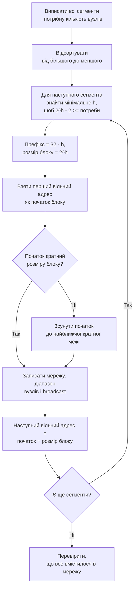

# Розрахунок адресного простору

> [!abstract] Пов'язана лекція
> [[courses/computer-networks/lectures/11-ipv4-adresatsiia-ta-pidmerezhi|Лекція 11. IPv4-адресація та підмережі]]. Тут ви застосовуєте все, що почули на лекції, до однієї повної задачі: поділити виділену коледжу мережу на підмережі різного розміру за методом VLSM, скласти таблицю адресації й довести, що жодна підмережа не перетинається з іншою.

## Мета

Навчитися без калькулятора підмереж переводити маску в префікс і назад, знаходити адресу мережі, broadcast і діапазон вузлів, а також розподіляти блок адрес між сегментами різного розміру так, щоб не втратити жодної адреси даремно і не допустити перетину блоків.

Після заняття ви повинні вміти:

- за IP-адресою і маскою обчислити адресу мережі побітовою операцією AND;
- за потрібною кількістю вузлів визначити мінімальний префікс;
- скласти таблицю VLSM у порядку від найбільшої підмережі до найменшої;
- перевірити результат окремою програмою, а не «на око».

## Обладнання та програмне забезпечення

- комп'ютер з будь-якою операційною системою;
- аркуш паперу або текстовий редактор для таблиць: розрахунок вручну є головною частиною роботи;
- Python 3 (лише для фінальної самоперевірки, модуль `ipaddress` входить у стандартну бібліотеку);
- шпаргалка з розмірами блоків нижче.

## Розподіл часу

| Етап | Час |
|---|---|
| 1. Розминка: адреса, маска, мережа | 10 хв |
| 2. Розбір зразка VLSM разом з викладачем | 20 хв |
| 3. Самостійне завдання за варіантом | 35 хв |
| 4. Перевірка програмою й захист | 15 хв |

## Теоретична частина

Про IPv4-адресу зручно думати не як про чотири десяткові числа, а як про рядок із 32 бітів, розрізаний на дві частини. Ліва частина називається мережевою: вона однакова в усіх пристроїв однієї підмережі. Права частина вузлова: вона відрізняє один пристрій від іншого всередині підмережі. Де саме проходить розріз, повідомляє маска. Одиниці в масці позначають мережеву частину, нулі вузлову. Запис `/26` означає, що в масці рівно 26 одиниць підряд, тобто мережева частина займає 26 бітів, а на вузли лишається 6.

Щоб знайти адресу мережі, адресу вузла й маску порівнюють побітово, і в результаті лишаються тільки ті біти адреси, навпроти яких у масці стоїть одиниця. Усі решта обнуляються. Саме це робить маршрутизатор щоразу, коли вирішує, чи лежить пункт призначення в тій самій підмережі, чи пакет треба віддавати далі.

![[attachments/ksm-p01-adresa-i-maska.svg|900]]

Подивіться на рисунок уважно: у четвертому октеті адреси `130` записано як `10000010`, а маска `192` як `11000000`. Перші два біти збігаються з одиницями маски, тож вони переходять у результат без змін, і виходить `10000000`, тобто `128`. Нижні шість бітів вузлової частини згасли. Адреса мережі дорівнює `172.16.9.128`, і будь-який пристрій із адресою від `172.16.9.129` до `172.16.9.190` належить до тієї самої підмережі.

Із цього випливає головна арифметика цієї роботи. Якщо вузлова частина має `h` бітів, то в підмережі `2^h` адрес, але дві з них зарезервовані: перша (адреса самої мережі) і остання (broadcast). Тому вузлам можна роздати лише `2^h - 2` адрес. Замість вираховувати степені щоразу, скористайтеся готовою таблицею.

![[attachments/ksm-p01-shpargalka.svg|850]]

> [!warning] Типова помилка
> Розмір блоку й кількість вузлів плутають. Для потреби у 60 вузлів обирають `/27`, бо «32 адреси – це майже 60». Ні: у `/27` доступно лише 30 вузлів. Правильна відповідь `/26`, де блок має 64 адреси, з яких 62 доступні. Завжди порівнюйте потребу саме з колонкою «Вузлів», а не з колонкою «Блок».

### Алгоритм VLSM

VLSM дозволяє нарізати одну велику мережу на блоки різного розміру. Виграш у тому, що кожен сегмент отримує стільки адрес, скільки йому справді потрібно, а не стільки, скільки потребує найбільший сусід. Розрахунок ведеться завжди за одним і тим самим порядком, і саме порядок гарантує, що блоки не перетнуться.



Друга умова на схемі («кратний розміру блоку») здається дрібницею, але саме вона відрізняє правильний розрахунок від хибного. Блок у 64 адреси має починатися з адреси, що ділиться на 64: `.0`, `.64`, `.128`, `.192`. Блок у 32 адреси з кратної 32, тощо. Якщо розподіляти від найбільшого до найменшого, вирівнювання виходить само собою, і ви жодного разу не змушені «зсувати». Якщо ж почати з дрібних блоків, кратність порушується, і з'являються порожнини або перетини. Тому порядок «від великого до малого» є не порадою, а умовою коректності.

## Практична частина

### Завдання 1. Розминка (10 хв)

Виконайте вручну, записуючи кожен крок у двійковому вигляді:

1. Адреса `192.168.77.213`, маска `255.255.255.240`. Знайдіть адресу мережі, broadcast, перший і останній вузол.
2. Адреса `10.4.200.9/21`. Спершу запишіть маску в десятковому вигляді, потім знайдіть адресу мережі. Підказка: `/21` означає, що третій октет залишається мережевим лише на 5 бітів.
3. Чи знаходяться адреси `172.16.35.100` і `172.16.36.100` в одній підмережі, якщо маска `255.255.252.0`? Відповідь обґрунтуйте порівнянням адрес мереж.

### Завдання 2. Зразок VLSM (20 хв, разом з викладачем)

Коледжу виділено мережу **172.16.8.0/22**, це 1024 адреси від `172.16.8.0` до `172.16.11.255`. У кампусі є шість локальних мереж і два канали між маршрутизаторами. Потрібні такі обсяги:

| Сегмент | Потреба (вузлів) |
|---|---|
| Гості Wi-Fi | 200 |
| Бібліотека | 100 |
| Комп'ютерні класи | 60 |
| Адміністрація | 45 |
| Викладацька | 28 |
| Сервери | 12 |
| Канал R2-R1 | 2 |
| Канал R1-R3 | 2 |

Топологія така: три маршрутизатори з'єднані ланцюжком, до кожного під'єднано по дві локальні мережі.

![[attachments/ksm-p01-topolohiia.svg|900]]

Розраховуємо за алгоритмом. Для 200 вузлів найближче `2^8 - 2 = 254`, тобто `h = 8` і префікс `/24`. Це найбільший блок, тому він стає першим і починається з першої адреси мережі: `172.16.8.0/24` займає адреси від `.8.0` до `.8.255`. Наступний вільний адрес `172.16.9.0`. Для 100 вузлів достатньо `h = 7` (`2^7 - 2 = 126`), тобто `/25`: `172.16.9.0/25`. Далі вільним стає `172.16.9.128`. Для 60 вузлів `h = 6` (`62`), префікс `/26`: `172.16.9.128/26`. Адміністрація (45) також потрапляє в `/26`, бо `2^5 - 2 = 30` для неї замало: `172.16.9.192/26`. Викладацька (28) вміщується в `h = 5`, `/27`: `172.16.10.0/27`. Для 12 серверів `h = 4`, `/28`: `172.16.10.32/28`. Нарешті, канали між маршрутизаторами: двом кінцям кабелю потрібні дві адреси, і `h = 2` дає рівно `2`, тож `/30`. Виділяємо `172.16.10.48/30` і `172.16.10.52/30`.

Результат зводимо в таблицю адресації. Саме таку таблицю здають як відповідь.

| Сегмент | Мережа | Маска | Вузли | Broadcast |
|---|---|---|---|---|
| Гості Wi-Fi | 172.16.8.0/24 | 255.255.255.0 | .8.1 – .8.254 | 172.16.8.255 |
| Бібліотека | 172.16.9.0/25 | 255.255.255.128 | .9.1 – .9.126 | 172.16.9.127 |
| Класи | 172.16.9.128/26 | 255.255.255.192 | .9.129 – .9.190 | 172.16.9.191 |
| Адміністрація | 172.16.9.192/26 | 255.255.255.192 | .9.193 – .9.254 | 172.16.9.255 |
| Викладацька | 172.16.10.0/27 | 255.255.255.224 | .10.1 – .10.30 | 172.16.10.31 |
| Сервери | 172.16.10.32/28 | 255.255.255.240 | .10.33 – .10.46 | 172.16.10.47 |
| Канал R2-R1 | 172.16.10.48/30 | 255.255.255.252 | .10.49 – .10.50 | 172.16.10.51 |
| Канал R1-R3 | 172.16.10.52/30 | 255.255.255.252 | .10.53 – .10.54 | 172.16.10.55 |

Розкладіть результат на карті всього простору, і стане видно головну перевагу методу: усі блоки стоять впритул один до одного, а в кінці лишається суцільний вільний хвіст.

![[attachments/ksm-p01-karta-prostoru.svg|900]]

З усієї мережі в `1024` адреси зайнято `568`, вільними лишаються `456`, і всі вони йдуть одним непереривним блоком від `172.16.10.56`. Такий хвіст можна віддати під нові відділи, не переписуючи жодну наявну підмережу. Якби ті самі вісім сегментів розрізали на однакові блоки за розміром найбільшого (`/24`), їм знадобилося б вісім блоків по 256 адрес, тобто 2048, і в мережу `/22` вони б не вмістилися взагалі.

> [!example] Приклад
> Перевірте себе на одному рядку таблиці. Класи мають блок `172.16.9.128/26`. Розмір блоку 64, тож broadcast дорівнює `128 + 64 - 1 = 191`. Перший вузол `129`, останній `190`, разом `62` адреси. Це збігається з таблицею-шпаргалкою для `/26`.

### Завдання 3. Самостійне (35 хв)

Кожен студент отримує варіант за номером у списку групи. У кожному варіанті задано базову мережу та потреби шести сегментів: чотирьох локальних мереж і двох каналів точка-точка між маршрутизаторами (потреба 2 вузли).

| Варіант | Базова мережа | Локальні мережі (вузлів) | Канали |
|---|---|---|---|
| 1 | 10.10.0.0/23 | 120, 60, 30, 14 | 2 × 2 |
| 2 | 10.20.0.0/23 | 100, 80, 40, 20 | 2 × 2 |
| 3 | 192.168.0.0/23 | 110, 50, 26, 12 | 2 × 2 |
| 4 | 172.20.0.0/23 | 90, 70, 28, 10 | 2 × 2 |
| 5 | 10.40.0.0/23 | 126, 62, 30, 6 | 2 × 2 |
| 6 | 172.30.4.0/23 | 75, 55, 25, 13 | 2 × 2 |
| 7 | 192.168.40.0/23 | 100, 45, 29, 11 | 2 × 2 |
| 8 | 10.80.0.0/23 | 85, 65, 33, 15 | 2 × 2 |

Що потрібно виконати й здати:

1. Для кожного сегмента визначте `h`, префікс, розмір блоку.
2. Розташуйте блоки в порядку зменшення потреби, дотримуючись правила кратності початку блоку.
3. Складіть таблицю адресації в такому ж форматі, як у зразку: мережа, маска, діапазон вузлів, broadcast.
4. Обчисліть, скільки адрес вільно в кінці базової мережі, і вкажіть перший вільний адрес.
5. Намалюйте топологію: три маршрутизатори, до яких під'єднані ваші сегменти, і підпишіть кожну лінію адресою підмережі.
6. Додатково для тих, хто впорався раніше: підготуйте одну сумарну (агреговану) адресу, яка охоплює всі ваші підмережі одночасно. Вона знадобиться пізніше в темі маршрутизації, коли ми говоритимемо про підсумовування маршрутів.

> [!warning] Перед тим як перевіряти програмою
> Спершу зробіть розрахунок повністю самі, на папері. Якщо програма помилково «виправить» ваш результат, ви не зрозумієте, чому відповідь інша. Програма існує для того, щоб виявити помилку, а не для того, щоб замінити думку.

### Завдання 4. Самоперевірка програмою (15 хв)

Наведена нижче програма читає вашу таблицю, перевіряє, що блоки лежать усередині базової мережі, що вони не перетинаються, і що кожна підмережа вміщує потрібну кількість вузлів. Змініть словник `plan` на власний варіант.

```python
import ipaddress as ip

base = ip.ip_network("172.16.8.0/22")

# сегмент: (потрібно вузлів, ваша мережа)
plan = {
    "Гості Wi-Fi":   (200, "172.16.8.0/24"),
    "Бібліотека":    (100, "172.16.9.0/25"),
    "Класи":         (60,  "172.16.9.128/26"),
    "Адміністрація": (45,  "172.16.9.192/26"),
    "Викладацька":   (28,  "172.16.10.0/27"),
    "Сервери":       (12,  "172.16.10.32/28"),
    "Канал R2-R1":   (2,   "172.16.10.48/30"),
    "Канал R1-R3":   (2,   "172.16.10.52/30"),
}

nets = []
for name, (need, cidr) in plan.items():
    net = ip.ip_network(cidr)             # ValueError, якщо записано адресу вузла замість мережі
    hosts = net.num_addresses - 2
    assert net.subnet_of(base), f"{name}: виходить за межі {base}"
    assert hosts >= need, f"{name}: потрібно {need}, у блоці лише {hosts}"
    nets.append((name, net))
    print(f"{name:14} {str(net):18} вузлів: {hosts:4}  broadcast: {net.broadcast_address}")

for i, (n1, a) in enumerate(nets):
    for n2, b in nets[i + 1:]:
        assert not a.overlaps(b), f"перетин: {n1} і {n2}"

used = sum(n.num_addresses for _, n in nets)
print(f"Зайнято {used} з {base.num_addresses}, вільно {base.num_addresses - used}")
```

Якщо програма завершується помилкою `ValueError: ... has host bits set`, ви записали як адресу мережі адресу вузла. Наприклад, `172.16.9.130/26` замість `172.16.9.128/26`. Якщо спрацював `assert` про перетин, перегляньте порядок розподілу: ймовірно, ви почали з дрібних блоків або пропустили вирівнювання.

## Контрольні питання

> [!question] Перевірте себе
> 1. Чому вузлів у підмережі на два менше, ніж адрес у блоці? Які адреси зарезервовано й для чого?
> 2. Чому розподіл у VLSM починають з найбільшої підмережі, а не з найменшої? Що піде не так, якщо порушити порядок?
> 3. Для сегмента на 30 вузлів обрали `/27`. Чи це вдале рішення, якщо очікується зростання до 35? Що доведеться змінити?
> 4. Яка адреса є broadcast для підмережі `172.16.10.32/28` і як її отримати без переведення в двійкову систему?
> 5. Чому для каналу між двома маршрутизаторами використовують `/30`, а не `/29` чи `/24`?
> 6. У чому практична перевага того, що вільний адресний простір лишається одним суцільним блоком у кінці?

## Звіт

Звіт містить: таблицю адресації за вашим варіантом, схему топології з підписаними підмережами, протокол розрахунку (як для кожного сегмента знайдено `h`), а також знімок екрана виконання перевірочної програми без помилок.

## Назад
← [[courses/computer-networks/lectures/11-ipv4-adresatsiia-ta-pidmerezhi|Лекція 11. IPv4-адресація та підмережі]]

## Далі
→ [[courses/computer-networks/lectures/12-ipv6-adresatsiia|Лекція 12. IPv6-адресація]]

## Література
- [[courses/computer-networks/lectures/11-ipv4-adresatsiia-ta-pidmerezhi|Лекція 11. IPv4-адресація та підмережі]]: теорія підмереж, CIDR і VLSM, яка лежить в основі цієї роботи.
- RFC 1918: діапазони приватних адрес, з яких взято бази варіантів.
- RFC 4632: запис CIDR і правила агрегації.
- Документація Python: модуль `ipaddress`, <https://docs.python.org/3/library/ipaddress.html>.
