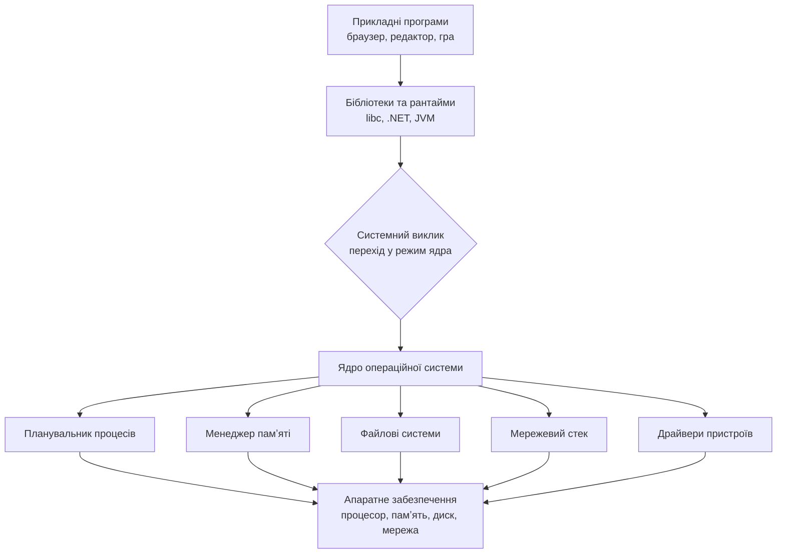
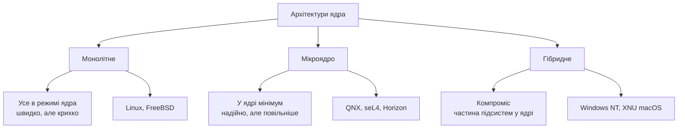

# Вступ до операційних систем

> [!abstract] Коротко
> Операційна система — це найскладніша програма, з якою ви маєте справу щодня, і водночас та, яку найлегше не помічати. Ця лекція відповідає на три питання: що станеться з комп'ютером, якщо операційної системи не буде взагалі; що саме вона робить і чому її роблять саме так; і як вийшло, що ті самі ідеї, придумані у 1960-х роках для машин розміром із кімнату, сьогодні працюють у вашому телефоні, на сервері хмарного провайдера, у PlayStation, у банкоматі й у бортовому комп'ютері літака. Ми пройдемо всіма великими сімействами систем — Linux, Windows, macOS, Android, iOS, серверні, вбудовані, консольні — і побачимо, що відмінностей між ними менше, ніж здається, а спільного коріння — значно більше.

## Навчальні цілі заняття

- **Знати:** визначення операційної системи, її дві фундаментальні ролі, поняття ядра, простору користувача та системного виклику; основні сімейства сучасних ОС та їхнє походження.
- **Вміти:** пояснити, які саме задачі операційна система знімає з прикладного програміста; відрізнити монолітну архітектуру ядра від мікроядерної та гібридної; співвіднести конкретну систему (Android, PlayStation, Windows Server) з її родоводом і поясними, чому вона побудована саме так.

## План лекції

1. Комп'ютер без операційної системи
2. Що таке операційна система: два погляди на одну річ
3. Ядро, простір користувача та системні виклики
4. Як ми до цього дійшли: коротка історія
5. UNIX і чому він досі всюди
6. Сімейства операційних систем сьогодні
7. Архітектури ядра: моноліт, мікроядро, гібрид
8. П'ять обов'язків операційної системи
9. Віртуалізація, контейнери і хмара
10. Навіщо все це знати програмісту

## 1. Комп'ютер без операційної системи

Почнімо з уявного експерименту. Уявіть, що ви купили новий ноутбук, увімкнули його — і на ньому немає нічого. Зовсім нічого: ні Windows, ні Linux, ні навіть найпростішої оболонки. Є процесор, є оперативна пам'ять, є диск, є клавіатура й екран. Залізо справне. Що ви побачите?

Ви побачите практично ніщо. Процесор після вмикання починає виконувати інструкції з певної адреси в пам'яті, і якщо там нічого осмисленого немає — він виконуватиме випадкове сміття, поки не зупиниться на помилці. Комп'ютер без програмного забезпечення — це не «повільний комп'ютер» і не «комп'ютер з обмеженими можливостями». Це просто дорога коробка з кремнію, яка вміє нагріватися.

Добре, скажете ви, тоді напишімо програму. Нехай вона робить щось просте: виводить на екран слово «Привіт». Здавалося б, задача на один рядок — у будь-якій мові програмування це справді один рядок. Але зараз у нас немає жодної мови програмування, бо компілятор — це теж програма, і її теж треба звідкись запустити. Припустімо, ми якось цю проблему обійшли й пишемо одразу машинними кодами. Що конкретно означає «вивести слово на екран»?

Це означає, що ми маємо знати, як влаштований саме наш відеоадаптер. За якою адресою в пам'яті лежить буфер кадру. Скільки байтів припадає на один піксель. У якому порядку йдуть канали кольору. Яка роздільна здатність зараз виставлена і як її змінити. Далі: літери «П», «р», «и» не існують для відеоадаптера — існують лише пікселі. Отже, нам потрібен шрифт: таблиця, яка для кожного символу зберігає його растрове зображення. Цю таблицю треба десь узяти, десь зберігати й уміти нею користуватися. І це ми ще нічого не зробили — лише вивели одне слово на один конкретний екран однієї конкретної моделі.

Тепер додайте до задачі клавіатуру. Коли користувач натискає клавішу, контролер клавіатури надсилає процесору сигнал переривання, і процесор має відкласти те, чим займався, обробити натискання й повернутися назад. Обробник переривання треба написати. Скан-коди клавіш треба перетворити на символи — а це залежить від розкладки, а розкладок багато, і користувач може їх перемикати. Натискання треба десь накопичувати, бо людина може натиснути другу клавішу раніше, ніж програма встигла обробити першу.

Тепер додайте диск. Дані на диску лежать секторами, і сам диск нічого не знає про «файли» чи «папки» — це наша вигадка, домовленість, структура, яку ми накладаємо на плоский масив пронумерованих секторів. Хтось має цю структуру придумати, реалізувати, підтримувати в цілісності при раптовому вимкненні живлення й давати програмам зручний доступ до неї.

Тепер додайте другу програму, яка має працювати одночасно з першою. Процесорне ядро в кожен момент часу виконує рівно одну послідовність інструкцій — отже, «одночасно» насправді означає «по черзі, дуже швидко перемикаючись». Хтось має вирішувати, кому зараз віддати процесор і на скільки, зберігати стан програми, яку зупиняють, і відновлювати стан програми, яку запускають.

І нарешті — найважливіше. Дві програми в одній пам'яті. Якщо перша через помилку запише дані за адресою, де лежить друга, друга зламається. Якщо перша навмисне прочитає пам'ять другої, вона побачить її паролі. Хтось має розділити їх так, щоб вони фізично не могли дістатися одна до одної.

Ось усе це разом — і ще багато чого, про що ми поговоримо протягом курсу, — і є операційна система. Вона не «додаткова зручність» і не «оболонка для запуску програм». Вона — та єдина річ, яка перетворює набір мікросхем на щось, з чим людина й програміст можуть працювати.

> [!info] Для допитливих
> Комп'ютери справді працювали без операційних систем — і це не гіпотетика. У 1940–50-х роках програму завантажували в машину фізично: перемикачами на панелі або колодою перфокарт. Одна програма, одна машина, один користувач, який особисто сидів за пультом. Операційні системи з'явилися не тому, що хтось вирішив, ніби так елегантніше, а тому, що ця схема стала нестерпно марнотратною. Машина коштувала як кілька будинків і простоювала більшу частину часу, поки оператор бігав із коробкою перфокарт.

![[attachments/os-perfokarty.jpg|520]]
*Колода перфокарт — так фізично виглядала програма в ті часи, коли операційних систем ще не існувало. Джерело: ArnoldReinhold, CC BY-SA 3.0, [Wikimedia Commons](https://commons.wikimedia.org/wiki/File%3APunched_card_program_deck.agr.jpg).*

## 2. Що таке операційна система: два погляди на одну річ

Тепер, коли ми відчули задачу зсередини, можна дати визначення. Але корисно дати одразу два — бо на операційну систему прийнято дивитися з двох різних боків, і обидва погляди правильні.

> [!definition] Визначення
> **Операційна система** — це комплекс програм, який керує апаратними ресурсами комп'ютера та надає прикладним програмам зручний, уніфікований і безпечний інтерфейс доступу до цих ресурсів.

**Перший погляд: операційна система як розширена машина.** З цієї точки зору ОС — це шар, який ховає потворні подробиці заліза за акуратним фасадом. Програмісту не треба знати, що диск ділиться на сектори по 512 або 4096 байтів, що у нього є черга команд, що читання з нього — це фізичний рух головки або звернення до комірок флеш-пам'яті. Програміст пише `open("data.txt")`, і все. Він працює не з диском, а з файлом — абстракцією, якої в залізі не існує взагалі.

Це і є ключове слово всього курсу — **абстракція**. Операційна система бере криву, незручну, різнорідну реальність заліза й підміняє її набором чистих понять: файл, процес, потік, сокет, сторінка пам'яті. Жодного з цих об'єктів немає в мікросхемах. Усі вони — вигадка операційної системи, дуже добре продумана вигадка, і саме вона робить програмування можливим.

Аналогія тут проста. Коли ви керуєте автомобілем, ви обертаєте кермо, тиснете педалі й перемикаєте передачі. Ви не думаєте про те, що в цю мить відбувається в гідропідсилювачі, як розподіляється крутний момент по осях і в якій послідовності відкриваються клапани. Кермо й педалі — це інтерфейс, який ховає механізм. Операційна система — таке саме кермо, тільки для заліза.

![[attachments/os-misce-os.png|560]]
*Місце операційної системи: вона стоїть між апаратним забезпеченням і прикладними програмами й нікого з них не пускає навпростець одне до одного. Джерело: Golftheman, CC BY-SA 3.0, [Wikimedia Commons](https://commons.wikimedia.org/wiki/File%3AOperating_system_placement.svg).*

**Другий погляд: операційна система як менеджер ресурсів.** З цієї точки зору ОС — це арбітр. У комп'ютері є обмежені ресурси: процесорний час, оперативна пам'ять, місце на диску, пропускна здатність мережі. Охочих до цих ресурсів багато: браузер із двадцятьма вкладками, месенджер, антивірус, музичний плеєр, службові процеси системи. Кожен хотів би отримати все. Хтось має чесно розділити.

Тут аналогія теж є, і вона теж побутова. Операційна система — це адміністратор гуртожитку. Кімнат обмежена кількість, кухня одна, пральна машина одна. Адміністратор не готує їжу й не пере білизну — він розподіляє: хто коли заходить, хто скільки часу займає ресурс, як зробити, щоб мешканці не билися за пральну машину й не заходили в чужі кімнати. Він же й слідкує за порядком: якщо хтось порушив правила, його зупиняють.

Ці два погляди не суперечать один одному — це одна система, описана з двох боків. Перший погляд відповідає на питання «що ОС дає програмісту», другий — «яку проблему вона розв'язує в масштабі всієї машини».

## 3. Ядро, простір користувача та системні виклики

Тепер найважливіша технічна ідея цієї лекції — та, на якій тримається вся конструкція.

Операційна система має мати повну владу над машиною: доступ до будь-якої пам'яті, до будь-якого пристрою, право зупинити будь-яку програму. Прикладні програми такої влади мати не повинні — інакше будь-яка помилка або зловмисний код зруйнує все. Отже, потрібен механізм, який розділяє «своїх» і «чужих» на рівні самого процесора.

Такий механізм є у кожному сучасному процесорі — це **режими виконання**. Процесор може працювати у привілейованому режимі (його називають режимом ядра, kernel mode, ring 0) або у непривілейованому (режим користувача, user mode, ring 3). У режимі ядра дозволені всі інструкції: звертатися до портів пристроїв, змінювати таблиці пам'яті, вимикати переривання. У режимі користувача ці інструкції просто не виконуються — процесор апаратно відмовляє й передає керування операційній системі.

![[attachments/os-kilca-zahystu.png|420]]
*Кільця захисту процесора. Ядро працює в найпривілейованішому кільці 0, прикладні програми — у кільці 3. Проміжні кільця на практиці майже не використовуються. Джерело: Hertzsprung at English Wikipedia, CC BY-SA 3.0, [Wikimedia Commons](https://commons.wikimedia.org/wiki/File%3APriv_rings.svg).*

Відповідно, простір програм ділиться на дві зони.

**Ядро (kernel)** — центральна частина операційної системи, яка працює у привілейованому режимі. Це планувальник процесів, менеджер пам'яті, файлові системи, мережевий стек, драйвери пристроїв.

**Простір користувача (user space)** — усе інше: браузер, текстовий редактор, компілятор, ігри, навіть більшість службових програм самої системи. Усе це працює без привілеїв.

![[attachments/os-yadro-shary.png|520]]
*Ядро як прошарок між апаратним забезпеченням і рештою системи. Джерело: Bobbo, CC BY-SA 3.0, [Wikimedia Commons](https://commons.wikimedia.org/wiki/File%3AKernel_Layout.svg).*

Виникає питання: якщо програма не має права звертатися до диска напряму, як вона взагалі читає файл? Через **системний виклик**.

> [!definition] Визначення
> **Системний виклик (system call)** — контрольований механізм, яким програма з простору користувача просить ядро виконати привілейовану операцію від її імені. Це єдині «двері» між двома світами, і всі вони під наглядом ядра.

Механізм працює так. Програма кладе номер потрібної операції та її аргументи у визначені регістри процесора й виконує спеціальну інструкцію переходу (на x86-64 це `syscall`). Процесор перемикається у режим ядра й передає керування за єдиною наперед визначеною адресою — обробнику системних викликів. Ядро дивиться, що саме просять, перевіряє права («а чи має ця програма доступ до цього файлу?»), виконує роботу, кладе результат назад і повертає керування програмі разом із поверненням у непривілейований режим.

Зверніть увагу на слово «єдиною». Програма не може перестрибнути в довільне місце ядра — точка входу одна, і вона під контролем. Це і є та сама межа безпеки, про яку ми говорили.

Аналогія: уявіть банк. Клієнт не заходить у сховище — навіть якщо він дуже хоче й навіть якщо гроші в сховищі його власні. Клієнт підходить до віконця, заповнює заявку встановленої форми й передає її операціоністу. Операціоніст перевіряє документи, іде у сховище сам і повертається з результатом. Віконце — це системний виклик. Форма заявки — його аргументи. Перевірка документів — контроль прав доступу.

Коли ви пишете на C `fopen("data.txt", "r")`, а на Python `open("data.txt")` — Іпід цим викликається `open()` зі стандартної бібліотеки, а вже вона виконує системний виклик до ядра. Тобто між вашим рядком коду й реальним диском стоїть кілька шарів, і найважливіший із них — та сама межа між режимами.

> [!warning] Типова помилка
> Системні виклики дорогі. Перемикання режиму — це збереження стану, зміна таблиць, скидання частини кешів процесора. Одна операція коштує сотні або тисячі тактів. Саме тому програма, яка читає файл побайтово в циклі, працює в десятки разів повільніше за ту, що читає блоками по кілька кілобайтів: перша робить мільйон системних викликів, друга — тисячу. Це не теорія, це та різниця, яку ви побачите секундоміром.

Щоб це не лишалося абстракцією, пройдімо повільно й покроково крізь один-єдиний рядок коду. Нехай програма мовою C виконує `fread(buf, 1, 4096, f)` - прочитати чотири кілобайти з відкритого файлу. Ось що насправді відбувається.

**Крок 1.** Функція `fread` — це навіть не системний виклик, а функція стандартної бібліотеки. Спочатку вона дивиться у власний буфер: можливо, потрібні байти вже прочитані раніше «про запас», і тоді ядро турбувати взагалі не доведеться. Це перший рівень кешування, і він повністю в просторі користувача.

**Крок 2.** Припустімо, у буфері порожньо. Бібліотека готує системний виклик `read`: кладе у регістри процесора номер операції, номер файлового дескриптора, адресу буфера й кількість байтів.

**Крок 3.** Виконується інструкція `syscall`. Процесор апаратно перемикається у привілейований режим і стрибає за єдиною наперед заданою адресою — до обробника системних викликів ядра. Це і є перетин межі, і саме він коштує дорого: треба зберегти стан програми, підмінити таблиці, перевести процесор в інший режим.

**Крок 4.** Ядро перевіряє: чи справді існує дескриптор із таким номером у цього процесу; чи відкритий він на читання; чи не виходить адреса буфера за межі пам'яті, дозволеної цьому процесу. Якщо щось не так — програма отримає помилку, а не доступ до чужих даних. Це та сама перевірка документів у віконці банку.

**Крок 5.** Ядро звертається до кешу сторінок — власного кешу файлових даних в оперативній пам'яті. Це другий рівень кешування. Якщо потрібний блок уже там (наприклад, файл читали хвилину тому), ядро просто копіює його в буфер програми, і на цьому все закінчується — до диска справа не доходить взагалі.

**Крок 6.** Якщо ж даних у кеші немає, ядро звертається до файлової системи: та за іменем і зміщенням обчислює, у яких саме секторах диска лежать потрібні байти. Далі драйвер ставить запит у чергу до контролера накопичувача.

**Крок 7.** І ось найцікавіше. Диск — пристрій повільний: навіть швидкий SSD відповідає за десятки мікросекунд, а це для процесора ціла вічність, десятки тисяч тактів. Тому ядро **не чекає**. Воно позначає наш процес як заблокований, вносить його у список тих, хто чекає на введення-виведення, і викликає планувальник, щоб той віддав процесор комусь іншому. З точки зору системи наша програма зараз просто не існує.

**Крок 8.** Коли контролер диска закінчує роботу, він надсилає процесору переривання. Ядро відкладає поточну роботу, забирає дані, кладе їх у кеш сторінок і копіює в буфер програми.

**Крок 9.** Ядро позначає наш процес як готовий до виконання й ставить у чергу планувальника. Через якийсь час — можливо, ще не одразу — планувальник дійде до нього.

**Крок 10.** Процесор повертається у непривілейований режим, відновлює стан програми, і `fread` повертає число прочитаних байтів. З точки зору програміста минуло одне звичайне звернення до функції.

Прогляньте цей список іще раз і зверніть увагу на масштаб. Один рядок коду — це два рівні кешування, перетин апаратної межі привілеїв, кілька перевірок безпеки, робота файлової системи, драйвера й планувальника, а також щонайменше одне повне перемикання на інший процес і назад. Усе це операційна система зробила мовчки, і саме за це ми називаємо її абстракцією.

## 4. Як ми до цього дійшли: коротка історія

Історія тут потрібна не заради дат. Вона потрібна тому, що майже кожне архітектурне рішення у сучасних системах — це відповідь на конкретну проблему конкретної епохи, і без цього контексту рішення виглядають довільними.

**Перше покоління: без системи (1940-і — початок 1950-х).** Програміст особисто займав машину на кілька годин, вручну завантажував програму, чекав, забирав результат. Операційної системи не було, бо не було чим керувати — у машині завжди рівно одна програма.

**Друге покоління: пакетна обробка (1950-і — початок 1960-х).** Машини стали настільки дорогими, що простій став неприпустимим. З'явилася ідея: зібрати завдання від багатьох користувачів у пакет (batch) і згодовувати машині одне за одним автоматично, без участі людини між ними. Програма, яка цим займалася — монітор — і була першою операційною системою. Користувач при цьому машини не бачив взагалі: здав колоду перфокарт, наступного дня забрав роздруківку.

![[attachments/os-ibm704.gif|560]]
*IBM 704 — типова машина епохи пакетної обробки. Займала кімнату, коштувала як кілька будинків, і саме її простій змусив інженерів винайти операційні системи. Джерело: Lawrence Livermore National Laboratory, Attribution, [Wikimedia Commons](https://commons.wikimedia.org/wiki/File%3AIBM_704_mainframe.gif).*

**Третє покоління: мультипрограмування й розділення часу (1960-і).** Виявилося, що навіть при пакетній обробці процесор простоює: коли завдання чекає на читання з диска, процесор нічого не робить. Народилася ключова ідея: тримати в пам'яті кілька програм одночасно і, щойно одна з них іде чекати, віддавати процесор іншій. Це **мультипрограмування**, і саме з нього виникла потреба в усьому, про що ми говоритимемо в курсі: планувальнику, захисті пам'яті, синхронізації.

Наступний крок — **розділення часу (time-sharing)**: перемикати програми не тільки коли вони чекають, а й примусово, кілька десятків разів на секунду. Тоді за однією машиною можуть одночасно працювати десятки людей за терміналами, і кожному здається, що машина його. Саме тоді, у проєкті MULTICS, було закладено більшість ідей, якими ми користуємося досі.

**Четверте покоління: персональні комп'ютери (1980-і).** Машина стала настільки дешевою, що її купували в дім. Спочатку це був крок назад: MS-DOS не мала ні захисту пам'яті, ні багатозадачності — одна програма, повний доступ до заліза, як у 1950-х. Але залізо швидко наздогнало, і всі ідеї великих машин повернулися вже на персональні: спершу у Windows NT та macOS, потім і в решту.

**П'яте покоління: мобільні пристрої та хмара (2000-і — дотепер).** З'явилися два нові набори вимог. Мобільні системи мали жити на батареї й на слабкому процесорі, тому в них головним стало енергоспоживання й агресивне керування фоновими процесами. Хмарні — навпаки, мали віддавати одну фізичну машину сотням незалежних клієнтів, тому в них розквітли віртуалізація й контейнери.

## 5. UNIX і чому він досі всюди

Окремо треба сказати про UNIX, бо без цього неможливо зрозуміти, чому сучасні системи схожі одна на одну більше, ніж на перший погляд здається.

UNIX народився наприкінці 1960-х у Bell Labs як реакція на MULTICS — проєкт грандіозний, амбітний і надто складний. Кен Томпсон і Денніс Рітчі зробили систему навмисне маленьку й просту, побудовану на кількох принципах, які виявилися напрочуд живучими.

Принцип перший: **усе є файлом**. Не тільки дані на диску, а й клавіатура, екран, принтер, мережеве з'єднання, навіть процеси й параметри ядра — усе доступне через один і той самий набір операцій: відкрити, прочитати, записати, закрити. Одна абстракція замість десятка. Завдяки цьому програму, яка вміє працювати з файлом, можна без жодних змін направити на пристрій або в мережу.

Принцип другий: **маленькі програми, що роблять одну річ добре**, і механізм, який дозволяє з'єднувати їх у ланцюжки — конвеєр (pipe). Замість однієї великої програми на всі випадки життя — набір простих цеглин і спосіб їх складати.

Принцип третій, найпрактичніший: UNIX було переписано мовою C. До того системи писали асемблером, а отже, для кожної нової машини — заново. Система мовою високого рівня переносилася на нове залізо перекомпіляцією. Саме це зробило UNIX доступним усюди.

![[attachments/os-thompson-ritchie.jpg|480]]
*Кен Томпсон (сидить) і Денніс Рітчі за PDP-11, 1973 рік. Томпсон створив UNIX, Рітчі — мову C, якою UNIX було переписано. Джерело: Unknown authorUnknown author, Public domain, [Wikimedia Commons](https://commons.wikimedia.org/wiki/File%3AKen_Thompson_and_Dennis_Ritchie--1973.jpg).*

Далі відбулося те, що визначило сучасний ландшафт. UNIX розійшовся на безліч гілок — комерційних і академічних, — і щоб програми лишалися сумісними, у 1988 році з'явився стандарт **POSIX**: опис того, які системні виклики й утиліти має надавати система, щоб вважатися UNIX-подібною.

І ось результат, який варто запам'ятати. Сьогодні Linux, macOS, Android, iOS, системи PlayStation, більшість серверів, усі суперкомп'ютери світу й переважна частина вбудованих пристроїв — це, з точністю до деталей, нащадки або наслідувачі UNIX. Windows стоїть окремо, хоч і сумісний із POSIX частково. Тобто ви фактично вивчаєте одну велику родину з кількома діалектами, а не десяток непов'язаних систем.

![[attachments/os-unix-rodovid.png|700]]
*Спрощений родовід UNIX. Три головні гілки — System V, BSD і Linux — і з них виросли macOS, iOS, Android, системи PlayStation та більшість серверів світу. Джерело: Eraserhead1, Infinity0, Sav_vas, CC BY-SA 3.0, [Wikimedia Commons](https://commons.wikimedia.org/wiki/File%3AUnix_history-simple.svg).*

## 6. Сімейства операційних систем сьогодні

Тепер пройдімо ландшафтом. Для кожної системи важливо розуміти не лише «як вона називається», а й **під яку задачу її заточено** — бо саме задача пояснює всі архітектурні рішення.

### 6.1 Linux

Строго кажучи, Linux — це не операційна система, а **ядро**. Його почав писати у 1991 році фінський студент Лінус Торвальдс, і головним його рішенням було відкрити код: будь-хто може читати, змінювати й поширювати його за ліцензією GPL.

![[attachments/os-torvalds.jpeg|380]]
*Лінус Торвальдс — автор ядра Linux, яке він почав писати студентом у 1991 році як власний навчальний проєкт. Джерело: Unknown authorUnknown author, CC BY-SA 3.0, [Wikimedia Commons](https://commons.wikimedia.org/wiki/File%3ALinus_Torvalds.jpeg).*

Ядро саме по собі нічого не дає користувачеві — потрібні системні утиліти, оболонка, графічне середовище, менеджер пакетів. Комплект «ядро плюс усе інше» називають **дистрибутивом**. Ubuntu, Debian, Fedora, Arch, Red Hat Enterprise Linux — це все той самий Linux усередині, але зібраний по-різному й націлений на різну аудиторію: одні на простоту для новачка, інші на стабільність для корпоративного сервера, треті на свіжість версій.

Найцікавіше в Linux — його всюдисущість, про яку більшість людей не здогадується. Так, на настільних комп'ютерах його частка невелика. Але: понад 90 % публічних вебсерверів, усі 500 найпотужніших суперкомп'ютерів світу без винятку, ядро всередині кожного Android-пристрою, більшість «розумних» телевізорів, роутерів, камер спостереження й автомобільних мультимедійних систем — це Linux. Ви користуєтеся ним щодня, навіть якщо на вашому ноутбуці стоїть Windows: кожен сайт, який ви відкриваєте, найімовірніше віддає вам сторінку саме з Linux-машини.

![[attachments/os-tux.png|300]]
*Пінгвін Тукс — символ Linux. Джерело: Larry Ewing, Simon Budig, Garrett LeSage, Attribution, [Wikimedia Commons](https://commons.wikimedia.org/wiki/File%3ATux.svg).*

### 6.2 Windows

Windows пройшов шлях, який добре ілюструє історію з попереднього розділу. Перші версії (до Windows 95 і навіть частково 98) були надбудовою над MS-DOS — без справжнього захисту пам'яті й із дуже умовною багатозадачністю. Паралельно з ними Microsoft розробляла іншу лінійку — **Windows NT**, спроєктовану з нуля як повноцінна багатозадачна система із захистом. Архітектором її був Дейв Катлер, який до того робив VMS для DEC, і спадщина VMS у NT видно й досі.

З Windows XP обидві лінійки злилися: усе, чим ви користуєтеся сьогодні — Windows 10, 11, Windows Server — це нащадки NT, а не DOS. Ядро називається **NT kernel**, архітектура гібридна (про це нижче), файлова система — NTFS.

Сильні сторони Windows — фанатична сумісність зі старим програмним забезпеченням (програма, скомпільована двадцять років тому, з великою ймовірністю запуститься й сьогодні), єдина екосистема керування корпоративними мережами (Active Directory) і, звісно, ігри: історично саме під Windows писалися графічні API DirectX, і саме тому ігровий ринок на ПК десятиліттями був її територією.

### 6.3 macOS

macOS має найцікавіший родовід. Коли Стів Джобс пішов із Apple, він заснував NeXT і зробив там систему NeXTSTEP, побудовану на мікроядрі Mach і компонентах BSD UNIX. Коли Apple у 1996 році купила NeXT і повернула Джобса, саме NeXTSTEP став основою нової системи.

Тому сучасний macOS усередині — це UNIX. Ядро називається **XNU** (жартівливо розшифровується як «X is Not Unix»), і воно поєднує мікроядро Mach із підсистемою BSD. Разом із драйверами й базовими утилітами це складає **Darwin** — відкрите ядро системи, поверх якого Apple будує все закрите: графічний інтерфейс Aqua, фреймворки Cocoa, застосунки.

![[attachments/os-arhitektury-yadra.png|700]]
*Три архітектури ядра поруч: монолітне, мікроядро та гібридне. Кольором виділено те, що працює у привілейованому режимі. Джерело: Golftheman, Public domain, [Wikimedia Commons](https://commons.wikimedia.org/wiki/File%3AOS-structure2.svg).*

Практичний наслідок для вас як для програміста: відкривши термінал на Mac, ви отримуєте справжнє UNIX-середовище — ті самі команди, ті самі системні виклики, що й на Linux-сервері. Саме тому Mac такий популярний серед розробників: локальна машина поводиться майже так само, як продакшн-сервер.

### 6.4 Android

Android — найпоширеніша операційна система у світі за кількістю пристроїв, і побудована вона багатошарово.

В основі — **ядро Linux**, дещо змінене під мобільні потреби (агресивніше керування живленням, власний механізм міжпроцесної взаємодії Binder, механізм примусового завершення застосунків при нестачі пам'яті). Над ядром — шар апаратної абстракції HAL, який дозволяє виробникам підключати свої камери, модеми й датчики, не змінюючи саму систему.

Далі найцікавіше: застосунки для Android пишуть переважно на Java та Kotlin, і виконуються вони не напряму процесором, а у віртуальній машині **ART** (Android Runtime). Кожен застосунок отримує власний процес і власного користувача в термінах Linux — тобто ізоляція між застосунками забезпечується стандартними механізмами прав доступу UNIX. Коли ви даєте застосунку «дозвіл на камеру», під цим лежить дуже конкретна перевірка прав на рівні системи.

![[attachments/os-android.png|300]]
*Android — найпоширеніша операційна система світу за кількістю пристроїв, і в її основі лежить ядро Linux. Джерело: Google Inc., employer for hire; designed by Irina Blok, CC BY 3.0, [Wikimedia Commons](https://commons.wikimedia.org/wiki/File%3AAndroid_robot.svg).*

Ще одна деталь, гідна уваги: процеси застосунків не створюються з нуля, а клонуються з уже підготовленого процесу-заготовки (Zygote), у який заздалегідь завантажено всі спільні бібліотеки. Це різко прискорює запуск і економить пам'ять — рішення, продиктоване саме мобільною специфікою.

### 6.5 iOS

iOS походить із того самого Darwin, що й macOS — тобто це також UNIX-система, тільки з іншим інтерфейсним шаром і значно жорсткішими обмеженнями.

Головна відмінність — модель безпеки. Кожен застосунок працює в **пісочниці (sandbox)**: він бачить лише власний каталог, не має доступу до файлів інших застосунків і взагалі до файлової системи в звичному розумінні. Встановити програму можна практично лише з App Store, а весь код має бути підписаний. Фонове виконання суворо обмежене: система може «заморозити» або вивантажити застосунок будь-якої миті, і застосунок має бути готовий відновити свій стан.

Це добрий приклад того, як бізнесова й безпекова політика впливає на технічну архітектуру. Технічно iOS і macOS — родичі; поводяться вони по-різному не через залізо, а через свідомо обрані обмеження.

### 6.6 Серверні операційні системи

Сервер має інші пріоритети, ніж настільна машина. Нікому не важлива краса вікон і швидкість анімації — важливі безвідмовна робота місяцями без перезавантаження, передбачувана продуктивність під навантаженням, віддалене керування та безпека.

Тому серверні системи часто працюють **узагалі без графічного інтерфейсу**: він з'їдає пам'ять і збільшує кількість потенційно вразливого коду. Адміністратор підключається до машини віддалено через SSH і працює в текстовій консолі. Для студента це часто культурний шок, але саме так виглядає більшість серверів у світі.

Основні гравці: серверні дистрибутиви Linux (Ubuntu Server, Debian, Red Hat Enterprise Linux, CentOS Stream), Windows Server — там, де потрібна інтеграція з корпоративною інфраструктурою Microsoft, і системи сімейства BSD (FreeBSD, OpenBSD) — там, де понад усе цінують стабільність і безпеку. Окрема історія — гіпервізори на кшталт VMware ESXi чи Proxmox: це системи, єдине завдання яких — запускати всередині себе інші операційні системи.

### 6.7 Ігрові консолі

Це той випадок, коли студенти зазвичай дуже дивуються, дізнавшись правду.

**PlayStation.** Операційна система PS4 і PS5 називається Orbis OS і побудована на основі **FreeBSD** — тобто це UNIX-система. Apple обрала BSD через ліцензію, Sony — так само: ліцензія BSD, на відміну від GPL, не вимагає відкривати похідний код. Ігри працюють у жорстко контрольованому середовищі з прямим, добре передбачуваним доступом до графічного процесора.

**Xbox.** Тут основа — **Windows**. У Xbox One і Series X працює гіпервізор, який запускає одночасно дві системи: одну — для ігор, з мінімальними накладними витратами й гарантованим доступом до заліза, другу — для інтерфейсу, застосунків і соціальних функцій. Це дозволяє грі не «просідати», коли ви одночасно ведете голосовий чат.

**Nintendo Switch.** Тут власна система **Horizon** із мікроядерною архітектурою, розроблена Nintendo самостійно.

Чому консольні системи взагалі окремі? Через головну перевагу консолі — **фіксоване залізо**. На ПК ваша гра має працювати на тисячах конфігурацій, тому все спілкування з відеокартою йде через товсті шари драйверів і API. На консолі конфігурація одна, і система може дозволити грі значно ближчий доступ до заліза. Саме тому консоль десятирічної давнини часто показує картинку, якої від її формальних характеристик не очікуєш.

І ще одна причина, суто комерційна: консольні системи побудовані так, щоб запускати виключно підписаний, ліцензований код. Уся модель заробітку виробника тримається на цьому обмеженні, і воно теж є архітектурним рішенням операційної системи.

### 6.8 Вбудовані системи та системи реального часу

Величезний і невидимий світ. Операційна система працює в мікрохвильовці, у пральній машині, у банкоматі, у касовому апараті, у ліфті, у медичному моніторі, у кожному автомобілі, випущеному за останні двадцять років, і в кожній ракеті.

Тут вимоги інші. Пам'яті можуть бути десятки кілобайтів, процесор — у сотні разів слабший за телефонний, а головне — **час реакції має бути гарантованим**. Для цього існує окремий клас систем.

> [!definition] Визначення
> **Система реального часу (RTOS)** — операційна система, яка гарантує, що реакція на подію відбудеться протягом строго визначеного часу. Ключове тут не швидкість, а **передбачуваність**: гарантована відповідь за 10 мілісекунд краща, ніж відповідь зазвичай за 1 мілісекунду, але іноді за 50.

Різницю легко відчути на прикладі. Якщо ваш комп'ютер підвис на півсекунди, ви роздратовано клацнете мишею. Якщо на півсекунди підвисне блок керування подушкою безпеки в момент удару, наслідки будуть іншими. Тому в автомобілях, авіації та медичній техніці використовують саме RTOS: FreeRTOS, QNX, VxWorks, RTEMS.

Звичайні системи — Windows, Linux у стандартній конфігурації, macOS — реального часу **не гарантують**. Планувальник у них оптимізує середню пропускну здатність, а не найгірший час відгуку, і будь-яке завдання може бути відкладене, якщо система вирішить, що зараз важливіше щось інше.

### 6.9 Мейнфрейми та суперкомп'ютери

Дві крайності, про які варто знати, навіть якщо ви ніколи їх не побачите.

**Мейнфрейми** — великі машини IBM під керуванням z/OS. Здається, що це музейна історія, але саме на них досі працює основна частина світової банківської та страхової обробки транзакцій. Їхня сильна риса — надійність, доведена до абсурду: компоненти дублюються, деталі можна міняти на ходу, а безперервна робота роками є нормою.

**Суперкомп'ютери** — машини для наукових розрахунків: моделювання клімату, згортання білків, ядерної фізики. Тут ситуація однозначна: усі 500 найпотужніших систем світу працюють під Linux. Причина проста — відкритий код дозволяє переробити систему під конкретну унікальну архітектуру, а жоден комерційний виробник таку роботу під одну машину робити не буде.

![[attachments/os-superkompyuter.jpg|560]]
*Суперкомп'ютер IBM Blue Gene/P. Усі 500 найпотужніших машин світу без винятку працюють під керуванням Linux. Джерело: Argonne National Laboratory's Flickr page, CC BY-SA 2.0, [Wikimedia Commons](https://commons.wikimedia.org/wiki/File%3AIBM_Blue_Gene_P_supercomputer.jpg).*

### 6.10 Підсумкова таблиця

| Система | Ядро / основа | Головний пріоритет | Де живе |
|---|---|---|---|
| Linux | власне монолітне ядро, відкрите | гнучкість, продуктивність | сервери, суперкомп'ютери, вбудовані пристрої |
| Windows | NT, гібридне | сумісність, зручність, ігри | настільні ПК, корпоративні мережі |
| macOS | XNU (Mach + BSD), гібридне | цілісність із залізом Apple | робочі станції, розробка, дизайн |
| Android | Linux + ART | енергоспоживання, ізоляція застосунків | смартфони, планшети, ТБ, авто |
| iOS | Darwin (XNU) | безпека, контроль екосистеми | iPhone, iPad |
| FreeBSD / OpenBSD | власне, UNIX-родина | стабільність, безпека, ліцензія | сервери, мережеве обладнання, PlayStation |
| QNX, FreeRTOS, VxWorks | мікроядро / RTOS | гарантований час реакції | авто, авіація, медтехніка, промисловість |
| z/OS | власне | безвідмовність | мейнфрейми, банківські транзакції |

Окремо варто згадати ще один клас, який не потрапив у жодну з категорій вище, — **ChromeOS**. Це Linux, у якому роль головного застосунку віддано браузеру, а більшість даних живе не на диску, а в мережі. Система навмисне зроблена настільки простою й закритою, наскільки це можливо: користувач майже не має доступу до нутрощів, оновлення відбуваються автоматично, а при пошкодженні система відновлюється з резервної копії розділу. Це показовий приклад того, що операційну систему можна проєктувати не лише навколо заліза, а й навколо сценарію використання.

## 7. Архітектури ядра: моноліт, мікроядро, гібрид

Ми говорили про ядро як про єдину річ. Насправді є кілька способів його побудувати, і вибір між ними — один із класичних сюжетів у нашій галузі.

**Монолітне ядро.** Усі підсистеми — планувальник, пам'ять, файлові системи, мережа, драйвери — працюють в одному адресному просторі у привілейованому режимі. Виклик з однієї частини ядра в іншу — це звичайний виклик функції, тобто дуже швидко. Це головна перевага: **продуктивність**.

Недолік дзеркальний: помилка в будь-якому драйвері може зруйнувати всю систему, бо він працює з тими самими привілеями, що й серце ядра. Класичний «синій екран» у Windows найчастіше спричинений саме кривим драйвером.

Так побудовані Linux і, з певними застереженнями, більшість систем UNIX. Варто одразу розвіяти поширене непорозуміння: монолітність не означає, що ядро не можна розширювати. У Linux є модулі, які завантажуються й вивантажуються на ходу — але, завантажившись, вони стають частиною того самого моноліту з усіма його привілеями.

**Мікроядро.** Протилежна ідея: залишити в привілейованому режимі мінімум — керування пам'яттю, планування й обмін повідомленнями між процесами, — а все інше винести в звичайні процеси простору користувача. Файлова система, мережевий стек, драйвери стають окремими програмами, які спілкуються з ядром і між собою повідомленнями.

Переваги очевидні: **надійність і безпека**. Драйвер, що збоїть, зруйнує лише сам себе, і система зможе його перезапустити, навіть не помітивши збою. Саме тому мікроядра панують там, де ціна відмови висока: QNX в автомобілях, Nintendo Horizon, ядро seL4 у критичній інфраструктурі.

Недолік теж очевидний: те, що в моноліті було викликом функції, тут стає обміном повідомленнями через ядро — з перемиканнями контексту й копіюванням даних. Це повільніше, і саме через це мікроядра програли битву за настільні комп'ютери.

**Гібридне ядро.** Компроміс: базова структура мікроядерна, але заради швидкості критичні підсистеми все ж повертають у привілейований режим. Так побудовані Windows NT і XNU в macOS. Треба чесно сказати, що термін «гібридне ядро» багато хто вважає маркетинговим — суперечка триває десятиліттями й особливо гостро велася між Лінусом Торвальдсом та Ендрю Таненбаумом ще на початку 1990-х.

> [!exam] На іспиті
> Питання «яка архітектура краща» коректної відповіді не має — правильна відповідь завжди починається з «залежно від задачі». Для настільної машини або сервера, де цінують швидкість, розумний вибір — моноліт. Для автомобіля чи медичного обладнання, де відмова недопустима, — мікроядро. Уміння обґрунтувати вибір під конкретні вимоги цінується значно вище, ніж завчене визначення.

## 8. П'ять обов'язків операційної системи

Підсумуємо функціонально. Усе, чим займається ОС, можна згрупувати у п'ять напрямів — і кожному з них у нашому курсі буде присвячено окрему тему.

**Керування процесами.** Створити процес, дати йому пам'ять, поставити в чергу на процесор, перемкнути на нього виконання, зберегти й відновити стан, коректно завершити й прибрати за ним. Сюди ж — потоки, синхронізація й уся класика паралельного програмування з її взаємними блокуваннями.

**Керування пам'яттю.** Розділити фізичну пам'ять між процесами так, щоб вони не бачили одне одного. Дати кожному ілюзію того, що вся пам'ять машини належить йому — це називається віртуальною пам'яттю. Коли фізичної пам'яті не вистачає, вивантажувати сторінки, що давно не використовувалися, на диск і повертати їх назад при зверненні.

**Керування файлами.** Перетворити плоский масив секторів на дерево каталогів і файлів. Слідкувати за правами доступу. Забезпечити цілісність при раптовому вимкненні живлення — для цього існує журналювання. Ефективно кешувати часто читані дані в оперативній пам'яті.

**Керування пристроями.** Спілкуватися з нескінченним різноманіттям заліза через драйвери, надаючи програмам однаковий інтерфейс. Обробляти переривання. Буферизувати дані, узгоджуючи повільні пристрої зі швидким процесором.

**Безпека й захист.** Розділяти користувачів, перевіряти права на кожну операцію, ізолювати процеси один від одного, вести журнали подій. Усе це спирається на ту саму апаратну межу між режимами ядра й користувача, з якої ми починали.

### Усе разом: що відбувається, коли ви запускаєте програму

Ці п'ять напрямів звучать як окремі теми з різних розділів підручника. Насправді вони працюють разом щосекунди, і найкраще це видно на найзвичайнішій дії — подвійному клацанні по значку програми. Пройдімо повільно.

**Клацання.** Миша надсилає контролеру сигнал, контролер — переривання процесору. Процесор кидає те, що робив, і виконує обробник переривання в ядрі. Ядро визначає, що це подія від миші, і передає її тій програмі, яка малює робочий стіл. Зверніть увагу: до вашої програми ще нічого не дійшло — поки що працювали драйвер і графічна оболонка.

**Рішення запустити.** Оболонка розуміє, що клацання припало на значок, і просить ядро створити новий процес із зазначеного файлу. Це системний виклик — знову перетин межі.

**Створення процесу.** Ядро заводить нову структуру даних, яка описує процес: його ідентифікатор, власника, права, посилання на відкриті файли. Це керування процесами.

**Виділення адресного простору.** Ядро створює для нового процесу окремий віртуальний адресний простір — власну «карту пам'яті», у якій він не бачить нікого, крім себе. Це керування пам'яттю, і саме звідси береться ізоляція.

**Читання файлу програми.** Ядро звертається до файлової системи, знаходить виконуваний файл, перевіряє права: чи має цей користувач право його запускати. Це керування файлами й безпека одночасно.

**Ліниве завантаження.** І тут відбувається річ, яка зазвичай дивує. Ядро **не читає файл програми повністю**. Воно лише зазначає у таблиці пам'яті: «за цими адресами лежатиме вміст такого-то файлу». Реальне читання станеться пізніше й частинами: коли процесор спробує виконати інструкцію за адресою, для якої даних ще немає, він згенерує помилку сторінки, ядро перехопить її, підвантажить потрібний шматок із диска й продовжить виконання так, ніби нічого не сталося. Саме тому великий застосунок починає показувати вікно швидше, ніж встиг би прочитатися з диска цілком.

**Підключення бібліотек.** Програмі потрібні бібліотеки, і майже напевно вони вже завантажені в пам'ять для інших процесів. Ядро не копіює їх удруге — воно відображає ті самі фізичні сторінки у простір нашого процесу, лише для читання. Одна копія коду в фізичній пам'яті обслуговує десятки процесів.

**Постановка в чергу.** Процес готовий, але ще не виконується — він у черзі планувальника разом із сотнею інших. Планувальник вирішує, кому й на скільки віддати процесорне ядро.

**Виконання.** Нарешті процес отримує процесор — на кілька мілісекунд, після чого його примусово перервуть і віддадуть час іншому. Так по колу, десятки разів на секунду, і саме тому вам здається, що все працює одночасно.

**Робота з пристроями.** Програма малює вікно, читає файл налаштувань, звертається до мережі — і кожна така дія знову проходить повний шлях: системний виклик, перевірка прав, драйвер, можливо, блокування й перемикання на інший процес.

Отже, за однією буденною дією стоять усі п'ять напрямів одразу. Тому далі в курсі ми розбиратимемо їх по черзі — але пам'ятайте, що поділ на теми умовний: у працюючій системі вони нерозривні.

## 9. Віртуалізація, контейнери і хмара

Останній сюжет, без якого сучасна картина буде неповною.

**Віртуалізація** — це технологія, яка дозволяє запустити на одній фізичній машині кілька повноцінних операційних систем одночасно, і кожна вважатиме, що працює на власному залізі. Програма, яка це забезпечує, називається **гіпервізором**. Він розподіляє між віртуальними машинами процесорний час, пам'ять і диски так само, як звичайна ОС розподіляє їх між процесами — тільки на рівень вище.

Саме на цьому стоїть уся хмарна індустрія. Коли ви орендуєте сервер у хмарного провайдера, ви майже напевно отримуєте не фізичну машину, а віртуальну — одну з кількох десятків на одному потужному хості.

**Контейнери** — легша альтернатива. Контейнер не запускає окрему операційну систему: усі контейнери на машині поділяють одне спільне ядро, але кожен бачить власну ізольовану файлову систему, власний набір процесів і власну мережу. Технічно це не окрема «магія», а вміле використання вбудованих можливостей ядра Linux — просторів імен (namespaces) і груп керування ресурсами (cgroups).

Різниця в ціні величезна. Віртуальна машина стартує десятки секунд і займає гігабайти. Контейнер стартує за частки секунди й важить десятки мегабайтів. Плата за це — слабша ізоляція: спільне ядро означає, що вразливість у ньому зачепить усіх сусідів одразу.

Для нас важливий висновок: і те, і інше — пряме продовження базових ідей операційних систем. Гіпервізор розподіляє ресурси між системами так само, як планувальник — між процесами. Контейнер ізолює процеси тими самими механізмами, якими ядро завжди ізолювало користувачів. Нічого принципово нового — тільки старі ідеї, застосовані на новому рівні.

## 10. Навіщо все це знати програмісту

Справедливе питання, і на нього треба відповісти чесно. Ви пишете код на Python чи Java, ви не пишете драйвери. Навіщо вам знати, як влаштоване ядро?

**Тому що продуктивність вашого коду визначається переважно поведінкою операційної системи, а не мовою.** Програма, що читає файл побайтово, повільніша за ту, що читає блоками, у десятки разів — і причина в кількості системних викликів. Програма, що створює тисячу потоків, працює гірше за ту, що створює вісім, — і причина в тому, як влаштоване перемикання контексту. Не знаючи цього, ви оптимізуватимете навмання.

**Тому що діагностика без цього неможлива.** «Сервер лежить» — це не діагноз. Діагноз — це закінчилася пам'ять і процес убив OOM-killer; або впевся в ліміт відкритих файлових дескрипторів; або процес не помер, а завис у стані очікування вводу-виводу. Щоб таке побачити, треба розуміти, що саме ви дивитеся.

**Тому що ви щодня працюєте з абстракціями ОС, навіть не називаючи їх так.** Файл, процес, потік, сокет, права доступу, змінна оточення, стандартний ввід і вивід — це все поняття операційної системи. Ви ними користуєтеся з першого дня програмування.

**Тому що це ваше робоче середовище.** Розгортання застосунку, налаштування прав, робота з логами, автозапуск служби, обмеження ресурсів контейнера — щоденна робота будь-якого інженера, і вся вона відбувається на території операційної системи.

І останнє, найголовніше. Операційні системи — це п'ятдесят років інженерних рішень у ситуаціях, де ресурси обмежені, вимоги суперечливі, а помилятися не можна. Планувальники, кешування, черги, синхронізація, ізоляція збоїв — ці ідеї ви впізнаватимете потім усюди: у базах даних, у мережевих сервісах, у розподілених системах, у власних програмах. Це не курс про Linux і не курс про Windows. Це курс про те, як узагалі влаштовані складні системи.

> [!question] Перевірте себе
> 1. Чому програмі не дозволено звертатися до диска напряму, хоча технічно процесор це вміє?
> 2. Що станеться, якщо прибрати з процесора апаратний поділ на режим ядра й режим користувача? Які саме гарантії операційної системи зникнуть?
> 3. Чому одна й та сама ідея — мікроядро — програла на настільних комп'ютерах, але виграла в автомобільній електроніці?
> 4. Android і GNU/Linux мають одне ядро. Чому ж застосунок для Ubuntu не запуститься на телефоні?
> 5. macOS та iOS побудовані на спільній основі Darwin. Назвіть щонайменше три причини, чому вони так по-різному поводяться.
> 6. Поясніть своїми словами, чому консоль із формально слабким залізом здатна показувати картинку рівня значно дорожчого ПК.
> 7. У чому принципова різниця між віртуальною машиною та контейнером і за що саме доводиться платити, обираючи контейнер?

## Далі

→ [[courses/operating-systems/lectures/02-protsesy-ta-potoky|Лекція 2. Процеси та потоки]]

## Література

**Базова (українською):**

1. Авраменко В. С., Авраменко А. С. Основи операційних систем: навчальний посібник. — Черкаси: Черкаський національний університет імені Богдана Хмельницького, 2018. — 524 с. URL: https://eprints.cdu.edu.ua/1480/
2. Федотова-Півень І. М., Миронець І. В., Півень О. Б., Сисоєнко С. В., Миронюк Т. В. Операційні системи: навчальний посібник. — Черкаси: ТОВ «ДІСА ПЛЮС», 2019. — 216 с. — ISBN 978-617-7645-93-0. URL: https://er.chdtu.edu.ua/handle/ChSTU/1041
3. Мосіюк О. О., Федорчук А. Л. Операційні системи та системне програмування: навчально-методичний посібник. — Житомир: Вид-во ЖДУ ім. Івана Франка, 2022. URL: https://eprints.zu.edu.ua/33751/

**Допоміжна (англійською):**

4. Tanenbaum A. S., Bos H. Modern Operating Systems. 5th ed. — Pearson, 2022. — ISBN 978-0-13-761887-3.
5. Silberschatz A., Galvin P. B., Gagne G. Operating System Concepts. 10th ed. — Wiley, 2018. — ISBN 978-1-118-06333-0.
6. Arpaci-Dusseau R. H., Arpaci-Dusseau A. C. Operating Systems: Three Easy Pieces. Version 1.10. — Arpaci-Dusseau Books, November 2023. Книга безкоштовна, автори роздають її самі. URL: https://pages.cs.wisc.edu/~remzi/OSTEP/
7. Love R. Linux Kernel Development. 3rd ed. — Addison-Wesley, 2010. — ISBN 978-0-672-32946-3.
8. Russinovich M., Solomon D., Ionescu A. Windows Internals, Part 1. 7th ed. — Microsoft Press, 2017. — ISBN 978-0-7356-8418-8.

> [!info] Де взяти
> Позиції 1–3 та 6 вільно доступні онлайн, їхні файли лежать у підпапці `Матеріали/` цієї дисципліни. Позиції 4, 5, 7 та 8 захищені авторським правом і розповсюджуються лише через видавців — за посиланнями вище наведено офіційні сторінки видань.
