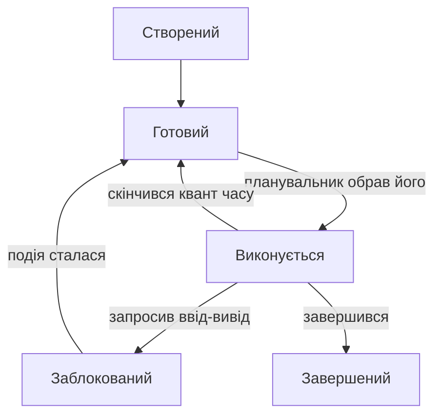

# Процеси та потоки

> [!abstract] Коротко
> На минулій лекції ми з'ясували, що керування процесами – перший із п'яти обов'язків операційної системи. Тепер розберемо, що таке процес насправді: чим він відрізняється від програми, з чого складається, які стани проходить за своє життя і скільки коштує перемкнутися з одного на інший. Далі познайомимося з потоками – способом виконувати кілька справ усередині одного процесу – і побачимо, яку страшну ціну доводиться платити за спільну пам'ять між ними. Наприкінці навчимося дивитися на все це власними очима: у диспетчері завдань, у `top` і в каталозі `/proc`.

## Навчальні цілі заняття

- **Знати:** відмінність між програмою та процесом; структуру адресного простору процесу; стани процесу та переходи між ними; призначення блоку керування процесом; що таке потік і чим він відрізняється від процесу; моделі відображення потоків.
- **Вміти:** пояснити, що відбувається при перемиканні контексту і чому воно дороге; описати механізм `fork`/`exec` і побудувати дерево процесів; обґрунтувати вибір між процесами й потоками для конкретної задачі; знайти й розпізнати стани процесів у реальній системі.

## План лекції

1. Програма і процес – це різні речі
2. Анатомія процесу: що лежить у його пам'яті
3. Блок керування процесом і перемикання контексту
4. Стани процесу
5. Як процеси народжуються: fork і exec
6. Як процеси помирають: зомбі та сироти
7. Потоки: кілька справ усередині одного процесу
8. Моделі потоків: 1:1, N:1, M:N
9. Ціна спільної пам'яті: перегони
10. Як процеси спілкуються між собою
11. Подивимося на це своїми очима

## 1. Програма і процес – це різні речі

Почнімо з розрізнення, яке здається дрібним, але без нього далі буде каша в голові.

Уявіть кулінарний рецепт. Він лежить у книзі: список інгредієнтів і послідовність дій. Рецепт сам по собі нічого не робить – це просто текст на папері. Він може лежати десятиліттями, і нічого не станеться.

Тепер уявіть, що ви взяли цей рецепт і почали готувати. З'явилася кухня, продукти на столі, увімкнена плита, каструля на вогні. З'явилося і **місце, на якому ви зараз перебуваєте**: ви на кроці сім, борошно вже додали, яйця ще ні. Якщо вас відволікти дзвінком, ви маєте запам'ятати, де зупинилися, інакше після дзвінка не зрозумієте, чи додавали вже сіль.

Рецепт – це **програма**. Процес приготування – це **процес**.

> [!definition] Визначення
> **Програма** – це пасивний набір інструкцій, файл на диску. **Процес** – це програма, що виконується: код разом із усім її поточним станом, тобто пам'яттю, відкритими файлами, регістрами процесора й позначкою, на якій саме інструкції вона зараз перебуває.

Ця різниця має цілком практичні наслідки, які ви бачите щодня.

**Одна програма – багато процесів.** На диску лежить один файл браузера. Але коли ви відкриваєте його двічі, у системі з'являється два незалежні процеси. У них однаковий код, але зовсім різний стан: різні вкладки, різні поля, різні позиції в коді. Вони не заважають одне одному й не бачать даних сусіда.

**Процес живе, програма – ні.** Файл на диску не змінюється, поки ви працюєте. Змінюється лише стан процесу в оперативній пам'яті. Коли ви закриваєте програму, процес зникає повністю – а файл лишається лежати, як лежав.

Аналогія з рецептом дає ще одну корисну думку. Якщо ви готуєте дві страви одночасно на одній плиті, вам доводиться перемикатися: помішали в одній каструлі, перейшли до другої, повернулися. І щоразу треба пам'ятати, де ви зупинилися в кожній. Саме цим і займається операційна система, тільки замість двох каструль у неї їх кількасот, а перемикається вона десятки разів на секунду.

## 2. Анатомія процесу: що лежить у його пам'яті

Коли операційна система створює процес, вона видає йому власний **адресний простір** – окрему область пам'яті, у яку більше ніхто не має доступу. Але ця область не є однорідним мішком байтів: вона поділена на кілька ділянок різного призначення.

**Сегмент коду (text).** Тут лежать самі машинні інструкції – те, що було у виконуваному файлі. Ця ділянка доступна лише для читання і виконання: спроба щось у неї записати призведе до аварійного завершення. Зроблено це навмисне, з двох міркувань. По-перше, програма, яка випадково переписує власний код, – джерело невловних помилок. По-друге, якщо код не можна змінювати, кілька процесів однієї програми можуть користуватися **однією фізичною копією** – це та сама економія, про яку ми говорили минулого разу.

**Сегмент даних.** Глобальні та статичні змінні – те, що існує весь час життя процесу. Ділиться на дві частини: ініціалізовані змінні (їхні початкові значення взято з файлу) та неініціалізовані, які система просто заповнює нулями.

**Купа (heap).** Пам'ять, яку програма просить у системи під час роботи – усе, що ви створюєте через `malloc` у C або `new` у більшості мов. Купа росте **вгору**, у бік старших адрес, у міру того як програма запитує ще й ще.

**Стек (stack).** Тут живуть локальні змінні, аргументи функцій і адреси повернення. Щоразу, коли викликається функція, на стек кладеться новий кадр; коли вона завершується – кадр знімається. Стек росте **вниз**, назустріч купі.

Ось чому вони ростуть назустріч одне одному: між ними лежить велика порожня область, і кожен може розширюватися у неї, поки є місце. Якщо ж вони зустрінуться – станеться те, що ви точно бачили на практиці. Нескінченна рекурсія кладе на стек кадр за кадром, поки він не впирається у межу, і програма падає з переповненням стека.

![[attachments/os-l2-pamyat-procesu.png|300]]
*Типова розкладка адресного простору процесу: угорі стек, що росте вниз, унизу код і дані, між ними купа, що росте вгору. Добре видно порожню область, у яку розширюються обидва. Джерело: Giovanni Alfredo Garciliano Díaz, CC BY-SA 3.0, [Wikimedia Commons](https://commons.wikimedia.org/wiki/File%3AProgram_memory_layout.svg).*

Тут варто зупинитися й відповісти на питання, яке зазвичай виникає саме в цьому місці: **як саме система домагається того, що процеси не бачать пам'яті одне одного?**

Відповідь спочатку здається дивною. Адреси, з якими працює програма, – **несправжні**. Коли ваш код звертається за адресою `0x400000`, у мікросхемі пам'яті ніхто за цією адресою нічого не шукає. Процесор спершу пропускає її крізь таблицю перетворення, яку для кожного процесу веде ядро, і лише результат цього перетворення – реальна фізична адреса – іде на шину пам'яті.

Наслідок разючий: два процеси можуть одночасно працювати з адресою `0x400000`, і це будуть **різні комірки** фізичної пам'яті. Кожен вважає, що вся адресна простір належить йому одному, і жоден не може навіть сформулювати адресу, за якою лежать дані сусіда, – бо такої адреси в його таблиці просто немає.

Аналогія: уявіть готель, де кожен гість отримує ключ від «кімнати номер 5». Гостей сто, і всі сто мають ключ від «п'ятої». Просто на рецепції для кожного гостя ведеться власний список відповідностей, і ключ конкретного гостя відчиняє конкретні фізичні двері, які іншому гостеві недоступні. Гість не може потрапити в чужу кімнату не тому, що йому заборонено, а тому, що в його системі координат вона не існує.

Це називається **віртуальною пам'яттю**, і саме на ній тримається вся ізоляція процесів. Механізм ми детально розберемо в окремій лекції – поки що достатньо запам'ятати сам факт: адреси в програмі віртуальні, перетворення робить процесор за таблицею, а таблиця у кожного процесу своя.

Крім пам'яті, процес володіє ще купою речей, які теж є частиною його стану: таблицею відкритих файлів, поточним робочим каталогом, змінними оточення, ідентифікатором користувача, від імені якого він працює, набором дозволених йому дій. Усе це система зберігає окремо – у структурі, до якої ми зараз перейдемо.

## 3. Блок керування процесом і перемикання контексту

Для кожного процесу ядро тримає структуру даних, у якій записано геть усе, що про нього треба знати. Її називають **блоком керування процесом** (PCB, Process Control Block); у Linux це структура `task_struct`.

Що там лежить:

- **PID** – унікальний числовий ідентифікатор процесу.
- **Стан** – виконується, готовий, заблокований (про це наступний розділ).
- **Збережені регістри процесора**, включно з лічильником команд – тобто те саме «на якому кроці рецепта я зупинився».
- **Інформація про пам'ять** – де саме лежить адресний простір цього процесу.
- **Таблиця відкритих файлів.**
- **Облікові дані** – власник, права.
- **Зв'язки з іншими процесами** – хто його породив, кого породив він.
- **Статистика** – скільки процесорного часу спожив, скільки пам'яті займає.

Тепер найважливіше. Процесорне ядро в кожен момент часу виконує рівно один процес. Щоб створити ілюзію одночасності, система має регулярно перемикатися між ними. Ця операція називається **перемиканням контексту**.

> [!definition] Визначення
> **Перемикання контексту (context switch)** – збереження повного стану процесу, що зупиняється, і відновлення повного стану процесу, який запускається, так, щоб останній продовжив роботу рівно з того місця, де його колись перервали.

Пройдімо повільно, що при цьому відбувається.

**Крок 1.** Спрацьовує таймер – апаратний пристрій, який регулярно смикає процесор перериванням. Це і є той механізм, завдяки якому система взагалі здатна відібрати процесор у програми, яка не хоче його віддавати.

**Крок 2.** Процесор перериває поточну програму й переходить у режим ядра – та сама межа привілеїв із минулої лекції.

**Крок 3.** Ядро зберігає у PCB поточного процесу вміст усіх регістрів, включно з лічильником команд. Це те, що дозволить потім відновитися.

**Крок 4.** Викликається планувальник і вирішує, кому віддати процесор далі. Як саме він це вирішує – тема окремої лекції.

**Крок 5.** Ядро бере PCB обраного процесу й завантажує його регістри назад у процесор.

**Крок 6.** Найдорожче. Оскільки в нового процесу інший адресний простір, доводиться перемкнути таблиці сторінок пам'яті. А це знецінює вміст кешу трансляції адрес (TLB) – процесор змушений наново з'ясовувати відповідність віртуальних адрес фізичним. Разом із цим частково втрачає актуальність і звичайний кеш даних: у ньому лежить те, з чим працював попередній процес.

**Крок 7.** Процесор повертається у режим користувача й продовжує виконання нового процесу з тієї інструкції, на якій його колись зупинили.

Щоб відчути масштаб, порахуймо. Одне перемикання контексту коштує приблизно 1–10 мікросекунд, і більша частина цієї ціни – не сама операція, а «холодні» кеші після неї: процесор ще кількасот тисяч тактів працює повільніше, поки кеш наповнюється потрібними даними. Планувальник Linux за замовчуванням дає процесу квант близько кількох мілісекунд. Отже, при повністю завантаженій системі перемикань відбувається сотні на секунду на кожне ядро, і на них іде приблизно від часток відсотка до кількох відсотків процесорного часу.

Це звучить небагато – і справді небагато, поки процесів сотні. Але залежність нелінійна: чим більше процесів претендують на ядро, тим частіше доводиться перемикатися і тим менше корисної роботи встигає зробити кожен між перемиканнями. У крайньому випадку система входить у стан, коли майже весь час іде на обслуговування самої себе.

> [!warning] Типова помилка
> Поширена ілюзія: «зроблю більше потоків або процесів – програма працюватиме швидше». Перемикання контексту коштує приблизно від одиниць до десятків мікросекунд, і більша частина цієї ціни – не сама операція, а «холодні» кеші після неї. Якщо створити тисячу процесів на чотириядерній машині, система витрачатиме помітну частку часу не на роботу, а на біганину між ними. Правило просте: кількість активних обчислювальних потоків має бути близькою до кількості ядер, а не до кількості задач.

## 4. Стани процесу

За своє життя процес перебуває в одному з трьох основних станів. Це найважливіша схема всієї теми – її варто вивчити напам'ять.

**Виконується (running).** Процес просто зараз займає процесорне ядро. Таких процесів у системі рівно стільки, скільки ядер, – не більше.

**Готовий (ready).** Процес міг би виконуватися хоч зараз, усе для цього має, але процесора йому не дали – черга не дійшла. Це найчисленніша категорія.

**Заблокований (blocked, waiting).** Процес не може виконуватися, навіть якщо йому дати процесор, бо він чекає на зовнішню подію: дані з диска, пакет із мережі, натискання клавіші, звільнення зайнятого ресурсу.



Уважно подивіться на цю схему й помітьте одну річ: **зі стану «заблокований» не можна одразу потрапити у «виконується»**. Коли дані з диска нарешті прийшли, процес не отримує процесор миттєво – він лише переходить у чергу готових і чекає, поки планувальник до нього дійде. Це часте питання на іспиті.

Поясню на побутовому прикладі. Ви прийшли до лікарні. **Виконується** – ви в кабінеті у лікаря. **Готовий** – ви сидите в черзі під дверима: усе, що треба, у вас із собою, чекаєте лише своєї черги. **Заблокований** – вас відправили здати аналіз і сказали прийти, коли буде результат. Ви не в черзі: сидіти під дверима зараз безглуздо, бо без результату вас усе одно не приймуть. Коли результат готовий, ви не заходите одразу до кабінету – ви повертаєтеся в чергу.

![[attachments/os-l2-stany.png|620]]
*Класична діаграма станів процесу з підручників. Порівняйте зі схемою вище: тут ті самі переходи, лише названі трохи інакше. Джерело: No machine-readable author provided. A3r0 assumed (base, Public domain, [Wikimedia Commons](https://commons.wikimedia.org/wiki/File%3AProcess_states.svg).*

У реальних системах станів більше. У Linux ви побачите ще щонайменше два. **Зупинений** – процес заморожено ззовні, наприклад натисканням Ctrl+Z. І **зомбі** – про нього окрема розмова далі.

## 5. Як процеси народжуються: fork і exec

У світі UNIX процеси створюються способом, який спочатку здається дивним, а потім – елегантним.

Є системний виклик `fork()`. Він створює **точну копію** процесу, який його викликав. Копіюється все: адресний простір, відкриті файли, поточний каталог, навіть позиція в коді. Після `fork()` у системі є два майже однакові процеси – батьківський і дочірній, і обидва продовжують виконання з того самого рядка.

Виникає резонне питання: як їм розрізнити, хто з них хто? За значенням, яке повернув `fork()`. **Батьківському** процесу він повертає PID новоствореного нащадка. **Дочірньому** – нуль. Одна й та сама інструкція повертає різне у двох процесах, і саме на цьому будується вся подальша логіка.

```
pid = fork();
if (pid == 0) {
    // тут виконується ТІЛЬКИ дочірній процес
} else {
    // тут виконується ТІЛЬКИ батьківський
}
```

Далі другий системний виклик – `exec()`. Він **не створює** нового процесу. Він бере вже наявний процес і повністю заміщає його вміст іншою програмою: старий код і дані викидаються, на їхнє місце завантажується новий виконуваний файл, виконання починається з початку. PID при цьому не змінюється – це той самий процес, але з новим «наповненням».

Тепер зберемо разом. Що відбувається, коли ви в терміналі набираєте `ls` і тиснете Enter:

1. Оболонка викликає `fork()` – з'являється її точна копія.
2. Копія розуміє, що вона дочірня (бо `fork` повернув нуль), і викликає `exec("/bin/ls")` – заміщає себе програмою `ls`.
3. Батьківська оболонка викликає `wait()` і засинає, чекаючи, поки нащадок завершиться.
4. `ls` виводить список файлів і завершується.
5. Оболонка прокидається й малює новий рядок запрошення.

Здавалося б, копіювати весь адресний простір лише для того, щоб за мить його викинути й завантажити іншу програму, – марнотратство. Так і було б, якби система копіювала чесно. Насправді працює механізм **копіювання при записі (copy-on-write)**: одразу після `fork` обидва процеси користуються тими самими фізичними сторінками пам'яті, лише позначеними як «тільки для читання». Реальне копіювання сторінки відбувається лише тоді, коли хтось із двох спробує в неї записати. Якщо ж одразу викликається `exec`, копіювати не доводиться взагалі.

Щоб механізм `fork` остаточно вклався в голові, простежмо конкретну програму рядок за рядком. Нехай вона така:

```c
printf("Початок\n");
pid_t pid = fork();
printf("Тут PID = %d\n", getpid());
if (pid == 0)
    printf("Я нащадок\n");
else
    printf("Я батько, мій нащадок має PID %d\n", pid);
```

Припустімо, батьківський процес має PID 100, а створений нащадок отримає PID 101. Ось що станеться:

| Що виконується | Процес 100 (батько) | Процес 101 (нащадок) |
|---|---|---|
| `printf("Початок")` | виводить «Початок» | ще не існує |
| `fork()` | повертає **101** | повертає **0** |
| `printf` з `getpid()` | виводить «Тут PID = 100» | виводить «Тут PID = 101» |
| перевірка `pid == 0` | 101 ≠ 0 → гілка `else` | 0 == 0 → гілка `if` |
| результат | «Я батько, мій нащадок має PID 101» | «Я нащадок» |

Зверніть увагу на три речі, які завжди дивують на початку.

**Слово «Початок» виводиться один раз, а не двічі.** Хоча нащадок і є повною копією батька, копія робиться в момент виклику `fork`, а на той час `printf` уже відпрацював. Нащадок починає життя не з початку програми, а рівно з того місця, де стояв `fork`.

**Рядок `printf("Тут PID = ...")` написаний один, а виконується двічі** – по разу в кожному процесі. І значення виводить різні, бо `getpid()` повертає ідентифікатор того процесу, який його викликав.

**Порядок рядків у виводі непередбачуваний.** Хто з двох процесів надрукує свій рядок першим, вирішує планувальник. Запустіть програму десять разів – і побачите обидва варіанти. Це перший натяк на те, про що піде мова в дев'ятому розділі.

У Windows підхід інший: там є єдиний виклик `CreateProcess`, який одразу створює новий процес із заданою програмою. Ніякого проміжного клонування немає. Обидва підходи робочі; UNIX-шлях гнучкіший, бо між `fork` і `exec` дочірній процес може щось налаштувати – наприклад, перенаправити свій вивід у файл, і саме так у оболонці працює символ `>`.

**Дерево процесів.** Оскільки кожен процес кимось породжений, усі процеси системи утворюють дерево. Його корінь – процес із PID 1, який запускається ядром першим і від якого походить усе інше. У сучасних Linux це `systemd`, історично – `init`. Саме до нього, як ми зараз побачимо, потрапляють усі осиротілі процеси.

## 6. Як процеси помирають: зомбі та сироти

Коли процес завершується, він не зникає безслідно. Він залишає по собі **код завершення** – маленьке число, яке каже, чи все пройшло добре (нуль) чи сталася помилка (будь-що інше). Це число потрібне батьківському процесу: саме так оболонка розуміє, що команда не спрацювала.

Отже, ядро не може прибрати процес одразу – воно має зберегти запис про нього, поки батько не забере результат викликом `wait()`. Такий процес – уже мертвий, але ще не прибраний – називається **зомбі**.

> [!definition] Визначення
> **Зомбі (zombie)** – процес, який завершив виконання, але запис про який ще залишається в таблиці процесів, бо батько не забрав його код завершення.

У нормі зомбі живе мілісекунди. Але якщо батьківський процес написаний недбало й не викликає `wait()`, зомбі накопичуються. Пам'яті вони майже не займають – від них лишився тільки рядок у таблиці. Проблема в іншому: таблиця процесів має обмежений розмір, і коли вона заповнюється, система більше не може створити жоден новий процес. Ви не зможете навіть запустити термінал, щоб полагодити ситуацію.

Дзеркальна ситуація – **сирота**. Це процес, батько якого завершився раніше за нього. Здавалося б, тепер нікому забрати його код завершення, і він назавжди зависне зомбі. Але система вирішує це просто: осиротілий процес **усиновлюється** процесом із PID 1. А той написаний правильно й регулярно прибирає за всіма, кого йому передали.

> [!info] Для допитливих
> На цьому побудований стандартний спосіб запустити фонову службу: процес навмисне робить `fork`, після чого батько одразу завершується. Нащадок стає сиротою, його всиновлює PID 1, він відв'язується від термінала й живе далі сам по собі. Таку процедуру називають «демонізацією», а самі фонові служби в UNIX – демонами.

## 7. Потоки: кілька справ усередині одного процесу

Тепер друга половина лекції. Процеси добре ізольовані одне від одного – і це водночас їхня сила й слабкість.

Уявіть текстовий редактор. Він має одночасно робити щонайменше три речі: реагувати на натискання клавіш, перевіряти орфографію в уже набраному тексті й раз на хвилину зберігати резервну копію на диск.

Спробуймо розв'язати це процесами. Три процеси – три окремі адресні простори. Але ж усім трьом потрібен **той самий текст**: той, хто перевіряє орфографію, має бачити щойно набрані літери. Отже, доведеться щоразу пересилати документ між процесами через спеціальні механізми обміну – це складно й повільно, особливо якщо документ великий.

Тепер спробуймо в один процес без розділення. Тоді, поки йде збереження на диск, редактор не реагує на клавіатуру: він застряг у виклику, який чекає на диск. Ви це бачили – програма «зависає» на секунду під час автозбереження.

Розв'язок – **потоки**.

> [!definition] Визначення
> **Потік (thread)** – окрема послідовність виконання всередині процесу. Потоки одного процесу **поділяють** його адресний простір і відкриті файли, але кожен має **власний** стек, власні регістри й власний лічильник команд.

Розподіл «спільне / власне» треба запам'ятати точно, бо з нього випливає геть усе інше.

| Спільне для всіх потоків процесу | Власне у кожного потоку |
|---|---|
| код програми | лічильник команд |
| глобальні змінні й купа | регістри процесора |
| відкриті файли | стек із локальними змінними |
| поточний каталог, змінні оточення | ідентифікатор потоку |
| права доступу | пріоритет |

Чому стек власний – зрозуміло: кожен потік перебуває у своєму місці програми, викликав свій ланцюжок функцій і має свої локальні змінні. Чому купа спільна – теж: саме заради цього все й затівалося, щоб бачити ті самі дані без пересилання.

![[attachments/os-l2-potoky.png|620]]
*Однопотоковий і багатопотоковий процес поруч. Код, дані й відкриті файли спільні, а лічильник команд, регістри та стек – у кожного потоку свої. Джерело: Cburnett, CC BY-SA 3.0, [Wikimedia Commons](https://commons.wikimedia.org/wiki/File%3AMultithreaded_process.svg).*

**Що дають потоки:**

- **Чуйність інтерфейсу.** Поки один потік зайнятий довгою операцією, інший продовжує реагувати на користувача.
- **Дешевизна.** Створити потік значно швидше, ніж процес, – не треба будувати новий адресний простір. Перемикання між потоками одного процесу теж дешевше, бо не змінюються таблиці сторінок і не скидається TLB.
- **Простота обміну даними.** Спільна пам'ять – просто спільні змінні, без жодних додаткових механізмів.
- **Використання всіх ядер.** Один процес із чотирма потоками може зайняти чотири ядра одночасно.

**І чим доводиться платити:**

- **Немає ізоляції.** Помилка в одному потоці руйнує весь процес. Якщо потік звернувся за неправильною адресою, падає вся програма разом з усіма іншими потоками.
- **Спільна пам'ять – джерело найпідступніших помилок у програмуванні.** Про це наступний розділ.

Саме тому браузери свого часу зробили важливий архітектурний вибір: кожна вкладка – **окремий процес**, а не потік. Дорожче по пам'яті, зате сторінка, яка впала або виявилася шкідливою, не забирає з собою весь браузер і не читає дані сусідніх вкладок.

### Як цей вибір виглядає на практиці: три покоління вебсерверів

Найкраще протиставлення «процеси проти потоків проти чогось третього» видно на історії вебсерверів – і це добрий приклад того, як архітектурне рішення впирається у фізику.

**Покоління перше: процес на кожного клієнта.** Так працював класичний Apache у режимі prefork. Прийшов запит – сервер робить `fork`, нащадок обслуговує клієнта й помирає. Надійно до непристойності: будь-який збій чи витік пам'яті зачіпає рівно одного клієнта, решта навіть не помітить. Але процес важкий: кілька мегабайтів пам'яті плюс повноцінне перемикання контексту. Тисяча одночасних клієнтів – тисяча процесів, і машина захлинається.

**Покоління друге: потік на кожного клієнта.** Потік дешевший за процес у рази, перемикання між потоками одного процесу теж дешевше. Тисячу клієнтів уже можна витягнути. Але й тут є стеля: кожен потік вимагає власного стека (типово від 512 КБ до 8 МБ віртуальної пам'яті), а перемикань усе одно багато. На десяти тисячах одночасних з'єднань система знову починає більше перемикатися, ніж працювати. У літературі цю межу так і називають – **проблема C10K**, десять тисяч клієнтів.

**Покоління третє: один потік і цикл подій.** Саме тут з'явилися nginx і Node.js. Ідея контрінтуїтивна: обслуговувати тисячі з'єднань **одним** потоком. Працює це тому, що вебсервер майже весь час не рахує, а чекає – на диск, на базу даних, на повільного клієнта. Замість того щоб тримати окремий потік, який просто спить у стані «заблокований», сервер каже ядру: «ось десять тисяч з'єднань, розбуди мене, коли на будь-якому з них щось станеться», і обробляє події по черзі в одному циклі. Перемикань контексту практично немає, пам'яті на з'єднання – кілька кілобайтів.

Мораль тут не в тому, що третій підхід кращий. Мораль у тому, що **правильний вибір залежить від характеру навантаження**. Якщо задача переважно чекає на введення-виведення – виграє цикл подій. Якщо задача переважно рахує (обробка відео, наукові обчислення) – цикл подій не дасть нічого, бо чекати нема на що, і потрібні саме потоки, по одному на ядро. Якщо ж понад усе цінується стійкість до збоїв – беруть процеси, навіть знаючи, що вони дорожчі.

## 8. Моделі потоків: 1:1, N:1, M:N

Потік можна реалізувати на двох різних рівнях, і від цього залежить дуже багато.

**Модель 1:1 – потоки рівня ядра.** Кожному потоку програми відповідає окремий потік, про який знає ядро. Планувальник бачить їх і розподіляє між ядрами процесора самостійно. Так працюють Linux, Windows і macOS. Перевага – справжня паралельність і те, що заблокований потік не тягне за собою інших. Недолік – кожен потік коштує ресурсів ядра, тому мільйон потоків створити не вийде.

**Модель N:1 – потоки рівня користувача.** Ядро взагалі не знає про потоки: воно бачить один процес. Перемиканням між потоками займається бібліотека всередині самої програми. Перемикання виходить дуже дешевим, бо не треба заходити в ядро. Але є фатальна вада: якщо один потік викличе блокуючу операцію, ядро заблокує **весь процес** цілком, бо не здогадується, що всередині є інші потоки, готові працювати. І ще: усі потоки застрягають на одному ядрі процесора, справжньої паралельності немає.

**Модель M:N – гібрид.** Багато легких потоків користувача відображаються на невелику кількість потоків ядра. Складно в реалізації, зате поєднує дешевизну з паралельністю. Саме так влаштовані сучасні «легкі потоки»: горутини в Go, віртуальні потоки в Java, корутини в Kotlin. Створити мільйон горутин – цілком нормальна річ, тоді як мільйон потоків ядра завалить будь-яку систему.

> [!exam] На іспиті
> Питання «чому в моделі N:1 блокування одного потоку зупиняє всю програму» перевіряє, чи розумієте ви межу між ядром і простором користувача з першої лекції. Відповідь: ядро оперує процесом як єдиним об'єктом і не має жодної інформації про потоки, створені бібліотекою всередині нього. Для ядра це просто один процес, який попросив дані з диска, – і воно чесно переводить його у стан «заблокований».

## 9. Ціна спільної пам'яті: перегони

А тепер найважливіше практичне попередження всієї лекції. Спільна пам'ять, заради якої потоки й вигадали, є джерелом помилок, які майже неможливо зловити.

Візьмімо найпростіший приклад. Є спільна змінна-лічильник, і два потоки виконують над нею операцію `counter = counter + 1`. Початкове значення – 5. Обидва потоки зробили по одному додаванню. Скільки має вийти?

Здається, сім. Насправді може вийти й шість.

Річ у тім, що рядок `counter = counter + 1` – це не одна дія процесора, а три:

1. прочитати значення з пам'яті в регістр;
2. додати одиницю в регістрі;
3. записати результат назад у пам'ять.

А перемикання контексту може статися **між будь-якими двома** з цих кроків. Прослідкуймо найгірший випадок по кроках:

| Крок | Що робить потік А | Що робить потік Б | counter у пам'яті |
|---|---|---|---|
| 1 | читає counter → у регістрі 5 | – | 5 |
| 2 | *перемикання контексту* | – | 5 |
| 3 | – | читає counter → у регістрі 5 | 5 |
| 4 | – | додає 1 → у регістрі 6 | 5 |
| 5 | – | записує 6 у пам'ять | **6** |
| 6 | – | *перемикання контексту* | 6 |
| 7 | додає 1 → у регістрі 6 | – | 6 |
| 8 | записує 6 у пам'ять | – | **6** |

Одне з двох додавань безслідно зникло. Потік А працював зі значенням, яке встигло застаріти, поки він був відкладений.

> [!definition] Визначення
> **Стан перегонів (race condition)** – ситуація, коли результат роботи програми залежить від того, у якому саме порядку операційна система перемкнула потоки. Ділянка коду, у якій потоки звертаються до спільних даних і яку тому не можна виконувати одночасно, називається **критичною секцією**.

> [!warning] Типова помилка
> Найгірше в перегонах те, що вони проявляються не завжди. Наведений вище збіг вимагає, щоб перемикання сталося рівно в потрібну мілісекунду. На вашій машині під час налагодження програма відпрацює правильно тисячу разів поспіль. А на сервері під навантаженням – зламається раз на кілька годин, у різних місцях і без можливості відтворити. Це найдорожчий клас помилок у нашій професії, і уникнути його можна лише дисципліною: **будь-який доступ кількох потоків до спільних змінних, де хоча б один із них пише, має бути захищений**.

Другий різновид перегонів трапляється ще частіше, і виглядає він зовсім невинно. Це схема «перевірив – потім зробив».

Уявіть банківський рахунок, на якому лежить 1000 гривень. Два потоки одночасно намагаються зняти по 800:

```
if (balance >= amount) {      // перевірка
    balance = balance - amount;   // дія
}
```

Обидва потоки виконують перевірку, обидва бачать 1000 ≥ 800, обидва проходять умову. Далі обидва віднімають. На рахунку опиняється −600 гривень, хоча код нібито це прямо забороняє.

Помилка не в умові – умова правильна. Помилка в тому, що **між перевіркою і дією минає час**, і за цей час стан устигає змінитися. Той самий візерунок ви зустрінете у формі «перевірив, чи існує файл, – і створив його», «перевірив, чи є вільне місце, – і записав», «перевірив права – і виконав дію». Останній варіант, до речі, є цілим класом вразливостей у безпеці.

> [!warning] Типова помилка
> Студенти часто думають, що в мові високого рівня проблеми немає: «я ж написав один оператор `counter++`». Це не рятує. Один оператор мови – це кілька інструкцій процесора, і перемикання може статися між ними. Те саме стосується `i += 1` у Python і `count++` у Java. Атомарність – це властивість не рядка коду, а окремої інструкції процесора, і забезпечувати її треба свідомо.

Як саме захищатися – м'ютексами, семафорами, атомарними операціями – буде темою окремої лекції. Поки що запам'ятайте головне: якщо кілька потоків торкаються одних даних і хоча б один із них пише, код неправильний доти, доки ви не додали захист. Те, що він поки не зламався, нічого не доводить.

## 10. Як процеси спілкуються між собою

Ми весь час підкреслювали: процеси ізольовані, один не бачить пам'яті іншого. Але ж реальні системи складаються з процесів, які мусять співпрацювати. Оболонка передає вивід однієї команди на вхід другій. Браузер обмінюється даними між процесом вкладки й головним процесом. Служба друку приймає завдання від десятків програм.

Отже, ізоляція має бути не глухою стіною, а стіною з дверима, які контролює ядро. Набір таких дверей називають **міжпроцесною взаємодією** (IPC, inter-process communication). Розберемо основні способи.

**Канал (pipe).** Найпростіше: односторонній потік байтів. Один процес пише в один кінець, другий читає з другого. Саме це стоїть за вертикальною рискою в командному рядку: коли ви пишете `ps aux | grep firefox`, оболонка створює канал, запускає два процеси й з'єднує вивід першого зі входом другого. Кожен із них при цьому впевнений, що працює зі звичайним файлом, – знову та сама абстракція «усе є файлом». Звичайний канал працює лише між родичами (батьком і нащадком); є ще іменований канал, який існує як запис у файловій системі й дозволяє з'єднати будь-які два процеси.

**Сигнал.** Найкоротше можливе повідомлення: лише номер, без даних. Це спосіб сказати процесу «сталася подія» або «зроби щось негайно». Ви користуєтеся сигналами постійно, навіть не знаючи термінології: Ctrl+C надсилає програмі сигнал переривання, а команда `kill` – попри назву – просто надсилає сигнал, і за замовчуванням це ввічливе прохання завершитися. Процес може встановити власний обробник і, наприклад, коректно зберегти дані перед виходом. Але є два сигнали, які перехопити неможливо: `SIGKILL` (примусове знищення) і `SIGSTOP` (примусова зупинка) – саме тому `kill -9` спрацьовує там, де звичайний `kill` безсилий.

**Спільна пам'ять.** Ядро на прохання двох процесів відображає одну й ту саму фізичну область пам'яті в обидва адресні простори. Далі вони обмінюються даними просто читанням і записом – без жодних системних викликів, а отже, максимально швидко. Це найшвидший спосіб IPC і водночас найнебезпечніший: ми власноруч повертаємо всі проблеми спільного доступу з дев'ятого розділу, тільки тепер між процесами. Тому спільна пам'ять майже завжди йде в парі з окремим механізмом синхронізації – семафором.

**Черга повідомлень.** Проміжний варіант: процеси надсилають одне одному не потік байтів, а окремі структуровані повідомлення, які ядро зберігає у черзі. Зручно, коли важливо не змішати повідомлення від різних відправників.

**Сокет.** Найуніверсальніший спосіб. Спочатку сокети придумали для зв'язку між машинами по мережі, але виявилося зручним використовувати той самий інтерфейс і для процесів на одній машині – так з'явилися локальні сокети. Головна перевага: код, написаний для локального обміну, майже без змін працює і по мережі. Саме тому на сокетах побудована більшість сучасних служб.

> [!example] Приклад
> Команда `cat log.txt | grep "ERROR" | wc -l` створює **три** процеси і **два** канали. `cat` читає файл і пише в перший канал; `grep` читає звідти, відбирає рядки з помилками й пише в другий канал; `wc` читає з нього і рахує рядки. Три незалежні програми, жодна з яких не знає про існування двох інших, разом розв'язують задачу «скільки помилок у журналі». Це і є той принцип «маленькі програми, що роблять одну річ добре», про який ми говорили на першій лекції.

> [!exam] На іспиті
> Класичне питання: «чим спільна пам'ять принципово відрізняється від решти способів IPC». Відповідь: усі інші механізми проходять через ядро – кожна передача даних це системний виклик і копіювання. Спільна пам'ять після початкового налаштування ядро не турбує взагалі, дані не копіюються, тому вона найшвидша. Плата за це – синхронізацію доводиться робити самому.

## 11. Подивимося на це своїми очима

Уся теорія вище – не абстракція, її видно на будь-якій машині просто зараз.

**У Windows** відкрийте диспетчер завдань і перейдіть на вкладку «Подробиці». Ви побачите список процесів, їхні PID, скільки процесорного часу й пам'яті кожен спожив. Зверніть увагу, скільки процесів працює на щойно завантаженій системі, коли ви нібито «нічого не запускали»: зазвичай понад сотню.

**У Linux та macOS** є команда `ps` для одноразового зрізу і `top` (або зручніший `htop`) для живого спостереження. Корисно запустити `htop` і просто подивитися хвилину: видно, як процеси змінюють стан, як стрибає завантаження ядер, як планувальник роздає час.

![[attachments/os-l2-htop.png|640]]
*Вигляд htop: список процесів, їхні PID, стани, спожитий час і завантаження кожного ядра окремо. Джерело: PER9000, Per Erik Strandberg, CC BY-SA 3.0, [Wikimedia Commons](https://commons.wikimedia.org/wiki/File%3AHtop.png).*

У виводі `ps` є стовпчик `STAT` – і це рівно ті стани, які ми розбирали:

- `R` – виконується або готовий до виконання;
- `S` – заблокований, чекає на подію (найчастіший стан у системі);
- `D` – заблокований на вводі-виводі, причому так, що його не можна перервати;
- `T` – зупинений;
- `Z` – зомбі.

Якщо ви побачили в системі багато процесів у стані `Z` – ви щойно знайшли програму з помилкою, про яку ми говорили в шостому розділі.

**Найцікавіше – каталог `/proc`.** Це не справжні файли на диску, а вікно всередину ядра, зроблене у вигляді файлової системи – прямий наслідок принципу «усе є файлом» із першої лекції. Для кожного процесу там є каталог, названий його PID. Усередині:

- `/proc/<pid>/status` – стан, власник, спожита пам'ять;
- `/proc/<pid>/cmdline` – з якою командою його запустили;
- `/proc/<pid>/fd/` – усі відкриті ним файли;
- `/proc/<pid>/task/` – усі його потоки, кожен окремим каталогом.

Тобто те, що ми обговорювали як теоретичні структури ядра, можна просто взяти й прочитати звичайною командою читання файлу. Загляньте туди на практичному занятті – це найкращий спосіб переконатися, що PCB, стани й потоки не вигадка лектора.

## Замість підсумку

Три речі, які варто винести з цієї лекції, навіть якщо решта забудеться.

**Перше.** Процес – це не програма, а програма разом з усім її живим станом. Саме тому одна програма може дати сотню незалежних процесів.

**Друге.** Ілюзія одночасності коштує грошей. Перемикання контексту – реальна робота процесора, і чим більше ви наплодите процесів і потоків, тим більшу частку часу система витрачатиме на біганину замість корисної роботи.

**Третє.** Потоки дають швидкість і зручність, але забирають ізоляцію. Спільна пам'ять без захисту – це помилки, які не відтворюються й не ловляться налагоджувачем. Обираючи між процесами й потоками, ви обираєте між безпекою й вартістю, і правильної відповіді «завжди» тут не існує.

> [!question] Перевірте себе
> 1. Ви двічі відкрили той самий текстовий редактор. Скільки програм і скільки процесів у системі? Чому вони не бачать тексту одне одного?
> 2. Чому стек і купа ростуть назустріч, а не в один бік? Що станеться, якщо вони зустрінуться?
> 3. Процес чекав на дані з диска, і дані нарешті прийшли. Він одразу почне виконуватися? Обґрунтуйте.
> 4. `fork()` копіює весь адресний простір, а `exec()` одразу після цього його викидає. Чому це не є марнотратством у сучасних системах?
> 5. Батьківський процес завершився раніше за дочірній. Що станеться з нащадком і чому він не залишиться зомбі назавжди?
> 6. Чому падіння одного потоку вбиває весь процес, а падіння одного процесу не вбиває інші?
> 7. Два потоки виконали `counter++` над змінною зі значенням 10. Наведіть послідовність кроків, за якої результатом буде 11, а не 12.
> 8. Чому в Go можна створити мільйон горутин, але не можна створити мільйон потоків ядра?

## Назад

← [[courses/operating-systems/lectures/01-vstup-do-operatsiinykh-system|Лекція 1. Вступ до операційних систем]]

## Далі

→ [[courses/operating-systems/lectures/03-planuvannia-protsesiv|Лекція 3. Планування процесів]]

## Література

**Базова (українською):**

1. Авраменко В. С., Авраменко А. С. Основи операційних систем: навчальний посібник. – Черкаси: Черкаський національний університет імені Богдана Хмельницького, 2018. – 524 с. URL: https://eprints.cdu.edu.ua/1480/
2. Федотова-Півень І. М., Миронець І. В., Півень О. Б., Сисоєнко С. В., Миронюк Т. В. Операційні системи: навчальний посібник. – Черкаси: ТОВ «ДІСА ПЛЮС», 2019. – 216 с. – ISBN 978-617-7645-93-0. URL: https://er.chdtu.edu.ua/handle/ChSTU/1041
3. Мосіюк О. О., Федорчук А. Л. Операційні системи та системне програмування: навчально-методичний посібник. – Житомир: Вид-во ЖДУ ім. Івана Франка, 2022. URL: https://eprints.zu.edu.ua/33751/

**Допоміжна (англійською):**

4. Tanenbaum A. S., Bos H. Modern Operating Systems. 5th ed. – Pearson, 2022. – ISBN 978-0-13-761887-3. (розділ 2: Processes and Threads)
5. Silberschatz A., Galvin P. B., Gagne G. Operating System Concepts. 10th ed. – Wiley, 2018. – ISBN 978-1-118-06333-0. (розділи 3–4)
6. Arpaci-Dusseau R. H., Arpaci-Dusseau A. C. Operating Systems: Three Easy Pieces. Version 1.10. – Arpaci-Dusseau Books, November 2023. URL: https://pages.cs.wisc.edu/~remzi/OSTEP/ (розділи `cpu-intro`, `cpu-api`, `threads-intro` – лежать у `Матеріали/`)
