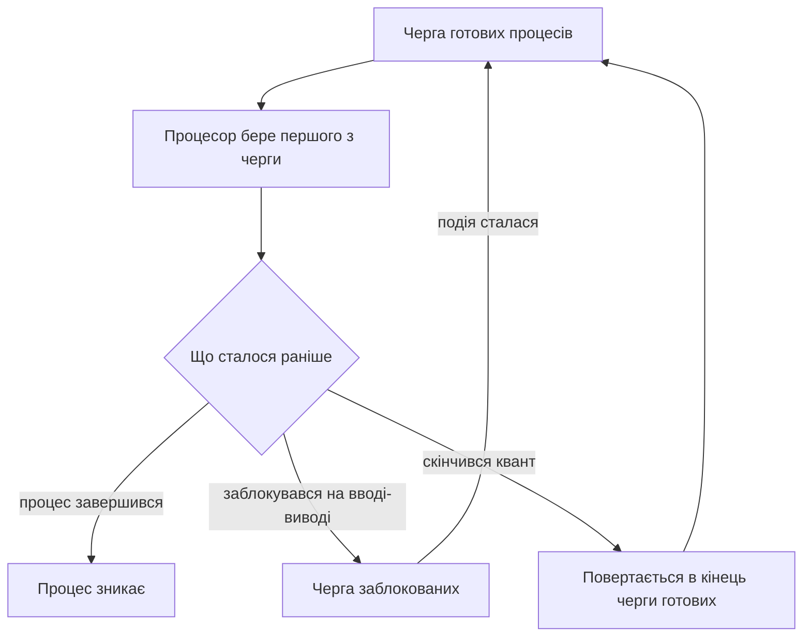
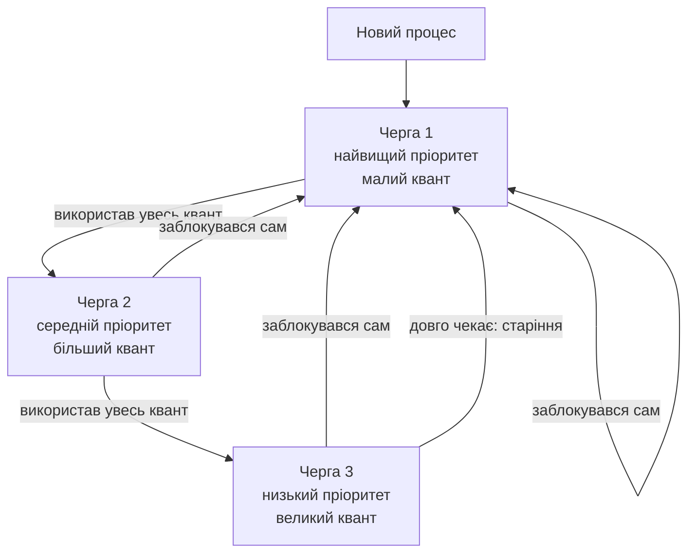

# Планування процесів

> [!abstract] Коротко
> Минулого разу ми двічі обійшли одне питання, пообіцявши повернутися: коли процес виходить із черги готових і отримує процесор, **хто і за яким правилом це вирішує**. Сьогодні розбираємо саме це. Побачимо, що «справедливо» й «швидко» – вимоги, які суперечать одна одній, і жоден алгоритм не може задовольнити обидві. Пройдемо класичні алгоритми від найпростішого до сучасних, порахуємо на одних і тих самих числах, наскільки вони різні, і подивимося, що насправді працює всередині Linux і Windows. Наприкінці навчимося втручатися в роботу планувальника власноруч.

## Навчальні цілі заняття

- **Знати:** критерії якості планування та суперечності між ними; відмінність витісняльного планування від невитісняльного; класичні алгоритми (FCFS, SJF, RR, пріоритетне, багаторівневі черги) та їхні слабкі місця; принцип роботи планувальників Linux і Windows.
- **Вміти:** обчислити середній час очікування й обороту для заданого набору процесів; обґрунтувати вибір розміру кванта часу; розпізнати ефект конвою та голодування і назвати спосіб їх усунення; змінити пріоритет процесу в реальній системі.

## План лекції

1. Що взагалі вирішує планувальник
2. За якими критеріями його оцінювати
3. Витісняльне і невитісняльне планування
4. Два типи навантаження: процесор проти вводу-виводу
5. FCFS – найпростіше, що можна придумати
6. SJF – найкраще, чого не існує
7. Кругове планування і питання розміру кванта
8. Пріоритети та голодування
9. Багаторівневі черги зі зворотним зв'язком
10. Як це зроблено насправді: Linux і Windows
11. Багатоядерність змінює правила
12. Планування реального часу
13. Як втрутитися власноруч
14. Коли гальмує – а планувальник ні до чого

## 1. Що взагалі вирішує планувальник

Повернімося до діаграми станів із минулої лекції. Процес виходить зі стану «заблокований», отримавши свої дані з диска, і потрапляє у чергу готових. Там він не сам: разом із ним чекають десятки, а то й сотні інших. Ядер у процесора, скажімо, чотири. Отже, четверо працюють, решта чекає.

Момент, коли треба обрати наступного, настає постійно: щойно процес завершився, щойно заблокувався, щойно скінчився його квант часу, щойно прокинувся хтось пріоритетніший. Десятки й сотні разів на секунду на кожному ядрі.

> [!definition] Визначення
> **Планувальник (scheduler)** – частина ядра, яка вирішує, який саме процес із черги готових отримає процесорне ядро наступним і на який час. Правило, за яким він це робить, називають **алгоритмом планування**.

Здавалося б, задача дрібна: узяти наступного з черги. Насправді вона визначає, як система відчувається в руках. Той самий комп'ютер із тим самим навантаженням може бути або чуйним, або дратівливо гальмівним – і різниця буде саме в планувальнику.

Наведу приклад, який ви точно відчували. Ви копіюєте великий файл і одночасно рухаєте мишею. Копіювання – робота, яка може почекати зайві півсекунди, ніхто цього не помітить. А курсор, який відстає від руки хоча б на десяту частку секунди, дратує миттєво. Обидві задачі претендують на процесор; хороший планувальник розуміє, що курсору треба дати час негайно, а копіюванню – коли буде вільно. Поганий обслуговує їх однаково, і система здається «гальмом», хоча процесор завантажений не повністю.

## 2. За якими критеріями його оцінювати

Перш ніж порівнювати алгоритми, треба домовитися, що взагалі вважати хорошим результатом. Критеріїв кілька, і в цьому вся сіль.

**Використання процесора.** Частка часу, коли процесор зайнятий корисною роботою, а не простоює. Хочемо ближче до ста відсотків.

**Пропускна здатність.** Скільки процесів система встигає завершити за одиницю часу. Хочемо більше.

**Час обороту.** Скільки минуло від моменту, коли процес з'явився, до моменту, коли він повністю завершився. Хочемо менше.

**Час очікування.** Скільки сумарно процес просидів у черзі готових, нічого не роблячи. Це найчесніший показник роботи саме планувальника: на власну роботу процесу він вплинути не може, а на чекання – цілком.

**Час відгуку.** Скільки минає від дії користувача до першої видимої реакції. Для інтерактивних програм головний критерій: людині важливіше побачити, що система її почула, ніж дочекатися повного результату.

**Справедливість.** Кожен процес має отримати свою частку і не чекати нескінченно.

І ось головне, що треба зрозуміти: **ці критерії суперечать один одному**. Не «іноді», а принципово.

Хочете максимальної пропускної здатності – давайте процесору довгі неперервні відрізки роботи, менше перемикайтеся, бо кожне перемикання це втрачений час і холодні кеші. Але тоді час відгуку стане жахливим: інтерактивна програма чекатиме, поки відпрацює довгий обчислювальний процес.

Хочете відмінного часу відгуку – перемикайтеся якнайчастіше, щоб кожен встиг подати ознаки життя. Але тоді левова частка часу піде на самі перемикання, і пропускна здатність упаде.

Хочете абсолютної справедливості – дайте всім порівну. Але тоді фоновий процес архівації отримає стільки ж, скільки програвач відео, і відео почне сіпатися.

Щоб ця суперечність перестала бути абстракцією, розгляньмо конкретну ситуацію. Уявіть навчальну аудиторію, де двадцять студентів одночасно компілюють свої проєкти на одному сервері, і при цьому кожен працює у своєму редакторі через віддалений доступ.

**Якщо оптимізувати пропускну здатність** – сервер має віддавати кожній компіляції довгий неперервний відрізок, щоб менше перемикатися й не псувати кеші. Усі двадцять проєктів зберуться за мінімальний сумарний час. Але кожен студент увесь цей час бачитиме, як його редактор реагує на натискання клавіші через дві-три секунди. Формально сервер працює ідеально; суб'єктивно він «висить».

**Якщо оптимізувати час відгуку** – сервер має перемикатися часто, щоб кожен редактор устигав реагувати. Друк буде миттєвим, працювати комфортно. Але сумарний час компіляції всіх двадцяти проєктів зросте, бо частина потужності піде на самі перемикання.

Обидва рішення правильні – просто вони відповідають на різні питання. І саме тому налаштування планувальника на сервері баз даних і на настільному комп'ютері відрізняються, хоча ядро може бути буквально тим самим.

> [!warning] Типова помилка
> Питання «який алгоритм планування найкращий» некоректне за побудовою – так само, як питання «яке ядро краще» з першої лекції. Правильна відповідь завжди починається з «для якого навантаження». Планувальник сервера баз даних, планувальник настільної системи й планувальник бортового комп'ютера літака оптимізують різні критерії, і кожен із них поганий на чужому місці.

## 3. Витісняльне і невитісняльне планування

Фундаментальна розвилка, від якої залежить решта.

**Невитісняльне планування.** Процес, отримавши процесор, тримає його доти, доки сам не віддасть – завершившись або заблокувавшись на введенні-виведенні. Система не може його перервати.

Плюси: простота реалізації і повна відсутність проблем зі спільними даними, бо перемикання відбувається лише в передбачуваних точках. Мінус фатальний: одна програма, що зациклилася, вішає всю систему намертво. Саме так поводилися Windows 3.x і класичний Mac OS – і будь-хто, хто з ними працював, пам'ятає це відчуття.

**Витісняльне планування.** Система має право відібрати процесор у будь-який момент. Механізм ми вже знаємо з минулої лекції: апаратний таймер регулярно смикає процесор перериванням, керування переходить до ядра, і ядро вирішує, продовжувати поточний процес чи перемкнутися.

Плюси: жодна програма не може захопити машину, час відгуку керований, справедливість досяжна. Мінус: усі ті проблеми спільного доступу, про які ми говорили в дев'ятому розділі минулої лекції, – перемикання тепер може статися **де завгодно**, у тому числі посеред операції, яку ви вважали неподільною.

Усі сучасні системи загального призначення – витісняльні. Ціна у вигляді складності синхронізації визнана прийнятною, бо альтернатива гірша.

## 4. Два типи навантаження: процесор проти вводу-виводу

Щоб планувати розумно, треба розуміти, що процеси бувають дуже різні за характером.

**Обмежені процесором (CPU-bound).** Довго рахують, майже не звертаються до пристроїв. Компіляція, обробка відео, наукові розрахунки, підбір пароля. Такий процес, отримавши квант, використає його повністю до останньої мікросекунди.

**Обмежені введенням-виведенням (I/O-bound).** Рахують мало, зате постійно чогось чекають: диска, мережі, клавіатури. Текстовий редактор, вебсервер, база даних. Такий процес бере процесор на короткий час, робить трохи роботи й одразу блокується.

Порахуймо, наскільки це важливо, на маленькому прикладі. Нехай є два процеси. Перший, назвемо його «архіватор», рахує без перерви цілу секунду. Другий, «редактор», працює циклами: одна мілісекунда обчислень, потім десять мілісекунд очікування диска, і так по колу.

**Варіант А: пропускаємо першим архіватор.** Він займає процесор на цілу секунду. Редактор увесь цей час стоїть у черзі готових. Диск при цьому не робить нічого – редактор до нього просто не дійшов. Через секунду архіватор завершується, і лише тоді редактор нарешті починає свої цикли.

**Варіант Б: пропускаємо першим редактор.** Він бере процесор на одну мілісекунду, звертається до диска й блокується. Процесор одразу дістається архіватору. Поки архіватор рахує, диск паралельно виконує запит редактора. Через десять мілісекунд редактор прокидається, забирає процесор на одну мілісекунду, знову йде до диска – і архіватор продовжує.

У варіанті Б архіватор втратив приблизно десяту частину свого часу, зате редактор працює одразу, а диск завантажений паралельно з процесором. У варіанті А диск простоював секунду даремно.

Ключове спостереження: **вигідно давати перевагу процесам другого типу**. Причина не в справедливості, а в ефективності. Процес, обмежений введенням-виведенням, отримавши процесор, майже одразу його звільнить і піде чекати диска. Поки він чекає, процесор усе одно вільний для інших. Якщо ж змусити його стояти в кінці черги, простоюватиме сам пристрій – а диск, який нічого не робить, це втрачена пропускна здатність усієї системи.

Заодно виходить приємний побічний ефект: інтерактивні програми майже завжди належать до другого типу, бо чекають на людину. Даючи перевагу тим, хто чекає, ми автоматично робимо систему чуйнішою. Саме на цьому спостереженні побудовані всі сучасні планувальники.

## 5. FCFS – найпростіше, що можна придумати

Почнемо з найнаївнішого алгоритму: **перший прийшов – перший обслужений** (FCFS, First Come First Served). Звичайна черга, як у магазині. Невитісняльний.

Порахуймо на конкретних числах. Нехай у момент нуль одночасно з'явилися три процеси:

| Процес | Потрібно процесорного часу |
|---|---|
| P1 | 24 |
| P2 | 3 |
| P3 | 3 |

Вони стали в чергу саме в такому порядку. Дивимося, як вони виконуються:

| Час | 0–24 | 24–27 | 27–30 |
|---|---|---|---|
| Виконується | P1 | P2 | P3 |

Час очікування (скільки процес просидів у черзі, перш ніж почав працювати):

- P1 чекав 0
- P2 чекав 24
- P3 чекав 27

**Середній час очікування: (0 + 24 + 27) / 3 = 17.**

Час обороту (від появи до завершення): P1 – 24, P2 – 27, P3 – 30. **Середній: 27.**

Тепер зробімо одну-єдину зміну: нехай ті самі процеси стали в чергу в іншому порядку – P2, P3, P1.

| Час | 0–3 | 3–6 | 6–30 |
|---|---|---|---|
| Виконується | P2 | P3 | P1 |

- P2 чекав 0
- P3 чекав 3
- P1 чекав 6

**Середній час очікування: 3.** Тобто майже вшестеро менше, і це при абсолютно тому самому наборі задач і тому самому алгоритмі. Змінився лише порядок.

Ось у цьому й полягає головна вада FCFS, яку називають **ефектом конвою**: один довгий процес попереду затримує всіх коротких позаду. Уявіть касу супермаркету, де перший покупець вивантажує повний візок, а за ним стоять п'ятеро з однією пляшкою води. Пропускна здатність каси не змінилася, але всі, крім першого, невдоволені.

Ефект конвою насправді ще гірший, ніж показує наш розрахунок, бо в реальній системі є не лише процесор. Уявіть, що серед процесів один обчислювальний, а решта – ті самі «обмежені введенням-виведенням» із четвертого розділу. Обчислювальний захопив процесор надовго. Усі інші стоять у черзі й **не звертаються до дисків**, бо не мають процесора, щоб хоча б сформулювати запит. У результаті простоює не тільки процесор інших процесів – простоюють усі пристрої машини разом.

Потім обчислювальний нарешті завершується, черга зривається з місця, усі одночасно кидаються до дисків – і тепер уже простоює процесор, поки диски розгрібають лавину запитів. Система працює ривками: то одне вузьке місце, то інше, і жодного разу все обладнання не завантажене одночасно. Саме через це FCFS дає не просто поганий час очікування, а погане використання всієї машини.

FCFS у чистому вигляді в системах загального призначення не застосовують. Але знати його треба: він є базою для порівняння і зустрічається всередині складніших схем.

## 6. SJF – найкраще, чого не існує

Попередній приклад підказує очевидне поліпшення: **пропускати вперед короткі задачі** (SJF, Shortest Job First).

І це не просто гарна ідея – доведено математично, що **SJF дає мінімально можливий середній час очікування** для заданого набору задач. Кращого не існує в принципі.

Інтуїція проста. Коли ви ставите короткий процес попереду довгого, ви додаєте довгому невелику затримку, але забираєте у короткого велику. Сума зменшується. Наш приклад це й показав: 3 проти 17.

Є витісняльна версія – **SRTF** (Shortest Remaining Time First): щойно з'являється процес, якому лишилося менше роботи, ніж поточному, відбувається перемикання.

І тут виникає питання, яке ставить хрест на всій красі: **звідки система знає, скільки процесу лишилося рахувати?**

Ніхто цього не знає. Процес – це не задача з умовою «обчислити суму мільйона чисел». Це програма, яка може завершитися за мілісекунду, а може крутитися тиждень, і залежить це від даних, від дій користувача, від мережі. Запитати саму програму теж не вихід: якби від відповіді залежав пріоритет, кожен розробник писав би «моя задача найкоротша».

Тому SJF у чистому вигляді **нереалізовний**. Його використовують у двох формах. По-перше, як теоретичний еталон: будь-який алгоритм порівнюють із SJF, щоб зрозуміти, наскільки він далекий від ідеалу. По-друге, як **прогноз**: система не знає майбутнього, але знає минуле. Якщо процес останні десять разів працював короткими відрізками, розумно припустити, що й наступного разу буде так само. Формально це роблять експоненційним усередненням попередніх відрізків роботи.

Саме цей прийом – вгадувати за минулою поведінкою – і став основою всіх практичних планувальників.

> [!exam] На іспиті
> Питання «чому SJF, будучи оптимальним, не використовується» перевіряє, чи розумієте ви різницю між оптимальністю алгоритму й здійсненністю. Відповідь: алгоритм вимагає знання майбутнього – тривалості наступного відрізка роботи, – яке принципово недоступне. Практичні планувальники його наближають, оцінюючи майбутню поведінку за минулою.

## 7. Кругове планування і питання розміру кванта

Тепер алгоритм, який справді працює і лежить в основі більшості реальних систем: **кругове планування** (Round Robin, RR).

Ідея: усім по черзі, кожному однаковий шматочок часу. Цей шматочок називають **квантом**. Процес, який відпрацював свій квант і не завершився, повертається в кінець черги, а процесор переходить до наступного. Це витісняльний алгоритм – саме таймер відбирає процесор.



Порахуймо на тому самому наборі задач, квант – 4.

| Час | 0–4 | 4–7 | 7–10 | 10–14 | 14–18 | 18–22 | 22–26 | 26–30 |
|---|---|---|---|---|---|---|---|---|
| Виконується | P1 | P2 | P3 | P1 | P1 | P1 | P1 | P1 |

P2 завершився на 7-й секунді, P3 – на 10-й, P1 – на 30-й.

Час очікування рахуємо як «час обороту мінус власна робота»:

- P1: 30 − 24 = 6
- P2: 7 − 3 = 4
- P3: 10 − 3 = 7

**Середній час очікування: (6 + 4 + 7) / 3 ≈ 5,7.**

Зведімо все разом:

| Алгоритм | Середній час очікування | Коли P2 і P3 отримали відповідь |
|---|---|---|
| FCFS (порядок P1, P2, P3) | 17 | на 27-й і 30-й секунді |
| SJF | **3** | на 3-й і 6-й |
| Round Robin, квант 4 | 5,7 | на 7-й і 10-й |

RR програє недосяжному SJF, але втричі кращий за FCFS – і, головне, не вимагає знати майбутнє. А ще він гарантує те, чого не дає жоден із двох попередніх: **обмежений час до першої реакції**. Якщо в системі `n` процесів і квант `q`, то будь-який процес точно отримає процесор не пізніше ніж через `(n−1)·q`. Для інтерактивної системи це і є головна властивість.

**Тепер найцікавіше – вибір розміру кванта.** Це класичний компроміс, і його варто розібрати повільно.

Зробимо квант **дуже великим** – скажімо, секунда. Процеси майже завжди встигають завершитися або заблокуватися раніше, ніж він скінчиться. Перемикань мало, накладні витрати мінімальні, пропускна здатність відмінна. Але алгоритм при цьому фактично **вироджується у FCFS** з усіма його вадами: інтерактивна програма може чекати секунди.

Зробимо квант **дуже малим** – скажімо, десять мікросекунд. Реакція миттєва, усі задоволені. Але згадаймо цифри з минулої лекції: саме перемикання коштує від одиниці до десяти мікросекунд. Виходить, що на службові потреби йде від десяти до п'ятдесяти відсотків усього процесорного часу. Система стає чуйною і при цьому катастрофічно неефективною.

Порахуймо цю ціну прямо. Візьмемо вартість одного перемикання за 5 мікросекунд і подивимося, яка частка процесорного часу згорає намарне при різних квантах:

| Квант | Витрати на перемикання | Скільки часу втрачено |
|---|---|---|
| 50 мкс | 5 мкс на кожні 50 | **10 %** |
| 500 мкс | 5 мкс на кожні 500 | 1 % |
| 5 мс | 5 мкс на кожні 5000 | 0,1 % |
| 50 мс | 5 мкс на кожні 50 000 | 0,01 % |

З таблиці видно, чому квант у мікросекундах – погана ідея: система віддавала б десяту частину потужності просто за право часто перемикатися. І водночас видно, що після кількох мілісекунд подальше збільшення майже нічого не додає: різниця між 0,1 % і 0,01 % практичного значення не має, а от час відгуку при цьому псується суттєво.

Практичне правило таке: квант має бути помітно більшим за вартість перемикання, але меншим за поріг, на якому людина помічає затримку. У реальних системах це одиниці – десятки мілісекунд. Ще одне корисне емпіричне правило: близько 80 % відрізків роботи процесів мають бути коротшими за квант, тобто більшість процесів має встигати звільнити процесор самостійно, не доводячи справу до примусового витіснення.

## 8. Пріоритети та голодування

Кругове планування вважає всі процеси рівними. Але вони не рівні: драйвер звукової карти важливіший за архіватор, а системна служба – за оновлення прогнозу погоди.

Звідси **пріоритетне планування**: кожному процесу приписується число, і процесор завжди дістається найпріоритетнішому з готових.

Пріоритет може бути **статичним** (заданий при запуску і не змінюється) або **динамічним** (система коригує його за поведінкою процесу). Другий варіант потужніший – саме він дозволяє реалізувати ідею з четвертого розділу: підвищувати пріоритет тим, хто часто блокується на введенні-виведенні, і знижувати тим, хто безперервно рахує.

Але в чистого пріоритетного планування є вада, і вона серйозна.

> [!definition] Визначення
> **Голодування (starvation)** – ситуація, коли низькопріоритетний процес нескінченно довго не отримує процесора, бо в системі постійно з'являються пріоритетніші.

Уявіть приймальне відділення лікарні, куди безперервно привозять важких пацієнтів. Людина з подряпиною, яка прийшла першою, може просидіти всю ніч: щоразу, коли доходить її черга, привозять когось терміновішого. Формально правило справедливе – важчих обслуговують першими. Практично людина не отримає допомоги ніколи.

Лікується це прийомом, який називають **старінням (aging)**: чим довше процес чекає, тим вищим стає його пріоритет. Рано чи пізно навіть найнікчемніша задача підніметься достатньо, щоб її обслужили. Пацієнт із подряпиною, просидівши три години, автоматично стає пріоритетнішим за щойно привезеного з легкою травмою.

> [!info] Для допитливих
> Є ще підступніший різновид цієї проблеми – **інверсія пріоритетів**. Низькопріоритетний процес захопив ресурс, потрібний високопріоритетному. Високопріоритетний змушений чекати. А низькопріоритетний не може доробити й звільнити ресурс, бо його весь час витісняють процеси середнього пріоритету. У підсумку найважливіша задача чекає найдовше. Це не теоретична вигадка: саме такий збій у 1997 році ледь не поховав місію марсохода Pathfinder – апарат циклічно перезавантажувався вже на Марсі, і причину знайшли лише відтворивши ситуацію на Землі.

## 9. Багаторівневі черги зі зворотним зв'язком

Тепер зберемо все, що ми зрозуміли, в одну конструкцію. Це **багаторівневі черги зі зворотним зв'язком** (MLFQ, Multi-Level Feedback Queue) – схема, яка лежить в основі планувальників Windows і багатьох UNIX-систем.

Ідея. Замість однієї черги готових робимо кілька, з різними пріоритетами. Процесор завжди дістається процесу з найвищої непорожньої черги. Усередині однієї черги працює кругове планування.

А тепер головне – **процеси переміщуються між чергами залежно від поведінки**:

- Новий процес потрапляє у **найвищу** чергу – авансом, бо система ще нічого про нього не знає.
- Якщо процес **використав увесь свій квант** до кінця і був витіснений – значить, він рахує довго, це задача обмежена процесором. Опускаємо його на рівень нижче, зате там квант більший.
- Якщо процес **сам звільнив процесор** до кінця кванта, заблокувавшись на введенні-виведенні, – значить, він інтерактивний. Залишаємо його нагорі або піднімаємо.



Подивіться, наскільки це елегантно. Система **не питає** програму, яка вона, і не покладається на чесність розробника. Вона просто спостерігає за поведінкою й робить висновок. Інтерактивні програми природним чином осідають у верхніх чергах і отримують чудовий час відгуку; обчислювальні опускаються вниз, де рідше перемикаються і мають довші кванти – що для них навіть краще, бо менше псуються кеші.

І SJF тут наближається сам собою, без жодних пророцтв: короткі задачі встигають завершитися ще у верхній черзі, так і не опустившись.

Залишається закрити голодування – процес у нижній черзі може не дочекатися ніколи. Для цього додають те саме старіння: періодично всі процеси піднімають назад нагору.

**Простежмо це на конкретному прикладі.** Нехай є три черги: перша з квантом 2, друга з квантом 4, третя з квантом 8. У систему одночасно потрапляють два процеси: «редактор», якому треба 1 одиниця роботи, після чого він іде чекати на клавіатуру, і «архіватор», якому треба 20 одиниць безперервних обчислень.

| Момент | Що відбувається | Де опиняється процес |
|---|---|---|
| Старт | обидва потрапляють у чергу 1 | редактор і архіватор – черга 1 |
| Крок 1 | редактор працює 1 одиницю, сам блокується на клавіатурі | залишається в черзі 1 |
| Крок 2 | архіватор працює 2 одиниці, квант скінчився | **опускається** в чергу 2 |
| Крок 3 | архіватор працює 4 одиниці, квант знову скінчився | **опускається** в чергу 3 |
| Крок 4 | архіватор працює 8 одиниць | лишається в черзі 3 |
| Крок 5 | користувач натиснув клавішу, редактор прокинувся | він у черзі 1, тобто **вище** архіватора |
| Крок 6 | редактор миттєво витісняє архіватора, працює свою 1 одиницю | архіватор чекає |

Подивіться на крок 6. Редактор отримав процесор **негайно**, хоча архіватор працює вже давно й далеко не закінчив. Саме це користувач і сприймає як «система чуйна»: натиснув клавішу – літера з'явилася миттєво, попри те, що на фоні йде важке завдання.

І зверніть увагу, що жодних спеціальних знань система не мала. Ніхто не казав їй «редактор інтерактивний, а архіватор ні». Вона просто спостерігала: один сам звільняє процесор, другий вибирає квант до кінця – і зробила правильний висновок.

Якщо ж архіватор пропрацює дуже довго, а редактор так і не з'явиться, спрацює старіння: архіватора піднімуть назад у першу чергу. Це потрібно не лише проти голодування, а й на випадок, коли процес змінює характер поведінки – наприклад, довго рахував, а потім перейшов до діалогу з користувачем.

## 10. Як це зроблено насправді: Linux і Windows

**Linux.** Довгий час тут працював планувальник під назвою CFS – Completely Fair Scheduler, «повністю справедливий». Його ідея відрізняється від усього, що ми розглядали: він не оперує чергами й квантами у звичному сенсі, а веде для кожного процесу лічильник спожитого часу і завжди віддає процесор тому, хто спожив найменше. Виходить наближення до ідеальної моделі, у якій усі процеси нібито виконуються одночасно, кожен на своїй частці процесора.

Розберемо це докладніше, бо ідея гарна. Для кожного процесу ядро веде число, яке називають **віртуальним часом виконання**. Коли процес працює, це число зростає. Планувальник завжди обирає процес із найменшим значенням – тобто того, кого найдовше обділяли. Попрацювавши, процес збільшує свій лічильник і поступається місцем наступному обділеному.

Помітьте, що при такому підході **квант як фіксована величина зникає**. Процес працює не «10 мілісекунд», а доти, доки його віртуальний час не наздожене наступного претендента. Якщо процесів у системі двоє, кожен отримує довгі відрізки; якщо їх сто – відрізки автоматично коротшають. Система сама підлаштовується під навантаження, і нікому не треба вгадувати правильний квант наперед.

Пріоритет у цій схемі задається не місцем у черзі, а **вагою**. Ось у чому фокус: у процесу з вищим пріоритетом віртуальний час зростає **повільніше** за той самий реальний. Пропрацював секунду – а лічильник зріс, наче працював лише пів секунди. Отже, його знову оберуть раніше за інших, і сумарно він отримає більшу частку процесора. Саме так число `nice` перетворюється на реальну різницю в продуктивності.

Щоб щоразу швидко знаходити процес із найменшим лічильником, усі готові процеси зберігаються не у звичайній черзі, а у збалансованому дереві, впорядкованому за віртуальним часом. Найменший елемент – крайній зліва, дістати його можна миттєво, а вставка нового процесу коштує логарифм від їхньої кількості. Це важлива інженерна деталь: планувальник викликається сотні разів на секунду на кожному ядрі, і він сам не має права бути повільним.

У свіжих ядрах CFS замінили на EEVDF, який зберігає ту саму ідею накопиченого боргу, але додає до неї поняття крайнього строку – і завдяки цьому дає кращі гарантії затримки саме для інтерактивних задач.

Керує цим знайомий багатьом параметр `nice` – значення від −20 до +19. Що більше число, то «ввічливіший» процес, тобто **менший** його пріоритет. Логіка назви саме така: ви ввічливо поступаєтеся іншим. За замовчуванням у всіх процесів нуль.

**Windows.** Тут класична схема на 32 рівні пріоритету з витісненням і динамічним підвищенням. Використовуються прийоми, які ми щойно розібрали: процес, що дочекався введення-виведення, отримує тимчасове підвищення; вікно, з яким користувач працює просто зараз, теж отримує надбавку – саме тому активна програма відчувається жвавішою за фонову. Є й механізм проти голодування: процес, що не отримував процесора кілька секунд, тимчасово підстрибує у пріоритеті.

Обидві системи, попри різні механізми, реалізують одні й ті самі ідеї: перевага тим, хто чекає на введення-виведення, динамічне коригування за поведінкою, захист від голодування.

## 11. Багатоядерність змінює правила

Досі ми мовчазно припускали одне ядро. З кількома ядрами з'являються нові задачі.

**Спільна черга чи окрема для кожного ядра?** Спільна черга дає ідеальний баланс: жодне ядро не простоює, поки є робота. Але за неї треба боротися – усі ядра одночасно лізуть до однієї структури даних, і на великій кількості ядер ця боротьба стає вузьким місцем. Тому реальні системи роблять **окрему чергу на кожне ядро**, а рівномірність підтримують періодичним перекиданням процесів між чергами.

**Прив'язка до ядра (affinity).** Процес, який попрацював на ядрі, залишив у його кеші свої дані. Якщо перенести його на інше ядро, кеш там холодний – доведеться наново тягнути все з пам'яті. Тому планувальник намагається повертати процес на те саме ядро, навіть якщо інше звільнилося раніше. Це той випадок, коли трохи почекати вигідніше, ніж бігти.

Щоб оцінити, наскільки прив'язка до ядра важлива, згадаймо порядок цифр. Звернення до кеша першого рівня коштує близько одного наносекунди, до кеша третього рівня – десятки, до оперативної пам'яті – сотню й більше. Процес, який щойно активно працював із масивом даних, залишив цей масив у кеші свого ядра. Перенесіть його на сусіднє – і кожне звернення до тих самих даних раптом стане в сто разів дорожчим, поки кеш не прогріється наново. На практиці це означає, що процес після переїзду кілька мілісекунд працює помітно повільніше, ніж працював би, зачекавши на «своєму» ядрі. Тому планувальник і воліє зачекати.

**Неоднорідні ядра.** Сучасні процесори часто мають ядра двох типів: потужні й енергоефективні. Планувальник має розуміти, кого куди відправити: фонову синхронізацію пошти – на економні, гру – на потужні. Помилка тут коштує або продуктивності, або часу роботи від батареї.

## 12. Планування реального часу

Пам'ятаєте системи реального часу з першої лекції – ті, де важлива не швидкість, а гарантія? У них планування влаштоване інакше, бо мета інша: не «зробити швидко в середньому», а **вкластися у строк завжди**.

Задача тут описується не «скільки їй треба процесора», а трійкою: скільки роботи, як часто повторюється, до якого моменту має бути завершена.

**Rate Monotonic.** Статичні пріоритети: що частіше задача повторюється, то вищий її пріоритет. Просто, передбачувано, легко перевіряється на етапі проєктування.

**Earliest Deadline First.** Динамічні пріоритети: процесор дістається задачі, у якої найближчий крайній строк. Ефективніше використовує процесор, але поводиться гірше при перевантаженні.

Розберемо Rate Monotonic на прикладі. Нехай у бортовому комп'ютері три задачі: опитування датчика удару кожні 5 мілісекунд, оновлення показань спідометра кожні 50 мілісекунд і перемальовування меню кожні 200 мілісекунд. За правилом «частіше – пріоритетніше» датчик удару отримує найвищий пріоритет, меню – найнижчий. І це збігається зі здоровим глуздом: якщо доведеться чимось пожертвувати, нехай це буде плавність меню, а не спрацювання подушки безпеки.

Найважливіше тут – що для таких систем існує **математична перевірка**, яку роблять ще до написання коду. Знаючи період кожної задачі й час, потрібний їй на роботу, можна довести, що всі строки будуть витримані за будь-якого збігу обставин. Якщо сумарне навантаження перевищує певний поріг, доведення не проходить – і це сигнал, що систему треба переробити, а не сподіватися, що «зазвичай встигатиме».

Головна відмінність від усього попереднього: тут планувальник оцінюють не за середніми показниками, а за **найгіршим випадком**. Система, яка в 99,9 % випадків реагує за мілісекунду, а в 0,1 % – за секунду, для реального часу непридатна. Саме тому Linux у стандартній конфігурації не є системою реального часу, хоча за середніми показниками він швидший за багато RTOS.

## 13. Як втрутитися власноруч

Усе це можна не лише прочитати, а й помацати.

**У Linux та macOS** запустіть програму зі зниженим пріоритетом:

```
nice -n 10 ./довгий_розрахунок
```

Змінити пріоритет уже запущеного процесу:

```
renice -n 5 -p 1234
```

Зверніть увагу: **знизити** пріоритет може будь-хто, а **підвищити** (від'ємні значення `nice`) – лише адміністратор. Логіка очевидна: інакше кожен користувач ставив би собі найвищий пріоритет, і механізм втратив би сенс.

Подивитися поточні значення можна тим самим `top` або `htop` – там є стовпчик `NI`, і поруч `PR`, реальний пріоритет, який система обчислила з урахуванням поведінки процесу.

**У Windows** те саме робиться через диспетчер завдань: правою кнопкою по процесу, «Задати пріоритет».

Варто одразу попередити про типове розчарування. Студент ставить фоновому завданню `nice 19`, очікує, що воно перестане заважати, – і бачить, що система однаково пригальмовує. Причин зазвичай дві.

**Перша: `nice` керує лише процесорним часом.** Якщо ваше фонове завдання не рахує, а безперервно пише на диск, зниження процесорного пріоритету не дасть майже нічого – черга до диска як була забита, так і залишилася. Для дискових операцій існує окремий механізм пріоритетів, і в Linux ним керує інша команда, `ionice`. Це наочна ілюстрація того, що «пріоритет» – не одне число на процес, а кілька незалежних механізмів для різних ресурсів.

**Друга: одного процесу може бути мало.** Якщо ваше завдання породило двадцять нащадків, `renice` для батька не змінить нічого для вже створених дітей. Для таких випадків у сучасних системах є **групи керування ресурсами** (cgroups): ви обмежуєте не окремий процес, а цілу групу – «ця гілка процесів разом отримує не більше 20 % процесора і не більше двох гігабайтів пам'яті». Саме на цьому механізмі, до речі, побудовані контейнери, про які ми згадували на першій лекції.

> [!warning] Типова помилка
> Спокуса «поставлю своїй програмі найвищий пріоритет, хай працює швидше» майже завжди призводить до протилежного. По-перше, якщо програма чекає на диск, пріоритет не додасть їй швидкості – вона все одно заблокована. По-друге, витіснивши системні служби, ви ризикуєте отримати систему, яка перестане реагувати. Пріоритетами варто **знижувати** важливість фонових задач, а не підвищувати власну.

## 14. Коли гальмує – а планувальник ні до чого

Наостанок практична навичка, яка знадобиться вам частіше за все інше з цієї лекції. Користувач каже «все гальмує». Як зрозуміти, чи винне тут планування, чи щось геть інше?

Найпростіший показник у Linux – **середнє навантаження** (load average), три числа, які показує `top` або `uptime`. Це середня кількість процесів, які або виконуються, або чекають своєї черги, за останню хвилину, п'ять і п'ятнадцять хвилин. Читати їх треба **у порівнянні з кількістю ядер**: на восьмиядерній машині значення 8 означає повне, але здорове завантаження, а от 40 означає, що на кожне ядро припадає п'ятеро охочих, і всі вони чекають уп'ятеро довше, ніж могли б.

Далі корисно подивитися, на що саме йде процесорний час. У `top` є розкладка: `us` – час у програмах користувача, `sy` – час у ядрі, `id` – простій, `wa` – очікування дискових операцій. Три типові картини:

- **`us` високий, `id` нуль.** Процесор чесно завантажений корисною роботою. Планувальник ні до чого – задач просто більше, ніж потужності. Лікується або зменшенням навантаження, або залізом.
- **`wa` високий.** Процесор простоює, чекаючи на диск. Це вузьке місце введення-виведення, і додавання процесорних ядер не дасть нічого. Згадайте стан `D` із минулої лекції – таких процесів буде багато.
- **`sy` високий при низькому `us`.** Ось це вже підозріло: система витрачає час на саму себе. Одна з можливих причин – та, про яку ми говорили: занадто багато процесів і потоків, і левова частка часу йде на перемикання контексту.

І окрема ситуація, найпідступніша: **процесор завантажений на 40 %, а система відчувається повільною**. Тут майже напевно проблема не в нестачі потужності, а в затримках: або процеси стоять у черзі за якимось одним ресурсом, або пріоритети розставлені так, що інтерактивна задача чекає за фоновою. Саме такі випадки й вимагають розуміння того, як влаштоване планування, – по одній лише цифрі завантаження процесора діагноз тут не поставити.

## Замість підсумку

**Перше.** Ідеального алгоритму планування не буває, бо критерії якості суперечать один одному. Пропускна здатність і час відгуку тягнуть у різні боки, і кожна система обирає власний компроміс.

**Друге.** SJF оптимальний, але нездійсненний, бо вимагає знати майбутнє. Уся практична винахідливість полягає в тому, щоб вгадати майбутню поведінку процесу за його минулою – і саме цим займаються багаторівневі черги.

**Третє.** Розмір кванта – це компроміс між чуйністю й ефективністю, і обидві крайності однаково погані. Занадто великий квант перетворює систему на FCFS, занадто малий з'їдає процесор на самі перемикання.

**Четверте.** Пріоритети без захисту від голодування небезпечні. Старіння – не необов'язкова прикраса, а обов'язкова частина будь-якої пріоритетної схеми.

> [!question] Перевірте себе
> 1. Три процеси з часом роботи 10, 2 і 2 прийшли одночасно саме в такому порядку. Обчисліть середній час очікування для FCFS і для SJF. Наскільки відрізняється результат?
> 2. Чому SJF не можна реалізувати чесно? Як його наближають на практиці?
> 3. Що станеться з круговим плануванням, якщо зробити квант більшим за найдовший відрізок роботи будь-якого процесу?
> 4. Чому планувальники дають перевагу процесам, обмеженим введенням-виведенням? Наведіть аргумент не про справедливість, а про ефективність системи загалом.
> 5. Поясніть механізм старіння. Що станеться з системою, якщо його прибрати?
> 6. Чому в багатоядерній системі планувальник намагається повернути процес на те саме ядро, навіть якщо інше звільнилося раніше?
> 7. Користувач скаржиться, що система «гальмує», хоча процесор завантажений лише на 40 %. Які припущення можна зробити?
> 8. Чому звичайному користувачеві дозволено знижувати пріоритет своїх процесів, але не підвищувати?

## Назад

← [[courses/operating-systems/lectures/02-protsesy-ta-potoky|Лекція 2. Процеси та потоки]]

## Далі

→ [[courses/operating-systems/lectures/04-synkhronizatsiia-protsesiv-i-potokiv|Лекція 4. Синхронізація процесів і потоків]]

## Література

**Базова (українською):**

1. Авраменко В. С., Авраменко А. С. Основи операційних систем: навчальний посібник. – Черкаси: Черкаський національний університет імені Богдана Хмельницького, 2018. – 524 с. URL: https://eprints.cdu.edu.ua/1480/
2. Федотова-Півень І. М., Миронець І. В., Півень О. Б., Сисоєнко С. В., Миронюк Т. В. Операційні системи: навчальний посібник. – Черкаси: ТОВ «ДІСА ПЛЮС», 2019. – 216 с. – ISBN 978-617-7645-93-0. URL: https://er.chdtu.edu.ua/handle/ChSTU/1041
3. Мосіюк О. О., Федорчук А. Л. Операційні системи та системне програмування: навчально-методичний посібник. – Житомир: Вид-во ЖДУ ім. Івана Франка, 2022. URL: https://eprints.zu.edu.ua/33751/

**Допоміжна (англійською):**

4. Tanenbaum A. S., Bos H. Modern Operating Systems. 5th ed. – Pearson, 2022. – ISBN 978-0-13-761887-3. (підрозділ 2.4: Scheduling)
5. Silberschatz A., Galvin P. B., Gagne G. Operating System Concepts. 10th ed. – Wiley, 2018. – ISBN 978-1-118-06333-0. (розділ 5: CPU Scheduling)
6. Arpaci-Dusseau R. H., Arpaci-Dusseau A. C. Operating Systems: Three Easy Pieces. Version 1.10. – Arpaci-Dusseau Books, November 2023. URL: https://pages.cs.wisc.edu/~remzi/OSTEP/ (розділ `cpu-sched` – лежить у `Матеріали/`)
