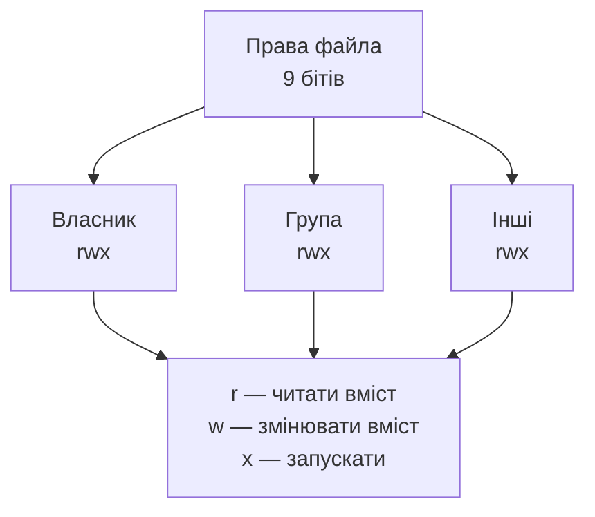
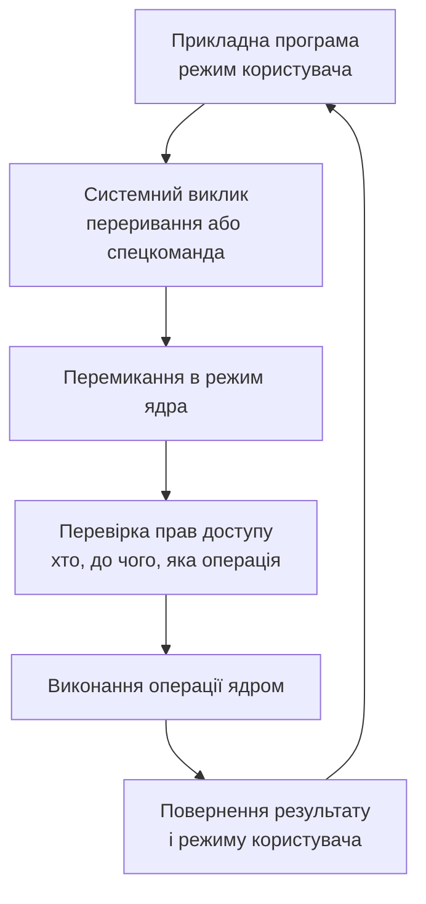

# Безпека та керування доступом

> [!abstract] Коротко
> Досі ми розглядали операційну систему як розподільника ресурсів: вона давала процесам час на процесорі, сторінки пам'яті, місце на диску. Сьогодні подивимося на ту саму систему з іншого боку — як на охоронця. Бо щойно в машині з'являється більше ніж один користувач і більше ніж одна програма, виникає питання: хто кому що дозволив. Ми з'ясуємо, чим автентифікація відрізняється від авторизації, як зберігаються паролі й чому вони зберігаються саме так, розберемо права доступу в Linux до останнього біта та списки контролю доступу у Windows, зрозуміємо, навіщо потрібні режими роботи процесора й чому системний виклик коштує дорого. Наприкінці поговоримо про підвищення привілеїв — і про те, чому `sudo` є одночасно найзручнішим і найнебезпечнішим інструментом у системі.

## Навчальні цілі заняття

- **Знати:** різницю між автентифікацією, авторизацією та обліком; способи зберігання паролів і призначення «солі»; модель прав доступу POSIX і значення кожного біта; призначення бітів `setuid`, `setgid` і `sticky`; поняття списку контролю доступу; дискреційну, мандатну та рольову моделі розмежування доступу; призначення режимів роботи процесора та механізму системних викликів; типові вектори підвищення привілеїв.
- **Вміти:** прочитати й пояснити виведення команди `ls -l`; обчислити числове подання прав і навпаки; призначити права так, щоб задовольнити вимогу задачі й не дати зайвого; пояснити, чому та сама дія дозволена одному користувачеві й заборонена іншому; знайти у системі файли з небезпечно встановленим бітом `setuid`.

## План лекції

1. Три питання охоронця: хто ти, що тобі можна, що ти зробив
2. Як система впізнає користувача
3. Чому паролі не зберігають
4. Суб'єкти, об'єкти та ідентифікатори
5. Права доступу в Linux: дев'ять бітів, які вирішують усе
6. Три особливі біти: setuid, setgid і sticky
7. Коли дев'яти бітів замало: списки контролю доступу
8. Три моделі розмежування доступу
9. Режими роботи процесора: чому ядро недосяжне
10. Підвищення привілеїв: коли охоронець пропускає зайвого
11. Подивимося на це своїми очима

## 1. Три питання охоронця: хто ти, що тобі можна, що ти зробив

Уявіть прохідну великого підприємства. Охоронець на вході розв'язує три різні задачі, і плутати їх не варто. Перша: встановити, хто перед ним — перевірити перепустку, звірити фотографію. Друга: з'ясувати, куди цій людині можна — у цех можна, у бухгалтерію ні. Третя: записати в журнал, хто й коли пройшов, щоб потім можна було розібратися.

Операційна система робить те саме й тими самими трьома кроками.

> [!definition] Визначення
> **Автентифікація** — перевірка того, що користувач є тим, за кого себе видає. **Авторизація** — перевірка того, чи має вже впізнаний користувач право виконати конкретну дію над конкретним об'єктом. **Облік** (аудит) — реєстрація виконаних дій для подальшого аналізу.

Ці три поняття часто змішують, особливо перші два, і це джерело дуже поширеної плутанини. Автентифікація відбувається один раз — під час входу в систему. Авторизація відбувається **щоразу**, коли процес звертається до файлу, пристрою чи іншого процесу: ядро щоразу заново перевіряє, чи дозволено цю конкретну дію. Тобто вхід у систему не дає жодних прав сам собою — він лише встановлює особу, від імені якої далі перевірятимуть права.

Побутова аналогія, яка добре лягає: автентифікація — це показати паспорт на вході в готель, авторизація — це те, що ваша картка-ключ відчиняє лише ваш номер і не відчиняє сусідній. Паспорт ви показуєте один раз, а картку прикладаєте до кожних дверей.

> [!warning] Типова помилка
> Вважати, що «увійшов як адміністратор» означає «усе дозволено». Навіть у сеансі адміністратора кожна операція проходить перевірку прав: просто для цього облікового запису перевірка майже завжди завершується дозволом. Але правила перевірки ті самі, і саме тому адміністратор теж може отримати відмову — наприклад, коли файлова система змонтована лише для читання або коли діє мандатна політика, про яку ми говоритимемо в розділі 8.

## 2. Як система впізнає користувача

Способи автентифікації прийнято ділити на три групи за тим, **що саме** ви пред'являєте системі.

**Те, що ви знаєте** — пароль, PIN-код, відповідь на контрольне запитання. Найдешевший і найпоширеніший спосіб, і водночас найслабший: знання можна підгледіти, підслухати, вгадати або видурити.

**Те, що ви маєте** — апаратний ключ, смарт-картка, телефон, на який приходить одноразовий код. Украсти складніше, але можливо; до того ж предмет можна просто загубити.

**Те, чим ви є** — відбиток пальця, малюнок обличчя, райдужна оболонка. Зручно, нічого не треба пам'ятати чи носити, але є неприємна властивість: біометричні дані **не можна змінити**. Пароль, що витік, ви заміните за хвилину; палець, чий відбиток потрапив у чужу базу, не заміните ніколи.

Саме тому в серйозних системах застосовують **багатофакторну автентифікацію** — коли перевіряють щонайменше два фактори з різних груп. Пароль плюс код із телефона — це два фактори; пароль плюс контрольне запитання — усе ще один фактор, бо обидва належать до групи «те, що ви знаєте».

> [!example] Приклад
> У Linux за автентифікацію відповідає підсистема PAM (Pluggable Authentication Modules). Її ідея елегантна: замість того щоб кожна програма — `login`, `sshd`, `sudo`, графічний менеджер сеансів — реалізовувала перевірку паролів самостійно, вони всі звертаються до спільного набору модулів. Адміністратор описує у файлах `/etc/pam.d/` ланцюжок перевірок: спершу пароль, потім одноразовий код, потім перевірка, чи не заблокований обліковий запис. Додати новий спосіб входу означає підключити модуль, а не переписувати десяток програм.

## 3. Чому паролі не зберігають

Це місце, де інтуїція початківця найчастіше підводить. Здавалося б, щоб перевірити пароль, система має його знати. Насправді — ні, і саме в цьому суть.

Якби система зберігала паролі у відкритому вигляді, то будь-хто, хто дістався до файлу з ними — зловмисник, який проник у систему, недбалий адміністратор, викрадач резервної копії, — одразу отримав би всі паролі всіх користувачів. А оскільки люди повторюють паролі в різних сервісах, витік з однієї системи відкрив би й пошту, і банк.

Тому зберігають не пароль, а результат його **необоротного перетворення**.

> [!definition] Визначення
> **Криптографічна геш-функція** — функція, що перетворює вхідні дані довільної довжини на рядок фіксованої довжини так, що за результатом практично неможливо відновити вхідні дані, а зміна навіть одного символу входу цілковито змінює результат.

Перевірка пароля відбувається так: користувач вводить пароль, система обчислює його геш і порівнює з тим, що збережено. Збіглося — пароль правильний. При цьому сама система в жодний момент не має збереженого пароля у відкритому вигляді.

Але простого гешування замало, і ось чому. Якщо два користувачі обрали однаковий пароль, їхні геші теж будуть однакові — і це видно з файлу. Гірше того, зловмисник може заздалегідь обчислити геші мільйонів найпоширеніших паролів і просто шукати збіги в таблиці. Такі заздалегідь підготовлені таблиці називають райдужними.

Захист від цього — **сіль**: випадковий рядок, унікальний для кожного користувача, який додають до пароля перед гешуванням і зберігають поруч із результатом. Тепер однакові паролі дають різні геші, а готова таблиця стає марною: її довелося б будувати заново для кожної солі окремо.

Є ще одна тонкість. Звичайні геш-функції спроєктовані **швидкими** — це добре для перевірки цілісності файлів і погано для паролів, бо швидкість допомагає й тому, хто перебирає варіанти. Тому для паролів застосовують спеціальні **повільні** функції — bcrypt, scrypt, Argon2, — які навмисно витрачають помітний час і пам'ять. Для чесного користувача затримка у сотню мілісекунд непомітна; для перебирача вона означає падіння швидкості перебору в мільйони разів.

| Властивість | Звичайний геш (SHA-256) | Функція для паролів (Argon2) |
|---|---|---|
| Призначення | контроль цілісності | зберігання паролів |
| Швидкість | максимально висока | навмисно низька |
| Витрати пам'яті | мізерні | великі, регульовані |
| Сіль | не передбачена | обов'язкова |
| Придатність для паролів | погана | висока |

> [!info] Для допитливих
> У Linux геші паролів лежать у файлі `/etc/shadow`, доступному лише привілейованому користувачеві, тоді як загальнодоступний `/etc/passwd` містить тільки відомості про обліковий запис. Такий поділ з'явився не одразу: у ранніх версіях Unix геші лежали просто в `/etc/passwd`, який мусив бути доступним для читання всім, бо звідти програми брали імена користувачів. Коли швидкість комп'ютерів зросла настільки, що перебір став реальним, геші винесли в окремий файл. Рядок у `/etc/shadow` має вигляд `$6$сіль$геш`, де число після першого долара позначає алгоритм.

## 4. Суб'єкти, об'єкти та ідентифікатори

Щоб правила доступу можна було записати, потрібні три поняття.

**Суб'єкт** — той, хто діє. Насправді діє не людина, а процес, запущений від її імені, тому суб'єктом для ядра є саме процес. **Об'єкт** — те, над чим діють: файл, каталог, пристрій, сокет, інший процес. **Операція** — що саме роблять: читання, запис, виконання, вилучення.

Ядро не оперує іменами користувачів — воно оперує числами.

> [!definition] Визначення
> **UID** (user identifier) — числовий ідентифікатор користувача, **GID** (group identifier) — числовий ідентифікатор групи. Ім'я користувача існує лише для зручності людини; усі перевірки прав ядро виконує за числами.

Кожен процес несе набір ідентифікаторів, і їх більше, ніж здається. Є **реальний** UID — той, хто запустив процес. Є **ефективний** UID — той, від імені кого перевіряються права **зараз**. У звичайній ситуації вони збігаються, але саме їхнє розходження робить можливими механізми, про які йтиметься в розділі 6.

Користувач може належати до кількох груп одночасно: одна основна і скільки завгодно додаткових. Це зручний спосіб керувати доступом: замість того щоб перелічувати двадцять прізвищ, створюють групу `developers` і дають права їй.

```
$ id
uid=1000(oleh) gid=1000(oleh) groups=1000(oleh),27(sudo),44(video),136(docker)
```

Зверніть увагу на останню групу в цьому прикладі — `docker`. Ми повернемося до неї в розділі 10, бо вона є класичним прикладом того, як нешкідлива на вигляд група насправді дорівнює правам адміністратора.

## 5. Права доступу в Linux: дев'ять бітів, які вирішують усе

Класична модель прав доступу Unix дивовижно проста — і саме тому прожила п'ятдесят років майже без змін. Для кожного файла зберігаються три групи по три біти.

Три категорії суб'єктів: **власник** файла, **група** файла, **усі інші**. Три операції: **читання** (r), **запис** (w), **виконання** (x). Разом дев'ять бітів.



Виведення команди `ls -l` читається зліва направо:

```
-rwxr-x---  1 oleh developers  8400  15 вер 10:22  deploy.sh
```

Перший символ — тип об'єкта: `-` звичайний файл, `d` каталог, `l` символьне посилання. Далі три трійки: власник `oleh` має `rwx` (читати, писати, виконувати), група `developers` має `r-x` (читати й виконувати, але не змінювати), решта — `---`, тобто нічого.

Права зручно записувати числом у вісімковій системі, де кожна трійка бітів стає однією цифрою: r = 4, w = 2, x = 1.

| Запис | Двійково | Вісімково | Зміст |
|---|---|---|---|
| `rwx` | 111 | 7 | усе дозволено |
| `rw-` | 110 | 6 | читання й запис |
| `r-x` | 101 | 5 | читання й виконання |
| `r--` | 100 | 4 | лише читання |
| `---` | 000 | 0 | нічого |

Отже, `rwxr-x---` — це 750, а найпоширеніше для звичайних файлів `rw-r--r--` — це 644.

Тепер найважливіше й найменш очевидне: **для каталогів ті самі три біти означають зовсім інше**.

| Біт | Для файла | Для каталогу |
|---|---|---|
| r | читати вміст файла | отримати перелік імен у каталозі |
| w | змінювати вміст файла | створювати, перейменовувати та вилучати записи в каталозі |
| x | запускати як програму | заходити в каталог, звертатися до файлів усередині за іменем |

> [!warning] Типова помилка
> З цієї таблиці випливає наслідок, який щороку дивує студентів: **право вилучити файл визначається правами каталогу, а не самого файла**. Ви можете мати файл, доступний лише для читання й належний адміністраторові, і спокійно його вилучити — якщо маєте право запису в каталог, де він лежить. Бо вилучення файла — це не дія над файлом, а зміна запису в каталозі.
>
> Другий наслідок: каталог з правами `r--` дає змогу побачити імена файлів, але не прочитати жоден із них; каталог з правами `--x` дає змогу відкрити файл, якщо ви точно знаєте його ім'я, але не дозволяє переглянути перелік. Останнє інколи використовують навмисно — для каталогів, вміст яких не має бути видно стороннім.

Змінюють права командою `chmod`, власника — `chown`. Права можна задавати числом (`chmod 750 deploy.sh`) або символьно (`chmod g+w file`, `chmod o-rwx file`).

Окремо варто знати про **umask** — маску, що визначає, які біти будуть **зняті** з новостворених файлів. Типове значення 022 означає, що файли створюються з правами 644, а каталоги з 755: групі та іншим запис не дістається. Маска не змінює вже наявні файли, вона впливає лише на момент створення.

## 6. Три особливі біти: setuid, setgid і sticky

До дев'яти бітів додаються ще три, і кожен існує заради розв'язання цілком конкретної задачі.

**Біт setuid** каже: запустити цю програму слід не з правами того, хто її запускає, а з правами **власника файла**. Навіщо це потрібно, найкраще видно на класичному прикладі — команді `passwd`. Звичайний користувач має право змінити власний пароль. Але пароль зберігається в `/etc/shadow`, доступ до якого має лише привілейований користувач. Виходить суперечність: користувач мусить змінити файл, писати в який йому не можна. Розв'язок — програма `passwd` належить `root` і має біт setuid, тому під час її роботи ефективний UID процесу стає нульовим, і запис у файл дозволено. При цьому сама програма написана так, щоб дозволити зміну лише власного пароля.

```
-rwsr-xr-x 1 root root 68208  passwd
   ↑
   s замість x — увімкнено setuid
```

**Біт setgid** робить те саме для групи. На каталогах він має іншу, дуже корисну дію: усі файли, створені всередині такого каталогу, автоматично дістають групу каталогу, а не основну групу автора. Саме так організовують спільні теки відділу, де всі учасники мають бачити файли одне одного.

**Біт sticky** на каталозі означає: вилучити або перейменувати файл може лише його власник, навіть якщо право запису в каталог мають усі. Класичний приклад — `/tmp`, куди пишуть усі програми всіх користувачів. Без цього біта будь-хто міг би вилучити чужі тимчасові файли.

```
drwxrwxrwt 18 root root 4096  /tmp
         ↑
         t — увімкнено sticky
```

> [!exam] На іспиті
> Питання «навіщо потрібен setuid і чим він небезпечний» ставлять майже завжди. Відповідь складається з двох частин. Навіщо: щоб надати непривілейованому користувачеві можливість виконати строго обмежену привілейовану дію. Чим небезпечний: будь-яка помилка в такій програмі перетворюється на повноцінне підвищення привілеїв, бо код уже виконується з правами власника. Тому програм із setuid у системі має бути якомога менше, і кожна має бути дуже ретельно перевірена.

## 7. Коли дев'яти бітів замало: списки контролю доступу

Класична модель має очевидне обмеження. Вона дозволяє описати права рівно для трьох категорій: власника, однієї групи та всіх інших. А що робити, коли до файла потрібен доступ для читання групі `auditors`, доступ для запису групі `developers`, повний доступ конкретному користувачеві `mariia` — і жодного доступу всім іншим? Трьох категорій не вистачає.

> [!definition] Визначення
> **Список контролю доступу** (ACL, access control list) — перелік правил, приписаних до об'єкта, кожне з яких задає права конкретного користувача або конкретної групи.

У Linux списки контролю доступу є розширенням класичної моделі: вони не замінюють дев'ять бітів, а доповнюють їх. Наявність розширеного списку позначається знаком `+` наприкінці рядка прав у виведенні `ls -l`. Керують ними командами `getfacl` і `setfacl`.

У Windows модель від початку побудована на списках контролю доступу, і вона докладніша: права там не зводяться до трьох операцій, а перелічують понад десяток окремих дозволів — читання даних, читання атрибутів, запис даних, дописування, вилучення, зміна дозволів, зміна власника. Кожен запис списку може бути як дозвільним, так і заборонним, причому заборонні записи перевіряються першими й мають перевагу.

| Критерій | Модель POSIX (9 бітів) | Списки контролю доступу |
|---|---|---|
| Кількість суб'єктів | три категорії | довільна |
| Складність налаштування | мінімальна | помітно вища |
| Наочність | висока | потребує окремої команди |
| Типове застосування | більшість файлів системи | спільні ресурси зі складними правилами |

Практичне правило звучить так: користуйтеся класичною моделлю скрізь, де вона достатня, і вмикайте списки контролю доступу лише там, де без них не обійтися. Складні правила, розкидані по файловій системі, дуже важко перевіряти й супроводжувати.

## 8. Три моделі розмежування доступу

Усе, про що ми говорили досі, належить до однієї моделі з трьох можливих. Ці три моделі варто розрізняти.

**Дискреційна модель.** Права на об'єкт визначає його **власник**: він вирішує, кому дати доступ. Саме так працюють і права Unix, і списки контролю доступу Windows. Модель гнучка й зрозуміла, але має принципову ваду: користувач може помилитися або зловживати — зробити таємний файл доступним усім, і система цьому не завадить.

**Мандатна модель.** Правила задає **система**, а не власник, і обійти їх не може ніхто, включно з власником файла й адміністратором. Об'єктам і суб'єктам призначають мітки (наприклад, рівні таємності), а політика описує, які потоки інформації дозволені. Класичне правило: не можна читати вище свого рівня й не можна записувати нижче свого рівня — щоб таємні дані не витекли до несекретного файла. У Linux мандатну модель реалізують SELinux і AppArmor: навіть якщо процес вебсервера виконується з правами `root` і зламаний, політика не дасть йому прочитати каталоги користувачів, бо це не передбачено його профілем.

**Рольова модель.** Права надають не людям безпосередньо, а **ролям**, а людей призначають на ролі. Це різко спрощує адміністрування у великих організаціях: коли працівник переходить з відділу у відділ, змінюють одну роль, а не сорок окремих дозволів.

> [!example] Приклад
> Ці моделі не виключають одна одну, а нашаровуються. На типовому сервері з Linux одночасно працюють усі три: класичні права визначають базовий доступ (дискреційна), SELinux обмежує служби незалежно від прав (мандатна), а адміністратори дістають повноваження через членство в групах на зразок `sudo`, `docker`, `wheel` (рольова за суттю). Запит буде виконано лише тоді, коли його дозволять **усі** рівні.

## 9. Режими роботи процесора: чому ядро недосяжне

Усі правила з попередніх розділів були б порожнім звуком, якби програма могла просто взяти й записати щось у `/etc/shadow` в обхід ядра. Те, що вона цього не може, забезпечується не програмно, а **апаратно**.

Процесор має щонайменше два режими роботи. У **режимі ядра** дозволені всі команди: звертання до будь-якої адреси фізичної пам'яті, робота з портами введення-виведення, зміна таблиць сторінок, керування перериваннями. У **режимі користувача** ці команди заборонені — спроба їх виконати спричиняє апаратне виключення, і керування отримує ядро.

Прикладні програми завжди виконуються в режимі користувача. Коли програмі потрібна дія, на яку вона не має права — відкрити файл, надіслати дані в мережу, створити процес, — вона не робить її сама, а **просить ядро**. Це і є системний виклик.



Саме в кроці перевірки прав і живе вся сьогоднішня лекція: ядро порівнює ефективний UID процесу з власником об'єкта, дивиться на біти прав, на списки контролю доступу, на мандатну політику — і лише після цього виконує або відмовляє.

Ця схема пояснює й те, чому системний виклик коштує помітно дорожче за звичайний виклик функції: потрібне перемикання режиму процесора, збереження стану, перевірки. Тому програми, що роблять мільйони дрібних системних викликів, працюють повільно, а бібліотеки навмисне накопичують дані в буфері й звертаються до ядра рідше, але більшими порціями. Ми вже бачили цей самий принцип у [[courses/operating-systems/lectures/09-vvedennia-vyvedennia-ta-draivery|Лекція 9. Введення-виведення та драйвери]].

## 10. Підвищення привілеїв: коли охоронець пропускає зайвого

> [!definition] Визначення
> **Підвищення привілеїв** — отримання суб'єктом прав, які йому не належать. Вертикальне — коли звичайний користувач дістає права адміністратора; горизонтальне — коли один користувач дістає доступ до даних іншого рівноправного користувача.

Легальний шлях підвищення привілеїв існує й називається `sudo`. Він влаштований розумніше, ніж просто «увійти адміністратором»: правила у файлі `/etc/sudoers` дозволяють дозволити конкретному користувачеві конкретні команди, кожне виконання записується в журнал, і сеанс не триває довше за потрібне. Це набагато краще, ніж роздавати пароль адміністратора.

А ось типові шляхи **нелегального** підвищення, кожен з яких випливає з матеріалу цієї лекції.

**Помилка в програмі з setuid.** Програма виконується з правами власника; якщо в ній є вразливість, зловмисник виконує свій код із цими правами. Тому перше, що робить аудитор на незнайомій системі, — шукає всі файли з цим бітом.

**Занадто щедрі права на важливий файл.** Класика — файл сценарію, який щохвилини запускає планувальник від імені адміністратора, але право запису в нього має звичайна група. Дописати рядок у такий сценарій — і привілеї отримано.

**Небезпечне членство в групі.** Той самий `docker` із розділу 4: користувач цієї групи може запустити контейнер, змонтувавши в нього кореневу файлову систему хоста, і дістати повний доступ. Формально він не адміністратор, фактично — так.

**Уразливість у самому ядрі.** Найнеприємніший випадок: помилка в обробнику системного виклику дозволяє виконати код у режимі ядра, і жодні права вже не мають значення.

Звідси випливає принцип, який варто запам'ятати як головний висновок лекції.

> [!definition] Визначення
> **Принцип найменших привілеїв** — кожен суб'єкт має отримувати рівно ті права, які потрібні йому для виконання роботи, і не більше, і рівно на той час, доки вони потрібні.

Він звучить очевидно, а порушується постійно: служби запускають від імені адміністратора «щоб не морочитися», теки відкривають правами 777 «бо інакше не працює», користувачів додають у привілейовані групи «на всяк випадок». Кожен такий крок здається дрібницею й кожен прибирає один рівень захисту.

## 11. Подивимося на це своїми очима

Усі наведені команди безпечні для виконання й нічого не змінюють, окрім останнього прикладу.

```
id                      # хто я: UID, GID, усі групи
ls -l /etc/shadow       # права на файл із гешами паролів
stat deploy.sh          # докладні відомості про файл, зокрема права числом
umask                   # поточна маска створення файлів
getfacl ~/Документи     # розширений список контролю доступу, якщо він є
sudo -l                 # які саме команди мені дозволено через sudo
find /usr/bin -perm -4000 -type f    # усі програми з бітом setuid
```

Остання команда особливо показова: запустіть її й перегляньте перелік. Кожен файл у ньому — програма, що виконується з правами адміністратора незалежно від того, хто її запустив. На типовій системі таких буде близько двох десятків, і всі вони — `passwd`, `sudo`, `mount`, `ping` — мають цілком конкретну причину там бути. Якщо в цьому переліку з'явиться щось незнайоме, це привід для тривоги.

Для експерименту зі зміною прав створіть окремий файл і подивіться, як змінюється виведення `ls -l` після `chmod 600`, `chmod 644`, `chmod 755`. Потім спробуйте прочитати файл із правами 600 від імені іншого користувача — і побачите ту саму відмову, про механізм якої ми говорили в розділі 9.

> [!question] Перевірте себе
> 1. Чим автентифікація відрізняється від авторизації? Скільки разів за сеанс відбувається кожна з них?
> 2. Назвіть три групи факторів автентифікації та наведіть приклад кожної. Чому пароль і контрольне запитання — це один фактор, а не два?
> 3. Чому паролі зберігають у вигляді гешу? Що станеться, якщо не додати «сіль»?
> 4. Чому для паролів застосовують навмисно повільні функції, а не SHA-256?
> 5. Що означає кожен із дев'яти бітів прав для звичайного файла? А для каталогу?
> 6. Запишіть числом права `rwxr-x---` і `rw-rw-r--`. Що означає 755?
> 7. Чому право вилучити файл визначається правами каталогу, а не файла?
> 8. Навіщо потрібен біт setuid і чим він небезпечний? Наведіть приклад програми, яка його має.
> 9. Що робить біт sticky і чому він потрібен каталогу `/tmp`?
> 10. Коли дев'яти бітів недостатньо і що застосовують натомість?
> 11. Чим дискреційна модель відрізняється від мандатної? Яку з них не може обійти власник файла?
> 12. Навіщо потрібні два режими роботи процесора і чому системний виклик коштує дорого?
> 13. Сформулюйте принцип найменших привілеїв і наведіть два приклади його порушення.
> 14. Чому членство в групі `docker` фактично дорівнює правам адміністратора?

## Назад

← [[courses/operating-systems/lectures/09-vvedennia-vyvedennia-ta-draivery|Лекція 9. Введення-виведення та драйвери]]

## Далі

→ [[courses/operating-systems/lectures/11-virtualizatsiia-ta-konteinery|Лекція 11. Віртуалізація та контейнери]]

## Література

**Базова (українською):**

1. Авраменко В. С., Авраменко А. С. *Основи операційних систем: навчальний посібник.* — Черкаси: ЧНУ імені Богдана Хмельницького, 2018. — розділ про захист інформації в операційних системах.
2. Федотова-Півень І. М., Миронець І. В., Півень О. Б. та ін. *Операційні системи: навчальний посібник.* — Черкаси: ТОВ «ДІСА ПЛЮС», 2019. — розділ про керування доступом.

**Допоміжна (англійською):**

3. Tanenbaum A. S., Bos H. *Modern Operating Systems.* 5th ed. — Pearson, 2022. — розділ 9 «Security» повністю відповідає темі лекції.
4. Silberschatz A., Galvin P. B., Gagne G. *Operating System Concepts.* 10th ed. — Wiley, 2018. — розділи 16 «Security» та 17 «Protection».
5. Arpaci-Dusseau R. H., Arpaci-Dusseau A. C. *Operating Systems: Three Easy Pieces.* — розділ про механізми захисту. URL: https://pages.cs.wisc.edu/~remzi/OSTEP/

**Інструменти та ресурси:**

6. `man 1 chmod`, `man 1 chown`, `man 2 setuid`, `man 5 sudoers`, `man 1 getfacl` — довідка щодо всіх команд із розділу 11.
7. Linux kernel documentation. Credentials in Linux. URL: https://docs.kernel.org/security/credentials.html — як ядро зберігає й перевіряє ідентифікатори процесу.
8. OWASP. Password Storage Cheat Sheet. URL: https://cheatsheetseries.owasp.org/cheatsheets/Password_Storage_Cheat_Sheet.html — актуальні рекомендації щодо алгоритмів і параметрів зберігання паролів.

> [!info] Де взяти
> Українські посібники лежать у `Матеріали/`. Розділ «Security» у Таненбаума — найкращий послідовний виклад теми українською чи англійською з наявних; читати варто разом із розділом про захист у Сільбершаца, бо там докладніше розібрано матрицю доступу. Рекомендації OWASP оновлюються щороку, тому саме їх варто дивитися, коли постане практичне питання, який алгоритм обрати сьогодні.
