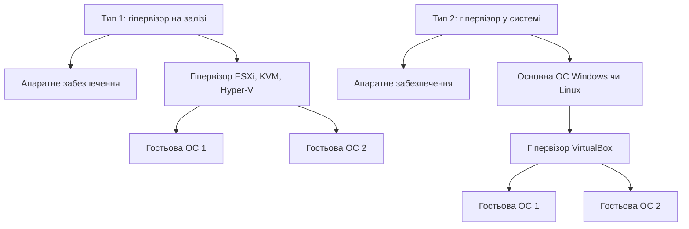
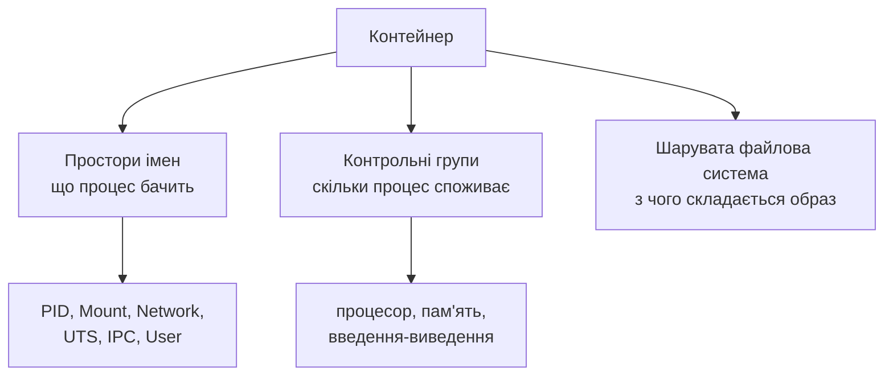

# Віртуалізація та контейнери

> [!abstract] Коротко
> Досі ми виходили з того, що на машині працює одна операційна система і вона розпоряджається всім залізом. Сьогодні розберемо, як на одному фізичному сервері вживаються десятки незалежних систем і сотні ізольованих застосунків. З'ясуємо, чим гіпервізор відрізняється від емулятора, чому контейнер стартує за мілісекунди, а віртуальна машина за хвилину, і на яких саме механізмах ядра — просторах імен та контрольних групах — тримається вся контейнеризація. Побачимо, що контейнер не є «легкою віртуальною машиною», і зрозуміємо, коли потрібне одне, а коли інше. Наприкінці поговоримо про те, чому ізоляція контейнера слабша, ніж здається, і що з цим роблять.

## Навчальні цілі заняття

- **Знати:** означення віртуалізації, гіпервізора та контейнера; різницю між гіпервізорами першого й другого типів; призначення апаратної підтримки віртуалізації; механізми ізоляції в ядрі Linux — простори імен і контрольні групи; склад образу контейнера; різницю між образом і контейнером; переваги й обмеження обох підходів.
- **Вміти:** пояснити, які ресурси розділяються між віртуальними машинами й між контейнерами; обґрунтовано обрати віртуалізацію або контейнеризацію під конкретну задачу; пояснити, чому контейнер не забезпечує такого рівня ізоляції, як віртуальна машина.

## План лекції

1. Навіщо взагалі ділити одну машину
2. Віртуалізація: ще один рівень абстракції
3. Два типи гіпервізорів
4. Чому віртуалізація довго була повільною
5. Контейнери: ізоляція без другої системи
6. Простори імен: як процес перестає бачити сусідів
7. Контрольні групи: як обмежити апетити
8. Образ, шар і контейнер
9. Порівняння: коли що обирати
10. Наскільки надійна ізоляція контейнера
11. Подивимося на це своїми очима

## 1. Навіщо взагалі ділити одну машину

Почнімо з практичної задачі. Підприємство має один потужний сервер і п'ять служб: вебсервер, база даних, поштова служба, система резервного копіювання, внутрішній портал. Найпростіше поставити все на одну операційну систему. Так робили десятиліттями, і в цього підходу три неприємні властивості.

Перша — **конфлікти залежностей**. Портал потребує однієї версії бібліотеки, база даних — іншої. Одночасно їх поставити не вийде.

Друга — **відсутність ізоляції відмов**. Помилка в одній службі, що з'їла всю пам'ять, зупиняє решту чотири. Злам однієї служби відкриває доступ до всіх.

Третя — **неможливість обліку**. Коли всі працюють в одній системі, не зрозуміло, хто саме споживає процесор і скільки ресурсів насправді потрібно кожній службі.

Очевидний розв'язок — поставити п'ять окремих серверів. Але тоді кожен із них більшу частину часу простоюватиме: типове завантаження фізичного сервера в такій схемі становило десять-п'ятнадцять відсотків. Платити за п'ять машин, щоб використовувати десяту частину кожної, — марнотратство.

Віртуалізація розв'язує цю суперечність: логічно машин п'ять, фізично — одна.

## 2. Віртуалізація: ще один рівень абстракції

> [!definition] Визначення
> **Віртуалізація** — технологія, що дозволяє створювати на одному фізичному обчислювальному ресурсі кілька логічних (віртуальних), кожен з яких для програмного забезпечення виглядає як окремий повноцінний ресурс.
>
> **Гіпервізор** (монітор віртуальних машин) — програмний рівень, що створює віртуальні машини, розподіляє між ними фізичні ресурси та ізолює їх одну від одної.

Ідея та сама, з якою ми вже мали справу двічі. У [[courses/operating-systems/lectures/07-virtualna-pamiat|Лекція 7. Віртуальна пам'ять]] ядро переконувало кожен процес, що той володіє суцільним адресним простором, якого насправді не існує. Тепер гіпервізор переконує кожну операційну систему, що та володіє цілим комп'ютером, якого теж не існує. Один і той самий прийом на двох різних рівнях.

Гостьова система при цьому не здогадується про підміну: вона бачить процесор, пам'ять, диск, мережеву карту — і працює звичайно. Усі звертання до «заліза» перехоплює гіпервізор і переадресовує до справжніх пристроїв, розділяючи їх між гостями.

> [!warning] Типова помилка
> Плутати віртуалізацію з емуляцією. **Емулятор** програмно відтворює архітектуру, відмінну від наявної: емулятор процесора ARM на машині з x86-64 розбирає кожну інструкцію й виконує еквівалентні дії. Це працює, але повільно — уповільнення в десятки разів. **Віртуалізація** ж виконує код гостя **безпосередньо на фізичному процесорі**, без перекладу, і перехоплює лише привілейовані операції. Тому втрати становлять одиниці відсотків, а не десятки разів. Головна умова: архітектура гостя має збігатися з архітектурою хоста.

## 3. Два типи гіпервізорів

Гіпервізори прийнято ділити на два типи за тим, на чому вони стоять.

**Перший тип** (апаратний, bare-metal) працює безпосередньо на залізі, без операційної системи під собою. Він сам і є мінімальною операційною системою, єдине завдання якої — керувати віртуальними машинами. Приклади: VMware ESXi, Microsoft Hyper-V, Xen, KVM у складі ядра Linux. Такі гіпервізори дають найвищу продуктивність і найкращу ізоляцію, тому саме вони стоять у центрах обробки даних і під хмарними платформами.

**Другий тип** (розміщений, hosted) працює як звичайний застосунок усередині звичайної операційної системи. Приклади: VirtualBox, VMware Workstation, QEMU без апаратного прискорення. Ставиться за хвилину, зручний для навчання, розробки й тестування, але кожне звертання гостя до заліза проходить через два рівні — гіпервізор і систему-господаря, — тому продуктивність нижча.



> [!info] Для допитливих
> KVM цікавий тим, що розмиває цю класифікацію. Формально це модуль ядра Linux, тобто гіпервізор має під собою повноцінну операційну систему — ознака другого типу. Але модуль перетворює саме ядро на гіпервізор першого типу, і продуктивність відповідна. Саме на KVM працює більшість хмарних платформ, зокрема значна частина інфраструктури Google Cloud і OpenStack.

## 4. Чому віртуалізація довго була повільною

Тут криється цікава історія, яка пояснює, чому технологію 1960-х років почали масово застосовувати лише у 2000-х.

Згадаймо [[courses/operating-systems/lectures/10-bezpeka-ta-keruvannia-dostupom|Лекція 10. Безпека та керування доступом]]: процесор має режим ядра й режим користувача, і привілейовані команди дозволені лише в першому. Тепер подумаймо, що відбувається у віртуальній машині. Гостьове ядро вважає, що працює в режимі ядра, і вільно виконує привілейовані команди. Але насправді воно виконується в режимі користувача, бо справжнім режимом ядра розпоряджається гіпервізор.

Правильна поведінка процесора тут — спричинити виключення на кожній привілейованій команді гостя, щоб гіпервізор її перехопив і обробив. Біда в тому, що архітектура x86 у класичному вигляді цього не забезпечувала: близько двох десятків команд у режимі користувача не спричиняли виключення, а **мовчки поводилися інакше**. Гостьове ядро отримувало неправильний результат і не знало про це.

Обійти проблему вдавалося двома способами, обидва дорогі. **Двійкове транслювання** означало, що гіпервізор на льоту переписував небезпечні ділянки гостьового коду — саме так працювали ранні версії VMware. **Паравіртуалізація** вимагала змінити гостьове ядро, щоб воно свідомо зверталося до гіпервізора замість виконання привілейованих команд — цей шлях обрав Xen, і він давав добру швидкість ціною того, що гостьову систему доводилося спеціально готувати.

Розв'язок прийшов з боку виробників процесорів: близько 2006 року з'явилися розширення Intel VT-x та AMD-V, які додали окремий режим для гостьового коду. Тепер привілейовані команди гостя коректно перехоплюються апаратно, гостьове ядро не потребує змін, а накладні витрати впали до кількох відсотків. Саме після цього віртуалізація стала повсюдною.

> [!exam] На іспиті
> Питання «чому віртуалізація на x86 довго була неефективною» перевіряє розуміння зв'язку між режимами процесора й ізоляцією. Коротка відповідь: частина привілейованих команд у режимі користувача не спричиняла виключення, тому гіпервізор не міг їх перехопити, і доводилося або переписувати код гостя на льоту, або змінювати гостьове ядро. Апаратні розширення VT-x і AMD-V прибрали цю потребу.

## 5. Контейнери: ізоляція без другої системи

Віртуальна машина розв'язує задачу ізоляції надійно, але дорого: кожна з них несе повноцінну операційну систему з власним ядром, службами, файловою системою. Десять віртуальних машин — це десять ядер у пам'яті, десять наборів системних процесів, десятки гігабайтів дискового простору. І запускається все це хвилину.

Але придивімося: якщо всі десять гостей — це той самий Linux, навіщо десять однакових ядер? Що, як лишити одне ядро, а ізолювати лише те, що вище?

> [!definition] Визначення
> **Контейнер** — ізольоване середовище виконання процесів, що використовує спільне з системою-господарем ядро, але має власне уявлення про файлову систему, мережу, перелік процесів та обмеження на ресурси.

Різниця принципова: **контейнер не містить операційної системи, він містить лише застосунок і його залежності**. Те, що в образі контейнера лежать файли з дистрибутива Ubuntu чи Alpine, не означає, що там є ядро Ubuntu — ядро використовується хостове, одне на всіх.

Наслідки цієї відмови від власного ядра:

| Показник | Віртуальна машина | Контейнер |
|---|---|---|
| Час запуску | десятки секунд — хвилини | мілісекунди — секунди |
| Розмір | гігабайти | десятки-сотні мегабайтів |
| Витрати пам'яті | ціла гостьова система | лише сам застосунок |
| Щільність на сервері | десятки | сотні й тисячі |
| Ядро | власне в кожної | спільне |
| Гостьова ОС | будь-яка | лише та, що працює на цьому ядрі |

Остання рядок — головне обмеження: на ядрі Linux не запустити контейнер із Windows, і навпаки. Коли Docker працює на Windows чи macOS, він насправді піднімає приховану віртуальну машину з Linux і запускає контейнери всередині неї.

## 6. Простори імен: як процес перестає бачити сусідів

Контейнеризація не є окремою технологією — це вдале поєднання кількох механізмів ядра Linux, кожен з яких існував задовго до появи Docker. Перший із них — простори імен.

> [!definition] Визначення
> **Простір імен** (namespace) — механізм ядра, що дає групі процесів власне, ізольоване уявлення про певний вид системних ресурсів.

Ідея зрозуміла на прикладі. Зазвичай усі процеси системи бачать спільний перелік процесів: запустіть `ps aux` — побачите все. Якщо ж помістити групу процесів в окремий простір імен процесів, вони бачитимуть лише одне одного, а перший із них отримає номер 1 і поводитиметься як ініціалізаційний процес. Із середини контейнера це виглядає як окрема машина, на якій більше нічого не запущено.

Ядро підтримує кілька видів просторів імен, і кожен ізолює свій ресурс:

- **PID** — перелік процесів і їх номери;
- **Mount** — набір змонтованих файлових систем, тобто власне дерево каталогів;
- **Network** — мережеві інтерфейси, адреси, таблиці маршрутизації, порти;
- **UTS** — ім'я вузла й доменне ім'я;
- **IPC** — засоби міжпроцесової взаємодії: черги повідомлень, спільна пам'ять;
- **User** — відображення ідентифікаторів користувачів, завдяки чому користувач з UID 0 усередині контейнера може бути звичайним непривілейованим користувачем ззовні;
- **Cgroup** — уявлення про власну ієрархію контрольних груп.

Важлива деталь: простори імен можна вмикати вибірково. Контейнер може мати власну мережу, але спільний із хостом перелік процесів — така конфігурація цілком законна й іноді потрібна для налагодження.

## 7. Контрольні групи: як обмежити апетити

Простори імен розв'язують задачу видимості, але не розв'язують задачі споживання. Процес, який не бачить сусідів, чудово може з'їсти всю пам'ять машини й покласти їх усіх. Для цього є другий механізм.

> [!definition] Визначення
> **Контрольні групи** (cgroups) — механізм ядра Linux для обліку та обмеження ресурсів, які споживає група процесів: процесорного часу, оперативної пам'яті, пропускної здатності введення-виведення й мережі.

Контрольні групи роблять три речі. **Обмежують**: цій групі не більше двох ядер і чотирьох гігабайтів. **Ураховують**: скільки процесорного часу група спожила за годину. **Ізолюють за пріоритетом**: за браку ресурсу поділити його у заданій пропорції.

Саме контрольні групи дозволяють хмарним платформам продавати ресурси частками й точно знати, скільки спожив кожен клієнт. І саме вони пояснюють поведінку, яка інколи спантеличує: процес усередині контейнера, що перевищив ліміт пам'яті, буде аварійно завершений ядром, хоча на самій машині пам'ять ще є.



Третій складник — шарувата файлова система, про яку далі.

## 8. Образ, шар і контейнер

Ці три поняття плутають постійно, тому розберемо їх окремо.

> [!definition] Визначення
> **Образ** — незмінний шаблон, що містить файлову систему застосунку та метадані запуску. **Контейнер** — запущений примірник образу з власним записуваним шаром поверх нього.

Співвідношення точно таке саме, як між програмою на диску й процесом у пам'яті, про що ми говорили в [[courses/operating-systems/lectures/02-protsesy-ta-potoky|Лекція 2. Процеси та потоки]]. Образ — це те, що лежить; контейнер — те, що виконується. З одного образу можна запустити сто контейнерів.

Образ складається з **шарів**, кожен з яких є набором змін відносно попереднього. Файл опису збірки перетворюється на шари: базовий шар дистрибутива, шар зі встановленими пакунками, шар із залежностями застосунку, шар із самим кодом. Шари незмінні та кешуються, тому дають дві дуже практичні переваги.

**Економія місця й трафіку.** Якщо двадцять образів побудовані на тому самому базовому шарі, він зберігається один раз.

**Швидкість перезбирання.** Якщо змінився лише код застосунку, перезбирається лише останній шар; решта береться з кешу. Саме тому в файлах збірки радять ставити встановлення залежностей **до** копіювання коду: залежності змінюються рідко, код — щохвилини.

Під час запуску контейнера поверх незмінних шарів додається тонкий записуваний шар. Усі зміни файлів усередині контейнера потрапляють саме туди і зникають разом із контейнером. Звідси правило, яке новачки засвоюють болісно: **дані, що мають пережити контейнер, не можна тримати всередині контейнера**. Для них підключають томи або каталоги хоста.

> [!warning] Типова помилка
> Ставитися до контейнера як до віртуальної машини: заходити всередину, щось налаштовувати вручну, лишати дані. Контейнери проєктовані як **одноразові**: правильний спосіб змінити щось — виправити файл збірки й побудувати новий образ, а не правити запущений примірник. Контейнер має бути таким, що його не шкода вбити будь-якої миті.

## 9. Порівняння: коли що обирати

Ці технології не конкурують, а доповнюють одна одну, і в реальній інфраструктурі зазвичай працюють разом: на фізичному сервері — гіпервізор, у віртуальних машинах — контейнери.

**Віртуальні машини обирають, коли** потрібні різні операційні системи на одному залізі; потрібна сувора ізоляція між різними замовниками; потрібно запустити систему зі старим ядром або власними модулями; є вимоги регуляторів щодо розмежування.

**Контейнери обирають, коли** потрібно швидко й щільно розгортати багато однотипних служб; важлива відтворюваність середовища між машиною розробника й сервером; застосунок часто оновлюється; потрібне автоматичне масштабування під навантаженням.

> [!example] Приклад
> Типова сучасна схема виглядає так. Хмарний провайдер тримає фізичні сервери під гіпервізором і продає віртуальні машини — це рівень ізоляції між клієнтами, і він має бути суворим. Клієнт отримує кілька віртуальних машин і розгортає на них кластер оркестрації контейнерів. Усередині кластера працюють сотні контейнерів із різними службами, які оркестратор сам розподіляє по машинах, перезапускає після збоїв і масштабує за навантаженням. Обидві технології тут на своєму місці: віртуалізація відповідає за безпеку між клієнтами, контейнеризація — за щільність і швидкість усередині одного клієнта.

## 10. Наскільки надійна ізоляція контейнера

Це питання варто поставити чесно, бо від відповіді залежать практичні рішення.

Віртуальна машина ізольована **апаратно**: гість не має доступу до пам'яті інших гостей, а межа проходить по гіпервізору — порівняно невеликому й ретельно перевіреному коду. Вихід за цю межу можливий, але є рідкісною й дорогою вразливістю.

Контейнер ізольований **програмно**, засобами того самого ядра, яке він поділяє з усіма сусідами. Це означає, що поверхня атаки — увесь інтерфейс системних викликів, а це сотні викликів і мільйони рядків коду. Помилка в будь-якому з них потенційно дозволяє вийти з контейнера на хост, а звідти — в інші контейнери.

Звідси практичні висновки:

- не запускати процеси в контейнері від імені привілейованого користувача без потреби;
- не давати контейнерам привілейованого режиму, у якому більшість обмежень знімається;
- обмежувати доступний набір системних викликів;
- не тримати в одному ядрі контейнери різних рівнів довіри — для цього беруть окремі віртуальні машини;
- пам'ятати те, про що ми говорили в [[courses/operating-systems/lectures/10-bezpeka-ta-keruvannia-dostupom|Лекція 10. Безпека та керування доступом]]: доступ до керування контейнерами фактично дорівнює правам адміністратора хоста.

> [!info] Для допитливих
> Проміжні рішення теж існують. Легкі віртуальні машини на кшталт Firecracker запускаються за сотні мілісекунд і дають апаратну ізоляцію майже з контейнерною швидкістю — саме на них працюють великі платформи безсерверних обчислень. Інший підхід — перехоплювати системні виклики контейнера у проміжному шарі, який сам реалізує більшу частину ядра в режимі користувача. Обидва напрями намагаються поєднати швидкість контейнерів із надійністю віртуальних машин.

## 11. Подивимося на це своїми очима

Перевірити, чи підтримує ваш процесор апаратну віртуалізацію, і подивитися на механізми ізоляції можна так:

```
lscpu | grep Virtualization      # чи є VT-x або AMD-V
lsmod | grep kvm                 # чи завантажено модулі KVM
ls -l /proc/self/ns/             # простори імен поточного процесу
systemd-cgls | head -30          # дерево контрольних груп
cat /sys/fs/cgroup/memory.max    # обмеження пам'яті поточної групи
```

Файли в `/proc/self/ns/` — символьні посилання з номерами: саме ці номери порівнює ядро, щоб зрозуміти, чи в одному просторі імен перебувають два процеси. Якщо запустити контейнер і порівняти ці номери зсередини й ззовні, різниця буде видно одразу.

Якщо на машині встановлено Docker або Podman, корисно порівняти виведення `ps aux` на хості й усередині контейнера: на хості процеси контейнера видно як звичайні процеси, усередині ж контейнера видно лише їх. Це найнаочніша демонстрація того, що контейнер — не окрема машина, а просто по-іншому показаний набір звичайних процесів того самого ядра.

> [!question] Перевірте себе
> 1. Чим віртуалізація відрізняється від емуляції? Чому емуляція повільна?
> 2. Чим гіпервізор першого типу відрізняється від другого? Наведіть приклади кожного.
> 3. Чому віртуалізація на x86 довго була неефективною і що це змінило?
> 4. Що саме контейнер поділяє з системою-господарем, а що має власне?
> 5. Чому на ядрі Linux не можна запустити контейнер із Windows?
> 6. Перелічіть щонайменше чотири види просторів імен і поясніть, що ізолює кожен.
> 7. Яку задачу розв'язують контрольні групи і чим вона відрізняється від задачі просторів імен?
> 8. Чим образ відрізняється від контейнера? З чим це можна порівняти?
> 9. Навіщо образ поділено на шари і чому залежності встановлюють до копіювання коду?
> 10. Чому дані не можна зберігати всередині контейнера?
> 11. Чому ізоляція контейнера слабша за ізоляцію віртуальної машини?
> 12. Наведіть приклад схеми, де віртуалізація й контейнеризація застосовані разом.

## Назад

← [[courses/operating-systems/lectures/10-bezpeka-ta-keruvannia-dostupom|Лекція 10. Безпека та керування доступом]]

## Далі

→ [[courses/operating-systems/lectures/12-suchasni-operatsiini-systemy|Лекція 12. Сучасні операційні системи]]

## Література

**Базова (українською):**

1. Мосіюк О. О., Федорчук А. Л. *Операційні системи та системне програмування: навчально-методичний посібник.* — Житомир: Вид-во ЖДУ ім. Івана Франка, 2022.
2. Федотова-Півень І. М., Миронець І. В., Півень О. Б. та ін. *Операційні системи: навчальний посібник.* — Черкаси: ТОВ «ДІСА ПЛЮС», 2019.

**Допоміжна (англійською):**

3. Tanenbaum A. S., Bos H. *Modern Operating Systems.* 5th ed. — Pearson, 2022. — розділ 7 «Virtualization and the Cloud».
4. Silberschatz A., Galvin P. B., Gagne G. *Operating System Concepts.* 10th ed. — Wiley, 2018. — розділ 18 «Virtual Machines».
5. Popek G. J., Goldberg R. P. *Formal Requirements for Virtualizable Third Generation Architectures.* — Communications of the ACM, 1974. Класична стаття, у якій сформульовано умови, що їх архітектура x86 довго не задовольняла.

**Інструменти та ресурси:**

6. `man 7 namespaces`, `man 7 cgroups`, `man 2 clone`, `man 2 unshare` — довідка щодо механізмів із розділів 6 і 7.
7. Linux kernel documentation. Control Groups v2. URL: https://docs.kernel.org/admin-guide/cgroup-v2.html
8. Документація Docker. URL: https://docs.docker.com/ — розділ про шари образів і томи.

> [!info] Де взяти
> Розділ «Virtualization and the Cloud» у Таненбаума — найкращий послідовний виклад теми; стаття Попека й Голдберга коротка й варта прочитання в оригіналі, бо саме вона пояснює, чому x86 не була віртуалізовною. Довідка `man 7 namespaces` містить перелік усіх просторів імен із поясненнями й прикладами.
