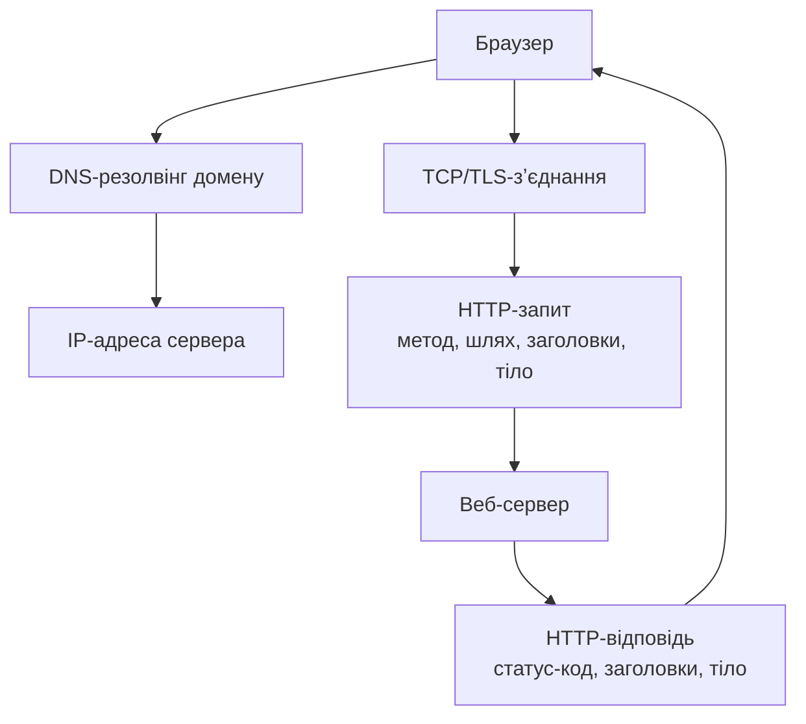
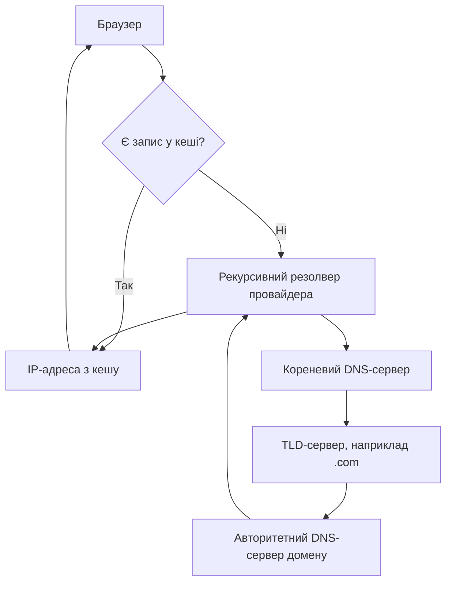

# Як працює веб, HTML та CSS

> [!abstract] Коротко
> Як браузер і сервер домовляються про обмін даними: [[courses/web-programming/glossary/http|HTTP]], HTTPS, покроковий [[courses/web-programming/glossary/dns|DNS]]-резолвінг та структура домену. Практична частина — будівельні блоки сторінки: семантичний HTML5, доступні форми, box model та сучасний CSS (каскад, Flexbox, Grid, позиціонування, адаптивність, змінні).

## Навчальні цілі

1. Пояснити, як запит від браузера доходить до сервера і повертається назад — від DNS до HTTP-відповіді, і що при цьому кешується.
2. Розрізняти HTTP-методи, категорії статус-кодів та типи DNS-записів.
3. Верстати сторінку семантичними тегами HTML5 з урахуванням доступності (a11y).
4. Пояснити, як браузер вирішує, який CSS-стиль застосувати до елемента, і використовувати box model, Flexbox, Grid та позиціонування для розташування елементів.
5. Верстати адаптивно — під різні розміри екрана, через CSS-змінні та відносні одиниці.

## План лекції

1. Клієнт-сервер, HTTP та HTTPS
2. DNS і домени: як працює резолвінг
3. Семантичний HTML5 та доступність
4. CSS: box model, каскад, Flexbox, Grid, позиціонування, адаптивність, змінні

## Клієнт-сервер та HTTP

Почнемо з питання, яке здається очевидним, доки не спробуєш пояснити його словами: що насправді відбувається в той момент, коли ви вводите адресу сайту в браузер і натискаєте Enter? Найпростіша аналогія, яка тут допомагає, — це похід у ресторан. Ви (браузер) сідаєте за столик і робите замовлення офіціанту (це і є HTTP-запит): «принесіть мені, будь ласка, головну сторінку сайту». Офіціант іде на кухню (сервер), кухня готує страву (обробляє запит, можливо, звертається до бази даних) і віддає її офіціанту, а той приносить готову страву назад до вашого столика (це HTTP-відповідь). У вас немає прямого доступу до кухні — ви спілкуєтесь із сервером виключно через цей заведений протокол запит-відповідь, і саме цей протокол називається HTTP.

Важлива деталь цієї аналогії, яка на перший погляд здається дивною, але насправді дуже практична: офіціант у цьому ресторані має амнезію. Кожне ваше замовлення він сприймає так, ніби бачить вас уперше в житті — навіть якщо секунду тому ви замовили щось інше. HTTP спроєктований саме так: він не зберігає стан (stateless) — кожен запит цілковито незалежний від попередніх, сервер за замовчуванням «не памʼятає» вас між запитами. Якщо вам потрібно, щоб сайт памʼятав, що ви залогінені, чи що у вас у кошику вже лежить три товари, — це доводиться організовувати окремо, поверх самого протоколу: класичний спосіб — видати вам своєрідну «перепустку» (кукі, токен), яку ваш браузер потім показуватиме при кожному наступному запиті, і сервер, побачивши цю перепустку, розумітиме, що це саме ви, а не хтось інший.

Тепер подивімось на весь цей процес як на послідовність кроків, від моменту, коли ви ввели адресу, до моменту, коли сторінка зʼявилась на екрані:



Перший крок — DNS-резолвінг, тобто перетворення домену (`example.com`) на конкретну IP-адресу сервера; про це детально поговоримо в наступному розділі. Далі браузер встановлює зʼєднання з сервером за цією адресою — якщо сайт працює через HTTPS, це зʼєднання одразу шифрується через TLS, про що теж скажемо трохи нижче. І лише після цього браузер нарешті надсилає сам HTTP-запит — «замовлення», якщо повертатись до нашої аналогії з рестораном, — а сервер повертає HTTP-відповідь.

> [!definition] [[courses/web-programming/glossary/http|HTTP]] та HTTPS
> HTTP (HyperText Transfer Protocol) — протокол передачі даних між клієнтом і сервером у форматі запит-відповідь. HTTPS — той самий HTTP, але поверх шифрованого зʼєднання TLS: усе, що передається між браузером і сервером, перетворюється на нечитабельний для стороннього спостерігача набір байтів, і жоден проміжний вузол мережі (провайдер, публічний Wi-Fi у кафе) не може прочитати чи непомітно підмінити ваші дані. Для HTTPS сервер має TLS-сертифікат — своєрідний офіційний документ, що підтверджує: «цей сервер справді той, за кого себе видає».

> [!info] Для допитливих — що відбувається під час TLS handshake
> Уявіть, що перед тим як почати конфіденційну розмову, двоє людей спершу домовляються про секретний код, яким шифруватимуть кожне наступне речення, — і роблять це так, щоб навіть якщо хтось підслуховує саму домовленість про код, розшифрувати подальшу розмову він не зможе. Приблизно так само працює TLS handshake: браузер і сервер спершу узгоджують версію протоколу шифрування, сервер показує свій сертифікат (браузер перевіряє його достовірність у незалежному центрі сертифікації, CA — це як перевірити печатку нотаріуса), і нарешті сторони обмінюються ключами для подальшого шифрування вже самої розмови. Усе це відбувається ще ДО того, як передається перший байт власне HTTP-даних, і додає невелику затримку при першому зʼєднанні із сервером — саме тому повторні відвідування сайту зазвичай трохи швидші за перше: частину цієї домовленості браузер може «запамʼятати».

### HTTP-методи

Продовжимо ресторанну аналогію ще трохи, бо вона напрочуд добре пояснює методи HTTP — фактично «типи замовлень», якими браузер може звернутись до сервера.

| Метод | Призначення |
|---|---|
| GET | Отримати ресурс, без побічних ефектів на сервері |
| POST | Створити ресурс або надіслати дані форми |
| PUT | Повністю замінити ресурс |
| PATCH | Частково оновити ресурс |
| DELETE | Видалити ресурс |
| HEAD | Як GET, але без тіла відповіді — перевірити існування ресурсу чи його заголовки |

`GET` — це найпростіший тип «замовлення»: ви просите щось показати, нічого при цьому не змінюючи на кухні («покажіть мені меню»). Саме тому браузер завжди використовує `GET`, коли ви просто відкриваєте сторінку за посиланням — і саме тому багаторазове відкриття однієї й тієї самої сторінки нічого «не ламає» й не створює побічних ефектів. `POST`, натомість, — це замовлення, яке ЩОСЬ змінює на кухні: ви передаєте нові дані, і сервер, отримавши їх, зазвичай щось із ними робить — наприклад, зберігає нового користувача в базі даних після заповнення форми реєстрації. `PUT` і `PATCH` схожі між собою, і різниця між ними часто плутає: `PUT` означає «замініть узагалі все замовлення повністю на нове», тоді як `PATCH` означає «змініть лише одну конкретну деталь у вже наявному замовленні, решту не чіпайте». `DELETE`, зрозуміло, прибирає щось із «меню» сервера. А `HEAD` — це своєрідне запитання офіціанту «а це блюдо взагалі є в наявності?» без того, щоб реально його готувати й приносити, — корисно, коли потрібно лише перевірити, чи існує ресурс, не завантажуючи весь його вміст.

### Категорії статус-кодів

Коли кухня (сервер) закінчує обробку замовлення, вона повертає не лише саму «страву», а й короткий трицифровий код, що описує, як усе пройшло. Ці коди згруповані за першою цифрою, і саме цю першу цифру варто запамʼятати найкраще — вона одразу говорить, у якому «настрої» повернулась відповідь, ще до того, як вникати в деталі.

| Діапазон | Категорія | Приклади |
|---|---|---|
| 1xx | Інформаційні | 100 Continue |
| 2xx | Успіх | 200 OK, 201 Created, 204 No Content |
| 3xx | Перенаправлення | 301 Moved Permanently, 304 Not Modified |
| 4xx | Помилка клієнта | 400 Bad Request, 401 Unauthorized, 404 Not Found |
| 5xx | Помилка сервера | 500 Internal Server Error, 503 Service Unavailable |

`2xx` — «усе пройшло добре, ось ваша страва» — це той результат, якого ви завжди прагнете побачити. `3xx` означає «те, що ви шукаєте, тепер в іншому місці» — офіціант каже: «цього столика більше немає, ваш новий столик он там» — і браузер сам, непомітно для вас, іде за новою адресою. `4xx` — це коди, які вказують, що ПРОБЛЕМА на боці клієнта: ви або неправильно сформували замовлення (`400`), або не показали перепустку, яка довела б, що вам можна це замовляти (`401`), або замовили страву, якої взагалі немає в меню (`404` — знайома всім «сторінка не знайдена»). А `5xx` — це вже провина кухні: щось зламалось на самому сервері, і клієнт тут узагалі ні до чого.

### Заголовки запиту та відповіді

Крім самого «тіла» замовлення чи відповіді, і запит, і відповідь несуть із собою набір службових позначок — заголовків (headers). Продовжуючи аналогію, це схоже на записку, прикріплену до замовлення: «алергія на горіхи», «без цибулі», «оплата карткою». Ось найпоширеніші з них:

| Заголовок | Де використовується | Призначення |
|---|---|---|
| `Content-Type` | запит і відповідь | MIME-тип тіла (`text/html`, `application/json`) |
| `User-Agent` | запит | Браузер і ОС клієнта |
| `Authorization` | запит | Токен або облікові дані для доступу |
| `Set-Cookie` | відповідь | Сервер записує кукі в браузер |
| `Cookie` | запит | Браузер повертає раніше збережені кукі |
| `Cache-Control` | відповідь (і запит) | Політика кешування ресурсу |
| `ETag` | відповідь | Хеш версії ресурсу для перевірки актуальності кешу |

`Content-Type` — це, по суті, попередження «у цій коробці лежить саме таке блюдо», щоб той, хто отримує відповідь, знав, як її «розпакувати»: як HTML-сторінку, як JSON-дані, як зображення. `Set-Cookie` і `Cookie` — це саме той механізм «перепустки», про який ми говорили раніше: сервер один раз видає перепустку (`Set-Cookie`), а браузер надалі автоматично прикладає її до кожного наступного запиту до цього самого сайту (`Cookie`), завдяки чому сервер «памʼятає» вас, попри те що сам протокол HTTP цього не вміє.

### Кешування

Тепер розберемо ще одну дуже практичну тему, повʼязану з заголовками, — кешування. Уявіть, що ви замовляєте той самий десерт у тому самому ресторані вдруге за один вечір. Було б безглуздо щоразу заново готувати його з нуля, якщо він і так уже стоїть готовий на кухні з першого разу, — розумніше просто винести той самий десерт, який уже приготували. HTTP-кешування працює за тим самим принципом: браузер зберігає копію вже завантаженого ресурсу (сторінки, зображення, файлу стилів) і, замість того щоб щоразу заново завантажувати той самий файл із сервера, за певних умов просто повторно використовує вже наявну копію — сторінка завантажується швидше, а сервер отримує менше навантаження.

- `Cache-Control: max-age=3600` — сервер каже: «цей десерт можна вважати свіжим протягом 3600 секунд, повторно запитувати мене про нього за цей час не треба».
- `Cache-Control: no-cache` — «зберігати копію можна, але перед тим як подати гостю повторно, обовʼязково перепитайте кухню, чи не змінилось щось».
- `Cache-Control: no-store` — «цей десерт настільки особливий (наприклад, банківські дані), що зберігати копію не можна взагалі, ніколи».
- `ETag` / `If-None-Match` — сервер прикріплює до відповіді своєрідний «номер партії» конкретної версії ресурсу. При повторному запиті браузер надсилає цей номер назад і питає: «партія з таким номером усе ще актуальна?». Якщо номер не змінився, сервер відповідає коротким `304 Not Modified` без пересилання всього вмісту заново — це набагато швидше, ніж передавати весь файл повторно, хоча він і так уже є в браузера.

> [!example] Приклад HTTP-запиту та відповіді
> ```
> GET /courses/web-development HTTP/1.1
> Host: example.com
> Accept: text/html
>
> HTTP/1.1 200 OK
> Content-Type: text/html; charset=utf-8
> Content-Length: 3421
> ```

> [!warning] Типова помилка
> Mixed content — коли сторінка, завантажена по захищеному HTTPS, намагається підвантажити якийсь ресурс (скрипт, зображення) по звичайному, незахищеному HTTP. Браузер сприймає це як пролом у безпеці: адже той єдиний незахищений ресурс теоретично можуть підмінити просто дорогою, звівши нанівець увесь сенс шифрування решти сторінки — тому браузер такі запити або повністю блокує, або хоча б голосно попереджає про небезпеку.

## DNS і домени

Повернімось до самого початку нашого маршруту — до кроку, який відбувається ще ДО того, як браузер узагалі зможе надіслати HTTP-запит комусь конкретному. Коли ви вводите `example.com`, браузер насправді не має жодного уявлення, ДЕ фізично в мережі знаходиться сервер із цим імʼям — компʼютери в інтернеті спілкуються між собою не через людські назви, а через числові IP-адреси. Тут допомагає ще одна життєва аналогія: уявіть, що ви памʼятаєте назву кав'ярні, куди хочете піти, — «Затишна кава» — але не памʼятаєте точної адреси. Ви дзвоните в довідкову службу, називаєте назву закладу, і вам диктують точну адресу з вулицею й номером будинку. Саме цю роль — перетворення «людської» назви на точну технічну «адресу» — виконує DNS.

> [!definition] [[courses/web-programming/glossary/dns|DNS]]
> Domain Name System — розподілена служба, що перетворює доменне імʼя (`example.com`) на IP-адресу сервера. Без DNS довелося б памʼятати числові адреси на кшталт `93.184.216.34` замість зручних для людини імен.

Домен, до речі, теж має внутрішню структуру, схожу на поштову адресу, де загальніше йде праворуч, а конкретніше — ліворуч: `www.example.com` — `www` (субдомен, конкретна «кімната») → `example` (домен другого рівня, «будинок») → `.com` (домен верхнього рівня, TLD, «місто»). Резолвінг DNS кешується на кількох рівнях одразу — браузером, операційною системою, проміжними серверами провайдера, — тому повторні звернення до вже відомого домену відбуваються значно швидше за перше: більшість «дзвінків у довідкову» просто не доводиться робити повторно.

А тепер розберемо покроково, ЩО саме відбувається під час одного такого «дзвінка в довідкову», коли адреса ще невідома і кеш порожній:



Якщо продовжити аналогію з довідковою службою: спочатку браузер запитує «рекурсивного резолвера» вашого провайдера — це немов оператор довідкової служби, який сам зобовʼязується знайти для вас потрібну адресу, навіть якщо для цього доведеться зробити кілька дзвінків іншим людям. Оператор спершу дзвонить у «головне довідкове бюро країни» — кореневий DNS-сервер, — і питає: «де мені шукати домени з закінченням `.com`?». Той відповідає адресою наступного, вужчого довідкового бюро — TLD-сервера, що знає вже саме про домени `.com`. Оператор дзвонить туди й запитує: «а хто відповідальний конкретно за `example.com`?» — і отримує адресу авторитетного DNS-сервера, який достеменно знає точну IP-адресу потрібного сайту, бо саме власник цього домену її там і вказав. Ланцюжок дзвінків завершується, оператор довідкової повертає вам фінальну відповідь, і — що важливо — запамʼятовує її на майбутнє (кешує), щоб наступного разу, коли хтось інший запитає той самий домен, не доводилось знову проходити весь цей ланцюжок дзвінків заново.

### Основні типи DNS-записів

Авторитетний сервер домену зберігає не одну адресу, а цілий набір записів різного призначення — так само як картка компанії в довідковому бюро може містити окремо номер телефону, окремо адресу офісу, окремо адресу для листування:

| Тип запису | Призначення |
|---|---|
| A | Домен → IPv4-адреса |
| AAAA | Домен → IPv6-адреса |
| CNAME | Псевдонім домену на інший домен |
| MX | Поштові сервери домену |
| TXT | Довільний текст (верифікація власності, SPF-записи) |

### TTL і поширення змін

> [!definition] TTL (Time To Live)
> Час у секундах, впродовж якого будь-який DNS-запис можна тримати в кеші, перш ніж перезапитати його заново в авторитетного сервера. Це схоже на термін придатності, надрукований на упаковці продукту: доки термін не сплив, довідкова служба (кеш) видає вам збережену відповідь одразу, не передзвонюючи нікому зайвий раз.

Малий TTL, наприклад `300` секунд (пʼять хвилин), означає, що будь-яка зміна цього запису розповсюдиться по всьому інтернету дуже швидко — усі проміжні кеші перепитають свіжі дані вже за кілька хвилин. Але за це доводиться платити більшою кількістю запитів до самого авторитетного DNS-сервера, адже кеш «протухає» часто. Великий TTL, наприклад `86400` секунд (цілу добу), навпаки — менше навантаження на DNS-сервер, зате якщо власник домену раптом вирішить перенести сайт на новий сервер зі зміненою IP-адресою, частина відвідувачів ще цілу добу зможе бачити стару версію, бо їхній локальний кеш ще «вірить» старій відповіді. Саме тому досвідчені адміністратори заздалегідь, за кілька днів до запланованого перенесення сайту, тимчасово зменшують TTL — щоб потім зміна розповсюдилась швидко.

### Реєстрація домену

Щоб домен узагалі запрацював і зʼявився в тій самій «загальній довідковій книзі» інтернету, у процесі задіяні три різні сторони, і їх варто чітко розрізняти:

- **Реєстрант** — власник домену, людина чи організація, яка фактично його орендує (домени саме орендують на певний термін, а не купують назавжди).
- **Реєстратор** (registrar) — комерційна компанія, через яку реєстрант купує й щорічно продовжує домен, — свого роду агентство нерухомості, через яке оформлюють оренду.
- **Реєстр** (registry) — організація, яка веде офіційну, «канонічну» базу даних усіх доменів конкретного TLD (наприклад, окрема організація відповідає за всі домени `.ua`, інша — за `.com`) — це вже сам державний реєстр нерухомості, а не агентство.

**WHOIS** — це публічний сервіс, який дозволяє будь-кому подивитись, хто зареєстрував конкретний домен, коли це сталось і на яких DNS-серверах він зараз розміщений, — приблизно як публічний реєстр прав власності на нерухомість, де можна перевірити, кому належить будівля.

> [!example] Діагностика DNS з термінала
> ```bash
> nslookup example.com
> dig example.com A
> ```
> Обидві команди роблять, по суті, той самий «дзвінок у довідкову», який ми щойно розібрали покроково, і повертають знайдену IP-адресу домену разом із сервером, що відповів на запит; `dig` дає детальніший вивід — зокрема TTL запису та авторитетний сервер, який видав фінальну відповідь.

> [!exam] На іспиті
> Питання про різницю між рекурсивним резолвером і авторитетним DNS-сервером — типове. Резолвер (оператор довідкової служби) шукає відповідь ВІД ІМЕНІ клієнта, роблячи за нього всю роботу з обдзвону; авторитетний сервер — це те єдине джерело істини для конкретного домену, куди зрештою доходить весь цей ланцюжок запитів.

## Семантичний HTML5 та доступність

Перейдемо тепер від того, як дані потрапляють до браузера, до того, як їх структурувати всередині самої сторінки. Уявіть, що ви переїжджаєте в нову квартиру і пакуєте речі в картонні коробки. Ви можете підписати кожну коробку чесно й конкретно — «кухонний посуд», «книги», «зимовий одяг» — і тоді будь-хто, навіть той, хто вас у перший раз бачить, розпакує коробки в потрібні кімнати миттєво. А можна підписати всі коробки однаково — просто «речі» — і тоді знайти потрібну книгу можна буде, лише розкривши буквально кожну коробку по черзі. Семантична HTML-розмітка — це саме перший, «чесний» варіант підпису: використання тегів, що самі по собі описують ЗМІСТ блоку (`<header>`, `<nav>`, `<main>`, `<article>`, `<footer>`), замість того, щоб позначати геть усе універсальним, «німим» тегом `<div>`.

> [!definition] Семантична розмітка
> Використання тегів, що описують зміст блоку, замість універсального `<div>` на все. Семантика допомагає скрінрідерам, пошуковим роботам і самим розробникам орієнтуватися в структурі сторінки без потреби «розпаковувати кожну коробку», щоб зрозуміти, що в ній.

Чому це особливо критично, а не просто «гарний тон» у коді? Уявіть людину з порушенням зору, яка користується сторінкою не очима, а спеціальною програмою — скрінрідером, що вголос озвучує вміст сторінки. Скрінрідер уміє миттєво «перестрибувати» одразу до основного контенту, оминаючи навігацію, — але лише якщо навігація дійсно позначена тегом `<nav>`, а основний контент — тегом `<main>`. Якщо вся сторінка складається із самих `<div>`, скрінрідер не має жодного способу здогадатись, де тут навігація, а де основний текст, — людині доведеться прослуховувати всю сторінку послідовно, рядок за рядком, як аудіокнигу без розділів.

### Основні семантичні теги

| Тег | Призначення |
|---|---|
| `header` | Шапка сторінки або секції |
| `nav` | Блок навігації |
| `main` | Основний унікальний контент сторінки (один на сторінку) |
| `article` | Самодостатній контент — стаття, пост, картка курсу |
| `section` | Тематичний розділ усередині сторінки чи статті |
| `aside` | Побічний контент — сайдбар, примітка |
| `footer` | Підвал сторінки або секції |
| `figure` / `figcaption` | Ілюстрація з підписом |

```html
<body>
  <header>
    <nav>
      <a href="/">Головна</a>
      <a href="/courses">Курси</a>
    </nav>
  </header>

  <main>
    <article>
      <h1>Заголовок статті</h1>
      <p>Текст...</p>
    </article>
    <aside>
      <p>Схожі матеріали</p>
    </aside>
  </main>

  <footer>
    <p>&copy; 2026</p>
  </footer>
</body>
```

Зверніть увагу на природну ієрархію в цьому прикладі: `header` містить `nav`, `main` містить одразу `article` й `aside` поруч, а `footer` завершує сторінку. Ця структура читається майже як звичайне речення людською мовою — «шапка з навігацією, потім основний вміст зі статтею й бічною панеллю, потім підвал» — і саме тому вона однаково зрозуміла і людині, яка читає код, і пошуковому роботу, і скрінрідеру.

Форми заслуговують на окрему увагу, бо саме тут доступність найчастіше «ламається» на практиці. Розгляньмо просту форму підписки:

> [!example] Доступна форма
> ```html
> <form novalidate>
>   <label for="email">Електронна пошта</label>
>   <input type="email" id="email" name="email" required>
>
>   <button type="submit">Підписатися</button>
> </form>
> ```
> Атрибут `for` у `<label>` звʼязує підпис з полем за `id` — це немов офіційна табличка з іменем на дверях кабінету: без неї скрінрідер не зможе оголосити користувачеві, ЩО саме потрібно ввести в це конкретне поле, він просто скаже «текстове поле» без жодного контексту. Атрибути `type="email"` і `required` вмикають вбудовану валідацію самого браузера без жодного рядка JavaScript — браузер сам перевірить формат і не дозволить відправити порожнє поле.

### Типи полів форми

| `type` | Призначення |
|---|---|
| `text` | Довільний однорядковий текст |
| `email` | Адреса пошти з базовою валідацією формату |
| `tel` | Телефон, на мобільних відкриває цифрову клавіатуру |
| `number` | Число, зі стрілками інкременту |
| `date` | Дата через нативний календар |
| `checkbox` | Позначка так/ні, кілька варіантів одночасно |
| `radio` | Один варіант із групи |
| `file` | Завантаження файлу |

### Атрибути валідації

| Атрибут | Ефект |
|---|---|
| `required` | Поле обовʼязкове для заповнення |
| `pattern` | Regex, якому має відповідати значення |
| `minlength` / `maxlength` | Мінімальна/максимальна довжина тексту |
| `min` / `max` | Межі для `number`/`date` |
| `novalidate` | Вимикає вбудовану валідацію браузера на всій формі (валідація йде через JS) |

### Ключові meta-теги

| Тег | Призначення |
|---|---|
| `<meta charset="UTF-8">` | Кодування сторінки — обовʼязковий, інакше кирилиця може відображатись неправильно |
| `<meta name="viewport" content="width=device-width, initial-scale=1">` | Керує масштабом на мобільних пристроях |
| `<meta name="description" content="...">` | Опис сторінки для пошукових систем і прев'ю в соцмережах |
| `<title>` | Заголовок вкладки браузера та результату пошуку |

### Доступність (a11y) — базові прийоми

Окрім самих семантичних тегів, доступність спирається на кілька додаткових прийомів, кожен з яких вирішує конкретну, реальну проблему для людей, що користуються сторінкою не так, як «типовий» користувач із мишкою й хорошим зором:

- `alt="..."` на кожному змістовному `` — коли скрінрідер доходить до зображення, він озвучує саме цей текст замість самого зображення; декоративні зображення (орнаменти, іконки без смислового навантаження) отримують `alt=""`, щоб скрінрідер їх узагалі пропустив і не відволікав користувача беззмістовним описом.
- `aria-label` — текстовий опис елемента, коли видимого текстового підпису немає взагалі, наприклад кнопка, що складається з самої лише іконки-хрестика для закриття вікна.
- `aria-hidden="true"` — навпаки, свідомо ховає суто декоративний елемент від скрінрідера, щоб той не намагався його марно озвучити.
- Логічний порядок заголовків `h1`–`h6` без пропусків рівнів — скрінрідер дозволяє користувачу «перестрибувати» одразу між заголовками, як між розділами змісту книги, і якщо рівні переплутані чи пропущені, ця навігація ламається.
- Елементи, з якими взаємодіють (кнопки, посилання), мають бути доступні з клавіатури через клавішу Tab — нативні теги `<button>` і `<a>` вміють це за замовчуванням, безкоштовно, а от `<div onclick="...">`, зроблений «кнопкою» лише візуально через CSS, з клавіатури недоступний узагалі — людина, яка фізично не може користуватись мишкою, просто не зможе на нього натиснути.

> [!warning] Типова помилка
> «Divitis» — верстка з самих `<div>` без жодної семантики та без `<label for="">` у формах. Проблема цього підходу підступна саме тим, що ВІЗУАЛЬНО, для звичайного зрячого користувача з мишкою, сторінка може виглядати абсолютно нормально й навіть красиво — але вона одночасно непридатна для доступності (для людей, що покладаються на скрінрідер чи клавіатуру) і гірше індексується пошуковими системами, які теж значною мірою спираються на семантичну структуру, щоб зрозуміти, що на сторінці головне.

## CSS: box model, каскад, Flexbox, Grid, позиціонування, адаптивність, змінні

### Box model

Перш ніж розташовувати елементи на сторінці, потрібно зрозуміти, ЯК саме браузер рахує розмір кожного окремого елемента, — а тут напрочуд вдало підходить аналогія з фотографією в рамці. Сама фотографія — це вміст (content). Навколо неї часто є паспарту, білий картонний відступ між знімком і рамкою, — це padding, внутрішній відступ. Сама дерев'яна чи металева рамка навколо — це border, межа елемента. А простір на стіні між цією рамкою й сусідньою картиною поруч — це margin, зовнішній відступ, який визначає, наскільки елементи стоять один від одного.

> [!definition] Box model
> Кожен HTML-елемент — прямокутник із чотирьох шарів: content (вміст, «сама фотографія»), padding (внутрішній відступ, «паспарту»), border (межа, «рамка»), margin (зовнішній відступ, «відстань до сусідньої картини на стіні»).

| Властивість | Що визначає |
|---|---|
| `content` | Розмір вмісту — задається через `width`/`height` |
| `padding` | Внутрішній відступ між вмістом і межею |
| `border` | Межа елемента |
| `margin` | Зовнішній відступ між елементами |
| `box-sizing: border-box` | `padding` і `border` входять у задану `width`/`height`, а не додаються зверху |

Останній рядок цієї таблиці варто пояснити окремо, бо він регулярно спантеличує на початку. За замовчуванням у CSS, коли ви пишете `width: 300px`, це стосується ЛИШЕ самого вмісту («самої фотографії»), а padding і border ДОДАЮТЬСЯ зверху, роблячи фізичний розмір елемента на екрані більшим за заявлені 300px. Властивість `box-sizing: border-box` змінює цю поведінку так, що 300px стають повним розміром елемента ВКЛЮЧНО з рамкою й паспарту, — і це набагато інтуїтивніше узгоджується з тим, як більшість людей уявляють собі «розмір елемента» на око.

```css
.card {
  box-sizing: border-box;
  width: 300px;
  padding: 1rem;
  border: 1px solid #ddd;
  margin: 0.5rem;
}
```

### CSS custom properties (змінні)

> [!definition] CSS custom properties (змінні)
> Значення, оголошені один раз і повторно використані в стилях через `var()`. Уявіть, що замість того, щоб щоразу заново змішувати фарбу для стін кожної окремої кімнати, ви один раз замішали велике відро фірмового кольору й підписали його — а потім просто берете фарбу з цього відра всюди, де вона потрібна. Якщо колір бренду раптом зміниться, достатньо замінити вміст одного відра — «перефарбовувати» кожен окремий рядок CSS вручну не доведеться.

```css
:root {
  --color-accent: #2b6cb0;
  --gap-md: 1rem;
}

.button {
  background: var(--color-accent);
  padding: var(--gap-md);
}
```

### Каскад і специфічність

Тут ми підходимо до питання, яке спантеличує чи не кожного новачка в CSS: що станеться, якщо ДВА різних правила CSS одночасно претендують на той самий елемент і при цьому суперечать одне одному? Уявіть компанію, де діють одразу три рівні правил: загальна корпоративна політика для всіх співробітників, окрема політика конкретного відділу, і персональна домовленість із конкретним співробітником. Коли ці рівні суперечать одне одному, зазвичай перемагає найбільш КОНКРЕТНЕ, найбільш «адресне» правило — персональна домовленість переважить загальну політику компанії. CSS працює за дуже схожою логікою.

> [!definition] Каскад
> Коли кілька правил CSS претендують на один елемент, браузер обирає переможця за трьома критеріями по черзі: спочатку важливість (`!important` переважає все інше), потім специфічність селектора, і лише якщо специфічність однакова — порядок оголошення в коді (останнє правило перемагає).

Специфічність рахують за кількістю селекторів кожного типу — і тут діє така сама логіка «адресності»: id, який вказує на КОНКРЕТНИЙ, єдиний елемент на сторінці, переважає клас, який може стосуватись одразу багатьох елементів; клас, своєю чергою, переважає простий тег, який стосується взагалі всіх елементів цього типу на сторінці:

| Селектор | Специфічність (id, клас, тег) | Приклад |
|---|---|---|
| `#header` | 1, 0, 0 | id — найвища вага |
| `.button` | 0, 1, 0 | клас, атрибут, псевдоклас |
| `button` | 0, 0, 1 | тег, псевдоелемент |

```css
button { color: black; }        /* специфічність 0,0,1 */
.button { color: blue; }        /* специфічність 0,1,0 — переможе */
#submit { color: red; }         /* специфічність 1,0,0 — переможе завжди */
```

У прикладі вище, якщо кнопка одночасно має і тег `button`, і клас `.button`, і `id="submit"`, переможе саме правило з `#submit` — воно найбільш «адресне» з усіх трьох.

> [!warning] Типова помилка
> Зловживання `!important`, щоб швидко «перебити» чужий стиль замість того, щоб розібратися, чому специфічність спрацювала не так, як очікувалось. Проблема в тому, що `!important` стоїть НАД усією звичайною системою специфічності — і якщо в проєкті таких правил накопичується багато, буквально неможливо передбачити, яке з них зрештою переможе, не перечитавши весь файл стилів заново. Це робить код крихким і важким для подальшого редагування — краще один раз розібратись у специфічності, ніж «латати» проблему `!important` знову і знову.

### Flexbox — одновимірне розташування

Тепер про власне розташування елементів на сторінці. Flexbox зручно уявити як полицю в шафі: усі предмети на ній стоять В ОДНОМУ РЯДКУ (або в одній колонці, якщо полицю повернути вертикально), і Flexbox дає інструменти, щоб керувати тим, як саме ці предмети розподілені вздовж цієї єдиної полиці — впритул одне до одного, рівномірно розсунуті, вирівняні по центру.

> [!definition] Flexbox
> Однорядкова/одноколонкова модель розташування елементів. Добре підходить для навігаційних панелей, рядків карток, вирівнювання по центру — усюди, де елементи вишиковуються вздовж ОДНІЄЇ осі.

| Властивість | Приклад значень | Ефект |
|---|---|---|
| `flex-direction` | `row` / `column` | Напрямок головної осі |
| `justify-content` | `flex-start` / `center` / `space-between` | Вирівнювання по головній осі |
| `align-items` | `flex-start` / `center` / `stretch` | Вирівнювання по поперечній осі |
| `flex-wrap` | `nowrap` / `wrap` | Перенесення елементів на новий рядок |
| `gap` | довжина, напр. `1rem` | Відстань між елементами |

```css
.nav {
  display: flex;
  justify-content: space-between;
  align-items: center;
  gap: var(--gap-md);
}
```

У цьому прикладі `justify-content: space-between` розсуває елементи навігації максимально по краях контейнера, з рівномірним простором між ними, — уявіть книги на полиці, притиснуті одна до лівого краю, а інша до правого, з пустим простором рівно посередині.

### Grid — двовимірне розташування

Якщо Flexbox — це одна полиця, то Grid — це вже ціла шафа з полицями Й секціями одночасно, тобто керування відбувається одразу і по рядках, і по колонках. Ще зручніша аналогія — електронна таблиця чи шахова дошка: ви заздалегідь визначаєте сітку з рядків і колонок, а потім розставляєте елементи по конкретних клітинках цієї сітки, і за потреби один елемент навіть може займати одразу кілька клітинок.

| Властивість | Приклад | Ефект |
|---|---|---|
| `grid-template-columns` | `repeat(3, 1fr)` | Кількість і ширина колонок |
| `grid-template-rows` | `auto` | Висота рядків |
| `gap` | `1rem` | Відстань між комірками |
| `grid-column` / `grid-row` | `1 / 3` | Розтягнути елемент на кілька комірок |
| `grid-template-areas` | `"header header" "nav main"` | Іменовані ділянки макета |

```css
.cards {
  display: grid;
  grid-template-columns: repeat(auto-fit, minmax(240px, 1fr));
  gap: var(--gap-md);
}
```

Вираз `repeat(auto-fit, minmax(240px, 1fr))` вартий окремого пояснення, бо виглядає загрозливо на перший погляд, а насправді робить дуже зручну річ: він каже браузеру «розмісти стільки колонок шириною мінімум 240px, скільки влізе в наявний простір, і розтягни їх порівну на решту місця» — тобто кількість колонок сітки карток автоматично підлаштовується під ширину екрана без жодного медіа-запиту.

> [!info] Для допитливих — коли Flexbox, а коли Grid
> Flexbox добре підходить, коли елементи вишиковуються в одному напрямку — рядок навігації, ряд кнопок, «полиця». Grid — коли потрібен контроль і по рядках, і по колонках одночасно — макет усієї сторінки, сітка карток, «шафа». Часто їх комбінують: Grid для загального макета сторінки, Flexbox — усередині окремих блоків цього макета.

### Позиціонування

Окрема тема, яка часто плутається з Flexbox і Grid, хоча вирішує зовсім іншу задачу, — властивість `position`. Якщо Flexbox і Grid визначають, як елементи розташовані ОДИН ВІДНОСНО ОДНОГО в загальному потоці сторінки, то `position` визначає, чи елемент узагалі підкоряється цьому звичайному потоку, чи «вириваться» з нього зовсім.

| Значення `position` | Поведінка |
|---|---|
| `static` | За замовчуванням, елемент у звичайному потоці документа |
| `relative` | Зсувається відносно свого звичайного положення, місце в потоці зберігається |
| `absolute` | Виривається з потоку, позиціонується відносно найближчого предка з `position` не `static` |
| `fixed` | Позиціонується відносно вікна браузера, не рухається при скролі |
| `sticky` | Веде себе як `relative`, доки не досягне заданої межі при скролі — тоді «прилипає» як `fixed` |

Уявіть чергу людей у супермаркеті — це `static`, стандартна поведінка «в потоці», де кожен стоїть один за одним. `relative` — це людина, яка на мить відступила на крок убік, але залишила своє місце в черзі позначеним, і коли поверне, стане саме туди, звідки відійшла. `absolute` — людина, яка взагалі вийшла з черги й тепер стоїть у довільній точці магазину, орієнтуючись не на чергу, а на конкретний, заздалегідь визначений орієнтир (наприклад, на вхідні двері). `fixed` — це годинник на стіні автобуса: попри те що автобус рухається (сторінка скролиться), годинник завжди залишається на тому самому місці відносно вікна, яке ви бачите. А `sticky` — це закладка в книзі: вона поводиться як звичайна сторінка (`relative`), доки ви гортаєте книгу до певного місця, а потім «прилипає» й лишається видимою нагорі, доки ви не перегорнете достатньо далі.

```css
.header {
  position: sticky;
  top: 0;
}
```

### Одиниці вимірювання

Ще одне практичне рішення, яке доводиться приймати постійно, — якою одиницею вимірювання задавати розміри. Тут теж є проста аналогія: `px` — це жорстка металева лінійка, яка завжди залишається однакового фізичного розміру, незалежно ні від чого. `%`, `em`, `rem`, `vw`/`vh` — це, натомість, гумові, еластичні лінійки, довжина яких залежить від чогось іншого — розміру батьківського елемента, розміру шрифту, розміру вікна браузера.

| Одиниця | Тип | Приклад використання |
|---|---|---|
| `px` | Абсолютна | Тонкі межі, тіні — де розмір не мусить масштабуватись |
| `%` | Відносна до батьківського елемента | Ширина колонки всередині контейнера |
| `em` | Відносна до font-size поточного елемента | Відступи, повʼязані з розміром тексту |
| `rem` | Відносна до font-size кореневого `<html>` | Типографіка, відступи — не накопичує масштаб при вкладенні |
| `vw` / `vh` | Відносна до ширини/висоти вʼюпорта | Повноекранні блоки, адаптивний текст |

Різниця між `em` і `rem` — ще одна поширена плутанина: `em` відраховується від розміру шрифту БЕЗПОСЕРЕДНЬОГО батьківського елемента, і якщо вкласти кілька елементів з `em`-відступами один в одного, ефект «накопичується» й непередбачувано зростає з кожним рівнем вкладеності. `rem` завжди відраховується від ОДНОГО й того самого кореневого елемента `<html>`, незалежно від того, наскільки глибоко вкладений елемент, — тому для більшості типографічних відступів `rem` дає стабільніший, передбачуваніший результат.

### Адаптивність

Насамкінець — тема, без якої жоден сучасний сайт не обходиться: адаптація під різні розміри екранів, від великого монітора до маленького телефону в кишені. Аналогія тут — костюм на замовлення проти костюма «один розмір на всіх»: другий варіант технічно «підійде» комусь одному, але сидітиме погано на всіх інших. Адаптивна верстка — це спосіб «шити костюм», який автоматично підлаштовується під того, хто його носить.

За замовчуванням мобільний браузер не «підлаштовується» сам — він масштабує сторінку так, ніби показує зменшену копію десктопної версії, якщо явно не вказати інше:

```html
<meta name="viewport" content="width=device-width, initial-scale=1">
```

Mobile-first — це підхід, коли базові стилі спочатку пишуться для найвужчого, найпростішого варіанту екрана (телефону), а вже потім, через медіа-запити з `min-width`, поступово ДОДАЮТЬСЯ додаткові стилі для ширших екранів. Це протилежність до того, як інтуїтивно могло б здаватись правильним, — спершу зверстати «повну», десктопну версію, а потім «ламати» її під телефон, — і mobile-first на практиці зазвичай дає чистіший, простіший код.

```css
.cards {
  grid-template-columns: 1fr;
}

@media (min-width: 768px) {
  .cards {
    grid-template-columns: repeat(3, 1fr);
  }
}
```

Типові брейкпоінти, які варто запамʼятати як орієнтир: 480px (телефон), 768px (планшет), 1024px (ноутбук), 1280px і більше (десктоп). І, як ми вже обговорили в розділі про одиниці вимірювання, відносні одиниці (`rem`, `%`, `vw`/`vh`) масштабуються під різні екрани значно природніше за фіксовані `px`.

> [!warning] Типова помилка
> Верстка у фіксованих `px` без viewport meta-тега — на мобільному пристрої сторінка виглядає як зменшена, ледь читабельна копія десктопної версії замість того, щоб реально адаптуватись під маленький екран, — саме той «костюм не за розміром», про який ми говорили на початку цього розділу.

## Завдання на занятті (20-25 хв)

1. Розмітьте семантичну структуру сторінки курсу (`header` з `nav`, `main` з `article` та `aside`, `footer`) і додайте форму підписки з правильним звʼязком `label`/`input` через `for`/`id`.
2. Зверстайте навігаційну панель через Flexbox (лого зліва, посилання справа) і сітку з трьох карток курсів через Grid, застосувавши `box-sizing: border-box`.
3. Додайте одну CSS-змінну для кольору акценту та медіа-запит, що переводить сітку карток в один стовпець на екранах вужчих за 768px.

> [!question] Перевірте себе
> - Чим HTTPS відрізняється від HTTP на рівні даних, що передаються, і що саме відбувається під час TLS handshake?
> - Чому HTTP називають протоколом без збереження стану і як сайти все ж «памʼятають» залогіненого користувача?
> - У чому різниця між `PUT` і `PATCH`?
> - Що робить браузер, якщо запис домену вже є в DNS-кеші, і чому повторні запити до вже відомого домену швидші?
> - Чим відрізняється рекурсивний резолвер від авторитетного DNS-сервера? Поясніть через аналогію з довідковою службою.
> - Що таке TTL DNS-запису і чому перед перенесенням сайту на новий сервер його заздалегідь зменшують?
> - Чим `Cache-Control: no-cache` відрізняється від `no-store`?
> - Чому `<div>` на все — погана практика, навіть якщо сторінка виглядає правильно для зрячого користувача з мишкою?
> - Що входить у box model і навіщо потрібен `box-sizing: border-box`?
> - Правило `.text { color: blue; }` і правило `#title { color: green; }` застосовані до `<h1 id="title" class="text">` — яке переможе і чому?
> - Чим Flexbox відрізняється від Grid — коли обрати один, а коли інший?
> - Чим `position: sticky` відрізняється від `fixed`, якщо обидва «щось там прилипають»?
> - Чому `rem` зазвичай передбачуваніший за `em` при вкладених елементах?

## Далі
→ [[courses/web-programming/lectures/02-javascript-es2024|Лекція 2. JavaScript ES2024+]]

## Література
- MDN Web Docs — HTML, CSS, HTTP, DNS (developer.mozilla.org)
- HTML Living Standard (html.spec.whatwg.org)
- Can I use — сумісність CSS/HTML у браузерах (caniuse.com)
