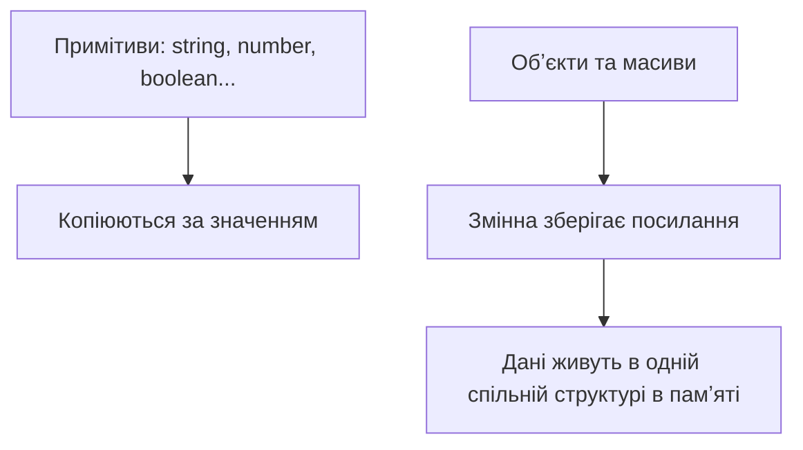

# JavaScript ES2024+

> [!abstract] Коротко
> Синтаксис сучасного JavaScript: оголошення змінних і типи даних, функції та деструктуризація, робота з масивами й обʼєктами через вбудовані методи, модулі ES та обробка помилок через try/catch. Основа, без якої не читається жоден React-компонент чи Node.js-сервер у наступних лекціях.

## Навчальні цілі

1. Використовувати `let`/`const`, розрізняти примітивні та посилальні типи даних.
2. Обирати між function declaration, function expression та стрілковою функцією залежно від контексту.
3. Деструктурувати масиви й обʼєкти, застосовувати spread/rest.
4. Обробляти масиви через `map`/`filter`/`reduce` та подібні методи замість циклів `for`.
5. Імпортувати й експортувати ES-модулі, обробляти помилки через `try`/`catch`.

## План лекції

1. Змінні та типи даних
2. Функції: оголошення, вирази, стрілкові функції
3. Деструктуризація та spread/rest
4. Масиви й обʼєкти: методи та сучасний синтаксис
5. Модулі ES
6. Обробка помилок

## Змінні та типи даних

Кожна програма працює з даними, і перше, з чим стикаємось у JavaScript, — як ці дані зберігати. JavaScript — мова з динамічною типізацією: на відміну від Java чи C#, тип значення визначається не оголошенням змінної, а самим значенням у момент виконання. Формально та сама змінна за життя програми могла б містити спочатку рядок, а потім число — на практиці так робити не варто, бо це різко ускладнює читання й супровід коду, але важливо розуміти, що мова цього не забороняє на рівні синтаксису.

До 2015 року (стандарту ES6) єдиним способом оголосити змінну був `var`. Сьогодні в новому коді `var` практично не пишуть — і причина не в моді, а в реальних проблемах, які він створює. `var` має функціональну область видимості: змінна, оголошена всередині блоку `if` чи `for`, «просочується» за межі цього блоку й лишається доступною в усій функції. Це призводить до випадкових перезаписів значень і помилок, які важко відстежити, особливо в довгих функціях. Детальніше про це — у розділі про область видимості нижче. А поки що запамʼятаємо просте практичне правило: у сучасному коді для оголошення змінної використовують `let` або `const`, і `var` більше не пишуть узагалі.

Різниця між `let` і `const` — не в тому, «постійне» значення чи ні, а в тому, чи можна змінній присвоїти нове значення після оголошення. `let` дозволяє переприсвоєння, `const` — ні. Тут криється поширена плутанина, тому варто зупинитися на ній окремо: `const` забороняє змінити саме посилання змінної, а не вміст структури, на яку це посилання вказує. Якщо `const` вказує на обʼєкт чи масив, властивості цього обʼєкта чи елементи масиву можна вільно змінювати — забороняється лише повторно написати `user = { ... }`.

```js
let count = 0;
count = count + 1;

const user = { name: "Олена" };
user.name = "Ірина"; // ок — змінюємо вміст, не саме посилання
// user = {} — помилка: не можна переприсвоїти const
```

На практиці це дає просте правило вибору: якщо змінній планується присвоювати нові значення (лічильник, накопичувач, змінна циклу) — `let`. У всіх інших випадках, включно з обʼєктами й масивами, вміст яких надалі мутуватиметься, — `const`. Це не лише питання стилю: `const` за замовчуванням сигналізує іншому розробнику — і вам самим за місяць — що саме посилання змінюватись не буде, і полегшує читання чужого коду.

Тепер про самі типи даних. У JavaScript є сім примітивних типів і один «збірний» тип — обʼєкт, до якого належать і масиви, і функції. Примітиви — це значення, які зберігаються «як є», без властивостей і методів у прямому сенсі:

| Тип | Приклад | `typeof` |
|---|---|---|
| string | `"текст"` | `"string"` |
| number | `42`, `3.14` | `"number"` |
| boolean | `true`, `false` | `"boolean"` |
| undefined | значення не задане | `"undefined"` |
| null | свідома відсутність значення | `"object"` (історична особливість) |
| symbol | унікальний ідентифікатор | `"symbol"` |
| bigint | `123n` — великі цілі числа | `"bigint"` |

Оператор `typeof` дозволяє перевірити тип значення просто під час виконання коду. Це особливо стане в пригоді, коли працюватимемо з даними, отриманими ззовні — з форми чи від API, — де тип наперед не гарантований і його варто перевіряти перед використанням.

> [!warning] Типова помилка
> `typeof null === "object"` — відома помилка, яка існує від першої реалізації JavaScript у 1995 році. Виправити її зараз неможливо: занадто багато існуючого коду в інтернеті вже покладається на цю поведінку, і виправлення зламало б мільйони сайтів. Тому перевіряти значення на `null` треба явно й окремо: `value === null`, а не покладатися на `typeof`.

Ця історія — гарний привід поговорити про те, чим примітиви принципово відрізняються від обʼєктів на рівні памʼяті. Це пояснює чимало «дивної» поведінки JavaScript, з якою ви зіткнетесь уже на першій практичній роботі.

### Примітиви проти обʼєктів у памʼяті

Уявіть, що ви присвоюєте одній змінній значення іншої: `let b = a`. Якщо `a` — примітив (наприклад, число), у `b` копіюється саме значення, і подальші зміни `b` ніяк не впливають на `a` — вони повністю незалежні одна від одної. Але якщо `a` — обʼєкт чи масив, у `b` копіюється не сам обʼєкт, а посилання на нього в памʼяті. Обидві змінні після цього вказують на ту саму структуру даних, і зміна через одну з них видно й через іншу.



```js
let a = 5;
let b = a;
b = 10; // a залишається 5

let obj1 = { x: 1 };
let obj2 = obj1;
obj2.x = 99; // obj1.x теж стане 99 — те саме посилання
```

Ця відмінність — джерело однієї з найпоширеніших помилок у коді початківців: спроба «скопіювати» масив чи обʼєкт простим присвоєнням і подальше здивування, чому зміна в одному місці зачепила, здавалося б, зовсім іншу змінну. Правильний спосіб скопіювати обʼєкт чи масив — spread-оператор (`{...obj}`, `[...arr]`), який ми розглянемо трохи далі в лекції.

### Шаблонні рядки (template literals)

Ще одна річ, яка стане звичною вже в перших рядках коду, — спосіб зібрати рядок з кількох частин. До появи шаблонних рядків доводилося конкатенувати через `+`, що швидко ставало нечитабельним при більшій кількості змінних. Зворотні лапки (`` ` ``) замість звичайних `"` дозволяють вставляти вирази прямо всередину рядка через `${...}`, а також писати багаторядковий текст без спеціальних символів переносу.

```js
const name = "Ірина";
const price = 120;

const message = `Привіт, ${name}! Ціна: ${price * 1.2} грн`; // підстановка виразів

const html = `
  <li>${name}</li>
`; // багаторядковий текст без конкатенації через +
```

### Область видимості

Тепер повернемось до обіцяного пояснення, чому `var` вважається проблемним. Річ у механізмі, який називають областю видимості (scope) — це та частина коду, де змінна «видима» і до неї можна звернутися. `var` має функціональну область видимості: вона видима в межах усієї функції, повністю ігноруючи блоки `{}`. `let` і `const`, навпаки, мають блокову область видимості — вони видимі лише всередині того блоку `{}`, де були оголошені, будь то тіло `if`, `for` чи просто довільні фігурні дужки.

```js
if (true) {
  var a = 1;
  let b = 2;
}
console.log(a); // 1 — var «просочилась» за межі if
console.log(b); // ReferenceError — b не існує поза блоком
```

Саме через таку «протічність» `var` у великих функціях з кількома умовами й циклами легко випадково перезаписати чужу змінну з тим самим імʼям, навіть не підозрюючи про конфлікт. Блокова область видимості `let`/`const` унеможливлює цілий клас таких помилок — змінна просто перестає існувати за межами свого блока.

> [!info] Для допитливих — замикання (closure)
> З області видимості випливає ще один важливий механізм: якщо функцію оголосити всередині іншої функції, внутрішня функція «памʼятає» змінні зовнішньої навіть після того, як зовнішня функція вже завершила виконання. Це називається замиканням (closure), і саме на ньому побудовані хуки React — `useState` та подібні — з якими попрацюємо в [[courses/web-programming/lectures/06-react-khuky-ta-keruvannia-stanom|Лекція 6. React-хуки та керування станом]].
> ```js
> function createCounter() {
>   let count = 0;
>   return () => ++count; // «замикає» count у собі
> }
> const counter = createCounter();
> counter(); // 1
> counter(); // 2
> ```

## Функції: оголошення, вирази, стрілкові функції

Функція — базовий будівельний блок будь-якої програми на JavaScript, і мова пропонує одразу три синтаксично різні способи її створити. Різниця між ними — не косметична: кожен спосіб по-різному поводиться з підняттям (hoisting) коду інтерпретатором і з тим, що всередині функції означає ключове слово `this`.

```js
function sum(a, b) {                // function declaration
  return a + b;
}

const multiply = function (a, b) {  // function expression
  return a * b;
};

const divide = (a, b) => a / b;     // стрілкова функція
```

Function declaration піднімається інтерпретатором на початок області видимості ще до фактичного виконання коду — тому таку функцію можна викликати навіть у рядку, що йде вище за її оголошення в тексті файлу. Function expression і стрілкова функція так не вміють: вони існують лише з моменту, коли виконання коду дійшло до рядка з присвоєнням, а виклик раніше цього рядка призведе до помилки.

Практично важливіша відмінність — поведінка `this`. Function declaration і function expression отримують власний `this`, значення якого залежить від того, як саме функцію викликали. Стрілкова функція власного `this` не має взагалі: вона «успадковує» його з того контексту, де була визначена текстуально, а не з того, звідки її викликали. Через це стрілкову функцію не варто використовувати як метод обʼєкта, якщо всередині потрібен доступ до самого обʼєкта.

| | Function declaration | Function expression | Стрілкова функція |
|---|---|---|---|
| Hoisting | Так, повністю | Ні | Ні |
| Власний `this` | Так | Так | Ні — бере `this` з оточення |
| Обʼєкт `arguments` | Так | Так | Ні |
| Годиться як метод обʼєкта | Так | Так | Не рекомендується |

> [!warning] Типова помилка
> Стрілкова функція як метод обʼєкта: `this` усередині не вказує на сам обʼєкт, а береться із зовнішньої області видимості — типова причина помилки `this is undefined`, яку часто бачать у обробниках подій і в React-компонентах, написаних необережно.

Ще одна практична деталь щодо функцій — параметри. Сучасний синтаксис дозволяє задати значення за замовчуванням прямо в оголошенні, а також зібрати «зайві» аргументи в масив через rest-параметр — це прибирає потребу перевіряти `arguments.length` вручну, як доводилось робити раніше.

```js
function greet(name = "Гостю", ...rest) {
  console.log(`Привіт, ${name}!`);
  console.log(rest); // усі додаткові аргументи одним масивом
}
```

## Деструктуризація та spread/rest

Коли з масиву чи обʼєкта потрібно дістати одразу кілька значень, писати `const first = arr[0]; const second = arr[1];` — багатослівно й погано масштабується, якщо значень багато. Деструктуризація дозволяє зробити це за один рядок, ще й одразу підтримує значення за замовчуванням та перейменування змінних під час витягування.

```js
const [first, second] = [10, 20];

const { name, age = 18 } = { name: "Богдан" }; // age отримає значення за замовчуванням

const { name: userName } = { name: "Оксана" }; // перейменування при витягуванні

const [x, ...restArr] = [1, 2, 3, 4]; // restArr = [2, 3, 4]
```

> [!example] Обмін значень без тимчасової змінної
> ```js
> let a = 1, b = 2;
> [a, b] = [b, a]; // a = 2, b = 1
> ```

Spread — операція, синтаксично схожа на rest (той самий `...`), але з протилежним значенням: rest збирає кілька окремих значень в один масив, spread, навпаки, розгортає масив чи обʼєкт на окремі елементи чи властивості.

```js
const arr1 = [1, 2];
const arr2 = [...arr1, 3, 4]; // [1, 2, 3, 4]

const base = { role: "student" };
const withName = { ...base, name: "Марія" }; // { role: "student", name: "Марія" }
```

Практичне застосування spread, яке побачите вже на найближчих заняттях, — незмінне (immutable) оновлення даних у React: замість того, щоб змінювати існуючий обʼєкт напряму, створюють новий, копіюючи в нього старі поля через spread і перезаписуючи лише те, що змінилось. Це напряму повʼязано з тим, про що йшлося раніше в розділі про примітиви й посилання: React звіряє попередній і новий стан саме за посиланням, тому пряма мутація обʼєкта «непомітна» для нього.

## Масиви й обʼєкти: методи та сучасний синтаксис

До появи `map`/`filter`/`reduce` обробка масивів у JavaScript зазвичай виглядала як цикл `for` з ручним індексом і окремим накопичувальним масивом, куди по одному додавали результат. Сучасний підхід — декларативний: код описує, ЩО потрібно отримати з масиву, а не ЯК саме порахувати це крок за кроком через індекси.

| Метод | Що робить | Повертає |
|---|---|---|
| `map` | Перетворює кожен елемент | новий масив |
| `filter` | Залишає елементи за умовою | новий масив |
| `reduce` | Згортає масив в одне значення | будь-яке значення |
| `find` | Перший елемент, що задовольняє умову | елемент або `undefined` |
| `some` | Чи є хоч один елемент за умовою | `boolean` |
| `every` | Чи всі елементи задовольняють умову | `boolean` |
| `includes` | Чи є значення в масиві | `boolean` |
| `flat` | Розгортає вкладені масиви | новий масив |

```js
const prices = [120, 45, 300, 89];

const withTax = prices.map(p => p * 1.2);
const expensive = prices.filter(p => p > 100);
const total = prices.reduce((sum, p) => sum + p, 0);
```

З цієї трійки `reduce` — найпотужніший, але й найскладніший для розуміння: він згортає весь масив в одне-єдине значення (число, обʼєкт чи навіть новий масив), накопичуючи результат на кожній ітерації через акумулятор — перший аргумент функції-колбека. У прикладі вище акумулятор `sum` починається з `0` і на кожному кроці збільшується на черговий елемент масиву.

> [!warning] Типова помилка
> `forEach` не повертає новий масив — він призначений лише для побічних ефектів, наприклад виводу в консоль. Спроба написати `const result = arr.forEach(...)`, очікуючи оброблений масив, поверне `undefined`, а не результат.

Тепер про сучасний синтаксис роботи з обʼєктами. Коли імʼя властивості обʼєкта збігається з іменем змінної, з якої береться значення, можна опустити повторення — це називають скороченим записом властивостей (shorthand). А якщо назва ключа обʼєкта заздалегідь невідома й обчислюється, її можна підставити через квадратні дужки прямо в літералі обʼєкта.

```js
const name = "Тарас";
const user = { name, role: "admin" }; // shorthand — те саме, що { name: name, role: "admin" }

const key = "email";
const contact = { [key]: "taras@example.com" }; // обчислюваний ключ

Object.keys(user);    // ["name", "role"]
Object.values(user);  // ["Тарас", "admin"]
Object.entries(user); // [["name", "Тарас"], ["role", "admin"]]
```

Ще одна пара операторів, яка суттєво скорочує код при роботі з даними, що можуть бути відсутні, — optional chaining та nullish coalescing. Optional chaining (`?.`) дозволяє безпечно «зайти» у вкладену властивість обʼєкта: якщо якийсь із проміжних рівнів відсутній, вираз просто поверне `undefined` замість того, щоб кинути помилку й зупинити виконання програми.

```js
const city = user?.address?.city;              // undefined замість помилки, якщо address немає
const displayName = user.nickname ?? "Анонім"; // "Анонім" лише якщо nickname null або undefined
```

> [!info] Для допитливих — `??` проти `||`
> `??` спрацьовує лише на `null`/`undefined`, а `||` — на будь-яке falsy-значення (`0`, `""`, `false`). Тому `const count = 0 || 10` дасть `10`, хоча `0` — цілком валідне значення, яке розробник, найімовірніше, хотів зберегти. `const count = 0 ?? 10` коректно поверне `0`. Ця різниця — джерело прихованих багів у коді, написаному ще до появи `??` у стандарті.

## Модулі ES

Коли проєкт виростає за межі одного файлу, весь код у спільній глобальній області видимості стає небезпечним: імена змінних і функцій з різних файлів можуть випадково конфліктувати одне з одним. ES-модулі вирішують цю проблему явно — кожен файл отримує власну ізольовану область видимості, а щоб щось із неї стало доступним ззовні, це потрібно експліцитно експортувати ключовим словом `export`.

```js
// utils.js
export function formatPrice(value) {
  return `${value} грн`;
}
export const TAX_RATE = 0.2;

export default function main() { /* ... */ }
```

```js
// app.js
import main, { formatPrice, TAX_RATE } from "./utils.js";
```

Іменованих експортів (`export { ... }`) в одному файлі може бути скільки завгодно, а `export default` — лише один на файл, і саме він імпортується без фігурних дужок. Окремо варто згадати динамічний імпорт `import("./module.js")`: на відміну від звичайного `import` у шапці файлу, він завантажує модуль асинхронно, у момент фактичного виклику, а не одразу при старті сторінки — це стане в пригоді пізніше, коли говоритимемо про оптимізацію завантаження в React-застосунках.

## Обробка помилок

Код, що звертається до зовнішніх джерел даних — введення користувача, файли, мережеві запити, — рано чи пізно отримає щось не те, чого очікувалось: некоректний JSON, відсутнє поле, недоступний сервер. Якщо таку ситуацію не обробити, програма аварійно завершить виконання поточного скрипту. Механізм `try`/`catch`/`finally` дозволяє перехопити помилку й відреагувати на неї, не «впускаючи» весь застосунок.

```js
try {
  const data = JSON.parse(userInput);
} catch (error) {
  console.error("Некоректний JSON:", error.message);
} finally {
  hideLoadingSpinner();
}
```

Блок `try` містить код, що потенційно може кинути помилку. Якщо помилка сталась, виконання одразу перескакує в `catch`, минаючи решту коду в `try`. Блок `finally` виконується завжди — і якщо все пройшло успішно, і якщо стався виняток — тому в нього виносять дії, які мають відбутися в будь-якому разі, наприклад приховати індикатор завантаження.

Іноді вбудованих типів помилок недостатньо, і зручно створити власний клас помилки, успадкований від стандартного `Error`, — це дозволяє в `catch` розрізняти різні типи проблем за назвою класу, а не парсити текст повідомлення.

> [!example] Власний клас помилки
> ```js
> class ValidationError extends Error {
>   constructor(message) {
>     super(message);
>     this.name = "ValidationError";
>   }
> }
>
> throw new ValidationError("Email обовʼязковий");
> ```

> [!exam] На іспиті
> `try`/`catch` перехоплює лише синхронні помилки та помилки всередині `await`. Помилку в колбеку `setTimeout` чи в невіджмайненому `.then()`-ланцюжку так перехопити не вдасться — цю відмінність і те, чому вона виникає, детально розберемо в [[courses/web-programming/lectures/03-dom-podii-ta-asynkhronnist|Лекція 3. DOM, події та асинхронність]] разом із [[courses/web-programming/glossary/promise|Promise]].

## Завдання на занятті (20-25 хв)

1. Напишіть функцію `groupByCategory(products)`, яка через `reduce` групує масив товарів за полем `category` в обʼєкт `{ category: [товари] }`.
2. Створіть модуль `validators.js` з іменованими експортами `isEmail(value)` та `isNotEmpty(value)`; імпортуйте їх в іншому файлі й перевірте дані форми з Лекції 1.
3. Обгорніть парсинг JSON, введеного користувачем, у `try`/`catch`; при помилці киньте власний клас `ValidationError` з повідомленням.

> [!question] Перевірте себе
> - Чим `let` відрізняється від `const` і чому `var` уникають у сучасному коді?
> - Що поверне `typeof null` і чому це вважається історичною помилкою мови?
> - У чому різниця копіювання примітивів і обʼєктів при присвоєнні змінній?
> - Чому змінна, оголошена через `var` у блоці `if`, залишається доступною поза цим блоком, а оголошена через `let` — ні?
> - Що таке замикання (closure) і чому лічильник з прикладу вище памʼятає своє значення між викликами?
> - Чому стрілкова функція не годиться як метод обʼєкта, якщо всередині потрібен `this`?
> - Що робить `reduce` і чим він відрізняється від `map`?
> - Чим відрізняється spread від rest, якщо синтаксис однаковий (`...`)?
> - У чому різниця між `??` і `||`?
> - Чим іменований експорт відрізняється від `export default`?
> - Які помилки НЕ перехопить `try`/`catch`?

## Назад
← [[courses/web-programming/lectures/01-iak-pratsiuie-veb-html-ta-css|Лекція 1. Як працює веб, HTML та CSS]]

## Далі
→ [[courses/web-programming/lectures/03-dom-podii-ta-asynkhronnist|Лекція 3. DOM, події та асинхронність]]

## Література
- MDN Web Docs — JavaScript Guide, Modules, Error handling (developer.mozilla.org)
- ECMAScript Language Specification (tc39.es)
- javascript.info — сучасний підручник з JS
