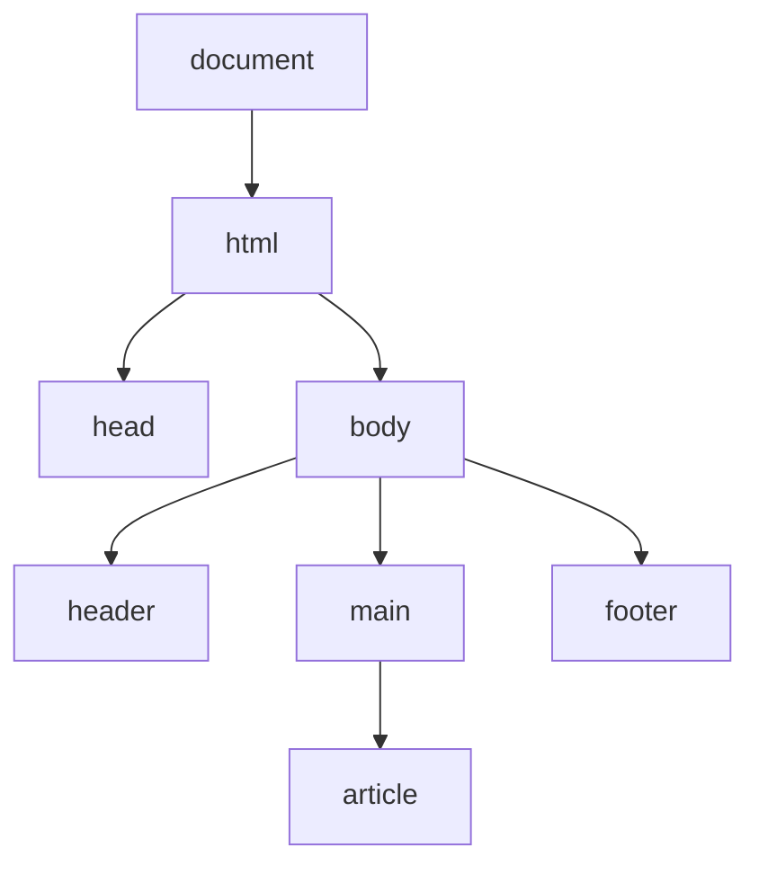
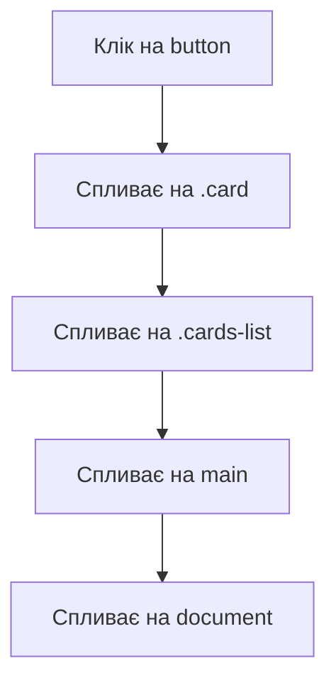
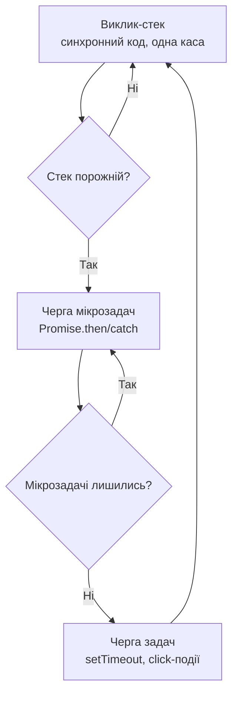

# DOM, події та асинхронність

> [!abstract] Коротко
> Як браузер представляє HTML-сторінку у вигляді дерева обʼєктів ([[courses/web-programming/glossary/dom|DOM]]), як шукати й змінювати елементи цього дерева, як реагувати на дії користувача через події та делегування, і як влаштована асинхронність у JavaScript — від callback-функцій до [[courses/web-programming/glossary/promise|Promise]] та `async`/`await`, аж до реального запиту даних через `fetch`.

## Навчальні цілі

1. Пояснити, чим DOM відрізняється від HTML-розмітки, і знаходити та змінювати елементи через DOM API.
2. Обробляти події користувача, розуміти спливання подій (bubbling) і застосовувати делегування замість навішування слухачів на кожен елемент.
3. Пояснити, як влаштований цикл подій (event loop) і чому JavaScript, попри однопотоковість, не «зависає» на довгих операціях.
4. Працювати з `Promise` та `async`/`await` для обробки асинхронних операцій.
5. Робити мережеві запити через `fetch` і коректно обробляти як мережеві помилки, так і HTTP-помилки відповіді.

## План лекції

1. DOM-дерево: що це і як у ньому шукати елементи
2. Зміна DOM: контент, класи, стилі, створення елементів
3. Події та делегування
4. Event loop: чому JavaScript не блокується
5. Promise та async/await
6. Fetch: реальний запит до сервера

## DOM-дерево

Почнемо з питання, яке звучить дивно, доки не розібратись: чим DOM відрізняється від HTML? Адже ви вже писали HTML на попередній лекції, і, здавалося б, це й так «структура сторінки». Різниця тут приблизно така сама, як між архітектурним кресленням будинку на папері й самим фізичним будинком, у якому вже можна ходити, переставляти меблі та навіть прибудовувати нові кімнати. HTML-файл — це креслення: текстовий опис структури, який ви пишете в редакторі коду. Коли браузер завантажує цей файл, він читає креслення й будує на його основі живу, повноцінну обʼєктну модель у памʼяті — Document Object Model, або DOM, — і саме з цією «побудованою будівлею», а не з вихідним текстовим кресленням, надалі працює JavaScript.

> [!definition] DOM
> Document Object Model — деревоподібне представлення HTML-документа в памʼяті браузера, де кожен тег стає окремим обʼєктом-«вузлом» дерева, з властивостями й методами, доступними з JavaScript. Зміна DOM миттєво відображається на екрані — саме так JavaScript «оживляє» статичну сторінку.

Дерево — не випадкова метафора, а буквально точний опис структури: кожен елемент DOM має рівно одного «батька» (крім кореневого) і може мати кількох «дітей», так само як гілки дерева чи, якщо ближче до повсякденного життя, як структура папок на компʼютері, де кожна папка лежить усередині рівно однієї батьківської папки, але сама може містити кілька вкладених.



Щоб щось змінити на сторінці через JavaScript, спершу потрібно ЗНАЙТИ потрібний вузол цього дерева — і для цього є кілька методів пошуку, кожен зі своїм практичним застосуванням:

| Метод | Що знаходить | Повертає |
|---|---|---|
| `document.getElementById("id")` | Елемент за унікальним `id` | один елемент або `null` |
| `document.querySelector("селектор")` | Перший елемент, що відповідає CSS-селектору | один елемент або `null` |
| `document.querySelectorAll("селектор")` | Усі елементи, що відповідають CSS-селектору | NodeList (схожий на масив) |
| `element.closest("селектор")` | Найближчий предок, що відповідає селектору | елемент або `null` |
| `element.children` | Прямі дочірні елементи | HTMLCollection |

Найуніверсальніший з них — `querySelector`, бо він приймає ЗВИЧАЙНИЙ CSS-селектор, той самий синтаксис, яким ви вже користувались, коли писали стилі на попередній лекції: `.картка`, `#header`, `nav a`. Це означає, що вам не потрібно вчити окрему «мову пошуку» для JavaScript — досить того, що ви вже знаєте з CSS.

```js
const card = document.querySelector(".card");
const allCards = document.querySelectorAll(".card");
const firstCard = document.getElementById("first-card");

const parentSection = card.closest("section"); // піднятись до найближчої батьківської <section>
```

> [!warning] Типова помилка
> `document.querySelectorAll` повертає НЕ звичайний масив, а спеціальну структуру NodeList, і хоча в сучасних браузерах у неї вже є метод `forEach`, деякі звичні методи масивів (наприклад, `map` чи `filter`) на ній напряму не працюють. Якщо потрібні саме методи масиву, NodeList спершу перетворюють у справжній масив через `Array.from(nodeList)` або spread: `[...nodeList]`.

Ще одна деталь, яка на перший погляд непомітна, але часто спричиняє дивну поведінку коду, — деякі колекції DOM «живі» (live), а деякі — «застиглі» (static) знімки на момент виклику. `document.querySelectorAll` повертає статичний NodeList: якщо після його виклику ви додасте на сторінку ще одну картку `.card`, у вже отриманому списку вона не зʼявиться — потрібно викликати `querySelectorAll` заново. А от властивість `element.children` повертає «живу» колекцію: вона автоматично відображає поточний стан DOM у будь-який момент, навіть якщо ви звернулись до неї один раз, а елементи додали чи прибрали пізніше. Це варто памʼятати, коли код поводиться не так, як очікувалось: колекція, отримана «до» зміни DOM, не завжди «бачить» те, що сталось «після».

## Зміна DOM

Знайти елемент — це лише половина роботи; тепер розберемось, як змінювати його вміст, вигляд і структуру. Тут теж є пастка, у яку легко потрапити на самому початку, тому розберемо її одразу.

```js
const title = document.querySelector("h1");

title.textContent = "Новий заголовок";      // безпечно — текст як є
title.innerHTML = "<em>Новий</em> заголовок"; // вставляє HTML-розмітку, яка одразу рендериться
```

`textContent` вставляє переданий рядок як ЧИСТИЙ текст, навіть якщо в цьому рядку випадково опиняться символи `<` чи `>` — вони просто відобразяться на екрані буквально, як текст, а не перетворяться на HTML-теги. `innerHTML`, натомість, буквально РОЗБИРАЄ переданий рядок як HTML-розмітку й будує з нього нові DOM-вузли — це зручно, коли вам справді потрібно вставити готову розмітку, але водночас і небезпечно.

> [!warning] Типова помилка
> Якщо вставити через `innerHTML` рядок, який прийшов НЕ від вас, а від користувача (наприклад, текст із поля коментаря), і цей рядок міститиме щось на кшталт ``, цей код реально виконається в браузері іншого відвідувача сторінки — це називають XSS-атакою (Cross-Site Scripting), і це одна з найпоширеніших вразливостей вебзастосунків. Правило просте: якщо вставляєте текст, який могла ввести стороння людина, завжди використовуйте `textContent`, а не `innerHTML`, доки не зʼявиться справжня, свідома потреба вставити саме розмітку з довіреного джерела.

Крім вмісту, часто потрібно керувати класами елемента — наприклад, щоб «підсвітити» активний пункт меню чи показати/приховати блок:

```js
const menuItem = document.querySelector(".menu-item");

menuItem.classList.add("active");
menuItem.classList.remove("active");
menuItem.classList.toggle("active"); // додати, якщо немає; прибрати, якщо є
menuItem.classList.contains("active"); // true/false
```

`classList` — набагато зручніший спосіб керувати класами, ніж напряму читати й переписувати рядок `element.className`: не доведеться вручну парсити рядок класів через пробіли, перевіряти дублікати чи випадково стерти інші класи, які там уже були.

Нарешті, DOM дозволяє не лише змінювати наявні елементи, а й СТВОРЮВАТИ нові з нуля та вставляти їх у дерево:

```js
const li = document.createElement("li");
li.textContent = "Новий пункт списку";
li.classList.add("list-item");

document.querySelector("ul").appendChild(li);
```

Ці три рядки — типовий шаблон, який ви побачите десятки разів у реальному коді: створити елемент, наповнити його вмістом і властивостями, і лише в самому кінці додати його в живе дерево DOM, яке вже відображається на екрані.

Варто окремо сказати чому саме такий порядок — спочатку повністю «зібрати» елемент і лише потім вставити його в документ, а не навпаки. Кожна зміна, яка ВЖЕ ВІДОБРАЖЕНОГО на екрані дерева DOM, змушує браузер потенційно перерахувати розташування (reflow) і перемалювати (repaint) частину сторінки — це недешева операція. Якщо вставляти в цикл одразу по сто елементів, змінюючи DOM сто разів поспіль, браузер може сто разів поспіль перераховувати макет сторінки. Тому для масового додавання елементів використовують `DocumentFragment` — своєрідний «невидимий контейнер», що існує лише в памʼяті, куди спочатку складають усі нові елементи, і лише один раз, в самому кінці, вставляють увесь фрагмент у реальний DOM одним рухом:

```js
const fragment = document.createDocumentFragment();

products.forEach(product => {
  const li = document.createElement("li");
  li.textContent = product.name;
  fragment.appendChild(li);
});

document.querySelector("ul").appendChild(fragment); // одна вставка замість ста
```

Ще одна практична деталь — атрибути `data-*`. Часто елементу потрібно «прикріпити» додаткові дані, які не мають візуального представлення, але знадобляться в JavaScript, — наприклад, ID товару прямо на картці:

```html
<li class="card" data-product-id="42">Ноутбук</li>
```

```js
const card = document.querySelector(".card");
console.log(card.dataset.productId); // "42" — camelCase автоматично з kebab-case
```

Зверніть увагу на перетворення назви: атрибут у HTML пишеться через дефіс (`data-product-id`), а в JavaScript звертання до нього йде через `dataset` і camelCase (`dataset.productId`) — це стандартна, автоматична конвенція, яку варто просто запамʼятати.

## Події та делегування

Сторінка стає ІНТЕРАКТИВНОЮ саме завдяки подіям — механізму, через який JavaScript дізнається, що користувач щось зробив: клікнув, навів курсор, ввів текст, натиснув клавішу. Уявіть, що ви наймаєте охоронця й ставите його біля кожних окремих дверей у великому торговому центрі, доручивши доповідати вам щоразу, коли хтось відчиняє саме ці конкретні двері. Це працює, але дуже незручно масштабується: якщо в центрі тисяча дверей, вам потрібна тисяча охоронців. `addEventListener` — це і є той самий «охоронець», якого ви ставите біля конкретного елемента:

```js
const button = document.querySelector(".buy-button");

button.addEventListener("click", (event) => {
  console.log("Клікнули на кнопку:", event.target);
});
```

Функція-колбек, яку ви передаєте другим аргументом, отримує обʼєкт `event` з детальною інформацією про те, що саме сталось: `event.target` — це САМ елемент, на якому реально відбувся клік (наприклад, конкретна іконка всередині кнопки), а `event.currentTarget` — елемент, на якому саме СТОЇТЬ ваш «охоронець» (`addEventListener`) — і це не завжди той самий елемент, як ми зараз побачимо.

Річ у тім, що події в браузері не просто «стаються» на одному елементі й зникають — вони СПЛИВАЮТЬ (bubbling) угору по всьому дереву DOM, від елемента, де подія реально сталась, до всіх його батьків по черзі, аж до самого `document`. Уявіть, що ви кинули камінець у ставок — від точки падіння розходяться кола, і кожне наступне коло охоплює дедалі більшу площу навколо. Клік на конкретній кнопці всередині картки товару спочатку «стається» на самій кнопці, потім спливає на картку, потім на список карток, потім на весь `<main>`, і так до самого `document` — і на кожному з цих рівнів, якщо там стоїть свій «охоронець» (`addEventListener`), він теж дізнається про цю подію.



Саме на цій властивості й будується делегування подій — набагато практичніший підхід, ніж наймати «охоронця» для кожних окремих дверей. Замість того щоб навішувати `addEventListener` на КОЖНУ окрему кнопку «купити» в списку з, скажімо, ста товарів, можна поставити ОДНОГО «охоронця» на спільного батька — весь список карток — і всередині нього перевіряти, на якому саме елементі реально стався клік, через `event.target`:

```js
document.querySelector(".cards-list").addEventListener("click", (event) => {
  if (event.target.matches(".buy-button")) {
    console.log("Купуємо товар:", event.target.closest(".card"));
  }
});
```

Практична вигода тут подвійна. По-перше, замість ста слухачів подій — рівно один, що економить памʼять і трохи пришвидшує сторінку: кожен окремий `addEventListener` — це не безкоштовна операція, браузер має тримати в памʼяті посилання на кожен такий «контракт» між елементом і функцією-колбеком, і сто таких контрактів важчі за один. По-друге — і на практиці це навіть важливіше за економію памʼяті — якщо картки товарів динамічно ДОДАЮТЬСЯ на сторінку пізніше, наприклад після відповіді сервера з новою партією товарів, ваш єдиний «охоронець» на батьківському елементі автоматично працюватиме й для щойно доданих карток теж, адже подія все одно спливе до нього незалежно від того, коли саме картку додали в DOM. А якщо навішувати слухач індивідуально на кожну кнопку через `querySelectorAll` одразу при завантаженні сторінки, для кожного НОВОГО елемента, доданого пізніше, довелося б окремо не забувати повторити ту саму операцію — а забути про це дуже легко, і тоді нові кнопки просто мовчки «не працюватимуть».

Варто також знати, що спливання (bubbling), яке ми щойно розглянули, — це лише друга з двох фаз, якими проходить кожна подія. Насправді подія спочатку рухається зверху ВНИЗ, від `document` до самого елемента, де вона реально сталась, — це називають фазою занурення (capturing), — і лише ПІСЛЯ досягнення цільового елемента починається знайомий нам рух угору (bubbling). За замовчуванням `addEventListener` реагує саме на фазу спливання, але якщо третім аргументом передати `true`, слухач реагуватиме на фазу занурення — тобто спрацює РАНІШЕ, ніж подія взагалі дійде до самого елемента:

```js
parent.addEventListener("click", handler, true); // фаза занурення — спрацює першим
child.addEventListener("click", handler, false);  // фаза спливання — типова поведінка
```

На практиці фазу занурення використовують рідко — здебільшого для дуже специфічних сценаріїв, коли потрібно гарантовано перехопити подію ще до того, як до неї встигне «дотягнутись» сам цільовий елемент, — але важливо знати, що вона існує, щоб не дивуватись, побачивши третій аргумент `true` у чужому коді.

> [!info] Для допитливих — `preventDefault` і `stopPropagation`
> Деякі елементи мають власну «типову» поведінку в браузері — клік на посиланні переходить за адресою, відправка форми перезавантажує сторінку. `event.preventDefault()` скасовує саме цю типову поведінку, не зупиняючи при цьому спливання самої події далі по дереву. `event.stopPropagation()`, навпаки, зупиняє подальше спливання події вгору по дереву, але НЕ впливає на типову поведінку браузера. Це дві незалежні одна від одної речі, які легко переплутати саме через те, що обидві «щось зупиняють».

Насамкінець розберемо ще одну властивість самого обʼєкта `event`, яка знадобиться вже на найближчій практичній — роботу з клавіатурою. Подія `keydown` спрацьовує при натисканні будь-якої клавіші, а `event.key` повідомляє, яка саме клавіша була натиснута:

```js
document.addEventListener("keydown", (event) => {
  if (event.key === "Escape") {
    closeModal();
  }
});
```

| Властивість `event` | Значення |
|---|---|
| `type` | Назва події (`"click"`, `"keydown"`) |
| `target` | Елемент, де подія реально сталась |
| `currentTarget` | Елемент, на якому стоїть `addEventListener` |
| `key` | Натиснута клавіша (лише для подій клавіатури) |
| `preventDefault()` | Скасувати типову поведінку браузера |
| `stopPropagation()` | Зупинити подальше спливання події |

## Event loop: чому JavaScript не блокується

Тепер підійдемо до питання, яке пояснює чи не найбільше «магії», з якою ви зіткнетесь при роботі з асинхронним кодом. JavaScript — однопотокова мова: у будь-який момент часу виконується рівно ОДНА команда, немає паралельних «потоків» виконання коду, як буває в деяких інших мовах. Здавалося б, це має означати, що будь-яка довга операція — наприклад, очікування відповіді від сервера, яка може тривати кілька секунд, — повністю «заморозить» сторінку на весь цей час: жодна кнопка не натиснеться, жодна анімація не програється. На щастя, це не так, і саме event loop — цикл подій — пояснює, чому.

Уявіть єдину касу в супермаркеті з однією касиркою (це і є той самий, єдиний потік виконання JavaScript). Касирка обслуговує клієнтів по черзі, одного за одним, і поки вона рахує чек одному клієнту, решта фізично чекають у черзі — це синхронний код, що виконується без перерв. Але деякі «замовлення» — наприклад, запит «принесіть мені товар зі складу» — не потребують, щоб касирка стояла й особисто чекала на нього: вона просто передає це замовлення окремому працівнику складу (браузерному Web API — таймеру, мережевому запиту), продовжує обслуговувати наступних клієнтів у черзі, а коли працівник складу нарешті приносить товар, це замовлення стає в ОКРЕМУ чергу «готових замовлень», і касирка забирає його з цієї черги, щойно звільниться від поточного клієнта.



Саме тому в прикладі з попередньої лекції — циклі `for` із `setTimeout`, який виводив «Картка номер 4» тричі замість «1, 2, 3» — колбек усередині `setTimeout` спрацьовував не одразу, а лише через секунду, і ТІЛЬКИ ПІСЛЯ того, як «каса» повністю звільнилась від усього синхронного коду, включно з рештою циклу. Тепер, знаючи про event loop, цю поведінку можна пояснити точніше: `setTimeout` не «ставить у чергу негайно» — він передає завдання окремому «працівнику складу» (браузерному таймеру), і лише коли той відлічить задану секунду, завдання потрапляє в чергу «готових замовлень», звідки касирка забере його, щойно звільниться.

Варто окремо зауважити, що в цій черзі готових замовлень насправді є два «віконця», а не одне, і в прикладі вище ми спростили до одного заради наочності: `Promise`-колбеки (`.then`, `.catch`) потрапляють у чергу мікрозадач, яка має ВИЩИЙ пріоритет і завжди повністю спорожняється раніше, ніж «каса» візьме наступне завдання зі звичайної черги (де лежать `setTimeout` і колбеки подій). Тому мікрозадачі — це немов VIP-віконце, яке обслуговують одразу, щойно звільняється каса, ще до того, як підійде черга звичайних клієнтів у загальній черзі.

Перевіримо все це на конкретному прикладі — класичній задачі, яку варто розібрати рядок за рядком, бо на перший погляд порядок виведення в консоль здається нелогічним:

```js
console.log("1");

setTimeout(() => console.log("2"), 0);

Promise.resolve().then(() => console.log("3"));

console.log("4");
```

Інтуїтивно можна очікувати порядок «1, 2, 3, 4» — адже `setTimeout` тут узагалі без затримки (`0` мілісекунд), тож здається, що він мав би спрацювати «одразу». Але насправді консоль виведе «1, 4, 3, 2». Розберемо чому, крок за кроком:

| Крок | Що відбувається | Куди потрапляє |
|---|---|---|
| 1 | `console.log("1")` | виконується одразу, синхронно — «1» |
| 2 | `setTimeout(...)` | передає колбек «працівнику складу» (браузерному таймеру), сама «каса» одразу йде далі |
| 3 | `Promise.resolve().then(...)` | `Promise` уже виконаний (`resolve()` одразу), тому колбек одразу стає в чергу мікрозадач |
| 4 | `console.log("4")` | виконується синхронно, поки «каса» ще не звільнилась — «4» |
| 5 | Синхронний код закінчився, «каса» звільнилась | перевіряємо чергу мікрозадач — там колбек з кроку 3 — виводить «3» |
| 6 | Черга мікрозадач порожня | лише тепер перевіряємо звичайну чергу задач — там колбек `setTimeout` з кроку 2 — виводить «2» |

Ключовий висновок цього прикладу: навіть `setTimeout(..., 0)` — «без затримки» — НІКОЛИ не виконається раніше, ніж увесь синхронний код на сторінці й усі мікрозадачі з черги `Promise`, попри те що технічно він був «запланований» найпершим. Це той самий принцип, що й у прикладі з циклом `for` і `var` із попередньої лекції, лише тепер ви бачите його з іншого боку — не «чому var зламався», а «чому setTimeout завжди чекає своєї черги».

## Promise та async/await

Тепер, коли зрозуміло, ЧОМУ асинхронний код виконується не одразу, розберемось, ЯК зручно з ним працювати. Уявіть, що ви замовили товар в інтернет-магазині. Одразу після оформлення замовлення ви ще не тримаєте товар у руках, але у вас на руках уже є щось конкретне — номер для відстеження посилки. За цим номером можна в будь-який момент перевірити статус: посилка «в дорозі» (pending), «успішно доставлена» (fulfilled), або «загублена, повернення коштів» (rejected). `Promise` в JavaScript — це і є такий «номер для відстеження»: обʼєкт, який одразу повертається з асинхронної операції, ще до того, як сама операція фактично завершилась, і дозволяє підписатись на те, що станеться, коли вона таки завершиться.

> [!definition] Promise
> Обʼєкт, що представляє результат асинхронної операції, яка ще може бути не завершена. Має один із трьох станів: `pending` (очікування, «посилка в дорозі»), `fulfilled` (успішно виконано, «посилка доставлена»), `rejected` (сталась помилка, «посилка загублена»). Після переходу в `fulfilled` чи `rejected` стан `Promise` вже НЕ змінюється — так само як статус посилки, щойно вона доставлена, назад у «в дорозі» не повертається.

```js
function checkDelivery(trackingId) {
  return new Promise((resolve, reject) => {
    setTimeout(() => {
      if (trackingId) {
        resolve("Посилку доставлено");
      } else {
        reject(new Error("Невідомий номер відстеження"));
      }
    }, 1000);
  });
}

checkDelivery("12345")
  .then(status => console.log(status))
  .catch(error => console.error(error.message))
  .finally(() => console.log("Перевірку завершено"));
```

`.then()` реєструє, що робити, коли `Promise` успішно виконався (`resolve`), `.catch()` — що робити, якщо сталась помилка (`reject`), а `.finally()`, так само як і в `try`/`finally` з попередньої лекції, виконується завжди, незалежно від результату. Кілька `.then()` можна зʼєднувати в ланцюжок — кожен наступний `.then()` отримує те, що ПОВЕРНУВ попередній, і якщо попередній поверне ще один `Promise`, наступний `.then()` автоматично «дочекається» і його теж, не вимагаючи вкладених колбеків одне в одному.

Зверніть увагу, що функція `checkDelivery` у прикладі вище всередині все одно використовує старий, «доцивілізаційний» спосіб роботи з асинхронністю — простий колбек, переданий у `setTimeout`. Це не випадково: `Promise` — не єдиний спосіб описати асинхронну операцію, а лише зручна «обгортка» над давнішим підходом, де функція просто приймала колбек-функцію, яку викликала сама, коли робота була готова. Проблема «голих» колбеків — у тому, що при кількох послідовних асинхронних кроках доводиться вкладати колбек у колбек у колбек, і код розростається вправо, стаючи дедалі важчим для читання (це явище навіть отримало жартівливу назву «callback hell», пекло колбеків). `Promise` вирішує саме цю проблему: перетворити функцію, засновану на колбеках, на функцію, що повертає `Promise`, — операція, яку іноді називають «промісифікацією» — досить просто, і саме так і побудована функція `checkDelivery` вище: усередині — старий `setTimeout` із колбеком, зовні — сучасний, зручний інтерфейс `Promise`, яким можна користуватись через `.then()` чи `await`.

Ланцюжки `.then()` цілком робочі, але для складнішої логіки з кількома послідовними кроками код на них стає важким для читання — доводиться вкладати колбек у колбек, і структура коду вже не читається зверху вниз, як звичайний послідовний код. `async`/`await` — це синтаксичний спосіб писати той самий асинхронний код, але виглядати він буде майже як звичайний, синхронний код, який читається природно, рядок за рядком.

```js
async function getDeliveryStatus(trackingId) {
  try {
    const status = await checkDelivery(trackingId);
    console.log(status);
  } catch (error) {
    console.error(error.message);
  } finally {
    console.log("Перевірку завершено");
  }
}
```

Ключове слово `await` можна використовувати лише всередині функції, позначеної `async`, і воно буквально означає «зупинись тут і зачекай, поки цей `Promise` не завершиться, перш ніж виконувати наступний рядок» — але, що важливо, це очікування НЕ блокує решту сторінки чи браузер загалом, воно лише «призупиняє» саме цю конкретну функцію, а «каса» (виклик-стек) тим часом вільно продовжує обробляти інші справи. І саме тому в цьому прикладі можна використовувати звичайний, знайомий із попередньої лекції `try`/`catch` — синтаксис `async`/`await` перетворює відхилений (rejected) `Promise` на звичайний кинутий виняток, який `catch` уже вміє перехоплювати, на відміну від голого `.then()`-ланцюжка, де для обробки помилок обовʼязково потрібен окремий `.catch()`.

> [!exam] На іспиті
> Пригадайте попередню лекцію: звичайний `try`/`catch` НЕ перехоплює помилку всередині звичайного колбека `setTimeout` чи в необробленому `.then()`-ланцюжку. Але всередині `async`-функції з `await` — перехоплює, і саме тому. `await` буквально розгортає `Promise` в те значення, яке він поверне (або кидає виняток, якщо `Promise` відхилений), тому з погляду `try`/`catch` це виглядає як звичайний синхронний виклик функції, що може кинути помилку, — а не як «зовнішній», відкладений колбек.

Тепер про дуже поширену помилку продуктивності, яку легко зробити, щойно звикнеш до зручності `await`. Уявіть, що потрібно завантажити дані профілю користувача й окремо список його замовлень — це дві незалежні одна від одної операції, жодна не потребує результату іншої. Якщо написати їх одну за одною через `await`, вони виконаються ПОСЛІДОВНО, хоча могли б виконуватись одночасно:

```js
// повільно — друга операція чекає, поки повністю завершиться перша, хоча могла б не чекати
const profile = await fetch("/api/profile").then(r => r.json());
const orders = await fetch("/api/orders").then(r => r.json());
```

Якщо кожен запит триває секунду, такий код виконуватиметься дві секунди сумарно — рівно стільки ж, скільки якби ви замовляли товари в двох різних магазинах по черзі, спершу дочекавшись повної доставки з одного, і лише потім оформлюючи замовлення в другому. `Promise.all` дозволяє запустити кілька незалежних асинхронних операцій ОДНОЧАСНО й дочекатись, поки завершаться геть усі:

```js
// швидко — обидва запити летять одночасно, чекаємо на обидва разом
const [profile, orders] = await Promise.all([
  fetch("/api/profile").then(r => r.json()),
  fetch("/api/orders").then(r => r.json())
]);
```

Тепер сумарний час очікування — це час НАЙПОВІЛЬНІШОГО з двох запитів, а не сума обох, адже вони «летять» до сервера паралельно, а не по черзі. `Promise.race`, для порівняння, чекає не на всі перелічені `Promise` одразу, а лише на ПЕРШИЙ, який завершиться — байдуже, успішно чи з помилкою, — і часто застосовується, наприклад, щоб реалізувати таймаут: «або сервер відповість за 5 секунд, або вважаємо запит невдалим».

## Fetch: реальний запит до сервера

Насамкінець зʼєднаємо все, що розглянули сьогодні, з тим, про що йшлося на першій лекції про HTTP: `fetch` — це вбудована в браузер функція, яка дозволяє з JavaScript зробити реальний HTTP-запит до сервера (той самий `GET`, `POST` та інші методи з таблиці HTTP-методів) і отримати відповідь, не перезавантажуючи всю сторінку.

```js
async function loadCourses() {
  try {
    const response = await fetch("/api/courses");

    if (!response.ok) {
      throw new Error(`Помилка сервера: ${response.status}`);
    }

    const courses = await response.json();
    console.log(courses);
  } catch (error) {
    console.error("Не вдалося завантажити курси:", error.message);
  }
}
```

Тут є одна пастка, у яку потрапляє майже кожен, хто вперше працює з `fetch`, і вона напряму повʼязана зі статус-кодами HTTP, які ми детально розбирали на першій лекції. Інтуїтивно здається, що якщо сервер повернув, наприклад, `404 Not Found` чи `500 Internal Server Error`, то `fetch` мав би автоматично «впасти» з помилкою — і `catch` мав би це перехопити сам. Насправді це НЕ так: `Promise`, який повертає `fetch`, відхиляється (`reject`) ЛИШЕ тоді, коли запит взагалі не зміг фізично дійти до сервера — немає інтернету, сервер повністю недоступний, обірвалось зʼєднання. Якщо ж сервер відповів чим завгодно, хай навіть `404` чи `500`, — з погляду `fetch` це вважається УСПІШНО виконаним запитом: адже «офіціант» (браузер) фізично приніс відповідь від «кухні» (сервера), просто сама відповідь виявилась не тією, на яку ви сподівались. Саме тому статус-код потрібно перевіряти вручну через `response.ok` (яке дорівнює `true` лише для кодів `2xx`) чи `response.status`, і за потреби кидати виняток самостійно — саме це й робить рядок `if (!response.ok) { throw new Error(...) }` у прикладі вище.

> [!warning] Типова помилка
> Забути перевірку `response.ok` і покластися на те, що `fetch` сам кине помилку при `404` чи `500` — цього не станеться, і код мовчки продовжить працювати зі сторінкою помилки сервера так, ніби це нормальні дані, що часто призводить до дивних, важких для діагностики багів далі за текстом коду.

`response.json()` — ще один момент, вартий пояснення: тіло HTTP-відповіді спочатку приходить як потік необроблених байтів, і `.json()` — це окрема асинхронна операція (тому й перед нею потрібен свій `await`), яка читає цей потік повністю й розбирає його як JSON, повертаючи вже готовий JavaScript-обʼєкт чи масив, з яким можна одразу працювати — деструктурувати, проходити через `map`/`filter`, як ми вчились на попередній лекції.

Дотепер усі приклади `fetch` були `GET`-запитами — просто «попросити щось показати», за замовчуванням саме такий метод `fetch` використовує, якщо явно не вказати інший. Щоб надіслати дані НА сервер, наприклад створити нове замовлення, потрібно явно вказати метод `POST`, заголовок `Content-Type`, що пояснює серверу формат даних, і саме тіло запиту, перетворене з JavaScript-обʼєкта на рядок JSON через `JSON.stringify`:

```js
async function createOrder(orderData) {
  const response = await fetch("/api/orders", {
    method: "POST",
    headers: { "Content-Type": "application/json" },
    body: JSON.stringify(orderData)
  });

  if (!response.ok) {
    throw new Error(`Не вдалося створити замовлення: ${response.status}`);
  }

  return response.json();
}
```

Зверніть увагу, що `body` — це саме РЯДОК (`JSON.stringify` перетворює обʼєкт на текст), а не сам обʼєкт напряму: HTTP-протокол, про який ми говорили на першій лекції, передає лише текстові чи бінарні дані, і сервер на іншому кінці, отримавши цей рядок, розбирає його назад у структуру даних своєю мовою програмування.

> [!info] Для допитливих — CORS
> Якщо `fetch` звертається не до того самого сайту, з якого завантажена сторінка, а до СТОРОННЬОГО домену (наприклад, ваш сайт на `mysite.com` звертається до API на `api.example.com`), браузер за замовчуванням блокує таку відповідь із міркувань безпеки — щоб довільний скрипт зі сторонньої сторінки не міг непомітно «вичитувати» дані з інших сайтів, де ви, можливо, залогінені. Це називається CORS (Cross-Origin Resource Sharing), і щоб такий запит спрацював, сервер `api.example.com` має явно дозволити це через спеціальний заголовок відповіді `Access-Control-Allow-Origin`. Якщо ви коли-небудь побачите в консолі браузера помилку зі словом «CORS» — проблема не у вашому JavaScript-коді, а в тому, що сервер, до якого ви звертаєтесь, не дав явного дозволу на запити з вашого домену.

## Завдання на занятті (20-25 хв)

1. Знайдіть усі елементи `.card` на сторінці з Лекції 1 через `querySelectorAll`, і кожному додайте клас `.visible` через `classList.add`.
2. Навісьте ОДИН слухач кліку на батьківський список карток (делегування) і за допомогою `event.target.closest(".card")` виведіть у консоль, на яку саме картку клікнули.
3. Напишіть `async`-функцію, яка робить `fetch` до тестового API (наприклад, `https://jsonplaceholder.typicode.com/users`), перевіряє `response.ok`, і виводить масив користувачів у консоль; обробіть помилку через `try`/`catch`.

> [!question] Перевірте себе
> - Чим DOM відрізняється від вихідного HTML-файлу?
> - Чому `document.querySelectorAll` не можна напряму обробити через `.map()`?
> - Чим `textContent` відрізняється від `innerHTML` і чому друге небезпечно для вмісту від користувача?
> - Що таке спливання подій (event bubbling) і як на ньому побудоване делегування?
> - Чим відрізняються `event.target` і `event.currentTarget`?
> - Чому `preventDefault()` і `stopPropagation()` — це дві незалежні одна від одної дії?
> - Поясніть аналогію з єдиною касою: чому JavaScript не «зависає» на довгому `fetch`-запиті, попри те що виконується лише в одному потоці?
> - Чим черга мікрозадач (Promise) відрізняється за пріоритетом від черги задач (setTimeout)?
> - Три стани `Promise` — які й чому останні два незворотні?
> - У прикладі з `console.log("1")`, `setTimeout`, `Promise.resolve().then()` і `console.log("4")` — чому консоль виводить саме «1, 4, 3, 2», а не «1, 2, 3, 4»?
> - Чому послідовні `await` для двох незалежних запитів повільніші за `Promise.all`, і у скільки разів приблизно?
> - Чому `try`/`catch` працює з `await`, хоча не працює зі звичайним `.then()`-ланцюжком чи колбеком `setTimeout`?
> - Чому `fetch` НЕ кидає помилку сам при отриманні статус-коду `404` чи `500`, і як це перевірити вручну?
> - Що таке CORS і чому помилка з цим словом у консолі не означає, що ваш код неправильний?

## Назад
← [[courses/web-programming/lectures/02-javascript-es2024|Лекція 2. JavaScript ES2024+]]

## Далі
→ [[courses/web-programming/lectures/04-typescript-dlia-vebrozrobky|Лекція 4. TypeScript для веброзробки]]

## Література
- MDN Web Docs — DOM, Event reference, Using Promises, async function, Using Fetch (developer.mozilla.org)
- javascript.info — розділи «Document», «Events», «Promise, async/await»
- ECMAScript Language Specification (tc39.es)
